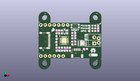
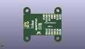
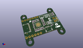

Contents
========

* [PROJ-SPAR-15801-STAN-01>Power Delivery Board-USB-C](#proj-spar-15801-stan-01power-delivery-board-usb-c)
	* [Images](#images)
	* [Interactive BOM](#interactive-bom)
	* [OOMP Parts](#oomp-parts)
	* [Tags](#tags)
  
![][im]
# PROJ-SPAR-15801-STAN-01>Power Delivery Board-USB-C

- ID: PROJ-SPAR-15801-STAN-01
- Hex ID: PRS15801
- Name: Power Delivery Board-USB-C
- Description: 

## Images
  
  

|eagleImage|kicadPcb3dFront|kicadPcb3dBack|kicadPcb3d|
| :---: | :---: | :---: | :---: |
|||||

## Interactive BOM

- Interactive BOM page: [ibom.html](kicad/bom/ibom.html)

## OOMP Parts
  

|OOMP Parts|
| :---: |
|CAPC-0603-X-UNMATCHED-01, C1, 13.208, 21.462999999999997, 90,C1, 1.0uF, 0603, SparkFun-Capacitors, (0.52, 0.845), R90|
|CAPC-0603-X-UNMATCHED-01, C2, 16.256, 21.462999999999997, 90,C2, 1.0uF, 0603, SparkFun-Capacitors, (0.64, 0.845), R90|
|<table><tr><td></td><td> C3</td><td>[CAPC-0603-X-NF100-V50 SMD (0603) 100 nF Capacitor (Ceramic) 50v](https://github.com/oomlout/oomlout_OOMP_parts/tree/main/CAPC-0603-X-NF100-V50/)</td><td>[C6N100](https://github.com/oomlout/oomlout_OOMP_parts/tree/main/CAPC-0603-X-NF100-V50/)</td></tr></table>|
|CAPC-0603-X-UNMATCHED-01, C6, 11.684, 21.462999999999997, 90,C6, 1.0uF, 0603, SparkFun-Capacitors, (0.46, 0.845), R90|
|UNMATCHED-0603-X-UNMATCHED-01, D1, 29.590999999999998, 21.971, 180,D1, BLUE, LED-0603, SparkFun-LED, (1.165, 0.865), R180|
|UNMATCHED-0603-X-UNMATCHED-01, D2, 29.590999999999998, 23.495, 180,D2, Yellow, LED-0603, SparkFun-LED, (1.165, 0.925), R180|
|UNMATCHED-0603-X-UNMATCHED-01, D3, 29.590999999999998, 25.019, 180,D3, GREEN, LED-0603, SparkFun-LED, (1.165, 0.985), R180|
|UNMATCHED-UNMATCHED-X-UNMATCHED-01, D4, 14.731999999999998, 21.462999999999997, 270,D4, BAT60A, SOD-323, SparkFun-DiscreteSemi, (0.58, 0.845), R270|
|UNMATCHED-0603-X-UNMATCHED-01, D5, 10.16, 21.462999999999997, 270,D5, 24V, 0603, SparkFun-DiscreteSemi, (0.4, 0.845), R270|
|UNMATCHED-0603-X-UNMATCHED-01, D6, 10.16, 18.160999999999998, 270,D6, 24V, 0603, SparkFun-DiscreteSemi, (0.4, 0.715), R270|
|UNMATCHED-0603-X-UNMATCHED-01, D7, 10.16, 14.858999999999998, 90,D7, 24V, 0603, SparkFun-DiscreteSemi, (0.4, 0.585), R90|
|UNMATCHED-0603-X-UNMATCHED-01, D8, 26.542999999999996, 11.684, 180,D8, 24V, 0603, SparkFun-DiscreteSemi, (1.045, 0.46), R180|
|UNMATCHED-UNMATCHED-X-UNMATCHED-01, J1, 6.35, 16.509999999999998, 270,J1, USB-C-16P, SparkFun-Connectors, (0.25, 0.65), R270|
|UNMATCHED-UNMATCHED-X-UNMATCHED-01, J3, 1.27, 7.619999999999999, 0,J3, 1X06_NO_SILK, SparkFun-Connectors, (0.05, 0.3), R0|
|UNMATCHED-UNMATCHED-X-UNMATCHED-01, J4, 21.843999999999998, 11.302999999999999, 0,J4, QWIIC, JST04_1MM_RA, SparkFun-Connectors, (0.86, 0.445), R0|
|UNMATCHED-UNMATCHED-X-UNMATCHED-01, J5, 31.496, 14.858999999999998, 90,J5, SCREWTERMINAL-3.5MM-2, SparkFun-Connectors, (1.24, 0.585), R90|
|UNMATCHED-UNMATCHED-X-UNMATCHED-01, J6, 33.909, 15.239999999999998, 90,J6, 1X02_NO_SILK, SparkFun-Connectors, (1.335, 0.6), R90|
|UNMATCHED-UNMATCHED-X-UNMATCHED-01, J7, 1.27, 25.4, 0,J7, 1X07_NO_SILK, SparkFun-Connectors, (0.05, 1), R0|
|UNMATCHED-UNMATCHED-X-UNMATCHED-01, JP1, 21.209, 9.143999999999998, M180,JP1, SMT-JUMPER_3_2-NC_TRACE_NO-SILK, SparkFun-Jumpers, (0.835, 0.36), MR180|
|UNMATCHED-UNMATCHED-X-UNMATCHED-01, JP2, 20.955, 16.764, M270,JP2, SMT-JUMPER_2_NC_TRACE_NO-SILK, SparkFun-Jumpers, (0.825, 0.66), MR270|
|UNMATCHED-UNMATCHED-X-UNMATCHED-01, JP3, 19.304, 16.764, M270,JP3, SMT-JUMPER_2_NC_TRACE_NO-SILK, SparkFun-Jumpers, (0.76, 0.66), MR270|
|UNMATCHED-UNMATCHED-X-UNMATCHED-01, Q1, 24.002999999999997, 14.985999999999999, 270,Q1, 9A/30V/15m?, 8-POWERVDFN-3X3, SparkFun-DiscreteSemi, (0.945, 0.59), R270|
|<table><tr><td></td><td> R1</td><td>[RESE-0603-X-O104-01 SMD (0603) 100k Ohm Resistor](https://github.com/oomlout/oomlout_OOMP_parts/tree/main/RESE-0603-X-O104-01/)</td><td>[R6104](https://github.com/oomlout/oomlout_OOMP_parts/tree/main/RESE-0603-X-O104-01/)</td></tr></table>|
|<table><tr><td></td><td> R2</td><td>[RESE-0603-X-O104-01 SMD (0603) 100k Ohm Resistor](https://github.com/oomlout/oomlout_OOMP_parts/tree/main/RESE-0603-X-O104-01/)</td><td>[R6104](https://github.com/oomlout/oomlout_OOMP_parts/tree/main/RESE-0603-X-O104-01/)</td></tr></table>|
|RESE-0603-X-UNMATCHED-01, R3, 19.939, 19.304, 0,R3, 1k, 0603, SparkFun-Resistors, (0.785, 0.76), R0|
|<table><tr><td></td><td> R4</td><td>[RESE-0603-X-O223-01 SMD (0603) 22k Ohm Resistor](https://github.com/oomlout/oomlout_OOMP_parts/tree/main/RESE-0603-X-O223-01/)</td><td>[R6223](https://github.com/oomlout/oomlout_OOMP_parts/tree/main/RESE-0603-X-O223-01/)</td></tr></table>|
|<table><tr><td></td><td> R5</td><td>[RESE-0603-X-O104-01 SMD (0603) 100k Ohm Resistor](https://github.com/oomlout/oomlout_OOMP_parts/tree/main/RESE-0603-X-O104-01/)</td><td>[R6104](https://github.com/oomlout/oomlout_OOMP_parts/tree/main/RESE-0603-X-O104-01/)</td></tr></table>|
|RESE-0603-X-UNMATCHED-01, R6, 19.939, 14.350999999999997, 180,R6, 100, 0603, SparkFun-Resistors, (0.785, 0.565), R180|
|RESE-0603-X-UNMATCHED-01, R7, 16.256, 11.557, 90,R7, 1k, 0603, SparkFun-Resistors, (0.64, 0.455), R90|
|<table><tr><td></td><td> R8</td><td>[RESE-0603-X-O104-01 SMD (0603) 100k Ohm Resistor](https://github.com/oomlout/oomlout_OOMP_parts/tree/main/RESE-0603-X-O104-01/)</td><td>[R6104](https://github.com/oomlout/oomlout_OOMP_parts/tree/main/RESE-0603-X-O104-01/)</td></tr></table>|
|RESE-0603-X-UNMATCHED-01, R9, 10.16, 11.557, 270,R9, 2.2k, 0603, SparkFun-Resistors, (0.4, 0.455), R270|
|RESE-0603-X-UNMATCHED-01, R10, 11.684, 11.557, 270,R10, 2.2k, 0603, SparkFun-Resistors, (0.46, 0.455), R270|
|RESE-0603-X-UNMATCHED-01, R11, 32.892999999999994, 23.495, 0,R11, 1k, 0603, SparkFun-Resistors, (1.295, 0.925), R0|
|RESE-0603-X-UNMATCHED-01, R12, 32.892999999999994, 25.019, 0,R12, 1k, 0603, SparkFun-Resistors, (1.295, 0.985), R0|
|RESE-0603-X-UNMATCHED-01, R13, 32.892999999999994, 21.971, 0,R13, 1k, 0603, SparkFun-Resistors, (1.295, 0.865), R0|
|UNMATCHED-UNMATCHED-X-UNMATCHED-01, S1, 20.700999999999997, 24.764999999999997, 180,S1, TACTILE_SWITCH_SMD_4.6X2.8MM, SparkFun-Switches, (0.815, 0.975), R180|
|UNMATCHED-UNMATCHED-X-UNMATCHED-01, U1, 14.477999999999998, 16.509999999999998, 0,U1, STUSB4500, QFN-24, SparkFun-IC-Power, (0.57, 0.65), R0|

## Tags

- hexID: PRS15801
- oompType: PROJ
- oompSize: SPAR
- oompColor: 15801
- oompDesc: STAN
- oompIndex: 01
- oompName: Power Delivery Board-USB-C
- sources: All source files from https://github.com/sparkfun/Power_Delivery_Board-USB-C (source licence details in srcLicense.md)
- linkBuyPage: https://www.sparkfun.com/products/15801
- oompID: PROJ-SPAR-15801-STAN-01
- oompPart: CAPC-0603-X-UNMATCHED-01, C1, 13.208, 21.462999999999997, 90
- oompPart: CAPC-0603-X-UNMATCHED-01, C2, 16.256, 21.462999999999997, 90
- oompPart: CAPC-0603-X-NF100-V50, C3, 17.779999999999998, 11.557, 90
- oompPart: CAPC-0603-X-UNMATCHED-01, C6, 11.684, 21.462999999999997, 90
- oompPart: UNMATCHED-0603-X-UNMATCHED-01, D1, 29.590999999999998, 21.971, 180
- oompPart: UNMATCHED-0603-X-UNMATCHED-01, D2, 29.590999999999998, 23.495, 180
- oompPart: UNMATCHED-0603-X-UNMATCHED-01, D3, 29.590999999999998, 25.019, 180
- oompPart: UNMATCHED-UNMATCHED-X-UNMATCHED-01, D4, 14.731999999999998, 21.462999999999997, 270
- oompPart: UNMATCHED-0603-X-UNMATCHED-01, D5, 10.16, 21.462999999999997, 270
- oompPart: UNMATCHED-0603-X-UNMATCHED-01, D6, 10.16, 18.160999999999998, 270
- oompPart: UNMATCHED-0603-X-UNMATCHED-01, D7, 10.16, 14.858999999999998, 90
- oompPart: UNMATCHED-0603-X-UNMATCHED-01, D8, 26.542999999999996, 11.684, 180
- oompPart: SKIP-UNMATCHED-X-UNMATCHED-01, FD1, 2.54, 11.049, 0
- oompPart: SKIP-UNMATCHED-X-UNMATCHED-01, FD2, 34.925, 26.162, 0
- oompPart: SKIP-UNMATCHED-X-UNMATCHED-01, FD3, 34.925, 26.162, M0
- oompPart: SKIP-UNMATCHED-X-UNMATCHED-01, FD4, 2.54, 11.049, M0
- oompPart: UNMATCHED-UNMATCHED-X-UNMATCHED-01, J1, 6.35, 16.509999999999998, 270
- oompPart: UNMATCHED-UNMATCHED-X-UNMATCHED-01, J3, 1.27, 7.619999999999999, 0
- oompPart: UNMATCHED-UNMATCHED-X-UNMATCHED-01, J4, 21.843999999999998, 11.302999999999999, 0
- oompPart: UNMATCHED-UNMATCHED-X-UNMATCHED-01, J5, 31.496, 14.858999999999998, 90
- oompPart: UNMATCHED-UNMATCHED-X-UNMATCHED-01, J6, 33.909, 15.239999999999998, 90
- oompPart: UNMATCHED-UNMATCHED-X-UNMATCHED-01, J7, 1.27, 25.4, 0
- oompPart: UNMATCHED-UNMATCHED-X-UNMATCHED-01, JP1, 21.209, 9.143999999999998, M180
- oompPart: UNMATCHED-UNMATCHED-X-UNMATCHED-01, JP2, 20.955, 16.764, M270
- oompPart: UNMATCHED-UNMATCHED-X-UNMATCHED-01, JP3, 19.304, 16.764, M270
- oompPart: UNMATCHED-UNMATCHED-X-UNMATCHED-01, Q1, 24.002999999999997, 14.985999999999999, 270
- oompPart: RESE-0603-X-O104-01, R1, 13.208, 11.557, 270
- oompPart: RESE-0603-X-O104-01, R2, 14.731999999999998, 11.557, 270
- oompPart: RESE-0603-X-UNMATCHED-01, R3, 19.939, 19.304, 0
- oompPart: RESE-0603-X-O223-01, R4, 19.939, 15.875, 0
- oompPart: RESE-0603-X-O104-01, R5, 19.939, 17.779999999999998, 0
- oompPart: RESE-0603-X-UNMATCHED-01, R6, 19.939, 14.350999999999997, 180
- oompPart: RESE-0603-X-UNMATCHED-01, R7, 16.256, 11.557, 90
- oompPart: RESE-0603-X-O104-01, R8, 19.939, 20.827999999999996, 0
- oompPart: RESE-0603-X-UNMATCHED-01, R9, 10.16, 11.557, 270
- oompPart: RESE-0603-X-UNMATCHED-01, R10, 11.684, 11.557, 270
- oompPart: RESE-0603-X-UNMATCHED-01, R11, 32.892999999999994, 23.495, 0
- oompPart: RESE-0603-X-UNMATCHED-01, R12, 32.892999999999994, 25.019, 0
- oompPart: RESE-0603-X-UNMATCHED-01, R13, 32.892999999999994, 21.971, 0
- oompPart: UNMATCHED-UNMATCHED-X-UNMATCHED-01, S1, 20.700999999999997, 24.764999999999997, 180
- oompPart: UNMATCHED-UNMATCHED-X-UNMATCHED-01, U1, 14.477999999999998, 16.509999999999998, 0
- rawPart: C1, 1.0uF, 0603, SparkFun-Capacitors, (0.52, 0.845), R90
- rawPart: C2, 1.0uF, 0603, SparkFun-Capacitors, (0.64, 0.845), R90
- rawPart: C3, 0.1uF, 0603, SparkFun-Capacitors, (0.7, 0.455), R90
- rawPart: C6, 1.0uF, 0603, SparkFun-Capacitors, (0.46, 0.845), R90
- rawPart: D1, BLUE, LED-0603, SparkFun-LED, (1.165, 0.865), R180
- rawPart: D2, Yellow, LED-0603, SparkFun-LED, (1.165, 0.925), R180
- rawPart: D3, GREEN, LED-0603, SparkFun-LED, (1.165, 0.985), R180
- rawPart: D4, BAT60A, SOD-323, SparkFun-DiscreteSemi, (0.58, 0.845), R270
- rawPart: D5, 24V, 0603, SparkFun-DiscreteSemi, (0.4, 0.845), R270
- rawPart: D6, 24V, 0603, SparkFun-DiscreteSemi, (0.4, 0.715), R270
- rawPart: D7, 24V, 0603, SparkFun-DiscreteSemi, (0.4, 0.585), R90
- rawPart: D8, 24V, 0603, SparkFun-DiscreteSemi, (1.045, 0.46), R180
- rawPart: FD1, FIDUCIALUFIDUCIAL, FIDUCIAL-MICRO, SparkFun-Aesthetics, (0.1, 0.435), R0
- rawPart: FD2, FIDUCIALUFIDUCIAL, FIDUCIAL-MICRO, SparkFun-Aesthetics, (1.375, 1.03), R0
- rawPart: FD3, FIDUCIALUFIDUCIAL, FIDUCIAL-MICRO, SparkFun-Aesthetics, (1.375, 1.03), MR0
- rawPart: FD4, FIDUCIALUFIDUCIAL, FIDUCIAL-MICRO, SparkFun-Aesthetics, (0.1, 0.435), MR0
- rawPart: J1, USB-C-16P, SparkFun-Connectors, (0.25, 0.65), R270
- rawPart: J3, 1X06_NO_SILK, SparkFun-Connectors, (0.05, 0.3), R0
- rawPart: J4, QWIIC, JST04_1MM_RA, SparkFun-Connectors, (0.86, 0.445), R0
- rawPart: J5, SCREWTERMINAL-3.5MM-2, SparkFun-Connectors, (1.24, 0.585), R90
- rawPart: J6, 1X02_NO_SILK, SparkFun-Connectors, (1.335, 0.6), R90
- rawPart: J7, 1X07_NO_SILK, SparkFun-Connectors, (0.05, 1), R0
- rawPart: JP1, SMT-JUMPER_3_2-NC_TRACE_NO-SILK, SparkFun-Jumpers, (0.835, 0.36), MR180
- rawPart: JP2, SMT-JUMPER_2_NC_TRACE_NO-SILK, SparkFun-Jumpers, (0.825, 0.66), MR270
- rawPart: JP3, SMT-JUMPER_2_NC_TRACE_NO-SILK, SparkFun-Jumpers, (0.76, 0.66), MR270
- rawPart: Q1, 9A/30V/15m?, 8-POWERVDFN-3X3, SparkFun-DiscreteSemi, (0.945, 0.59), R270
- rawPart: R1, 100k, 0603, SparkFun-Resistors, (0.52, 0.455), R270
- rawPart: R2, 100k, 0603, SparkFun-Resistors, (0.58, 0.455), R270
- rawPart: R3, 1k, 0603, SparkFun-Resistors, (0.785, 0.76), R0
- rawPart: R4, 22k, 0603, SparkFun-Resistors, (0.785, 0.625), R0
- rawPart: R5, 100k, 0603, SparkFun-Resistors, (0.785, 0.7), R0
- rawPart: R6, 100, 0603, SparkFun-Resistors, (0.785, 0.565), R180
- rawPart: R7, 1k, 0603, SparkFun-Resistors, (0.64, 0.455), R90
- rawPart: R8, 100k, 0603, SparkFun-Resistors, (0.785, 0.82), R0
- rawPart: R9, 2.2k, 0603, SparkFun-Resistors, (0.4, 0.455), R270
- rawPart: R10, 2.2k, 0603, SparkFun-Resistors, (0.46, 0.455), R270
- rawPart: R11, 1k, 0603, SparkFun-Resistors, (1.295, 0.925), R0
- rawPart: R12, 1k, 0603, SparkFun-Resistors, (1.295, 0.985), R0
- rawPart: R13, 1k, 0603, SparkFun-Resistors, (1.295, 0.865), R0
- rawPart: S1, TACTILE_SWITCH_SMD_4.6X2.8MM, SparkFun-Switches, (0.815, 0.975), R180
- rawPart: U1, STUSB4500, QFN-24, SparkFun-IC-Power, (0.57, 0.65), R0

[im]: kicadPcb3d_450.png
