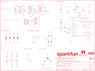

Contents
========

* [PRS15801 > Power Delivery Board-USB-C](#prs15801--power-delivery-board-usb-c)
	* [Schematic](#schematic)
	* [PCB](#pcb)
	* [Interactive BOM](#interactive-bom)
	* [Images](#images)
	* [Tags](#tags)
  
![][im]
# PRS15801 > Power Delivery Board-USB-C

- ID: PROJ-SPAR-15801-STAN-01
- Hex ID: PRS15801
- Name: Sparkfun
- Description: Sparkfun
- Long Link: [http://oom.lt/PROJ-SPAR-15801-STAN-01](http://oom.lt/PROJ-SPAR-15801-STAN-01)
- Short Link: [http://oom.lt/PRS15801](http://oom.lt/PRS15801)

## Schematic
  

## PCB
  

## Interactive BOM

- Interactive BOM page: [ibom.html](https://htmlpreview.github.io/?https://github.com/oomlout/oomlout_OOMP_projects/blob/main/PROJ-SPAR-15801-STAN-01/kicad/bom/ibom.html)

## Images
  
  

|bominteractivefront|bominteractiveback|kicadPcb3d|kicadPcb3dFront|kicadPcb3dBack|eagleImage|eagleSchemImage|pcbdraw|pcbdrawback|
| :---: | :---: | :---: | :---: | :---: | :---: | :---: | :---: | :---: |
||||||||||

## Tags

- hexID: PRS15801
- oompType: PROJ
- oompSize: SPAR
- oompColor: 15801
- oompDesc: STAN
- oompIndex: 01
- oompName: Power Delivery Board-USB-C
- sources: All source files from https://github.com/sparkfun/Power_Delivery_Board-USB-C (source licence details in srcLicense.md)
- linkBuyPage: https://www.sparkfun.com/products/15801
- oompID: PROJ-SPAR-15801-STAN-01
- rawParts: C1,1.0uF,1.0UF-0603-16V-10%,0603,1µF ceramic capacitors,,CAP-00868,,1.0uF,
- rawParts: C2,1.0uF,1.0UF-0603-16V-10%,0603,1µF ceramic capacitors,,CAP-00868,,1.0uF,
- rawParts: C3,0.1uF,0.1UF-0603-100V-10%,0603,0.1µF ceramic capacitors,,CAP-08390,,0.1uF,
- rawParts: C6,1.0uF,1.0UF-0603-16V-10%,0603,1µF ceramic capacitors,,CAP-00868,,1.0uF,
- rawParts: D1,BLUE,LED-BLUE0603,LED-0603,Blue SMD LED,,DIO-08575,,BLUE,
- rawParts: D2,Yellow,LED-YELLOW0603,LED-0603,Yellow SMD LED,,DIO-09003,,Yellow,
- rawParts: D3,GREEN,LED-GREEN0603,LED-0603,Green SMD LED,,DIO-00821,,GREEN,
- rawParts: D4,BAT60A,DIODE-SCHOTTKY-BAT60A,SOD-323,Schottky diode,,DIO-14072,,3A/10V/280mV,
- rawParts: D5,24V,DIODE_TVS,0603,,,DIO-14502,,24V,
- rawParts: D6,24V,DIODE_TVS,0603,,,DIO-14502,,24V,
- rawParts: D7,24V,DIODE_TVS,0603,,,DIO-14502,,24V,
- rawParts: D8,24V,DIODE_TVS,0603,,,DIO-14502,,24V,
- rawParts: FD1,FIDUCIALUFIDUCIAL,FIDUCIALUFIDUCIAL,FIDUCIAL-MICRO,Fiducial Alignment Points,,,,,
- rawParts: FD2,FIDUCIALUFIDUCIAL,FIDUCIALUFIDUCIAL,FIDUCIAL-MICRO,Fiducial Alignment Points,,,,,
- rawParts: FD3,FIDUCIALUFIDUCIAL,FIDUCIALUFIDUCIAL,FIDUCIAL-MICRO,Fiducial Alignment Points,,,,,
- rawParts: FD4,FIDUCIALUFIDUCIAL,FIDUCIALUFIDUCIAL,FIDUCIAL-MICRO,Fiducial Alignment Points,,,,,
- rawParts: FRAME1,FRAME-LETTER,FRAME-LETTER,CREATIVE_COMMONS,Schematic Frame - Letter,,,,,
- rawParts: H1,STAND-OFF,STAND-OFF,STAND-OFF,Stand Off,,,,,
- rawParts: H2,STAND-OFF,STAND-OFF,STAND-OFF,Stand Off,,,,,
- rawParts: H3,STAND-OFF,STAND-OFF,STAND-OFF,Stand Off,,,,,
- rawParts: H4,STAND-OFF,STAND-OFF,STAND-OFF,Stand Off,,,,,
- rawParts: J1,,USB_C2-LAYER,USB-C-16P,USB Type C 16Pin Connector,,CONN-14122,,,
- rawParts: J3,,CONN_06NO_SILK_NO_POP,1X06_NO_SILK,Multi connection point. Often used as Generic Header-pin footprint for 0.1 inch spaced/style header connections,,,,,
- rawParts: J4,QWIIC,QWIIC_CONNECTORJS-1MM,JST04_1MM_RA,SparkFun I2C Standard Qwiic Connector,,CONN-13694,,QWIIC_RIGHT_ANGLE,
- rawParts: J5,,CONN_023.5MM,SCREWTERMINAL-3.5MM-2,Multi connection point. Often used as Generic Header-pin footprint for 0.1 inch spaced/style header connections,,CONN-08399,,,
- rawParts: J6,,CONN_021X02_NO_SILK,1X02_NO_SILK,Multi connection point. Often used as Generic Header-pin footprint for 0.1 inch spaced/style header connections,,,,,
- rawParts: J7,,CONN_07NO_SILK,1X07_NO_SILK,Multi connection point. Often used as Generic Header-pin footprint for 0.1 inch spaced/style header connections,,,,,
- rawParts: JP1,,JUMPER-SMT_3_2-NC_TRACE_NO-SILK,SMT-JUMPER_3_2-NC_TRACE_NO-SILK,Normally closed trace jumper (2 of 2 connections),,,,,
- rawParts: JP2,,JUMPER-SMT_2_NC_TRACE_NO-SILK,SMT-JUMPER_2_NC_TRACE_NO-SILK,Normally closed trace jumper,,,,,
- rawParts: JP3,,JUMPER-SMT_2_NC_TRACE_NO-SILK,SMT-JUMPER_2_NC_TRACE_NO-SILK,Normally closed trace jumper,,,,,
- rawParts: LOGO1,OSHW-LOGOS,OSHW-LOGOS,OSHW-LOGO-S,Open-Source Hardware (OSHW) Logo,,,,,
- rawParts: LOGO2,SFE_LOGO_NAME.1_INCH,SFE_LOGO_NAME.1_INCH,SFE_LOGO_NAME_.1,SparkFun Font Logo,,,,,
- rawParts: LOGO3,QWIIC_LOGO_5MM,QWIIC_LOGO_5MM,QWIIC_5MM,Qwiic Logos for placement on schematic and PCB. The 5.5mm silk logo is best for placing next to Qwiic connector.,,,,,
- rawParts: Q1,9A/30V/15mΩ,MOSFET_PCH-STL9P3LLH6,8-POWERVDFN-3X3,P-channel MOSFETs,,TRANS-14715,,9A/30V/15mΩ,
- rawParts: R1,100k,100KOHM-0603-1/10W-1%,0603,100kΩ resistor,,RES-07828,,100k,
- rawParts: R2,100k,100KOHM-0603-1/10W-1%,0603,100kΩ resistor,,RES-07828,,100k,
- rawParts: R3,1k,1KOHM-0603-1/10W-1%,0603,1kΩ resistor,,RES-07856,,1k,
- rawParts: R4,22k,22KOHM-0603-1/10W-1%,0603,22kΩ resistor,,RES-07853,,22k,
- rawParts: R5,100k,100KOHM-0603-1/10W-1%,0603,100kΩ resistor,,RES-07828,,100k,
- rawParts: R6,100,100OHM-0603-1/10W-1%,0603,100Ω resistor,,RES-07863,,100,
- rawParts: R7,1k,1KOHM-0603-1/10W-1%,0603,1kΩ resistor,,RES-07856,,1k,
- rawParts: R8,100k,100KOHM-0603-1/10W-1%,0603,100kΩ resistor,,RES-07828,,100k,
- rawParts: R9,2.2k,2.2KOHM-0603-1/10W-1%,0603,2.2kΩ resistor,,RES-08272,,2.2k,
- rawParts: R10,2.2k,2.2KOHM-0603-1/10W-1%,0603,2.2kΩ resistor,,RES-08272,,2.2k,
- rawParts: R11,1k,1KOHM-0603-1/10W-1%,0603,1kΩ resistor,,RES-07856,,1k,
- rawParts: R12,1k,1KOHM-0603-1/10W-1%,0603,1kΩ resistor,,RES-07856,,1k,
- rawParts: R13,1k,1KOHM-0603-1/10W-1%,0603,1kΩ resistor,,RES-07856,,1k,
- rawParts: S1,,MOMENTARY-SWITCH-SPST-SMD-4.6X2.8MM,TACTILE_SWITCH_SMD_4.6X2.8MM,Momentary Switch (Pushbutton) - SPST,,SWCH-13065,,,
- rawParts: U1,STUSB4500,STUSB4500,QFN-24,,,IC-14684,,STUSB4500,

[im]: kicadPcb3d_450.png
