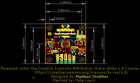
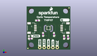
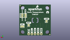
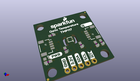

Contents
========

* [PROJ-SPAR-15805-STAN-01>SparkFun High Precision Temperature Sensor TMP117 Qwiic](#proj-spar-15805-stan-01sparkfun-high-precision-temperature-sensor-tmp117-qwiic)
	* [Images](#images)
	* [Interactive BOM](#interactive-bom)
	* [OOMP Parts](#oomp-parts)
	* [Tags](#tags)
  
![][im]
# PROJ-SPAR-15805-STAN-01>SparkFun High Precision Temperature Sensor TMP117 Qwiic

- ID: PROJ-SPAR-15805-STAN-01
- Hex ID: PRS15805
- Name: SparkFun High Precision Temperature Sensor TMP117 Qwiic
- Description: 

## Images
  
  

|eagleImage|kicadPcb3dFront|kicadPcb3dBack|kicadPcb3d|
| :---: | :---: | :---: | :---: |
|||||

## Interactive BOM

- Interactive BOM page: [ibom.html](kicad/bom/ibom.html)

## OOMP Parts
  

|OOMP Parts|
| :---: |
|<table><tr><td></td><td> C1</td><td>[CAPC-0603-X-NF100-V50 SMD (0603) 100 nF Capacitor (Ceramic) 50v](https://github.com/oomlout/oomlout_OOMP_parts/tree/main/CAPC-0603-X-NF100-V50/)</td><td>[C6N100](https://github.com/oomlout/oomlout_OOMP_parts/tree/main/CAPC-0603-X-NF100-V50/)</td></tr></table>|
|UNMATCHED-0603-X-UNMATCHED-01, D1, 2.1843999999999997, 7.9756, 0,D1, RED, LED-0603, SparkFun-LED, (0.086, 0.314), R0|
|UNMATCHED-UNMATCHED-X-UNMATCHED-01, I2C, 22.8854, 7.340599999999999, M0,I2C, SMT-JUMPER_3_2-NC_TRACE_SILK, SparkFun-Jumpers, (0.901, 0.289), MR0|
|UNMATCHED-UNMATCHED-X-UNMATCHED-01, J1, 7.619999999999999, 1.27, 0,J1, PTH, 1X04_NO_SILK, SparkFun-Connectors, (0.3, 0.05), R0|
|UNMATCHED-UNMATCHED-X-UNMATCHED-01, J2, 20.32, 12.7, 90,J2, QWIIC_RA, JST04_1MM_RA, SparkFun-Connectors, (0.8, 0.5), R90|
|UNMATCHED-UNMATCHED-X-UNMATCHED-01, J3, 5.08, 12.7, 270,J3, QWIIC_RA, JST04_1MM_RA, SparkFun-Connectors, (0.2, 0.5), R270|
|UNMATCHED-UNMATCHED-X-UNMATCHED-01, J4, 17.779999999999998, 1.27, 0,J4, 1X01_NO_SILK, SparkFun-Connectors, (0.7, 0.05), R0|
|UNMATCHED-UNMATCHED-X-UNMATCHED-01, JP1, 3.429, 11.6586, M90,JP1, LED, SMT-JUMPER_2_NC_TRACE_SILK, SparkFun-Jumpers, (0.135, 0.459), MR90|
|UNMATCHED-UNMATCHED-X-UNMATCHED-01, JP4, 20.3962, 16.383, M90,JP4, JUMPER-SMT_3_1-NC_TRACE_NO-SILK, SMT-JUMPER_3_1-NC_TRACE_NO-SILK, SparkFun-Jumpers, (0.803, 0.645), MR90|
|UNMATCHED-UNMATCHED-X-UNMATCHED-01, JP5, 22.8854, 16.383, M270,JP5, JUMPER-SMT_3_NO_NO_SILK, SMT-JUMPER_3_0-NO_TRACE_NO-SILK, SparkFun-Jumpers, (0.901, 0.645), MR270|
|UNMATCHED-UNMATCHED-X-UNMATCHED-01, JP10, 17.8054, 8.4582, M90,JP10, INT, SMT-JUMPER_2_NC_TRACE_SILK, SparkFun-Jumpers, (0.701, 0.333), MR90|
|RESE-0603-X-UNMATCHED-01, R1, 2.1590000000000003, 6.5024, 180,R1, 1k, 0603, SparkFun-Resistors, (0.085, 0.256), R180|
|<table><tr><td></td><td> R2</td><td>[RESE-0603-X-O103-01 SMD (0603) 10k Ohm Resistor](https://github.com/oomlout/oomlout_OOMP_parts/tree/main/RESE-0603-X-O103-01/)</td><td>[R6103](https://github.com/oomlout/oomlout_OOMP_parts/tree/main/RESE-0603-X-O103-01/)</td></tr></table>|
|<table><tr><td></td><td> R3</td><td>[RESE-0603-X-O103-01 SMD (0603) 10k Ohm Resistor](https://github.com/oomlout/oomlout_OOMP_parts/tree/main/RESE-0603-X-O103-01/)</td><td>[R6103](https://github.com/oomlout/oomlout_OOMP_parts/tree/main/RESE-0603-X-O103-01/)</td></tr></table>|
|RESE-0603-X-UNMATCHED-01, R4, 21.717, 7.238999999999999, 270,R4, 2.2k, 0603, SparkFun-Resistors, (0.855, 0.285), R270|
|RESE-0603-X-UNMATCHED-01, R5, 24.0538, 7.238999999999999, 270,R5, 2.2k, 0603, SparkFun-Resistors, (0.947, 0.285), R270|
|UNMATCHED-UNMATCHED-X-UNMATCHED-01, U1, 12.7, 12.7, 180,U1, TMP117, TMP117, SparkFun-Sensors, (0.5, 0.5), R180|

## Tags

- hexID: PRS15805
- oompType: PROJ
- oompSize: SPAR
- oompColor: 15805
- oompDesc: STAN
- oompIndex: 01
- oompName: SparkFun High Precision Temperature Sensor TMP117 Qwiic
- sources: All source files from https://github.com/sparkfun/SparkFun_High_Precision_Temperature_Sensor_TMP117_Qwiic (source licence details in srcLicense.md)
- linkBuyPage: https://www.sparkfun.com/products/15805
- oompPart: CAPC-0603-X-NF100-V50, C1, 9.524999999999999, 8.889999999999999, 270
- oompPart: UNMATCHED-0603-X-UNMATCHED-01, D1, 2.1843999999999997, 7.9756, 0
- oompPart: SKIP-UNMATCHED-X-UNMATCHED-01, FD1, 0.7111999999999999, 0.7111999999999999, 0
- oompPart: SKIP-UNMATCHED-X-UNMATCHED-01, FD2, 24.6634, 24.561799999999998, 0
- oompPart: SKIP-UNMATCHED-X-UNMATCHED-01, FD3, 24.6634, 24.561799999999998, M0
- oompPart: SKIP-UNMATCHED-X-UNMATCHED-01, FD4, 0.7111999999999999, 0.7111999999999999, M0
- oompPart: UNMATCHED-UNMATCHED-X-UNMATCHED-01, I2C, 22.8854, 7.340599999999999, M0
- oompPart: UNMATCHED-UNMATCHED-X-UNMATCHED-01, J1, 7.619999999999999, 1.27, 0
- oompPart: UNMATCHED-UNMATCHED-X-UNMATCHED-01, J2, 20.32, 12.7, 90
- oompPart: UNMATCHED-UNMATCHED-X-UNMATCHED-01, J3, 5.08, 12.7, 270
- oompPart: UNMATCHED-UNMATCHED-X-UNMATCHED-01, J4, 17.779999999999998, 1.27, 0
- oompPart: UNMATCHED-UNMATCHED-X-UNMATCHED-01, JP1, 3.429, 11.6586, M90
- oompPart: UNMATCHED-UNMATCHED-X-UNMATCHED-01, JP4, 20.3962, 16.383, M90
- oompPart: UNMATCHED-UNMATCHED-X-UNMATCHED-01, JP5, 22.8854, 16.383, M270
- oompPart: UNMATCHED-UNMATCHED-X-UNMATCHED-01, JP10, 17.8054, 8.4582, M90
- oompPart: RESE-0603-X-UNMATCHED-01, R1, 2.1590000000000003, 6.5024, 180
- oompPart: RESE-0603-X-O103-01, R2, 6.35, 17.145, 0
- oompPart: RESE-0603-X-O103-01, R3, 15.875, 8.889999999999999, 270
- oompPart: RESE-0603-X-UNMATCHED-01, R4, 21.717, 7.238999999999999, 270
- oompPart: RESE-0603-X-UNMATCHED-01, R5, 24.0538, 7.238999999999999, 270
- oompPart: UNMATCHED-UNMATCHED-X-UNMATCHED-01, U1, 12.7, 12.7, 180
- rawPart: C1, 0.1uF, 0603, SparkFun-Capacitors, (0.375, 0.35), R270
- rawPart: D1, RED, LED-0603, SparkFun-LED, (0.086, 0.314), R0
- rawPart: FD1, FIDUCIALUFIDUCIAL, FIDUCIAL-MICRO, SparkFun-Aesthetics, (0.028, 0.028), R0
- rawPart: FD2, FIDUCIALUFIDUCIAL, FIDUCIAL-MICRO, SparkFun-Aesthetics, (0.971, 0.967), R0
- rawPart: FD3, FIDUCIALUFIDUCIAL, FIDUCIAL-MICRO, SparkFun-Aesthetics, (0.971, 0.967), MR0
- rawPart: FD4, FIDUCIALUFIDUCIAL, FIDUCIAL-MICRO, SparkFun-Aesthetics, (0.028, 0.028), MR0
- rawPart: I2C, SMT-JUMPER_3_2-NC_TRACE_SILK, SparkFun-Jumpers, (0.901, 0.289), MR0
- rawPart: J1, PTH, 1X04_NO_SILK, SparkFun-Connectors, (0.3, 0.05), R0
- rawPart: J2, QWIIC_RA, JST04_1MM_RA, SparkFun-Connectors, (0.8, 0.5), R90
- rawPart: J3, QWIIC_RA, JST04_1MM_RA, SparkFun-Connectors, (0.2, 0.5), R270
- rawPart: J4, 1X01_NO_SILK, SparkFun-Connectors, (0.7, 0.05), R0
- rawPart: JP1, LED, SMT-JUMPER_2_NC_TRACE_SILK, SparkFun-Jumpers, (0.135, 0.459), MR90
- rawPart: JP4, JUMPER-SMT_3_1-NC_TRACE_NO-SILK, SMT-JUMPER_3_1-NC_TRACE_NO-SILK, SparkFun-Jumpers, (0.803, 0.645), MR90
- rawPart: JP5, JUMPER-SMT_3_NO_NO_SILK, SMT-JUMPER_3_0-NO_TRACE_NO-SILK, SparkFun-Jumpers, (0.901, 0.645), MR270
- rawPart: JP10, INT, SMT-JUMPER_2_NC_TRACE_SILK, SparkFun-Jumpers, (0.701, 0.333), MR90
- rawPart: R1, 1k, 0603, SparkFun-Resistors, (0.085, 0.256), R180
- rawPart: R2, 10k, 0603, SparkFun-Resistors, (0.25, 0.675), R0
- rawPart: R3, 10k, 0603, SparkFun-Resistors, (0.625, 0.35), R270
- rawPart: R4, 2.2k, 0603, SparkFun-Resistors, (0.855, 0.285), R270
- rawPart: R5, 2.2k, 0603, SparkFun-Resistors, (0.947, 0.285), R270
- rawPart: U1, TMP117, TMP117, SparkFun-Sensors, (0.5, 0.5), R180
- oompID: PROJ-SPAR-15805-STAN-01

[im]: kicadPcb3d_450.png
