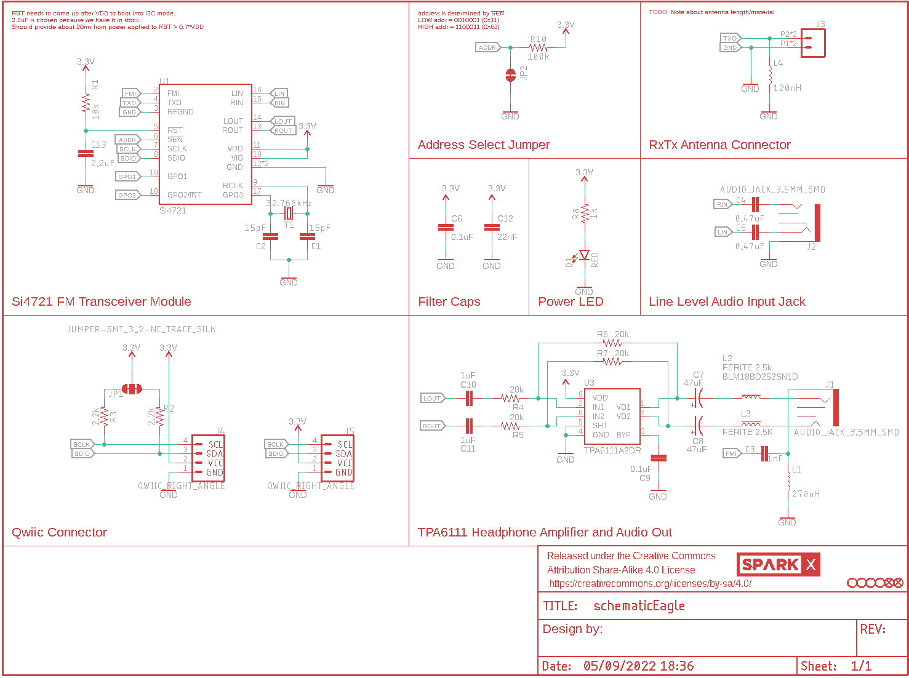
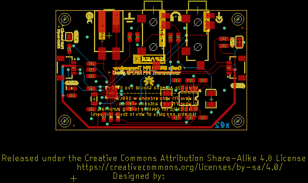
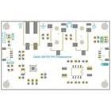
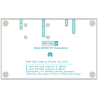
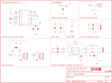
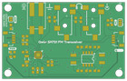
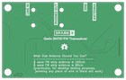

Contents
========

* [PRS15853 > Qwiic FM Transceiver Si4721](#prs15853--qwiic-fm-transceiver-si4721)
	* [Schematic](#schematic)
	* [PCB](#pcb)
	* [Interactive BOM](#interactive-bom)
	* [Images](#images)
	* [Tags](#tags)
  
![][im]
# PRS15853 > Qwiic FM Transceiver Si4721

- ID: PROJ-SPAR-15853-STAN-01
- Hex ID: PRS15853
- Name: Sparkfun
- Description: Sparkfun
- Long Link: [http://oom.lt/PROJ-SPAR-15853-STAN-01](http://oom.lt/PROJ-SPAR-15853-STAN-01)
- Short Link: [http://oom.lt/PRS15853](http://oom.lt/PRS15853)

## Schematic
  

## PCB
  

## Interactive BOM

- Interactive BOM page: [ibom.html](https://htmlpreview.github.io/?https://github.com/oomlout/oomlout_OOMP_projects/blob/main/PROJ-SPAR-15853-STAN-01/kicad/bom/ibom.html)

## Images
  
  

|bominteractivefront|bominteractiveback|kicadPcb3d|kicadPcb3dFront|kicadPcb3dBack|eagleImage|eagleSchemImage|pcbdraw|pcbdrawback|
| :---: | :---: | :---: | :---: | :---: | :---: | :---: | :---: | :---: |
||||||||||

## Tags

- hexID: PRS15853
- oompType: PROJ
- oompSize: SPAR
- oompColor: 15853
- oompDesc: STAN
- oompIndex: 01
- oompName: Qwiic FM Transceiver Si4721
- sources: All source files from https://github.com/sparkfun/Qwiic_FM_Transceiver_Si4721 (source licence details in srcLicense.md)
- linkBuyPage: https://www.sparkfun.com/products/15853
- oompID: PROJ-SPAR-15853-STAN-01
- rawParts: C1,15pF,15PF-0603-50V-5%,0603,15pF ceramic capacitors,,CAP-07881,,15pF,
- rawParts: C2,15pF,15PF-0603-50V-5%,0603,15pF ceramic capacitors,,CAP-07881,,15pF,
- rawParts: C3,1nF,1.0NF/1000PF-0603-50V-10%,0603,1nF/1,000pF ceramic capacitors,,CAP-07886,,1nF,
- rawParts: C4,0.47uF,CAP-0603,0603,,,,,,
- rawParts: C5,0.47uF,CAP-0603,0603,,,,,,
- rawParts: C6,0.1uF,0.1UF-0603-25V-(+80/-20%),0603,0.1µF ceramic capacitors,,CAP-00810,,0.1uF,
- rawParts: C7,47uF,47UF-POLAR-EIA3528-10V-10%,EIA3528,47µF polarized capacitors,,CAP-08310,,47uF,
- rawParts: C8,47uF,47UF-POLAR-EIA3528-10V-10%,EIA3528,47µF polarized capacitors,,CAP-08310,,47uF,
- rawParts: C9,0.1uF,0.1UF-0603-25V-(+80/-20%),0603,0.1µF ceramic capacitors,,CAP-00810,,0.1uF,
- rawParts: C10,1uF,1.0UF-16V-10%(0603),0603-CAP,CAP-00868,,CAP-00868,,1.0uF,
- rawParts: C11,1uF,1.0UF-16V-10%(0603),0603-CAP,CAP-00868,,CAP-00868,,1.0uF,
- rawParts: C12,22nF,22NF/22,000PF-0603-50V-10%,0603,0.022uF/22nF/22,000pF ceramic capacitors,,CAP-07885,,22nF,
- rawParts: C13,2.2uF,2.2UF-0603-10V-20%,0603,2.2µF ceramic capacitors,,CAP-07888,,2.2uF,
- rawParts: D1,RED,LED-RED0603,LED-0603,Red SMD LED,,DIO-00819,,RED,
- rawParts: FD1,FIDUCIAL0.2MM,FIDUCIAL0.2MM,FIDUCIAL-0.2MM,Fiducial Alignment Points,,,,,
- rawParts: FD2,FIDUCIAL0.2MM,FIDUCIAL0.2MM,FIDUCIAL-0.2MM,Fiducial Alignment Points,,,,,
- rawParts: FRAME1,FRAME-LETTER,FRAME-LETTER,CREATIVE_COMMONS,Schematic Frame - Letter,,,,,
- rawParts: H1,STAND-OFF,STAND-OFF,STAND-OFF,Stand Off,,,,,
- rawParts: H2,STAND-OFF,STAND-OFF,STAND-OFF,Stand Off,,,,,
- rawParts: H3,STAND-OFF,STAND-OFF,STAND-OFF,Stand Off,,,,,
- rawParts: H4,STAND-OFF,STAND-OFF,STAND-OFF,Stand Off,,,,,
- rawParts: J1,AUDIO_JACK_3.5MM_SMD,AUDIO_JACK_3.5MM_SMD,AUDIO-JACK-3.5MM-SMD,Audio Jack,,CONN-10353,,,
- rawParts: J2,AUDIO_JACK_3.5MM_SMD,AUDIO_JACK_3.5MM_SMD,AUDIO-JACK-3.5MM-SMD,Audio Jack,,CONN-10353,,,
- rawParts: J3,,CONN_02SMALL_POKEHOME,1X02_POKEHOME,Multi connection point. Often used as Generic Header-pin footprint for 0.1 inch spaced/style header connections,,CONN-13512,,,
- rawParts: J4,QWIIC_RIGHT_ANGLE,QWIIC_CONNECTORJS-1MM,JST04_1MM_RA,SparkFun I2C Standard Qwiic Connector,,CONN-13694,,QWIIC_RIGHT_ANGLE,
- rawParts: J5,QWIIC_RIGHT_ANGLE,QWIIC_CONNECTORJS-1MM,JST04_1MM_RA,SparkFun I2C Standard Qwiic Connector,,CONN-13694,,QWIIC_RIGHT_ANGLE,
- rawParts: JP1,JUMPER-SMT_3_2-NC_TRACE_SILK,JUMPER-SMT_3_2-NC_TRACE_SILK,SMT-JUMPER_3_2-NC_TRACE_SILK,Normally closed trace jumper (2 of 2 connections),,,,,
- rawParts: JP2,,JUMPER-SMT_2_NC_TRACE_SILK,SMT-JUMPER_2_NC_TRACE_SILK,Normally closed trace jumper,,,,,
- rawParts: L1,270nH,INDUCTOR-0603-15NH,0603,Inductors,,NDUC-11660,,15nH,
- rawParts: L2,FERITE 2.5k,FERRITE_BEAD-0603,0603,Ferrite Bead (blocks, cores, rings, chokes, etc.),,NDUC-13805,,30Ω/1.8A,
- rawParts: L3,FERITE 2.5K,FERRITE_BEAD-0603,0603,Ferrite Bead (blocks, cores, rings, chokes, etc.),,NDUC-13805,,30Ω/1.8A,
- rawParts: L4,120nH,INDUCTOR-0603-15NH,0603,Inductors,,NDUC-11660,,15nH,
- rawParts: R1,10k,10KOHM-0603-1/10W-1%,0603,10kΩ resistor,,RES-00824,,10k,
- rawParts: R2,2.2k,2.2KOHM-0603-1/10W-1%,0603,2.2kΩ resistor,,RES-08272,,2.2k,
- rawParts: R3,2.2k,2.2KOHM-0603-1/10W-1%,0603,2.2kΩ resistor,,RES-08272,,2.2k,
- rawParts: R4,20k,20KOHM-0603-1/10W-5%,0603,20kΩ resistor,,RES-09231,,20k,
- rawParts: R5,20k,20KOHM-0603-1/10W-5%,0603,20kΩ resistor,,RES-09231,,20k,
- rawParts: R6,20k,20KOHM-0603-1/10W-5%,0603,20kΩ resistor,,RES-09231,,20k,
- rawParts: R7,20k,20KOHM-0603-1/10W-5%,0603,20kΩ resistor,,RES-09231,,20k,
- rawParts: R8,1k,1KOHM-0603-1/10W-1%,0603,1kΩ resistor,,RES-07856,,1k,
- rawParts: R10,100k,100KOHM-0603-1/10W-1%,0603,100kΩ resistor,,RES-07828,,100k,
- rawParts: U$18,SPARKX-LOGO4,SPARKX-LOGO4,SPARKX-MEDIUM,,,,,,
- rawParts: U1,SI4721,SI4721,QFN-20-3X3MM,,,,,,
- rawParts: U3,TPA6111A2DR,TPA6111SMD-T,SO08,TPA6111A2,,IC-10149,,TPA6111A2DR,
- rawParts: Y1,32.768kHz,CRYSTAL-32.768KHZSMD-3.2X1.5,CRYSTAL-SMD-3.2X1.5MM,32.768kHz Crystal,,XTAL-13062,,32.768kHz,

[im]: kicadPcb3d_450.png
