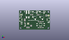
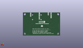
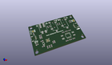

Contents
========

* [PROJ-SPAR-15853-STAN-01>Qwiic FM Transceiver Si4721](#proj-spar-15853-stan-01qwiic-fm-transceiver-si4721)
	* [Images](#images)
	* [Interactive BOM](#interactive-bom)
	* [OOMP Parts](#oomp-parts)
	* [Tags](#tags)
  
![][im]
# PROJ-SPAR-15853-STAN-01>Qwiic FM Transceiver Si4721

- ID: PROJ-SPAR-15853-STAN-01
- Hex ID: PRS15853
- Name: Qwiic FM Transceiver Si4721
- Description: 

## Images
  
  

|eagleImage|kicadPcb3dFront|kicadPcb3dBack|kicadPcb3d|
| :---: | :---: | :---: | :---: |
|||||

## Interactive BOM

- Interactive BOM page: [ibom.html](kicad/bom/ibom.html)

## OOMP Parts
  

|OOMP Parts|
| :---: |
|CAPC-0603-X-UNMATCHED-01, C1, 10.16, 11.937999999999999, 0,C1, 15pF, 0603, SparkFun-Capacitors, (0.4, 0.47), R0|
|CAPC-0603-X-UNMATCHED-01, C2, 10.16, 5.968999999999999, 0,C2, 15pF, 0603, SparkFun-Capacitors, (0.4, 0.235), R0|
|CAPC-0603-X-UNMATCHED-01, C3, 21.081999999999997, 26.669999999999998, 90,C3, 1nF, 0603, SparkFun-Capacitors, (0.83, 1.05), R90|
|CAPC-0603-X-NF470-V50, C4, 21.336, 6.095999999999999, 0,C4, 0.47uF, 0603, SparkFun-Capacitors, (0.84, 0.24), R0|
|CAPC-0603-X-NF470-V50, C5, 21.336, 7.619999999999999, 0,C5, 0.47uF, 0603, SparkFun-Capacitors, (0.84, 0.3), R0|
|<table><tr><td></td><td> C6</td><td>[CAPC-0603-X-NF100-V50 SMD (0603) 100 nF Capacitor (Ceramic) 50v](https://github.com/oomlout/oomlout_OOMP_parts/tree/main/CAPC-0603-X-NF100-V50/)</td><td>[C6N100](https://github.com/oomlout/oomlout_OOMP_parts/tree/main/CAPC-0603-X-NF100-V50/)</td></tr></table>|
|CAPE-UNMATCHED-X-UNMATCHED-01, C7, 44.449999999999996, 8.889999999999999, 90,C7, 47uF, EIA3528, SparkFun-Capacitors, (1.75, 0.35), R90|
|CAPE-UNMATCHED-X-UNMATCHED-01, C8, 31.75, 8.889999999999999, 270,C8, 47uF, EIA3528, SparkFun-Capacitors, (1.25, 0.35), R270|
|<table><tr><td></td><td> C9</td><td>[CAPC-0603-X-NF100-V50 SMD (0603) 100 nF Capacitor (Ceramic) 50v](https://github.com/oomlout/oomlout_OOMP_parts/tree/main/CAPC-0603-X-NF100-V50/)</td><td>[C6N100](https://github.com/oomlout/oomlout_OOMP_parts/tree/main/CAPC-0603-X-NF100-V50/)</td></tr></table>|
|CAPC-0603-X-UNMATCHED-01, C10, 17.779999999999998, 3.8099999999999996, 270,C10, 1uF, 0603-CAP, SparkFun-Capacitors, (0.7, 0.15), R270|
|CAPC-0603-X-UNMATCHED-01, C11, 15.748, 3.8099999999999996, 270,C11, 1uF, 0603-CAP, SparkFun-Capacitors, (0.62, 0.15), R270|
|CAPE-0603-X-UNMATCHED-01, C12, 13.716, 3.8099999999999996, 270,C12, 22nF, 0603, SparkFun-Capacitors, (0.54, 0.15), R270|
|CAPC-0603-X-UF22D-01, C13, 10.16, 17.272000000000002, 180,C13, 2.2uF, 0603, SparkFun-Capacitors, (0.4, 0.68), R180|
|UNMATCHED-0603-X-UNMATCHED-01, D1, 4.571999999999999, 11.937999999999999, 180,D1, RED, LED-0603, SparkFun-LED, (0.18, 0.47), R180|
|UNMATCHED-UNMATCHED-X-UNMATCHED-01, J1, 27.94, 34.29, 270,J1, AUDIO_JACK_3.5MM_SMD, AUDIO-JACK-3.5MM-SMD, SparkFun-Connectors, (1.1, 1.35), R270|
|UNMATCHED-UNMATCHED-X-UNMATCHED-01, J2, 40.64, 34.29, 270,J2, AUDIO_JACK_3.5MM_SMD, AUDIO-JACK-3.5MM-SMD, SparkFun-Connectors, (1.6, 1.35), R270|
|UNMATCHED-UNMATCHED-X-UNMATCHED-01, J3, 15.239999999999998, 27.051, 270,J3, 1X02_POKEHOME, SparkFun-Connectors, (0.6, 1.065), R270|
|UNMATCHED-UNMATCHED-X-UNMATCHED-01, J4, 5.08, 17.779999999999998, 270,J4, QWIIC_RIGHT_ANGLE, JST04_1MM_RA, SparkFun-Connectors, (0.2, 0.7), R270|
|UNMATCHED-UNMATCHED-X-UNMATCHED-01, J5, 49.529999999999994, 17.779999999999998, 90,J5, QWIIC_RIGHT_ANGLE, JST04_1MM_RA, SparkFun-Connectors, (1.95, 0.7), R90|
|UNMATCHED-UNMATCHED-X-UNMATCHED-01, JP1, 52.577999999999996, 25.145999999999997, 270,JP1, JUMPER-SMT_3_2-NC_TRACE_SILK, SMT-JUMPER_3_2-NC_TRACE_SILK, SparkFun-Jumpers, (2.07, 0.99), R270|
|UNMATCHED-UNMATCHED-X-UNMATCHED-01, JP2, 3.8099999999999996, 26.669999999999998, 90,JP2, SMT-JUMPER_2_NC_TRACE_SILK, SparkFun-Jumpers, (0.15, 1.05), R90|
|UNMATCHED-0603-X-UNMATCHED-01, L1, 23.368, 26.669999999999998, 270,L1, 270nH, 0603, SparkFun-Coils, (0.92, 1.05), R270|
|ERROR, L2 FERITE 2.5k, 0, 0, 0,L2, FERITE, 2.5k, 0603, SparkFun-Coils, (1.38, 1.04), R90|
|ERROR, L3 FERITE 2.5K, 0, 0, 0,L3, FERITE, 2.5K, 0603, SparkFun-Coils, (1.29, 1.04), R90|
|UNMATCHED-0603-X-UNMATCHED-01, L4, 10.16, 19.049999999999997, 180,L4, 120nH, 0603, SparkFun-Coils, (0.4, 0.75), R180|
|<table><tr><td></td><td> R1</td><td>[RESE-0603-X-O103-01 SMD (0603) 10k Ohm Resistor](https://github.com/oomlout/oomlout_OOMP_parts/tree/main/RESE-0603-X-O103-01/)</td><td>[R6103](https://github.com/oomlout/oomlout_OOMP_parts/tree/main/RESE-0603-X-O103-01/)</td></tr></table>|
|RESE-0603-X-UNMATCHED-01, R2, 48.00599999999999, 24.13, 0,R2, 2.2k, 0603, SparkFun-Resistors, (1.89, 0.95), R0|
|RESE-0603-X-UNMATCHED-01, R3, 48.00599999999999, 26.162, 0,R3, 2.2k, 0603, SparkFun-Resistors, (1.89, 1.03), R0|
|<table><tr><td></td><td> R4</td><td>[RESE-0603-X-O203-01 SMD (0603) 20k Ohm Resistor](https://github.com/oomlout/oomlout_OOMP_parts/tree/main/RESE-0603-X-O203-01/)</td><td>[R6203](https://github.com/oomlout/oomlout_OOMP_parts/tree/main/RESE-0603-X-O203-01/)</td></tr></table>|
|<table><tr><td></td><td> R5</td><td>[RESE-0603-X-O203-01 SMD (0603) 20k Ohm Resistor](https://github.com/oomlout/oomlout_OOMP_parts/tree/main/RESE-0603-X-O203-01/)</td><td>[R6203](https://github.com/oomlout/oomlout_OOMP_parts/tree/main/RESE-0603-X-O203-01/)</td></tr></table>|
|<table><tr><td></td><td> R6</td><td>[RESE-0603-X-O203-01 SMD (0603) 20k Ohm Resistor](https://github.com/oomlout/oomlout_OOMP_parts/tree/main/RESE-0603-X-O203-01/)</td><td>[R6203](https://github.com/oomlout/oomlout_OOMP_parts/tree/main/RESE-0603-X-O203-01/)</td></tr></table>|
|<table><tr><td></td><td> R7</td><td>[RESE-0603-X-O203-01 SMD (0603) 20k Ohm Resistor](https://github.com/oomlout/oomlout_OOMP_parts/tree/main/RESE-0603-X-O203-01/)</td><td>[R6203](https://github.com/oomlout/oomlout_OOMP_parts/tree/main/RESE-0603-X-O203-01/)</td></tr></table>|
|RESE-0603-X-UNMATCHED-01, R8, 4.571999999999999, 9.906, 180,R8, 1k, 0603, SparkFun-Resistors, (0.18, 0.39), R180|
|<table><tr><td></td><td> R10</td><td>[RESE-0603-X-O104-01 SMD (0603) 100k Ohm Resistor](https://github.com/oomlout/oomlout_OOMP_parts/tree/main/RESE-0603-X-O104-01/)</td><td>[R6104](https://github.com/oomlout/oomlout_OOMP_parts/tree/main/RESE-0603-X-O104-01/)</td></tr></table>|
|UNMATCHED-UNMATCHED-X-UNMATCHED-01, U1, 16.002, 10.668, 270,U1, SI4721, QFN-20-3X3MM, SparkFun-RF, (0.63, 0.42), R270|
|UNMATCHED-UNMATCHED-X-UNMATCHED-01, U3, 38.099999999999994, 8.889999999999999, 180,U3, TPA6111A2DR, SO08, SparkFun-IC-Amplifiers, (1.5, 0.35), R180|
|UNMATCHED-UNMATCHED-X-UNMATCHED-01, Y1, 10.921999999999999, 8.889999999999999, 270,Y1, 32.768kHz, CRYSTAL-SMD-3.2X1.5MM, SparkFun-Clocks, (0.43, 0.35), R270|

## Tags

- hexID: PRS15853
- oompType: PROJ
- oompSize: SPAR
- oompColor: 15853
- oompDesc: STAN
- oompIndex: 01
- oompName: Qwiic FM Transceiver Si4721
- sources: All source files from https://github.com/sparkfun/Qwiic_FM_Transceiver_Si4721 (source licence details in srcLicense.md)
- linkBuyPage: https://www.sparkfun.com/products/15853
- oompPart: CAPC-0603-X-UNMATCHED-01, C1, 10.16, 11.937999999999999, 0
- oompPart: CAPC-0603-X-UNMATCHED-01, C2, 10.16, 5.968999999999999, 0
- oompPart: CAPC-0603-X-UNMATCHED-01, C3, 21.081999999999997, 26.669999999999998, 90
- oompPart: CAPC-0603-X-NF470-V50, C4, 21.336, 6.095999999999999, 0
- oompPart: CAPC-0603-X-NF470-V50, C5, 21.336, 7.619999999999999, 0
- oompPart: CAPC-0603-X-NF100-V50, C6, 42.163999999999994, 3.556, 0
- oompPart: CAPE-UNMATCHED-X-UNMATCHED-01, C7, 44.449999999999996, 8.889999999999999, 90
- oompPart: CAPE-UNMATCHED-X-UNMATCHED-01, C8, 31.75, 8.889999999999999, 270
- oompPart: CAPC-0603-X-NF100-V50, C9, 34.544000000000004, 14.224, 180
- oompPart: CAPC-0603-X-UNMATCHED-01, C10, 17.779999999999998, 3.8099999999999996, 270
- oompPart: CAPC-0603-X-UNMATCHED-01, C11, 15.748, 3.8099999999999996, 270
- oompPart: CAPE-0603-X-UNMATCHED-01, C12, 13.716, 3.8099999999999996, 270
- oompPart: CAPC-0603-X-UF22D-01, C13, 10.16, 17.272000000000002, 180
- oompPart: UNMATCHED-0603-X-UNMATCHED-01, D1, 4.571999999999999, 11.937999999999999, 180
- oompPart: SKIP-UNMATCHED-X-UNMATCHED-01, FD1, 53.339999999999996, 29.209999999999997, 0
- oompPart: SKIP-UNMATCHED-X-UNMATCHED-01, FD2, 5.08, 1.27, 0
- oompPart: UNMATCHED-UNMATCHED-X-UNMATCHED-01, J1, 27.94, 34.29, 270
- oompPart: UNMATCHED-UNMATCHED-X-UNMATCHED-01, J2, 40.64, 34.29, 270
- oompPart: UNMATCHED-UNMATCHED-X-UNMATCHED-01, J3, 15.239999999999998, 27.051, 270
- oompPart: UNMATCHED-UNMATCHED-X-UNMATCHED-01, J4, 5.08, 17.779999999999998, 270
- oompPart: UNMATCHED-UNMATCHED-X-UNMATCHED-01, J5, 49.529999999999994, 17.779999999999998, 90
- oompPart: UNMATCHED-UNMATCHED-X-UNMATCHED-01, JP1, 52.577999999999996, 25.145999999999997, 270
- oompPart: UNMATCHED-UNMATCHED-X-UNMATCHED-01, JP2, 3.8099999999999996, 26.669999999999998, 90
- oompPart: UNMATCHED-0603-X-UNMATCHED-01, L1, 23.368, 26.669999999999998, 270
- oompPart: ERROR, L2 FERITE 2.5k, 0, 0, 0
- oompPart: ERROR, L3 FERITE 2.5K, 0, 0, 0
- oompPart: UNMATCHED-0603-X-UNMATCHED-01, L4, 10.16, 19.049999999999997, 180
- oompPart: RESE-0603-X-O103-01, R1, 10.16, 15.493999999999998, 0
- oompPart: RESE-0603-X-UNMATCHED-01, R2, 48.00599999999999, 24.13, 0
- oompPart: RESE-0603-X-UNMATCHED-01, R3, 48.00599999999999, 26.162, 0
- oompPart: RESE-0603-X-O203-01, R4, 38.354, 14.224, 0
- oompPart: RESE-0603-X-O203-01, R5, 38.354, 3.556, 0
- oompPart: RESE-0603-X-O203-01, R6, 42.163999999999994, 14.224, 180
- oompPart: RESE-0603-X-O203-01, R7, 34.544000000000004, 3.556, 0
- oompPart: RESE-0603-X-UNMATCHED-01, R8, 4.571999999999999, 9.906, 180
- oompPart: RESE-0603-X-O104-01, R10, 3.8099999999999996, 23.241, 270
- oompPart: UNMATCHED-UNMATCHED-X-UNMATCHED-01, U1, 16.002, 10.668, 270
- oompPart: UNMATCHED-UNMATCHED-X-UNMATCHED-01, U3, 38.099999999999994, 8.889999999999999, 180
- oompPart: UNMATCHED-UNMATCHED-X-UNMATCHED-01, Y1, 10.921999999999999, 8.889999999999999, 270
- rawPart: C1, 15pF, 0603, SparkFun-Capacitors, (0.4, 0.47), R0
- rawPart: C2, 15pF, 0603, SparkFun-Capacitors, (0.4, 0.235), R0
- rawPart: C3, 1nF, 0603, SparkFun-Capacitors, (0.83, 1.05), R90
- rawPart: C4, 0.47uF, 0603, SparkFun-Capacitors, (0.84, 0.24), R0
- rawPart: C5, 0.47uF, 0603, SparkFun-Capacitors, (0.84, 0.3), R0
- rawPart: C6, 0.1uF, 0603, SparkFun-Capacitors, (1.66, 0.14), R0
- rawPart: C7, 47uF, EIA3528, SparkFun-Capacitors, (1.75, 0.35), R90
- rawPart: C8, 47uF, EIA3528, SparkFun-Capacitors, (1.25, 0.35), R270
- rawPart: C9, 0.1uF, 0603, SparkFun-Capacitors, (1.36, 0.56), R180
- rawPart: C10, 1uF, 0603-CAP, SparkFun-Capacitors, (0.7, 0.15), R270
- rawPart: C11, 1uF, 0603-CAP, SparkFun-Capacitors, (0.62, 0.15), R270
- rawPart: C12, 22nF, 0603, SparkFun-Capacitors, (0.54, 0.15), R270
- rawPart: C13, 2.2uF, 0603, SparkFun-Capacitors, (0.4, 0.68), R180
- rawPart: D1, RED, LED-0603, SparkFun-LED, (0.18, 0.47), R180
- rawPart: FD1, FIDUCIAL0.2MM, FIDUCIAL-0.2MM, SparkFun-Aesthetics, (2.1, 1.15), R0
- rawPart: FD2, FIDUCIAL0.2MM, FIDUCIAL-0.2MM, SparkFun-Aesthetics, (0.2, 0.05), R0
- rawPart: J1, AUDIO_JACK_3.5MM_SMD, AUDIO-JACK-3.5MM-SMD, SparkFun-Connectors, (1.1, 1.35), R270
- rawPart: J2, AUDIO_JACK_3.5MM_SMD, AUDIO-JACK-3.5MM-SMD, SparkFun-Connectors, (1.6, 1.35), R270
- rawPart: J3, 1X02_POKEHOME, SparkFun-Connectors, (0.6, 1.065), R270
- rawPart: J4, QWIIC_RIGHT_ANGLE, JST04_1MM_RA, SparkFun-Connectors, (0.2, 0.7), R270
- rawPart: J5, QWIIC_RIGHT_ANGLE, JST04_1MM_RA, SparkFun-Connectors, (1.95, 0.7), R90
- rawPart: JP1, JUMPER-SMT_3_2-NC_TRACE_SILK, SMT-JUMPER_3_2-NC_TRACE_SILK, SparkFun-Jumpers, (2.07, 0.99), R270
- rawPart: JP2, SMT-JUMPER_2_NC_TRACE_SILK, SparkFun-Jumpers, (0.15, 1.05), R90
- rawPart: L1, 270nH, 0603, SparkFun-Coils, (0.92, 1.05), R270
- rawPart: L2, FERITE, 2.5k, 0603, SparkFun-Coils, (1.38, 1.04), R90
- rawPart: L3, FERITE, 2.5K, 0603, SparkFun-Coils, (1.29, 1.04), R90
- rawPart: L4, 120nH, 0603, SparkFun-Coils, (0.4, 0.75), R180
- rawPart: R1, 10k, 0603, SparkFun-Resistors, (0.4, 0.61), R0
- rawPart: R2, 2.2k, 0603, SparkFun-Resistors, (1.89, 0.95), R0
- rawPart: R3, 2.2k, 0603, SparkFun-Resistors, (1.89, 1.03), R0
- rawPart: R4, 20k, 0603, SparkFun-Resistors, (1.51, 0.56), R0
- rawPart: R5, 20k, 0603, SparkFun-Resistors, (1.51, 0.14), R0
- rawPart: R6, 20k, 0603, SparkFun-Resistors, (1.66, 0.56), R180
- rawPart: R7, 20k, 0603, SparkFun-Resistors, (1.36, 0.14), R0
- rawPart: R8, 1k, 0603, SparkFun-Resistors, (0.18, 0.39), R180
- rawPart: R10, 100k, 0603, SparkFun-Resistors, (0.15, 0.915), R270
- rawPart: U1, SI4721, QFN-20-3X3MM, SparkFun-RF, (0.63, 0.42), R270
- rawPart: U3, TPA6111A2DR, SO08, SparkFun-IC-Amplifiers, (1.5, 0.35), R180
- rawPart: Y1, 32.768kHz, CRYSTAL-SMD-3.2X1.5MM, SparkFun-Clocks, (0.43, 0.35), R270
- oompID: PROJ-SPAR-15853-STAN-01

[im]: kicadPcb3d_450.png
