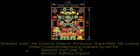
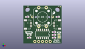
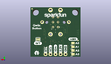
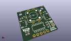

Contents
========

* [PROJ-SPAR-15932-STAN-01>Qwiic Button](#proj-spar-15932-stan-01qwiic-button)
	* [Images](#images)
	* [Interactive BOM](#interactive-bom)
	* [OOMP Parts](#oomp-parts)
	* [Tags](#tags)
  
![][im]
# PROJ-SPAR-15932-STAN-01>Qwiic Button

- ID: PROJ-SPAR-15932-STAN-01
- Hex ID: PRS15932
- Name: Qwiic Button
- Description: 

## Images
  
  

|eagleImage|kicadPcb3dFront|kicadPcb3dBack|kicadPcb3d|
| :---: | :---: | :---: | :---: |
|||||

## Interactive BOM

- Interactive BOM page: [ibom.html](kicad/bom/ibom.html)

## OOMP Parts
  

|OOMP Parts|
| :---: |
|<table><tr><td></td><td> C2</td><td>[CAPC-0603-X-NF100-V50 SMD (0603) 100 nF Capacitor (Ceramic) 50v](https://github.com/oomlout/oomlout_OOMP_parts/tree/main/CAPC-0603-X-NF100-V50/)</td><td>[C6N100](https://github.com/oomlout/oomlout_OOMP_parts/tree/main/CAPC-0603-X-NF100-V50/)</td></tr></table>|
|UNMATCHED-0603-X-UNMATCHED-01, D1, 3.8099999999999996, 5.715, 0,D1, RED, LED-0603, SparkFun-LED, (0.15, 0.225), R0|
|UNMATCHED-UNMATCHED-X-UNMATCHED-01, INT, 21.59, 8.889999999999999, M180,INT, JUMPER-SMT_2_NC_TRACE_SILK, SMT-JUMPER_2_NC_TRACE_SILK, SparkFun-Jumpers, (0.85, 0.35), MR180|
|UNMATCHED-UNMATCHED-X-UNMATCHED-01, J1, 15.239999999999998, 1.27, 180,J1, 1X04_NO_SILK, SparkFun-Connectors, (0.6, 0.05), R180|
|UNMATCHED-UNMATCHED-X-UNMATCHED-01, J2, 20.32, 12.7, 90,J2, QWIIC_RIGHT_ANGLE, JST04_1MM_RA, SparkFun-Connectors, (0.8, 0.5), R90|
|UNMATCHED-UNMATCHED-X-UNMATCHED-01, J3, 5.08, 12.7, 270,J3, QWIIC_RIGHT_ANGLE, JST04_1MM_RA, SparkFun-Connectors, (0.2, 0.5), R270|
|UNMATCHED-UNMATCHED-X-UNMATCHED-01, J5, 17.779999999999998, 1.27, 0,J5, 1X01_NO_SILK, SparkFun-Connectors, (0.7, 0.05), R0|
|UNMATCHED-UNMATCHED-X-UNMATCHED-01, JP1, 3.8099999999999996, 6.985, M180,JP1, JUMPER-SMT_2_NO_NO-SILK, SMT-JUMPER_2_NO_NO-SILK, SparkFun-Jumpers, (0.15, 0.275), MR180|
|UNMATCHED-UNMATCHED-X-UNMATCHED-01, JP3, 23.622, 4.826, 270,JP3, JUMPER-SMT_3_2-NC_TRACE_SILK, SMT-JUMPER_3_2-NC_TRACE_SILK, SparkFun-Jumpers, (0.93, 0.19), R270|
|UNMATCHED-UNMATCHED-X-UNMATCHED-01, JP4, 3.8099999999999996, 5.08, M180,JP4, JUMPER-SMT_2_NO_NO-SILK, SMT-JUMPER_2_NO_NO-SILK, SparkFun-Jumpers, (0.15, 0.2), MR180|
|UNMATCHED-UNMATCHED-X-UNMATCHED-01, JP5, 3.8099999999999996, 3.175, M180,JP5, JUMPER-SMT_2_NO_NO-SILK, SMT-JUMPER_2_NO_NO-SILK, SparkFun-Jumpers, (0.15, 0.125), MR180|
|UNMATCHED-UNMATCHED-X-UNMATCHED-01, JP7, 3.8099999999999996, 1.27, M180,JP7, JUMPER-SMT_2_NO_NO-SILK, SMT-JUMPER_2_NO_NO-SILK, SparkFun-Jumpers, (0.15, 0.05), MR180|
|RESE-0603-X-UNMATCHED-01, R1, 20.32, 3.8099999999999996, 0,R1, 2.2k, 0603, SparkFun-Resistors, (0.8, 0.15), R0|
|RESE-0603-X-UNMATCHED-01, R2, 20.32, 7.619999999999999, 0,R2, 2.2k, 0603, SparkFun-Resistors, (0.8, 0.3), R0|
|<table><tr><td></td><td> R3</td><td>[RESE-0603-X-O103-01 SMD (0603) 10k Ohm Resistor](https://github.com/oomlout/oomlout_OOMP_parts/tree/main/RESE-0603-X-O103-01/)</td><td>[R6103](https://github.com/oomlout/oomlout_OOMP_parts/tree/main/RESE-0603-X-O103-01/)</td></tr></table>|
|RESE-0603-X-UNMATCHED-01, R4, 3.8099999999999996, 3.8099999999999996, 0,R4, 1k, 0603, SparkFun-Resistors, (0.15, 0.15), R0|
|<table><tr><td></td><td> R11</td><td>[RESE-0603-X-O103-01 SMD (0603) 10k Ohm Resistor](https://github.com/oomlout/oomlout_OOMP_parts/tree/main/RESE-0603-X-O103-01/)</td><td>[R6103](https://github.com/oomlout/oomlout_OOMP_parts/tree/main/RESE-0603-X-O103-01/)</td></tr></table>|
|UNMATCHED-UNMATCHED-X-UNMATCHED-01, S1, 12.7, 17.779999999999998, 270,S1, Button, TACTILE_SWITCH_LED_PTH_12MM, SparkFun-Switches, (0.5, 0.7), R270|
|UNMATCHED-UNMATCHED-X-UNMATCHED-01, U4, 12.7, 6.35, 180,U4, ATTINY84-ARDUINO, SO14, SparkFun-IC-Microcontroller, (0.5, 0.25), R180|

## Tags

- hexID: PRS15932
- oompType: PROJ
- oompSize: SPAR
- oompColor: 15932
- oompDesc: STAN
- oompIndex: 01
- oompName: Qwiic Button
- sources: All source files from https://github.com/sparkfun/Qwiic_Button (source licence details in srcLicense.md)
- linkBuyPage: https://www.sparkfun.com/products/15932
- oompID: PROJ-SPAR-15932-STAN-01
- oompPart: CAPC-0603-X-NF100-V50, C2, 22.86, 17.779999999999998, 0
- oompPart: UNMATCHED-0603-X-UNMATCHED-01, D1, 3.8099999999999996, 5.715, 0
- oompPart: UNMATCHED-UNMATCHED-X-UNMATCHED-01, INT, 21.59, 8.889999999999999, M180
- oompPart: UNMATCHED-UNMATCHED-X-UNMATCHED-01, J1, 15.239999999999998, 1.27, 180
- oompPart: UNMATCHED-UNMATCHED-X-UNMATCHED-01, J2, 20.32, 12.7, 90
- oompPart: UNMATCHED-UNMATCHED-X-UNMATCHED-01, J3, 5.08, 12.7, 270
- oompPart: UNMATCHED-UNMATCHED-X-UNMATCHED-01, J5, 17.779999999999998, 1.27, 0
- oompPart: SKIP-UNMATCHED-X-UNMATCHED-01, J7, 12.7, 17.779999999999998, M90
- oompPart: UNMATCHED-UNMATCHED-X-UNMATCHED-01, JP1, 3.8099999999999996, 6.985, M180
- oompPart: SKIP-UNMATCHED-X-UNMATCHED-01, JP2, 24.637999999999998, 24.637999999999998, M0
- oompPart: UNMATCHED-UNMATCHED-X-UNMATCHED-01, JP3, 23.622, 4.826, 270
- oompPart: UNMATCHED-UNMATCHED-X-UNMATCHED-01, JP4, 3.8099999999999996, 5.08, M180
- oompPart: UNMATCHED-UNMATCHED-X-UNMATCHED-01, JP5, 3.8099999999999996, 3.175, M180
- oompPart: SKIP-UNMATCHED-X-UNMATCHED-01, JP6, 1.27, 8.254999999999999, M0
- oompPart: UNMATCHED-UNMATCHED-X-UNMATCHED-01, JP7, 3.8099999999999996, 1.27, M180
- oompPart: SKIP-UNMATCHED-X-UNMATCHED-01, JP8, 1.27, 8.254999999999999, 0
- oompPart: SKIP-UNMATCHED-X-UNMATCHED-01, JP9, 24.637999999999998, 24.637999999999998, 0
- oompPart: RESE-0603-X-UNMATCHED-01, R1, 20.32, 3.8099999999999996, 0
- oompPart: RESE-0603-X-UNMATCHED-01, R2, 20.32, 7.619999999999999, 0
- oompPart: RESE-0603-X-O103-01, R3, 2.54, 17.779999999999998, 0
- oompPart: RESE-0603-X-UNMATCHED-01, R4, 3.8099999999999996, 3.8099999999999996, 0
- oompPart: RESE-0603-X-O103-01, R11, 20.32, 5.715, 0
- oompPart: UNMATCHED-UNMATCHED-X-UNMATCHED-01, S1, 12.7, 17.779999999999998, 270
- oompPart: UNMATCHED-UNMATCHED-X-UNMATCHED-01, U4, 12.7, 6.35, 180
- rawPart: C2, 0.1uF, 0603, SparkFun-Capacitors, (0.9, 0.7), R0
- rawPart: D1, RED, LED-0603, SparkFun-LED, (0.15, 0.225), R0
- rawPart: INT, JUMPER-SMT_2_NC_TRACE_SILK, SMT-JUMPER_2_NC_TRACE_SILK, SparkFun-Jumpers, (0.85, 0.35), MR180
- rawPart: J1, 1X04_NO_SILK, SparkFun-Connectors, (0.6, 0.05), R180
- rawPart: J2, QWIIC_RIGHT_ANGLE, JST04_1MM_RA, SparkFun-Connectors, (0.8, 0.5), R90
- rawPart: J3, QWIIC_RIGHT_ANGLE, JST04_1MM_RA, SparkFun-Connectors, (0.2, 0.5), R270
- rawPart: J5, 1X01_NO_SILK, SparkFun-Connectors, (0.7, 0.05), R0
- rawPart: J7, ISP, 2X3_TEST_POINTS, SparkFun-Connectors, (0.5, 0.7), MR90
- rawPart: JP1, JUMPER-SMT_2_NO_NO-SILK, SMT-JUMPER_2_NO_NO-SILK, SparkFun-Jumpers, (0.15, 0.275), MR180
- rawPart: JP2, FIDUCIALUFIDUCIAL, MICRO-FIDUCIAL, SparkFun, (0.97, 0.97), MR0
- rawPart: JP3, JUMPER-SMT_3_2-NC_TRACE_SILK, SMT-JUMPER_3_2-NC_TRACE_SILK, SparkFun-Jumpers, (0.93, 0.19), R270
- rawPart: JP4, JUMPER-SMT_2_NO_NO-SILK, SMT-JUMPER_2_NO_NO-SILK, SparkFun-Jumpers, (0.15, 0.2), MR180
- rawPart: JP5, JUMPER-SMT_2_NO_NO-SILK, SMT-JUMPER_2_NO_NO-SILK, SparkFun-Jumpers, (0.15, 0.125), MR180
- rawPart: JP6, FIDUCIALUFIDUCIAL, MICRO-FIDUCIAL, SparkFun, (0.05, 0.325), MR0
- rawPart: JP7, JUMPER-SMT_2_NO_NO-SILK, SMT-JUMPER_2_NO_NO-SILK, SparkFun-Jumpers, (0.15, 0.05), MR180
- rawPart: JP8, FIDUCIALUFIDUCIAL, MICRO-FIDUCIAL, SparkFun, (0.05, 0.325), R0
- rawPart: JP9, FIDUCIALUFIDUCIAL, MICRO-FIDUCIAL, SparkFun, (0.97, 0.97), R0
- rawPart: R1, 2.2k, 0603, SparkFun-Resistors, (0.8, 0.15), R0
- rawPart: R2, 2.2k, 0603, SparkFun-Resistors, (0.8, 0.3), R0
- rawPart: R3, 10k, 0603, SparkFun-Resistors, (0.1, 0.7), R0
- rawPart: R4, 1k, 0603, SparkFun-Resistors, (0.15, 0.15), R0
- rawPart: R11, 10k, 0603, SparkFun-Resistors, (0.8, 0.225), R0
- rawPart: S1, Button, TACTILE_SWITCH_LED_PTH_12MM, SparkFun-Switches, (0.5, 0.7), R270
- rawPart: U4, ATTINY84-ARDUINO, SO14, SparkFun-IC-Microcontroller, (0.5, 0.25), R180

[im]: kicadPcb3d_450.png
