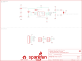

Contents
========

* [PRS16281 > Sparkfun](#prs16281--sparkfun)
	* [Images](#images)
	* [Tags](#tags)
  
![][im]
# PRS16281 > Sparkfun

- ID: PROJ-SPAR-16281-STAN-01
- Hex ID: PRS16281
- Name: Sparkfun
- Description: Sparkfun

## Images
  
  

|kicadPcb3d|kicadPcb3dFront|kicadPcb3dBack|eagleImage|eagleSchemImage|
| :---: | :---: | :---: | :---: | :---: |
||||||

## Tags

- hexID: PRS16281
- oompType: PROJ
- oompSize: SPAR
- oompColor: 16281
- oompDesc: STAN
- oompIndex: 01
- oompName: SparkFun Real Time Clock Module RV-8803
- sources: All source files from https://github.com/sparkfun/SparkFun_Real_Time_Clock_Module_RV-8803 (source licence details in srcLicense.md)
- linkBuyPage: https://www.sparkfun.com/products/16281
- oompID: PROJ-SPAR-16281-STAN-01

[im]: kicadPcb3d_450.png
