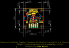
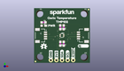
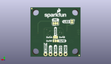
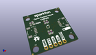

Contents
========

* [PROJ-SPAR-16304-STAN-01>Temperature Sensor TMP102 Qwiic](#proj-spar-16304-stan-01temperature-sensor-tmp102-qwiic)
	* [Images](#images)
	* [Interactive BOM](#interactive-bom)
	* [OOMP Parts](#oomp-parts)
	* [Tags](#tags)
  
![][im]
# PROJ-SPAR-16304-STAN-01>Temperature Sensor TMP102 Qwiic

- ID: PROJ-SPAR-16304-STAN-01
- Hex ID: PRS16304
- Name: Temperature Sensor TMP102 Qwiic
- Description: 

## Images
  
  

|eagleImage|kicadPcb3dFront|kicadPcb3dBack|kicadPcb3d|
| :---: | :---: | :---: | :---: |
|||||

## Interactive BOM

- Interactive BOM page: [ibom.html](kicad/bom/ibom.html)

## OOMP Parts
  

|OOMP Parts|
| :---: |
|<table><tr><td></td><td> C1</td><td>[CAPC-0603-X-NF100-V50 SMD (0603) 100 nF Capacitor (Ceramic) 50v](https://github.com/oomlout/oomlout_OOMP_parts/tree/main/CAPC-0603-X-NF100-V50/)</td><td>[C6N100](https://github.com/oomlout/oomlout_OOMP_parts/tree/main/CAPC-0603-X-NF100-V50/)</td></tr></table>|
|UNMATCHED-0603-X-UNMATCHED-01, D1, 4.3180000000000005, 17.272000000000002, 0,D1, RED, LED-0603, SparkFun-LED, (0.17, 0.68), R0|
|UNMATCHED-UNMATCHED-X-UNMATCHED-01, J1, 5.206999999999999, 12.7, 270,J1, QWIIC, JST04_1MM_RA, SparkFun-Connectors, (0.205, 0.5), R270|
|UNMATCHED-UNMATCHED-X-UNMATCHED-01, J2, 20.193, 12.7, 90,J2, QWIIC, JST04_1MM_RA, SparkFun-Connectors, (0.795, 0.5), R90|
|UNMATCHED-UNMATCHED-X-UNMATCHED-01, J3, 7.619999999999999, 1.27, 0,J3, PTH, 1X04_NO_SILK, SparkFun-Connectors, (0.3, 0.05), R0|
|UNMATCHED-UNMATCHED-X-UNMATCHED-01, J4, 17.779999999999998, 1.27, 0,J4, 1X01_NO_SILK, SparkFun-Connectors, (0.7, 0.05), R0|
|UNMATCHED-UNMATCHED-X-UNMATCHED-01, JP1, 12.7, 8.128, M0,JP1, SMT-JUMPER_3_1-NC_TRACE_NO-SILK, SparkFun-Jumpers, (0.5, 0.32), MR0|
|UNMATCHED-UNMATCHED-X-UNMATCHED-01, JP2, 12.7, 10.033, M180,JP2, SMT-JUMPER_3_NO_NO-SILK, SparkFun-Jumpers, (0.5, 0.395), MR180|
|UNMATCHED-UNMATCHED-X-UNMATCHED-01, JP3, 12.7, 17.145, M180,JP3, I2C, SMT-JUMPER_3_2-NC_TRACE_SILK, SparkFun-Jumpers, (0.5, 0.675), MR180|
|UNMATCHED-UNMATCHED-X-UNMATCHED-01, JP4, 4.3180000000000005, 18.034, M270,JP4, PWR, SMT-JUMPER_2_NC_TRACE_SILK, SparkFun-Jumpers, (0.17, 0.71), MR270|
|RESE-0603-X-UNMATCHED-01, R1, 13.462, 16.509999999999998, 270,R1, 4.7k, 0603, SparkFun-Resistors, (0.53, 0.65), R270|
|RESE-0603-X-UNMATCHED-01, R2, 11.937999999999999, 16.509999999999998, 270,R2, 4.7k, 0603, SparkFun-Resistors, (0.47, 0.65), R270|
|<table><tr><td></td><td> R5</td><td>[RESE-0603-X-O103-01 SMD (0603) 10k Ohm Resistor](https://github.com/oomlout/oomlout_OOMP_parts/tree/main/RESE-0603-X-O103-01/)</td><td>[R6103](https://github.com/oomlout/oomlout_OOMP_parts/tree/main/RESE-0603-X-O103-01/)</td></tr></table>|
|RESE-0603-X-UNMATCHED-01, R6, 4.3180000000000005, 18.796, 0,R6, 1k, 0603, SparkFun-Resistors, (0.17, 0.74), R0|
|UNMATCHED-UNMATCHED-X-UNMATCHED-01, U1, 12.7, 12.7, 0,U1, TMP102, SOT563, SparkFun-Sensors, (0.5, 0.5), R0|

## Tags

- hexID: PRS16304
- oompType: PROJ
- oompSize: SPAR
- oompColor: 16304
- oompDesc: STAN
- oompIndex: 01
- oompName: Temperature Sensor TMP102 Qwiic
- sources: All source files from https://github.com/sparkfun/Temperature_Sensor_TMP102_Qwiic (source licence details in srcLicense.md)
- linkBuyPage: https://www.sparkfun.com/products/16304
- oompPart: CAPC-0603-X-NF100-V50, C1, 13.462, 8.889999999999999, 270
- oompPart: UNMATCHED-0603-X-UNMATCHED-01, D1, 4.3180000000000005, 17.272000000000002, 0
- oompPart: SKIP-UNMATCHED-X-UNMATCHED-01, FD1, 0.635, 0.635, 0
- oompPart: SKIP-UNMATCHED-X-UNMATCHED-01, FD2, 0.635, 0.635, M0
- oompPart: SKIP-UNMATCHED-X-UNMATCHED-01, FD3, 24.764999999999997, 24.764999999999997, 0
- oompPart: SKIP-UNMATCHED-X-UNMATCHED-01, FD4, 24.764999999999997, 24.764999999999997, M0
- oompPart: UNMATCHED-UNMATCHED-X-UNMATCHED-01, J1, 5.206999999999999, 12.7, 270
- oompPart: UNMATCHED-UNMATCHED-X-UNMATCHED-01, J2, 20.193, 12.7, 90
- oompPart: UNMATCHED-UNMATCHED-X-UNMATCHED-01, J3, 7.619999999999999, 1.27, 0
- oompPart: UNMATCHED-UNMATCHED-X-UNMATCHED-01, J4, 17.779999999999998, 1.27, 0
- oompPart: UNMATCHED-UNMATCHED-X-UNMATCHED-01, JP1, 12.7, 8.128, M0
- oompPart: UNMATCHED-UNMATCHED-X-UNMATCHED-01, JP2, 12.7, 10.033, M180
- oompPart: UNMATCHED-UNMATCHED-X-UNMATCHED-01, JP3, 12.7, 17.145, M180
- oompPart: UNMATCHED-UNMATCHED-X-UNMATCHED-01, JP4, 4.3180000000000005, 18.034, M270
- oompPart: RESE-0603-X-UNMATCHED-01, R1, 13.462, 16.509999999999998, 270
- oompPart: RESE-0603-X-UNMATCHED-01, R2, 11.937999999999999, 16.509999999999998, 270
- oompPart: RESE-0603-X-O103-01, R5, 11.937999999999999, 8.889999999999999, 270
- oompPart: RESE-0603-X-UNMATCHED-01, R6, 4.3180000000000005, 18.796, 0
- oompPart: UNMATCHED-UNMATCHED-X-UNMATCHED-01, U1, 12.7, 12.7, 0
- rawPart: C1, 0.1uF, 0603, SparkFun-Capacitors, (0.53, 0.35), R270
- rawPart: D1, RED, LED-0603, SparkFun-LED, (0.17, 0.68), R0
- rawPart: FD1, FIDUCIALUFIDUCIAL, FIDUCIAL-MICRO, SparkFun-Aesthetics, (0.025, 0.025), R0
- rawPart: FD2, FIDUCIALUFIDUCIAL, FIDUCIAL-MICRO, SparkFun-Aesthetics, (0.025, 0.025), MR0
- rawPart: FD3, FIDUCIALUFIDUCIAL, FIDUCIAL-MICRO, SparkFun-Aesthetics, (0.975, 0.975), R0
- rawPart: FD4, FIDUCIALUFIDUCIAL, FIDUCIAL-MICRO, SparkFun-Aesthetics, (0.975, 0.975), MR0
- rawPart: J1, QWIIC, JST04_1MM_RA, SparkFun-Connectors, (0.205, 0.5), R270
- rawPart: J2, QWIIC, JST04_1MM_RA, SparkFun-Connectors, (0.795, 0.5), R90
- rawPart: J3, PTH, 1X04_NO_SILK, SparkFun-Connectors, (0.3, 0.05), R0
- rawPart: J4, 1X01_NO_SILK, SparkFun-Connectors, (0.7, 0.05), R0
- rawPart: JP1, SMT-JUMPER_3_1-NC_TRACE_NO-SILK, SparkFun-Jumpers, (0.5, 0.32), MR0
- rawPart: JP2, SMT-JUMPER_3_NO_NO-SILK, SparkFun-Jumpers, (0.5, 0.395), MR180
- rawPart: JP3, I2C, SMT-JUMPER_3_2-NC_TRACE_SILK, SparkFun-Jumpers, (0.5, 0.675), MR180
- rawPart: JP4, PWR, SMT-JUMPER_2_NC_TRACE_SILK, SparkFun-Jumpers, (0.17, 0.71), MR270
- rawPart: R1, 4.7k, 0603, SparkFun-Resistors, (0.53, 0.65), R270
- rawPart: R2, 4.7k, 0603, SparkFun-Resistors, (0.47, 0.65), R270
- rawPart: R5, 10k, 0603, SparkFun-Resistors, (0.47, 0.35), R270
- rawPart: R6, 1k, 0603, SparkFun-Resistors, (0.17, 0.74), R0
- rawPart: U1, TMP102, SOT563, SparkFun-Sensors, (0.5, 0.5), R0
- oompID: PROJ-SPAR-16304-STAN-01

[im]: kicadPcb3d_450.png
