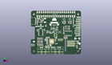
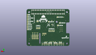
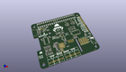

Contents
========

* [PROJ-SPAR-16328-STAN-01>SparkFun Auto pHAT](#proj-spar-16328-stan-01sparkfun-auto-phat)
	* [Images](#images)
	* [Interactive BOM](#interactive-bom)
	* [OOMP Parts](#oomp-parts)
	* [Tags](#tags)
  
![][im]
# PROJ-SPAR-16328-STAN-01>SparkFun Auto pHAT

- ID: PROJ-SPAR-16328-STAN-01
- Hex ID: PRS16328
- Name: SparkFun Auto pHAT
- Description: 

## Images
  
  

|eagleImage|kicadPcb3dFront|kicadPcb3dBack|kicadPcb3d|
| :---: | :---: | :---: | :---: |
|||||

## Interactive BOM

- Interactive BOM page: [ibom.html](kicad/bom/ibom.html)

## OOMP Parts
  

|OOMP Parts|
| :---: |
|<table><tr><td></td><td> C2</td><td>[CAPC-0603-X-NF100-V50 SMD (0603) 100 nF Capacitor (Ceramic) 50v](https://github.com/oomlout/oomlout_OOMP_parts/tree/main/CAPC-0603-X-NF100-V50/)</td><td>[C6N100](https://github.com/oomlout/oomlout_OOMP_parts/tree/main/CAPC-0603-X-NF100-V50/)</td></tr></table>|
|<table><tr><td></td><td> C3</td><td>[CAPC-0603-X-NF100-V50 SMD (0603) 100 nF Capacitor (Ceramic) 50v](https://github.com/oomlout/oomlout_OOMP_parts/tree/main/CAPC-0603-X-NF100-V50/)</td><td>[C6N100](https://github.com/oomlout/oomlout_OOMP_parts/tree/main/CAPC-0603-X-NF100-V50/)</td></tr></table>|
|CAPE-UNMATCHED-X-UNMATCHED-01, C5, 60.22847822199999, 20.721321778, 180,C5, 100uF, PANASONIC_D, SparkFun-Capacitors, (2.37119993, 0.81580007), R180|
|<table><tr><td></td><td> C6</td><td>[CAPC-0603-X-NF100-V50 SMD (0603) 100 nF Capacitor (Ceramic) 50v](https://github.com/oomlout/oomlout_OOMP_parts/tree/main/CAPC-0603-X-NF100-V50/)</td><td>[C6N100](https://github.com/oomlout/oomlout_OOMP_parts/tree/main/CAPC-0603-X-NF100-V50/)</td></tr></table>|
|<table><tr><td></td><td> C7</td><td>[CAPC-0603-X-NF100-V50 SMD (0603) 100 nF Capacitor (Ceramic) 50v](https://github.com/oomlout/oomlout_OOMP_parts/tree/main/CAPC-0603-X-NF100-V50/)</td><td>[C6N100](https://github.com/oomlout/oomlout_OOMP_parts/tree/main/CAPC-0603-X-NF100-V50/)</td></tr></table>|
|<table><tr><td></td><td> C8</td><td>[CAPC-0603-X-NF100-V50 SMD (0603) 100 nF Capacitor (Ceramic) 50v](https://github.com/oomlout/oomlout_OOMP_parts/tree/main/CAPC-0603-X-NF100-V50/)</td><td>[C6N100](https://github.com/oomlout/oomlout_OOMP_parts/tree/main/CAPC-0603-X-NF100-V50/)</td></tr></table>|
|<table><tr><td></td><td> C10</td><td>[CAPC-0603-X-NF100-V50 SMD (0603) 100 nF Capacitor (Ceramic) 50v](https://github.com/oomlout/oomlout_OOMP_parts/tree/main/CAPC-0603-X-NF100-V50/)</td><td>[C6N100](https://github.com/oomlout/oomlout_OOMP_parts/tree/main/CAPC-0603-X-NF100-V50/)</td></tr></table>|
|CAPC-0603-X-UNMATCHED-01, C11, 12.7, 20.32, 90,C11, 10nF, 0603, SparkFun-Capacitors, (0.5, 0.8), R90|
|<table><tr><td></td><td> C12</td><td>[CAPC-0603-X-NF100-V50 SMD (0603) 100 nF Capacitor (Ceramic) 50v](https://github.com/oomlout/oomlout_OOMP_parts/tree/main/CAPC-0603-X-NF100-V50/)</td><td>[C6N100](https://github.com/oomlout/oomlout_OOMP_parts/tree/main/CAPC-0603-X-NF100-V50/)</td></tr></table>|
|<table><tr><td></td><td> C13</td><td>[CAPC-0603-X-NF100-V50 SMD (0603) 100 nF Capacitor (Ceramic) 50v](https://github.com/oomlout/oomlout_OOMP_parts/tree/main/CAPC-0603-X-NF100-V50/)</td><td>[C6N100](https://github.com/oomlout/oomlout_OOMP_parts/tree/main/CAPC-0603-X-NF100-V50/)</td></tr></table>|
|CAPC-0603-X-UNMATCHED-01, C14, 33.6931, 32.13861873, 0,C14, 1.0uF, 0603, SparkFun-Capacitors, (1.3265, 1.26529995), R0|
|CAPC-0603-X-UNMATCHED-01, C15, 24.9428, 28.336240508, 90,C15, 1.0uF, 0603, SparkFun-Capacitors, (0.982, 1.11560002), R90|
|CAPC-0603-X-UNMATCHED-01, C16, 14.604999999999999, 20.32, 90,C16, 10nF, 0603, SparkFun-Capacitors, (0.575, 0.8), R90|
|CAPC-0402-X-UNMATCHED-01, C17, 22.224999999999998, 21.717, 90,C17, 1.0uF, 0402, SparkFun-Capacitors, (0.875, 0.855), R90|
|CAPC-0402-X-UNMATCHED-01, C18, 20.32, 20.955, 180,C18, 1.0uF, 0402, SparkFun-Capacitors, (0.8, 0.825), R180|
|CAPC-0402-X-UNMATCHED-01, C19, 21.081999999999997, 16.637, 180,C19, 1.0uF, 0402, SparkFun-Capacitors, (0.83, 0.655), R180|
|CAPC-0402-X-UNMATCHED-01, C20, 21.081999999999997, 13.8938, 180,C20, 1.0uF, 0402, SparkFun-Capacitors, (0.83, 0.547), R180|
|CAPC-0402-X-NF100-V50, C21, 20.32, 22.352, 180,C21, 0.1uF, 0402, SparkFun-Capacitors, (0.8, 0.88), R180|
|CAPC-0402-X-NF100-V50, C22, 21.081999999999997, 15.265399999999998, 180,C22, 0.1uF, 0402, SparkFun-Capacitors, (0.83, 0.601), R180|
|CAPC-0402-X-NF100-V50, C23, 23.622, 21.717, 90,C23, 0.1uF, 0402, SparkFun-Capacitors, (0.93, 0.855), R90|
|CAPC-0402-X-NF100-V50, C24, 22.605999999999998, 11.684, 90,C24, 0.1uF, 0402, SparkFun-Capacitors, (0.89, 0.46), R90|
|CAPC-0805-X-UNMATCHED-01, C25, 20.32, 11.176, 180,C25, 10uF, 0805, SparkFun-Capacitors, (0.8, 0.44), R180|
|CAPC-0603-X-UNMATCHED-01, C26, 8.889999999999999, 20.32, 90,C26, 10nF, 0603, SparkFun-Capacitors, (0.35, 0.8), R90|
|CAPC-0603-X-UNMATCHED-01, C27, 10.795, 20.32, 90,C27, 10nF, 0603, SparkFun-Capacitors, (0.425, 0.8), R90|
|UNMATCHED-UNMATCHED-X-UNMATCHED-01, D2, 1.097278222, 12.01673746, 90,D2, BLUE, LED-0603@1, SparkFun-LED, (0.04319993, 0.4730999), R90|
|ERROR, F2 16V/2.5A(5A TRIP), 0, 0, 0,F2, 16V/2.5A(5A, TRIP), 1812, SparkFun-Fuses, (0.71829995, 1.74670005), R90|
|UNMATCHED-UNMATCHED-X-UNMATCHED-01, INT, 17.75206254, 31.755078221999998, M270,INT, SMT-JUMPER_2_NC_TRACE_SILK, SparkFun-Jumpers, (0.6989001, 1.25019993), MR270|
|UNMATCHED-UNMATCHED-X-UNMATCHED-01, J2, 8.37200002, 51.215999929999995, 0,J2, RASPBERRYPI-40-PIN-GPIO_SMD_STACKABLE_NOHOLES, RASPBERRY_PI_HAT_40_PIN_SMD_STACKABLE_NOHOLES, SparkFun-Connectors, (0.3296063, 2.01637795), R0|
|UNMATCHED-UNMATCHED-X-UNMATCHED-01, J3, 48.26, 11.43, 90,J3, 1X03_LOCK, SparkFun-Connectors, (1.9, 0.45), R90|
|UNMATCHED-UNMATCHED-X-UNMATCHED-01, J4, 50.8, 11.43, 90,J4, 1X03_LOCK, SparkFun-Connectors, (2, 0.45), R90|
|UNMATCHED-UNMATCHED-X-UNMATCHED-01, J5, 53.339999999999996, 11.43, 90,J5, 1X03_LOCK, SparkFun-Connectors, (2.1, 0.45), R90|
|UNMATCHED-UNMATCHED-X-UNMATCHED-01, J6, 63.5, 33.019999999999996, 90,J6, 1X01_NO_SILK, SparkFun-Connectors, (2.5, 1.3), R90|
|ERROR, J7 EXT SERVO, 0, 0, 0,J7, EXT, SERVO, PWR, 1X02, SparkFun-Connectors, (2.5, 1.4), R90|
|ERROR, J8 EXT 5V, 0, 0, 0,J8, EXT, 5V, PWR, 1X02, SparkFun-Connectors, (2.5, 1.8), R90|
|UNMATCHED-UNMATCHED-X-UNMATCHED-01, J9, 12.344399999999998, 3.175, 180,J9, 1X02_2.54_SCREWTERM_LG_DRILL, autophat, (0.486, 0.125), R180|
|UNMATCHED-UNMATCHED-X-UNMATCHED-01, J10, 55.88, 11.43, 90,J10, 1X03_LOCK, SparkFun-Connectors, (2.2, 0.45), R90|
|ERROR, J11 EXT MTR, 0, 0, 0,J11, EXT, MTR, PWR, 1X02, SparkFun-Connectors, (2.5, 1.6), R90|
|UNMATCHED-UNMATCHED-X-UNMATCHED-01, J12, 17.525999999999996, 3.175, 180,J12, 1X02_2.54_SCREWTERM, SparkFun-Connectors, (0.69, 0.125), R180|
|UNMATCHED-UNMATCHED-X-UNMATCHED-01, J13, 22.7076, 3.175, 180,J13, 1X02_2.54_SCREWTERM_LG_DRILL, autophat, (0.894, 0.125), R180|
|UNMATCHED-UNMATCHED-X-UNMATCHED-01, J14, 30.124399999999998, 3.175, 180,J14, 1X02_2.54_SCREWTERM_LG_DRILL, autophat, (1.186, 0.125), R180|
|UNMATCHED-UNMATCHED-X-UNMATCHED-01, J15, 35.306, 3.175, 180,J15, 1X02_2.54_SCREWTERM, SparkFun-Connectors, (1.39, 0.125), R180|
|UNMATCHED-UNMATCHED-X-UNMATCHED-01, J16, 40.4876, 3.175, 180,J16, 1X02_2.54_SCREWTERM_LG_DRILL, autophat, (1.594, 0.125), R180|
|UNMATCHED-UNMATCHED-X-UNMATCHED-01, J17, 63.5, 30.479999999999997, 90,J17, 1X01_NO_SILK, SparkFun-Connectors, (2.5, 1.2), R90|
|UNMATCHED-UNMATCHED-X-UNMATCHED-01, J19, 59.69, 10.16, 90,J19, JST04_1MM_RA, SparkFun-Connectors, (2.35, 0.4), R90|
|ERROR, J20 USB C, 0, 0, 0,J20, USB, C, USB-C-16P, SparkFun-Connectors, (0.25, 1.715), R270|
|UNMATCHED-UNMATCHED-X-UNMATCHED-01, J21, 63.5, 25.4, 90,J21, 1X01_NO_SILK, SparkFun-Connectors, (2.5, 1), R90|
|UNMATCHED-UNMATCHED-X-UNMATCHED-01, J22, 63.5, 27.94, 90,J22, 1X01_NO_SILK, SparkFun-Connectors, (2.5, 1.1), R90|
|UNMATCHED-UNMATCHED-X-UNMATCHED-01, J23, 38.099999999999994, 19.049999999999997, 180,J23, CORTEX_JTAG_DEBUG_PTH, 2X5-PTH-1.27MM, SparkFun-Connectors, (1.5, 0.75), R180|
|UNMATCHED-UNMATCHED-X-UNMATCHED-01, JP1, 45.542199999999994, 27.558999999999997, M270,JP1, JUMPER-PAD-2, SMT-JUMPER_2_NC_TRACE_NO-SILK, SparkFun-Jumpers, (1.793, 1.085), MR270|
|ERROR, JP2 FUSE BP, 0, 0, 0,JP2, FUSE, BP, SMT-JUMPER_2_NO_SILK, SparkFun-Jumpers, (0.71619993, 1.75669993), MR90|
|UNMATCHED-UNMATCHED-X-UNMATCHED-01, JP3, 48.259996951999995, 37.950140508, M180,JP3, I2C, SMT-JUMPER_3_2-NC_TRACE_SILK, SparkFun-Jumpers, (1.89999988, 1.49410002), MR180|
|ERROR, JP4 PI ISO, 0, 0, 0,JP4, PI, ISO, SMT-JUMPER_2_NC_TRACE_SILK, SparkFun-Jumpers, (0.41360002, 1.83569993), R90|
|UNMATCHED-UNMATCHED-X-UNMATCHED-01, JP5, 47.4472, 27.558999999999997, M270,JP5, JUMPER-PAD-2, SMT-JUMPER_2_NC_TRACE_NO-SILK, SparkFun-Jumpers, (1.868, 1.085), MR270|
|UNMATCHED-UNMATCHED-X-UNMATCHED-01, JP6, 49.352199999999996, 27.558999999999997, M270,JP6, JUMPER-PAD-2, SMT-JUMPER_2_NC_TRACE_NO-SILK, SparkFun-Jumpers, (1.943, 1.085), MR270|
|UNMATCHED-UNMATCHED-X-UNMATCHED-01, JP9, 23.749, 22.987, M270,JP9, JUMPER-PAD-2, SMT-JUMPER_2_NC_TRACE_NO-SILK, SparkFun-Jumpers, (0.935, 0.905), MR270|
|UNMATCHED-UNMATCHED-X-UNMATCHED-01, JP10, 26.034999999999997, 23.114, M270,JP10, JUMPER-PAD-2, SMT-JUMPER_2_NO_NO-SILK, SparkFun-Jumpers, (1.025, 0.91), MR270|
|UNMATCHED-UNMATCHED-X-UNMATCHED-01, JP11, 28.320999999999998, 23.114, M270,JP11, JUMPER-PAD-2, SMT-JUMPER_2_NO_NO-SILK, SparkFun-Jumpers, (1.115, 0.91), MR270|
|UNMATCHED-UNMATCHED-X-UNMATCHED-01, JP12, 30.607, 23.114, M270,JP12, JUMPER-PAD-2, SMT-JUMPER_2_NO_NO-SILK, SparkFun-Jumpers, (1.205, 0.91), MR270|
|UNMATCHED-UNMATCHED-X-UNMATCHED-01, JP13, 14.731999999999998, 35.559999999999995, M270,JP13, ADR, SMT-JUMPER_2_NO_SILK, SparkFun-Jumpers, (0.58, 1.4), MR270|
|UNMATCHED-UNMATCHED-X-UNMATCHED-01, JP15, 31.559499999999996, 37.470081269999994, M270,JP15, ADR, SMT-JUMPER_2_NO_SILK, SparkFun-Jumpers, (1.2425, 1.47520005), MR270|
|UNMATCHED-UNMATCHED-X-UNMATCHED-01, Q1, 47.744378221999995, 33.63975619, 180,Q1, 310mA/60V/1.6?, SOT323, SparkFun-DiscreteSemi, (1.87969993, 1.32439985), R180|
|UNMATCHED-UNMATCHED-X-UNMATCHED-01, Q4, 44.886878222, 33.66261873, 180,Q4, 310mA/60V/1.6?, SOT323, SparkFun-DiscreteSemi, (1.76719993, 1.32529995), R180|
|UNMATCHED-UNMATCHED-X-UNMATCHED-01, Q5, 50.8, 45.72, 0,Q5, 20V/4.2A/52m?/1.4W, SOT23-3, SparkFun-DiscreteSemi, (2, 1.8), R0|
|UNMATCHED-UNMATCHED-X-UNMATCHED-01, Q6, 51.434999999999995, 42.672, 270,Q6, SOT363_PHILIPS, SparkFun-DiscreteSemi, (2.025, 1.68), R270|
|UNMATCHED-UNMATCHED-X-UNMATCHED-01, Q7, 43.18, 45.72, 0,Q7, 20V/4.2A/52m?/1.4W, SOT23-3, SparkFun-DiscreteSemi, (1.7, 1.8), R0|
|UNMATCHED-UNMATCHED-X-UNMATCHED-01, Q8, 43.687999999999995, 42.545, 270,Q8, SOT363_PHILIPS, SparkFun-DiscreteSemi, (1.72, 1.675), R270|
|UNMATCHED-UNMATCHED-X-UNMATCHED-01, Q9, 13.548359492, 46.61661873, 270,Q9, 20V/4.2A/52m?/1.4W, SOT23-3, SparkFun-DiscreteSemi, (0.53339998, 1.83529995), R270|
|UNMATCHED-UNMATCHED-X-UNMATCHED-01, Q10, 13.622021777999999, 43.92676254, 270,Q10, SOT363_PHILIPS, SparkFun-DiscreteSemi, (0.53630007, 1.7294001), R270|
|UNMATCHED-UNMATCHED-X-UNMATCHED-01, Q23, 30.225999999999996, 23.749, 180,Q23, 20V/0.2A/8MHz/1.2?/1Vth, SOT-416FL, SparkFun-DiscreteSemi, (1.19, 0.935), R180|
|UNMATCHED-UNMATCHED-X-UNMATCHED-01, Q24, 33.248599999999996, 23.7236, 180,Q24, 20V/0.2A/8MHz/1.2?/1Vth, SOT-416FL, SparkFun-DiscreteSemi, (1.309, 0.934), R180|
|UNMATCHED-UNMATCHED-X-UNMATCHED-01, Q27, 30.479999999999997, 34.544000000000004, 0,Q27, 20V/0.2A/8MHz/1.2?/1Vth, SOT-416FL, SparkFun-DiscreteSemi, (1.2, 1.36), R0|
|UNMATCHED-UNMATCHED-X-UNMATCHED-01, Q28, 26.507440508, 34.551621778, 0,Q28, 20V/0.2A/8MHz/1.2?/1Vth, SOT-416FL, SparkFun-DiscreteSemi, (1.04360002, 1.36030007), R0|
|RESE-UNMATCHED-X-O103-01, R1, 42.3926, 31.592518730000002, 270,R1, 10k, 0603@1, SparkFun-Resistors, (1.669, 1.24379995), R270|
|RESE-UNMATCHED-X-O103-01, R2, 49.964340508, 33.677859491999996, 90,R2, 10k, 0603@1, SparkFun-Resistors, (1.96710002, 1.32589998), R90|
|RESE-UNMATCHED-X-UNMATCHED-01, R3, 32.407859492, 22.318978222, 0,R3, 5.1k, 0603@1, SparkFun-Resistors, (1.27589998, 0.87869993), R0|
|RESE-UNMATCHED-X-O103-01, R4, 49.141378222, 36.62171873, 0,R4, 10k, 0603@1, SparkFun-Resistors, (1.93469993, 1.44179995), R0|
|RESE-UNMATCHED-X-O103-01, R5, 45.1866, 36.5506, 0,R5, 10k, 0603@1, SparkFun-Resistors, (1.779, 1.439), R0|
|RESE-UNMATCHED-X-UNMATCHED-01, R6, 33.019999999999996, 13.97, 180,R6, 5.1k, 0603@1, SparkFun-Resistors, (1.3, 0.55), R180|
|RESE-UNMATCHED-X-O473-01, R7, 51.457859492000004, 40.513, 180,R7, 47k, 0603@1, SparkFun-Resistors, (2.02589998, 1.595), R180|
|RESE-UNMATCHED-X-O103-01, R8, 48.894999999999996, 41.91, 90,R8, 10k, 0603@1, SparkFun-Resistors, (1.925, 1.65), R90|
|RESE-UNMATCHED-X-O473-01, R9, 43.687999999999995, 40.419021777999994, 180,R9, 47k, 0603@1, SparkFun-Resistors, (1.72, 1.59130007), R180|
|RESE-UNMATCHED-X-UNMATCHED-01, R10, 8.884921778, 42.303696951999996, 180,R10, 5.1k, 0603@1, SparkFun-Resistors, (0.34980007, 1.66549988), R180|
|RESE-UNMATCHED-X-UNMATCHED-01, R11, 8.8646, 44.180759492, 180,R11, 5.1k, 0603@1, SparkFun-Resistors, (0.349, 1.73939998), R180|
|RESE-UNMATCHED-X-UNMATCHED-01, R12, 32.423103047999994, 20.749259491999997, 0,R12, 5.1k, 0603@1, SparkFun-Resistors, (1.27650012, 0.81689998), R0|
|RESE-UNMATCHED-X-O103-01, R13, 41.275, 41.783, 90,R13, 10k, 0603@1, SparkFun-Resistors, (1.625, 1.645), R90|
|RESE-UNMATCHED-X-O473-01, R14, 13.159737459999999, 42.133521778, 180,R14, 47k, 0603@1, SparkFun-Resistors, (0.5180999, 1.65880007), R180|
|RESE-UNMATCHED-X-O103-01, R15, 15.905478221999998, 44.955459491999996, 270,R15, 10k, 0603@1, SparkFun-Resistors, (0.62619993, 1.76989998), R270|
|RESE-0402-X-UNMATCHED-01, R16, 33.350199999999994, 33.4518, 180,R16, 2.2k, 0402-TIGHT, SparkFun-Resistors, (1.313, 1.317), R180|
|RESE-UNMATCHED-X-O103-01, R17, 44.8564, 21.767799999999998, 270,R17, 10k, 0603@1, SparkFun-Resistors, (1.766, 0.857), R270|
|RESE-UNMATCHED-X-O103-01, R18, 43.1546, 21.767799999999998, 270,R18, 10k, 0603@1, SparkFun-Resistors, (1.699, 0.857), R270|
|RESE-UNMATCHED-X-O103-01, R19, 46.5074, 21.767799999999998, 270,R19, 10k, 0603@1, SparkFun-Resistors, (1.831, 0.857), R270|
|RESE-UNMATCHED-X-O103-01, R22, 8.28548127, 31.2293, 90,R22, 10k, 0603@1, SparkFun-Resistors, (0.32620005, 1.2295), R90|
|RESE-UNMATCHED-X-UNMATCHED-01, R25, 20.700999999999997, 18.059399999999997, 180,R25, 1, 0603@1, SparkFun-Resistors, (0.815, 0.711), R180|
|RESE-UNMATCHED-X-UNMATCHED-01, R26, 20.700999999999997, 19.5326, 180,R26, 1, 0603@1, SparkFun-Resistors, (0.815, 0.769), R180|
|RESE-UNMATCHED-X-UNMATCHED-01, R27, 31.996381269999997, 18.20671238, 90,R27, 470, 0603@1, SparkFun-Resistors, (1.25970005, 0.7167997), R90|
|RESE-UNMATCHED-X-O103-01, R33, 17.779999999999998, 31.75, 90,R33, 10k, 0603@1, SparkFun-Resistors, (0.7, 1.25), R90|
|RESE-UNMATCHED-X-O103-01, R37, 14.604999999999999, 12.7, 270,R37, 10k, 0603@1, SparkFun-Resistors, (0.575, 0.5), R270|
|RESE-UNMATCHED-X-O103-01, R38, 14.604999999999999, 16.509999999999998, 90,R38, 10k, 0603@1, SparkFun-Resistors, (0.575, 0.65), R90|
|RESE-UNMATCHED-X-O103-01, R39, 12.7, 12.7, 270,R39, 10k, 0603@1, SparkFun-Resistors, (0.5, 0.5), R270|
|RESE-UNMATCHED-X-O103-01, R40, 12.7, 16.509999999999998, 270,R40, 10k, 0603@1, SparkFun-Resistors, (0.5, 0.65), R270|
|RESE-UNMATCHED-X-O103-01, R41, 10.795, 12.7, 270,R41, 10k, 0603@1, SparkFun-Resistors, (0.425, 0.5), R270|
|RESE-UNMATCHED-X-O103-01, R42, 10.795, 16.509999999999998, 90,R42, 10k, 0603@1, SparkFun-Resistors, (0.425, 0.65), R90|
|RESE-UNMATCHED-X-O103-01, R43, 8.889999999999999, 12.7, 90,R43, 10k, 0603@1, SparkFun-Resistors, (0.35, 0.5), R90|
|RESE-UNMATCHED-X-O103-01, R44, 8.889999999999999, 16.509999999999998, 270,R44, 10k, 0603@1, SparkFun-Resistors, (0.35, 0.65), R270|
|RESE-0402-X-UNMATCHED-01, R45, 30.2006, 25.882599999999996, 0,R45, 2.2k, 0402-TIGHT, SparkFun-Resistors, (1.189, 1.019), R0|
|RESE-0402-X-UNMATCHED-01, R47, 33.2232, 25.882599999999996, 0,R47, 2.2k, 0402-TIGHT, SparkFun-Resistors, (1.308, 1.019), R0|
|RESE-0402-X-UNMATCHED-01, R53, 30.469840508, 32.385, 180,R53, 2.2k, 0402-TIGHT, SparkFun-Resistors, (1.19960002, 1.275), R180|
|RESE-0402-X-UNMATCHED-01, R54, 29.039821777999997, 34.0868, 270,R54, 2.2k, 0402-TIGHT, SparkFun-Resistors, (1.14330007, 1.342), R270|
|RESE-0402-X-UNMATCHED-01, R55, 26.507440508, 32.392621778, 180,R55, 2.2k, 0402-TIGHT, SparkFun-Resistors, (1.04360002, 1.27530007), R180|
|RESE-0402-X-UNMATCHED-01, R56, 27.853640507999994, 34.06647822199999, 270,R56, 2.2k, 0402-TIGHT, SparkFun-Resistors, (1.09660002, 1.34119993), R270|
|UNMATCHED-UNMATCHED-X-UNMATCHED-01, U1, 48.460000107999996, 27.420000024, 90,U1, PCA9685, TSSOP-28_4MM, SparkFun-IC-Special-Function, (1.90787402, 1.07952756), R90|
|UNMATCHED-UNMATCHED-X-UNMATCHED-01, U4, 12.7, 29.209999999999997, 270,U4, ATTINY84-ARDUINO, SO14, SparkFun-IC-Microcontroller, (0.5, 1.15), R270|
|UNMATCHED-UNMATCHED-X-UNMATCHED-01, U5, 25.4, 11.684, 0,U5, DRV8835, WSON-12, SparkFun-IC-Special-Function, (1, 0.46), R0|
|UNMATCHED-UNMATCHED-X-UNMATCHED-01, U6, 26.8986, 16.891, 0,U6, CY8C4245LQI-483, QFN-40, SparkFun-IC-Microcontroller, (1.059, 0.665), R0|
|ERROR, U7 9DoF IMU, 0, 0, 0,U7, 9DoF, IMU, QFN24-3X3, SparkFun-Sensors, (1.25, 1.15), R180|
|UNMATCHED-UNMATCHED-X-UNMATCHED-01, U8, 26.86303746, 28.277821777999996, 0,U8, 1.8V/100mA, SC70, SparkFun-IC-Power, (1.0575999, 1.11330007), R0|

## Tags

- hexID: PRS16328
- oompType: PROJ
- oompSize: SPAR
- oompColor: 16328
- oompDesc: STAN
- oompIndex: 01
- oompName: SparkFun Auto pHAT
- sources: All source files from https://github.com/sparkfun/SparkFun_Auto_pHAT (source licence details in srcLicense.md)
- linkBuyPage: https://www.sparkfun.com/products/16328
- oompPart: CAPC-0603-X-NF100-V50, C2, 12.7, 34.29, 0
- oompPart: CAPC-0603-X-NF100-V50, C3, 18.176240508, 18.981421777999998, 270
- oompPart: CAPE-UNMATCHED-X-UNMATCHED-01, C5, 60.22847822199999, 20.721321778, 180
- oompPart: CAPC-0603-X-NF100-V50, C6, 60.629806349999996, 16.375378222, 0
- oompPart: CAPC-0603-X-NF100-V50, C7, 42.46371873, 34.922459491999994, 90
- oompPart: CAPC-0603-X-NF100-V50, C8, 42.440859491999994, 27.846015681999997, 270
- oompPart: CAPC-0603-X-NF100-V50, C10, 8.128, 39.885621778, 270
- oompPart: CAPC-0603-X-UNMATCHED-01, C11, 12.7, 20.32, 90
- oompPart: CAPC-0603-X-NF100-V50, C12, 33.703259492, 34.95801873, 0
- oompPart: CAPC-0603-X-NF100-V50, C13, 28.8671, 29.32938127, 270
- oompPart: CAPC-0603-X-UNMATCHED-01, C14, 33.6931, 32.13861873, 0
- oompPart: CAPC-0603-X-UNMATCHED-01, C15, 24.9428, 28.336240508, 90
- oompPart: CAPC-0603-X-UNMATCHED-01, C16, 14.604999999999999, 20.32, 90
- oompPart: CAPC-0402-X-UNMATCHED-01, C17, 22.224999999999998, 21.717, 90
- oompPart: CAPC-0402-X-UNMATCHED-01, C18, 20.32, 20.955, 180
- oompPart: CAPC-0402-X-UNMATCHED-01, C19, 21.081999999999997, 16.637, 180
- oompPart: CAPC-0402-X-UNMATCHED-01, C20, 21.081999999999997, 13.8938, 180
- oompPart: CAPC-0402-X-NF100-V50, C21, 20.32, 22.352, 180
- oompPart: CAPC-0402-X-NF100-V50, C22, 21.081999999999997, 15.265399999999998, 180
- oompPart: CAPC-0402-X-NF100-V50, C23, 23.622, 21.717, 90
- oompPart: CAPC-0402-X-NF100-V50, C24, 22.605999999999998, 11.684, 90
- oompPart: CAPC-0805-X-UNMATCHED-01, C25, 20.32, 11.176, 180
- oompPart: CAPC-0603-X-UNMATCHED-01, C26, 8.889999999999999, 20.32, 90
- oompPart: CAPC-0603-X-UNMATCHED-01, C27, 10.795, 20.32, 90
- oompPart: UNMATCHED-UNMATCHED-X-UNMATCHED-01, D2, 1.097278222, 12.01673746, 90
- oompPart: ERROR, F2 16V/2.5A(5A TRIP), 0, 0, 0
- oompPart: SKIP-UNMATCHED-X-UNMATCHED-01, FD5, 58.635759283999995, 0.8849405719999999, 0
- oompPart: SKIP-UNMATCHED-X-UNMATCHED-01, FD6, 58.635759283999995, 0.8849405719999999, M0
- oompPart: SKIP-UNMATCHED-X-UNMATCHED-01, FD7, 0.7757187939999999, 49.912618742, 0
- oompPart: SKIP-UNMATCHED-X-UNMATCHED-01, FD8, 0.7757187939999999, 49.912618742, M0
- oompPart: UNMATCHED-UNMATCHED-X-UNMATCHED-01, INT, 17.75206254, 31.755078221999998, M270
- oompPart: UNMATCHED-UNMATCHED-X-UNMATCHED-01, J2, 8.37200002, 51.215999929999995, 0
- oompPart: UNMATCHED-UNMATCHED-X-UNMATCHED-01, J3, 48.26, 11.43, 90
- oompPart: UNMATCHED-UNMATCHED-X-UNMATCHED-01, J4, 50.8, 11.43, 90
- oompPart: UNMATCHED-UNMATCHED-X-UNMATCHED-01, J5, 53.339999999999996, 11.43, 90
- oompPart: UNMATCHED-UNMATCHED-X-UNMATCHED-01, J6, 63.5, 33.019999999999996, 90
- oompPart: ERROR, J7 EXT SERVO, 0, 0, 0
- oompPart: ERROR, J8 EXT 5V, 0, 0, 0
- oompPart: UNMATCHED-UNMATCHED-X-UNMATCHED-01, J9, 12.344399999999998, 3.175, 180
- oompPart: UNMATCHED-UNMATCHED-X-UNMATCHED-01, J10, 55.88, 11.43, 90
- oompPart: ERROR, J11 EXT MTR, 0, 0, 0
- oompPart: UNMATCHED-UNMATCHED-X-UNMATCHED-01, J12, 17.525999999999996, 3.175, 180
- oompPart: UNMATCHED-UNMATCHED-X-UNMATCHED-01, J13, 22.7076, 3.175, 180
- oompPart: UNMATCHED-UNMATCHED-X-UNMATCHED-01, J14, 30.124399999999998, 3.175, 180
- oompPart: UNMATCHED-UNMATCHED-X-UNMATCHED-01, J15, 35.306, 3.175, 180
- oompPart: UNMATCHED-UNMATCHED-X-UNMATCHED-01, J16, 40.4876, 3.175, 180
- oompPart: UNMATCHED-UNMATCHED-X-UNMATCHED-01, J17, 63.5, 30.479999999999997, 90
- oompPart: SKIP-UNMATCHED-X-UNMATCHED-01, J18, 12.7, 25.4, M90
- oompPart: UNMATCHED-UNMATCHED-X-UNMATCHED-01, J19, 59.69, 10.16, 90
- oompPart: ERROR, J20 USB C, 0, 0, 0
- oompPart: UNMATCHED-UNMATCHED-X-UNMATCHED-01, J21, 63.5, 25.4, 90
- oompPart: UNMATCHED-UNMATCHED-X-UNMATCHED-01, J22, 63.5, 27.94, 90
- oompPart: UNMATCHED-UNMATCHED-X-UNMATCHED-01, J23, 38.099999999999994, 19.049999999999997, 180
- oompPart: UNMATCHED-UNMATCHED-X-UNMATCHED-01, JP1, 45.542199999999994, 27.558999999999997, M270
- oompPart: ERROR, JP2 FUSE BP, 0, 0, 0
- oompPart: UNMATCHED-UNMATCHED-X-UNMATCHED-01, JP3, 48.259996951999995, 37.950140508, M180
- oompPart: ERROR, JP4 PI ISO, 0, 0, 0
- oompPart: UNMATCHED-UNMATCHED-X-UNMATCHED-01, JP5, 47.4472, 27.558999999999997, M270
- oompPart: UNMATCHED-UNMATCHED-X-UNMATCHED-01, JP6, 49.352199999999996, 27.558999999999997, M270
- oompPart: UNMATCHED-UNMATCHED-X-UNMATCHED-01, JP9, 23.749, 22.987, M270
- oompPart: UNMATCHED-UNMATCHED-X-UNMATCHED-01, JP10, 26.034999999999997, 23.114, M270
- oompPart: UNMATCHED-UNMATCHED-X-UNMATCHED-01, JP11, 28.320999999999998, 23.114, M270
- oompPart: UNMATCHED-UNMATCHED-X-UNMATCHED-01, JP12, 30.607, 23.114, M270
- oompPart: UNMATCHED-UNMATCHED-X-UNMATCHED-01, JP13, 14.731999999999998, 35.559999999999995, M270
- oompPart: UNMATCHED-UNMATCHED-X-UNMATCHED-01, JP15, 31.559499999999996, 37.470081269999994, M270
- oompPart: UNMATCHED-UNMATCHED-X-UNMATCHED-01, Q1, 47.744378221999995, 33.63975619, 180
- oompPart: UNMATCHED-UNMATCHED-X-UNMATCHED-01, Q4, 44.886878222, 33.66261873, 180
- oompPart: UNMATCHED-UNMATCHED-X-UNMATCHED-01, Q5, 50.8, 45.72, 0
- oompPart: UNMATCHED-UNMATCHED-X-UNMATCHED-01, Q6, 51.434999999999995, 42.672, 270
- oompPart: UNMATCHED-UNMATCHED-X-UNMATCHED-01, Q7, 43.18, 45.72, 0
- oompPart: UNMATCHED-UNMATCHED-X-UNMATCHED-01, Q8, 43.687999999999995, 42.545, 270
- oompPart: UNMATCHED-UNMATCHED-X-UNMATCHED-01, Q9, 13.548359492, 46.61661873, 270
- oompPart: UNMATCHED-UNMATCHED-X-UNMATCHED-01, Q10, 13.622021777999999, 43.92676254, 270
- oompPart: UNMATCHED-UNMATCHED-X-UNMATCHED-01, Q23, 30.225999999999996, 23.749, 180
- oompPart: UNMATCHED-UNMATCHED-X-UNMATCHED-01, Q24, 33.248599999999996, 23.7236, 180
- oompPart: UNMATCHED-UNMATCHED-X-UNMATCHED-01, Q27, 30.479999999999997, 34.544000000000004, 0
- oompPart: UNMATCHED-UNMATCHED-X-UNMATCHED-01, Q28, 26.507440508, 34.551621778, 0
- oompPart: RESE-UNMATCHED-X-O103-01, R1, 42.3926, 31.592518730000002, 270
- oompPart: RESE-UNMATCHED-X-O103-01, R2, 49.964340508, 33.677859491999996, 90
- oompPart: RESE-UNMATCHED-X-UNMATCHED-01, R3, 32.407859492, 22.318978222, 0
- oompPart: RESE-UNMATCHED-X-O103-01, R4, 49.141378222, 36.62171873, 0
- oompPart: RESE-UNMATCHED-X-O103-01, R5, 45.1866, 36.5506, 0
- oompPart: RESE-UNMATCHED-X-UNMATCHED-01, R6, 33.019999999999996, 13.97, 180
- oompPart: RESE-UNMATCHED-X-O473-01, R7, 51.457859492000004, 40.513, 180
- oompPart: RESE-UNMATCHED-X-O103-01, R8, 48.894999999999996, 41.91, 90
- oompPart: RESE-UNMATCHED-X-O473-01, R9, 43.687999999999995, 40.419021777999994, 180
- oompPart: RESE-UNMATCHED-X-UNMATCHED-01, R10, 8.884921778, 42.303696951999996, 180
- oompPart: RESE-UNMATCHED-X-UNMATCHED-01, R11, 8.8646, 44.180759492, 180
- oompPart: RESE-UNMATCHED-X-UNMATCHED-01, R12, 32.423103047999994, 20.749259491999997, 0
- oompPart: RESE-UNMATCHED-X-O103-01, R13, 41.275, 41.783, 90
- oompPart: RESE-UNMATCHED-X-O473-01, R14, 13.159737459999999, 42.133521778, 180
- oompPart: RESE-UNMATCHED-X-O103-01, R15, 15.905478221999998, 44.955459491999996, 270
- oompPart: RESE-0402-X-UNMATCHED-01, R16, 33.350199999999994, 33.4518, 180
- oompPart: RESE-UNMATCHED-X-O103-01, R17, 44.8564, 21.767799999999998, 270
- oompPart: RESE-UNMATCHED-X-O103-01, R18, 43.1546, 21.767799999999998, 270
- oompPart: RESE-UNMATCHED-X-O103-01, R19, 46.5074, 21.767799999999998, 270
- oompPart: RESE-UNMATCHED-X-O103-01, R22, 8.28548127, 31.2293, 90
- oompPart: RESE-UNMATCHED-X-UNMATCHED-01, R25, 20.700999999999997, 18.059399999999997, 180
- oompPart: RESE-UNMATCHED-X-UNMATCHED-01, R26, 20.700999999999997, 19.5326, 180
- oompPart: RESE-UNMATCHED-X-UNMATCHED-01, R27, 31.996381269999997, 18.20671238, 90
- oompPart: RESE-UNMATCHED-X-O103-01, R33, 17.779999999999998, 31.75, 90
- oompPart: RESE-UNMATCHED-X-O103-01, R37, 14.604999999999999, 12.7, 270
- oompPart: RESE-UNMATCHED-X-O103-01, R38, 14.604999999999999, 16.509999999999998, 90
- oompPart: RESE-UNMATCHED-X-O103-01, R39, 12.7, 12.7, 270
- oompPart: RESE-UNMATCHED-X-O103-01, R40, 12.7, 16.509999999999998, 270
- oompPart: RESE-UNMATCHED-X-O103-01, R41, 10.795, 12.7, 270
- oompPart: RESE-UNMATCHED-X-O103-01, R42, 10.795, 16.509999999999998, 90
- oompPart: RESE-UNMATCHED-X-O103-01, R43, 8.889999999999999, 12.7, 90
- oompPart: RESE-UNMATCHED-X-O103-01, R44, 8.889999999999999, 16.509999999999998, 270
- oompPart: RESE-0402-X-UNMATCHED-01, R45, 30.2006, 25.882599999999996, 0
- oompPart: RESE-0402-X-UNMATCHED-01, R47, 33.2232, 25.882599999999996, 0
- oompPart: RESE-0402-X-UNMATCHED-01, R53, 30.469840508, 32.385, 180
- oompPart: RESE-0402-X-UNMATCHED-01, R54, 29.039821777999997, 34.0868, 270
- oompPart: RESE-0402-X-UNMATCHED-01, R55, 26.507440508, 32.392621778, 180
- oompPart: RESE-0402-X-UNMATCHED-01, R56, 27.853640507999994, 34.06647822199999, 270
- oompPart: SKIP-UNMATCHED-X-UNMATCHED-01, TP0, 48.26, 20.32, M270
- oompPart: SKIP-UNMATCHED-X-UNMATCHED-01, TP1, 50.8, 20.32, M270
- oompPart: SKIP-UNMATCHED-X-UNMATCHED-01, TP2, 53.339999999999996, 20.32, M270
- oompPart: SKIP-UNMATCHED-X-UNMATCHED-01, TP3, 55.88, 20.32, M270
- oompPart: SKIP-UNMATCHED-X-UNMATCHED-01, TP4, 60.883799999999994, 11.4808, 270
- oompPart: SKIP-UNMATCHED-X-UNMATCHED-01, TP5, 60.959999999999994, 8.889999999999999, 270
- oompPart: SKIP-UNMATCHED-X-UNMATCHED-01, TP6, 8.889999999999999, 44.449999999999996, M0
- oompPart: SKIP-UNMATCHED-X-UNMATCHED-01, TP7, 40.64, 16.509999999999998, M180
- oompPart: SKIP-UNMATCHED-X-UNMATCHED-01, TP8, 38.099999999999994, 16.509999999999998, M180
- oompPart: SKIP-UNMATCHED-X-UNMATCHED-01, TP9, 26.669999999999998, 33.019999999999996, M0
- oompPart: SKIP-UNMATCHED-X-UNMATCHED-01, TP10, 26.669999999999998, 39.37, M0
- oompPart: SKIP-UNMATCHED-X-UNMATCHED-01, TP11, 36.83, 6.35, M180
- oompPart: SKIP-UNMATCHED-X-UNMATCHED-01, TP12, 34.29, 6.35, M180
- oompPart: SKIP-UNMATCHED-X-UNMATCHED-01, TP13, 29.209999999999997, 6.35, M90
- oompPart: SKIP-UNMATCHED-X-UNMATCHED-01, TP14, 26.669999999999998, 6.35, M90
- oompPart: SKIP-UNMATCHED-X-UNMATCHED-01, TP15, 24.13, 6.35, M90
- oompPart: SKIP-UNMATCHED-X-UNMATCHED-01, TP16, 21.59, 6.35, M90
- oompPart: SKIP-UNMATCHED-X-UNMATCHED-01, TP17, 15.239999999999998, 6.35, M0
- oompPart: SKIP-UNMATCHED-X-UNMATCHED-01, TP18, 12.7, 6.35, M0
- oompPart: SKIP-UNMATCHED-X-UNMATCHED-01, TP19, 22.86, 39.37, 0
- oompPart: UNMATCHED-UNMATCHED-X-UNMATCHED-01, U1, 48.460000107999996, 27.420000024, 90
- oompPart: UNMATCHED-UNMATCHED-X-UNMATCHED-01, U4, 12.7, 29.209999999999997, 270
- oompPart: UNMATCHED-UNMATCHED-X-UNMATCHED-01, U5, 25.4, 11.684, 0
- oompPart: UNMATCHED-UNMATCHED-X-UNMATCHED-01, U6, 26.8986, 16.891, 0
- oompPart: ERROR, U7 9DoF IMU, 0, 0, 0
- oompPart: UNMATCHED-UNMATCHED-X-UNMATCHED-01, U8, 26.86303746, 28.277821777999996, 0
- rawPart: C2, 0.1uF, 0603, SparkFun-Capacitors, (0.5, 1.35), R0
- rawPart: C3, 0.1uF, 0603, SparkFun-Capacitors, (0.71560002, 0.74730007), R270
- rawPart: C5, 100uF, PANASONIC_D, SparkFun-Capacitors, (2.37119993, 0.81580007), R180
- rawPart: C6, 0.1uF, 0603, SparkFun-Capacitors, (2.38700025, 0.64469993), R0
- rawPart: C7, 0.1uF, 0603, SparkFun-Capacitors, (1.67179995, 1.37489998), R90
- rawPart: C8, 0.1uF, 0603, SparkFun-Capacitors, (1.67089998, 1.09629983), R270
- rawPart: C10, 0.1uF, 0603, SparkFun-Capacitors, (0.32, 1.57030007), R270
- rawPart: C11, 10nF, 0603, SparkFun-Capacitors, (0.5, 0.8), R90
- rawPart: C12, 0.1uF, 0603, SparkFun-Capacitors, (1.32689998, 1.37629995), R0
- rawPart: C13, 0.1uF, 0603, SparkFun-Capacitors, (1.1365, 1.15470005), R270
- rawPart: C14, 1.0uF, 0603, SparkFun-Capacitors, (1.3265, 1.26529995), R0
- rawPart: C15, 1.0uF, 0603, SparkFun-Capacitors, (0.982, 1.11560002), R90
- rawPart: C16, 10nF, 0603, SparkFun-Capacitors, (0.575, 0.8), R90
- rawPart: C17, 1.0uF, 0402, SparkFun-Capacitors, (0.875, 0.855), R90
- rawPart: C18, 1.0uF, 0402, SparkFun-Capacitors, (0.8, 0.825), R180
- rawPart: C19, 1.0uF, 0402, SparkFun-Capacitors, (0.83, 0.655), R180
- rawPart: C20, 1.0uF, 0402, SparkFun-Capacitors, (0.83, 0.547), R180
- rawPart: C21, 0.1uF, 0402, SparkFun-Capacitors, (0.8, 0.88), R180
- rawPart: C22, 0.1uF, 0402, SparkFun-Capacitors, (0.83, 0.601), R180
- rawPart: C23, 0.1uF, 0402, SparkFun-Capacitors, (0.93, 0.855), R90
- rawPart: C24, 0.1uF, 0402, SparkFun-Capacitors, (0.89, 0.46), R90
- rawPart: C25, 10uF, 0805, SparkFun-Capacitors, (0.8, 0.44), R180
- rawPart: C26, 10nF, 0603, SparkFun-Capacitors, (0.35, 0.8), R90
- rawPart: C27, 10nF, 0603, SparkFun-Capacitors, (0.425, 0.8), R90
- rawPart: D2, BLUE, LED-0603@1, SparkFun-LED, (0.04319993, 0.4730999), R90
- rawPart: F2, 16V/2.5A(5A, TRIP), 1812, SparkFun-Fuses, (0.71829995, 1.74670005), R90
- rawPart: FD5, FIDUCIALUFIDUCIAL, FIDUCIAL-MICRO, SparkFun-Aesthetics, (2.30849446, 0.03484018), R0
- rawPart: FD6, FIDUCIALUFIDUCIAL, FIDUCIAL-MICRO, SparkFun-Aesthetics, (2.30849446, 0.03484018), MR0
- rawPart: FD7, FIDUCIALUFIDUCIAL, FIDUCIAL-MICRO, SparkFun-Aesthetics, (0.03054011, 1.96506373), R0
- rawPart: FD8, FIDUCIALUFIDUCIAL, FIDUCIAL-MICRO, SparkFun-Aesthetics, (0.03054011, 1.96506373), MR0
- rawPart: INT, SMT-JUMPER_2_NC_TRACE_SILK, SparkFun-Jumpers, (0.6989001, 1.25019993), MR270
- rawPart: J2, RASPBERRYPI-40-PIN-GPIO_SMD_STACKABLE_NOHOLES, RASPBERRY_PI_HAT_40_PIN_SMD_STACKABLE_NOHOLES, SparkFun-Connectors, (0.3296063, 2.01637795), R0
- rawPart: J3, 1X03_LOCK, SparkFun-Connectors, (1.9, 0.45), R90
- rawPart: J4, 1X03_LOCK, SparkFun-Connectors, (2, 0.45), R90
- rawPart: J5, 1X03_LOCK, SparkFun-Connectors, (2.1, 0.45), R90
- rawPart: J6, 1X01_NO_SILK, SparkFun-Connectors, (2.5, 1.3), R90
- rawPart: J7, EXT, SERVO, PWR, 1X02, SparkFun-Connectors, (2.5, 1.4), R90
- rawPart: J8, EXT, 5V, PWR, 1X02, SparkFun-Connectors, (2.5, 1.8), R90
- rawPart: J9, 1X02_2.54_SCREWTERM_LG_DRILL, autophat, (0.486, 0.125), R180
- rawPart: J10, 1X03_LOCK, SparkFun-Connectors, (2.2, 0.45), R90
- rawPart: J11, EXT, MTR, PWR, 1X02, SparkFun-Connectors, (2.5, 1.6), R90
- rawPart: J12, 1X02_2.54_SCREWTERM, SparkFun-Connectors, (0.69, 0.125), R180
- rawPart: J13, 1X02_2.54_SCREWTERM_LG_DRILL, autophat, (0.894, 0.125), R180
- rawPart: J14, 1X02_2.54_SCREWTERM_LG_DRILL, autophat, (1.186, 0.125), R180
- rawPart: J15, 1X02_2.54_SCREWTERM, SparkFun-Connectors, (1.39, 0.125), R180
- rawPart: J16, 1X02_2.54_SCREWTERM_LG_DRILL, autophat, (1.594, 0.125), R180
- rawPart: J17, 1X01_NO_SILK, SparkFun-Connectors, (2.5, 1.2), R90
- rawPart: J18, ISP, 2X3_TEST_POINTS, SparkFun-Connectors, (0.5, 1), MR90
- rawPart: J19, JST04_1MM_RA, SparkFun-Connectors, (2.35, 0.4), R90
- rawPart: J20, USB, C, USB-C-16P, SparkFun-Connectors, (0.25, 1.715), R270
- rawPart: J21, 1X01_NO_SILK, SparkFun-Connectors, (2.5, 1), R90
- rawPart: J22, 1X01_NO_SILK, SparkFun-Connectors, (2.5, 1.1), R90
- rawPart: J23, CORTEX_JTAG_DEBUG_PTH, 2X5-PTH-1.27MM, SparkFun-Connectors, (1.5, 0.75), R180
- rawPart: JP1, JUMPER-PAD-2, SMT-JUMPER_2_NC_TRACE_NO-SILK, SparkFun-Jumpers, (1.793, 1.085), MR270
- rawPart: JP2, FUSE, BP, SMT-JUMPER_2_NO_SILK, SparkFun-Jumpers, (0.71619993, 1.75669993), MR90
- rawPart: JP3, I2C, SMT-JUMPER_3_2-NC_TRACE_SILK, SparkFun-Jumpers, (1.89999988, 1.49410002), MR180
- rawPart: JP4, PI, ISO, SMT-JUMPER_2_NC_TRACE_SILK, SparkFun-Jumpers, (0.41360002, 1.83569993), R90
- rawPart: JP5, JUMPER-PAD-2, SMT-JUMPER_2_NC_TRACE_NO-SILK, SparkFun-Jumpers, (1.868, 1.085), MR270
- rawPart: JP6, JUMPER-PAD-2, SMT-JUMPER_2_NC_TRACE_NO-SILK, SparkFun-Jumpers, (1.943, 1.085), MR270
- rawPart: JP9, JUMPER-PAD-2, SMT-JUMPER_2_NC_TRACE_NO-SILK, SparkFun-Jumpers, (0.935, 0.905), MR270
- rawPart: JP10, JUMPER-PAD-2, SMT-JUMPER_2_NO_NO-SILK, SparkFun-Jumpers, (1.025, 0.91), MR270
- rawPart: JP11, JUMPER-PAD-2, SMT-JUMPER_2_NO_NO-SILK, SparkFun-Jumpers, (1.115, 0.91), MR270
- rawPart: JP12, JUMPER-PAD-2, SMT-JUMPER_2_NO_NO-SILK, SparkFun-Jumpers, (1.205, 0.91), MR270
- rawPart: JP13, ADR, SMT-JUMPER_2_NO_SILK, SparkFun-Jumpers, (0.58, 1.4), MR270
- rawPart: JP15, ADR, SMT-JUMPER_2_NO_SILK, SparkFun-Jumpers, (1.2425, 1.47520005), MR270
- rawPart: Q1, 310mA/60V/1.6?, SOT323, SparkFun-DiscreteSemi, (1.87969993, 1.32439985), R180
- rawPart: Q4, 310mA/60V/1.6?, SOT323, SparkFun-DiscreteSemi, (1.76719993, 1.32529995), R180
- rawPart: Q5, 20V/4.2A/52m?/1.4W, SOT23-3, SparkFun-DiscreteSemi, (2, 1.8), R0
- rawPart: Q6, SOT363_PHILIPS, SparkFun-DiscreteSemi, (2.025, 1.68), R270
- rawPart: Q7, 20V/4.2A/52m?/1.4W, SOT23-3, SparkFun-DiscreteSemi, (1.7, 1.8), R0
- rawPart: Q8, SOT363_PHILIPS, SparkFun-DiscreteSemi, (1.72, 1.675), R270
- rawPart: Q9, 20V/4.2A/52m?/1.4W, SOT23-3, SparkFun-DiscreteSemi, (0.53339998, 1.83529995), R270
- rawPart: Q10, SOT363_PHILIPS, SparkFun-DiscreteSemi, (0.53630007, 1.7294001), R270
- rawPart: Q23, 20V/0.2A/8MHz/1.2?/1Vth, SOT-416FL, SparkFun-DiscreteSemi, (1.19, 0.935), R180
- rawPart: Q24, 20V/0.2A/8MHz/1.2?/1Vth, SOT-416FL, SparkFun-DiscreteSemi, (1.309, 0.934), R180
- rawPart: Q27, 20V/0.2A/8MHz/1.2?/1Vth, SOT-416FL, SparkFun-DiscreteSemi, (1.2, 1.36), R0
- rawPart: Q28, 20V/0.2A/8MHz/1.2?/1Vth, SOT-416FL, SparkFun-DiscreteSemi, (1.04360002, 1.36030007), R0
- rawPart: R1, 10k, 0603@1, SparkFun-Resistors, (1.669, 1.24379995), R270
- rawPart: R2, 10k, 0603@1, SparkFun-Resistors, (1.96710002, 1.32589998), R90
- rawPart: R3, 5.1k, 0603@1, SparkFun-Resistors, (1.27589998, 0.87869993), R0
- rawPart: R4, 10k, 0603@1, SparkFun-Resistors, (1.93469993, 1.44179995), R0
- rawPart: R5, 10k, 0603@1, SparkFun-Resistors, (1.779, 1.439), R0
- rawPart: R6, 5.1k, 0603@1, SparkFun-Resistors, (1.3, 0.55), R180
- rawPart: R7, 47k, 0603@1, SparkFun-Resistors, (2.02589998, 1.595), R180
- rawPart: R8, 10k, 0603@1, SparkFun-Resistors, (1.925, 1.65), R90
- rawPart: R9, 47k, 0603@1, SparkFun-Resistors, (1.72, 1.59130007), R180
- rawPart: R10, 5.1k, 0603@1, SparkFun-Resistors, (0.34980007, 1.66549988), R180
- rawPart: R11, 5.1k, 0603@1, SparkFun-Resistors, (0.349, 1.73939998), R180
- rawPart: R12, 5.1k, 0603@1, SparkFun-Resistors, (1.27650012, 0.81689998), R0
- rawPart: R13, 10k, 0603@1, SparkFun-Resistors, (1.625, 1.645), R90
- rawPart: R14, 47k, 0603@1, SparkFun-Resistors, (0.5180999, 1.65880007), R180
- rawPart: R15, 10k, 0603@1, SparkFun-Resistors, (0.62619993, 1.76989998), R270
- rawPart: R16, 2.2k, 0402-TIGHT, SparkFun-Resistors, (1.313, 1.317), R180
- rawPart: R17, 10k, 0603@1, SparkFun-Resistors, (1.766, 0.857), R270
- rawPart: R18, 10k, 0603@1, SparkFun-Resistors, (1.699, 0.857), R270
- rawPart: R19, 10k, 0603@1, SparkFun-Resistors, (1.831, 0.857), R270
- rawPart: R22, 10k, 0603@1, SparkFun-Resistors, (0.32620005, 1.2295), R90
- rawPart: R25, 1, 0603@1, SparkFun-Resistors, (0.815, 0.711), R180
- rawPart: R26, 1, 0603@1, SparkFun-Resistors, (0.815, 0.769), R180
- rawPart: R27, 470, 0603@1, SparkFun-Resistors, (1.25970005, 0.7167997), R90
- rawPart: R33, 10k, 0603@1, SparkFun-Resistors, (0.7, 1.25), R90
- rawPart: R37, 10k, 0603@1, SparkFun-Resistors, (0.575, 0.5), R270
- rawPart: R38, 10k, 0603@1, SparkFun-Resistors, (0.575, 0.65), R90
- rawPart: R39, 10k, 0603@1, SparkFun-Resistors, (0.5, 0.5), R270
- rawPart: R40, 10k, 0603@1, SparkFun-Resistors, (0.5, 0.65), R270
- rawPart: R41, 10k, 0603@1, SparkFun-Resistors, (0.425, 0.5), R270
- rawPart: R42, 10k, 0603@1, SparkFun-Resistors, (0.425, 0.65), R90
- rawPart: R43, 10k, 0603@1, SparkFun-Resistors, (0.35, 0.5), R90
- rawPart: R44, 10k, 0603@1, SparkFun-Resistors, (0.35, 0.65), R270
- rawPart: R45, 2.2k, 0402-TIGHT, SparkFun-Resistors, (1.189, 1.019), R0
- rawPart: R47, 2.2k, 0402-TIGHT, SparkFun-Resistors, (1.308, 1.019), R0
- rawPart: R53, 2.2k, 0402-TIGHT, SparkFun-Resistors, (1.19960002, 1.275), R180
- rawPart: R54, 2.2k, 0402-TIGHT, SparkFun-Resistors, (1.14330007, 1.342), R270
- rawPart: R55, 2.2k, 0402-TIGHT, SparkFun-Resistors, (1.04360002, 1.27530007), R180
- rawPart: R56, 2.2k, 0402-TIGHT, SparkFun-Resistors, (1.09660002, 1.34119993), R270
- rawPart: TP0, PAD.03X.04, SparkFun-Connectors, (1.9, 0.8), MR270
- rawPart: TP1, PAD.03X.04, SparkFun-Connectors, (2, 0.8), MR270
- rawPart: TP2, PAD.03X.04, SparkFun-Connectors, (2.1, 0.8), MR270
- rawPart: TP3, PAD.03X.04, SparkFun-Connectors, (2.2, 0.8), MR270
- rawPart: TP4, TP_15TH, SparkFun-Connectors, (2.397, 0.452), R270
- rawPart: TP5, TP_15TH, SparkFun-Connectors, (2.4, 0.35), R270
- rawPart: TP6, PAD.03X.04, SparkFun-Connectors, (0.35, 1.75), MR0
- rawPart: TP7, PAD.03X.04, SparkFun-Connectors, (1.6, 0.65), MR180
- rawPart: TP8, PAD.03X.04, SparkFun-Connectors, (1.5, 0.65), MR180
- rawPart: TP9, TEST-POINT3X4, PAD.03X.04, SparkFun-Connectors, (1.05, 1.3), MR0
- rawPart: TP10, PAD.03X.04, SparkFun-Connectors, (1.05, 1.55), MR0
- rawPart: TP11, PAD.03X.04, SparkFun-Connectors, (1.45, 0.25), MR180
- rawPart: TP12, PAD.03X.04, SparkFun-Connectors, (1.35, 0.25), MR180
- rawPart: TP13, PAD.03X.04, SparkFun-Connectors, (1.15, 0.25), MR90
- rawPart: TP14, PAD.03X.04, SparkFun-Connectors, (1.05, 0.25), MR90
- rawPart: TP15, PAD.03X.04, SparkFun-Connectors, (0.95, 0.25), MR90
- rawPart: TP16, PAD.03X.04, SparkFun-Connectors, (0.85, 0.25), MR90
- rawPart: TP17, PAD.03X.04, SparkFun-Connectors, (0.6, 0.25), MR0
- rawPart: TP18, PAD.03X.04, SparkFun-Connectors, (0.5, 0.25), MR0
- rawPart: TP19, TP_15TH, SparkFun-Connectors, (0.9, 1.55), R0
- rawPart: U1, PCA9685, TSSOP-28_4MM, SparkFun-IC-Special-Function, (1.90787402, 1.07952756), R90
- rawPart: U4, ATTINY84-ARDUINO, SO14, SparkFun-IC-Microcontroller, (0.5, 1.15), R270
- rawPart: U5, DRV8835, WSON-12, SparkFun-IC-Special-Function, (1, 0.46), R0
- rawPart: U6, CY8C4245LQI-483, QFN-40, SparkFun-IC-Microcontroller, (1.059, 0.665), R0
- rawPart: U7, 9DoF, IMU, QFN24-3X3, SparkFun-Sensors, (1.25, 1.15), R180
- rawPart: U8, 1.8V/100mA, SC70, SparkFun-IC-Power, (1.0575999, 1.11330007), R0
- oompID: PROJ-SPAR-16328-STAN-01

[im]: kicadPcb3d_450.png
