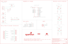

Contents
========

* [PRS16328 > SparkFun Auto pHAT](#prs16328--sparkfun-auto-phat)
	* [Schematic](#schematic)
	* [PCB](#pcb)
	* [Interactive BOM](#interactive-bom)
	* [OOMP Parts](#oomp-parts)
	* [Images](#images)
	* [Tags](#tags)
  
![][im]
# PRS16328 > SparkFun Auto pHAT

- ID: PROJ-SPAR-16328-STAN-01
- Hex ID: PRS16328
- Name: Sparkfun
- Description: Sparkfun
- Long Link: [http://oom.lt/PROJ-SPAR-16328-STAN-01](http://oom.lt/PROJ-SPAR-16328-STAN-01)
- Short Link: [http://oom.lt/PRS16328](http://oom.lt/PRS16328)

## Schematic
  

## PCB
  

## Interactive BOM

- Interactive BOM page: [ibom.html](https://htmlpreview.github.io/?https://github.com/oomlout/oomlout_OOMP_projects/blob/main/PROJ-SPAR-16328-STAN-01/kicad/bom/ibom.html)

## OOMP Parts
  

|OOMP ID|Name|Identifier|
| :---: | :---: | :---: |
|[CAPC-0603-X-NF100-V50](https://github.com/oomlout/oomlout_OOMP_parts/tree/main/CAPC-0603-X-NF100-V50/)|[SMD (0603) 100 nF Capacitor (Ceramic) 50v](https://github.com/oomlout/oomlout_OOMP_parts/tree/main/CAPC-0603-X-NF100-V50/)|[C2, C3, C6, C7, C8, C10, C12, C13](https://github.com/oomlout/oomlout_OOMP_parts/tree/main/CAPC-0603-X-NF100-V50/)|
|CAPE-PAND-X-UF100-01||C5|
|[CAPC-0603-X-NF10-V50](https://github.com/oomlout/oomlout_OOMP_parts/tree/main/CAPC-0603-X-NF10-V50/)|[SMD (0603) 10 nF Capacitor (Ceramic) 50v](https://github.com/oomlout/oomlout_OOMP_parts/tree/main/CAPC-0603-X-NF10-V50/)|[C11, C16, C26, C27](https://github.com/oomlout/oomlout_OOMP_parts/tree/main/CAPC-0603-X-NF10-V50/)|
|CAPC-0603-X-UNMATCHED-01||C14, C15|
|CAPC-0402-X-UNMATCHED-01||C17, C18, C19, C20|
|[CAPC-0402-X-NF100-V10](https://github.com/oomlout/oomlout_OOMP_parts/tree/main/CAPC-0402-X-NF100-V10/)|[SMD (0402) 100 nF Capacitor (Ceramic) 10v](https://github.com/oomlout/oomlout_OOMP_parts/tree/main/CAPC-0402-X-NF100-V10/)|[C21, C22, C23, C24](https://github.com/oomlout/oomlout_OOMP_parts/tree/main/CAPC-0402-X-NF100-V10/)|
|[CAPC-0805-X-UF10-V10](https://github.com/oomlout/oomlout_OOMP_parts/tree/main/CAPC-0805-X-UF10-V10/)|[SMD (0805) 10 uF Capacitor (Ceramic) 10v](https://github.com/oomlout/oomlout_OOMP_parts/tree/main/CAPC-0805-X-UF10-V10/)|[C25](https://github.com/oomlout/oomlout_OOMP_parts/tree/main/CAPC-0805-X-UF10-V10/)|
|LEDS-UNMATCHED-L-STAN-01||D2|
|UNMATCHED-UNMATCHED-X-UNMATCHED-01||F2, INT, J20, J23, JP2, JP3, JP4, JP13, JP15, TP0, TP1, TP2, TP3, TP4, TP5, TP6, TP7, TP8, TP10, TP11, TP12, TP13, TP14, TP15, TP16, TP17, TP18, TP19, U1, U4, U5, U6, U7, U8|
|HEAD-I01-X-UNMATCHED-01||J2|
|[HEAD-I01-X-PI03-01](https://github.com/oomlout/oomlout_OOMP_parts/tree/main/HEAD-I01-X-PI03-01/)|[2.54 mm 3 Pin Header](https://github.com/oomlout/oomlout_OOMP_parts/tree/main/HEAD-I01-X-PI03-01/)|[J3, J4, J5, J10](https://github.com/oomlout/oomlout_OOMP_parts/tree/main/HEAD-I01-X-PI03-01/)|
|HEAD-I01-X-PI01-01||J6, J17, J21, J22|
|[HEAD-I01-X-PI02-01](https://github.com/oomlout/oomlout_OOMP_parts/tree/main/HEAD-I01-X-PI02-01/)|[2.54 mm 2 Pin Header](https://github.com/oomlout/oomlout_OOMP_parts/tree/main/HEAD-I01-X-PI02-01/)|[J7, J8, J9, J11, J12, J13, J14, J15, J16](https://github.com/oomlout/oomlout_OOMP_parts/tree/main/HEAD-I01-X-PI02-01/)|
|[HEAD-JSTSH-X-PI04-RS](https://github.com/oomlout/oomlout_OOMP_parts/tree/main/HEAD-JSTSH-X-PI04-RS/)|[JST XH (1 mm) 4 Pin Header Right Angle (SMD)](https://github.com/oomlout/oomlout_OOMP_parts/tree/main/HEAD-JSTSH-X-PI04-RS/)|[J19, U$1](https://github.com/oomlout/oomlout_OOMP_parts/tree/main/HEAD-JSTSH-X-PI04-RS/)|
|MOSN-UNMATCHED-X-UNMATCHED-01||Q1, Q4, Q23, Q24, Q27, Q28|
|MOSP-SO23-X-UNMATCHED-01||Q5, Q7, Q9|
|UNMATCHED-SO363-X-UNMATCHED-01||Q6, Q8, Q10|
|RESE-UNMATCHED-X-O103-01||R1, R2, R4, R5, R8, R13, R15, R17, R18, R19, R22, R33, R37, R38, R39, R40, R41, R42, R43, R44|
|RESE-UNMATCHED-X-O472-01||R3, R6, R10, R11, R12|
|RESE-UNMATCHED-X-O473-01||R7, R9, R14|
|[RESE-0402-X-O222-01](https://github.com/oomlout/oomlout_OOMP_parts/tree/main/RESE-0402-X-O222-01/)|[SMD (0402) 2.2k Ohm Resistor](https://github.com/oomlout/oomlout_OOMP_parts/tree/main/RESE-0402-X-O222-01/)|[R16, R45, R47, R53, R54, R55, R56](https://github.com/oomlout/oomlout_OOMP_parts/tree/main/RESE-0402-X-O222-01/)|
|RESE-UNMATCHED-X-O10-01||R25, R26|
|RESE-UNMATCHED-X-O471-01||R27|

## Images
  
  

|bominteractivefront|bominteractiveback|kicadPcb3d|kicadPcb3dFront|kicadPcb3dBack|eagleImage|eagleSchemImage|pcbdraw|pcbdrawback|
| :---: | :---: | :---: | :---: | :---: | :---: | :---: | :---: | :---: |
||||||||||

## Tags

- hexID: PRS16328
- oompType: PROJ
- oompSize: SPAR
- oompColor: 16328
- oompDesc: STAN
- oompIndex: 01
- oompName: SparkFun Auto pHAT
- sources: All source files from https://github.com/sparkfun/SparkFun_Auto_pHAT (source licence details in srcLicense.md)
- linkBuyPage: https://www.sparkfun.com/products/16328
- oompID: PROJ-SPAR-16328-STAN-01
- oompParts: C2,CAPC-0603-X-NF100-V50
- oompParts: C3,CAPC-0603-X-NF100-V50
- oompParts: C5,CAPE-PAND-X-UF100-01
- oompParts: C6,CAPC-0603-X-NF100-V50
- oompParts: C7,CAPC-0603-X-NF100-V50
- oompParts: C8,CAPC-0603-X-NF100-V50
- oompParts: C10,CAPC-0603-X-NF100-V50
- oompParts: C11,CAPC-0603-X-NF10-V50
- oompParts: C12,CAPC-0603-X-NF100-V50
- oompParts: C13,CAPC-0603-X-NF100-V50
- oompParts: C14,CAPC-0603-X-UNMATCHED-01
- oompParts: C15,CAPC-0603-X-UNMATCHED-01
- oompParts: C16,CAPC-0603-X-NF10-V50
- oompParts: C17,CAPC-0402-X-UNMATCHED-01
- oompParts: C18,CAPC-0402-X-UNMATCHED-01
- oompParts: C19,CAPC-0402-X-UNMATCHED-01
- oompParts: C20,CAPC-0402-X-UNMATCHED-01
- oompParts: C21,CAPC-0402-X-NF100-V10
- oompParts: C22,CAPC-0402-X-NF100-V10
- oompParts: C23,CAPC-0402-X-NF100-V10
- oompParts: C24,CAPC-0402-X-NF100-V10
- oompParts: C25,CAPC-0805-X-UF10-V10
- oompParts: C26,CAPC-0603-X-NF10-V50
- oompParts: C27,CAPC-0603-X-NF10-V50
- oompParts: D2,LEDS-UNMATCHED-L-STAN-01
- oompParts: F2,UNMATCHED-UNMATCHED-X-UNMATCHED-01
- oompParts: INT,UNMATCHED-UNMATCHED-X-UNMATCHED-01
- oompParts: J2,HEAD-I01-X-UNMATCHED-01
- oompParts: J3,HEAD-I01-X-PI03-01
- oompParts: J4,HEAD-I01-X-PI03-01
- oompParts: J5,HEAD-I01-X-PI03-01
- oompParts: J6,HEAD-I01-X-PI01-01
- oompParts: J7,HEAD-I01-X-PI02-01
- oompParts: J8,HEAD-I01-X-PI02-01
- oompParts: J9,HEAD-I01-X-PI02-01
- oompParts: J10,HEAD-I01-X-PI03-01
- oompParts: J11,HEAD-I01-X-PI02-01
- oompParts: J12,HEAD-I01-X-PI02-01
- oompParts: J13,HEAD-I01-X-PI02-01
- oompParts: J14,HEAD-I01-X-PI02-01
- oompParts: J15,HEAD-I01-X-PI02-01
- oompParts: J16,HEAD-I01-X-PI02-01
- oompParts: J17,HEAD-I01-X-PI01-01
- oompParts: J19,HEAD-JSTSH-X-PI04-RS
- oompParts: J20,UNMATCHED-UNMATCHED-X-UNMATCHED-01
- oompParts: J21,HEAD-I01-X-PI01-01
- oompParts: J22,HEAD-I01-X-PI01-01
- oompParts: J23,UNMATCHED-UNMATCHED-X-UNMATCHED-01
- oompParts: JP2,UNMATCHED-UNMATCHED-X-UNMATCHED-01
- oompParts: JP3,UNMATCHED-UNMATCHED-X-UNMATCHED-01
- oompParts: JP4,UNMATCHED-UNMATCHED-X-UNMATCHED-01
- oompParts: JP13,UNMATCHED-UNMATCHED-X-UNMATCHED-01
- oompParts: JP15,UNMATCHED-UNMATCHED-X-UNMATCHED-01
- oompParts: Q1,MOSN-UNMATCHED-X-UNMATCHED-01
- oompParts: Q4,MOSN-UNMATCHED-X-UNMATCHED-01
- oompParts: Q5,MOSP-SO23-X-UNMATCHED-01
- oompParts: Q6,UNMATCHED-SO363-X-UNMATCHED-01
- oompParts: Q7,MOSP-SO23-X-UNMATCHED-01
- oompParts: Q8,UNMATCHED-SO363-X-UNMATCHED-01
- oompParts: Q9,MOSP-SO23-X-UNMATCHED-01
- oompParts: Q10,UNMATCHED-SO363-X-UNMATCHED-01
- oompParts: Q23,MOSN-UNMATCHED-X-UNMATCHED-01
- oompParts: Q24,MOSN-UNMATCHED-X-UNMATCHED-01
- oompParts: Q27,MOSN-UNMATCHED-X-UNMATCHED-01
- oompParts: Q28,MOSN-UNMATCHED-X-UNMATCHED-01
- oompParts: R1,RESE-UNMATCHED-X-O103-01
- oompParts: R2,RESE-UNMATCHED-X-O103-01
- oompParts: R3,RESE-UNMATCHED-X-O472-01
- oompParts: R4,RESE-UNMATCHED-X-O103-01
- oompParts: R5,RESE-UNMATCHED-X-O103-01
- oompParts: R6,RESE-UNMATCHED-X-O472-01
- oompParts: R7,RESE-UNMATCHED-X-O473-01
- oompParts: R8,RESE-UNMATCHED-X-O103-01
- oompParts: R9,RESE-UNMATCHED-X-O473-01
- oompParts: R10,RESE-UNMATCHED-X-O472-01
- oompParts: R11,RESE-UNMATCHED-X-O472-01
- oompParts: R12,RESE-UNMATCHED-X-O472-01
- oompParts: R13,RESE-UNMATCHED-X-O103-01
- oompParts: R14,RESE-UNMATCHED-X-O473-01
- oompParts: R15,RESE-UNMATCHED-X-O103-01
- oompParts: R16,RESE-0402-X-O222-01
- oompParts: R17,RESE-UNMATCHED-X-O103-01
- oompParts: R18,RESE-UNMATCHED-X-O103-01
- oompParts: R19,RESE-UNMATCHED-X-O103-01
- oompParts: R22,RESE-UNMATCHED-X-O103-01
- oompParts: R25,RESE-UNMATCHED-X-O10-01
- oompParts: R26,RESE-UNMATCHED-X-O10-01
- oompParts: R27,RESE-UNMATCHED-X-O471-01
- oompParts: R33,RESE-UNMATCHED-X-O103-01
- oompParts: R37,RESE-UNMATCHED-X-O103-01
- oompParts: R38,RESE-UNMATCHED-X-O103-01
- oompParts: R39,RESE-UNMATCHED-X-O103-01
- oompParts: R40,RESE-UNMATCHED-X-O103-01
- oompParts: R41,RESE-UNMATCHED-X-O103-01
- oompParts: R42,RESE-UNMATCHED-X-O103-01
- oompParts: R43,RESE-UNMATCHED-X-O103-01
- oompParts: R44,RESE-UNMATCHED-X-O103-01
- oompParts: R45,RESE-0402-X-O222-01
- oompParts: R47,RESE-0402-X-O222-01
- oompParts: R53,RESE-0402-X-O222-01
- oompParts: R54,RESE-0402-X-O222-01
- oompParts: R55,RESE-0402-X-O222-01
- oompParts: R56,RESE-0402-X-O222-01
- oompParts: TP0,UNMATCHED-UNMATCHED-X-UNMATCHED-01
- oompParts: TP1,UNMATCHED-UNMATCHED-X-UNMATCHED-01
- oompParts: TP2,UNMATCHED-UNMATCHED-X-UNMATCHED-01
- oompParts: TP3,UNMATCHED-UNMATCHED-X-UNMATCHED-01
- oompParts: TP4,UNMATCHED-UNMATCHED-X-UNMATCHED-01
- oompParts: TP5,UNMATCHED-UNMATCHED-X-UNMATCHED-01
- oompParts: TP6,UNMATCHED-UNMATCHED-X-UNMATCHED-01
- oompParts: TP7,UNMATCHED-UNMATCHED-X-UNMATCHED-01
- oompParts: TP8,UNMATCHED-UNMATCHED-X-UNMATCHED-01
- oompParts: TP10,UNMATCHED-UNMATCHED-X-UNMATCHED-01
- oompParts: TP11,UNMATCHED-UNMATCHED-X-UNMATCHED-01
- oompParts: TP12,UNMATCHED-UNMATCHED-X-UNMATCHED-01
- oompParts: TP13,UNMATCHED-UNMATCHED-X-UNMATCHED-01
- oompParts: TP14,UNMATCHED-UNMATCHED-X-UNMATCHED-01
- oompParts: TP15,UNMATCHED-UNMATCHED-X-UNMATCHED-01
- oompParts: TP16,UNMATCHED-UNMATCHED-X-UNMATCHED-01
- oompParts: TP17,UNMATCHED-UNMATCHED-X-UNMATCHED-01
- oompParts: TP18,UNMATCHED-UNMATCHED-X-UNMATCHED-01
- oompParts: TP19,UNMATCHED-UNMATCHED-X-UNMATCHED-01
- oompParts: U$1,HEAD-JSTSH-X-PI04-RS
- oompParts: U1,UNMATCHED-UNMATCHED-X-UNMATCHED-01
- oompParts: U4,UNMATCHED-UNMATCHED-X-UNMATCHED-01
- oompParts: U5,UNMATCHED-UNMATCHED-X-UNMATCHED-01
- oompParts: U6,UNMATCHED-UNMATCHED-X-UNMATCHED-01
- oompParts: U7,UNMATCHED-UNMATCHED-X-UNMATCHED-01
- oompParts: U8,UNMATCHED-UNMATCHED-X-UNMATCHED-01
- rawParts: C2,0.1uF,0.1UF-0603-25V-(+80/-20%),0603,0.1µF ceramic capacitors,,CAP-00810,,0.1uF,,
- rawParts: C3,0.1uF,0.1UF-0603-25V-(+80/-20%),0603,0.1µF ceramic capacitors,,CAP-00810,,0.1uF,,
- rawParts: C5,100uF,100UF-POLAR-25V-20%(ELEC),PANASONIC_D,100µF polarized capacitors,,CAP-12547,,100uF,,
- rawParts: C6,0.1uF,0.1UF-0603-25V-(+80/-20%),0603,0.1µF ceramic capacitors,,CAP-00810,,0.1uF,,
- rawParts: C7,0.1uF,0.1UF-0603-25V-(+80/-20%),0603,0.1µF ceramic capacitors,,CAP-00810,,0.1uF,,
- rawParts: C8,0.1uF,0.1UF-0603-25V-(+80/-20%),0603,0.1µF ceramic capacitors,,CAP-00810,,0.1uF,,
- rawParts: C10,0.1uF,0.1UF-0603-25V-(+80/-20%),0603,0.1µF ceramic capacitors,,CAP-00810,,0.1uF,,
- rawParts: C11,10nF,10NF-0603-50V-10%,0603,0.01uF/10nF/10,000pF ceramic capacitors,,CAP-00867,,10nF,,
- rawParts: C12,0.1uF,0.1UF-0603-25V-5%,0603,0.1µF ceramic capacitors,,CAP-08604,,0.1uF,,
- rawParts: C13,0.1uF,0.1UF-0603-25V-5%,0603,0.1µF ceramic capacitors,,CAP-08604,,0.1uF,,
- rawParts: C14,1.0uF,1.0UF-0603-16V-10%-X7R,0603,1µF ceramic capacitors,,CAP-13930,,1.0uF,,
- rawParts: C15,1.0uF,1.0UF-0603-16V-10%-X7R,0603,1µF ceramic capacitors,,CAP-13930,,1.0uF,,
- rawParts: C16,10nF,10NF-0603-50V-10%,0603,0.01uF/10nF/10,000pF ceramic capacitors,,CAP-00867,,10nF,,
- rawParts: C17,1.0uF,1.0UF-0402-16V-10%,0402,1µF ceramic capacitors,,CAP-12417,,1.0uF,,
- rawParts: C18,1.0uF,1.0UF-0402-16V-10%,0402,1µF ceramic capacitors,,CAP-12417,,1.0uF,,
- rawParts: C19,1.0uF,1.0UF-0402-16V-10%,0402,1µF ceramic capacitors,,CAP-12417,,1.0uF,,
- rawParts: C20,1.0uF,1.0UF-0402-16V-10%,0402,1µF ceramic capacitors,,CAP-12417,,1.0uF,,
- rawParts: C21,0.1uF,0.1UF-0402-16V-10%,0402,0.1µF ceramic capacitors,,CAP-12416,,0.1uF,,
- rawParts: C22,0.1uF,0.1UF-0402-16V-10%,0402,0.1µF ceramic capacitors,,CAP-12416,,0.1uF,,
- rawParts: C23,0.1uF,0.1UF-0402-16V-10%,0402,0.1µF ceramic capacitors,,CAP-12416,,0.1uF,,
- rawParts: C24,0.1uF,0.1UF-0402-16V-10%,0402,0.1µF ceramic capacitors,,CAP-12416,,0.1uF,,
- rawParts: C25,10uF,10UF-0805-25V-10%,0805,10.0µF ceramic capacitors,,CAP-14259,,10uF,,
- rawParts: C26,10nF,10NF-0603-50V-10%,0603,0.01uF/10nF/10,000pF ceramic capacitors,,CAP-00867,,10nF,,
- rawParts: C27,10nF,10NF-0603-50V-10%,0603,0.01uF/10nF/10,000pF ceramic capacitors,,CAP-00867,,10nF,,
- rawParts: D2,BLUE,LED-BLUE0603,LED-0603@1,Blue SMD LED,,DIO-08575,,BLUE,,
- rawParts: F2,16V/2.5A(5A TRIP),PPTC_16V_2.5A,1812,Resettable Fuse PPTC,,RES-14390,,16V/2.5A(5A TRIP),,
- rawParts: FD5,FIDUCIALUFIDUCIAL,FIDUCIALUFIDUCIAL,FIDUCIAL-MICRO,Fiducial Alignment Points,,,,,,
- rawParts: FD6,FIDUCIALUFIDUCIAL,FIDUCIALUFIDUCIAL,FIDUCIAL-MICRO,Fiducial Alignment Points,,,,,,
- rawParts: FD7,FIDUCIALUFIDUCIAL,FIDUCIALUFIDUCIAL,FIDUCIAL-MICRO,Fiducial Alignment Points,,,,,,
- rawParts: FD8,FIDUCIALUFIDUCIAL,FIDUCIALUFIDUCIAL,FIDUCIAL-MICRO,Fiducial Alignment Points,,,,,,
- rawParts: FRAME1,FRAME-LETTERNO_PACKAGE,FRAME-LETTERNO_PACKAGE,DUMMY,Schematic Frame - Letter,Nobody,,,,v01,
- rawParts: FRAME2,FRAME-LEDGER,FRAME-LEDGER,CREATIVE_COMMONS,Schematic Frame - Ledger,,,,,,
- rawParts: FRAME3,FRAME-LEDGER,FRAME-LEDGER,CREATIVE_COMMONS,Schematic Frame - Ledger,,,,,,
- rawParts: H9,STAND-OFFTIGHT,STAND-OFFTIGHT,STAND-OFF-TIGHT,Stand Off,,,,,,
- rawParts: H10,STAND-OFFTIGHT,STAND-OFFTIGHT,STAND-OFF-TIGHT,Stand Off,,,,,,
- rawParts: H11,STAND-OFFTIGHT,STAND-OFFTIGHT,STAND-OFF-TIGHT,Stand Off,,,,,,
- rawParts: H12,STAND-OFFTIGHT,STAND-OFFTIGHT,STAND-OFF-TIGHT,Stand Off,,,,,,
- rawParts: INT,,JUMPER-SMT_2_NC_TRACE_SILK,SMT-JUMPER_2_NC_TRACE_SILK,Normally closed trace jumper,,,,,,
- rawParts: J2,RASPBERRYPI-40-PIN-GPIO_SMD_STACKABLE_NOHOLES,RASPBERRYPI-40-PIN-GPIO_SMD_STACKABLE_NOHOLES,RASPBERRY_PI_HAT_40_PIN_SMD_STACKABLE_NOHOLES,Raspberry Pi GPIO Header,,CONN-14914,CONN-14915,,,
- rawParts: J3,,CONN_03LOCK,1X03_LOCK,Multi connection point. Often used as Generic Header-pin footprint for 0.1 inch spaced/style header connections,,,,,,
- rawParts: J4,,CONN_03LOCK,1X03_LOCK,Multi connection point. Often used as Generic Header-pin footprint for 0.1 inch spaced/style header connections,,,,,,
- rawParts: J5,,CONN_03LOCK,1X03_LOCK,Multi connection point. Often used as Generic Header-pin footprint for 0.1 inch spaced/style header connections,,,,,,
- rawParts: J6,,CONN_01PTH_NO_SILK_YES_STOP,1X01_NO_SILK,Single connection point. Often used as Generic Header-pin footprint for 0.1 inch spaced/style header connections,,,,,,
- rawParts: J7,EXT SERVO PWR,CONN_02,1X02,Multi connection point. Often used as Generic Header-pin footprint for 0.1 inch spaced/style header connections,,,,,,
- rawParts: J8,EXT 5V PWR,CONN_02,1X02,Multi connection point. Often used as Generic Header-pin footprint for 0.1 inch spaced/style header connections,,,,,,
- rawParts: J9,,CONN_02LG_DRILL,1X02_2.54_SCREWTERM_LG_DRILL,Multi connection point. Often used as Generic Header-pin footprint for 0.1 inch spaced/style header connections,,,,,,
- rawParts: J10,,CONN_03LOCK,1X03_LOCK,Multi connection point. Often used as Generic Header-pin footprint for 0.1 inch spaced/style header connections,,,,,,
- rawParts: J11,EXT MTR PWR,CONN_02,1X02,Multi connection point. Often used as Generic Header-pin footprint for 0.1 inch spaced/style header connections,,,,,,
- rawParts: J12,,CONN_022.54MM_SCREWTERM,1X02_2.54_SCREWTERM,Multi connection point. Often used as Generic Header-pin footprint for 0.1 inch spaced/style header connections,,,,,,
- rawParts: J13,,CONN_02LG_DRILL,1X02_2.54_SCREWTERM_LG_DRILL,Multi connection point. Often used as Generic Header-pin footprint for 0.1 inch spaced/style header connections,,,,,,
- rawParts: J14,,CONN_02LG_DRILL,1X02_2.54_SCREWTERM_LG_DRILL,Multi connection point. Often used as Generic Header-pin footprint for 0.1 inch spaced/style header connections,,,,,,
- rawParts: J15,,CONN_022.54MM_SCREWTERM,1X02_2.54_SCREWTERM,Multi connection point. Often used as Generic Header-pin footprint for 0.1 inch spaced/style header connections,,,,,,
- rawParts: J16,,CONN_02LG_DRILL,1X02_2.54_SCREWTERM_LG_DRILL,Multi connection point. Often used as Generic Header-pin footprint for 0.1 inch spaced/style header connections,,,,,,
- rawParts: J17,,CONN_01PTH_NO_SILK_YES_STOP,1X01_NO_SILK,Single connection point. Often used as Generic Header-pin footprint for 0.1 inch spaced/style header connections,,,,,,
- rawParts: J18,ISP,AVR_SPI_PROG_3X2TESTPOINTS,2X3_TEST_POINTS,AVR ISP 6 Pin,,,,,,
- rawParts: J19,,QWIIC_CONNECTORJS-1MM,JST04_1MM_RA,SparkFun I2C Standard Qwiic Connector,,CONN-13694,,QWIIC_RIGHT_ANGLE,,
- rawParts: J20,USB C,USB_C2-LAYER,USB-C-16P,USB Type C 16Pin Connector,,CONN-14122,,,,
- rawParts: J21,,CONN_01PTH_NO_SILK_YES_STOP,1X01_NO_SILK,Single connection point. Often used as Generic Header-pin footprint for 0.1 inch spaced/style header connections,,,,,,
- rawParts: J22,,CONN_01PTH_NO_SILK_YES_STOP,1X01_NO_SILK,Single connection point. Often used as Generic Header-pin footprint for 0.1 inch spaced/style header connections,,,,,,
- rawParts: J23,CORTEX_JTAG_DEBUG_PTH,CORTEX_JTAG_DEBUG_PTH,2X5-PTH-1.27MM,Cortex Debug Connector - 10 pin,,,,,,
- rawParts: JP1,JUMPER-PAD-2,JUMPER-SMT_2_NC_TRACE_NO-SILK,SMT-JUMPER_2_NC_TRACE_NO-SILK,Normally closed trace jumper,,,,,,
- rawParts: JP2,FUSE BP,JUMPER-SMT_2_NO_SILK,SMT-JUMPER_2_NO_SILK,Normally open jumper,,,,,,
- rawParts: JP3,I2C,JUMPER-SMT_3_2-NC_TRACE_SILK,SMT-JUMPER_3_2-NC_TRACE_SILK,Normally closed trace jumper (2 of 2 connections),,,,,,
- rawParts: JP4,PI ISO,JUMPER-SMT_2_NC_TRACE_SILK,SMT-JUMPER_2_NC_TRACE_SILK,Normally closed trace jumper,,,,,,
- rawParts: JP5,JUMPER-PAD-2,JUMPER-SMT_2_NC_TRACE_NO-SILK,SMT-JUMPER_2_NC_TRACE_NO-SILK,Normally closed trace jumper,,,,,,
- rawParts: JP6,JUMPER-PAD-2,JUMPER-SMT_2_NC_TRACE_NO-SILK,SMT-JUMPER_2_NC_TRACE_NO-SILK,Normally closed trace jumper,,,,,,
- rawParts: JP9,JUMPER-PAD-2,JUMPER-SMT_2_NC_TRACE_NO-SILK,SMT-JUMPER_2_NC_TRACE_NO-SILK,Normally closed trace jumper,,,,,,
- rawParts: JP10,JUMPER-PAD-2,JUMPER-SMT_2_NO_NO-SILK,SMT-JUMPER_2_NO_NO-SILK,Normally open jumper,,,,,,
- rawParts: JP11,JUMPER-PAD-2,JUMPER-SMT_2_NO_NO-SILK,SMT-JUMPER_2_NO_NO-SILK,Normally open jumper,,,,,,
- rawParts: JP12,JUMPER-PAD-2,JUMPER-SMT_2_NO_NO-SILK,SMT-JUMPER_2_NO_NO-SILK,Normally open jumper,,,,,,
- rawParts: JP13,ADR,JUMPER-SMT_2_NO_SILK,SMT-JUMPER_2_NO_SILK,Normally open jumper,,,,,,
- rawParts: JP15,ADR,JUMPER-SMT_2_NO_SILK,SMT-JUMPER_2_NO_SILK,Normally open jumper,,,,,,
- rawParts: LOGO1,SFE_LOGO_NAME_FLAME.1_INCH,SFE_LOGO_NAME_FLAME.1_INCH,SFE_LOGO_NAME_FLAME_.1,SparkFun Font Logo w/ Flame,,,,,,
- rawParts: LOGO2,OSHW-LOGOS,OSHW-LOGOS,OSHW-LOGO-S,Open-Source Hardware (OSHW) Logo,,,,,,
- rawParts: LOGO4,SFE_LOGO_NAME_FLAME.1_INCH,SFE_LOGO_NAME_FLAME.1_INCH,SFE_LOGO_NAME_FLAME_.1,SparkFun Font Logo w/ Flame,,,,,,
- rawParts: Q1,310mA/60V/1.6Ω,MOSFET-NCH-2N7002PW,SOT323,N-channel MOSFETs,,TRANS-11151,,310mA/60V/1.6Ω,,
- rawParts: Q4,310mA/60V/1.6Ω,MOSFET-NCH-2N7002PW,SOT323,N-channel MOSFETs,,TRANS-11151,,310mA/60V/1.6Ω,,
- rawParts: Q5,20V/4.2A/52mΩ/1.4W,MOSFET_PCH-DMG2305UX-7,SOT23-3,P-channel MOSFETs,,TRAN-14388,,20V/4.2A/52mΩ/1.4W,,
- rawParts: Q6,,TRANS_PNP_DUALSOT-363,SOT363_PHILIPS,Dual PNP Transistors in Single Package,,TRAN-14386,,,,
- rawParts: Q7,20V/4.2A/52mΩ/1.4W,MOSFET_PCH-DMG2305UX-7,SOT23-3,P-channel MOSFETs,,TRAN-14388,,20V/4.2A/52mΩ/1.4W,,
- rawParts: Q8,,TRANS_PNP_DUALSOT-363,SOT363_PHILIPS,Dual PNP Transistors in Single Package,,TRAN-14386,,,,
- rawParts: Q9,20V/4.2A/52mΩ/1.4W,MOSFET_PCH-DMG2305UX-7,SOT23-3,P-channel MOSFETs,,TRAN-14388,,20V/4.2A/52mΩ/1.4W,,
- rawParts: Q10,,TRANS_PNP_DUALSOT-363,SOT363_PHILIPS,Dual PNP Transistors in Single Package,,TRAN-14386,,,,
- rawParts: Q23,20V/0.2A/8MHz/1.2Ω/1Vth,MOSFET-NCH-RE1C00UNTL,SOT-416FL,N-channel MOSFETs,,TRANS-14399,,20V/0.2A/8MHz/1.2Ω/1Vth,,
- rawParts: Q24,20V/0.2A/8MHz/1.2Ω/1Vth,MOSFET-NCH-RE1C00UNTL,SOT-416FL,N-channel MOSFETs,,TRANS-14399,,20V/0.2A/8MHz/1.2Ω/1Vth,,
- rawParts: Q27,20V/0.2A/8MHz/1.2Ω/1Vth,MOSFET-NCH-RE1C00UNTL,SOT-416FL,N-channel MOSFETs,,TRANS-14399,,20V/0.2A/8MHz/1.2Ω/1Vth,,
- rawParts: Q28,20V/0.2A/8MHz/1.2Ω/1Vth,MOSFET-NCH-RE1C00UNTL,SOT-416FL,N-channel MOSFETs,,TRANS-14399,,20V/0.2A/8MHz/1.2Ω/1Vth,,
- rawParts: R1,10k,10KOHM-0603-1/10W-1%,0603@1,10kΩ resistor,,RES-00824,,10k,,
- rawParts: R2,10k,10KOHM-0603-1/10W-1%,0603@1,10kΩ resistor,,RES-00824,,10k,,
- rawParts: R3,5.1k,5.1KOHM5.1KOHM-0603-1/10W-1%,0603@1,,,RES-12083,,5.1k,,
- rawParts: R4,10k,10KOHM-0603-1/10W-1%,0603@1,10kΩ resistor,,RES-00824,,10k,,
- rawParts: R5,10k,10KOHM-0603-1/10W-1%,0603@1,10kΩ resistor,,RES-00824,,10k,,
- rawParts: R6,5.1k,5.1KOHM5.1KOHM-0603-1/10W-1%,0603@1,,,RES-12083,,5.1k,,
- rawParts: R7,47k,47KOHM-0603-1/10W-1%,0603@1,47kΩ resistor,,RES-07871,,47k,,
- rawParts: R8,10k,10KOHM-0603-1/10W-1%,0603@1,10kΩ resistor,,RES-00824,,10k,,
- rawParts: R9,47k,47KOHM-0603-1/10W-1%,0603@1,47kΩ resistor,,RES-07871,,47k,,
- rawParts: R10,5.1k,5.1KOHM5.1KOHM-0603-1/10W-1%,0603@1,,,RES-12083,,5.1k,,
- rawParts: R11,5.1k,5.1KOHM5.1KOHM-0603-1/10W-1%,0603@1,,,RES-12083,,5.1k,,
- rawParts: R12,5.1k,5.1KOHM5.1KOHM-0603-1/10W-1%,0603@1,,,RES-12083,,5.1k,,
- rawParts: R13,10k,10KOHM-0603-1/10W-1%,0603@1,10kΩ resistor,,RES-00824,,10k,,
- rawParts: R14,47k,47KOHM-0603-1/10W-1%,0603@1,47kΩ resistor,,RES-07871,,47k,,
- rawParts: R15,10k,10KOHM-0603-1/10W-1%,0603@1,10kΩ resistor,,RES-00824,,10k,,
- rawParts: R16,2.2k,2.2KOHM-0402T-1/16W-1%,0402-TIGHT,2.2kΩ resistor,,RES-14341,,2.2k,,
- rawParts: R17,10k,10KOHM-0603-1/10W-1%,0603@1,10kΩ resistor,,RES-00824,,10k,,
- rawParts: R18,10k,10KOHM-0603-1/10W-1%,0603@1,10kΩ resistor,,RES-00824,,10k,,
- rawParts: R19,10k,10KOHM-0603-1/10W-1%,0603@1,10kΩ resistor,,RES-00824,,10k,,
- rawParts: R22,10k,10KOHM-0603-1/10W-1%,0603@1,10kΩ resistor,,RES-00824,,10k,,
- rawParts: R25,1,1OHM-0603-1/10W-1%,0603@1,1Ω resistor,,RES-08269,,1,,
- rawParts: R26,1,1OHM-0603-1/10W-1%,0603@1,1Ω resistor,,RES-08269,,1,,
- rawParts: R27,470,470OHM-0603-1/10W-1%,0603@1,470Ω resistor,,RES-07869,,470,,
- rawParts: R33,10k,10KOHM-0603-1/10W-1%,0603@1,10kΩ resistor,,RES-00824,,10k,,
- rawParts: R37,10k,10KOHM-0603-1/10W-1%,0603@1,10kΩ resistor,,RES-00824,,10k,,
- rawParts: R38,10k,10KOHM-0603-1/10W-1%,0603@1,10kΩ resistor,,RES-00824,,10k,,
- rawParts: R39,10k,10KOHM-0603-1/10W-1%,0603@1,10kΩ resistor,,RES-00824,,10k,,
- rawParts: R40,10k,10KOHM-0603-1/10W-1%,0603@1,10kΩ resistor,,RES-00824,,10k,,
- rawParts: R41,10k,10KOHM-0603-1/10W-1%,0603@1,10kΩ resistor,,RES-00824,,10k,,
- rawParts: R42,10k,10KOHM-0603-1/10W-1%,0603@1,10kΩ resistor,,RES-00824,,10k,,
- rawParts: R43,10k,10KOHM-0603-1/10W-1%,0603@1,10kΩ resistor,,RES-00824,,10k,,
- rawParts: R44,10k,10KOHM-0603-1/10W-1%,0603@1,10kΩ resistor,,RES-00824,,10k,,
- rawParts: R45,2.2k,2.2KOHM-0402T-1/16W-1%,0402-TIGHT,2.2kΩ resistor,,RES-14341,,2.2k,,
- rawParts: R47,2.2k,2.2KOHM-0402T-1/16W-1%,0402-TIGHT,2.2kΩ resistor,,RES-14341,,2.2k,,
- rawParts: R53,2.2k,2.2KOHM-0402T-1/16W-1%,0402-TIGHT,2.2kΩ resistor,,RES-14341,,2.2k,,
- rawParts: R54,2.2k,2.2KOHM-0402T-1/16W-1%,0402-TIGHT,2.2kΩ resistor,,RES-14341,,2.2k,,
- rawParts: R55,2.2k,2.2KOHM-0402T-1/16W-1%,0402-TIGHT,2.2kΩ resistor,,RES-14341,,2.2k,,
- rawParts: R56,2.2k,2.2KOHM-0402T-1/16W-1%,0402-TIGHT,2.2kΩ resistor,,RES-14341,,2.2k,,
- rawParts: TP0,,TEST-POINT3X4,PAD.03X.04,SparkFun Test Points,,,,,,
- rawParts: TP1,,TEST-POINT3X4,PAD.03X.04,SparkFun Test Points,,,,,,
- rawParts: TP2,,TEST-POINT3X4,PAD.03X.04,SparkFun Test Points,,,,,,
- rawParts: TP3,,TEST-POINT3X4,PAD.03X.04,SparkFun Test Points,,,,,,
- rawParts: TP4,,TEST-POINTTP_15TH_THRU,TP_15TH,SparkFun Test Points,,,,,,
- rawParts: TP5,,TEST-POINTTP_15TH_THRU,TP_15TH,SparkFun Test Points,,,,,,
- rawParts: TP6,,TEST-POINT3X4,PAD.03X.04,SparkFun Test Points,,,,,,
- rawParts: TP7,,TEST-POINT3X4,PAD.03X.04,SparkFun Test Points,,,,,,
- rawParts: TP8,,TEST-POINT3X4,PAD.03X.04,SparkFun Test Points,,,,,,
- rawParts: TP9,TEST-POINT3X4,TEST-POINT3X4,PAD.03X.04,SparkFun Test Points,,,,,,
- rawParts: TP10,,TEST-POINT3X4,PAD.03X.04,SparkFun Test Points,,,,,,
- rawParts: TP11,,TEST-POINT3X4,PAD.03X.04,SparkFun Test Points,,,,,,
- rawParts: TP12,,TEST-POINT3X4,PAD.03X.04,SparkFun Test Points,,,,,,
- rawParts: TP13,,TEST-POINT3X4,PAD.03X.04,SparkFun Test Points,,,,,,
- rawParts: TP14,,TEST-POINT3X4,PAD.03X.04,SparkFun Test Points,,,,,,
- rawParts: TP15,,TEST-POINT3X4,PAD.03X.04,SparkFun Test Points,,,,,,
- rawParts: TP16,,TEST-POINT3X4,PAD.03X.04,SparkFun Test Points,,,,,,
- rawParts: TP17,,TEST-POINT3X4,PAD.03X.04,SparkFun Test Points,,,,,,
- rawParts: TP18,,TEST-POINT3X4,PAD.03X.04,SparkFun Test Points,,,,,,
- rawParts: TP19,,TEST-POINTTP_15TH_THRU,TP_15TH,SparkFun Test Points,,,,,,
- rawParts: U$1,QWIIC_LOGO_5MM,QWIIC_LOGO_5MM,QWIIC_5MM,Qwiic Logos for placement on schematic and PCB. The 5.5mm silk logo is best for placing next to Qwiic connector.,,,,,,
- rawParts: U1,PCA9685,PCA9685,TSSOP-28_4MM,16-channel 12-bit PWM,,IC-12271,,PCA9685,,
- rawParts: U4,ATTINY84-ARDUINO,ATTINY84-ARDUINO,SO14,,,IC-14155,,,,
- rawParts: U5,DRV8835,DRV883X,WSON-12,DRV8835 2 Channel Motor Driver,,IC-13342,,DRV8835,,
- rawParts: U6,CY8C4245LQI-483,PSOC4_4200_40QFN,QFN-40,Cypress PSoC 4200,,IC-13292,,CY8C4245LQI-483,,
- rawParts: U7,9DoF IMU,ICM-20948,QFN24-3X3,ICM-20948 9 Degree of Freedom IMU,,IC-14247,,9DoF IMU,,
- rawParts: U8,1.8V/100mA,V_REG_SP6214-1.8V,SC70,Voltage Regulator - SP6214,,VREG-08428,,1.8V/100mA,,

[im]: kicadPcb3d_450.png
