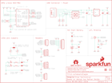

Contents
========

* [PRS16329 > SparkFun u-blox NEO-M8U](#prs16329--sparkfun-u-blox-neo-m8u)
	* [Schematic](#schematic)
	* [PCB](#pcb)
	* [Interactive BOM](#interactive-bom)
	* [Images](#images)
	* [Tags](#tags)
  
![][im]
# PRS16329 > SparkFun u-blox NEO-M8U

- ID: PROJ-SPAR-16329-STAN-01
- Hex ID: PRS16329
- Name: Sparkfun
- Description: Sparkfun
- Long Link: [http://oom.lt/PROJ-SPAR-16329-STAN-01](http://oom.lt/PROJ-SPAR-16329-STAN-01)
- Short Link: [http://oom.lt/PRS16329](http://oom.lt/PRS16329)

## Schematic
  

## PCB
  

## Interactive BOM

- Interactive BOM page: [ibom.html](https://htmlpreview.github.io/?https://github.com/oomlout/oomlout_OOMP_projects/blob/main/PROJ-SPAR-16329-STAN-01/kicad/bom/ibom.html)

## Images
  
  

|bominteractivefront|bominteractiveback|kicadPcb3d|kicadPcb3dFront|kicadPcb3dBack|eagleImage|eagleSchemImage|pcbdraw|pcbdrawback|
| :---: | :---: | :---: | :---: | :---: | :---: | :---: | :---: | :---: |
||||||||||

## Tags

- hexID: PRS16329
- oompType: PROJ
- oompSize: SPAR
- oompColor: 16329
- oompDesc: STAN
- oompIndex: 01
- oompName: SparkFun u-blox NEO-M8U
- sources: All source files from https://github.com/sparkfun/SparkFun_u-blox_NEO-M8U (source licence details in srcLicense.md)
- linkBuyPage: https://www.sparkfun.com/products/16329
- oompID: PROJ-SPAR-16329-STAN-01
- rawParts: BT1,6.8MM_COIN_CELL,ML414H_IV01E_BATTERY,ML414H_IV01E,SEIKO ML414H-IV01E Reflowable Lithium Battery,,BATT-14267,,,,
- rawParts: C1,1.0uF,1.0UF-0603-16V-10%,0603,1µF ceramic capacitors,,CAP-00868,,,1.0uF,
- rawParts: C2,1.0uF,1.0UF-0603-16V-10%,0603,1µF ceramic capacitors,,CAP-00868,,,1.0uF,
- rawParts: C3,47pF,47PF-0603-50V-5%,0603,47pF ceramic capacitors,,CAP-08913,,,47pF,
- rawParts: C4,1.0uF,1.0UF-0603-16V-10%,0603,1µF ceramic capacitors,,CAP-00868,,,1.0uF,
- rawParts: C5,0.1uF,0.1UF-0603-25V-(+80/-20%),0603,0.1µF ceramic capacitors,,CAP-00810,,,0.1uF,
- rawParts: D1,RED,LED-RED0603,LED-0603,Red SMD LED,,DIO-00819,,,RED,
- rawParts: D2,BLUE,LED-BLUE0603,LED-0603,Blue SMD LED,,DIO-08575,,,BLUE,
- rawParts: D3,0.5A/40V/420mV,DIODE-SCHOTTKY-PMEG4005EJ,SOD-323,Schottky diode,,DIO-10955,,,0.5A/40V/420mV,
- rawParts: D4,PRTR5V0U2F,PRTR5V0U2F,SOT886,A small ESD protection device. Most commonly used on USB D+/D- signals to protect large, expensive, or especially sensitive USB enabled devices.,,DIO-14084,,,,
- rawParts: FB1,30Ω/1.8A,FERRITE_BEAD-0603,0603,Ferrite Bead (blocks, cores, rings, chokes, etc.),,NDUC-13805,,,30Ω/1.8A,
- rawParts: FRAME1,FRAME-LETTER,FRAME-LETTER,CREATIVE_COMMONS,Schematic Frame - Letter,,,,,,
- rawParts: J1,,CONN_041X04_NO_SILK,1X04_NO_SILK,Multi connection point. Often used as Generic Header-pin footprint for 0.1 inch spaced/style header connections,,CONN-09696,,,,
- rawParts: J2,,CONN_041X04_NO_SILK,1X04_NO_SILK,Multi connection point. Often used as Generic Header-pin footprint for 0.1 inch spaced/style header connections,,CONN-09696,,,,
- rawParts: J3,Qwiic Right Angle,I2C_STANDARDQWIIC,JST04_1MM_RA,SparkFun I2C Standard Pinout Header,,CONN-13694,,,Qwiic Right Angle,
- rawParts: J4,Qwiic Right Angle,I2C_STANDARDQWIIC,JST04_1MM_RA,SparkFun I2C Standard Pinout Header,,CONN-13694,,,Qwiic Right Angle,
- rawParts: J5,,USB_C_2-LAYER_PADS,USB-C-16P-2LAYER-PADS,USB Type C 16Pin Connector,,CONN-14122,,,,
- rawParts: J6,,CONN_07NO_SILK,1X07_NO_SILK,Multi connection point. Often used as Generic Header-pin footprint for 0.1 inch spaced/style header connections,,,,,,
- rawParts: J7,U.FL,U.FL2PIN,U.FL,SMD Antenna Connector - U.FL,,CONN-09193,,WRL-09144,U.FL,
- rawParts: JP1,JUMPER-SMT_3_2-NC_TRACE_SILK,JUMPER-SMT_3_2-NC_TRACE_SILK,SMT-JUMPER_3_2-NC_TRACE_SILK,Normally closed trace jumper (2 of 2 connections),,,,,,
- rawParts: JP2,JUMPER-SMT_2_NC_TRACE_SILK,JUMPER-SMT_2_NC_TRACE_SILK,SMT-JUMPER_2_NC_TRACE_SILK,Normally closed trace jumper,,,,,,
- rawParts: JP3,JUMPER-SMT_2_NC_TRACE_SILK,JUMPER-SMT_2_NC_TRACE_SILK,SMT-JUMPER_2_NC_TRACE_SILK,Normally closed trace jumper,,,,,,
- rawParts: JP4,JUMPER-SMT_2_NO_SILK,JUMPER-SMT_2_NO_SILK,SMT-JUMPER_2_NO_SILK,Normally open jumper,,,,,,
- rawParts: JP5,FIDUCIALUFIDUCIAL,FIDUCIALUFIDUCIAL,MICRO-FIDUCIAL,Fiducial Alignment Points,,,,,,
- rawParts: JP6,FIDUCIALUFIDUCIAL,FIDUCIALUFIDUCIAL,MICRO-FIDUCIAL,Fiducial Alignment Points,,,,,,
- rawParts: JP7,FIDUCIALUFIDUCIAL,FIDUCIALUFIDUCIAL,MICRO-FIDUCIAL,Fiducial Alignment Points,,,,,,
- rawParts: JP8,FIDUCIALUFIDUCIAL,FIDUCIALUFIDUCIAL,MICRO-FIDUCIAL,Fiducial Alignment Points,,,,,,
- rawParts: JP9,STAND-OFF,STAND-OFF,STAND-OFF,Stand Off,,,,,,
- rawParts: JP10,STAND-OFF,STAND-OFF,STAND-OFF,Stand Off,,,,,,
- rawParts: JP11,STAND-OFF,STAND-OFF,STAND-OFF,Stand Off,,,,,,
- rawParts: JP12,STAND-OFF,STAND-OFF,STAND-OFF,Stand Off,,,,,,
- rawParts: LOGO1,OSHW-LOGOMINI,OSHW-LOGOMINI,OSHW-LOGO-MINI,Open-Source Hardware (OSHW) Logo,,,,,,
- rawParts: LOGO2,SFE_LOGO_NAME_FLAME.1_INCH,SFE_LOGO_NAME_FLAME.1_INCH,SFE_LOGO_NAME_FLAME_.1,SparkFun Font Logo w/ Flame,,,,,,
- rawParts: R1,27,27OHM-0603-1/10W-1%,0603,27Ω resistor,,RES-09334,,,27,
- rawParts: R2,27,27OHM-0603-1/10W-1%,0603,27Ω resistor,,RES-09334,,,27,
- rawParts: R3,100k,100KOHM-0603-1/10W-1%,0603,100kΩ resistor,,RES-07828,,,100k,
- rawParts: R4,2.2k,2.2KOHM-0603-1/10W-1%,0603,2.2kΩ resistor,,RES-08272,,,2.2k,
- rawParts: R5,1k,1KOHM-0603-1/10W-1%,0603,1kΩ resistor,,RES-07856,,,1k,
- rawParts: R6,1k,1KOHM-0603-1/10W-1%,0603,1kΩ resistor,,RES-07856,,,1k,
- rawParts: R7,2.2k,2.2KOHM-0603-1/10W-1%,0603,2.2kΩ resistor,,RES-08272,,,2.2k,
- rawParts: R8,33,33OHM-0603-1/10W-1%,0603,33Ω resistor,,RES-08270,,,33,
- rawParts: R9,33,33OHM-0603-1/10W-1%,0603,33Ω resistor,,RES-08270,,,33,
- rawParts: R10,33,33OHM-0603-1/10W-1%,0603,33Ω resistor,,RES-08270,,,33,
- rawParts: R11,33,33OHM-0603-1/10W-1%,0603,33Ω resistor,,RES-08270,,,33,
- rawParts: R12,5.1k,5.1KOHM5.1KOHM-0603-1/10W-1%,0603,,,RES-12083,,,5.1k,
- rawParts: R13,5.1k,5.1KOHM5.1KOHM-0603-1/10W-1%,0603,,,RES-12083,,,5.1k,
- rawParts: R14,1k,1KOHM-0603-1/10W-1%,0603,1kΩ resistor,,RES-07856,,,1k,
- rawParts: R15,10,10OHM-0603-1/10W-1%,0603,10Ω resistor,,RES-12581,,,10,
- rawParts: U1,U-BLOX_MEO-M8U,U-BLOX_MEO-M8U,NEO-M9N/M8T/M8U,u-blox NEO-M8U,,IC-14850,,,,
- rawParts: U2,3.3V,V_REG_AP2112K-3.3V,SOT23-5,AP2112 - 600mA CMOS LDO Regulator w/ Enable,,VREG-12457,,,3.3V,

[im]: kicadPcb3d_450.png
