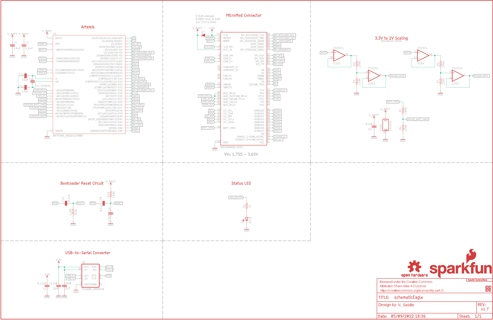
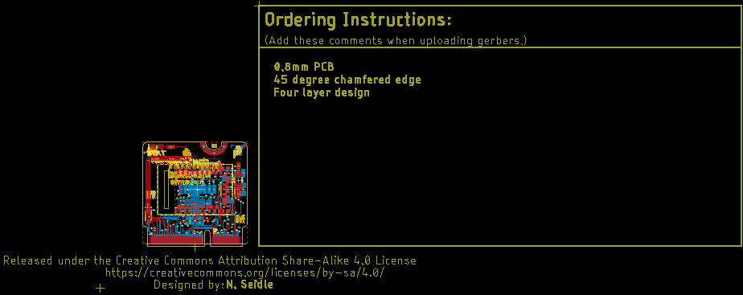
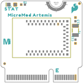
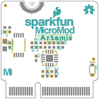
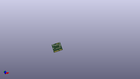
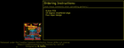
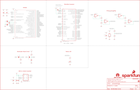
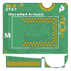
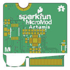

Contents
========

* [PRS16401 > MicroMod Artemis Processor](#prs16401--micromod-artemis-processor)
	* [Schematic](#schematic)
	* [PCB](#pcb)
	* [Interactive BOM](#interactive-bom)
	* [OOMP Parts](#oomp-parts)
	* [Images](#images)
	* [Tags](#tags)
  
![][im]
# PRS16401 > MicroMod Artemis Processor

- ID: PROJ-SPAR-16401-STAN-01
- Hex ID: PRS16401
- Name: Sparkfun
- Description: Sparkfun
- Long Link: [http://oom.lt/PROJ-SPAR-16401-STAN-01](http://oom.lt/PROJ-SPAR-16401-STAN-01)
- Short Link: [http://oom.lt/PRS16401](http://oom.lt/PRS16401)

## Schematic
  

## PCB
  

## Interactive BOM

- Interactive BOM page: [ibom.html](https://htmlpreview.github.io/?https://github.com/oomlout/oomlout_OOMP_projects/blob/main/PROJ-SPAR-16401-STAN-01/kicad/bom/ibom.html)

## OOMP Parts
  

|OOMP ID|Name|Identifier|
| :---: | :---: | :---: |
|[CAPC-0402-X-NF100-V10](https://github.com/oomlout/oomlout_OOMP_parts/tree/main/CAPC-0402-X-NF100-V10/)|[SMD (0402) 100 nF Capacitor (Ceramic) 10v](https://github.com/oomlout/oomlout_OOMP_parts/tree/main/CAPC-0402-X-NF100-V10/)|[C1, C18, C20, C21](https://github.com/oomlout/oomlout_OOMP_parts/tree/main/CAPC-0402-X-NF100-V10/)|
|[CAPC-0402-X-NF220-V16](https://github.com/oomlout/oomlout_OOMP_parts/tree/main/CAPC-0402-X-NF220-V16/)|[SMD (0402) 220 nF Capacitor (Ceramic) 16v](https://github.com/oomlout/oomlout_OOMP_parts/tree/main/CAPC-0402-X-NF220-V16/)|[C2](https://github.com/oomlout/oomlout_OOMP_parts/tree/main/CAPC-0402-X-NF220-V16/)|
|CAPC-0402-X-UNMATCHED-01||C3, C28|
|[CAPC-0603-X-UF10-V63D](https://github.com/oomlout/oomlout_OOMP_parts/tree/main/CAPC-0603-X-UF10-V63D/)|[SMD (0603) 10 uF Capacitor (Ceramic) 6.3v](https://github.com/oomlout/oomlout_OOMP_parts/tree/main/CAPC-0603-X-UF10-V63D/)|[C4](https://github.com/oomlout/oomlout_OOMP_parts/tree/main/CAPC-0603-X-UF10-V63D/)|
|[CAPC-0402-X-PF15-V50](https://github.com/oomlout/oomlout_OOMP_parts/tree/main/CAPC-0402-X-PF15-V50/)|[SMD (0402) 15 pF Capacitor (Ceramic) 50v](https://github.com/oomlout/oomlout_OOMP_parts/tree/main/CAPC-0402-X-PF15-V50/)|[C11, C13](https://github.com/oomlout/oomlout_OOMP_parts/tree/main/CAPC-0402-X-PF15-V50/)|
|[CAPC-0402-X-NF10-V50](https://github.com/oomlout/oomlout_OOMP_parts/tree/main/CAPC-0402-X-NF10-V50/)|[SMD (0402) 10 nF Capacitor (Ceramic) 50v](https://github.com/oomlout/oomlout_OOMP_parts/tree/main/CAPC-0402-X-NF10-V50/)|[C17](https://github.com/oomlout/oomlout_OOMP_parts/tree/main/CAPC-0402-X-NF10-V50/)|
|[LEDS-0603-L-STAN-01](https://github.com/oomlout/oomlout_OOMP_parts/tree/main/LEDS-0603-L-STAN-01/)|[SMD (0603) Blue LED](https://github.com/oomlout/oomlout_OOMP_parts/tree/main/LEDS-0603-L-STAN-01/)|[D2](https://github.com/oomlout/oomlout_OOMP_parts/tree/main/LEDS-0603-L-STAN-01/)|
|DIOD-S323-X-UNMATCHED-01||D7|
|UNMATCHED-UNMATCHED-X-UNMATCHED-01||J1, LOGO4, U1, U2, U6, Y1|
|[RESE-0402-X-O102-01](https://github.com/oomlout/oomlout_OOMP_parts/tree/main/RESE-0402-X-O102-01/)|[SMD (0402) 1k Ohm Resistor](https://github.com/oomlout/oomlout_OOMP_parts/tree/main/RESE-0402-X-O102-01/)|[R1](https://github.com/oomlout/oomlout_OOMP_parts/tree/main/RESE-0402-X-O102-01/)|
|RESE-0402-X-O1003-01||R2, R3, R6, R14|
|RESE-0402-X-O1503-01||R4, R5, R7|
|RESE-0402-X-O2203-01||R15|

## Images
  
  

|bominteractivefront|bominteractiveback|kicadPcb3d|kicadPcb3dFront|kicadPcb3dBack|eagleImage|eagleSchemImage|pcbdraw|pcbdrawback|
| :---: | :---: | :---: | :---: | :---: | :---: | :---: | :---: | :---: |
||||||||||

## Tags

- hexID: PRS16401
- oompType: PROJ
- oompSize: SPAR
- oompColor: 16401
- oompDesc: STAN
- oompIndex: 01
- oompName: MicroMod Artemis Processor
- sources: All source files from https://github.com/sparkfun/MicroMod_Artemis_Processor (source licence details in srcLicense.md)
- linkBuyPage: https://www.sparkfun.com/products/16401
- oompID: PROJ-SPAR-16401-STAN-01
- oompParts: C1,CAPC-0402-X-NF100-V10
- oompParts: C2,CAPC-0402-X-NF220-V16
- oompParts: C3,CAPC-0402-X-UNMATCHED-01
- oompParts: C4,CAPC-0603-X-UF10-V63D
- oompParts: C11,CAPC-0402-X-PF15-V50
- oompParts: C13,CAPC-0402-X-PF15-V50
- oompParts: C17,CAPC-0402-X-NF10-V50
- oompParts: C18,CAPC-0402-X-NF100-V10
- oompParts: C20,CAPC-0402-X-NF100-V10
- oompParts: C21,CAPC-0402-X-NF100-V10
- oompParts: C28,CAPC-0402-X-UNMATCHED-01
- oompParts: D2,LEDS-0603-L-STAN-01
- oompParts: D7,DIOD-S323-X-UNMATCHED-01
- oompParts: J1,UNMATCHED-UNMATCHED-X-UNMATCHED-01
- oompParts: LOGO4,UNMATCHED-UNMATCHED-X-UNMATCHED-01
- oompParts: R1,RESE-0402-X-O102-01
- oompParts: R2,RESE-0402-X-O1003-01
- oompParts: R3,RESE-0402-X-O1003-01
- oompParts: R4,RESE-0402-X-O1503-01
- oompParts: R5,RESE-0402-X-O1503-01
- oompParts: R6,RESE-0402-X-O1003-01
- oompParts: R7,RESE-0402-X-O1503-01
- oompParts: R14,RESE-0402-X-O1003-01
- oompParts: R15,RESE-0402-X-O2203-01
- oompParts: U1,UNMATCHED-UNMATCHED-X-UNMATCHED-01
- oompParts: U2,UNMATCHED-UNMATCHED-X-UNMATCHED-01
- oompParts: U6,UNMATCHED-UNMATCHED-X-UNMATCHED-01
- oompParts: Y1,UNMATCHED-UNMATCHED-X-UNMATCHED-01
- rawParts: C1,0.1uF,0.1UF-0402T-16V-10%,0402-TIGHT,0.1µF ceramic capacitors,,CAP-12416,,0.1uF,
- rawParts: C2,0.22uF,0.22UF-0402T-10V-10%,0402-TIGHT,0.22µF ceramic capacitors,,CAP-14846,,0.22uF,
- rawParts: C3,1.0uF,1.0UF-0402T-16V-10%,0402-TIGHT,1µF ceramic capacitors,,CAP-12417,,1.0uF,
- rawParts: C4,10uF,10UF-0603-6.3V-20%,0603,10.0µF ceramic capacitors,,CAP-11015,,10uF,
- rawParts: C11,15pF,15PF-0402T-50V-5%,0402-TIGHT,15pF ceramic capacitors,,CAP-13063,,15pF,
- rawParts: C13,15pF,15PF-0402T-50V-5%,0402-TIGHT,15pF ceramic capacitors,,CAP-13063,,15pF,
- rawParts: C17,10nF,10NF-0402T-25V-10%,0402-TIGHT,0.01uF/10nF/10,000pF ceramic capacitors,,CAP-14847,,10nF,
- rawParts: C18,0.1uF,0.1UF-0402T-16V-10%,0402-TIGHT,0.1µF ceramic capacitors,,CAP-12416,,0.1uF,
- rawParts: C20,0.1uF,0.1UF-0402T-16V-10%,0402-TIGHT,0.1µF ceramic capacitors,,CAP-12416,,0.1uF,
- rawParts: C21,0.1uF,0.1UF-0402T-16V-10%,0402-TIGHT,0.1µF ceramic capacitors,,CAP-12416,,0.1uF,
- rawParts: C28,1.0nF,1.0NF/1000PF-0402_TIGHT-50V-10%,0402-TIGHT,1nF/1,000pF ceramic capacitors,,CAP-14280,,1.0nF,
- rawParts: D2,BLUE,LED-BLUE0603,LED-0603,Blue SMD LED,,DIO-08575,,BLUE,
- rawParts: D7,1A/23V/620mV,DIODE-SCHOTTKY-BAT20J,SOD-323,Schottky diode,,DIO-11623,,1A/23V/620mV,
- rawParts: FD1,FIDUCIALUFIDUCIAL,FIDUCIALUFIDUCIAL,FIDUCIAL-MICRO,Fiducial Alignment Points,,,,,
- rawParts: FD2,FIDUCIALUFIDUCIAL,FIDUCIALUFIDUCIAL,FIDUCIAL-MICRO,Fiducial Alignment Points,,,,,
- rawParts: FD3,FIDUCIALUFIDUCIAL,FIDUCIALUFIDUCIAL,FIDUCIAL-MICRO,Fiducial Alignment Points,,,,,
- rawParts: FD4,FIDUCIALUFIDUCIAL,FIDUCIALUFIDUCIAL,FIDUCIAL-MICRO,Fiducial Alignment Points,,,,,
- rawParts: FRAME1,FRAME-LEDGER,FRAME-LEDGER,CREATIVE_COMMONS,Schematic Frame - Ledger,,,,,
- rawParts: J1,MICROMOD-2222,MICROMOD-2222,M.2-CARD-E-22,MicroMod Connector,,,,,
- rawParts: LOGO1,SFE_LOGO_NAME_FLAME.1_INCH,SFE_LOGO_NAME_FLAME.1_INCH,SFE_LOGO_NAME_FLAME_.1,SparkFun Font Logo w/ Flame,,,,,
- rawParts: LOGO2,SFE_LOGO_FLAME.1_INCH,SFE_LOGO_FLAME.1_INCH,SFE_LOGO_FLAME_.1,SparkFun Flame Logo,,,,,
- rawParts: LOGO3,OSHW-LOGOMINI,OSHW-LOGOMINI,OSHW-LOGO-MINI,Open-Source Hardware (OSHW) Logo,,,,,
- rawParts: LOGO4,SPECIAL_INSTRUCTIONS-ORDERING,SPECIAL_INSTRUCTIONS-ORDERING,ORDERING_INSTRUCTIONS,Special Ordering/Production Instructions Alert,,,,,
- rawParts: R1,1k,1KOHM-0402T-1/16W-1%,0402-TIGHT,1kΩ resistor,,RES-14342,,1k,
- rawParts: R2,100k,100KOHM-0402T-1/16W-1%,0402-TIGHT,100kΩ resistor,,RES-13495,,100k,
- rawParts: R3,100k,100KOHM-0402T-1/16W-1%,0402-TIGHT,100kΩ resistor,,RES-13495,,100k,
- rawParts: R4,150k,150KOHM-0402T-1/16W-1%,0402-TIGHT,150kΩ resistor,,RES-15093,,,
- rawParts: R5,150k,150KOHM-0402T-1/16W-1%,0402-TIGHT,150kΩ resistor,,RES-15093,,,
- rawParts: R6,100k,100KOHM-0402T-1/16W-1%,0402-TIGHT,100kΩ resistor,,RES-13495,,100k,
- rawParts: R7,150k,150KOHM-0402T-1/16W-1%,0402-TIGHT,150kΩ resistor,,RES-15093,,,
- rawParts: R14,100k,100KOHM-0402T-1/16W-1%,0402-TIGHT,100kΩ resistor,,RES-13495,,100k,
- rawParts: R15,220K,220KOHM-0402T-1/16W-1%,0402-TIGHT,220kΩ resistor,,RES-15094,,,
- rawParts: U1,ARTEMIS_MODULESMD,ARTEMIS_MODULESMD,ARTEMIS_FP,Description: The Artemis Module from SparkFun is a Cortex-M4F with BLE 5.0 running up to 96MHz and with as low power as 6uA per MHz (less than 5mW). This is the worlds first module to bridge the market between hobbyists and consumer products. Weve packaged all the power of a modern microcontroller into a module that is both extremely easy to use but is mass-market ready.,,SUB-14402,,,
- rawParts: U2,TSV524,TSV524,QFN-16,IC TSV524 Quad Op Amp,,IC-15092,,,
- rawParts: U6,CH340E_MSOP10,CH340E_MSOP10,MSOP10,,,IC-14135,,,
- rawParts: Y1,32.768kHz,CRYSTAL-32.768KHZSMD-3.2X1.5,CRYSTAL-SMD-3.2X1.5MM,32.768kHz Crystal,,XTAL-13062,,32.768kHz,

[im]: kicadPcb3d_450.png
