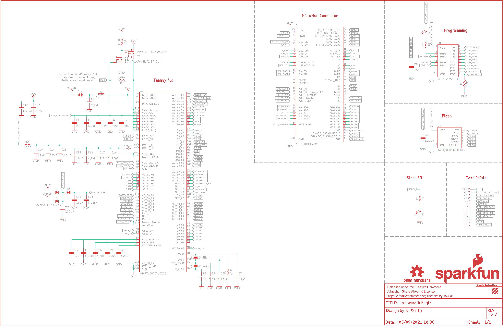
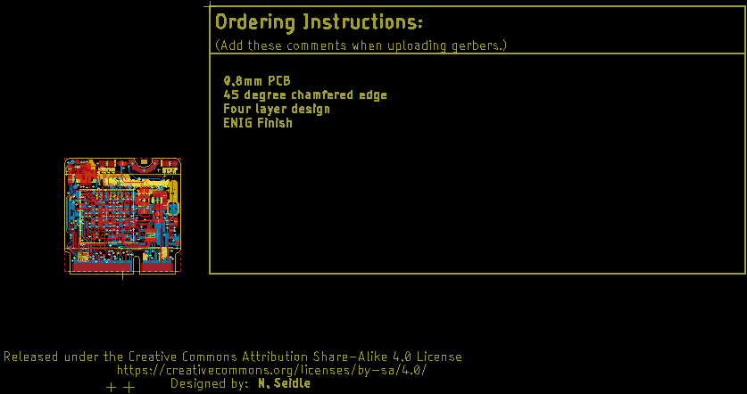
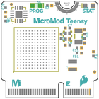
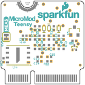
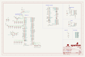
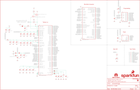
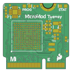
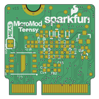

Contents
========

* [PRS16402 > MicroMod Teensy Processor](#prs16402--micromod-teensy-processor)
	* [Schematic](#schematic)
	* [PCB](#pcb)
	* [Interactive BOM](#interactive-bom)
	* [OOMP Parts](#oomp-parts)
	* [Images](#images)
	* [Tags](#tags)
  
![][im]
# PRS16402 > MicroMod Teensy Processor

- ID: PROJ-SPAR-16402-STAN-01
- Hex ID: PRS16402
- Name: Sparkfun
- Description: Sparkfun
- Long Link: [http://oom.lt/PROJ-SPAR-16402-STAN-01](http://oom.lt/PROJ-SPAR-16402-STAN-01)
- Short Link: [http://oom.lt/PRS16402](http://oom.lt/PRS16402)

## Schematic
  

## PCB
  

## Interactive BOM

- Interactive BOM page: [ibom.html](https://htmlpreview.github.io/?https://github.com/oomlout/oomlout_OOMP_projects/blob/main/PROJ-SPAR-16402-STAN-01/kicad/bom/ibom.html)

## OOMP Parts
  

|OOMP ID|Name|Identifier|
| :---: | :---: | :---: |
|CAPC-0402-X-UF22D-01||C1, C11|
|[CAPC-0402-X-UF47D-V63D](https://github.com/oomlout/oomlout_OOMP_parts/tree/main/CAPC-0402-X-UF47D-V63D/)|[SMD (0402) 4.7 uF Capacitor (Ceramic) 6.3v](https://github.com/oomlout/oomlout_OOMP_parts/tree/main/CAPC-0402-X-UF47D-V63D/)|[C2, C14, C18, C26, C27](https://github.com/oomlout/oomlout_OOMP_parts/tree/main/CAPC-0402-X-UF47D-V63D/)|
|[CAPC-0402-X-NF220-V16](https://github.com/oomlout/oomlout_OOMP_parts/tree/main/CAPC-0402-X-NF220-V16/)|[SMD (0402) 220 nF Capacitor (Ceramic) 16v](https://github.com/oomlout/oomlout_OOMP_parts/tree/main/CAPC-0402-X-NF220-V16/)|[C3, C4, C12, C13, C15, C17, C20, C22, C23, C24, C25, C28, C29](https://github.com/oomlout/oomlout_OOMP_parts/tree/main/CAPC-0402-X-NF220-V16/)|
|[CAPC-0402-X-NF10-V50](https://github.com/oomlout/oomlout_OOMP_parts/tree/main/CAPC-0402-X-NF10-V50/)|[SMD (0402) 10 nF Capacitor (Ceramic) 50v](https://github.com/oomlout/oomlout_OOMP_parts/tree/main/CAPC-0402-X-NF10-V50/)|[C5, C16](https://github.com/oomlout/oomlout_OOMP_parts/tree/main/CAPC-0402-X-NF10-V50/)|
|[CAPC-0402-X-PF12-V50](https://github.com/oomlout/oomlout_OOMP_parts/tree/main/CAPC-0402-X-PF12-V50/)|[SMD (0402) 12 pF Capacitor (Ceramic) 50v](https://github.com/oomlout/oomlout_OOMP_parts/tree/main/CAPC-0402-X-PF12-V50/)|[C6, C7](https://github.com/oomlout/oomlout_OOMP_parts/tree/main/CAPC-0402-X-PF12-V50/)|
|CAPC-0402-X-PF20-01||C8, C9|
|[CAPC-0402-X-UF10-V63D](https://github.com/oomlout/oomlout_OOMP_parts/tree/main/CAPC-0402-X-UF10-V63D/)|[SMD (0402) 10 uF Capacitor (Ceramic) 6.3v](https://github.com/oomlout/oomlout_OOMP_parts/tree/main/CAPC-0402-X-UF10-V63D/)|[C10, C19, C21](https://github.com/oomlout/oomlout_OOMP_parts/tree/main/CAPC-0402-X-UF10-V63D/)|
|[LEDS-0603-L-STAN-01](https://github.com/oomlout/oomlout_OOMP_parts/tree/main/LEDS-0603-L-STAN-01/)|[SMD (0603) Blue LED](https://github.com/oomlout/oomlout_OOMP_parts/tree/main/LEDS-0603-L-STAN-01/)|[D1](https://github.com/oomlout/oomlout_OOMP_parts/tree/main/LEDS-0603-L-STAN-01/)|
|DIOD-UNMATCHED-X-UNMATCHED-01||D2, D3, D4|
|[LEDS-0603-Y-STAN-01](https://github.com/oomlout/oomlout_OOMP_parts/tree/main/LEDS-0603-Y-STAN-01/)|[SMD (0603) Yellow LED](https://github.com/oomlout/oomlout_OOMP_parts/tree/main/LEDS-0603-Y-STAN-01/)|[D5](https://github.com/oomlout/oomlout_OOMP_parts/tree/main/LEDS-0603-Y-STAN-01/)|
|FERB-0402-X-UNMATCHED-01||FB1, FB2|
|UNMATCHED-UNMATCHED-X-UNMATCHED-01||J1, L2, LOGO3, MEAS, TP1, TP2, TP3, TP4, TP5, TP6, TP7, TP8, TP9, TP10, TP11, TP12, TP13, U1, U3, U4, Y1, Y2|
|MOSP-SO23-X-UNMATCHED-01||Q1|
|MOSN-UNMATCHED-X-UNMATCHED-01||Q2|
|[RESE-0402-X-O102-01](https://github.com/oomlout/oomlout_OOMP_parts/tree/main/RESE-0402-X-O102-01/)|[SMD (0402) 1k Ohm Resistor](https://github.com/oomlout/oomlout_OOMP_parts/tree/main/RESE-0402-X-O102-01/)|[R1, R7](https://github.com/oomlout/oomlout_OOMP_parts/tree/main/RESE-0402-X-O102-01/)|
|RESE-0402-X-O1003-01||R2, R5, R6|
|RESE-0402-X-UNMATCHED-01||R4|

## Images
  
  

|bominteractivefront|bominteractiveback|kicadPcb3d|kicadPcb3dFront|kicadPcb3dBack|kicadSchem|eagleImage|eagleSchemImage|pcbdraw|pcbdrawback|
| :---: | :---: | :---: | :---: | :---: | :---: | :---: | :---: | :---: | :---: |
|||||||||||

## Tags

- hexID: PRS16402
- oompType: PROJ
- oompSize: SPAR
- oompColor: 16402
- oompDesc: STAN
- oompIndex: 01
- oompName: MicroMod Teensy Processor
- sources: All source files from https://github.com/sparkfun/MicroMod_Teensy_Processor (source licence details in srcLicense.md)
- linkBuyPage: https://www.sparkfun.com/products/16402
- oompID: PROJ-SPAR-16402-STAN-01
- oompParts: C1,CAPC-0402-X-UF22D-01
- oompParts: C2,CAPC-0402-X-UF47D-V63D
- oompParts: C3,CAPC-0402-X-NF220-V16
- oompParts: C4,CAPC-0402-X-NF220-V16
- oompParts: C5,CAPC-0402-X-NF10-V50
- oompParts: C6,CAPC-0402-X-PF12-V50
- oompParts: C7,CAPC-0402-X-PF12-V50
- oompParts: C8,CAPC-0402-X-PF20-01
- oompParts: C9,CAPC-0402-X-PF20-01
- oompParts: C10,CAPC-0402-X-UF10-V63D
- oompParts: C11,CAPC-0402-X-UF22D-01
- oompParts: C12,CAPC-0402-X-NF220-V16
- oompParts: C13,CAPC-0402-X-NF220-V16
- oompParts: C14,CAPC-0402-X-UF47D-V63D
- oompParts: C15,CAPC-0402-X-NF220-V16
- oompParts: C16,CAPC-0402-X-NF10-V50
- oompParts: C17,CAPC-0402-X-NF220-V16
- oompParts: C18,CAPC-0402-X-UF47D-V63D
- oompParts: C19,CAPC-0402-X-UF10-V63D
- oompParts: C20,CAPC-0402-X-NF220-V16
- oompParts: C21,CAPC-0402-X-UF10-V63D
- oompParts: C22,CAPC-0402-X-NF220-V16
- oompParts: C23,CAPC-0402-X-NF220-V16
- oompParts: C24,CAPC-0402-X-NF220-V16
- oompParts: C25,CAPC-0402-X-NF220-V16
- oompParts: C26,CAPC-0402-X-UF47D-V63D
- oompParts: C27,CAPC-0402-X-UF47D-V63D
- oompParts: C28,CAPC-0402-X-NF220-V16
- oompParts: C29,CAPC-0402-X-NF220-V16
- oompParts: D1,LEDS-0603-L-STAN-01
- oompParts: D2,DIOD-UNMATCHED-X-UNMATCHED-01
- oompParts: D3,DIOD-UNMATCHED-X-UNMATCHED-01
- oompParts: D4,DIOD-UNMATCHED-X-UNMATCHED-01
- oompParts: D5,LEDS-0603-Y-STAN-01
- oompParts: FB1,FERB-0402-X-UNMATCHED-01
- oompParts: FB2,FERB-0402-X-UNMATCHED-01
- oompParts: J1,UNMATCHED-UNMATCHED-X-UNMATCHED-01
- oompParts: L2,UNMATCHED-UNMATCHED-X-UNMATCHED-01
- oompParts: LOGO3,UNMATCHED-UNMATCHED-X-UNMATCHED-01
- oompParts: MEAS,UNMATCHED-UNMATCHED-X-UNMATCHED-01
- oompParts: Q1,MOSP-SO23-X-UNMATCHED-01
- oompParts: Q2,MOSN-UNMATCHED-X-UNMATCHED-01
- oompParts: R1,RESE-0402-X-O102-01
- oompParts: R2,RESE-0402-X-O1003-01
- oompParts: R4,RESE-0402-X-UNMATCHED-01
- oompParts: R5,RESE-0402-X-O1003-01
- oompParts: R6,RESE-0402-X-O1003-01
- oompParts: R7,RESE-0402-X-O102-01
- oompParts: TP1,UNMATCHED-UNMATCHED-X-UNMATCHED-01
- oompParts: TP2,UNMATCHED-UNMATCHED-X-UNMATCHED-01
- oompParts: TP3,UNMATCHED-UNMATCHED-X-UNMATCHED-01
- oompParts: TP4,UNMATCHED-UNMATCHED-X-UNMATCHED-01
- oompParts: TP5,UNMATCHED-UNMATCHED-X-UNMATCHED-01
- oompParts: TP6,UNMATCHED-UNMATCHED-X-UNMATCHED-01
- oompParts: TP7,UNMATCHED-UNMATCHED-X-UNMATCHED-01
- oompParts: TP8,UNMATCHED-UNMATCHED-X-UNMATCHED-01
- oompParts: TP9,UNMATCHED-UNMATCHED-X-UNMATCHED-01
- oompParts: TP10,UNMATCHED-UNMATCHED-X-UNMATCHED-01
- oompParts: TP11,UNMATCHED-UNMATCHED-X-UNMATCHED-01
- oompParts: TP12,UNMATCHED-UNMATCHED-X-UNMATCHED-01
- oompParts: TP13,UNMATCHED-UNMATCHED-X-UNMATCHED-01
- oompParts: U1,UNMATCHED-UNMATCHED-X-UNMATCHED-01
- oompParts: U3,UNMATCHED-UNMATCHED-X-UNMATCHED-01
- oompParts: U4,UNMATCHED-UNMATCHED-X-UNMATCHED-01
- oompParts: Y1,UNMATCHED-UNMATCHED-X-UNMATCHED-01
- oompParts: Y2,UNMATCHED-UNMATCHED-X-UNMATCHED-01
- rawParts: C1,2.2uF,2.2UF-0402_TIGHT-10V-10%-X5R,0402-TIGHT,2.2µF ceramic capacitors,,CAP-14232,,2.2uF,
- rawParts: C2,4.7uF,4.7UF-0402_TIGHT-6.3V-20%-X5R,0402-TIGHT,4.7µF ceramic capacitors,,CAP-14240,,4.7uF,
- rawParts: C3,0.22uF,0.22UF-0402T-10V-10%,0402-TIGHT,0.22µF ceramic capacitors,,CAP-14846,,0.22uF,
- rawParts: C4,0.22uF,0.22UF-0402T-10V-10%,0402-TIGHT,0.22µF ceramic capacitors,,CAP-14846,,0.22uF,
- rawParts: C5,10nF,10NF-0402T-25V-10%,0402-TIGHT,0.01uF/10nF/10,000pF ceramic capacitors,,CAP-14847,,10nF,
- rawParts: C6,12pF,12PF-0402T-50V-5%,0402-TIGHT,12pF ceramic capacitors,,CAP-14665,,12pF,
- rawParts: C7,12pF,12PF-0402T-50V-5%,0402-TIGHT,12pF ceramic capacitors,,CAP-14665,,12pF,
- rawParts: C8,20pF,20PF-0402T-50V-5%,0402-TIGHT,20pF ceramic capacitors,,CAP-14843,,20pF,
- rawParts: C9,20pF,20PF-0402T-50V-5%,0402-TIGHT,20pF ceramic capacitors,,CAP-14843,,20pF,
- rawParts: C10,10uF,10UF-0402T-6.3V-20%,0402-TIGHT,10.0µF ceramic capacitors,,CAP-14848,,10uF,
- rawParts: C11,2.2uF,2.2UF-0402_TIGHT-10V-10%-X5R,0402-TIGHT,2.2µF ceramic capacitors,,CAP-14232,,2.2uF,
- rawParts: C12,0.22uF,0.22UF-0402T-10V-10%,0402-TIGHT,0.22µF ceramic capacitors,,CAP-14846,,0.22uF,
- rawParts: C13,0.22uF,0.22UF-0402T-10V-10%,0402-TIGHT,0.22µF ceramic capacitors,,CAP-14846,,0.22uF,
- rawParts: C14,4.7uF,4.7UF-0402_TIGHT-6.3V-20%-X5R,0402-TIGHT,4.7µF ceramic capacitors,,CAP-14240,,4.7uF,
- rawParts: C15,0.22uF,0.22UF-0402T-10V-10%,0402-TIGHT,0.22µF ceramic capacitors,,CAP-14846,,0.22uF,
- rawParts: C16,10nF,10NF-0402T-25V-10%,0402-TIGHT,0.01uF/10nF/10,000pF ceramic capacitors,,CAP-14847,,10nF,
- rawParts: C17,0.22uF,0.22UF-0402T-10V-10%,0402-TIGHT,0.22µF ceramic capacitors,,CAP-14846,,0.22uF,
- rawParts: C18,4.7uF,4.7UF-0402_TIGHT-6.3V-20%-X5R,0402-TIGHT,4.7µF ceramic capacitors,,CAP-14240,,4.7uF,
- rawParts: C19,10uF,10UF-0402T-6.3V-20%,0402-TIGHT,10.0µF ceramic capacitors,,CAP-14848,,10uF,
- rawParts: C20,0.22uF,0.22UF-0402T-10V-10%,0402-TIGHT,0.22µF ceramic capacitors,,CAP-14846,,0.22uF,
- rawParts: C21,10uF,10UF-0402T-6.3V-20%,0402-TIGHT,10.0µF ceramic capacitors,,CAP-14848,,10uF,
- rawParts: C22,0.22uF,0.22UF-0402T-10V-10%,0402-TIGHT,0.22µF ceramic capacitors,,CAP-14846,,0.22uF,
- rawParts: C23,0.22uF,0.22UF-0402T-10V-10%,0402-TIGHT,0.22µF ceramic capacitors,,CAP-14846,,0.22uF,
- rawParts: C24,0.22uF,0.22UF-0402T-10V-10%,0402-TIGHT,0.22µF ceramic capacitors,,CAP-14846,,0.22uF,
- rawParts: C25,0.22uF,0.22UF-0402T-10V-10%,0402-TIGHT,0.22µF ceramic capacitors,,CAP-14846,,0.22uF,
- rawParts: C26,4.7uF,4.7UF-0402_TIGHT-6.3V-20%-X5R,0402-TIGHT,4.7µF ceramic capacitors,,CAP-14240,,4.7uF,
- rawParts: C27,4.7uF,4.7UF-0402_TIGHT-6.3V-20%-X5R,0402-TIGHT,4.7µF ceramic capacitors,,CAP-14240,,4.7uF,
- rawParts: C28,0.22uF,0.22UF-0402T-10V-10%,0402-TIGHT,0.22µF ceramic capacitors,,CAP-14846,,0.22uF,
- rawParts: C29,0.22uF,0.22UF-0402T-10V-10%,0402-TIGHT,0.22µF ceramic capacitors,,CAP-14846,,0.22uF,
- rawParts: D1,BLUE,LED-BLUE0603,LED-0603,Blue SMD LED,,DIO-08575,,BLUE,
- rawParts: D2,120mA/40V/370mV,DIODE-SCHOTTKY-RB751S40,SOD-523,Schottky diode,,DIO-11018,,120mA/40V/370mV,
- rawParts: D3,120mA/40V/370mV,DIODE-SCHOTTKY-RB751S40,SOD-523,Schottky diode,,DIO-11018,,120mA/40V/370mV,
- rawParts: D4,120mA/40V/370mV,DIODE-SCHOTTKY-RB751S40,SOD-523,Schottky diode,,DIO-11018,,120mA/40V/370mV,
- rawParts: D5,Yellow,LED-YELLOW0603,LED-0603,Yellow SMD LED,,DIO-09003,,Yellow,
- rawParts: FB1,120Ω,FERRITE_BEAD-120_OHM-0402T,0402-TIGHT,Ferrite Bead (blocks, cores, rings, chokes, etc.),,NDUC-14206,,,
- rawParts: FB2,120Ω,FERRITE_BEAD-120_OHM-0402T,0402-TIGHT,Ferrite Bead (blocks, cores, rings, chokes, etc.),,NDUC-14206,,,
- rawParts: FD1,FIDUCIALUFIDUCIAL,FIDUCIALUFIDUCIAL,FIDUCIAL-MICRO,Fiducial Alignment Points,,,,,
- rawParts: FD2,FIDUCIALUFIDUCIAL,FIDUCIALUFIDUCIAL,FIDUCIAL-MICRO,Fiducial Alignment Points,,,,,
- rawParts: FD3,FIDUCIALUFIDUCIAL,FIDUCIALUFIDUCIAL,FIDUCIAL-MICRO,Fiducial Alignment Points,,,,,
- rawParts: FD4,FIDUCIALUFIDUCIAL,FIDUCIALUFIDUCIAL,FIDUCIAL-MICRO,Fiducial Alignment Points,,,,,
- rawParts: FRAME1,FRAME-LEDGER,FRAME-LEDGER,CREATIVE_COMMONS,Schematic Frame - Ledger,,,,,
- rawParts: J1,MICROMOD-2222,MICROMOD-2222,M.2-CARD-E-22,MicroMod Connector,,,,,
- rawParts: L2,4.7μH,4.7μH_SHIELDED_INDUCTOR,1008(2520),4.7uH Inductor,,NDUC-14880,,,
- rawParts: LOGO1,SFE_LOGO_NAME_FLAME.1_INCH,SFE_LOGO_NAME_FLAME.1_INCH,SFE_LOGO_NAME_FLAME_.1,SparkFun Font Logo w/ Flame,,,,,
- rawParts: LOGO2,OSHW-LOGONO_SILK,OSHW-LOGONO_SILK,DUMMY,Open-Source Hardware (OSHW) Logo,,,,,
- rawParts: LOGO3,SPECIAL_INSTRUCTIONS-ORDERING,SPECIAL_INSTRUCTIONS-ORDERING,ORDERING_INSTRUCTIONS,Special Ordering/Production Instructions Alert,,,,,
- rawParts: MEAS,,JUMPER-SMT_2_NC_TRACE_SILK,SMT-JUMPER_2_NC_TRACE_SILK,Normally closed trace jumper,,,,,
- rawParts: Q1,20V/4.2A/52mΩ/1.4W,MOSFET_PCH-DMG2305UX-7,SOT23-3,P-channel MOSFETs,,TRAN-14388,,20V/4.2A/52mΩ/1.4W,
- rawParts: Q2,20V/0.2A/8MHz/1.2Ω/1Vth,MOSFET-NCH-RE1C00UNTL,SOT-416FL,N-channel MOSFETs,,TRANS-14399,,20V/0.2A/8MHz/1.2Ω/1Vth,
- rawParts: R1,1k,1KOHM-0402T-1/16W-1%,0402-TIGHT,1kΩ resistor,,RES-14342,,1k,
- rawParts: R2,100k,100KOHM-0402T-1/16W-1%,0402-TIGHT,100kΩ resistor,,RES-13495,,100k,
- rawParts: R4,2.2M,2.2MOHMS-0402T-1/10W-1%,0402-TIGHT,2MΩ resistor,,RES-14844,,2.2M,
- rawParts: R5,100k,100KOHM-0402T-1/16W-1%,0402-TIGHT,100kΩ resistor,,RES-13495,,100k,
- rawParts: R6,100k,100KOHM-0402T-1/16W-1%,0402-TIGHT,100kΩ resistor,,RES-13495,,100k,
- rawParts: R7,1k,1KOHM-0402T-1/16W-1%,0402-TIGHT,1kΩ resistor,,RES-14342,,1k,
- rawParts: TP1,,TEST-POINT3,PAD.03X.03,SparkFun Test Points,,,,,
- rawParts: TP2,,TEST-POINT3,PAD.03X.03,SparkFun Test Points,,,,,
- rawParts: TP3,,TEST-POINT3,PAD.03X.03,SparkFun Test Points,,,,,
- rawParts: TP4,,TEST-POINT3,PAD.03X.03,SparkFun Test Points,,,,,
- rawParts: TP5,,TEST-POINT3,PAD.03X.03,SparkFun Test Points,,,,,
- rawParts: TP6,,TEST-POINT3,PAD.03X.03,SparkFun Test Points,,,,,
- rawParts: TP7,,TEST-POINT3,PAD.03X.03,SparkFun Test Points,,,,,
- rawParts: TP8,,TEST-POINT3,PAD.03X.03,SparkFun Test Points,,,,,
- rawParts: TP9,,TEST-POINT3,PAD.03X.03,SparkFun Test Points,,,,,
- rawParts: TP10,,TEST-POINT3,PAD.03X.03,SparkFun Test Points,,,,,
- rawParts: TP11,,TEST-POINT3,PAD.03X.03,SparkFun Test Points,,,,,
- rawParts: TP12,,TEST-POINT3,PAD.03X.03,SparkFun Test Points,,,,,
- rawParts: TP13,,TEST-POINT3,PAD.03X.03,SparkFun Test Points,,,,,
- rawParts: U1,IMXRT1062DV10X10,IMXRT1062DV10X10,IMXRT1062,,,IC-14904,,,
- rawParts: U3,MKL02Z32VFG4,MKL02Z32VFG4QFN-16,QFN-16,,,IC-14906,,,
- rawParts: U4,W25QXX128MBIT-6X5,W25QXX128MBIT-6X5-SKINNY_CENTER,WSON-8-6X5-SKINNY_CENTERPAD,,,IC-15107,,,
- rawParts: Y1,32.768kHz,CRYSTAL-32.768KHZSMD-3.2X1.5,CRYSTAL-SMD-3.2X1.5MM,32.768kHz Crystal,,XTAL-13062,,32.768kHz,
- rawParts: Y2,24MHz,CRYSTAL-24MHZ-SMD-2.0X1.6MM,CRYSTAL-SMD-2.0X1.6MM,24MHz Crystal,,XTAL-14845,,24MHz,

[im]: kicadPcb3d_450.png
