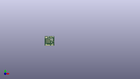
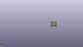
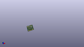

Contents
========

* [PROJ-SPAR-16402-STAN-01>MicroMod Teensy Processor](#proj-spar-16402-stan-01micromod-teensy-processor)
	* [Images](#images)
	* [Interactive BOM](#interactive-bom)
	* [OOMP Parts](#oomp-parts)
	* [Tags](#tags)
  
![][im]
# PROJ-SPAR-16402-STAN-01>MicroMod Teensy Processor

- ID: PROJ-SPAR-16402-STAN-01
- Hex ID: PRS16402
- Name: MicroMod Teensy Processor
- Description: 

## Images
  
  

|eagleImage|kicadPcb3dFront|kicadPcb3dBack|kicadPcb3d|
| :---: | :---: | :---: | :---: |
|||||

## Interactive BOM

- Interactive BOM page: [ibom.html](kicad/bom/ibom.html)

## OOMP Parts
  

|OOMP Parts|
| :---: |
|CAPC-0402-X-UF22D-01, C1, 9.299999942, 12.290000057999999, M270,C1, 2.2uF, 0402-TIGHT, SparkFun-Capacitors, (0.36614173, 0.48385827), MR270|
|CAPC-0402-X-UNMATCHED-01, C2, 8.000000002, 12.290000057999999, M270,C2, 4.7uF, 0402-TIGHT, SparkFun-Capacitors, (0.31496063, 0.48385827), MR270|
|CAPC-0402-X-NF220-01, C3, 8.000000002, 9.789999977999999, M90,C3, 0.22uF, 0402-TIGHT, SparkFun-Capacitors, (0.31496063, 0.38543307), MR90|
|CAPC-0402-X-NF220-01, C4, 12.999999908, 14.789999883999998, M90,C4, 0.22uF, 0402-TIGHT, SparkFun-Capacitors, (0.51181102, 0.58228346), MR90|
|CAPC-0402-X-UNMATCHED-01, C5, 9.299999942, 9.789999977999999, M90,C5, 10nF, 0402-TIGHT, SparkFun-Capacitors, (0.36614173, 0.38543307), MR90|
|CAPC-0402-X-UNMATCHED-01, C6, 15.100000025999998, 11.989999895999999, 0,C6, 12pF, 0402-TIGHT, SparkFun-Capacitors, (0.59448819, 0.47204724), R0|
|CAPC-0402-X-UNMATCHED-01, C7, 15.100000025999998, 15.889999969999998, 0,C7, 12pF, 0402-TIGHT, SparkFun-Capacitors, (0.59448819, 0.62559055), R0|
|CAPE-0402-X-UNMATCHED-01, C8, 19.000000099999998, 14.989999992, 270,C8, 20pF, 0402-TIGHT, SparkFun-Capacitors, (0.7480315, 0.59015748), R270|
|CAPE-0402-X-UNMATCHED-01, C9, 19.000000099999998, 12.989999927999998, 90,C9, 20pF, 0402-TIGHT, SparkFun-Capacitors, (0.7480315, 0.51141732), R90|
|CAPC-0402-X-UNMATCHED-01, C10, 11.800000021999999, 7.190000097999999, M180,C10, 10uF, 0402-TIGHT, SparkFun-Capacitors, (0.46456693, 0.28307087), MR180|
|CAPC-0402-X-UF22D-01, C11, 17.779999999999998, 11.42000002, 180,C11, 2.2uF, 0402-TIGHT, SparkFun-Capacitors, (0.7, 0.4496063), R180|
|CAPC-0402-X-NF220-01, C12, 12.999999908, 9.789999977999999, M270,C12, 0.22uF, 0402-TIGHT, SparkFun-Capacitors, (0.51181102, 0.38543307), MR270|
|CAPC-0402-X-NF220-01, C13, 11.800000021999999, 9.789999977999999, M270,C13, 0.22uF, 0402-TIGHT, SparkFun-Capacitors, (0.46456693, 0.38543307), MR270|
|CAPC-0402-X-UNMATCHED-01, C14, 11.800000021999999, 5.989999957999999, M180,C14, 4.7uF, 0402-TIGHT, SparkFun-Capacitors, (0.46456693, 0.23582677), MR180|
|CAPC-0402-X-NF220-01, C15, 9.199999887999999, 7.190000097999999, M0,C15, 0.22uF, 0402-TIGHT, SparkFun-Capacitors, (0.36220472, 0.28307087), MR0|
|CAPC-0402-X-UNMATCHED-01, C16, 6.700000061999999, 9.789999977999999, M270,C16, 10nF, 0402-TIGHT, SparkFun-Capacitors, (0.26377953, 0.38543307), MR270|
|CAPC-0402-X-NF220-01, C17, 6.700000061999999, 12.290000057999999, M90,C17, 0.22uF, 0402-TIGHT, SparkFun-Capacitors, (0.26377953, 0.48385827), MR90|
|CAPC-0402-X-UNMATCHED-01, C18, 5.400000122, 12.290000057999999, M90,C18, 4.7uF, 0402-TIGHT, SparkFun-Capacitors, (0.21259843, 0.48385827), MR90|
|CAPC-0402-X-UNMATCHED-01, C19, 5.400000122, 9.789999977999999, M270,C19, 10uF, 0402-TIGHT, SparkFun-Capacitors, (0.21259843, 0.38543307), MR270|
|CAPC-0402-X-NF220-01, C20, 10.599999881999999, 12.290000057999999, M90,C20, 0.22uF, 0402-TIGHT, SparkFun-Capacitors, (0.41732283, 0.48385827), MR90|
|CAPC-0402-X-UNMATCHED-01, C21, 8.000000002, 14.789999883999998, M90,C21, 10uF, 0402-TIGHT, SparkFun-Capacitors, (0.31496063, 0.58228346), MR90|
|CAPC-0402-X-NF220-01, C22, 11.800000021999999, 12.290000057999999, M90,C22, 0.22uF, 0402-TIGHT, SparkFun-Capacitors, (0.46456693, 0.48385827), MR90|
|CAPC-0402-X-NF220-01, C23, 11.800000021999999, 14.789999883999998, M90,C23, 0.22uF, 0402-TIGHT, SparkFun-Capacitors, (0.46456693, 0.58228346), MR90|
|CAPC-0402-X-NF220-01, C24, 12.999999908, 12.290000057999999, M270,C24, 0.22uF, 0402-TIGHT, SparkFun-Capacitors, (0.51181102, 0.48385827), MR270|
|CAPC-0402-X-NF220-01, C25, 15.24999998, 12.300000037999999, M90,C25, 0.22uF, 0402-TIGHT, SparkFun-Capacitors, (0.6003937, 0.48425197), MR90|
|CAPC-0402-X-UNMATCHED-01, C26, 14.300000102, 12.290000057999999, M270,C26, 4.7uF, 0402-TIGHT, SparkFun-Capacitors, (0.56299213, 0.48385827), MR270|
|CAPC-0402-X-UNMATCHED-01, C27, 16.200000111999998, 12.300000037999999, M90,C27, 4.7uF, 0402-TIGHT, SparkFun-Capacitors, (0.63779528, 0.48425197), MR90|
|CAPC-0402-X-NF220-01, C28, 1.000000032, 19.989999898, 90,C28, 0.22uF, 0402-TIGHT, SparkFun-Capacitors, (0.03937008, 0.78700787), R90|
|CAPC-0402-X-NF220-01, C29, 21.349999972, 6.300000099999999, M90,C29, 0.22uF, 0402-TIGHT, SparkFun-Capacitors, (0.84055118, 0.2480315), MR90|
|UNMATCHED-0603-X-UNMATCHED-01, D1, 19.999999877999997, 20.98999993, 180,D1, BLUE, LED-0603, SparkFun-LED, (0.78740157, 0.82637795), R180|
|UNMATCHED-UNMATCHED-X-UNMATCHED-01, D2, 10.599999881999999, 14.789999883999998, M270,D2, 120mA/40V/370mV, SOD-523, SparkFun-DiscreteSemi, (0.41732283, 0.58228346), MR270|
|UNMATCHED-UNMATCHED-X-UNMATCHED-01, D3, 6.700000061999999, 14.789999883999998, M270,D3, 120mA/40V/370mV, SOD-523, SparkFun-DiscreteSemi, (0.26377953, 0.58228346), MR270|
|UNMATCHED-UNMATCHED-X-UNMATCHED-01, D4, 9.299999942, 14.789999883999998, M90,D4, 120mA/40V/370mV, SOD-523, SparkFun-DiscreteSemi, (0.36614173, 0.58228346), MR90|
|UNMATCHED-0603-X-UNMATCHED-01, D5, 8.000000002, 20.98999993, 0,D5, Yellow, LED-0603, SparkFun-LED, (0.31496063, 0.82637795), R0|
|UNMATCHED-0402-X-UNMATCHED-01, FB1, 17.779999999999998, 10.15000002, 180,FB1, 120?, 0402-TIGHT, SparkFun-Coils, (0.7, 0.3996063), R180|
|UNMATCHED-0402-X-UNMATCHED-01, FB2, 9.199999887999999, 5.989999957999999, M180,FB2, 120?, 0402-TIGHT, SparkFun-Coils, (0.36220472, 0.23582677), MR180|
|UNMATCHED-UNMATCHED-X-UNMATCHED-01, J1, 11.000000098, 0.0, 0,J1, MICROMOD-2222, M.2-CARD-E-22, SparkFun-MicroMod, (0.43307087, 0), R0|
|UNMATCHED-UNMATCHED-X-UNMATCHED-01, L2, 16.250000011999997, 7.350000031999999, 90,L2, 4.7?H, 1008(2520), SparkFun-Coils, (0.63976378, 0.28937008), R90|
|UNMATCHED-UNMATCHED-X-UNMATCHED-01, MEAS, 20.599999947999997, 12.444000004, M90,MEAS, SMT-JUMPER_2_NC_TRACE_SILK, SparkFun-Jumpers, (0.81102362, 0.48992126), MR90|
|UNMATCHED-UNMATCHED-X-UNMATCHED-01, Q1, 2.54, 13.960000019999999, M0,Q1, 20V/4.2A/52m?/1.4W, SOT23-3, SparkFun-DiscreteSemi, (0.1, 0.5496063), MR0|
|UNMATCHED-UNMATCHED-X-UNMATCHED-01, Q2, 2.54, 10.15000002, M0,Q2, 20V/0.2A/8MHz/1.2?/1Vth, SOT-416FL, SparkFun-DiscreteSemi, (0.1, 0.3996063), MR0|
|RESE-0402-X-UNMATCHED-01, R1, 20.99999991, 9.990000086, 270,R1, 1k, 0402-TIGHT, SparkFun-Resistors, (0.82677165, 0.39330709), R270|
|<table><tr><td></td><td> R2</td><td>[RESE-0402-X-O104-01 SMD (0402) 110k Ohm Resistor](https://github.com/oomlout/oomlout_OOMP_parts/tree/main/RESE-0402-X-O104-01/)</td><td>[R42104](https://github.com/oomlout/oomlout_OOMP_parts/tree/main/RESE-0402-X-O104-01/)</td></tr></table>|
|RESE-0402-X-UNMATCHED-01, R4, 13.649999878, 13.98999996, 270,R4, 2.2M, 0402-TIGHT, SparkFun-Resistors, (0.53740157, 0.5507874), R270|
|<table><tr><td></td><td> R5</td><td>[RESE-0402-X-O104-01 SMD (0402) 110k Ohm Resistor](https://github.com/oomlout/oomlout_OOMP_parts/tree/main/RESE-0402-X-O104-01/)</td><td>[R42104](https://github.com/oomlout/oomlout_OOMP_parts/tree/main/RESE-0402-X-O104-01/)</td></tr></table>|
|<table><tr><td></td><td> R6</td><td>[RESE-0402-X-O104-01 SMD (0402) 110k Ohm Resistor](https://github.com/oomlout/oomlout_OOMP_parts/tree/main/RESE-0402-X-O104-01/)</td><td>[R42104](https://github.com/oomlout/oomlout_OOMP_parts/tree/main/RESE-0402-X-O104-01/)</td></tr></table>|
|RESE-0402-X-UNMATCHED-01, R7, 11.000000098, 20.98999993, 180,R7, 1k, 0402-TIGHT, SparkFun-Resistors, (0.43307087, 0.82637795), R180|
|UNMATCHED-UNMATCHED-X-UNMATCHED-01, U1, 8.000000002, 10.990000118, 90,U1, IMXRT1062DV10X10, IMXRT1062, Teensy, (0.31496063, 0.43267717), R90|
|UNMATCHED-UNMATCHED-X-UNMATCHED-01, U3, 3.9999998740000002, 18.990000119999998, 90,U3, MKL02Z32VFG4, QFN-16, Teensy, (0.15748031, 0.7476378), R90|
|UNMATCHED-UNMATCHED-X-UNMATCHED-01, U4, 17.510000032, 7.619999999999999, M180,U4, W25QXX128MBIT-6X5, WSON-8-6X5-SKINNY_CENTERPAD, SparkFun-MicroMod, (0.68937008, 0.3), MR180|
|UNMATCHED-UNMATCHED-X-UNMATCHED-01, Y1, 17.600000106, 13.98999996, 270,Y1, 32.768kHz, CRYSTAL-SMD-3.2X1.5MM, SparkFun-Clocks, (0.69291339, 0.5507874), R270|
|UNMATCHED-UNMATCHED-X-UNMATCHED-01, Y2, 15.100000025999998, 13.98999996, 90,Y2, 24MHz, CRYSTAL-SMD-2.0X1.6MM, SparkFun-Clocks, (0.59448819, 0.5507874), R90|

## Tags

- hexID: PRS16402
- oompType: PROJ
- oompSize: SPAR
- oompColor: 16402
- oompDesc: STAN
- oompIndex: 01
- oompName: MicroMod Teensy Processor
- sources: All source files from https://github.com/sparkfun/MicroMod_Teensy_Processor (source licence details in srcLicense.md)
- linkBuyPage: https://www.sparkfun.com/products/16402
- oompID: PROJ-SPAR-16402-STAN-01
- oompPart: CAPC-0402-X-UF22D-01, C1, 9.299999942, 12.290000057999999, M270
- oompPart: CAPC-0402-X-UNMATCHED-01, C2, 8.000000002, 12.290000057999999, M270
- oompPart: CAPC-0402-X-NF220-01, C3, 8.000000002, 9.789999977999999, M90
- oompPart: CAPC-0402-X-NF220-01, C4, 12.999999908, 14.789999883999998, M90
- oompPart: CAPC-0402-X-UNMATCHED-01, C5, 9.299999942, 9.789999977999999, M90
- oompPart: CAPC-0402-X-UNMATCHED-01, C6, 15.100000025999998, 11.989999895999999, 0
- oompPart: CAPC-0402-X-UNMATCHED-01, C7, 15.100000025999998, 15.889999969999998, 0
- oompPart: CAPE-0402-X-UNMATCHED-01, C8, 19.000000099999998, 14.989999992, 270
- oompPart: CAPE-0402-X-UNMATCHED-01, C9, 19.000000099999998, 12.989999927999998, 90
- oompPart: CAPC-0402-X-UNMATCHED-01, C10, 11.800000021999999, 7.190000097999999, M180
- oompPart: CAPC-0402-X-UF22D-01, C11, 17.779999999999998, 11.42000002, 180
- oompPart: CAPC-0402-X-NF220-01, C12, 12.999999908, 9.789999977999999, M270
- oompPart: CAPC-0402-X-NF220-01, C13, 11.800000021999999, 9.789999977999999, M270
- oompPart: CAPC-0402-X-UNMATCHED-01, C14, 11.800000021999999, 5.989999957999999, M180
- oompPart: CAPC-0402-X-NF220-01, C15, 9.199999887999999, 7.190000097999999, M0
- oompPart: CAPC-0402-X-UNMATCHED-01, C16, 6.700000061999999, 9.789999977999999, M270
- oompPart: CAPC-0402-X-NF220-01, C17, 6.700000061999999, 12.290000057999999, M90
- oompPart: CAPC-0402-X-UNMATCHED-01, C18, 5.400000122, 12.290000057999999, M90
- oompPart: CAPC-0402-X-UNMATCHED-01, C19, 5.400000122, 9.789999977999999, M270
- oompPart: CAPC-0402-X-NF220-01, C20, 10.599999881999999, 12.290000057999999, M90
- oompPart: CAPC-0402-X-UNMATCHED-01, C21, 8.000000002, 14.789999883999998, M90
- oompPart: CAPC-0402-X-NF220-01, C22, 11.800000021999999, 12.290000057999999, M90
- oompPart: CAPC-0402-X-NF220-01, C23, 11.800000021999999, 14.789999883999998, M90
- oompPart: CAPC-0402-X-NF220-01, C24, 12.999999908, 12.290000057999999, M270
- oompPart: CAPC-0402-X-NF220-01, C25, 15.24999998, 12.300000037999999, M90
- oompPart: CAPC-0402-X-UNMATCHED-01, C26, 14.300000102, 12.290000057999999, M270
- oompPart: CAPC-0402-X-UNMATCHED-01, C27, 16.200000111999998, 12.300000037999999, M90
- oompPart: CAPC-0402-X-NF220-01, C28, 1.000000032, 19.989999898, 90
- oompPart: CAPC-0402-X-NF220-01, C29, 21.349999972, 6.300000099999999, M90
- oompPart: UNMATCHED-0603-X-UNMATCHED-01, D1, 19.999999877999997, 20.98999993, 180
- oompPart: UNMATCHED-UNMATCHED-X-UNMATCHED-01, D2, 10.599999881999999, 14.789999883999998, M270
- oompPart: UNMATCHED-UNMATCHED-X-UNMATCHED-01, D3, 6.700000061999999, 14.789999883999998, M270
- oompPart: UNMATCHED-UNMATCHED-X-UNMATCHED-01, D4, 9.299999942, 14.789999883999998, M90
- oompPart: UNMATCHED-0603-X-UNMATCHED-01, D5, 8.000000002, 20.98999993, 0
- oompPart: UNMATCHED-0402-X-UNMATCHED-01, FB1, 17.779999999999998, 10.15000002, 180
- oompPart: UNMATCHED-0402-X-UNMATCHED-01, FB2, 9.199999887999999, 5.989999957999999, M180
- oompPart: SKIP-UNMATCHED-X-UNMATCHED-01, FD1, 21.300000072, 5.889999904, 0
- oompPart: SKIP-UNMATCHED-X-UNMATCHED-01, FD2, 2.2999999719999997, 21.290000092, 0
- oompPart: SKIP-UNMATCHED-X-UNMATCHED-01, FD3, 1.000000032, 4.989999925999999, M0
- oompPart: SKIP-UNMATCHED-X-UNMATCHED-01, FD4, 20.99999991, 20.98999993, M0
- oompPart: UNMATCHED-UNMATCHED-X-UNMATCHED-01, J1, 11.000000098, 0.0, 0
- oompPart: UNMATCHED-UNMATCHED-X-UNMATCHED-01, L2, 16.250000011999997, 7.350000031999999, 90
- oompPart: UNMATCHED-UNMATCHED-X-UNMATCHED-01, MEAS, 20.599999947999997, 12.444000004, M90
- oompPart: UNMATCHED-UNMATCHED-X-UNMATCHED-01, Q1, 2.54, 13.960000019999999, M0
- oompPart: UNMATCHED-UNMATCHED-X-UNMATCHED-01, Q2, 2.54, 10.15000002, M0
- oompPart: RESE-0402-X-UNMATCHED-01, R1, 20.99999991, 9.990000086, 270
- oompPart: RESE-0402-X-O104-01, R2, 2.54, 11.42000002, M180
- oompPart: RESE-0402-X-UNMATCHED-01, R4, 13.649999878, 13.98999996, 270
- oompPart: RESE-0402-X-O104-01, R5, 1.000000032, 17.990000088, 270
- oompPart: RESE-0402-X-O104-01, R6, 10.599999881999999, 9.789999977999999, M90
- oompPart: RESE-0402-X-UNMATCHED-01, R7, 11.000000098, 20.98999993, 180
- oompPart: SKIP-UNMATCHED-X-UNMATCHED-01, TP1, 12.400000091999999, 16.600000074, M270
- oompPart: SKIP-UNMATCHED-X-UNMATCHED-01, TP2, 1.549999948, 10.640000056, M0
- oompPart: SKIP-UNMATCHED-X-UNMATCHED-01, TP3, 11.000000098, 8.250000009999999, M90
- oompPart: SKIP-UNMATCHED-X-UNMATCHED-01, TP4, 5.560000056, 15.440000108, M0
- oompPart: SKIP-UNMATCHED-X-UNMATCHED-01, TP5, 8.899999979999999, 16.689999894, M0
- oompPart: SKIP-UNMATCHED-X-UNMATCHED-01, TP6, 13.999999939999999, 14.539999876, M0
- oompPart: SKIP-UNMATCHED-X-UNMATCHED-01, TP7, 16.799999928, 13.889999906, M0
- oompPart: SKIP-UNMATCHED-X-UNMATCHED-01, TP8, 2.000000064, 16.590000094, M0
- oompPart: SKIP-UNMATCHED-X-UNMATCHED-01, TP9, 3.735999894, 19.486999887999996, M0
- oompPart: SKIP-UNMATCHED-X-UNMATCHED-01, TP10, 7.2999998779999995, 10.990000118, M270
- oompPart: SKIP-UNMATCHED-X-UNMATCHED-01, TP11, 7.136999949999999, 20.121999887999998, M270
- oompPart: SKIP-UNMATCHED-X-UNMATCHED-01, TP12, 1.439999914, 21.280000112, M0
- oompPart: SKIP-UNMATCHED-X-UNMATCHED-01, TP13, 10.756000078, 21.134999893999996, M0
- oompPart: UNMATCHED-UNMATCHED-X-UNMATCHED-01, U1, 8.000000002, 10.990000118, 90
- oompPart: UNMATCHED-UNMATCHED-X-UNMATCHED-01, U3, 3.9999998740000002, 18.990000119999998, 90
- oompPart: UNMATCHED-UNMATCHED-X-UNMATCHED-01, U4, 17.510000032, 7.619999999999999, M180
- oompPart: UNMATCHED-UNMATCHED-X-UNMATCHED-01, Y1, 17.600000106, 13.98999996, 270
- oompPart: UNMATCHED-UNMATCHED-X-UNMATCHED-01, Y2, 15.100000025999998, 13.98999996, 90
- rawPart: C1, 2.2uF, 0402-TIGHT, SparkFun-Capacitors, (0.36614173, 0.48385827), MR270
- rawPart: C2, 4.7uF, 0402-TIGHT, SparkFun-Capacitors, (0.31496063, 0.48385827), MR270
- rawPart: C3, 0.22uF, 0402-TIGHT, SparkFun-Capacitors, (0.31496063, 0.38543307), MR90
- rawPart: C4, 0.22uF, 0402-TIGHT, SparkFun-Capacitors, (0.51181102, 0.58228346), MR90
- rawPart: C5, 10nF, 0402-TIGHT, SparkFun-Capacitors, (0.36614173, 0.38543307), MR90
- rawPart: C6, 12pF, 0402-TIGHT, SparkFun-Capacitors, (0.59448819, 0.47204724), R0
- rawPart: C7, 12pF, 0402-TIGHT, SparkFun-Capacitors, (0.59448819, 0.62559055), R0
- rawPart: C8, 20pF, 0402-TIGHT, SparkFun-Capacitors, (0.7480315, 0.59015748), R270
- rawPart: C9, 20pF, 0402-TIGHT, SparkFun-Capacitors, (0.7480315, 0.51141732), R90
- rawPart: C10, 10uF, 0402-TIGHT, SparkFun-Capacitors, (0.46456693, 0.28307087), MR180
- rawPart: C11, 2.2uF, 0402-TIGHT, SparkFun-Capacitors, (0.7, 0.4496063), R180
- rawPart: C12, 0.22uF, 0402-TIGHT, SparkFun-Capacitors, (0.51181102, 0.38543307), MR270
- rawPart: C13, 0.22uF, 0402-TIGHT, SparkFun-Capacitors, (0.46456693, 0.38543307), MR270
- rawPart: C14, 4.7uF, 0402-TIGHT, SparkFun-Capacitors, (0.46456693, 0.23582677), MR180
- rawPart: C15, 0.22uF, 0402-TIGHT, SparkFun-Capacitors, (0.36220472, 0.28307087), MR0
- rawPart: C16, 10nF, 0402-TIGHT, SparkFun-Capacitors, (0.26377953, 0.38543307), MR270
- rawPart: C17, 0.22uF, 0402-TIGHT, SparkFun-Capacitors, (0.26377953, 0.48385827), MR90
- rawPart: C18, 4.7uF, 0402-TIGHT, SparkFun-Capacitors, (0.21259843, 0.48385827), MR90
- rawPart: C19, 10uF, 0402-TIGHT, SparkFun-Capacitors, (0.21259843, 0.38543307), MR270
- rawPart: C20, 0.22uF, 0402-TIGHT, SparkFun-Capacitors, (0.41732283, 0.48385827), MR90
- rawPart: C21, 10uF, 0402-TIGHT, SparkFun-Capacitors, (0.31496063, 0.58228346), MR90
- rawPart: C22, 0.22uF, 0402-TIGHT, SparkFun-Capacitors, (0.46456693, 0.48385827), MR90
- rawPart: C23, 0.22uF, 0402-TIGHT, SparkFun-Capacitors, (0.46456693, 0.58228346), MR90
- rawPart: C24, 0.22uF, 0402-TIGHT, SparkFun-Capacitors, (0.51181102, 0.48385827), MR270
- rawPart: C25, 0.22uF, 0402-TIGHT, SparkFun-Capacitors, (0.6003937, 0.48425197), MR90
- rawPart: C26, 4.7uF, 0402-TIGHT, SparkFun-Capacitors, (0.56299213, 0.48385827), MR270
- rawPart: C27, 4.7uF, 0402-TIGHT, SparkFun-Capacitors, (0.63779528, 0.48425197), MR90
- rawPart: C28, 0.22uF, 0402-TIGHT, SparkFun-Capacitors, (0.03937008, 0.78700787), R90
- rawPart: C29, 0.22uF, 0402-TIGHT, SparkFun-Capacitors, (0.84055118, 0.2480315), MR90
- rawPart: D1, BLUE, LED-0603, SparkFun-LED, (0.78740157, 0.82637795), R180
- rawPart: D2, 120mA/40V/370mV, SOD-523, SparkFun-DiscreteSemi, (0.41732283, 0.58228346), MR270
- rawPart: D3, 120mA/40V/370mV, SOD-523, SparkFun-DiscreteSemi, (0.26377953, 0.58228346), MR270
- rawPart: D4, 120mA/40V/370mV, SOD-523, SparkFun-DiscreteSemi, (0.36614173, 0.58228346), MR90
- rawPart: D5, Yellow, LED-0603, SparkFun-LED, (0.31496063, 0.82637795), R0
- rawPart: FB1, 120?, 0402-TIGHT, SparkFun-Coils, (0.7, 0.3996063), R180
- rawPart: FB2, 120?, 0402-TIGHT, SparkFun-Coils, (0.36220472, 0.23582677), MR180
- rawPart: FD1, FIDUCIALUFIDUCIAL, FIDUCIAL-MICRO, SparkFun-Aesthetics, (0.83858268, 0.23188976), R0
- rawPart: FD2, FIDUCIALUFIDUCIAL, FIDUCIAL-MICRO, SparkFun-Aesthetics, (0.09055118, 0.83818898), R0
- rawPart: FD3, FIDUCIALUFIDUCIAL, FIDUCIAL-MICRO, SparkFun-Aesthetics, (0.03937008, 0.19645669), MR0
- rawPart: FD4, FIDUCIALUFIDUCIAL, FIDUCIAL-MICRO, SparkFun-Aesthetics, (0.82677165, 0.82637795), MR0
- rawPart: J1, MICROMOD-2222, M.2-CARD-E-22, SparkFun-MicroMod, (0.43307087, 0), R0
- rawPart: L2, 4.7?H, 1008(2520), SparkFun-Coils, (0.63976378, 0.28937008), R90
- rawPart: MEAS, SMT-JUMPER_2_NC_TRACE_SILK, SparkFun-Jumpers, (0.81102362, 0.48992126), MR90
- rawPart: Q1, 20V/4.2A/52m?/1.4W, SOT23-3, SparkFun-DiscreteSemi, (0.1, 0.5496063), MR0
- rawPart: Q2, 20V/0.2A/8MHz/1.2?/1Vth, SOT-416FL, SparkFun-DiscreteSemi, (0.1, 0.3996063), MR0
- rawPart: R1, 1k, 0402-TIGHT, SparkFun-Resistors, (0.82677165, 0.39330709), R270
- rawPart: R2, 100k, 0402-TIGHT, SparkFun-Resistors, (0.1, 0.4496063), MR180
- rawPart: R4, 2.2M, 0402-TIGHT, SparkFun-Resistors, (0.53740157, 0.5507874), R270
- rawPart: R5, 100k, 0402-TIGHT, SparkFun-Resistors, (0.03937008, 0.70826772), R270
- rawPart: R6, 100k, 0402-TIGHT, SparkFun-Resistors, (0.41732283, 0.38543307), MR90
- rawPart: R7, 1k, 0402-TIGHT, SparkFun-Resistors, (0.43307087, 0.82637795), R180
- rawPart: TP1, PAD.03X.03, SparkFun-Connectors, (0.48818898, 0.65354331), MR270
- rawPart: TP2, PAD.03X.03, SparkFun-Connectors, (0.06102362, 0.41889764), MR0
- rawPart: TP3, PAD.03X.03, SparkFun-Connectors, (0.43307087, 0.32480315), MR90
- rawPart: TP4, PAD.03X.03, SparkFun-Connectors, (0.21889764, 0.60787402), MR0
- rawPart: TP5, PAD.03X.03, SparkFun-Connectors, (0.3503937, 0.65708661), MR0
- rawPart: TP6, PAD.03X.03, SparkFun-Connectors, (0.5511811, 0.57244094), MR0
- rawPart: TP7, PAD.03X.03, SparkFun-Connectors, (0.66141732, 0.54685039), MR0
- rawPart: TP8, PAD.03X.03, SparkFun-Connectors, (0.07874016, 0.65314961), MR0
- rawPart: TP9, PAD.03X.03, SparkFun-Connectors, (0.14708661, 0.76720472), MR0
- rawPart: TP10, PAD.03X.03, SparkFun-Connectors, (0.28740157, 0.43267717), MR270
- rawPart: TP11, PAD.03X.03, SparkFun-Connectors, (0.28098425, 0.79220472), MR270
- rawPart: TP12, PAD.03X.03, SparkFun-Connectors, (0.05669291, 0.83779528), MR0
- rawPart: TP13, PAD.03X.03, SparkFun-Connectors, (0.42346457, 0.83208661), MR0
- rawPart: U1, IMXRT1062DV10X10, IMXRT1062, Teensy, (0.31496063, 0.43267717), R90
- rawPart: U3, MKL02Z32VFG4, QFN-16, Teensy, (0.15748031, 0.7476378), R90
- rawPart: U4, W25QXX128MBIT-6X5, WSON-8-6X5-SKINNY_CENTERPAD, SparkFun-MicroMod, (0.68937008, 0.3), MR180
- rawPart: Y1, 32.768kHz, CRYSTAL-SMD-3.2X1.5MM, SparkFun-Clocks, (0.69291339, 0.5507874), R270
- rawPart: Y2, 24MHz, CRYSTAL-SMD-2.0X1.6MM, SparkFun-Clocks, (0.59448819, 0.5507874), R90

[im]: kicadPcb3d_450.png
