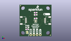
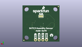
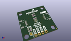

Contents
========

* [PROJ-SPAR-16467-STAN-01>SparkFun Humidity Sensor SHTC3](#proj-spar-16467-stan-01sparkfun-humidity-sensor-shtc3)
	* [Images](#images)
	* [Interactive BOM](#interactive-bom)
	* [OOMP Parts](#oomp-parts)
	* [Tags](#tags)
  
![][im]
# PROJ-SPAR-16467-STAN-01>SparkFun Humidity Sensor SHTC3

- ID: PROJ-SPAR-16467-STAN-01
- Hex ID: PRS16467
- Name: SparkFun Humidity Sensor SHTC3
- Description: 

## Images
  
  

|eagleImage|kicadPcb3dFront|kicadPcb3dBack|kicadPcb3d|
| :---: | :---: | :---: | :---: |
|||||

## Interactive BOM

- Interactive BOM page: [ibom.html](kicad/bom/ibom.html)

## OOMP Parts
  

|OOMP Parts|
| :---: |
|<table><tr><td></td><td> C1</td><td>[CAPC-0603-X-NF100-V50 SMD (0603) 100 nF Capacitor (Ceramic) 50v](https://github.com/oomlout/oomlout_OOMP_parts/tree/main/CAPC-0603-X-NF100-V50/)</td><td>[C6N100](https://github.com/oomlout/oomlout_OOMP_parts/tree/main/CAPC-0603-X-NF100-V50/)</td></tr></table>|
|UNMATCHED-0603-X-UNMATCHED-01, D1, 6.095999999999999, 7.238999999999999, 0,D1, RED, LED-0603, SparkFun-LED, (0.24, 0.285), R0|
|UNMATCHED-UNMATCHED-X-UNMATCHED-01, I2C, 12.7, 17.779999999999998, M0,I2C, JUMPER-SMT_3_2-NC_TRACE_SILK, SMT-JUMPER_3_2-NC_TRACE_SILK, SparkFun-Jumpers, (0.5, 0.7), MR0|
|UNMATCHED-UNMATCHED-X-UNMATCHED-01, J1, 8.889999999999999, 1.27, 0,J1, 1X04_NO_SILK, SparkFun-Connectors, (0.35, 0.05), R0|
|UNMATCHED-UNMATCHED-X-UNMATCHED-01, J2, 5.08, 12.7, 270,J2, QWIIC_RIGHT_ANGLE, JST04_1MM_RA, SparkFun-Connectors, (0.2, 0.5), R270|
|UNMATCHED-UNMATCHED-X-UNMATCHED-01, J4, 20.32, 12.7, 90,J4, QWIIC_RIGHT_ANGLE, JST04_1MM_RA, SparkFun-Connectors, (0.8, 0.5), R90|
|UNMATCHED-UNMATCHED-X-UNMATCHED-01, PWRLED, 6.095999999999999, 3.175, 270,PWRLED, JUMPER-SMT_2_NC_TRACE_SILK, SMT-JUMPER_2_NC_TRACE_SILK, SparkFun-Jumpers, (0.24, 0.125), R270|
|RESE-0603-X-UNMATCHED-01, R1, 12.827, 17.272000000000002, 180,R1, 2.2k, 0603, SparkFun-Resistors, (0.505, 0.68), R180|
|RESE-0603-X-UNMATCHED-01, R2, 12.827, 19.049999999999997, 180,R2, 2.2k, 0603, SparkFun-Resistors, (0.505, 0.75), R180|
|RESE-0603-X-UNMATCHED-01, R3, 6.095999999999999, 5.588, 0,R3, 1k, 0603, SparkFun-Resistors, (0.24, 0.22), R0|
|UNMATCHED-UNMATCHED-X-UNMATCHED-01, U1, 12.827, 12.191999999999998, 0,U1, SHTC3, SHTC3, SparkFun-Sensors, (0.505, 0.48), R0|

## Tags

- hexID: PRS16467
- oompType: PROJ
- oompSize: SPAR
- oompColor: 16467
- oompDesc: STAN
- oompIndex: 01
- oompName: SparkFun Humidity Sensor SHTC3
- sources: All source files from https://github.com/sparkfun/SparkFun_Humidity_Sensor_SHTC3 (source licence details in srcLicense.md)
- linkBuyPage: https://www.sparkfun.com/products/16467
- oompID: PROJ-SPAR-16467-STAN-01
- oompPart: CAPC-0603-X-NF100-V50, C1, 12.827, 14.350999999999997, 0
- oompPart: UNMATCHED-0603-X-UNMATCHED-01, D1, 6.095999999999999, 7.238999999999999, 0
- oompPart: UNMATCHED-UNMATCHED-X-UNMATCHED-01, I2C, 12.7, 17.779999999999998, M0
- oompPart: UNMATCHED-UNMATCHED-X-UNMATCHED-01, J1, 8.889999999999999, 1.27, 0
- oompPart: UNMATCHED-UNMATCHED-X-UNMATCHED-01, J2, 5.08, 12.7, 270
- oompPart: UNMATCHED-UNMATCHED-X-UNMATCHED-01, J4, 20.32, 12.7, 90
- oompPart: SKIP-UNMATCHED-X-UNMATCHED-01, JP1, 0.7619999999999999, 24.637999999999998, M0
- oompPart: SKIP-UNMATCHED-X-UNMATCHED-01, JP2, 24.511, 0.889, 0
- oompPart: SKIP-UNMATCHED-X-UNMATCHED-01, JP5, 24.511, 0.889, M0
- oompPart: SKIP-UNMATCHED-X-UNMATCHED-01, JP6, 0.7619999999999999, 24.637999999999998, 0
- oompPart: UNMATCHED-UNMATCHED-X-UNMATCHED-01, PWRLED, 6.095999999999999, 3.175, 270
- oompPart: RESE-0603-X-UNMATCHED-01, R1, 12.827, 17.272000000000002, 180
- oompPart: RESE-0603-X-UNMATCHED-01, R2, 12.827, 19.049999999999997, 180
- oompPart: RESE-0603-X-UNMATCHED-01, R3, 6.095999999999999, 5.588, 0
- oompPart: UNMATCHED-UNMATCHED-X-UNMATCHED-01, U1, 12.827, 12.191999999999998, 0
- rawPart: C1, 0.1uF, 0603, SparkFun-Capacitors, (0.505, 0.565), R0
- rawPart: D1, RED, LED-0603, SparkFun-LED, (0.24, 0.285), R0
- rawPart: I2C, JUMPER-SMT_3_2-NC_TRACE_SILK, SMT-JUMPER_3_2-NC_TRACE_SILK, SparkFun-Jumpers, (0.5, 0.7), MR0
- rawPart: J1, 1X04_NO_SILK, SparkFun-Connectors, (0.35, 0.05), R0
- rawPart: J2, QWIIC_RIGHT_ANGLE, JST04_1MM_RA, SparkFun-Connectors, (0.2, 0.5), R270
- rawPart: J4, QWIIC_RIGHT_ANGLE, JST04_1MM_RA, SparkFun-Connectors, (0.8, 0.5), R90
- rawPart: JP1, FIDUCIALUFIDUCIAL, MICRO-FIDUCIAL, SparkFun, (0.03, 0.97), MR0
- rawPart: JP2, FIDUCIALUFIDUCIAL, MICRO-FIDUCIAL, SparkFun, (0.965, 0.035), R0
- rawPart: JP5, FIDUCIALUFIDUCIAL, MICRO-FIDUCIAL, SparkFun, (0.965, 0.035), MR0
- rawPart: JP6, FIDUCIALUFIDUCIAL, MICRO-FIDUCIAL, SparkFun, (0.03, 0.97), R0
- rawPart: PWRLED, JUMPER-SMT_2_NC_TRACE_SILK, SMT-JUMPER_2_NC_TRACE_SILK, SparkFun-Jumpers, (0.24, 0.125), R270
- rawPart: R1, 2.2k, 0603, SparkFun-Resistors, (0.505, 0.68), R180
- rawPart: R2, 2.2k, 0603, SparkFun-Resistors, (0.505, 0.75), R180
- rawPart: R3, 1k, 0603, SparkFun-Resistors, (0.24, 0.22), R0
- rawPart: U1, SHTC3, SHTC3, SparkFun-Sensors, (0.505, 0.48), R0

[im]: kicadPcb3d_450.png
