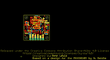
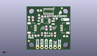
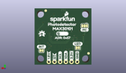
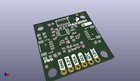

Contents
========

* [PROJ-SPAR-16474-STAN-01>SparkFun Photodetector Breakout MAX30101 Qwiic](#proj-spar-16474-stan-01sparkfun-photodetector-breakout-max30101-qwiic)
	* [Images](#images)
	* [Interactive BOM](#interactive-bom)
	* [OOMP Parts](#oomp-parts)
	* [Tags](#tags)
  
![][im]
# PROJ-SPAR-16474-STAN-01>SparkFun Photodetector Breakout MAX30101 Qwiic

- ID: PROJ-SPAR-16474-STAN-01
- Hex ID: PRS16474
- Name: SparkFun Photodetector Breakout MAX30101 Qwiic
- Description: 

## Images
  
  

|eagleImage|kicadPcb3dFront|kicadPcb3dBack|kicadPcb3d|
| :---: | :---: | :---: | :---: |
|||||

## Interactive BOM

- Interactive BOM page: [ibom.html](kicad/bom/ibom.html)

## OOMP Parts
  

|OOMP Parts|
| :---: |
|CAPC-0402-X-NF100-V50, C1, 14.604999999999999, 8.889999999999999, 90,C1, 0.1uF, 0402, SparkFun-Capacitors, (0.575, 0.35), R90|
|CAPC-0603-X-UNMATCHED-01, C2, 16.6116, 18.211799999999997, 0,C2, 10uF, 0603, SparkFun-Capacitors, (0.654, 0.717), R0|
|CAPC-0402-X-NF100-V50, C3, 8.889999999999999, 9.118599999999999, 270,C3, 0.1uF, 0402, SparkFun-Capacitors, (0.35, 0.359), R270|
|CAPC-0603-X-UNMATCHED-01, C4, 10.795, 8.889999999999999, 270,C4, 10uF, 0603, SparkFun-Capacitors, (0.425, 0.35), R270|
|CAPC-0603-X-UNMATCHED-01, C5, 16.509999999999998, 8.889999999999999, 90,C5, 10uF, 0603, SparkFun-Capacitors, (0.65, 0.35), R90|
|CAPE-0805-X-UNMATCHED-01, C6, 6.9596, 16.0274, 270,C6, 22uF, 0805, SparkFun-Capacitors, (0.274, 0.631), R270|
|CAPC-0603-X-UNMATCHED-01, C7, 7.442199999999999, 23.0378, 180,C7, 10uF, 0603, SparkFun-Capacitors, (0.293, 0.907), R180|
|CAPC-0402-X-NF100-V50, C8, 12.9032, 19.7104, 180,C8, 0.1uF, 0402, SparkFun-Capacitors, (0.508, 0.776), R180|
|UNMATCHED-0603-X-UNMATCHED-01, D1, 2.54, 8.254999999999999, 180,D1, RED, LED-0603, SparkFun-LED, (0.1, 0.325), R180|
|UNMATCHED-UNMATCHED-X-UNMATCHED-01, J1, 6.35, 1.27, 0,J1, PTH, 1X04_NO_SILK, SparkFun-Connectors, (0.25, 0.05), R0|
|UNMATCHED-UNMATCHED-X-UNMATCHED-01, J2, 19.049999999999997, 1.27, 0,J2, 1X01_NO_SILK, SparkFun-Connectors, (0.75, 0.05), R0|
|UNMATCHED-UNMATCHED-X-UNMATCHED-01, J3, 20.32, 12.7, 90,J3, QWIIC_RA, JST04_1MM_RA, SparkFun-Connectors, (0.8, 0.5), R90|
|UNMATCHED-UNMATCHED-X-UNMATCHED-01, J4, 16.509999999999998, 1.27, 0,J4, 1X01_NO_SILK, SparkFun-Connectors, (0.65, 0.05), R0|
|UNMATCHED-UNMATCHED-X-UNMATCHED-01, J5, 5.08, 12.7, 270,J5, QWIIC_RA, JST04_1MM_RA, SparkFun-Connectors, (0.2, 0.5), R270|
|UNMATCHED-UNMATCHED-X-UNMATCHED-01, JP1, 6.095999999999999, 7.6453999999999995, M0,JP1, LED, SMT-JUMPER_2_NC_TRACE_SILK, SparkFun-Jumpers, (0.24, 0.301), MR0|
|UNMATCHED-UNMATCHED-X-UNMATCHED-01, JP2, 22.301199999999998, 6.3754, M0,JP2, INT, SMT-JUMPER_2_NC_TRACE_SILK, SparkFun-Jumpers, (0.878, 0.251), MR0|
|ERROR, JP4 I2C PU, 0, 0, 0,JP4, I2C, PU, SMT-JUMPER_3_2-NC_TRACE_SILK, SparkFun-Jumpers, (0.118, 0.689), MR0|
|UNMATCHED-UNMATCHED-X-UNMATCHED-01, L1, 15.392399999999999, 15.925799999999999, 270,L1, 2.2?H, 0806, SparkFun-Coils, (0.606, 0.627), R270|
|UNMATCHED-UNMATCHED-X-UNMATCHED-01, Q6, 8.889999999999999, 12.7, 90,Q6, 20V/0.2A/8MHz/1.2?/1Vth, SOT-416FL, SparkFun-DiscreteSemi, (0.35, 0.5), R90|
|UNMATCHED-UNMATCHED-X-UNMATCHED-01, Q8, 16.509999999999998, 12.7, 270,Q8, 20V/0.2A/8MHz/1.2?/1Vth, SOT-416FL, SparkFun-DiscreteSemi, (0.65, 0.5), R270|
|RESE-0603-X-O754-01, R1, 7.213599999999999, 19.3802, 270,R1, 750K, 0603, SparkFun-Resistors, (0.284, 0.763), R270|
|RESE-0603-X-UNMATCHED-01, R3, 5.968999999999999, 8.254999999999999, 180,R3, 1k, 0603, SparkFun-Resistors, (0.235, 0.325), R180|
|<table><tr><td></td><td> R4</td><td>[RESE-0603-X-O104-01 SMD (0603) 100k Ohm Resistor](https://github.com/oomlout/oomlout_OOMP_parts/tree/main/RESE-0603-X-O104-01/)</td><td>[R6104](https://github.com/oomlout/oomlout_OOMP_parts/tree/main/RESE-0603-X-O104-01/)</td></tr></table>|
|RESE-0603-X-UNMATCHED-01, R5, 22.605999999999998, 7.874, 0,R5, 4.7k, 0603, SparkFun-Resistors, (0.89, 0.31), R0|
|RESE-0603-X-UNMATCHED-01, R14, 11.43, 12.7, 270,R14, 2.2k, 0603, SparkFun-Resistors, (0.45, 0.5), R270|
|RESE-0603-X-UNMATCHED-01, R15, 1.4478, 18.211799999999997, 90,R15, 2.2k, 0603, SparkFun-Resistors, (0.057, 0.717), R90|
|RESE-0603-X-UNMATCHED-01, R16, 13.97, 12.7, 90,R16, 2.2k, 0603, SparkFun-Resistors, (0.55, 0.5), R90|
|RESE-0603-X-UNMATCHED-01, R17, 3.6321999999999997, 18.1864, 90,R17, 2.2k, 0603, SparkFun-Resistors, (0.143, 0.716), R90|
|UNMATCHED-UNMATCHED-X-UNMATCHED-01, U1, 12.7, 8.889999999999999, 0,U1, 1.8V/100mA, SC70, SparkFun-PowerIC, (0.5, 0.35), R0|
|UNMATCHED-UNMATCHED-X-UNMATCHED-01, U2, 12.7, 22.479, 270,U2, MAX30101EFD, 14_PIN_OESIP, SparkFun-IC-Special-Function, (0.5, 0.885), R270|
|UNMATCHED-UNMATCHED-X-UNMATCHED-01, U3, 11.0998, 17.0434, 90,U3, PAM2401, MSOP8, SparkFun-IC-Power, (0.437, 0.671), R90|

## Tags

- hexID: PRS16474
- oompType: PROJ
- oompSize: SPAR
- oompColor: 16474
- oompDesc: STAN
- oompIndex: 01
- oompName: SparkFun Photodetector Breakout MAX30101 Qwiic
- sources: All source files from https://github.com/sparkfun/SparkFun_Photodetector_Breakout_MAX30101_Qwiic (source licence details in srcLicense.md)
- linkBuyPage: https://www.sparkfun.com/products/16474
- oompPart: CAPC-0402-X-NF100-V50, C1, 14.604999999999999, 8.889999999999999, 90
- oompPart: CAPC-0603-X-UNMATCHED-01, C2, 16.6116, 18.211799999999997, 0
- oompPart: CAPC-0402-X-NF100-V50, C3, 8.889999999999999, 9.118599999999999, 270
- oompPart: CAPC-0603-X-UNMATCHED-01, C4, 10.795, 8.889999999999999, 270
- oompPart: CAPC-0603-X-UNMATCHED-01, C5, 16.509999999999998, 8.889999999999999, 90
- oompPart: CAPE-0805-X-UNMATCHED-01, C6, 6.9596, 16.0274, 270
- oompPart: CAPC-0603-X-UNMATCHED-01, C7, 7.442199999999999, 23.0378, 180
- oompPart: CAPC-0402-X-NF100-V50, C8, 12.9032, 19.7104, 180
- oompPart: UNMATCHED-0603-X-UNMATCHED-01, D1, 2.54, 8.254999999999999, 180
- oompPart: SKIP-UNMATCHED-X-UNMATCHED-01, FID1, 20.447, 24.383999999999997, 90
- oompPart: SKIP-UNMATCHED-X-UNMATCHED-01, FID2, 1.27, 5.08, 90
- oompPart: SKIP-UNMATCHED-X-UNMATCHED-01, FID3, 20.447, 24.383999999999997, M0
- oompPart: SKIP-UNMATCHED-X-UNMATCHED-01, FID4, 1.27, 5.08, M0
- oompPart: UNMATCHED-UNMATCHED-X-UNMATCHED-01, J1, 6.35, 1.27, 0
- oompPart: UNMATCHED-UNMATCHED-X-UNMATCHED-01, J2, 19.049999999999997, 1.27, 0
- oompPart: UNMATCHED-UNMATCHED-X-UNMATCHED-01, J3, 20.32, 12.7, 90
- oompPart: UNMATCHED-UNMATCHED-X-UNMATCHED-01, J4, 16.509999999999998, 1.27, 0
- oompPart: UNMATCHED-UNMATCHED-X-UNMATCHED-01, J5, 5.08, 12.7, 270
- oompPart: UNMATCHED-UNMATCHED-X-UNMATCHED-01, JP1, 6.095999999999999, 7.6453999999999995, M0
- oompPart: UNMATCHED-UNMATCHED-X-UNMATCHED-01, JP2, 22.301199999999998, 6.3754, M0
- oompPart: ERROR, JP4 I2C PU, 0, 0, 0
- oompPart: UNMATCHED-UNMATCHED-X-UNMATCHED-01, L1, 15.392399999999999, 15.925799999999999, 270
- oompPart: UNMATCHED-UNMATCHED-X-UNMATCHED-01, Q6, 8.889999999999999, 12.7, 90
- oompPart: UNMATCHED-UNMATCHED-X-UNMATCHED-01, Q8, 16.509999999999998, 12.7, 270
- oompPart: RESE-0603-X-O754-01, R1, 7.213599999999999, 19.3802, 270
- oompPart: RESE-0603-X-UNMATCHED-01, R3, 5.968999999999999, 8.254999999999999, 180
- oompPart: RESE-0603-X-O104-01, R4, 9.906, 19.5326, 180
- oompPart: RESE-0603-X-UNMATCHED-01, R5, 22.605999999999998, 7.874, 0
- oompPart: RESE-0603-X-UNMATCHED-01, R14, 11.43, 12.7, 270
- oompPart: RESE-0603-X-UNMATCHED-01, R15, 1.4478, 18.211799999999997, 90
- oompPart: RESE-0603-X-UNMATCHED-01, R16, 13.97, 12.7, 90
- oompPart: RESE-0603-X-UNMATCHED-01, R17, 3.6321999999999997, 18.1864, 90
- oompPart: UNMATCHED-UNMATCHED-X-UNMATCHED-01, U1, 12.7, 8.889999999999999, 0
- oompPart: UNMATCHED-UNMATCHED-X-UNMATCHED-01, U2, 12.7, 22.479, 270
- oompPart: UNMATCHED-UNMATCHED-X-UNMATCHED-01, U3, 11.0998, 17.0434, 90
- rawPart: C1, 0.1uF, 0402, SparkFun-Capacitors, (0.575, 0.35), R90
- rawPart: C2, 10uF, 0603, SparkFun-Capacitors, (0.654, 0.717), R0
- rawPart: C3, 0.1uF, 0402, SparkFun-Capacitors, (0.35, 0.359), R270
- rawPart: C4, 10uF, 0603, SparkFun-Capacitors, (0.425, 0.35), R270
- rawPart: C5, 10uF, 0603, SparkFun-Capacitors, (0.65, 0.35), R90
- rawPart: C6, 22uF, 0805, SparkFun-Capacitors, (0.274, 0.631), R270
- rawPart: C7, 10uF, 0603, SparkFun-Capacitors, (0.293, 0.907), R180
- rawPart: C8, 0.1uF, 0402, SparkFun-Capacitors, (0.508, 0.776), R180
- rawPart: D1, RED, LED-0603, SparkFun-LED, (0.1, 0.325), R180
- rawPart: FID1, FIDUCIAL1X2, FIDUCIAL-1X2, SparkFun-Aesthetics, (0.805, 0.96), R90
- rawPart: FID2, FIDUCIAL1X2, FIDUCIAL-1X2, SparkFun-Aesthetics, (0.05, 0.2), R90
- rawPart: FID3, FIDUCIAL1X2, FIDUCIAL-1X2, SparkFun-Aesthetics, (0.805, 0.96), MR0
- rawPart: FID4, FIDUCIAL1X2, FIDUCIAL-1X2, SparkFun-Aesthetics, (0.05, 0.2), MR0
- rawPart: J1, PTH, 1X04_NO_SILK, SparkFun-Connectors, (0.25, 0.05), R0
- rawPart: J2, 1X01_NO_SILK, SparkFun-Connectors, (0.75, 0.05), R0
- rawPart: J3, QWIIC_RA, JST04_1MM_RA, SparkFun-Connectors, (0.8, 0.5), R90
- rawPart: J4, 1X01_NO_SILK, SparkFun-Connectors, (0.65, 0.05), R0
- rawPart: J5, QWIIC_RA, JST04_1MM_RA, SparkFun-Connectors, (0.2, 0.5), R270
- rawPart: JP1, LED, SMT-JUMPER_2_NC_TRACE_SILK, SparkFun-Jumpers, (0.24, 0.301), MR0
- rawPart: JP2, INT, SMT-JUMPER_2_NC_TRACE_SILK, SparkFun-Jumpers, (0.878, 0.251), MR0
- rawPart: JP4, I2C, PU, SMT-JUMPER_3_2-NC_TRACE_SILK, SparkFun-Jumpers, (0.118, 0.689), MR0
- rawPart: L1, 2.2?H, 0806, SparkFun-Coils, (0.606, 0.627), R270
- rawPart: Q6, 20V/0.2A/8MHz/1.2?/1Vth, SOT-416FL, SparkFun-DiscreteSemi, (0.35, 0.5), R90
- rawPart: Q8, 20V/0.2A/8MHz/1.2?/1Vth, SOT-416FL, SparkFun-DiscreteSemi, (0.65, 0.5), R270
- rawPart: R1, 750K, 0603, SparkFun-Resistors, (0.284, 0.763), R270
- rawPart: R3, 1k, 0603, SparkFun-Resistors, (0.235, 0.325), R180
- rawPart: R4, 100k, 0603, SparkFun-Resistors, (0.39, 0.769), R180
- rawPart: R5, 4.7k, 0603, SparkFun-Resistors, (0.89, 0.31), R0
- rawPart: R14, 2.2k, 0603, SparkFun-Resistors, (0.45, 0.5), R270
- rawPart: R15, 2.2k, 0603, SparkFun-Resistors, (0.057, 0.717), R90
- rawPart: R16, 2.2k, 0603, SparkFun-Resistors, (0.55, 0.5), R90
- rawPart: R17, 2.2k, 0603, SparkFun-Resistors, (0.143, 0.716), R90
- rawPart: U1, 1.8V/100mA, SC70, SparkFun-PowerIC, (0.5, 0.35), R0
- rawPart: U2, MAX30101EFD, 14_PIN_OESIP, SparkFun-IC-Special-Function, (0.5, 0.885), R270
- rawPart: U3, PAM2401, MSOP8, SparkFun-IC-Power, (0.437, 0.671), R90
- oompID: PROJ-SPAR-16474-STAN-01

[im]: kicadPcb3d_450.png
