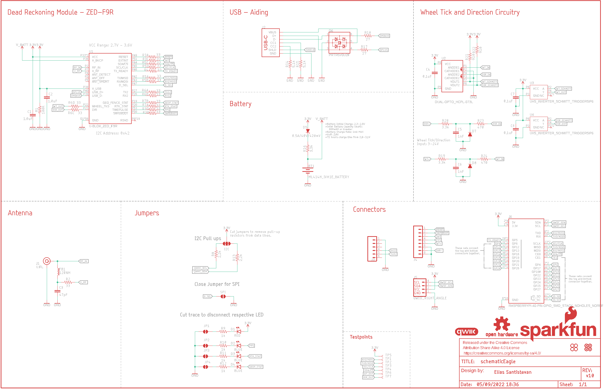
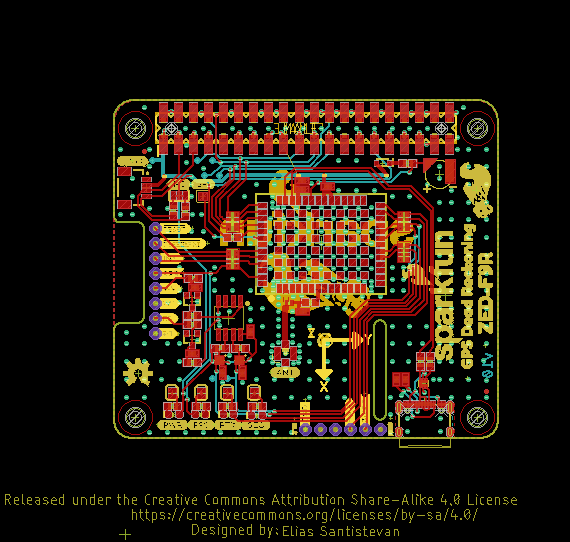
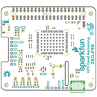
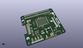
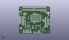
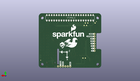
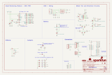
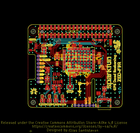
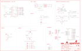
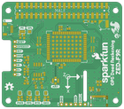

Contents
========

* [PRS16475 > SparkFun GPS Dead Reckoning PHat ZED-F9R](#prs16475--sparkfun-gps-dead-reckoning-phat-zed-f9r)
	* [Schematic](#schematic)
	* [PCB](#pcb)
	* [Interactive BOM](#interactive-bom)
	* [OOMP Parts](#oomp-parts)
	* [Images](#images)
	* [Tags](#tags)
  
![][im]
# PRS16475 > SparkFun GPS Dead Reckoning PHat ZED-F9R

- ID: PROJ-SPAR-16475-STAN-01
- Hex ID: PRS16475
- Name: Sparkfun
- Description: Sparkfun
- Long Link: [http://oom.lt/PROJ-SPAR-16475-STAN-01](http://oom.lt/PROJ-SPAR-16475-STAN-01)
- Short Link: [http://oom.lt/PRS16475](http://oom.lt/PRS16475)

## Schematic
  

## PCB
  

## Interactive BOM

- Interactive BOM page: [ibom.html](https://htmlpreview.github.io/?https://github.com/oomlout/oomlout_OOMP_projects/blob/main/PROJ-SPAR-16475-STAN-01/kicad/bom/ibom.html)

## OOMP Parts
  

|OOMP ID|Name|Identifier|
| :---: | :---: | :---: |
|UNMATCHED-UNMATCHED-X-UNMATCHED-01||BT1, J1, J2, U1, U2, U3, U4|
|CAPC-0402-X-UNMATCHED-01||C1, C2|
|[CAPC-0402-X-PF47-V50](https://github.com/oomlout/oomlout_OOMP_parts/tree/main/CAPC-0402-X-PF47-V50/)|[SMD (0402) 47 pF Capacitor (Ceramic) 50v](https://github.com/oomlout/oomlout_OOMP_parts/tree/main/CAPC-0402-X-PF47-V50/)|[C3](https://github.com/oomlout/oomlout_OOMP_parts/tree/main/CAPC-0402-X-PF47-V50/)|
|[CAPC-0402-X-NF100-V10](https://github.com/oomlout/oomlout_OOMP_parts/tree/main/CAPC-0402-X-NF100-V10/)|[SMD (0402) 100 nF Capacitor (Ceramic) 10v](https://github.com/oomlout/oomlout_OOMP_parts/tree/main/CAPC-0402-X-NF100-V10/)|[C4, C7, C8](https://github.com/oomlout/oomlout_OOMP_parts/tree/main/CAPC-0402-X-NF100-V10/)|
|[CAPC-0402-X-NF1-V50](https://github.com/oomlout/oomlout_OOMP_parts/tree/main/CAPC-0402-X-NF1-V50/)|[SMD (0402) 1 nF Capacitor (Ceramic) 50v](https://github.com/oomlout/oomlout_OOMP_parts/tree/main/CAPC-0402-X-NF1-V50/)|[C5, C6](https://github.com/oomlout/oomlout_OOMP_parts/tree/main/CAPC-0402-X-NF1-V50/)|
|[LEDS-0603-R-STAN-01](https://github.com/oomlout/oomlout_OOMP_parts/tree/main/LEDS-0603-R-STAN-01/)|[SMD (0603) Red LED](https://github.com/oomlout/oomlout_OOMP_parts/tree/main/LEDS-0603-R-STAN-01/)|[D1](https://github.com/oomlout/oomlout_OOMP_parts/tree/main/LEDS-0603-R-STAN-01/)|
|[LEDS-0603-L-STAN-01](https://github.com/oomlout/oomlout_OOMP_parts/tree/main/LEDS-0603-L-STAN-01/)|[SMD (0603) Blue LED](https://github.com/oomlout/oomlout_OOMP_parts/tree/main/LEDS-0603-L-STAN-01/)|[D2, D3, D4](https://github.com/oomlout/oomlout_OOMP_parts/tree/main/LEDS-0603-L-STAN-01/)|
|DIOD-S323-X-UNMATCHED-01||D5|
|DIOD-UNMATCHED-X-UNMATCHED-01||D6|
|DIOD-SO23-X-UNMATCHED-01||D7, D8|
|FERB-0402-X-UNMATCHED-01||FB1|
|[HEAD-I01-X-PI06-01](https://github.com/oomlout/oomlout_OOMP_parts/tree/main/HEAD-I01-X-PI06-01/)|[2.54 mm 6 Pin Header](https://github.com/oomlout/oomlout_OOMP_parts/tree/main/HEAD-I01-X-PI06-01/)|[J3](https://github.com/oomlout/oomlout_OOMP_parts/tree/main/HEAD-I01-X-PI06-01/)|
|[HEAD-I01-X-PI08-01](https://github.com/oomlout/oomlout_OOMP_parts/tree/main/HEAD-I01-X-PI08-01/)|[2.54 mm 8 Pin Header](https://github.com/oomlout/oomlout_OOMP_parts/tree/main/HEAD-I01-X-PI08-01/)|[J4](https://github.com/oomlout/oomlout_OOMP_parts/tree/main/HEAD-I01-X-PI08-01/)|
|[HEAD-JSTSH-X-PI04-RS](https://github.com/oomlout/oomlout_OOMP_parts/tree/main/HEAD-JSTSH-X-PI04-RS/)|[JST XH (1 mm) 4 Pin Header Right Angle (SMD)](https://github.com/oomlout/oomlout_OOMP_parts/tree/main/HEAD-JSTSH-X-PI04-RS/)|[J5, LOGO1](https://github.com/oomlout/oomlout_OOMP_parts/tree/main/HEAD-JSTSH-X-PI04-RS/)|
|HEAD-I01-X-UNMATCHED-01||J6|
|RESE-0402-X-O1003-01||R1|
|[RESE-0603-X-O330-01](https://github.com/oomlout/oomlout_OOMP_parts/tree/main/RESE-0603-X-O330-01/)|[SMD (0603) 33 Ohm Resistor](https://github.com/oomlout/oomlout_OOMP_parts/tree/main/RESE-0603-X-O330-01/)|[R2, R4](https://github.com/oomlout/oomlout_OOMP_parts/tree/main/RESE-0603-X-O330-01/)|
|RESE-1206-X-O330-01||R3, R5, R6, R7|
|[RESE-0603-X-O222-01](https://github.com/oomlout/oomlout_OOMP_parts/tree/main/RESE-0603-X-O222-01/)|[SMD (0603) 2.2k Ohm Resistor](https://github.com/oomlout/oomlout_OOMP_parts/tree/main/RESE-0603-X-O222-01/)|[R8, R13](https://github.com/oomlout/oomlout_OOMP_parts/tree/main/RESE-0603-X-O222-01/)|
|[RESE-0603-X-O102-01](https://github.com/oomlout/oomlout_OOMP_parts/tree/main/RESE-0603-X-O102-01/)|[SMD (0603) 1k Ohm Resistor](https://github.com/oomlout/oomlout_OOMP_parts/tree/main/RESE-0603-X-O102-01/)|[R9, R10, R11, R12](https://github.com/oomlout/oomlout_OOMP_parts/tree/main/RESE-0603-X-O102-01/)|
|[RESE-0402-X-O472-01](https://github.com/oomlout/oomlout_OOMP_parts/tree/main/RESE-0402-X-O472-01/)|[SMD (0402) 4.7k Ohm Resistor](https://github.com/oomlout/oomlout_OOMP_parts/tree/main/RESE-0402-X-O472-01/)|[R14, R15](https://github.com/oomlout/oomlout_OOMP_parts/tree/main/RESE-0402-X-O472-01/)|
|RESE-0603-X-UNMATCHED-01||R16, R19, R20|
|[RESE-0603-X-O270-01](https://github.com/oomlout/oomlout_OOMP_parts/tree/main/RESE-0603-X-O270-01/)|[SMD (0603) 27 Ohm Resistor](https://github.com/oomlout/oomlout_OOMP_parts/tree/main/RESE-0603-X-O270-01/)|[R17, R18](https://github.com/oomlout/oomlout_OOMP_parts/tree/main/RESE-0603-X-O270-01/)|
|RESE-0603-X-O911-01||R21, R22|
|[RESE-0603-X-O471-01](https://github.com/oomlout/oomlout_OOMP_parts/tree/main/RESE-0603-X-O471-01/)|[SMD (0603) 470 Ohm Resistor](https://github.com/oomlout/oomlout_OOMP_parts/tree/main/RESE-0603-X-O471-01/)|[R23, R24](https://github.com/oomlout/oomlout_OOMP_parts/tree/main/RESE-0603-X-O471-01/)|

## Images
  
  

|bominteractivefront|bominteractiveback|kicadPcb3d|kicadPcb3dFront|kicadPcb3dBack|kicadSchem|eagleImage|eagleSchemImage|pcbdraw|pcbdrawback|
| :---: | :---: | :---: | :---: | :---: | :---: | :---: | :---: | :---: | :---: |
|||||||||||

## Tags

- hexID: PRS16475
- oompType: PROJ
- oompSize: SPAR
- oompColor: 16475
- oompDesc: STAN
- oompIndex: 01
- oompName: SparkFun GPS Dead Reckoning PHat ZED-F9R
- sources: All source files from https://github.com/sparkfun/SparkFun_GPS_Dead_Reckoning_PHat_ZED-F9R (source licence details in srcLicense.md)
- linkBuyPage: https://www.sparkfun.com/products/16475
- oompID: PROJ-SPAR-16475-STAN-01
- oompParts: BT1,UNMATCHED-UNMATCHED-X-UNMATCHED-01
- oompParts: C1,CAPC-0402-X-UNMATCHED-01
- oompParts: C2,CAPC-0402-X-UNMATCHED-01
- oompParts: C3,CAPC-0402-X-PF47-V50
- oompParts: C4,CAPC-0402-X-NF100-V10
- oompParts: C5,CAPC-0402-X-NF1-V50
- oompParts: C6,CAPC-0402-X-NF1-V50
- oompParts: C7,CAPC-0402-X-NF100-V10
- oompParts: C8,CAPC-0402-X-NF100-V10
- oompParts: D1,LEDS-0603-R-STAN-01
- oompParts: D2,LEDS-0603-L-STAN-01
- oompParts: D3,LEDS-0603-L-STAN-01
- oompParts: D4,LEDS-0603-L-STAN-01
- oompParts: D5,DIOD-S323-X-UNMATCHED-01
- oompParts: D6,DIOD-UNMATCHED-X-UNMATCHED-01
- oompParts: D7,DIOD-SO23-X-UNMATCHED-01
- oompParts: D8,DIOD-SO23-X-UNMATCHED-01
- oompParts: FB1,FERB-0402-X-UNMATCHED-01
- oompParts: J1,UNMATCHED-UNMATCHED-X-UNMATCHED-01
- oompParts: J2,UNMATCHED-UNMATCHED-X-UNMATCHED-01
- oompParts: J3,HEAD-I01-X-PI06-01
- oompParts: J4,HEAD-I01-X-PI08-01
- oompParts: J5,HEAD-JSTSH-X-PI04-RS
- oompParts: J6,HEAD-I01-X-UNMATCHED-01
- oompParts: LOGO1,HEAD-JSTSH-X-PI04-RS
- oompParts: R1,RESE-0402-X-O1003-01
- oompParts: R2,RESE-0603-X-O330-01
- oompParts: R3,RESE-1206-X-O330-01
- oompParts: R4,RESE-0603-X-O330-01
- oompParts: R5,RESE-1206-X-O330-01
- oompParts: R6,RESE-1206-X-O330-01
- oompParts: R7,RESE-1206-X-O330-01
- oompParts: R8,RESE-0603-X-O222-01
- oompParts: R9,RESE-0603-X-O102-01
- oompParts: R10,RESE-0603-X-O102-01
- oompParts: R11,RESE-0603-X-O102-01
- oompParts: R12,RESE-0603-X-O102-01
- oompParts: R13,RESE-0603-X-O222-01
- oompParts: R14,RESE-0402-X-O472-01
- oompParts: R15,RESE-0402-X-O472-01
- oompParts: R16,RESE-0603-X-UNMATCHED-01
- oompParts: R17,RESE-0603-X-O270-01
- oompParts: R18,RESE-0603-X-O270-01
- oompParts: R19,RESE-0603-X-UNMATCHED-01
- oompParts: R20,RESE-0603-X-UNMATCHED-01
- oompParts: R21,RESE-0603-X-O911-01
- oompParts: R22,RESE-0603-X-O911-01
- oompParts: R23,RESE-0603-X-O471-01
- oompParts: R24,RESE-0603-X-O471-01
- oompParts: U1,UNMATCHED-UNMATCHED-X-UNMATCHED-01
- oompParts: U2,UNMATCHED-UNMATCHED-X-UNMATCHED-01
- oompParts: U3,UNMATCHED-UNMATCHED-X-UNMATCHED-01
- oompParts: U4,UNMATCHED-UNMATCHED-X-UNMATCHED-01
- rawParts: BT1,ML414H_IV01E_BATTERY,ML414H_IV01E_BATTERY,ML414H_IV01E,SEIKO ML414H-IV01E Reflowable Lithium Battery,,BATT-14267,,,,
- rawParts: C1,1.0uF,1.0UF-0402-16V-10%,0402,1µF ceramic capacitors,,CAP-12417,,,1.0uF,
- rawParts: C2,1.0uF,1.0UF-0402-16V-10%,0402,1µF ceramic capacitors,,CAP-12417,,,1.0uF,
- rawParts: C3,47pF,47PF-0402-25V-5%-X7R,0402,47pF ceramic capacitors,,CAP-15063,,,47pF,
- rawParts: C4,0.1uF,0.1UF-0402-10V-10%-X7R,0402,0.1µF ceramic capacitors,,CAP-15083,,,0.1uF,
- rawParts: C5,1nF,1.0NF/1000PF-0402-25V-10%-X7R,0402,1nF/1,000pF ceramic capacitors,,CAP-15061,,,1nF,
- rawParts: C6,1nF,1.0NF/1000PF-0402-25V-10%-X7R,0402,1nF/1,000pF ceramic capacitors,,CAP-15061,,,1nF,
- rawParts: C7,0.1uF,0.1UF-0402-10V-10%-X7R,0402,0.1µF ceramic capacitors,,CAP-15083,,,0.1uF,
- rawParts: C8,0.1uF,0.1UF-0402-10V-10%-X7R,0402,0.1µF ceramic capacitors,,CAP-15083,,,0.1uF,
- rawParts: D1,RED,LED-RED0603,LED-0603,Red SMD LED,,DIO-00819,,,RED,
- rawParts: D2,BLUE,LED-BLUE0603,LED-0603,Blue SMD LED,,DIO-08575,,,BLUE,
- rawParts: D3,BLUE,LED-BLUE0603,LED-0603,Blue SMD LED,,DIO-08575,,,BLUE,
- rawParts: D4,BLUE,LED-BLUE0603,LED-0603,Blue SMD LED,,DIO-08575,,,BLUE,
- rawParts: D5,0.5A/40V/420mV,DIODE-SCHOTTKY-PMEG4005EJ,SOD-323,Schottky diode,,DIO-10955,,,0.5A/40V/420mV,
- rawParts: D6,PRTR5V0U2F,PRTR5V0U2F,SOT886,A small ESD protection device. Most commonly used on USB D+/D- signals to protect large, expensive, or especially sensitive USB enabled devices.,,DIO-14084,,,,
- rawParts: D7,15V,DIODE-ZENER-BZX84C15LT3G,SOT23-3,Zener Diode,,DIO-15071,,,15V,
- rawParts: D8,15V,DIODE-ZENER-BZX84C15LT3G,SOT23-3,Zener Diode,,DIO-15071,,,15V,
- rawParts: FB1,120NH,FERRITE_BEAD_GNSS,0402_MURATA,,,NDUC-15072,,,120NH,
- rawParts: FD1,FIDUCIALUFIDUCIAL,FIDUCIALUFIDUCIAL,FIDUCIAL-MICRO,Fiducial Alignment Points,,,,,,
- rawParts: FD2,FIDUCIALUFIDUCIAL,FIDUCIALUFIDUCIAL,FIDUCIAL-MICRO,Fiducial Alignment Points,,,,,,
- rawParts: FD3,FIDUCIALUFIDUCIAL,FIDUCIALUFIDUCIAL,FIDUCIAL-MICRO,Fiducial Alignment Points,,,,,,
- rawParts: FD4,FIDUCIALUFIDUCIAL,FIDUCIALUFIDUCIAL,FIDUCIAL-MICRO,Fiducial Alignment Points,,,,,,
- rawParts: FRAME1,FRAME-LEDGER,FRAME-LEDGER,CREATIVE_COMMONS,Schematic Frame - Ledger,,,,,,
- rawParts: H1,STAND-OFFTIGHT,STAND-OFFTIGHT,STAND-OFF-TIGHT,Stand Off,,,,,,
- rawParts: H2,STAND-OFFTIGHT,STAND-OFFTIGHT,STAND-OFF-TIGHT,Stand Off,,,,,,
- rawParts: H3,STAND-OFFTIGHT,STAND-OFFTIGHT,STAND-OFF-TIGHT,Stand Off,,,,,,
- rawParts: H4,STAND-OFFTIGHT,STAND-OFFTIGHT,STAND-OFF-TIGHT,Stand Off,,,,,,
- rawParts: J1,U.FL,U.FL2PIN,U.FL,SMD Antenna Connector - U.FL,,CONN-09193,,WRL-09144,U.FL,
- rawParts: J2,,USB_C_2-LAYER,USB-C-16P,USB Type C 16Pin Connector,,CONN-14122,,,,
- rawParts: J3,,CONN_06NO_SILK_NO_POP,1X06_NO_SILK,Multi connection point. Often used as Generic Header-pin footprint for 0.1 inch spaced/style header connections,,,,,,
- rawParts: J4,,CONN_08NO_SILK_FEMALE_PTH,1X08_NO_SILK,Multi connection point. Often used as Generic Header-pin footprint for 0.1 inch spaced/style header connections,,CONN-08438,,,,
- rawParts: J5,QWIIC_RIGHT_ANGLE,QWIIC_CONNECTORJS-1MM,JST04_1MM_RA,SparkFun I2C Standard Qwiic Connector,,CONN-13694,,,QWIIC_RIGHT_ANGLE,
- rawParts: J6,RASPBERRYPI-40-PIN-GPIO_SMD_STACK_NOHOLES_NOREF,RASPBERRYPI-40-PIN-GPIO_SMD_STACK_NOHOLES_NOREF,RASPBERRY_PI_HAT_40_PIN_SMD_STACKABLE_NOHOLES_NOREF,Raspberry Pi GPIO Header,,,,,,
- rawParts: JP1,JUMPER-SMT_2_NC_TRACE_SILK,JUMPER-SMT_2_NC_TRACE_SILK,SMT-JUMPER_2_NC_TRACE_SILK,Normally closed trace jumper,,,,,,
- rawParts: JP2,JUMPER-SMT_2_NC_TRACE_SILK,JUMPER-SMT_2_NC_TRACE_SILK,SMT-JUMPER_2_NC_TRACE_SILK,Normally closed trace jumper,,,,,,
- rawParts: JP3,JUMPER-SMT_2_NC_TRACE_SILK,JUMPER-SMT_2_NC_TRACE_SILK,SMT-JUMPER_2_NC_TRACE_SILK,Normally closed trace jumper,,,,,,
- rawParts: JP4,JUMPER-SMT_2_NC_TRACE_SILK,JUMPER-SMT_2_NC_TRACE_SILK,SMT-JUMPER_2_NC_TRACE_SILK,Normally closed trace jumper,,,,,,
- rawParts: JP5,JUMPER-SMT_2_NO_SILK,JUMPER-SMT_2_NO_SILK,SMT-JUMPER_2_NO_SILK,Normally open jumper,,,,,,
- rawParts: JP6,JUMPER-SMT_3_2-NC_TRACE_SILK,JUMPER-SMT_3_2-NC_TRACE_SILK,SMT-JUMPER_3_2-NC_TRACE_SILK,Normally closed trace jumper (2 of 2 connections),,,,,,
- rawParts: LOGO1,QWIIC_LOGO_5MM,QWIIC_LOGO_5MM,QWIIC_5MM,Qwiic Logos for placement on schematic and PCB. The 5.5mm silk logo is best for placing next to Qwiic connector.,,,,,,
- rawParts: LOGO2,OSHW-LOGOM,OSHW-LOGOM,OSHW-LOGO-M,Open-Source Hardware (OSHW) Logo,,,,,,
- rawParts: LOGO3,SFE_LOGO_NAME_FLAME.2_INCH,SFE_LOGO_NAME_FLAME.2_INCH,SFE_LOGO_NAME_FLAME_.2,SparkFun Font Logo w/ Flame,,,,,,
- rawParts: R1,100K,100KOHM-0402-1/16W-1%,0402,100kΩ resistor,,RES-13495,,,100K,
- rawParts: R2,33,33OHM-0603-1/10W-1%,0603,33Ω resistor,,RES-08270,,,33,
- rawParts: R3,33,33OHM_RA-1206-1/16W-5%,1206_RA,EXB-38V330JV,,RES-15081,,,33,
- rawParts: R4,33,33OHM-0603-1/10W-1%,0603,33Ω resistor,,RES-08270,,,33,
- rawParts: R5,33,33OHM_RA-1206-1/16W-5%,1206_RA,EXB-38V330JV,,RES-15081,,,33,
- rawParts: R6,33,33OHM_RA-1206-1/16W-5%,1206_RA,EXB-38V330JV,,RES-15081,,,33,
- rawParts: R7,33,33OHM_RA-1206-1/16W-5%,1206_RA,EXB-38V330JV,,RES-15081,,,33,
- rawParts: R8,2.2k,2.2KOHM-0603-1/10W-1%,0603,2.2kΩ resistor,,RES-08272,,,2.2k,
- rawParts: R9,1k,1KOHM-0603-1/10W-1%,0603,1kΩ resistor,,RES-07856,,,1k,
- rawParts: R10,1k,1KOHM-0603-1/10W-1%,0603,1kΩ resistor,,RES-07856,,,1k,
- rawParts: R11,1k,1KOHM-0603-1/10W-1%,0603,1kΩ resistor,,RES-07856,,,1k,
- rawParts: R12,1k,1KOHM-0603-1/10W-1%,0603,1kΩ resistor,,RES-07856,,,1k,
- rawParts: R13,2.2k,2.2KOHM-0603-1/10W-1%,0603,2.2kΩ resistor,,RES-08272,,,2.2k,
- rawParts: R14,5.1k,5.1KOHM-0402-1/16W-1%,0402,,,RES-14340,,,5.1k,
- rawParts: R15,5.1k,5.1KOHM-0402-1/16W-1%,0402,,,RES-14340,,,5.1k,
- rawParts: R16,3.3k,3.3KOHM-0603-1/10W-1%,0603,3.3kΩ resistor,,RES-07851,,,3.3k,
- rawParts: R17,27,27OHM-0603-1/10W-1%,0603,27Ω resistor,,RES-09334,,,27,
- rawParts: R18,27,27OHM-0603-1/10W-1%,0603,27Ω resistor,,RES-09334,,,27,
- rawParts: R19,3.3k,3.3KOHM-0603-1/10W-1%,0603,3.3kΩ resistor,,RES-07851,,,3.3k,
- rawParts: R20,3.3k,3.3KOHM-0603-1/10W-1%,0603,3.3kΩ resistor,,RES-07851,,,3.3k,
- rawParts: R21,910,910OHM-0603-1/10W-5%,0603,910 Ohm Resistor,,RES-13860,,,910,
- rawParts: R22,910,910OHM-0603-1/10W-5%,0603,910 Ohm Resistor,,RES-13860,,,910,
- rawParts: R23,470,470OHM-0603-1/10W-1%,0603,470Ω resistor,,RES-07869,,,470,
- rawParts: R24,470,470OHM-0603-1/10W-1%,0603,470Ω resistor,,RES-07869,,,470,
- rawParts: TP1,TEST-POINT3X4,TEST-POINT3X4,PAD.03X.04,SparkFun Test Points,,,,,,
- rawParts: TP2,TEST-POINT3X4,TEST-POINT3X4,PAD.03X.04,SparkFun Test Points,,,,,,
- rawParts: TP3,TEST-POINT3X4,TEST-POINT3X4,PAD.03X.04,SparkFun Test Points,,,,,,
- rawParts: TP4,TEST-POINT3X4,TEST-POINT3X4,PAD.03X.04,SparkFun Test Points,,,,,,
- rawParts: TP5,TEST-POINT3X4,TEST-POINT3X4,PAD.03X.04,SparkFun Test Points,,,,,,
- rawParts: TP6,TEST-POINT3X4,TEST-POINT3X4,PAD.03X.04,SparkFun Test Points,,,,,,
- rawParts: TP7,TEST-POINT3X4,TEST-POINT3X4,PAD.03X.04,SparkFun Test Points,,,,,,
- rawParts: U1,U-BLOX_ZED_F9R,U-BLOX_ZED_F9R,UBLOX_ZED_F9R,u-blox ZED-F9K ADR,,IC-14716,,,,
- rawParts: U2,DUAL-OPTO_HCPL-073L,DUAL-OPTO_HCPL-073L,SOP_8-PIN,HCPL-073L,,IC-15070,,,,
- rawParts: U3,UHS_INVERTER_SCHMITT_TRIGGERSIP6,UHS_INVERTER_SCHMITT_TRIGGERSIP6,SIP6,NC7SZ14,,IC-15068,,,,
- rawParts: U4,UHS_INVERTER_SCHMITT_TRIGGERSIP6,UHS_INVERTER_SCHMITT_TRIGGERSIP6,SIP6,NC7SZ14,,IC-15068,,,,

[im]: kicadPcb3d_450.png
