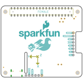

Contents
========

* [PRS16475 > SparkFun GPS Dead Reckoning PHat ZED-F9R](#prs16475--sparkfun-gps-dead-reckoning-phat-zed-f9r)
	* [Schematic](#schematic)
	* [PCB](#pcb)
	* [Interactive BOM](#interactive-bom)
	* [Images](#images)
	* [Tags](#tags)
  
![][im]
# PRS16475 > SparkFun GPS Dead Reckoning PHat ZED-F9R

- ID: PROJ-SPAR-16475-STAN-01
- Hex ID: PRS16475
- Name: Sparkfun
- Description: Sparkfun
- Long Link: [http://oom.lt/PROJ-SPAR-16475-STAN-01](http://oom.lt/PROJ-SPAR-16475-STAN-01)
- Short Link: [http://oom.lt/PRS16475](http://oom.lt/PRS16475)

## Schematic
  

## PCB
  

## Interactive BOM

- Interactive BOM page: [ibom.html](https://htmlpreview.github.io/?https://github.com/oomlout/oomlout_OOMP_projects/blob/main/PROJ-SPAR-16475-STAN-01/kicad/bom/ibom.html)

## Images
  
  

|bominteractivefront|bominteractiveback|kicadPcb3d|kicadPcb3dFront|kicadPcb3dBack|eagleImage|eagleSchemImage|
| :---: | :---: | :---: | :---: | :---: | :---: | :---: |
||||||||

## Tags

- hexID: PRS16475
- oompType: PROJ
- oompSize: SPAR
- oompColor: 16475
- oompDesc: STAN
- oompIndex: 01
- oompName: SparkFun GPS Dead Reckoning PHat ZED-F9R
- sources: All source files from https://github.com/sparkfun/SparkFun_GPS_Dead_Reckoning_PHat_ZED-F9R (source licence details in srcLicense.md)
- linkBuyPage: https://www.sparkfun.com/products/16475
- oompID: PROJ-SPAR-16475-STAN-01

[im]: kicadPcb3d_450.png
