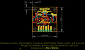
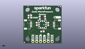
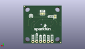
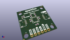

Contents
========

* [PROJ-SPAR-16476-STAN-01>MicroPressure Sensor](#proj-spar-16476-stan-01micropressure-sensor)
	* [Images](#images)
	* [Interactive BOM](#interactive-bom)
	* [OOMP Parts](#oomp-parts)
	* [Tags](#tags)
  
![][im]
# PROJ-SPAR-16476-STAN-01>MicroPressure Sensor

- ID: PROJ-SPAR-16476-STAN-01
- Hex ID: PRS16476
- Name: MicroPressure Sensor
- Description: 

## Images
  
  

|eagleImage|kicadPcb3dFront|kicadPcb3dBack|kicadPcb3d|
| :---: | :---: | :---: | :---: |
|||||

## Interactive BOM

- Interactive BOM page: [ibom.html](kicad/bom/ibom.html)

## OOMP Parts
  

|OOMP Parts|
| :---: |
|<table><tr><td></td><td> C1</td><td>[CAPC-0603-X-NF100-V50 SMD (0603) 100 nF Capacitor (Ceramic) 50v](https://github.com/oomlout/oomlout_OOMP_parts/tree/main/CAPC-0603-X-NF100-V50/)</td><td>[C6N100](https://github.com/oomlout/oomlout_OOMP_parts/tree/main/CAPC-0603-X-NF100-V50/)</td></tr></table>|
|CAPC-0603-X-UNMATCHED-01, C2, 16.509999999999998, 13.081, 90,C2, 1nF, 0603, SparkFun-Capacitors, (0.65, 0.515), R90|
|UNMATCHED-0603-X-UNMATCHED-01, D1, 4.3180000000000005, 17.272000000000002, 0,D1, RED, LED-0603, SparkFun-LED, (0.17, 0.68), R0|
|UNMATCHED-UNMATCHED-X-UNMATCHED-01, I2C, 12.7, 19.939, M0,I2C, SMT-JUMPER_3_2-NC_TRACE_SILK, SparkFun-Jumpers, (0.5, 0.785), MR0|
|UNMATCHED-UNMATCHED-X-UNMATCHED-01, J1, 20.32, 12.7, 90,J1, Qwiic, JST04_1MM_RA, SparkFun-Connectors, (0.8, 0.5), R90|
|UNMATCHED-UNMATCHED-X-UNMATCHED-01, J2, 5.08, 12.7, 270,J2, Qwiic, JST04_1MM_RA, SparkFun-Connectors, (0.2, 0.5), R270|
|UNMATCHED-UNMATCHED-X-UNMATCHED-01, J3, 6.35, 1.27, 0,J3, 1X04_NO_SILK, SparkFun-Connectors, (0.25, 0.05), R0|
|UNMATCHED-UNMATCHED-X-UNMATCHED-01, J4, 16.509999999999998, 1.27, 0,J4, 1X02_NO_SILK, SparkFun-Connectors, (0.65, 0.05), R0|
|UNMATCHED-UNMATCHED-X-UNMATCHED-01, PWR, 4.3180000000000005, 18.034, M90,PWR, SMT-JUMPER_2_NC_TRACE_SILK, SparkFun-Jumpers, (0.17, 0.71), MR90|
|RESE-0603-X-UNMATCHED-01, R1, 10.921999999999999, 17.272000000000002, 90,R1, 2.2k, 0603, SparkFun-Resistors, (0.43, 0.68), R90|
|RESE-0603-X-UNMATCHED-01, R2, 14.477999999999998, 17.272000000000002, 90,R2, 2.2k, 0603, SparkFun-Resistors, (0.57, 0.68), R90|
|RESE-0603-X-UNMATCHED-01, R3, 4.3180000000000005, 18.796, 0,R3, 1k, 0603, SparkFun-Resistors, (0.17, 0.74), R0|
|RESE-0603-X-UNMATCHED-01, R4, 12.7, 8.001, 0,R4, 2.2k, 0603, SparkFun-Resistors, (0.5, 0.315), R0|
|ERROR, U1 MPR Series, 0, 0, 0,U1, MPR, Series, MPR_SERIES_PRESSURE_I2C, SparkFun-Sensors, (0.5, 0.5), R180|

## Tags

- hexID: PRS16476
- oompType: PROJ
- oompSize: SPAR
- oompColor: 16476
- oompDesc: STAN
- oompIndex: 01
- oompName: MicroPressure Sensor
- sources: All source files from https://github.com/sparkfun/MicroPressure_Sensor (source licence details in srcLicense.md)
- linkBuyPage: https://www.sparkfun.com/products/16476
- oompID: PROJ-SPAR-16476-STAN-01
- oompPart: CAPC-0603-X-NF100-V50, C1, 8.889999999999999, 13.081, 270
- oompPart: CAPC-0603-X-UNMATCHED-01, C2, 16.509999999999998, 13.081, 90
- oompPart: UNMATCHED-0603-X-UNMATCHED-01, D1, 4.3180000000000005, 17.272000000000002, 0
- oompPart: SKIP-UNMATCHED-X-UNMATCHED-01, FD1, 0.635, 0.635, 0
- oompPart: SKIP-UNMATCHED-X-UNMATCHED-01, FD2, 0.635, 0.635, M0
- oompPart: SKIP-UNMATCHED-X-UNMATCHED-01, FD3, 24.764999999999997, 24.764999999999997, M0
- oompPart: SKIP-UNMATCHED-X-UNMATCHED-01, FD4, 24.764999999999997, 24.764999999999997, 0
- oompPart: UNMATCHED-UNMATCHED-X-UNMATCHED-01, I2C, 12.7, 19.939, M0
- oompPart: UNMATCHED-UNMATCHED-X-UNMATCHED-01, J1, 20.32, 12.7, 90
- oompPart: UNMATCHED-UNMATCHED-X-UNMATCHED-01, J2, 5.08, 12.7, 270
- oompPart: UNMATCHED-UNMATCHED-X-UNMATCHED-01, J3, 6.35, 1.27, 0
- oompPart: UNMATCHED-UNMATCHED-X-UNMATCHED-01, J4, 16.509999999999998, 1.27, 0
- oompPart: UNMATCHED-UNMATCHED-X-UNMATCHED-01, PWR, 4.3180000000000005, 18.034, M90
- oompPart: RESE-0603-X-UNMATCHED-01, R1, 10.921999999999999, 17.272000000000002, 90
- oompPart: RESE-0603-X-UNMATCHED-01, R2, 14.477999999999998, 17.272000000000002, 90
- oompPart: RESE-0603-X-UNMATCHED-01, R3, 4.3180000000000005, 18.796, 0
- oompPart: RESE-0603-X-UNMATCHED-01, R4, 12.7, 8.001, 0
- oompPart: ERROR, U1 MPR Series, 0, 0, 0
- rawPart: C1, 0.1uF, 0603, SparkFun-Capacitors, (0.35, 0.515), R270
- rawPart: C2, 1nF, 0603, SparkFun-Capacitors, (0.65, 0.515), R90
- rawPart: D1, RED, LED-0603, SparkFun-LED, (0.17, 0.68), R0
- rawPart: FD1, FIDUCIALUFIDUCIAL, FIDUCIAL-MICRO, SparkFun-Aesthetics, (0.025, 0.025), R0
- rawPart: FD2, FIDUCIALUFIDUCIAL, FIDUCIAL-MICRO, SparkFun-Aesthetics, (0.025, 0.025), MR0
- rawPart: FD3, FIDUCIALUFIDUCIAL, FIDUCIAL-MICRO, SparkFun-Aesthetics, (0.975, 0.975), MR0
- rawPart: FD4, FIDUCIALUFIDUCIAL, FIDUCIAL-MICRO, SparkFun-Aesthetics, (0.975, 0.975), R0
- rawPart: I2C, SMT-JUMPER_3_2-NC_TRACE_SILK, SparkFun-Jumpers, (0.5, 0.785), MR0
- rawPart: J1, Qwiic, JST04_1MM_RA, SparkFun-Connectors, (0.8, 0.5), R90
- rawPart: J2, Qwiic, JST04_1MM_RA, SparkFun-Connectors, (0.2, 0.5), R270
- rawPart: J3, 1X04_NO_SILK, SparkFun-Connectors, (0.25, 0.05), R0
- rawPart: J4, 1X02_NO_SILK, SparkFun-Connectors, (0.65, 0.05), R0
- rawPart: PWR, SMT-JUMPER_2_NC_TRACE_SILK, SparkFun-Jumpers, (0.17, 0.71), MR90
- rawPart: R1, 2.2k, 0603, SparkFun-Resistors, (0.43, 0.68), R90
- rawPart: R2, 2.2k, 0603, SparkFun-Resistors, (0.57, 0.68), R90
- rawPart: R3, 1k, 0603, SparkFun-Resistors, (0.17, 0.74), R0
- rawPart: R4, 2.2k, 0603, SparkFun-Resistors, (0.5, 0.315), R0
- rawPart: U1, MPR, Series, MPR_SERIES_PRESSURE_I2C, SparkFun-Sensors, (0.5, 0.5), R180

[im]: kicadPcb3d_450.png
