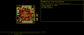
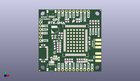
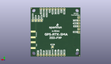
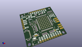

Contents
========

* [PROJ-SPAR-16481-STAN-01>Qwiic GPS-RTK2](#proj-spar-16481-stan-01qwiic-gps-rtk2)
	* [Images](#images)
	* [Interactive BOM](#interactive-bom)
	* [OOMP Parts](#oomp-parts)
	* [Tags](#tags)
  
![][im]
# PROJ-SPAR-16481-STAN-01>Qwiic GPS-RTK2

- ID: PROJ-SPAR-16481-STAN-01
- Hex ID: PRS16481
- Name: Qwiic GPS-RTK2
- Description: 

## Images
  
  

|eagleImage|kicadPcb3dFront|kicadPcb3dBack|kicadPcb3d|
| :---: | :---: | :---: | :---: |
|||||

## Interactive BOM

- Interactive BOM page: [ibom.html](kicad/bom/ibom.html)

## OOMP Parts
  

|OOMP Parts|
| :---: |
|UNMATCHED-UNMATCHED-X-UNMATCHED-01, B1, 11.43, 29.209999999999997, 180,B1, 6.8MM_COIN_CELL, ML414H_IV01E, SparkFun-Batteries, (0.45, 1.15), R180|
|CAPE-0402-X-UNMATCHED-01, C1, 35.05199999999999, 23.241, 90,C1, 47pF, 0402, SparkFun-Capacitors, (1.38, 0.915), R90|
|CAPC-0603-X-UNMATCHED-01, C2, 13.97, 19.812, 180,C2, 1.0uF, 0603, SparkFun-Capacitors, (0.55, 0.78), R180|
|CAPC-0603-X-UNMATCHED-01, C3, 11.049, 16.764, 270,C3, 1.0uF, 0603, SparkFun-Capacitors, (0.435, 0.66), R270|
|CAPC-0603-X-UNMATCHED-01, C4, 15.239999999999998, 26.669999999999998, 0,C4, 1.0uF, 0603, SparkFun-Capacitors, (0.6, 1.05), R0|
|<table><tr><td></td><td> C5</td><td>[CAPC-0603-X-NF100-V50 SMD (0603) 100 nF Capacitor (Ceramic) 50v](https://github.com/oomlout/oomlout_OOMP_parts/tree/main/CAPC-0603-X-NF100-V50/)</td><td>[C6N100](https://github.com/oomlout/oomlout_OOMP_parts/tree/main/CAPC-0603-X-NF100-V50/)</td></tr></table>|
|CAPC-0603-X-UNMATCHED-01, C6, 9.524999999999999, 24.13, 90,C6, 1.0uF, 0603, SparkFun-Capacitors, (0.375, 0.95), R90|
|<table><tr><td></td><td> C7</td><td>[CAPC-0603-X-NF100-V50 SMD (0603) 100 nF Capacitor (Ceramic) 50v](https://github.com/oomlout/oomlout_OOMP_parts/tree/main/CAPC-0603-X-NF100-V50/)</td><td>[C6N100](https://github.com/oomlout/oomlout_OOMP_parts/tree/main/CAPC-0603-X-NF100-V50/)</td></tr></table>|
|UNMATCHED-0603-X-UNMATCHED-01, D1, 37.465, 30.479999999999997, 270,D1, Yellow, LED-0603, SparkFun-LED, (1.475, 1.2), R270|
|UNMATCHED-UNMATCHED-X-UNMATCHED-01, D2, 13.97, 21.336, 0,D2, 0.5A/40V/420mV, SOD-323, SparkFun-DiscreteSemi, (0.55, 0.84), R0|
|UNMATCHED-0603-X-UNMATCHED-01, D3, 39.37, 30.479999999999997, 270,D3, GREEN, LED-0603, SparkFun-LED, (1.55, 1.2), R270|
|UNMATCHED-0603-X-UNMATCHED-01, D4, 41.275, 30.479999999999997, 270,D4, BLUE, LED-0603, SparkFun-LED, (1.625, 1.2), R270|
|UNMATCHED-UNMATCHED-X-UNMATCHED-01, D6, 10.921999999999999, 13.081, 0,D6, PRTR5V0U2F, SOT886, SparkFun-IC-Power, (0.43, 0.515), R0|
|UNMATCHED-UNMATCHED-X-UNMATCHED-01, E1, 41.021, 19.431, 270,E1, SMA, SMA-EDGE, SparkFun-RF, (1.615, 0.765), R270|
|UNMATCHED-UNMATCHED-X-UNMATCHED-01, E2, 41.021, 10.033, 270,E2, SMA, SMA-EDGE, SparkFun-RF, (1.615, 0.395), R270|
|UNMATCHED-UNMATCHED-X-UNMATCHED-01, FB1, 35.05199999999999, 16.128999999999998, 90,FB1, 120NH, 0402_MURATA, SparkFun-Coils, (1.38, 0.635), R90|
|UNMATCHED-UNMATCHED-X-UNMATCHED-01, FENCE, 41.275, 31.75, M270,FENCE, SMT-JUMPER_2_NC_TRACE_SILK, SparkFun-Jumpers, (1.625, 1.25), MR270|
|UNMATCHED-UNMATCHED-X-UNMATCHED-01, J1, 1.27, 34.29, 270,J1, Radio, 1X06_NO_SILK, SparkFun-Connectors, (0.05, 1.35), R270|
|ERROR, J2 Qwiic Right, 0, 0, 0,J2, Qwiic, Right, Angle, JST04_1MM_RA, SparkFun-Connectors, (0.35, 0.2), R0|
|UNMATCHED-UNMATCHED-X-UNMATCHED-01, J3, 13.97, 1.27, 0,J3, PTH, 1X04_NO_SILK, SparkX, (0.55, 0.05), R0|
|ERROR, J4 Qwiic Right, 0, 0, 0,J4, Qwiic, Right, Angle, JST04_1MM_RA, SparkFun-Connectors, (0.35, 1.5), R180|
|UNMATCHED-UNMATCHED-X-UNMATCHED-01, J5, 6.35, 12.7, 270,J5, USB-C-16P-2LAYER-PADS, SparkFun-Connectors, (0.25, 0.5), R270|
|UNMATCHED-UNMATCHED-X-UNMATCHED-01, J6, 24.13, 1.27, 0,J6, 1X06_NO_SILK, SparkFun-Connectors, (0.95, 0.05), R0|
|UNMATCHED-UNMATCHED-X-UNMATCHED-01, J7, 34.29, 41.91, 180,J7, 1X09_NO_SILK, SparkFun-Connectors, (1.35, 1.65), R180|
|UNMATCHED-UNMATCHED-X-UNMATCHED-01, JP5, 11.43, 8.889999999999999, 0,JP5, SMT-JUMPER_3_2-NC_TRACE_SILK, SparkFun-Jumpers, (0.45, 0.35), R0|
|UNMATCHED-0603-X-UNMATCHED-01, LED2, 35.559999999999995, 30.479999999999997, 270,LED2, RED, LED-0603, SparkFun-LED, (1.4, 1.2), R270|
|UNMATCHED-UNMATCHED-X-UNMATCHED-01, PPS, 33.019999999999996, 7.619999999999999, 90,PPS, SMT-JUMPER_2_NC_TRACE_SILK, SparkFun-Jumpers, (1.3, 0.3), R90|
|UNMATCHED-UNMATCHED-X-UNMATCHED-01, PPS_LED, 36.195, 31.75, M270,PPS_LED, SMT-JUMPER_2_NC_TRACE_SILK, SparkFun-Jumpers, (1.425, 1.25), MR270|
|UNMATCHED-UNMATCHED-X-UNMATCHED-01, PWR, 33.782, 31.75, M270,PWR, SMT-JUMPER_2_NC_TRACE_SILK, SparkFun-Jumpers, (1.33, 1.25), MR270|
|RESE-0603-X-UNMATCHED-01, R1, 35.559999999999995, 34.29, 90,R1, 1k, 0603, SparkFun-Resistors, (1.4, 1.35), R90|
|RESE-0603-X-UNMATCHED-01, R2, 21.462999999999997, 7.619999999999999, 270,R2, 33, 0603, SparkFun-Resistors, (0.845, 0.3), R270|
|RESE-0603-X-UNMATCHED-01, R3, 18.415, 7.619999999999999, 270,R3, 33, 0603, SparkFun-Resistors, (0.725, 0.3), R270|
|RESE-0603-X-UNMATCHED-01, R4, 22.987, 7.619999999999999, 270,R4, 33, 0603, SparkFun-Resistors, (0.905, 0.3), R270|
|RESE-0603-X-UNMATCHED-01, R5, 10.921999999999999, 20.32, 90,R5, 1k, 0603, SparkFun-Resistors, (0.43, 0.8), R90|
|RESE-0603-X-UNMATCHED-01, R6, 19.939, 7.619999999999999, 270,R6, 33, 0603, SparkFun-Resistors, (0.785, 0.3), R270|
|RESE-0603-X-UNMATCHED-01, R7, 13.97, 8.889999999999999, 90,R7, 2.2k, 0603, SparkFun-Resistors, (0.55, 0.35), R90|
|RESE-0603-X-UNMATCHED-01, R8, 8.889999999999999, 8.889999999999999, 90,R8, 2.2k, 0603, SparkFun-Resistors, (0.35, 0.35), R90|
|RESE-0603-X-UNMATCHED-01, R9, 13.97, 13.716, 0,R9, 27, 0603, SparkFun-Resistors, (0.55, 0.54), R0|
|RESE-0603-X-UNMATCHED-01, R10, 13.97, 15.239999999999998, 0,R10, 27, 0603, SparkFun-Resistors, (0.55, 0.6), R0|
|RESE-0603-X-UNMATCHED-01, R11, 37.465, 34.29, 90,R11, 1k, 0603, SparkFun-Resistors, (1.475, 1.35), R90|
|RESE-0603-X-UNMATCHED-01, R12, 39.37, 34.29, 90,R12, 1k, 0603, SparkFun-Resistors, (1.55, 1.35), R90|
|RESE-0603-X-UNMATCHED-01, R13, 41.275, 34.29, 90,R13, 1k, 0603, SparkFun-Resistors, (1.625, 1.35), R90|
|RESE-0603-X-UNMATCHED-01, R14, 35.05199999999999, 19.812, 90,R14, 33, 0603, SparkFun-Resistors, (1.38, 0.78), R90|
|<table><tr><td></td><td> R15</td><td>[RESE-0603-X-O104-01 SMD (0603) 100k Ohm Resistor](https://github.com/oomlout/oomlout_OOMP_parts/tree/main/RESE-0603-X-O104-01/)</td><td>[R6104](https://github.com/oomlout/oomlout_OOMP_parts/tree/main/RESE-0603-X-O104-01/)</td></tr></table>|
|RESE-0603-X-UNMATCHED-01, R16, 3.175, 6.985, 0,R16, 5.1k, 0603, SparkFun-Resistors, (0.125, 0.275), R0|
|RESE-0603-X-UNMATCHED-01, R17, 3.175, 18.415, 0,R17, 5.1k, 0603, SparkFun-Resistors, (0.125, 0.725), R0|
|RESE-0603-X-UNMATCHED-01, R18, 29.717999999999996, 7.619999999999999, 270,R18, 33, 0603, SparkFun-Resistors, (1.17, 0.3), R270|
|RESE-0603-X-UNMATCHED-01, R19, 26.669999999999998, 7.619999999999999, 270,R19, 33, 0603, SparkFun-Resistors, (1.05, 0.3), R270|
|RESE-0603-X-UNMATCHED-01, R20, 28.194000000000003, 7.619999999999999, 270,R20, 33, 0603, SparkFun-Resistors, (1.11, 0.3), R270|
|RESE-0603-X-UNMATCHED-01, R21, 31.241999999999997, 7.619999999999999, 270,R21, 33, 0603, SparkFun-Resistors, (1.23, 0.3), R270|
|RESE-0603-X-UNMATCHED-01, R22, 20.447, 35.559999999999995, 90,R22, 33, 0603, SparkFun-Resistors, (0.805, 1.4), R90|
|RESE-0603-X-UNMATCHED-01, R23, 18.923, 35.559999999999995, 90,R23, 33, 0603, SparkFun-Resistors, (0.745, 1.4), R90|
|RESE-0603-X-UNMATCHED-01, R24, 26.416, 35.559999999999995, 90,R24, 33, 0603, SparkFun-Resistors, (1.04, 1.4), R90|
|RESE-0603-X-UNMATCHED-01, R25, 27.94, 35.559999999999995, 90,R25, 33, 0603, SparkFun-Resistors, (1.1, 1.4), R90|
|UNMATCHED-UNMATCHED-X-UNMATCHED-01, RTK, 38.73499999999999, 31.75, M270,RTK, SMT-JUMPER_2_NC_TRACE_SILK, SparkFun-Jumpers, (1.525, 1.25), MR270|
|UNMATCHED-UNMATCHED-X-UNMATCHED-01, SPI, 24.13, 8.509, M90,SPI, SMT-JUMPER_2_NO_SILK, SparkFun-Jumpers, (0.95, 0.335), MR90|
|UNMATCHED-UNMATCHED-X-UNMATCHED-01, U2, 12.7, 24.13, 270,U2, 3.3V, SOT23-5, SparkFun-IC-Power, (0.5, 0.95), R270|
|UNMATCHED-UNMATCHED-X-UNMATCHED-01, U3, 25.4, 21.59, 90,U3, ZED-F9P, ZED-F9P, ZED-F9P, (1, 0.85), R90|

## Tags

- hexID: PRS16481
- oompType: PROJ
- oompSize: SPAR
- oompColor: 16481
- oompDesc: STAN
- oompIndex: 01
- oompName: Qwiic GPS-RTK2
- sources: All source files from https://github.com/sparkfun/Qwiic_GPS-RTK2 (source licence details in srcLicense.md)
- linkBuyPage: https://www.sparkfun.com/products/16481
- oompPart: UNMATCHED-UNMATCHED-X-UNMATCHED-01, B1, 11.43, 29.209999999999997, 180
- oompPart: CAPE-0402-X-UNMATCHED-01, C1, 35.05199999999999, 23.241, 90
- oompPart: CAPC-0603-X-UNMATCHED-01, C2, 13.97, 19.812, 180
- oompPart: CAPC-0603-X-UNMATCHED-01, C3, 11.049, 16.764, 270
- oompPart: CAPC-0603-X-UNMATCHED-01, C4, 15.239999999999998, 26.669999999999998, 0
- oompPart: CAPC-0603-X-NF100-V50, C5, 15.875, 24.13, 270
- oompPart: CAPC-0603-X-UNMATCHED-01, C6, 9.524999999999999, 24.13, 90
- oompPart: CAPC-0603-X-NF100-V50, C7, 13.97, 18.287999999999997, 0
- oompPart: UNMATCHED-0603-X-UNMATCHED-01, D1, 37.465, 30.479999999999997, 270
- oompPart: UNMATCHED-UNMATCHED-X-UNMATCHED-01, D2, 13.97, 21.336, 0
- oompPart: UNMATCHED-0603-X-UNMATCHED-01, D3, 39.37, 30.479999999999997, 270
- oompPart: UNMATCHED-0603-X-UNMATCHED-01, D4, 41.275, 30.479999999999997, 270
- oompPart: UNMATCHED-UNMATCHED-X-UNMATCHED-01, D6, 10.921999999999999, 13.081, 0
- oompPart: UNMATCHED-UNMATCHED-X-UNMATCHED-01, E1, 41.021, 19.431, 270
- oompPart: UNMATCHED-UNMATCHED-X-UNMATCHED-01, E2, 41.021, 10.033, 270
- oompPart: UNMATCHED-UNMATCHED-X-UNMATCHED-01, FB1, 35.05199999999999, 16.128999999999998, 90
- oompPart: UNMATCHED-UNMATCHED-X-UNMATCHED-01, FENCE, 41.275, 31.75, M270
- oompPart: UNMATCHED-UNMATCHED-X-UNMATCHED-01, J1, 1.27, 34.29, 270
- oompPart: ERROR, J2 Qwiic Right, 0, 0, 0
- oompPart: UNMATCHED-UNMATCHED-X-UNMATCHED-01, J3, 13.97, 1.27, 0
- oompPart: ERROR, J4 Qwiic Right, 0, 0, 0
- oompPart: UNMATCHED-UNMATCHED-X-UNMATCHED-01, J5, 6.35, 12.7, 270
- oompPart: UNMATCHED-UNMATCHED-X-UNMATCHED-01, J6, 24.13, 1.27, 0
- oompPart: UNMATCHED-UNMATCHED-X-UNMATCHED-01, J7, 34.29, 41.91, 180
- oompPart: UNMATCHED-UNMATCHED-X-UNMATCHED-01, JP5, 11.43, 8.889999999999999, 0
- oompPart: SKIP-UNMATCHED-X-UNMATCHED-01, JP21, 42.545, 42.545, 90
- oompPart: SKIP-UNMATCHED-X-UNMATCHED-01, JP61, 0.635, 0.635, 90
- oompPart: SKIP-UNMATCHED-X-UNMATCHED-01, JP71, 42.545, 42.545, M270
- oompPart: SKIP-UNMATCHED-X-UNMATCHED-01, JP81, 0.635, 0.635, M270
- oompPart: UNMATCHED-0603-X-UNMATCHED-01, LED2, 35.559999999999995, 30.479999999999997, 270
- oompPart: UNMATCHED-UNMATCHED-X-UNMATCHED-01, PPS, 33.019999999999996, 7.619999999999999, 90
- oompPart: UNMATCHED-UNMATCHED-X-UNMATCHED-01, PPS_LED, 36.195, 31.75, M270
- oompPart: UNMATCHED-UNMATCHED-X-UNMATCHED-01, PWR, 33.782, 31.75, M270
- oompPart: RESE-0603-X-UNMATCHED-01, R1, 35.559999999999995, 34.29, 90
- oompPart: RESE-0603-X-UNMATCHED-01, R2, 21.462999999999997, 7.619999999999999, 270
- oompPart: RESE-0603-X-UNMATCHED-01, R3, 18.415, 7.619999999999999, 270
- oompPart: RESE-0603-X-UNMATCHED-01, R4, 22.987, 7.619999999999999, 270
- oompPart: RESE-0603-X-UNMATCHED-01, R5, 10.921999999999999, 20.32, 90
- oompPart: RESE-0603-X-UNMATCHED-01, R6, 19.939, 7.619999999999999, 270
- oompPart: RESE-0603-X-UNMATCHED-01, R7, 13.97, 8.889999999999999, 90
- oompPart: RESE-0603-X-UNMATCHED-01, R8, 8.889999999999999, 8.889999999999999, 90
- oompPart: RESE-0603-X-UNMATCHED-01, R9, 13.97, 13.716, 0
- oompPart: RESE-0603-X-UNMATCHED-01, R10, 13.97, 15.239999999999998, 0
- oompPart: RESE-0603-X-UNMATCHED-01, R11, 37.465, 34.29, 90
- oompPart: RESE-0603-X-UNMATCHED-01, R12, 39.37, 34.29, 90
- oompPart: RESE-0603-X-UNMATCHED-01, R13, 41.275, 34.29, 90
- oompPart: RESE-0603-X-UNMATCHED-01, R14, 35.05199999999999, 19.812, 90
- oompPart: RESE-0603-X-O104-01, R15, 13.97, 16.764, 0
- oompPart: RESE-0603-X-UNMATCHED-01, R16, 3.175, 6.985, 0
- oompPart: RESE-0603-X-UNMATCHED-01, R17, 3.175, 18.415, 0
- oompPart: RESE-0603-X-UNMATCHED-01, R18, 29.717999999999996, 7.619999999999999, 270
- oompPart: RESE-0603-X-UNMATCHED-01, R19, 26.669999999999998, 7.619999999999999, 270
- oompPart: RESE-0603-X-UNMATCHED-01, R20, 28.194000000000003, 7.619999999999999, 270
- oompPart: RESE-0603-X-UNMATCHED-01, R21, 31.241999999999997, 7.619999999999999, 270
- oompPart: RESE-0603-X-UNMATCHED-01, R22, 20.447, 35.559999999999995, 90
- oompPart: RESE-0603-X-UNMATCHED-01, R23, 18.923, 35.559999999999995, 90
- oompPart: RESE-0603-X-UNMATCHED-01, R24, 26.416, 35.559999999999995, 90
- oompPart: RESE-0603-X-UNMATCHED-01, R25, 27.94, 35.559999999999995, 90
- oompPart: UNMATCHED-UNMATCHED-X-UNMATCHED-01, RTK, 38.73499999999999, 31.75, M270
- oompPart: UNMATCHED-UNMATCHED-X-UNMATCHED-01, SPI, 24.13, 8.509, M90
- oompPart: UNMATCHED-UNMATCHED-X-UNMATCHED-01, U2, 12.7, 24.13, 270
- oompPart: UNMATCHED-UNMATCHED-X-UNMATCHED-01, U3, 25.4, 21.59, 90
- rawPart: B1, 6.8MM_COIN_CELL, ML414H_IV01E, SparkFun-Batteries, (0.45, 1.15), R180
- rawPart: C1, 47pF, 0402, SparkFun-Capacitors, (1.38, 0.915), R90
- rawPart: C2, 1.0uF, 0603, SparkFun-Capacitors, (0.55, 0.78), R180
- rawPart: C3, 1.0uF, 0603, SparkFun-Capacitors, (0.435, 0.66), R270
- rawPart: C4, 1.0uF, 0603, SparkFun-Capacitors, (0.6, 1.05), R0
- rawPart: C5, 0.1uF, 0603, SparkFun-Capacitors, (0.625, 0.95), R270
- rawPart: C6, 1.0uF, 0603, SparkFun-Capacitors, (0.375, 0.95), R90
- rawPart: C7, 0.1uF, 0603, SparkFun-Capacitors, (0.55, 0.72), R0
- rawPart: D1, Yellow, LED-0603, SparkFun-LED, (1.475, 1.2), R270
- rawPart: D2, 0.5A/40V/420mV, SOD-323, SparkFun-DiscreteSemi, (0.55, 0.84), R0
- rawPart: D3, GREEN, LED-0603, SparkFun-LED, (1.55, 1.2), R270
- rawPart: D4, BLUE, LED-0603, SparkFun-LED, (1.625, 1.2), R270
- rawPart: D6, PRTR5V0U2F, SOT886, SparkFun-IC-Power, (0.43, 0.515), R0
- rawPart: E1, SMA, SMA-EDGE, SparkFun-RF, (1.615, 0.765), R270
- rawPart: E2, SMA, SMA-EDGE, SparkFun-RF, (1.615, 0.395), R270
- rawPart: FB1, 120NH, 0402_MURATA, SparkFun-Coils, (1.38, 0.635), R90
- rawPart: FENCE, SMT-JUMPER_2_NC_TRACE_SILK, SparkFun-Jumpers, (1.625, 1.25), MR270
- rawPart: J1, Radio, 1X06_NO_SILK, SparkFun-Connectors, (0.05, 1.35), R270
- rawPart: J2, Qwiic, Right, Angle, JST04_1MM_RA, SparkFun-Connectors, (0.35, 0.2), R0
- rawPart: J3, PTH, 1X04_NO_SILK, SparkX, (0.55, 0.05), R0
- rawPart: J4, Qwiic, Right, Angle, JST04_1MM_RA, SparkFun-Connectors, (0.35, 1.5), R180
- rawPart: J5, USB-C-16P-2LAYER-PADS, SparkFun-Connectors, (0.25, 0.5), R270
- rawPart: J6, 1X06_NO_SILK, SparkFun-Connectors, (0.95, 0.05), R0
- rawPart: J7, 1X09_NO_SILK, SparkFun-Connectors, (1.35, 1.65), R180
- rawPart: JP5, SMT-JUMPER_3_2-NC_TRACE_SILK, SparkFun-Jumpers, (0.45, 0.35), R0
- rawPart: JP21, FIDUCIALUFIDUCIAL, MICRO-FIDUCIAL, SparkFun, (1.675, 1.675), R90
- rawPart: JP61, FIDUCIALUFIDUCIAL, MICRO-FIDUCIAL, SparkFun, (0.025, 0.025), R90
- rawPart: JP71, FIDUCIALUFIDUCIAL, MICRO-FIDUCIAL, SparkFun, (1.675, 1.675), MR270
- rawPart: JP81, FIDUCIALUFIDUCIAL, MICRO-FIDUCIAL, SparkFun, (0.025, 0.025), MR270
- rawPart: LED2, RED, LED-0603, SparkFun-LED, (1.4, 1.2), R270
- rawPart: PPS, SMT-JUMPER_2_NC_TRACE_SILK, SparkFun-Jumpers, (1.3, 0.3), R90
- rawPart: PPS_LED, SMT-JUMPER_2_NC_TRACE_SILK, SparkFun-Jumpers, (1.425, 1.25), MR270
- rawPart: PWR, SMT-JUMPER_2_NC_TRACE_SILK, SparkFun-Jumpers, (1.33, 1.25), MR270
- rawPart: R1, 1k, 0603, SparkFun-Resistors, (1.4, 1.35), R90
- rawPart: R2, 33, 0603, SparkFun-Resistors, (0.845, 0.3), R270
- rawPart: R3, 33, 0603, SparkFun-Resistors, (0.725, 0.3), R270
- rawPart: R4, 33, 0603, SparkFun-Resistors, (0.905, 0.3), R270
- rawPart: R5, 1k, 0603, SparkFun-Resistors, (0.43, 0.8), R90
- rawPart: R6, 33, 0603, SparkFun-Resistors, (0.785, 0.3), R270
- rawPart: R7, 2.2k, 0603, SparkFun-Resistors, (0.55, 0.35), R90
- rawPart: R8, 2.2k, 0603, SparkFun-Resistors, (0.35, 0.35), R90
- rawPart: R9, 27, 0603, SparkFun-Resistors, (0.55, 0.54), R0
- rawPart: R10, 27, 0603, SparkFun-Resistors, (0.55, 0.6), R0
- rawPart: R11, 1k, 0603, SparkFun-Resistors, (1.475, 1.35), R90
- rawPart: R12, 1k, 0603, SparkFun-Resistors, (1.55, 1.35), R90
- rawPart: R13, 1k, 0603, SparkFun-Resistors, (1.625, 1.35), R90
- rawPart: R14, 33, 0603, SparkFun-Resistors, (1.38, 0.78), R90
- rawPart: R15, 100k, 0603, SparkFun-Resistors, (0.55, 0.66), R0
- rawPart: R16, 5.1k, 0603, SparkFun-Resistors, (0.125, 0.275), R0
- rawPart: R17, 5.1k, 0603, SparkFun-Resistors, (0.125, 0.725), R0
- rawPart: R18, 33, 0603, SparkFun-Resistors, (1.17, 0.3), R270
- rawPart: R19, 33, 0603, SparkFun-Resistors, (1.05, 0.3), R270
- rawPart: R20, 33, 0603, SparkFun-Resistors, (1.11, 0.3), R270
- rawPart: R21, 33, 0603, SparkFun-Resistors, (1.23, 0.3), R270
- rawPart: R22, 33, 0603, SparkFun-Resistors, (0.805, 1.4), R90
- rawPart: R23, 33, 0603, SparkFun-Resistors, (0.745, 1.4), R90
- rawPart: R24, 33, 0603, SparkFun-Resistors, (1.04, 1.4), R90
- rawPart: R25, 33, 0603, SparkFun-Resistors, (1.1, 1.4), R90
- rawPart: RTK, SMT-JUMPER_2_NC_TRACE_SILK, SparkFun-Jumpers, (1.525, 1.25), MR270
- rawPart: SPI, SMT-JUMPER_2_NO_SILK, SparkFun-Jumpers, (0.95, 0.335), MR90
- rawPart: U2, 3.3V, SOT23-5, SparkFun-IC-Power, (0.5, 0.95), R270
- rawPart: U3, ZED-F9P, ZED-F9P, ZED-F9P, (1, 0.85), R90
- oompID: PROJ-SPAR-16481-STAN-01

[im]: kicadPcb3d_450.png
