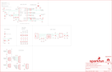

Contents
========

* [PRS16481 > Qwiic GPS-RTK2](#prs16481--qwiic-gps-rtk2)
	* [Schematic](#schematic)
	* [PCB](#pcb)
	* [Interactive BOM](#interactive-bom)
	* [Images](#images)
	* [Tags](#tags)
  
![][im]
# PRS16481 > Qwiic GPS-RTK2

- ID: PROJ-SPAR-16481-STAN-01
- Hex ID: PRS16481
- Name: Sparkfun
- Description: Sparkfun
- Long Link: [http://oom.lt/PROJ-SPAR-16481-STAN-01](http://oom.lt/PROJ-SPAR-16481-STAN-01)
- Short Link: [http://oom.lt/PRS16481](http://oom.lt/PRS16481)

## Schematic
  

## PCB
  

## Interactive BOM

- Interactive BOM page: [ibom.html](https://htmlpreview.github.io/?https://github.com/oomlout/oomlout_OOMP_projects/blob/main/PROJ-SPAR-16481-STAN-01/kicad/bom/ibom.html)

## Images
  
  

|bominteractivefront|bominteractiveback|kicadPcb3d|kicadPcb3dFront|kicadPcb3dBack|eagleImage|eagleSchemImage|pcbdraw|pcbdrawback|
| :---: | :---: | :---: | :---: | :---: | :---: | :---: | :---: | :---: |
||||||||||

## Tags

- hexID: PRS16481
- oompType: PROJ
- oompSize: SPAR
- oompColor: 16481
- oompDesc: STAN
- oompIndex: 01
- oompName: Qwiic GPS-RTK2
- sources: All source files from https://github.com/sparkfun/Qwiic_GPS-RTK2 (source licence details in srcLicense.md)
- linkBuyPage: https://www.sparkfun.com/products/16481
- oompID: PROJ-SPAR-16481-STAN-01
- rawParts: B1,6.8MM_COIN_CELL,ML414H_IV01E_BATTERY,ML414H_IV01E,SEIKO ML414H-IV01E Reflowable Lithium Battery,,BATT-14267,,,
- rawParts: C1,47pF,47PF-0402-25V-5%-X7R,0402,47pF ceramic capacitors,,CAP-15063,,47pF,
- rawParts: C2,1.0uF,1.0UF-0603-16V-10%-X7R,0603,1µF ceramic capacitors,,CAP-13930,,1.0uF,
- rawParts: C3,1.0uF,1.0UF-0603-16V-10%-X7R,0603,1µF ceramic capacitors,,CAP-13930,,1.0uF,
- rawParts: C4,1.0uF,1.0UF-0603-16V-10%-X7R,0603,1µF ceramic capacitors,,CAP-13930,,1.0uF,
- rawParts: C5,0.1uF,0.1UF-0603-25V-5%,0603,0.1µF ceramic capacitors,,CAP-08604,,0.1uF,
- rawParts: C6,1.0uF,1.0UF-0603-16V-10%-X7R,0603,1µF ceramic capacitors,,CAP-13930,,1.0uF,
- rawParts: C7,0.1uF,0.1UF-0603-25V-5%,0603,0.1µF ceramic capacitors,,CAP-08604,,0.1uF,
- rawParts: D1,Yellow,LED-YELLOW0603,LED-0603,Yellow SMD LED,,DIO-09003,,Yellow,
- rawParts: D2,0.5A/40V/420mV,DIODE-SCHOTTKY-PMEG4005EJ,SOD-323,Schottky diode,,DIO-10955,,0.5A/40V/420mV,
- rawParts: D3,GREEN,LED-GREEN0603,LED-0603,Green SMD LED,,DIO-00821,,GREEN,
- rawParts: D4,BLUE,LED-BLUE0603,LED-0603,Blue SMD LED,,DIO-08575,,BLUE,
- rawParts: D6,PRTR5V0U2F,PRTR5V0U2F,SOT886,A small ESD protection device. Most commonly used on USB D+/D- signals to protect large, expensive, or especially sensitive USB enabled devices.,,DIO-14084,,,
- rawParts: E1,SMA,ANTENNA-GROUNDEDEDGE_SMA,SMA-EDGE,Antenna w/ Ground Connection,,CONN-08289,,,
- rawParts: E2,SMA,ANTENNA-GROUNDEDEDGE_SMA,SMA-EDGE,Antenna w/ Ground Connection,,CONN-08289,,,
- rawParts: FB1,120NH,FERRITE_BEAD_GNSS,0402_MURATA,,,NDUC-15072,,120NH,
- rawParts: FENCE,,JUMPER-SMT_2_NC_TRACE_SILK,SMT-JUMPER_2_NC_TRACE_SILK,Normally closed trace jumper,,,,,
- rawParts: FRAME2,FRAME-LEDGER,FRAME-LEDGER,CREATIVE_COMMONS,Schematic Frame - Ledger,,,,,
- rawParts: J1,Radio,6_PIN_SERIAL_TARGET_NO_SILK,1X06_NO_SILK,6-pin header connection for use with the FTDI BASIC pinout - TARGET SIDE.,,,,,
- rawParts: J2,Qwiic Right Angle,I2C_STANDARDQWIIC,JST04_1MM_RA,SparkFun I2C Standard Pinout Header,,CONN-13694,,Qwiic Right Angle,
- rawParts: J3,PTH,I2C_STANDARD_NO_SILK,1X04_NO_SILK,SparkFun I2C Standard Pinout Header,,,,,
- rawParts: J4,Qwiic Right Angle,I2C_STANDARDQWIIC,JST04_1MM_RA,SparkFun I2C Standard Pinout Header,,CONN-13694,,Qwiic Right Angle,
- rawParts: J5,,USB_C_2-LAYER_PADS,USB-C-16P-2LAYER-PADS,USB Type C 16Pin Connector,,CONN-14122,,,
- rawParts: J6,,CONN_06NO_SILK_FEMALE_PTH,1X06_NO_SILK,Multi connection point. Often used as Generic Header-pin footprint for 0.1 inch spaced/style header connections,,CONN-08437,,,
- rawParts: J7,,CONN_09NO_SILK,1X09_NO_SILK,Multi connection point. Often used as Generic Header-pin footprint for 0.1 inch spaced/style header connections,,,,,
- rawParts: JP5,,JUMPER-SMT_3_2-NC_TRACE_SILK,SMT-JUMPER_3_2-NC_TRACE_SILK,Normally closed trace jumper (2 of 2 connections),,,,,
- rawParts: JP21,FIDUCIALUFIDUCIAL,FIDUCIALUFIDUCIAL,MICRO-FIDUCIAL,Fiducial Alignment Points,,,,,
- rawParts: JP31,STAND-OFF,STAND-OFF,STAND-OFF,Stand Off,,,,,
- rawParts: JP41,STAND-OFF,STAND-OFF,STAND-OFF,Stand Off,,,,,
- rawParts: JP61,FIDUCIALUFIDUCIAL,FIDUCIALUFIDUCIAL,MICRO-FIDUCIAL,Fiducial Alignment Points,,,,,
- rawParts: JP71,FIDUCIALUFIDUCIAL,FIDUCIALUFIDUCIAL,MICRO-FIDUCIAL,Fiducial Alignment Points,,,,,
- rawParts: JP81,FIDUCIALUFIDUCIAL,FIDUCIALUFIDUCIAL,MICRO-FIDUCIAL,Fiducial Alignment Points,,,,,
- rawParts: JP91,STAND-OFF,STAND-OFF,STAND-OFF,Stand Off,,,,,
- rawParts: JP101,STAND-OFF,STAND-OFF,STAND-OFF,Stand Off,,,,,
- rawParts: LED2,RED,LED-RED0603,LED-0603,Red SMD LED,,DIO-00819,,RED,
- rawParts: LOGO1,OSHW-LOGOMINI,OSHW-LOGOMINI,OSHW-LOGO-MINI,Open-Source Hardware (OSHW) Logo,,,,,
- rawParts: LOGO2,SFE_LOGO_NAME_FLAME.1_INCH,SFE_LOGO_NAME_FLAME.1_INCH,SFE_LOGO_NAME_FLAME_.1,SparkFun Font Logo w/ Flame,,,,,
- rawParts: PPS,,JUMPER-SMT_2_NC_TRACE_SILK,SMT-JUMPER_2_NC_TRACE_SILK,Normally closed trace jumper,,,,,
- rawParts: PPS_LED,,JUMPER-SMT_2_NC_TRACE_SILK,SMT-JUMPER_2_NC_TRACE_SILK,Normally closed trace jumper,,,,,
- rawParts: PWR,,JUMPER-SMT_2_NC_TRACE_SILK,SMT-JUMPER_2_NC_TRACE_SILK,Normally closed trace jumper,,,,,
- rawParts: R1,1k,1KOHM-0603-1/10W-1%,0603,1kΩ resistor,,RES-07856,,1k,
- rawParts: R2,33,33OHM-0603-1/10W-1%,0603,33Ω resistor,,RES-08270,,33,
- rawParts: R3,33,33OHM-0603-1/10W-1%,0603,33Ω resistor,,RES-08270,,33,
- rawParts: R4,33,33OHM-0603-1/10W-1%,0603,33Ω resistor,,RES-08270,,33,
- rawParts: R5,1k,1KOHM-0603-1/10W-1%,0603,1kΩ resistor,,RES-07856,,1k,
- rawParts: R6,33,33OHM-0603-1/10W-1%,0603,33Ω resistor,,RES-08270,,33,
- rawParts: R7,2.2k,2.2KOHM-0603-1/10W-1%,0603,2.2kΩ resistor,,RES-08272,,2.2k,
- rawParts: R8,2.2k,2.2KOHM-0603-1/10W-1%,0603,2.2kΩ resistor,,RES-08272,,2.2k,
- rawParts: R9,27,27OHM-0603-1/10W-1%,0603,27Ω resistor,,RES-09334,,27,
- rawParts: R10,27,27OHM-0603-1/10W-1%,0603,27Ω resistor,,RES-09334,,27,
- rawParts: R11,1k,1KOHM-0603-1/10W-1%,0603,1kΩ resistor,,RES-07856,,1k,
- rawParts: R12,1k,1KOHM-0603-1/10W-1%,0603,1kΩ resistor,,RES-07856,,1k,
- rawParts: R13,1k,1KOHM-0603-1/10W-1%,0603,1kΩ resistor,,RES-07856,,1k,
- rawParts: R14,33,33OHM-0603-1/10W-1%,0603,33Ω resistor,,RES-08270,,33,
- rawParts: R15,100k,100KOHM-0603-1/10W-1%,0603,100kΩ resistor,,RES-07828,,100k,
- rawParts: R16,5.1k,5.1KOHM5.1KOHM-0603-1/10W-1%,0603,,,RES-12083,,5.1k,
- rawParts: R17,5.1k,5.1KOHM5.1KOHM-0603-1/10W-1%,0603,,,RES-12083,,5.1k,
- rawParts: R18,33,33OHM-0603-1/10W-1%,0603,33Ω resistor,,RES-08270,,33,
- rawParts: R19,33,33OHM-0603-1/10W-1%,0603,33Ω resistor,,RES-08270,,33,
- rawParts: R20,33,33OHM-0603-1/10W-1%,0603,33Ω resistor,,RES-08270,,33,
- rawParts: R21,33,33OHM-0603-1/10W-1%,0603,33Ω resistor,,RES-08270,,33,
- rawParts: R22,33,33OHM-0603-1/10W-1%,0603,33Ω resistor,,RES-08270,,33,
- rawParts: R23,33,33OHM-0603-1/10W-1%,0603,33Ω resistor,,RES-08270,,33,
- rawParts: R24,33,33OHM-0603-1/10W-1%,0603,33Ω resistor,,RES-08270,,33,
- rawParts: R25,33,33OHM-0603-1/10W-1%,0603,33Ω resistor,,RES-08270,,33,
- rawParts: RTK,,JUMPER-SMT_2_NC_TRACE_SILK,SMT-JUMPER_2_NC_TRACE_SILK,Normally closed trace jumper,,,,,
- rawParts: SPI,,JUMPER-SMT_2_NO_SILK,SMT-JUMPER_2_NO_SILK,Normally open jumper,,,,,
- rawParts: U$2,SPECIAL_INSTRUCTIONS-ORDERING,SPECIAL_INSTRUCTIONS-ORDERING,ORDERING_INSTRUCTIONS,Special Ordering/Production Instructions Alert,,,,,
- rawParts: U2,3.3V,V_REG_AP2112K-3.3V,SOT23-5,AP2112 - 600mA CMOS LDO Regulator w/ Enable,,VREG-12457,,3.3V,
- rawParts: U3,ZED-F9P,ZED-F9P,ZED-F9P,,,,,,

[im]: kicadPcb3d_450.png
