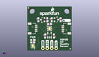
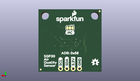
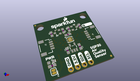

Contents
========

* [PROJ-SPAR-16531-STAN-01>SparkFun Air Quality Sensor-SGP30](#proj-spar-16531-stan-01sparkfun-air-quality-sensor-sgp30)
	* [Images](#images)
	* [Interactive BOM](#interactive-bom)
	* [OOMP Parts](#oomp-parts)
	* [Tags](#tags)
  
![][im]
# PROJ-SPAR-16531-STAN-01>SparkFun Air Quality Sensor-SGP30

- ID: PROJ-SPAR-16531-STAN-01
- Hex ID: PRS16531
- Name: SparkFun Air Quality Sensor-SGP30
- Description: 

## Images
  
  

|eagleImage|kicadPcb3dFront|kicadPcb3dBack|kicadPcb3d|
| :---: | :---: | :---: | :---: |
|||||

## Interactive BOM

- Interactive BOM page: [ibom.html](kicad/bom/ibom.html)

## OOMP Parts
  

|OOMP Parts|
| :---: |
|CAPE-0603-X-UNMATCHED-01, C1, 10.16, 8.382, 90,C1, 1.0uF, 0603, SparkFun-Capacitors, (0.4, 0.33), R90|
|CAPE-0603-X-UNMATCHED-01, C2, 15.239999999999998, 8.382, 270,C2, 1.0uF, 0603, SparkFun-Capacitors, (0.6, 0.33), R270|
|CAPE-0603-X-NF100-01, C4, 12.7, 15.239999999999998, 0,C4, 0.1uF, 0603, SparkFun-Capacitors, (0.5, 0.6), R0|
|UNMATCHED-0603-X-UNMATCHED-01, D1, 3.175, 6.095999999999999, 0,D1, RED, LED-0603, SparkFun-LED, (0.125, 0.24), R0|
|UNMATCHED-UNMATCHED-X-UNMATCHED-01, I2C, 12.7, 17.779999999999998, M0,I2C, JUMPER-SMT_3_2-NC_TRACE_SILK, SMT-JUMPER_3_2-NC_TRACE_SILK, SparkFun-Jumpers, (0.5, 0.7), MR0|
|UNMATCHED-UNMATCHED-X-UNMATCHED-01, J1, 8.889999999999999, 1.27, M180,J1, 1X04_NO_SILK, SparkFun-Connectors, (0.35, 0.05), MR180|
|UNMATCHED-UNMATCHED-X-UNMATCHED-01, J2, 5.08, 12.7, 270,J2, QWIIC_RIGHT_ANGLE, JST04_1MM_RA, SparkFun-Connectors, (0.2, 0.5), R270|
|UNMATCHED-UNMATCHED-X-UNMATCHED-01, J4, 20.32, 12.7, 90,J4, QWIIC_RIGHT_ANGLE, JST04_1MM_RA, SparkFun-Connectors, (0.8, 0.5), R90|
|UNMATCHED-UNMATCHED-X-UNMATCHED-01, JP1, 0.7619999999999999, 24.637999999999998, M0,JP1, FIDUCIALUFIDUCIAL, MICRO-FIDUCIAL, SparkFun, (0.03, 0.97), MR0|
|UNMATCHED-UNMATCHED-X-UNMATCHED-01, JP2, 24.511, 0.889, 0,JP2, FIDUCIALUFIDUCIAL, MICRO-FIDUCIAL, SparkFun, (0.965, 0.035), R0|
|UNMATCHED-UNMATCHED-X-UNMATCHED-01, JP5, 24.511, 0.889, M0,JP5, FIDUCIALUFIDUCIAL, MICRO-FIDUCIAL, SparkFun, (0.965, 0.035), MR0|
|UNMATCHED-UNMATCHED-X-UNMATCHED-01, JP6, 0.7619999999999999, 24.637999999999998, 0,JP6, FIDUCIALUFIDUCIAL, MICRO-FIDUCIAL, SparkFun, (0.03, 0.97), R0|
|UNMATCHED-UNMATCHED-X-UNMATCHED-01, PWR, 3.175, 2.54, 270,PWR, JUMPER-SMT_2_NC_TRACE_SILK, SMT-JUMPER_2_NC_TRACE_SILK, SparkFun-Jumpers, (0.125, 0.1), R270|
|UNMATCHED-UNMATCHED-X-UNMATCHED-01, Q1, 8.889999999999999, 17.779999999999998, 90,Q1, 220mA/50V/3.5?, SOT23-3, SparkFun-DiscreteSemi, (0.35, 0.7), R90|
|UNMATCHED-UNMATCHED-X-UNMATCHED-01, Q2, 16.509999999999998, 17.779999999999998, 270,Q2, 220mA/50V/3.5?, SOT23-3, SparkFun-DiscreteSemi, (0.65, 0.7), R270|
|<table><tr><td></td><td> R1</td><td>[RESE-0603-X-O103-01 SMD (0603) 10k Ohm Resistor](https://github.com/oomlout/oomlout_OOMP_parts/tree/main/RESE-0603-X-O103-01/)</td><td>[R6103](https://github.com/oomlout/oomlout_OOMP_parts/tree/main/RESE-0603-X-O103-01/)</td></tr></table>|
|<table><tr><td></td><td> R2</td><td>[RESE-0603-X-O103-01 SMD (0603) 10k Ohm Resistor](https://github.com/oomlout/oomlout_OOMP_parts/tree/main/RESE-0603-X-O103-01/)</td><td>[R6103](https://github.com/oomlout/oomlout_OOMP_parts/tree/main/RESE-0603-X-O103-01/)</td></tr></table>|
|RESE-0603-X-UNMATCHED-01, R3, 3.175, 4.699, 0,R3, 1k, 0603, SparkFun-Resistors, (0.125, 0.185), R0|
|<table><tr><td></td><td> R6</td><td>[RESE-0603-X-O103-01 SMD (0603) 10k Ohm Resistor](https://github.com/oomlout/oomlout_OOMP_parts/tree/main/RESE-0603-X-O103-01/)</td><td>[R6103](https://github.com/oomlout/oomlout_OOMP_parts/tree/main/RESE-0603-X-O103-01/)</td></tr></table>|
|<table><tr><td></td><td> R7</td><td>[RESE-0603-X-O103-01 SMD (0603) 10k Ohm Resistor](https://github.com/oomlout/oomlout_OOMP_parts/tree/main/RESE-0603-X-O103-01/)</td><td>[R6103](https://github.com/oomlout/oomlout_OOMP_parts/tree/main/RESE-0603-X-O103-01/)</td></tr></table>|
|UNMATCHED-UNMATCHED-X-UNMATCHED-01, U2, 12.7, 8.889999999999999, 0,U2, AP2127K-1.8V, SOT23-5, SparkFun-IC-Power, (0.5, 0.35), R0|
|UNMATCHED-UNMATCHED-X-UNMATCHED-01, U3, 12.7, 12.7, 0,U3, SGP30, SGP30, SparkFun-Sensors, (0.5, 0.5), R0|

## Tags

- hexID: PRS16531
- oompType: PROJ
- oompSize: SPAR
- oompColor: 16531
- oompDesc: STAN
- oompIndex: 01
- oompName: SparkFun Air Quality Sensor-SGP30
- sources: All source files from https://github.com/sparkfun/SparkFun_Air_Quality_Sensor-SGP30 (source licence details in srcLicense.md)
- linkBuyPage: https://www.sparkfun.com/products/16531
- oompPart: CAPE-0603-X-UNMATCHED-01, C1, 10.16, 8.382, 90
- oompPart: CAPE-0603-X-UNMATCHED-01, C2, 15.239999999999998, 8.382, 270
- oompPart: CAPE-0603-X-NF100-01, C4, 12.7, 15.239999999999998, 0
- oompPart: UNMATCHED-0603-X-UNMATCHED-01, D1, 3.175, 6.095999999999999, 0
- oompPart: UNMATCHED-UNMATCHED-X-UNMATCHED-01, I2C, 12.7, 17.779999999999998, M0
- oompPart: UNMATCHED-UNMATCHED-X-UNMATCHED-01, J1, 8.889999999999999, 1.27, M180
- oompPart: UNMATCHED-UNMATCHED-X-UNMATCHED-01, J2, 5.08, 12.7, 270
- oompPart: UNMATCHED-UNMATCHED-X-UNMATCHED-01, J4, 20.32, 12.7, 90
- oompPart: UNMATCHED-UNMATCHED-X-UNMATCHED-01, JP1, 0.7619999999999999, 24.637999999999998, M0
- oompPart: UNMATCHED-UNMATCHED-X-UNMATCHED-01, JP2, 24.511, 0.889, 0
- oompPart: UNMATCHED-UNMATCHED-X-UNMATCHED-01, JP5, 24.511, 0.889, M0
- oompPart: UNMATCHED-UNMATCHED-X-UNMATCHED-01, JP6, 0.7619999999999999, 24.637999999999998, 0
- oompPart: UNMATCHED-UNMATCHED-X-UNMATCHED-01, PWR, 3.175, 2.54, 270
- oompPart: UNMATCHED-UNMATCHED-X-UNMATCHED-01, Q1, 8.889999999999999, 17.779999999999998, 90
- oompPart: UNMATCHED-UNMATCHED-X-UNMATCHED-01, Q2, 16.509999999999998, 17.779999999999998, 270
- oompPart: RESE-0603-X-O103-01, R1, 6.35, 17.779999999999998, 90
- oompPart: RESE-0603-X-O103-01, R2, 11.43, 17.779999999999998, 270
- oompPart: RESE-0603-X-UNMATCHED-01, R3, 3.175, 4.699, 0
- oompPart: RESE-0603-X-O103-01, R6, 13.97, 17.779999999999998, 90
- oompPart: RESE-0603-X-O103-01, R7, 19.049999999999997, 17.779999999999998, 90
- oompPart: UNMATCHED-UNMATCHED-X-UNMATCHED-01, U2, 12.7, 8.889999999999999, 0
- oompPart: UNMATCHED-UNMATCHED-X-UNMATCHED-01, U3, 12.7, 12.7, 0
- rawPart: C1, 1.0uF, 0603, SparkFun-Capacitors, (0.4, 0.33), R90
- rawPart: C2, 1.0uF, 0603, SparkFun-Capacitors, (0.6, 0.33), R270
- rawPart: C4, 0.1uF, 0603, SparkFun-Capacitors, (0.5, 0.6), R0
- rawPart: D1, RED, LED-0603, SparkFun-LED, (0.125, 0.24), R0
- rawPart: I2C, JUMPER-SMT_3_2-NC_TRACE_SILK, SMT-JUMPER_3_2-NC_TRACE_SILK, SparkFun-Jumpers, (0.5, 0.7), MR0
- rawPart: J1, 1X04_NO_SILK, SparkFun-Connectors, (0.35, 0.05), MR180
- rawPart: J2, QWIIC_RIGHT_ANGLE, JST04_1MM_RA, SparkFun-Connectors, (0.2, 0.5), R270
- rawPart: J4, QWIIC_RIGHT_ANGLE, JST04_1MM_RA, SparkFun-Connectors, (0.8, 0.5), R90
- rawPart: JP1, FIDUCIALUFIDUCIAL, MICRO-FIDUCIAL, SparkFun, (0.03, 0.97), MR0
- rawPart: JP2, FIDUCIALUFIDUCIAL, MICRO-FIDUCIAL, SparkFun, (0.965, 0.035), R0
- rawPart: JP5, FIDUCIALUFIDUCIAL, MICRO-FIDUCIAL, SparkFun, (0.965, 0.035), MR0
- rawPart: JP6, FIDUCIALUFIDUCIAL, MICRO-FIDUCIAL, SparkFun, (0.03, 0.97), R0
- rawPart: PWR, JUMPER-SMT_2_NC_TRACE_SILK, SMT-JUMPER_2_NC_TRACE_SILK, SparkFun-Jumpers, (0.125, 0.1), R270
- rawPart: Q1, 220mA/50V/3.5?, SOT23-3, SparkFun-DiscreteSemi, (0.35, 0.7), R90
- rawPart: Q2, 220mA/50V/3.5?, SOT23-3, SparkFun-DiscreteSemi, (0.65, 0.7), R270
- rawPart: R1, 10k, 0603, SparkFun-Resistors, (0.25, 0.7), R90
- rawPart: R2, 10k, 0603, SparkFun-Resistors, (0.45, 0.7), R270
- rawPart: R3, 1k, 0603, SparkFun-Resistors, (0.125, 0.185), R0
- rawPart: R6, 10k, 0603, SparkFun-Resistors, (0.55, 0.7), R90
- rawPart: R7, 10k, 0603, SparkFun-Resistors, (0.75, 0.7), R90
- rawPart: U2, AP2127K-1.8V, SOT23-5, SparkFun-IC-Power, (0.5, 0.35), R0
- rawPart: U3, SGP30, SGP30, SparkFun-Sensors, (0.5, 0.5), R0

[im]: kicadPcb3d_450.png
