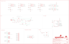

Contents
========

* [PRS16566 > Qwiic Quad Relay](#prs16566--qwiic-quad-relay)
	* [Schematic](#schematic)
	* [PCB](#pcb)
	* [Interactive BOM](#interactive-bom)
	* [Images](#images)
	* [Tags](#tags)
  
![][im]
# PRS16566 > Qwiic Quad Relay

- ID: PROJ-SPAR-16566-STAN-01
- Hex ID: PRS16566
- Name: Sparkfun
- Description: Sparkfun
- Long Link: [http://oom.lt/PROJ-SPAR-16566-STAN-01](http://oom.lt/PROJ-SPAR-16566-STAN-01)
- Short Link: [http://oom.lt/PRS16566](http://oom.lt/PRS16566)

## Schematic
  

## PCB
  

## Interactive BOM

- Interactive BOM page: [ibom.html](https://htmlpreview.github.io/?https://github.com/oomlout/oomlout_OOMP_projects/blob/main/PROJ-SPAR-16566-STAN-01/kicad/bom/ibom.html)

## Images
  
  

|bominteractivefront|bominteractiveback|kicadPcb3d|kicadPcb3dFront|kicadPcb3dBack|eagleImage|eagleSchemImage|pcbdraw|pcbdrawback|
| :---: | :---: | :---: | :---: | :---: | :---: | :---: | :---: | :---: |
||||||||||

## Tags

- hexID: PRS16566
- oompType: PROJ
- oompSize: SPAR
- oompColor: 16566
- oompDesc: STAN
- oompIndex: 01
- oompName: Qwiic Quad Relay
- sources: All source files from https://github.com/sparkfun/Qwiic_Quad_Relay (source licence details in srcLicense.md)
- linkBuyPage: https://www.sparkfun.com/products/16566
- oompID: PROJ-SPAR-16566-STAN-01
- rawParts: ADR,JUMPER-SMT_2_NO_SILK,JUMPER-SMT_2_NO_SILK,SMT-JUMPER_2_NO_SILK,Normally open jumper,,,,,,
- rawParts: BYP,JUMPER-SMT_2_NO_SILK,JUMPER-SMT_2_NO_SILK,SMT-JUMPER_2_NO_SILK,Normally open jumper,,,,,,
- rawParts: C1,10uF,10UF-POLAR-EIA3528-20V-10%(TANT),EIA3528,10.0µF polarized capacitors,,CAP-08063,,,10uF,
- rawParts: C2,0.1uF,0.1UF-0402-10V-10%-X7R,0402,0.1µF ceramic capacitors,,CAP-15083,,,0.1uF,
- rawParts: C3,10uF,10UF-0603-6.3V-20%,0603,10.0µF ceramic capacitors,,CAP-11015,,,10uF,
- rawParts: C4,10uF,10UF-0603-6.3V-20%,0603,10.0µF ceramic capacitors,,CAP-11015,,,10uF,
- rawParts: C5,0.1uF,0.1UF-0603-25V-(+80/-20%),0603,0.1µF ceramic capacitors,,CAP-00810,,,0.1uF,
- rawParts: D1,BLUE,LED-BLUE0603,LED-0603,Blue SMD LED,,DIO-08575,,,BLUE,
- rawParts: D2,1A/23V/620mV,DIODE-SCHOTTKY-BAT20J,SOD-323,Schottky diode,,DIO-11623,,,1A/23V/620mV,
- rawParts: D3,1A/40V/500mV,DIODE-SCHOTTKY-SS14,SMA-DIODE,Schottky diode,,DIO-08053,,,1A/40V/500mV,
- rawParts: D4,BLUE,LED-BLUE0603,LED-0603,Blue SMD LED,,DIO-08575,,,BLUE,
- rawParts: D5,1A/23V/620mV,DIODE-SCHOTTKY-BAT20J,SOD-323,Schottky diode,,DIO-11623,,,1A/23V/620mV,
- rawParts: D6,3A/10V/280mV,DIODE-SCHOTTKY-BAT60A,SOD-323,Schottky diode,,DIO-14072,,,3A/10V/280mV,
- rawParts: D7,BLUE,LED-BLUE0603,LED-0603,Blue SMD LED,,DIO-08575,,,BLUE,
- rawParts: D8,1A/23V/620mV,DIODE-SCHOTTKY-BAT20J,SOD-323,Schottky diode,,DIO-11623,,,1A/23V/620mV,
- rawParts: D9,BLUE,LED-BLUE0603,LED-0603,Blue SMD LED,,DIO-08575,,,BLUE,
- rawParts: D10,1A/23V/620mV,DIODE-SCHOTTKY-BAT20J,SOD-323,Schottky diode,,DIO-11623,,,1A/23V/620mV,
- rawParts: D11,RED,LED-RED0603,LED-0603,Red SMD LED,,DIO-00819,,,RED,
- rawParts: D12,3A/10V/280mV,DIODE-SCHOTTKY-BAT60A,SOD-323,Schottky diode,,DIO-14072,,,3A/10V/280mV,
- rawParts: FD1,FIDUCIAL1X2,FIDUCIAL1X2,FIDUCIAL-1X2,Fiducial Alignment Points,,,,,,
- rawParts: FD2,FIDUCIAL1X2,FIDUCIAL1X2,FIDUCIAL-1X2,Fiducial Alignment Points,,,,,,
- rawParts: FD3,FIDUCIAL1X2,FIDUCIAL1X2,FIDUCIAL-1X2,Fiducial Alignment Points,,,,,,
- rawParts: FD4,FIDUCIAL1X2,FIDUCIAL1X2,FIDUCIAL-1X2,Fiducial Alignment Points,,,,,,
- rawParts: FRAME1,FRAME-LEDGER,FRAME-LEDGER,CREATIVE_COMMONS,Schematic Frame - Ledger,,,,,,
- rawParts: J1,,CONN_041X04_NO_SILK_NO_POP,1X04_NO_SILK,Multi connection point. Often used as Generic Header-pin footprint for 0.1 inch spaced/style header connections,,,,,,
- rawParts: J2,Qwiic Right Angle,I2C_STANDARDQWIIC,JST04_1MM_RA,SparkFun I2C Standard Pinout Header,,CONN-13694,,,Qwiic Right Angle,
- rawParts: J3,Qwiic Right Angle,I2C_STANDARDQWIIC,JST04_1MM_RA,SparkFun I2C Standard Pinout Header,,CONN-13694,,,Qwiic Right Angle,
- rawParts: J4,POWER_JACK,POWER_JACK,POWER_JACK_PTH,Power Jack Connector,,CONN-08197,,,,
- rawParts: J5,,CONN_03-SCREW-5MM,SCREWTERMINAL-5MM-3,Multi connection point. Often used as Generic Header-pin footprint for 0.1 inch spaced/style header connections,,CONN-10134,,PRT-08433,,
- rawParts: J6,,CONN_03-SCREW-5MM,SCREWTERMINAL-5MM-3,Multi connection point. Often used as Generic Header-pin footprint for 0.1 inch spaced/style header connections,,CONN-10134,,PRT-08433,,
- rawParts: J7,,CONN_03-SCREW-5MM,SCREWTERMINAL-5MM-3,Multi connection point. Often used as Generic Header-pin footprint for 0.1 inch spaced/style header connections,,CONN-10134,,PRT-08433,,
- rawParts: J8,,CONN_03-SCREW-5MM,SCREWTERMINAL-5MM-3,Multi connection point. Often used as Generic Header-pin footprint for 0.1 inch spaced/style header connections,,CONN-10134,,PRT-08433,,
- rawParts: J9,AVR_SPI_PROG_3X2TESTPOINTS,AVR_SPI_PROG_3X2TESTPOINTS,2X3_TEST_POINTS,AVR ISP 6 Pin,,,,,,
- rawParts: JP1,STAND-OFF,STAND-OFF,STAND-OFF,Stand Off,,,,,,
- rawParts: JP4,STAND-OFF,STAND-OFF,STAND-OFF,Stand Off,,,,,,
- rawParts: JP5,STAND-OFF,STAND-OFF,STAND-OFF,Stand Off,,,,,,
- rawParts: JP6,STAND-OFF,STAND-OFF,STAND-OFF,Stand Off,,,,,,
- rawParts: JP7,STAND-OFF,STAND-OFF,STAND-OFF,Stand Off,,,,,,
- rawParts: K1,RELAY-SPDT-JZC-11F,RELAY-SPDT-JZC-11F,RELAY-JZC,SPDT Electromechanical Relay,,COMP-09533,,COM-00100,,
- rawParts: K2,RELAY-SPDT-JZC-11F,RELAY-SPDT-JZC-11F,RELAY-JZC,SPDT Electromechanical Relay,,COMP-09533,,COM-00100,,
- rawParts: K3,RELAY-SPDT-JZC-11F,RELAY-SPDT-JZC-11F,RELAY-JZC,SPDT Electromechanical Relay,,COMP-09533,,COM-00100,,
- rawParts: K4,RELAY-SPDT-JZC-11F,RELAY-SPDT-JZC-11F,RELAY-JZC,SPDT Electromechanical Relay,,COMP-09533,,COM-00100,,
- rawParts: L1,15uH,INDUCTOR-LQH5B-15UH,INDUCTOR_15UH,Inductors,,NDUC-15090,,,15uH,
- rawParts: LED,JUMPER-SMT_2_NC_TRACE_SILK,JUMPER-SMT_2_NC_TRACE_SILK,SMT-JUMPER_2_NC_TRACE_SILK,Normally closed trace jumper,,,,,,
- rawParts: LOGO1,SFE_LOGO_NAME_FLAME.1_INCH,SFE_LOGO_NAME_FLAME.1_INCH,SFE_LOGO_NAME_FLAME_.1,SparkFun Font Logo w/ Flame,,,,,,
- rawParts: LOGO2,OSHW-LOGOS,OSHW-LOGOS,OSHW-LOGO-S,Open-Source Hardware (OSHW) Logo,,,,,,
- rawParts: Q1,600mA/40V,TRANS_NPN-MMBT2222AL,SOT23-3,NPN transistor,,TRANS-08049,,,600mA/40V,
- rawParts: Q2,600mA/40V,TRANS_NPN-MMBT2222AL,SOT23-3,NPN transistor,,TRANS-08049,,,600mA/40V,
- rawParts: Q3,600mA/40V,TRANS_NPN-MMBT2222AL,SOT23-3,NPN transistor,,TRANS-08049,,,600mA/40V,
- rawParts: Q4,600mA/40V,TRANS_NPN-MMBT2222AL,SOT23-3,NPN transistor,,TRANS-08049,,,600mA/40V,
- rawParts: R1,1k,1KOHM-0603-1/10W-1%,0603,1kΩ resistor,,RES-07856,,,1k,
- rawParts: R2,0,0OHM-0603-1/10W,0603,0Ω resistor,,RES-08609,,,0,
- rawParts: R3,1k,1KOHM-0603-1/10W-1%,0603,1kΩ resistor,,RES-07856,,,1k,
- rawParts: R4,0,0OHM-0603-1/10W,0603,0Ω resistor,,RES-08609,,,0,
- rawParts: R5,12k,12KOHM-0603-1/10W-1%,0603,12kΩ resistor,,RES-10327,,,12k,
- rawParts: R6,2.0k,2.0KOHM-0603-1/10W-5%,0603,2kΩ resistor,,RES-08296,,,2.0k,
- rawParts: R7,1k,1KOHM-0603-1/10W-1%,0603,1kΩ resistor,,RES-07856,,,1k,
- rawParts: R8,0,0OHM-0603-1/10W,0603,0Ω resistor,,RES-08609,,,0,
- rawParts: R9,1k,1KOHM-0603-1/10W-1%,0603,1kΩ resistor,,RES-07856,,,1k,
- rawParts: R10,0,0OHM-0603-1/10W,0603,0Ω resistor,,RES-08609,,,0,
- rawParts: R11,1k,1KOHM-0603-1/10W-1%,0603,1kΩ resistor,,RES-07856,,,1k,
- rawParts: R12,100,100OHM-0603-1/10W-1%,0603,100Ω resistor,,RES-07863,,,100,
- rawParts: R13,100,100OHM-0603-1/10W-1%,0603,100Ω resistor,,RES-07863,,,100,
- rawParts: R14,100,100OHM-0603-1/10W-1%,0603,100Ω resistor,,RES-07863,,,100,
- rawParts: R15,100,100OHM-0603-1/10W-1%,0603,100Ω resistor,,RES-07863,,,100,
- rawParts: R16,330,330OHM-0603-1/10W-1%,0603,330Ω resistor,,RES-00818,,,330,
- rawParts: R17,10k,10KOHM-0603-1/10W-1%,0603,10kΩ resistor,,RES-00824,,,10k,
- rawParts: U1,LMR14010A,LMR14010A,SOT23-6,LMR14010A Buck Regulator 1A Output,,IC-15089,,,,
- rawParts: U2,DUAL-OPTOISOLATOR_SOIC8,DUAL-OPTOISOLATOR_SOIC8,SO08,Optocoupler, Phototransistor Output, Dual Channel,,IC-09076,,,,
- rawParts: U3,DUAL-OPTOISOLATOR_SOIC8,DUAL-OPTOISOLATOR_SOIC8,SO08,Optocoupler, Phototransistor Output, Dual Channel,,IC-09076,,,,
- rawParts: U4,ATTINY84-ARDUINO,ATTINY84-ARDUINO,SO14,,,IC-14155,,,,

[im]: kicadPcb3d_450.png
