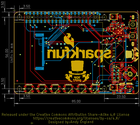
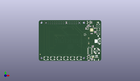
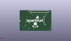
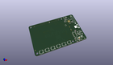

Contents
========

* [PROJ-SPAR-16653-STAN-01>Top pHat](#proj-spar-16653-stan-01top-phat)
	* [Images](#images)
	* [Interactive BOM](#interactive-bom)
	* [OOMP Parts](#oomp-parts)
	* [Tags](#tags)
  
![][im]
# PROJ-SPAR-16653-STAN-01>Top pHat

- ID: PROJ-SPAR-16653-STAN-01
- Hex ID: PRS16653
- Name: Top pHat
- Description: 

## Images
  
  

|eagleImage|kicadPcb3dFront|kicadPcb3dBack|kicadPcb3d|
| :---: | :---: | :---: | :---: |
|||||

## Interactive BOM

- Interactive BOM page: [ibom.html](kicad/bom/ibom.html)

## OOMP Parts
  

|OOMP Parts|
| :---: |
|CAPC-0603-X-UF22D-01, C1, 67.95, 7.55, 180,C1, 2.2uF, 0603, SparkFun-Capacitors, (67.95, 7.55), R180|
|CAPC-0603-X-UF22D-01, C2, 72.0, 52.77, 90,C2, 2.2uF, 0603, SparkFun-Capacitors, (72, 52.77), R90|
|<table><tr><td></td><td> C3</td><td>[CAPC-0603-X-NF100-V50 SMD (0603) 100 nF Capacitor (Ceramic) 50v](https://github.com/oomlout/oomlout_OOMP_parts/tree/main/CAPC-0603-X-NF100-V50/)</td><td>[C6N100](https://github.com/oomlout/oomlout_OOMP_parts/tree/main/CAPC-0603-X-NF100-V50/)</td></tr></table>|
|<table><tr><td></td><td> C4</td><td>[CAPC-0603-X-NF100-V50 SMD (0603) 100 nF Capacitor (Ceramic) 50v](https://github.com/oomlout/oomlout_OOMP_parts/tree/main/CAPC-0603-X-NF100-V50/)</td><td>[C6N100](https://github.com/oomlout/oomlout_OOMP_parts/tree/main/CAPC-0603-X-NF100-V50/)</td></tr></table>|
|<table><tr><td></td><td> C5</td><td>[CAPC-0603-X-NF100-V50 SMD (0603) 100 nF Capacitor (Ceramic) 50v](https://github.com/oomlout/oomlout_OOMP_parts/tree/main/CAPC-0603-X-NF100-V50/)</td><td>[C6N100](https://github.com/oomlout/oomlout_OOMP_parts/tree/main/CAPC-0603-X-NF100-V50/)</td></tr></table>|
|CAPC-0603-X-UNMATCHED-01, C6, 72.0, 37.5, 0,C6, 4.7uF, 0603, SparkFun-Capacitors, (72, 37.5), R0|
|CAPC-0603-X-UNMATCHED-01, C7, 76.0, 39.5, 90,C7, 4.7uF, 0603, SparkFun-Capacitors, (76, 39.5), R90|
|CAPC-0603-X-UNMATCHED-01, C8, 77.5, 39.5, 90,C8, 4.7uF, 0603, SparkFun-Capacitors, (77.5, 39.5), R90|
|CAPC-0603-X-UNMATCHED-01, C9, 74.0, 47.5, 270,C9, 4.7uF, 0603, SparkFun-Capacitors, (74, 47.5), R270|
|<table><tr><td></td><td> C10</td><td>[CAPC-0603-X-NF100-V50 SMD (0603) 100 nF Capacitor (Ceramic) 50v](https://github.com/oomlout/oomlout_OOMP_parts/tree/main/CAPC-0603-X-NF100-V50/)</td><td>[C6N100](https://github.com/oomlout/oomlout_OOMP_parts/tree/main/CAPC-0603-X-NF100-V50/)</td></tr></table>|
|<table><tr><td></td><td> C11</td><td>[CAPC-0603-X-NF100-V50 SMD (0603) 100 nF Capacitor (Ceramic) 50v](https://github.com/oomlout/oomlout_OOMP_parts/tree/main/CAPC-0603-X-NF100-V50/)</td><td>[C6N100](https://github.com/oomlout/oomlout_OOMP_parts/tree/main/CAPC-0603-X-NF100-V50/)</td></tr></table>|
|<table><tr><td></td><td> C12</td><td>[CAPC-0603-X-NF100-V50 SMD (0603) 100 nF Capacitor (Ceramic) 50v](https://github.com/oomlout/oomlout_OOMP_parts/tree/main/CAPC-0603-X-NF100-V50/)</td><td>[C6N100](https://github.com/oomlout/oomlout_OOMP_parts/tree/main/CAPC-0603-X-NF100-V50/)</td></tr></table>|
|CAPC-0603-X-UNMATCHED-01, C13, 64.0, 44.5, 270,C13, 10nF, 0603, SparkFun-Capacitors, (64, 44.5), R270|
|UNMATCHED-UNMATCHED-X-UNMATCHED-01, D1, 55.0, 3.5, 180,D1, WS2812B, WS2812B, SparkFun-LED, (55, 3.5), R180|
|UNMATCHED-UNMATCHED-X-UNMATCHED-01, D2, 46.0, 3.5, 180,D2, WS2812B, WS2812B, SparkFun-LED, (46, 3.5), R180|
|UNMATCHED-UNMATCHED-X-UNMATCHED-01, D3, 37.0, 3.5, 180,D3, WS2812B, WS2812B, SparkFun-LED, (37, 3.5), R180|
|UNMATCHED-UNMATCHED-X-UNMATCHED-01, D4, 28.0, 3.5, 180,D4, WS2812B, WS2812B, SparkFun-LED, (28, 3.5), R180|
|UNMATCHED-UNMATCHED-X-UNMATCHED-01, D5, 19.0, 3.5, 180,D5, WS2812B, WS2812B, SparkFun-LED, (19, 3.5), R180|
|UNMATCHED-UNMATCHED-X-UNMATCHED-01, D6, 10.0, 3.5, 180,D6, WS2812B, WS2812B, SparkFun-LED, (10, 3.5), R180|
|UNMATCHED-UNMATCHED-X-UNMATCHED-01, I2C, 73.5, 5.0, 180,I2C, JUMPER-SMT_3_2-NC_TRACE_NO-SILK, SMT-JUMPER_3_2-NC_TRACE_NO-SILK, SparkFun-Jumpers, (73.5, 5), R180|
|UNMATCHED-UNMATCHED-X-UNMATCHED-01, J1, 78.5, 5.0, 0,J1, QWIIC, JST04_1MM_RA, SparkFun-Connectors, (78.5, 5), R0|
|ERROR, J3 2.4 TFT, 0, 0, 0,J3, 2.4, TFT, FPC05040-17204, SparkFun-Displays, (19, 28.9), MR90|
|UNMATCHED-UNMATCHED-X-UNMATCHED-01, LS2, 68.0, 27.5, 180,LS2, CVS-1508, CVS-1508_PCBSPKR, SparkFun-Electromechanical, (68, 27.5), R180|
|UNMATCHED-UNMATCHED-X-UNMATCHED-01, Q2, 63.0, 36.0, 270,Q2, 1.1A/60V/600m?, SOT23-3, SparkFun-DiscreteSemi, (63, 36), R270|
|<table><tr><td></td><td> R1</td><td>[RESE-0603-X-O103-01 SMD (0603) 10k Ohm Resistor](https://github.com/oomlout/oomlout_OOMP_parts/tree/main/RESE-0603-X-O103-01/)</td><td>[R6103](https://github.com/oomlout/oomlout_OOMP_parts/tree/main/RESE-0603-X-O103-01/)</td></tr></table>|
|RESE-0603-X-UNMATCHED-01, R2, 72.5, 1.5, 180,R2, 4.7k, 0603, SparkFun-Resistors, (72.5, 1.5), R180|
|RESE-0603-X-UNMATCHED-01, R3, 72.5, 3.0, 180,R3, 4.7k, 0603, SparkFun-Resistors, (72.5, 3), R180|
|<table><tr><td></td><td> R4</td><td>[RESE-0603-X-O103-01 SMD (0603) 10k Ohm Resistor](https://github.com/oomlout/oomlout_OOMP_parts/tree/main/RESE-0603-X-O103-01/)</td><td>[R6103](https://github.com/oomlout/oomlout_OOMP_parts/tree/main/RESE-0603-X-O103-01/)</td></tr></table>|
|UNMATCHED-UNMATCHED-X-UNMATCHED-01, S3, 81.0, 39.5, 90,S3, MOMENTARY-SWITCH-SPST-SMD-5.2MM-TALL, TACTILE_SWITCH_SMD_5.2MM, SparkFun-Switches, (81, 39.5), R90|
|UNMATCHED-UNMATCHED-X-UNMATCHED-01, S4, 81.0, 47.5, 90,S4, MOMENTARY-SWITCH-SPST-SMD-5.2MM-TALL, TACTILE_SWITCH_SMD_5.2MM, SparkFun-Switches, (81, 47.5), R90|
|UNMATCHED-UNMATCHED-X-UNMATCHED-01, S6, 79.0, 13.5, 45,S6, Joystick, JOYSTICK_MINI, SparkFun-Switches, (79, 13.5), R45|
|ERROR, U1 Raspberry Pi, 0, 0, 0,U1, Raspberry, Pi, Header, RASPBERRY_PI_SHIELD_BOTTOM_ENTRY_NOHOLES, SparkFun-Connectors, (0, 57.25), MR180|
|UNMATCHED-UNMATCHED-X-UNMATCHED-01, U2, 67.0, 4.5, 270,U2, ADMP401, ADMP401, SparkFun-Sensors, (67, 4.5), R270|
|UNMATCHED-UNMATCHED-X-UNMATCHED-01, U3, 67.0, 52.77, 270,U3, ADMP401, ADMP401, SparkFun-Sensors, (67, 52.77), R270|
|UNMATCHED-UNMATCHED-X-UNMATCHED-01, U4, 72.0, 42.5, 270,U4, WM8960, QFN-32, SparkFun-IC-Special-Function, (72, 42.5), R270|
|UNMATCHED-UNMATCHED-X-UNMATCHED-01, U5, 69.5, 13.5, 270,U5, ATTINY84, SO14, SparkFun-IC-Microcontroller, (69.5, 13.5), R270|
|ERROR, Y1 24 MHz, 0, 0, 0,Y1, 24, MHz, RESONATOR-SMD-3.2X2.5, SparkFun-Clocks, (66.5, 44.5), R270|

## Tags

- hexID: PRS16653
- oompType: PROJ
- oompSize: SPAR
- oompColor: 16653
- oompDesc: STAN
- oompIndex: 01
- oompName: Top pHat
- sources: All source files from https://github.com/sparkfun/Top_pHat (source licence details in srcLicense.md)
- linkBuyPage: https://www.sparkfun.com/products/16653
- oompID: PROJ-SPAR-16653-STAN-01
- oompPart: CAPC-0603-X-UF22D-01, C1, 67.95, 7.55, 180
- oompPart: CAPC-0603-X-UF22D-01, C2, 72.0, 52.77, 90
- oompPart: CAPC-0603-X-NF100-V50, C3, 76.5, 45.0, 180
- oompPart: CAPC-0603-X-NF100-V50, C4, 70.0, 47.5, 180
- oompPart: CAPC-0603-X-NF100-V50, C5, 66.5, 47.5, 0
- oompPart: CAPC-0603-X-UNMATCHED-01, C6, 72.0, 37.5, 0
- oompPart: CAPC-0603-X-UNMATCHED-01, C7, 76.0, 39.5, 90
- oompPart: CAPC-0603-X-UNMATCHED-01, C8, 77.5, 39.5, 90
- oompPart: CAPC-0603-X-UNMATCHED-01, C9, 74.0, 47.5, 270
- oompPart: CAPC-0603-X-NF100-V50, C10, 68.0, 1.0, 180
- oompPart: CAPC-0603-X-NF100-V50, C11, 68.0, 49.32, 180
- oompPart: CAPC-0603-X-NF100-V50, C12, 73.5, 20.5, 0
- oompPart: CAPC-0603-X-UNMATCHED-01, C13, 64.0, 44.5, 270
- oompPart: UNMATCHED-UNMATCHED-X-UNMATCHED-01, D1, 55.0, 3.5, 180
- oompPart: UNMATCHED-UNMATCHED-X-UNMATCHED-01, D2, 46.0, 3.5, 180
- oompPart: UNMATCHED-UNMATCHED-X-UNMATCHED-01, D3, 37.0, 3.5, 180
- oompPart: UNMATCHED-UNMATCHED-X-UNMATCHED-01, D4, 28.0, 3.5, 180
- oompPart: UNMATCHED-UNMATCHED-X-UNMATCHED-01, D5, 19.0, 3.5, 180
- oompPart: UNMATCHED-UNMATCHED-X-UNMATCHED-01, D6, 10.0, 3.5, 180
- oompPart: SKIP-UNMATCHED-X-UNMATCHED-01, FD1, 2.0, 9.0, 0
- oompPart: SKIP-UNMATCHED-X-UNMATCHED-01, FD2, 2.0, 9.0, M0
- oompPart: SKIP-UNMATCHED-X-UNMATCHED-01, FD3, 79.46, 53.0, 0
- oompPart: SKIP-UNMATCHED-X-UNMATCHED-01, FD4, 79.46, 53.0, M0
- oompPart: UNMATCHED-UNMATCHED-X-UNMATCHED-01, I2C, 73.5, 5.0, 180
- oompPart: UNMATCHED-UNMATCHED-X-UNMATCHED-01, J1, 78.5, 5.0, 0
- oompPart: SKIP-UNMATCHED-X-UNMATCHED-01, J2, 69.5, 13.5, M270
- oompPart: ERROR, J3 2.4 TFT, 0, 0, 0
- oompPart: UNMATCHED-UNMATCHED-X-UNMATCHED-01, LS2, 68.0, 27.5, 180
- oompPart: UNMATCHED-UNMATCHED-X-UNMATCHED-01, Q2, 63.0, 36.0, 270
- oompPart: RESE-0603-X-O103-01, R1, 73.5, 19.0, 180
- oompPart: RESE-0603-X-UNMATCHED-01, R2, 72.5, 1.5, 180
- oompPart: RESE-0603-X-UNMATCHED-01, R3, 72.5, 3.0, 180
- oompPart: RESE-0603-X-O103-01, R4, 37.55, 52.5, 270
- oompPart: UNMATCHED-UNMATCHED-X-UNMATCHED-01, S3, 81.0, 39.5, 90
- oompPart: UNMATCHED-UNMATCHED-X-UNMATCHED-01, S4, 81.0, 47.5, 90
- oompPart: UNMATCHED-UNMATCHED-X-UNMATCHED-01, S6, 79.0, 13.5, 45
- oompPart: SKIP-UNMATCHED-X-UNMATCHED-01, TP1, 15.24, 45.72, M0
- oompPart: SKIP-UNMATCHED-X-UNMATCHED-01, TP2, 12.7, 45.72, M0
- oompPart: SKIP-UNMATCHED-X-UNMATCHED-01, TP3, 21.86, 38.1, M0
- oompPart: SKIP-UNMATCHED-X-UNMATCHED-01, TP4, 23.13, 31.75, M0
- oompPart: SKIP-UNMATCHED-X-UNMATCHED-01, TP5, 31.75, 34.29, M0
- oompPart: SKIP-UNMATCHED-X-UNMATCHED-01, TP6, 29.21, 34.29, M0
- oompPart: SKIP-UNMATCHED-X-UNMATCHED-01, TP7, 59.69, 7.62, M0
- oompPart: SKIP-UNMATCHED-X-UNMATCHED-01, TP8, 49.53, 43.18, M0
- oompPart: SKIP-UNMATCHED-X-UNMATCHED-01, TP9, 54.61, 46.99, M0
- oompPart: SKIP-UNMATCHED-X-UNMATCHED-01, TP10, 64.77, 38.1, M0
- oompPart: SKIP-UNMATCHED-X-UNMATCHED-01, TP11, 58.42, 54.61, M0
- oompPart: SKIP-UNMATCHED-X-UNMATCHED-01, TP12, 24.13, 44.45, M0
- oompPart: SKIP-UNMATCHED-X-UNMATCHED-01, TP13, 34.29, 34.29, M0
- oompPart: SKIP-UNMATCHED-X-UNMATCHED-01, TP14, 25.67, 31.75, M0
- oompPart: SKIP-UNMATCHED-X-UNMATCHED-01, TP15, 59.69, 19.05, M0
- oompPart: ERROR, U1 Raspberry Pi, 0, 0, 0
- oompPart: UNMATCHED-UNMATCHED-X-UNMATCHED-01, U2, 67.0, 4.5, 270
- oompPart: UNMATCHED-UNMATCHED-X-UNMATCHED-01, U3, 67.0, 52.77, 270
- oompPart: UNMATCHED-UNMATCHED-X-UNMATCHED-01, U4, 72.0, 42.5, 270
- oompPart: UNMATCHED-UNMATCHED-X-UNMATCHED-01, U5, 69.5, 13.5, 270
- oompPart: ERROR, Y1 24 MHz, 0, 0, 0
- rawPart: C1, 2.2uF, 0603, SparkFun-Capacitors, (67.95, 7.55), R180
- rawPart: C2, 2.2uF, 0603, SparkFun-Capacitors, (72, 52.77), R90
- rawPart: C3, 0.1uF, 0603, SparkFun-Capacitors, (76.5, 45), R180
- rawPart: C4, 0.1uF, 0603, SparkFun-Capacitors, (70, 47.5), R180
- rawPart: C5, 0.1uF, 0603, SparkFun-Capacitors, (66.5, 47.5), R0
- rawPart: C6, 4.7uF, 0603, SparkFun-Capacitors, (72, 37.5), R0
- rawPart: C7, 4.7uF, 0603, SparkFun-Capacitors, (76, 39.5), R90
- rawPart: C8, 4.7uF, 0603, SparkFun-Capacitors, (77.5, 39.5), R90
- rawPart: C9, 4.7uF, 0603, SparkFun-Capacitors, (74, 47.5), R270
- rawPart: C10, 0.1uF, 0603, SparkFun-Capacitors, (68, 1), R180
- rawPart: C11, 0.1uF, 0603, SparkFun-Capacitors, (68, 49.32), R180
- rawPart: C12, 0.1uF, 0603, SparkFun-Capacitors, (73.5, 20.5), R0
- rawPart: C13, 10nF, 0603, SparkFun-Capacitors, (64, 44.5), R270
- rawPart: D1, WS2812B, WS2812B, SparkFun-LED, (55, 3.5), R180
- rawPart: D2, WS2812B, WS2812B, SparkFun-LED, (46, 3.5), R180
- rawPart: D3, WS2812B, WS2812B, SparkFun-LED, (37, 3.5), R180
- rawPart: D4, WS2812B, WS2812B, SparkFun-LED, (28, 3.5), R180
- rawPart: D5, WS2812B, WS2812B, SparkFun-LED, (19, 3.5), R180
- rawPart: D6, WS2812B, WS2812B, SparkFun-LED, (10, 3.5), R180
- rawPart: FD1, FIDUCIAL1X2, FIDUCIAL-1X2, SparkFun-Aesthetics, (2, 9), R0
- rawPart: FD2, FIDUCIAL1X2, FIDUCIAL-1X2, SparkFun-Aesthetics, (2, 9), MR0
- rawPart: FD3, FIDUCIAL1X2, FIDUCIAL-1X2, SparkFun-Aesthetics, (79.46, 53), R0
- rawPart: FD4, FIDUCIAL1X2, FIDUCIAL-1X2, SparkFun-Aesthetics, (79.46, 53), MR0
- rawPart: I2C, JUMPER-SMT_3_2-NC_TRACE_NO-SILK, SMT-JUMPER_3_2-NC_TRACE_NO-SILK, SparkFun-Jumpers, (73.5, 5), R180
- rawPart: J1, QWIIC, JST04_1MM_RA, SparkFun-Connectors, (78.5, 5), R0
- rawPart: J2, AVR_SPI_PROG_3X2TESTPOINTS, 2X3_TEST_POINTS, SparkFun-Connectors, (69.5, 13.5), MR270
- rawPart: J3, 2.4, TFT, FPC05040-17204, SparkFun-Displays, (19, 28.9), MR90
- rawPart: LS2, CVS-1508, CVS-1508_PCBSPKR, SparkFun-Electromechanical, (68, 27.5), R180
- rawPart: Q2, 1.1A/60V/600m?, SOT23-3, SparkFun-DiscreteSemi, (63, 36), R270
- rawPart: R1, 10k, 0603, SparkFun-Resistors, (73.5, 19), R180
- rawPart: R2, 4.7k, 0603, SparkFun-Resistors, (72.5, 1.5), R180
- rawPart: R3, 4.7k, 0603, SparkFun-Resistors, (72.5, 3), R180
- rawPart: R4, 10k, 0603, SparkFun-Resistors, (37.55, 52.5), R270
- rawPart: S3, MOMENTARY-SWITCH-SPST-SMD-5.2MM-TALL, TACTILE_SWITCH_SMD_5.2MM, SparkFun-Switches, (81, 39.5), R90
- rawPart: S4, MOMENTARY-SWITCH-SPST-SMD-5.2MM-TALL, TACTILE_SWITCH_SMD_5.2MM, SparkFun-Switches, (81, 47.5), R90
- rawPart: S6, Joystick, JOYSTICK_MINI, SparkFun-Switches, (79, 13.5), R45
- rawPart: TP1, TEST-POINT3X5, PAD.03X.05, SparkFun-Connectors, (15.24, 45.72), MR0
- rawPart: TP2, TEST-POINT3X5, PAD.03X.05, SparkFun-Connectors, (12.7, 45.72), MR0
- rawPart: TP3, TEST-POINT3X5, PAD.03X.05, SparkFun-Connectors, (21.86, 38.1), MR0
- rawPart: TP4, TEST-POINT3X5, PAD.03X.05, SparkFun-Connectors, (23.13, 31.75), MR0
- rawPart: TP5, TEST-POINT3X5, PAD.03X.05, SparkFun-Connectors, (31.75, 34.29), MR0
- rawPart: TP6, TEST-POINT3X5, PAD.03X.05, SparkFun-Connectors, (29.21, 34.29), MR0
- rawPart: TP7, TEST-POINT3X5, PAD.03X.05, SparkFun-Connectors, (59.69, 7.62), MR0
- rawPart: TP8, TEST-POINT3X5, PAD.03X.05, SparkFun-Connectors, (49.53, 43.18), MR0
- rawPart: TP9, TEST-POINT3X5, PAD.03X.05, SparkFun-Connectors, (54.61, 46.99), MR0
- rawPart: TP10, TEST-POINT3X5, PAD.03X.05, SparkFun-Connectors, (64.77, 38.1), MR0
- rawPart: TP11, TEST-POINT3X5, PAD.03X.05, SparkFun-Connectors, (58.42, 54.61), MR0
- rawPart: TP12, TEST-POINT3X5, PAD.03X.05, SparkFun-Connectors, (24.13, 44.45), MR0
- rawPart: TP13, TEST-POINT3X5, PAD.03X.05, SparkFun-Connectors, (34.29, 34.29), MR0
- rawPart: TP14, TEST-POINT3X5, PAD.03X.05, SparkFun-Connectors, (25.67, 31.75), MR0
- rawPart: TP15, TEST-POINT3X5, PAD.03X.05, SparkFun-Connectors, (59.69, 19.05), MR0
- rawPart: U1, Raspberry, Pi, Header, RASPBERRY_PI_SHIELD_BOTTOM_ENTRY_NOHOLES, SparkFun-Connectors, (0, 57.25), MR180
- rawPart: U2, ADMP401, ADMP401, SparkFun-Sensors, (67, 4.5), R270
- rawPart: U3, ADMP401, ADMP401, SparkFun-Sensors, (67, 52.77), R270
- rawPart: U4, WM8960, QFN-32, SparkFun-IC-Special-Function, (72, 42.5), R270
- rawPart: U5, ATTINY84, SO14, SparkFun-IC-Microcontroller, (69.5, 13.5), R270
- rawPart: Y1, 24, MHz, RESONATOR-SMD-3.2X2.5, SparkFun-Clocks, (66.5, 44.5), R270

[im]: kicadPcb3d_450.png
