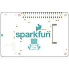
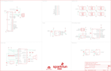

Contents
========

* [PRS16653 > Top pHat](#prs16653--top-phat)
	* [Schematic](#schematic)
	* [PCB](#pcb)
	* [Interactive BOM](#interactive-bom)
	* [Images](#images)
	* [Tags](#tags)
  
![][im]
# PRS16653 > Top pHat

- ID: PROJ-SPAR-16653-STAN-01
- Hex ID: PRS16653
- Name: Sparkfun
- Description: Sparkfun
- Long Link: [http://oom.lt/PROJ-SPAR-16653-STAN-01](http://oom.lt/PROJ-SPAR-16653-STAN-01)
- Short Link: [http://oom.lt/PRS16653](http://oom.lt/PRS16653)

## Schematic
  

## PCB
  

## Interactive BOM

- Interactive BOM page: [ibom.html](https://htmlpreview.github.io/?https://github.com/oomlout/oomlout_OOMP_projects/blob/main/PROJ-SPAR-16653-STAN-01/kicad/bom/ibom.html)

## Images
  
  

|bominteractivefront|bominteractiveback|kicadPcb3d|kicadPcb3dFront|kicadPcb3dBack|eagleImage|eagleSchemImage|
| :---: | :---: | :---: | :---: | :---: | :---: | :---: |
||||||||

## Tags

- hexID: PRS16653
- oompType: PROJ
- oompSize: SPAR
- oompColor: 16653
- oompDesc: STAN
- oompIndex: 01
- oompName: Top pHat
- sources: All source files from https://github.com/sparkfun/Top_pHat (source licence details in srcLicense.md)
- linkBuyPage: https://www.sparkfun.com/products/16653
- oompID: PROJ-SPAR-16653-STAN-01
- rawParts: C1,2.2uF,2.2UF-0603-10V-20%,0603,2.2µF ceramic capacitors,,CAP-07888,,,,2.2uF,
- rawParts: C2,2.2uF,2.2UF-0603-10V-20%,0603,2.2µF ceramic capacitors,,CAP-07888,,,,2.2uF,
- rawParts: C3,0.1uF,0.1UF-0603-25V-(+80/-20%),0603,0.1µF ceramic capacitors,,CAP-00810,,,,0.1uF,
- rawParts: C4,0.1uF,0.1UF-0603-25V-(+80/-20%),0603,0.1µF ceramic capacitors,,CAP-00810,,,,0.1uF,
- rawParts: C5,0.1uF,0.1UF-0603-25V-(+80/-20%),0603,0.1µF ceramic capacitors,,CAP-00810,,,,0.1uF,
- rawParts: C6,4.7uF,4.7UF-0603-6.3V-(10%),0603,4.7µF ceramic capacitors,,CAP-08280,,,,4.7uF,
- rawParts: C7,4.7uF,4.7UF-0603-6.3V-(10%),0603,4.7µF ceramic capacitors,,CAP-08280,,,,4.7uF,
- rawParts: C8,4.7uF,4.7UF-0603-6.3V-(10%),0603,4.7µF ceramic capacitors,,CAP-08280,,,,4.7uF,
- rawParts: C9,4.7uF,4.7UF-0603-6.3V-(10%),0603,4.7µF ceramic capacitors,,CAP-08280,,,,4.7uF,
- rawParts: C10,0.1uF,0.1UF-0603-25V-(+80/-20%),0603,0.1µF ceramic capacitors,,CAP-00810,,,,0.1uF,
- rawParts: C11,0.1uF,0.1UF-0603-25V-(+80/-20%),0603,0.1µF ceramic capacitors,,CAP-00810,,,,0.1uF,
- rawParts: C12,0.1uF,0.1UF-0603-25V-(+80/-20%),0603,0.1µF ceramic capacitors,,CAP-00810,,,,0.1uF,
- rawParts: C13,10nF,10NF-0603-50V-10%,0603,0.01uF/10nF/10,000pF ceramic capacitors,,CAP-00867,,,,10nF,
- rawParts: D1,WS2812B,WS2812B,WS2812B,WS2812B SMD addressable RGB LED,,DIO-12503,,,,WS2812B,
- rawParts: D2,WS2812B,WS2812B,WS2812B,WS2812B SMD addressable RGB LED,,DIO-12503,,,,WS2812B,
- rawParts: D3,WS2812B,WS2812B,WS2812B,WS2812B SMD addressable RGB LED,,DIO-12503,,,,WS2812B,
- rawParts: D4,WS2812B,WS2812B,WS2812B,WS2812B SMD addressable RGB LED,,DIO-12503,,,,WS2812B,
- rawParts: D5,WS2812B,WS2812B,WS2812B,WS2812B SMD addressable RGB LED,,DIO-12503,,,,WS2812B,
- rawParts: D6,WS2812B,WS2812B,WS2812B,WS2812B SMD addressable RGB LED,,DIO-12503,,,,WS2812B,
- rawParts: FD1,FIDUCIAL1X2,FIDUCIAL1X2,FIDUCIAL-1X2,Fiducial Alignment Points,,,,,,,
- rawParts: FD2,FIDUCIAL1X2,FIDUCIAL1X2,FIDUCIAL-1X2,Fiducial Alignment Points,,,,,,,
- rawParts: FD3,FIDUCIAL1X2,FIDUCIAL1X2,FIDUCIAL-1X2,Fiducial Alignment Points,,,,,,,
- rawParts: FD4,FIDUCIAL1X2,FIDUCIAL1X2,FIDUCIAL-1X2,Fiducial Alignment Points,,,,,,,
- rawParts: FRAME1,FRAME-LEDGER,FRAME-LEDGER,CREATIVE_COMMONS,Schematic Frame - Ledger,,,,,,,
- rawParts: H1,STAND-OFFTIGHT,STAND-OFFTIGHT,STAND-OFF-TIGHT,Stand Off,,,,,,,
- rawParts: H2,STAND-OFFTIGHT,STAND-OFFTIGHT,STAND-OFF-TIGHT,Stand Off,,,,,,,
- rawParts: H3,STAND-OFFTIGHT,STAND-OFFTIGHT,STAND-OFF-TIGHT,Stand Off,,,,,,,
- rawParts: H4,STAND-OFFTIGHT,STAND-OFFTIGHT,STAND-OFF-TIGHT,Stand Off,,,,,,,
- rawParts: I2C,JUMPER-SMT_3_2-NC_TRACE_NO-SILK,JUMPER-SMT_3_2-NC_TRACE_NO-SILK,SMT-JUMPER_3_2-NC_TRACE_NO-SILK,Normally closed trace jumper (2 of 2 connections),,,,,,,
- rawParts: J1,QWIIC,QWIIC_CONNECTORJS-1MM,JST04_1MM_RA,SparkFun I2C Standard Qwiic Connector,,CONN-13694,,,,QWIIC_RIGHT_ANGLE,
- rawParts: J2,AVR_SPI_PROG_3X2TESTPOINTS,AVR_SPI_PROG_3X2TESTPOINTS,2X3_TEST_POINTS,AVR ISP 6 Pin,,,,,,,
- rawParts: J3,2.4 TFT,4DLCD-24-320X240,FPC05040-17204,4D LCD 4DLCD-24320240-IPS - 2.4 240x320 TFT LCD,,LCD-14913,CONN-14082,,,2.4 TFT,
- rawParts: LOGO2,SFE_LOGO_NAME_FLAME.4_INCH,SFE_LOGO_NAME_FLAME.4_INCH,SFE_LOGO_NAME_FLAME_.4,SparkFun Font Logo w/ Flame,,,,,,,
- rawParts: LOGO3,QWIIC_LOGO_4MM,QWIIC_LOGO_4MM,QWIIC_4MM,Qwiic Logos for placement on schematic and PCB. The 5.5mm silk logo is best for placing next to Qwiic connector.,,,,,,,
- rawParts: LOGO4,OSHW-LOGOS,OSHW-LOGOS,OSHW-LOGO-S,Open-Source Hardware (OSHW) Logo,,,,,,,
- rawParts: LS2,CVS-1508,SPEAKERCVS-1508,CVS-1508_PCBSPKR,Speaker,,COM-14823,,,,CVS-1508,
- rawParts: Q2,1.1A/60V/600mΩ,MOSFET_PCH-SI2309DS,SOT23-3,P-channel MOSFETs,,TRANS-08285,,,,1.1A/60V/600mΩ,
- rawParts: R1,10k,10KOHM-0603-1/10W-1%,0603,10kΩ resistor,,RES-00824,,,,10k,
- rawParts: R2,4.7k,4.7KOHM-0603-1/10W-1%,0603,4.7kΩ resistor,,RES-07857,,,,4.7k,
- rawParts: R3,4.7k,4.7KOHM-0603-1/10W-1%,0603,4.7kΩ resistor,,RES-07857,,,,4.7k,
- rawParts: R4,10k,10KOHM-0603-1/10W-1%,0603,10kΩ resistor,,RES-00824,,,,10k,
- rawParts: S3,MOMENTARY-SWITCH-SPST-SMD-5.2MM-TALL,MOMENTARY-SWITCH-SPST-SMD-5.2MM-TALL,TACTILE_SWITCH_SMD_5.2MM,Momentary Switch (Pushbutton) - SPST,,SWCH-14139,,,,,
- rawParts: S4,MOMENTARY-SWITCH-SPST-SMD-5.2MM-TALL,MOMENTARY-SWITCH-SPST-SMD-5.2MM-TALL,TACTILE_SWITCH_SMD_5.2MM,Momentary Switch (Pushbutton) - SPST,,SWCH-14139,,,,,
- rawParts: S6,Joystick,JOYSTICK_MINI,JOYSTICK_MINI,Small Tactile Joystick w/ Select Switch,,SWCH-09905,,,COM-10063,Joystick,
- rawParts: TP1,TEST-POINT3X5,TEST-POINT3X5,PAD.03X.05,SparkFun Test Points,,,,,,,
- rawParts: TP2,TEST-POINT3X5,TEST-POINT3X5,PAD.03X.05,SparkFun Test Points,,,,,,,
- rawParts: TP3,TEST-POINT3X5,TEST-POINT3X5,PAD.03X.05,SparkFun Test Points,,,,,,,
- rawParts: TP4,TEST-POINT3X5,TEST-POINT3X5,PAD.03X.05,SparkFun Test Points,,,,,,,
- rawParts: TP5,TEST-POINT3X5,TEST-POINT3X5,PAD.03X.05,SparkFun Test Points,,,,,,,
- rawParts: TP6,TEST-POINT3X5,TEST-POINT3X5,PAD.03X.05,SparkFun Test Points,,,,,,,
- rawParts: TP7,TEST-POINT3X5,TEST-POINT3X5,PAD.03X.05,SparkFun Test Points,,,,,,,
- rawParts: TP8,TEST-POINT3X5,TEST-POINT3X5,PAD.03X.05,SparkFun Test Points,,,,,,,
- rawParts: TP9,TEST-POINT3X5,TEST-POINT3X5,PAD.03X.05,SparkFun Test Points,,,,,,,
- rawParts: TP10,TEST-POINT3X5,TEST-POINT3X5,PAD.03X.05,SparkFun Test Points,,,,,,,
- rawParts: TP11,TEST-POINT3X5,TEST-POINT3X5,PAD.03X.05,SparkFun Test Points,,,,,,,
- rawParts: TP12,TEST-POINT3X5,TEST-POINT3X5,PAD.03X.05,SparkFun Test Points,,,,,,,
- rawParts: TP13,TEST-POINT3X5,TEST-POINT3X5,PAD.03X.05,SparkFun Test Points,,,,,,,
- rawParts: TP14,TEST-POINT3X5,TEST-POINT3X5,PAD.03X.05,SparkFun Test Points,,,,,,,
- rawParts: TP15,TEST-POINT3X5,TEST-POINT3X5,PAD.03X.05,SparkFun Test Points,,,,,,,
- rawParts: U1,Raspberry Pi Header,RASPBERRY_PI_40BTM-NOHOLES,RASPBERRY_PI_SHIELD_BOTTOM_ENTRY_NOHOLES,,,CONN-13790,,,,Raspberry Pi Header,
- rawParts: U2,ADMP401,ADMP401,ADMP401,ADMP401 - Omnidirection Bottom-Port MEMS Microphone,,IC-09773,,,,,
- rawParts: U3,ADMP401,ADMP401,ADMP401,ADMP401 - Omnidirection Bottom-Port MEMS Microphone,,IC-09773,,,,,
- rawParts: U4,WM8960,WM8960,QFN-32,Cirrus Logic WM890 - Stereo Audio CODEC,,IC-14824,,,,WM8960,
- rawParts: U5,ATTINY84,ATTINY84,SO14,Atmel 14-pin 2/4/8kB flash uC,,IC-11285,,,,ATTINY84,
- rawParts: Y1,24 MHz,OSCILLATOR-24MHZ,RESONATOR-SMD-3.2X2.5,Abracon 24 MHZ Oscillator,,XTAL-14907,,,,24 MHz,

[im]: kicadPcb3d_450.png
