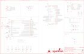

Contents
========

* [PRS16781 > MicroMod ESP32 Processor](#prs16781--micromod-esp32-processor)
	* [Schematic](#schematic)
	* [PCB](#pcb)
	* [Interactive BOM](#interactive-bom)
	* [Images](#images)
	* [Tags](#tags)
  
![][im]
# PRS16781 > MicroMod ESP32 Processor

- ID: PROJ-SPAR-16781-STAN-01
- Hex ID: PRS16781
- Name: Sparkfun
- Description: Sparkfun
- Long Link: [http://oom.lt/PROJ-SPAR-16781-STAN-01](http://oom.lt/PROJ-SPAR-16781-STAN-01)
- Short Link: [http://oom.lt/PRS16781](http://oom.lt/PRS16781)

## Schematic
  

## PCB
  

## Interactive BOM

- Interactive BOM page: [ibom.html](https://htmlpreview.github.io/?https://github.com/oomlout/oomlout_OOMP_projects/blob/main/PROJ-SPAR-16781-STAN-01/kicad/bom/ibom.html)

## Images
  
  

|bominteractivefront|bominteractiveback|kicadPcb3d|kicadPcb3dFront|kicadPcb3dBack|eagleImage|eagleSchemImage|pcbdraw|pcbdrawback|
| :---: | :---: | :---: | :---: | :---: | :---: | :---: | :---: | :---: |
||||||||||

## Tags

- hexID: PRS16781
- oompType: PROJ
- oompSize: SPAR
- oompColor: 16781
- oompDesc: STAN
- oompIndex: 01
- oompName: MicroMod ESP32 Processor
- sources: All source files from https://github.com/sparkfun/MicroMod_ESP32_Processor (source licence details in srcLicense.md)
- linkBuyPage: https://www.sparkfun.com/products/16781
- oompID: PROJ-SPAR-16781-STAN-01
- rawParts: A1,,ANTENNA2.4GHZ-8.0X1.0MM,ANT-2.4GHZ-8.0X1.0MM,Single-ended Antennae,,ANT-14377,,,
- rawParts: C1,270pF,270PF-0402T-50V-5%,0402-TIGHT,270pF/0.27nF ceramic capacitors,,CAP-15129,,270pF,
- rawParts: C2,270pF,270PF-0402T-50V-5%,0402-TIGHT,270pF/0.27nF ceramic capacitors,,CAP-15129,,270pF,
- rawParts: C3,12pF,12PF-0402T-50V-5%,0402-TIGHT,12pF ceramic capacitors,,CAP-14665,,12pF,
- rawParts: C4,12pF,12PF-0402T-50V-5%,0402-TIGHT,12pF ceramic capacitors,,CAP-14665,,12pF,
- rawParts: C5,10nF,10NF-0402T-25V-10%,0402-TIGHT,0.01uF/10nF/10,000pF ceramic capacitors,,CAP-14847,,10nF,
- rawParts: C6,0.1uF,0.1UF-0402T-16V-10%,0402-TIGHT,0.1µF ceramic capacitors,,CAP-12416,,0.1uF,
- rawParts: C7,4.7uF,4.7UF-0402_TIGHT-6.3V-20%-X5R,0402-TIGHT,4.7µF ceramic capacitors,,CAP-14240,,4.7uF,
- rawParts: C8,DNP,CAP-0402-TIGHT,0402-TIGHT,,,,,,
- rawParts: C9,15pF,15PF-0402T-50V-5%,0402-TIGHT,15pF ceramic capacitors,,CAP-13063,,15pF,
- rawParts: C10,DNP,CAP-0402-TIGHT,0402-TIGHT,,,,,,
- rawParts: C17,0.1uF,0.1UF-0402T-16V-10%,0402-TIGHT,0.1µF ceramic capacitors,,CAP-12416,,0.1uF,
- rawParts: C18,100pF,100PF-0402T-50V-5%,0402-TIGHT,100pF/0.1nF ceramic capacitors,,CAP-13458,,100pF,
- rawParts: C20,0.1uF,0.1UF-0402T-16V-10%,0402-TIGHT,0.1µF ceramic capacitors,,CAP-12416,,0.1uF,
- rawParts: C21,0.1uF,0.1UF-0402T-16V-10%,0402-TIGHT,0.1µF ceramic capacitors,,CAP-12416,,0.1uF,
- rawParts: C22,10uF,10UF-0402T-6.3V-20%,0402-TIGHT,10.0µF ceramic capacitors,,CAP-14848,,10uF,
- rawParts: C23,0.1uF,0.1UF-0402T-16V-10%,0402-TIGHT,0.1µF ceramic capacitors,,CAP-12416,,0.1uF,
- rawParts: C24,1.0uF,1.0UF-0402T-16V-10%,0402-TIGHT,1µF ceramic capacitors,,CAP-12417,,1.0uF,
- rawParts: C25,0.1uF,0.1UF-0402T-16V-10%,0402-TIGHT,0.1µF ceramic capacitors,,CAP-12416,,0.1uF,
- rawParts: C26,15pF,15PF-0402T-50V-5%,0402-TIGHT,15pF ceramic capacitors,,CAP-13063,,15pF,
- rawParts: C27,3.0nF,3.0NF-0402T-50V-5%,0402-TIGHT,3.0nF (3nF, 3000pF) ceramic capacitors,,CAP-15130,,3.0nF,
- rawParts: D4,BLUE,LED-BLUE0603,LED-0603,Blue SMD LED,,DIO-08575,,BLUE,
- rawParts: FD1,FIDUCIALUFIDUCIAL,FIDUCIALUFIDUCIAL,FIDUCIAL-MICRO,Fiducial Alignment Points,,,,,
- rawParts: FD2,FIDUCIALUFIDUCIAL,FIDUCIALUFIDUCIAL,FIDUCIAL-MICRO,Fiducial Alignment Points,,,,,
- rawParts: FD3,FIDUCIALUFIDUCIAL,FIDUCIALUFIDUCIAL,FIDUCIAL-MICRO,Fiducial Alignment Points,,,,,
- rawParts: FD4,FIDUCIALUFIDUCIAL,FIDUCIALUFIDUCIAL,FIDUCIAL-MICRO,Fiducial Alignment Points,,,,,
- rawParts: FRAME1,FRAME-LEDGER,FRAME-LEDGER,CREATIVE_COMMONS,Schematic Frame - Ledger,,,,,
- rawParts: J1,MICROMOD-2222,MICROMOD-2222,M.2-CARD-E-22,MicroMod Connector,,,,,
- rawParts: L1,0,0OHM-0402T-1/10W,0402-TIGHT,0Ω resistor,,RES-14244,,0,
- rawParts: LOGO1,SPECIAL_INSTRUCTIONS-ORDERING,SPECIAL_INSTRUCTIONS-ORDERING,ORDERING_INSTRUCTIONS,Special Ordering/Production Instructions Alert,,,,,
- rawParts: LOGO2,SFE_LOGO_NAME_FLAME.1_INCH,SFE_LOGO_NAME_FLAME.1_INCH,SFE_LOGO_NAME_FLAME_.1,SparkFun Font Logo w/ Flame,,,,,
- rawParts: LOGO3,OSHW-LOGOS,OSHW-LOGOS,OSHW-LOGO-S,Open-Source Hardware (OSHW) Logo,,,,,
- rawParts: Q2,MBT3904DW1T1,TRANS_NPN_DUAL-MBT3904DW1T1,SC70-6,Dual NPN Transistors in Single Package,,TRANS-13337,,,
- rawParts: R1,10k,10KOHM-0402T-1/16W-1%,0402-TIGHT,10kΩ resistor,,RES-14241,,10k,
- rawParts: R2,20k,20KOHM-0402T-1/16W-1%,0402-TIGHT,20kΩ resistor,,RES-15131,,20k,
- rawParts: R3,22k,22KOHM-0402_TIGHT-1/10W-1%,0402-TIGHT,22kΩ resistor,,RES-14281,,22k,
- rawParts: R4,33k,33KOHM-0402T-1/16W-1%,0402-TIGHT,33kΩ resistor,,RES-15128,,33k,
- rawParts: R5,2.2k,2.2KOHM-0402T-1/16W-1%,0402-TIGHT,2.2kΩ resistor,,RES-14341,,2.2k,
- rawParts: R8,1k,1KOHM-0402T-1/16W-1%,0402-TIGHT,1kΩ resistor,,RES-14342,,1k,
- rawParts: R9,10k,10KOHM-0402T-1/16W-1%,0402-TIGHT,10kΩ resistor,,RES-14241,,10k,
- rawParts: R17,10k,10KOHM-0402T-1/16W-1%,0402-TIGHT,10kΩ resistor,,RES-14241,,10k,
- rawParts: R18,10k,10KOHM-0402T-1/16W-1%,0402-TIGHT,10kΩ resistor,,RES-14241,,10k,
- rawParts: U1,W25QXX128MBIT-6X5,W25QXX128MBIT-6X5,WSON-8-6X5,,,IC-15107,,,
- rawParts: U2,ESP32,ESP32,QFN48-0.4MM,Espressif ESP32,,IC-13338,,,
- rawParts: U4,CP210X,CP2102N,QFN24,,,IC-14020,,,
- rawParts: Y1,40MHz,CRYSTAL-40MHZ-SMD-2X2.5MM,CRYSTAL-SMD-2X2.5MM,40MHz Crystal w/ Ground Pin,,XTAL-15127,,40MHZ,
- rawParts: Y2,32.768kHz,CRYSTAL-32.768KHZSMD-3.2X1.5,CRYSTAL-SMD-3.2X1.5MM,32.768kHz Crystal,,XTAL-13062,,32.768kHz,

[im]: kicadPcb3d_450.png
