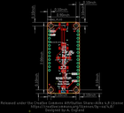
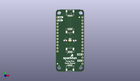
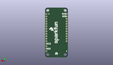
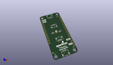

Contents
========

* [PROJ-SPAR-16790-STAN-01>Qwiic Shield for Thing Plus](#proj-spar-16790-stan-01qwiic-shield-for-thing-plus)
	* [Images](#images)
	* [Interactive BOM](#interactive-bom)
	* [OOMP Parts](#oomp-parts)
	* [Tags](#tags)
  
![][im]
# PROJ-SPAR-16790-STAN-01>Qwiic Shield for Thing Plus

- ID: PROJ-SPAR-16790-STAN-01
- Hex ID: PRS16790
- Name: Qwiic Shield for Thing Plus
- Description: 

## Images
  
  

|eagleImage|kicadPcb3dFront|kicadPcb3dBack|kicadPcb3d|
| :---: | :---: | :---: | :---: |
|||||

## Interactive BOM

- Interactive BOM page: [ibom.html](kicad/bom/ibom.html)

## OOMP Parts
  

|OOMP Parts|
| :---: |
|UNMATCHED-UNMATCHED-X-UNMATCHED-01, FD1, 1.27, 6.35, 0,FD1, FIDUCIAL1X2, FIDUCIAL-1X2, SparkFun-Aesthetics, (0.05, 0.25), R0|
|UNMATCHED-UNMATCHED-X-UNMATCHED-01, FD2, 1.27, 6.35, M0,FD2, FIDUCIAL1X2, FIDUCIAL-1X2, SparkFun-Aesthetics, (0.05, 0.25), MR0|
|UNMATCHED-UNMATCHED-X-UNMATCHED-01, FD3, 19.049999999999997, 44.449999999999996, 0,FD3, FIDUCIAL1X2, FIDUCIAL-1X2, SparkFun-Aesthetics, (0.75, 1.75), R0|
|UNMATCHED-UNMATCHED-X-UNMATCHED-01, FD4, 19.049999999999997, 44.449999999999996, M0,FD4, FIDUCIAL1X2, FIDUCIAL-1X2, SparkFun-Aesthetics, (0.75, 1.75), MR0|
|UNMATCHED-UNMATCHED-X-UNMATCHED-01, I2C, 11.43, 25.4, 0,I2C, JUMPER-SMT_3_NO_NO-SILK, SMT-JUMPER_3_NO_NO-SILK, SparkFun-Jumpers, (0.45, 1), R0|
|UNMATCHED-UNMATCHED-X-UNMATCHED-01, J1, 11.43, 5.08, 0,J1, QWIIC_RIGHT_ANGLE, JST04_1MM_RA, SparkFun-Connectors, (0.45, 0.2), R0|
|UNMATCHED-UNMATCHED-X-UNMATCHED-01, J2, 11.43, 45.72, 180,J2, QWIIC_RIGHT_ANGLE, JST04_1MM_RA, SparkFun-Connectors, (0.45, 1.8), R180|
|ERROR, J3 Vertical Qwiic, 0, 0, 0,J3, Vertical, Qwiic, Connector, JST04_1MM_VERT, SparkFun-Connectors, (0.45, 1.4), R180|
|ERROR, J4 Vertical Qwiic, 0, 0, 0,J4, Vertical, Qwiic, Connector, JST04_1MM_VERT, SparkFun-Connectors, (0.45, 0.6), R0|
|UNMATCHED-UNMATCHED-X-UNMATCHED-01, J5, 11.43, 25.4, 0,J5, THING_PLUS, THING_PLUS, SparkFun-Boards, (0.45, 1), R0|
|RESE-0603-X-UNMATCHED-01, R1, 7.619999999999999, 25.4, 0,R1, 4.7k, 0603, SparkFun-Resistors, (0.3, 1), R0|
|RESE-0603-X-UNMATCHED-01, R2, 15.239999999999998, 25.4, 180,R2, 4.7k, 0603, SparkFun-Resistors, (0.6, 1), R180|

## Tags

- hexID: PRS16790
- oompType: PROJ
- oompSize: SPAR
- oompColor: 16790
- oompDesc: STAN
- oompIndex: 01
- oompName: Qwiic Shield for Thing Plus
- sources: All source files from https://github.com/sparkfun/Qwiic_Shield_for_Thing_Plus (source licence details in srcLicense.md)
- linkBuyPage: https://www.sparkfun.com/products/16790
- oompPart: UNMATCHED-UNMATCHED-X-UNMATCHED-01, FD1, 1.27, 6.35, 0
- oompPart: UNMATCHED-UNMATCHED-X-UNMATCHED-01, FD2, 1.27, 6.35, M0
- oompPart: UNMATCHED-UNMATCHED-X-UNMATCHED-01, FD3, 19.049999999999997, 44.449999999999996, 0
- oompPart: UNMATCHED-UNMATCHED-X-UNMATCHED-01, FD4, 19.049999999999997, 44.449999999999996, M0
- oompPart: UNMATCHED-UNMATCHED-X-UNMATCHED-01, I2C, 11.43, 25.4, 0
- oompPart: UNMATCHED-UNMATCHED-X-UNMATCHED-01, J1, 11.43, 5.08, 0
- oompPart: UNMATCHED-UNMATCHED-X-UNMATCHED-01, J2, 11.43, 45.72, 180
- oompPart: ERROR, J3 Vertical Qwiic, 0, 0, 0
- oompPart: ERROR, J4 Vertical Qwiic, 0, 0, 0
- oompPart: UNMATCHED-UNMATCHED-X-UNMATCHED-01, J5, 11.43, 25.4, 0
- oompPart: RESE-0603-X-UNMATCHED-01, R1, 7.619999999999999, 25.4, 0
- oompPart: RESE-0603-X-UNMATCHED-01, R2, 15.239999999999998, 25.4, 180
- rawPart: FD1, FIDUCIAL1X2, FIDUCIAL-1X2, SparkFun-Aesthetics, (0.05, 0.25), R0
- rawPart: FD2, FIDUCIAL1X2, FIDUCIAL-1X2, SparkFun-Aesthetics, (0.05, 0.25), MR0
- rawPart: FD3, FIDUCIAL1X2, FIDUCIAL-1X2, SparkFun-Aesthetics, (0.75, 1.75), R0
- rawPart: FD4, FIDUCIAL1X2, FIDUCIAL-1X2, SparkFun-Aesthetics, (0.75, 1.75), MR0
- rawPart: I2C, JUMPER-SMT_3_NO_NO-SILK, SMT-JUMPER_3_NO_NO-SILK, SparkFun-Jumpers, (0.45, 1), R0
- rawPart: J1, QWIIC_RIGHT_ANGLE, JST04_1MM_RA, SparkFun-Connectors, (0.45, 0.2), R0
- rawPart: J2, QWIIC_RIGHT_ANGLE, JST04_1MM_RA, SparkFun-Connectors, (0.45, 1.8), R180
- rawPart: J3, Vertical, Qwiic, Connector, JST04_1MM_VERT, SparkFun-Connectors, (0.45, 1.4), R180
- rawPart: J4, Vertical, Qwiic, Connector, JST04_1MM_VERT, SparkFun-Connectors, (0.45, 0.6), R0
- rawPart: J5, THING_PLUS, THING_PLUS, SparkFun-Boards, (0.45, 1), R0
- rawPart: R1, 4.7k, 0603, SparkFun-Resistors, (0.3, 1), R0
- rawPart: R2, 4.7k, 0603, SparkFun-Resistors, (0.6, 1), R180

[im]: kicadPcb3d_450.png
