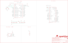

Contents
========

* [PRS16791 > MicroMod Processor Board-SAMD51](#prs16791--micromod-processor-board-samd51)
	* [Schematic](#schematic)
	* [PCB](#pcb)
	* [Interactive BOM](#interactive-bom)
	* [OOMP Parts](#oomp-parts)
	* [Images](#images)
	* [Tags](#tags)
  
![][im]
# PRS16791 > MicroMod Processor Board-SAMD51

- ID: PROJ-SPAR-16791-STAN-01
- Hex ID: PRS16791
- Name: Sparkfun
- Description: Sparkfun
- Long Link: [http://oom.lt/PROJ-SPAR-16791-STAN-01](http://oom.lt/PROJ-SPAR-16791-STAN-01)
- Short Link: [http://oom.lt/PRS16791](http://oom.lt/PRS16791)

## Schematic
  

## PCB
  

## Interactive BOM

- Interactive BOM page: [ibom.html](https://htmlpreview.github.io/?https://github.com/oomlout/oomlout_OOMP_projects/blob/main/PROJ-SPAR-16791-STAN-01/kicad/bom/ibom.html)

## OOMP Parts
  

|OOMP ID|Name|Identifier|
| :---: | :---: | :---: |
|[CAPC-0402-X-PF15-V50](https://github.com/oomlout/oomlout_OOMP_parts/tree/main/CAPC-0402-X-PF15-V50/)|[SMD (0402) 15 pF Capacitor (Ceramic) 50v](https://github.com/oomlout/oomlout_OOMP_parts/tree/main/CAPC-0402-X-PF15-V50/)|[C1, C2](https://github.com/oomlout/oomlout_OOMP_parts/tree/main/CAPC-0402-X-PF15-V50/)|
|[CAPC-0402-X-NF100-V10](https://github.com/oomlout/oomlout_OOMP_parts/tree/main/CAPC-0402-X-NF100-V10/)|[SMD (0402) 100 nF Capacitor (Ceramic) 10v](https://github.com/oomlout/oomlout_OOMP_parts/tree/main/CAPC-0402-X-NF100-V10/)|[C3, C5, C6, C7, C9, C10](https://github.com/oomlout/oomlout_OOMP_parts/tree/main/CAPC-0402-X-NF100-V10/)|
|[CAPC-0402-X-UF10-V63D](https://github.com/oomlout/oomlout_OOMP_parts/tree/main/CAPC-0402-X-UF10-V63D/)|[SMD (0402) 10 uF Capacitor (Ceramic) 6.3v](https://github.com/oomlout/oomlout_OOMP_parts/tree/main/CAPC-0402-X-UF10-V63D/)|[C4, C8](https://github.com/oomlout/oomlout_OOMP_parts/tree/main/CAPC-0402-X-UF10-V63D/)|
|[CAPC-0402-X-UF47D-V63D](https://github.com/oomlout/oomlout_OOMP_parts/tree/main/CAPC-0402-X-UF47D-V63D/)|[SMD (0402) 4.7 uF Capacitor (Ceramic) 6.3v](https://github.com/oomlout/oomlout_OOMP_parts/tree/main/CAPC-0402-X-UF47D-V63D/)|[C11](https://github.com/oomlout/oomlout_OOMP_parts/tree/main/CAPC-0402-X-UF47D-V63D/)|
|[LEDS-0603-L-STAN-01](https://github.com/oomlout/oomlout_OOMP_parts/tree/main/LEDS-0603-L-STAN-01/)|[SMD (0603) Blue LED](https://github.com/oomlout/oomlout_OOMP_parts/tree/main/LEDS-0603-L-STAN-01/)|[D1](https://github.com/oomlout/oomlout_OOMP_parts/tree/main/LEDS-0603-L-STAN-01/)|
|DIOD-S323-X-UNMATCHED-01||D3|
|UNMATCHED-UNMATCHED-X-UNMATCHED-01||J2, LOGO5, U1, U2, Y1|
|UNMATCHED-0402-X-UNMATCHED-01||L1|
|[RESE-0402-X-O103-01](https://github.com/oomlout/oomlout_OOMP_parts/tree/main/RESE-0402-X-O103-01/)|[SMD (0402) 10k Ohm Resistor](https://github.com/oomlout/oomlout_OOMP_parts/tree/main/RESE-0402-X-O103-01/)|[R1](https://github.com/oomlout/oomlout_OOMP_parts/tree/main/RESE-0402-X-O103-01/)|
|[RESE-0402-X-O102-01](https://github.com/oomlout/oomlout_OOMP_parts/tree/main/RESE-0402-X-O102-01/)|[SMD (0402) 1k Ohm Resistor](https://github.com/oomlout/oomlout_OOMP_parts/tree/main/RESE-0402-X-O102-01/)|[R2, R3](https://github.com/oomlout/oomlout_OOMP_parts/tree/main/RESE-0402-X-O102-01/)|
|RESE-0402-X-O1003-01||R4|

## Images
  
  

|bominteractivefront|bominteractiveback|kicadPcb3d|kicadPcb3dFront|kicadPcb3dBack|eagleImage|eagleSchemImage|pcbdraw|pcbdrawback|
| :---: | :---: | :---: | :---: | :---: | :---: | :---: | :---: | :---: |
||||||||||

## Tags

- hexID: PRS16791
- oompType: PROJ
- oompSize: SPAR
- oompColor: 16791
- oompDesc: STAN
- oompIndex: 01
- oompName: MicroMod Processor Board-SAMD51
- sources: All source files from https://github.com/sparkfun/MicroMod_Processor_Board-SAMD51 (source licence details in srcLicense.md)
- linkBuyPage: https://www.sparkfun.com/products/16791
- oompID: PROJ-SPAR-16791-STAN-01
- oompParts: C1,CAPC-0402-X-PF15-V50
- oompParts: C2,CAPC-0402-X-PF15-V50
- oompParts: C3,CAPC-0402-X-NF100-V10
- oompParts: C4,CAPC-0402-X-UF10-V63D
- oompParts: C5,CAPC-0402-X-NF100-V10
- oompParts: C6,CAPC-0402-X-NF100-V10
- oompParts: C7,CAPC-0402-X-NF100-V10
- oompParts: C8,CAPC-0402-X-UF10-V63D
- oompParts: C9,CAPC-0402-X-NF100-V10
- oompParts: C10,CAPC-0402-X-NF100-V10
- oompParts: C11,CAPC-0402-X-UF47D-V63D
- oompParts: D1,LEDS-0603-L-STAN-01
- oompParts: D3,DIOD-S323-X-UNMATCHED-01
- oompParts: J2,UNMATCHED-UNMATCHED-X-UNMATCHED-01
- oompParts: L1,UNMATCHED-0402-X-UNMATCHED-01
- oompParts: LOGO5,UNMATCHED-UNMATCHED-X-UNMATCHED-01
- oompParts: R1,RESE-0402-X-O103-01
- oompParts: R2,RESE-0402-X-O102-01
- oompParts: R3,RESE-0402-X-O102-01
- oompParts: R4,RESE-0402-X-O1003-01
- oompParts: U1,UNMATCHED-UNMATCHED-X-UNMATCHED-01
- oompParts: U2,UNMATCHED-UNMATCHED-X-UNMATCHED-01
- oompParts: Y1,UNMATCHED-UNMATCHED-X-UNMATCHED-01
- rawParts: C1,15pF,15PF-0402T-50V-5%,0402-TIGHT,15pF ceramic capacitors,,CAP-13063,,15pF,
- rawParts: C2,15pF,15PF-0402T-50V-5%,0402-TIGHT,15pF ceramic capacitors,,CAP-13063,,15pF,
- rawParts: C3,0.1uF,0.1UF-0402T-10V-10%-X7R,0402-TIGHT,0.1µF ceramic capacitors,,CAP-15083,,0.1uF,
- rawParts: C4,10uF,10UF-0402T-6.3V-20%,0402-TIGHT,10.0µF ceramic capacitors,,CAP-14848,,10uF,
- rawParts: C5,0.1uF,0.1UF-0402T-10V-10%-X7R,0402-TIGHT,0.1µF ceramic capacitors,,CAP-15083,,0.1uF,
- rawParts: C6,0.1uF,0.1UF-0402T-10V-10%-X7R,0402-TIGHT,0.1µF ceramic capacitors,,CAP-15083,,0.1uF,
- rawParts: C7,0.1uF,0.1UF-0402T-10V-10%-X7R,0402-TIGHT,0.1µF ceramic capacitors,,CAP-15083,,0.1uF,
- rawParts: C8,10uF,10UF-0402T-6.3V-20%,0402-TIGHT,10.0µF ceramic capacitors,,CAP-14848,,10uF,
- rawParts: C9,0.1uF,0.1UF-0402T-10V-10%-X7R,0402-TIGHT,0.1µF ceramic capacitors,,CAP-15083,,0.1uF,
- rawParts: C10,0.1uF,0.1UF-0402T-10V-10%-X7R,0402-TIGHT,0.1µF ceramic capacitors,,CAP-15083,,0.1uF,
- rawParts: C11,4.7uF,4.7UF-0402_TIGHT-6.3V-20%-X5R,0402-TIGHT,4.7µF ceramic capacitors,,CAP-14240,,4.7uF,
- rawParts: D1,BLUE,LED-BLUE0603,LED-0603,Blue SMD LED,,DIO-08575,,BLUE,
- rawParts: D3,1A/23V/620mV,DIODE-SCHOTTKY-BAT20J,SOD-323,Schottky diode,,DIO-11623,,1A/23V/620mV,
- rawParts: FD5,FIDUCIALUFIDUCIAL,FIDUCIALUFIDUCIAL,FIDUCIAL-MICRO,Fiducial Alignment Points,,,,,
- rawParts: FD6,FIDUCIALUFIDUCIAL,FIDUCIALUFIDUCIAL,FIDUCIAL-MICRO,Fiducial Alignment Points,,,,,
- rawParts: FD7,FIDUCIALUFIDUCIAL,FIDUCIALUFIDUCIAL,FIDUCIAL-MICRO,Fiducial Alignment Points,,,,,
- rawParts: FD8,FIDUCIALUFIDUCIAL,FIDUCIALUFIDUCIAL,FIDUCIAL-MICRO,Fiducial Alignment Points,,,,,
- rawParts: FRAME2,FRAME-LEDGER,FRAME-LEDGER,CREATIVE_COMMONS,Schematic Frame - Ledger,,,,,
- rawParts: J2,MICROMOD-2222,MICROMOD-2222,M.2-CARD-E-22,MicroMod Connector,,,,,
- rawParts: L1,30Ω,FERRITE_BEAD-0402-30Ω-100MHZ,0402-TIGHT,Ferrite Bead (blocks, cores, rings, chokes, etc.),,NDUC-15133,,30Ω,
- rawParts: LOGO2,OSHW-LOGOMINI,OSHW-LOGOMINI,OSHW-LOGO-MINI,Open-Source Hardware (OSHW) Logo,,,,,
- rawParts: LOGO5,SPECIAL_INSTRUCTIONS-ORDERING,SPECIAL_INSTRUCTIONS-ORDERING,ORDERING_INSTRUCTIONS,Special Ordering/Production Instructions Alert,,,,,
- rawParts: LOGO6,SFE_LOGO_NAME.1_INCH,SFE_LOGO_NAME.1_INCH,SFE_LOGO_NAME_.1,SparkFun Font Logo,,,,,
- rawParts: R1,10k,10KOHM-0402T-1/16W-1%,0402-TIGHT,10kΩ resistor,,RES-14241,,10k,
- rawParts: R2,1k,1KOHM-0402T-1/16W-1%,0402-TIGHT,1kΩ resistor,,RES-14342,,1k,
- rawParts: R3,1k,1KOHM-0402T-1/16W-1%,0402-TIGHT,1kΩ resistor,,RES-14342,,1k,
- rawParts: R4,100k,100KOHM-0402T-1/16W-1%,0402-TIGHT,100kΩ resistor,,RES-13495,,100k,
- rawParts: U1,W25QXX128MBIT-6X5-NO_CENTER,W25QXX128MBIT-6X5-NO_CENTER,WSON-8-6X5-NO_CENTERPAD,,,IC-15107,,,
- rawParts: U2,ATSAMD51J20A-A,ATSAMD51J20A-A,TQFP64,,,IC-13952,,,
- rawParts: Y1,32.768kHz,CRYSTAL-32.768KHZSMD-3.2X1.5,CRYSTAL-SMD-3.2X1.5MM,32.768kHz Crystal,,XTAL-13062,,32.768kHz,

[im]: kicadPcb3d_450.png
