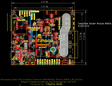
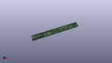

Contents
========

* [PROJ-SPAR-16794-STAN-01>MicroMod Weather Carrier Board](#proj-spar-16794-stan-01micromod-weather-carrier-board)
	* [Images](#images)
	* [Interactive BOM](#interactive-bom)
	* [OOMP Parts](#oomp-parts)
	* [Tags](#tags)
  
![][im]
# PROJ-SPAR-16794-STAN-01>MicroMod Weather Carrier Board

- ID: PROJ-SPAR-16794-STAN-01
- Hex ID: PRS16794
- Name: MicroMod Weather Carrier Board
- Description: 

## Images
  
  

|eagleImage|kicadPcb3dBack|kicadPcb3d|
| :---: | :---: | :---: |
||||

## Interactive BOM

- Interactive BOM page: [ibom.html](kicad/bom/ibom.html)

## OOMP Parts
  

|OOMP Parts|
| :---: |
|UNMATCHED-UNMATCHED-X-UNMATCHED-01, BT1, 8.889999999999999, 24.13, 90,BT1, ML414H, ML414H_IV01E, SparkFun-Batteries, (0.35, 0.95), R90|
|UNMATCHED-UNMATCHED-X-UNMATCHED-01, BYP, 3.8099999999999996, 20.32, 0,BYP, JUMPER-SMT_2_NO_SILK, SMT-JUMPER_2_NO_SILK, SparkFun-Jumpers, (0.15, 0.8), R0|
|CAPE-0603-X-NF100-01, C1, 10.16, 15.493999999999998, 0,C1, 0.1uF, 0603, SparkFun-Capacitors, (0.4, 0.61), R0|
|CAPE-UNMATCHED-X-UNMATCHED-01, C2, 8.889999999999999, 17.779999999999998, 180,C2, 10uF, EIA3216, SparkFun-Capacitors, (0.35, 0.7), R180|
|CAPE-0603-X-NF100-01, C3, 31.75, 40.004999999999995, 0,C3, 0.1uF, 0603, SparkFun-Capacitors, (1.25, 1.575), R0|
|CAPE-0603-X-NF100-01, C4, 31.75, 38.099999999999994, 0,C4, 0.1uF, 0603, SparkFun-Capacitors, (1.25, 1.5), R0|
|CAPE-0603-X-NF100-01, C5, 29.209999999999997, 48.26, 180,C5, 0.1uF, 0603, SparkFun-Capacitors, (1.15, 1.9), R180|
|CAPE-0603-X-UNMATCHED-01, C6, 38.099999999999994, 48.26, 180,C6, 1.0uF, 0603, SparkFun-Capacitors, (1.5, 1.9), R180|
|CAPE-0603-X-UNMATCHED-01, C7, 48.26, 49.529999999999994, 0,C7, 10uF, 0603, SparkFun-Capacitors, (1.9, 1.95), R0|
|CAPE-0603-X-UNMATCHED-01, C8, 42.545, 51.434999999999995, 180,C8, 1nF, 0603, SparkFun-Capacitors, (1.675, 2.025), R180|
|CAPE-0603-X-UNMATCHED-01, C9, 10.16, 6.985, 0,C9, 10uF, 0603, SparkFun-Capacitors, (0.4, 0.275), R0|
|CAPE-0603-X-UNMATCHED-01, C10, 10.16, 5.08, 0,C10, 1.0uF, 0603, SparkFun-Capacitors, (0.4, 0.2), R0|
|CAPE-0603-X-NF220-01, C11, 10.16, 3.175, 0,C11, 0.22uF, 0603, SparkFun-Capacitors, (0.4, 0.125), R0|
|CAPE-0603-X-NF100-01, C12, 48.26, 33.019999999999996, 270,C12, 0.1uF, 0603, SparkFun-Capacitors, (1.9, 1.3), R270|
|CAPE-0603-X-NF220-01, C13, 10.16, 13.97, 0,C13, 0.22uF, 0603, SparkFun-Capacitors, (0.4, 0.55), R0|
|CAPE-0603-X-NF100-01, C14, 50.8, 18.415, 270,C14, 0.1uF, 0603, SparkFun-Capacitors, (2, 0.725), R270|
|CAPE-0603-X-NF100-01, C46, 3.8099999999999996, 31.75, 180,C46, 0.1uF, 0603, SparkFun-Capacitors, (0.15, 1.25), R180|
|UNMATCHED-UNMATCHED-X-UNMATCHED-01, D1, 15.239999999999998, 10.16, 0,D1, 3.3V, SOD-323, SparkFun-DiscreteSemi, (0.6, 0.4), R0|
|UNMATCHED-0603-X-UNMATCHED-01, D2, 6.35, 50.8, 0,D2, RED, LED-0603, SparkFun-LED, (0.25, 2), R0|
|UNMATCHED-UNMATCHED-X-UNMATCHED-01, D3, 48.894999999999996, 10.16, 90,D3, 250mA/100V, SOD-323, SparkFun-DiscreteSemi, (1.925, 0.4), R90|
|UNMATCHED-UNMATCHED-X-UNMATCHED-01, D4, 49.022, 18.415, 90,D4, 250mA/100V, SOD-323, SparkFun-DiscreteSemi, (1.93, 0.725), R90|
|UNMATCHED-UNMATCHED-X-UNMATCHED-01, D5, 46.355, 29.209999999999997, 90,D5, 250mA/100V, SOD-323, SparkFun-DiscreteSemi, (1.825, 1.15), R90|
|UNMATCHED-UNMATCHED-X-UNMATCHED-01, D6, 3.175, 24.13, 90,D6, 3A/10V/280mV, SOD-323, SparkFun-DiscreteSemi, (0.125, 0.95), R90|
|UNMATCHED-UNMATCHED-X-UNMATCHED-01, D7, 1.27, 24.13, 90,D7, 1A/23V/620mV, SOD-323, SparkFun-DiscreteSemi, (0.05, 0.95), R90|
|UNMATCHED-UNMATCHED-X-UNMATCHED-01, D8, 46.355, 33.019999999999996, 90,D8, 250mA/100V, SOD-323, SparkFun-DiscreteSemi, (1.825, 1.3), R90|
|UNMATCHED-UNMATCHED-X-UNMATCHED-01, D9, 45.084999999999994, 24.13, 90,D9, 250mA/100V, SOD-323, SparkFun-DiscreteSemi, (1.775, 0.95), R90|
|UNMATCHED-UNMATCHED-X-UNMATCHED-01, D10, 48.894999999999996, 24.13, 270,D10, 250mA/100V, SOD-323, SparkFun-DiscreteSemi, (1.925, 0.95), R270|
|UNMATCHED-0603-X-UNMATCHED-01, D11, 6.35, 29.209999999999997, 0,D11, RED, LED-0603, SparkFun-LED, (0.25, 1.15), R0|
|UNMATCHED-1210-X-UNMATCHED-01, F2, 3.8099999999999996, 17.779999999999998, 0,F2, 6V/2A, 1210, SparkFun-Fuses, (0.15, 0.7), R0|
|UNMATCHED-UNMATCHED-X-UNMATCHED-01, FD1, 0.7619999999999999, 0.7619999999999999, 0,FD1, FIDUCIALUFIDUCIAL, FIDUCIAL-MICRO, SparkFun-Aesthetics, (0.03, 0.03), R0|
|UNMATCHED-UNMATCHED-X-UNMATCHED-01, FD2, 66.548, 57.785, 0,FD2, FIDUCIALUFIDUCIAL, FIDUCIAL-MICRO, SparkFun-Aesthetics, (2.62, 2.275), R0|
|UNMATCHED-UNMATCHED-X-UNMATCHED-01, FD3, 0.7619999999999999, 0.7619999999999999, M0,FD3, FIDUCIALUFIDUCIAL, FIDUCIAL-MICRO, SparkFun-Aesthetics, (0.03, 0.03), MR0|
|UNMATCHED-UNMATCHED-X-UNMATCHED-01, FD4, 66.548, 57.785, M0,FD4, FIDUCIALUFIDUCIAL, FIDUCIAL-MICRO, SparkFun-Aesthetics, (2.62, 2.275), MR0|
|UNMATCHED-UNMATCHED-X-UNMATCHED-01, H5, 44.199999991999995, 16.299999912, 0,H5, STAND-OFF-REFLOW2.5MM_TALL, STAND-OFF-REFLOW-M2.5, SparkFun-Hardware, (1.74015748, 0.64173228), R0|
|UNMATCHED-UNMATCHED-X-UNMATCHED-01, J1, 6.35, 10.16, 270,J1, USB-C-16P-2LAYER-PADS, SparkFun-Connectors, (0.25, 0.4), R270|
|UNMATCHED-UNMATCHED-X-UNMATCHED-01, J2, 15.239999999999998, 20.32, 270,J2, JTAG, 2X5-PTH-1.27MM, SparkFun-Connectors, (0.6, 0.8), R270|
|UNMATCHED-UNMATCHED-X-UNMATCHED-01, J3, 57.15, 5.08, 0,J3, QWIIC_RIGHT_ANGLE, JST04_1MM_RA, SparkFun-Connectors, (2.25, 0.2), R0|
|UNMATCHED-UNMATCHED-X-UNMATCHED-01, J4, 58.419999999999995, 44.449999999999996, 270,J4, LATCHTERMINAL-5MM-3, SparkFun-Connectors, (2.3, 1.75), R270|
|UNMATCHED-UNMATCHED-X-UNMATCHED-01, J5, 19.049999999999997, 57.15, 180,J5, 1X05_NO_SILK, SparkFun-Connectors, (0.75, 2.25), R180|
|UNMATCHED-UNMATCHED-X-UNMATCHED-01, J6, 40.64, 1.27, 180,J6, 1X03_NO_SILK, SparkFun-Connectors, (1.6, 0.05), R180|
|ERROR, J7 RJ11 -, 0, 0, 0,J7, RJ11, -, RAIN, RJ11-6, SparkFun-Connectors, (2.45, 0.55), R90|
|UNMATCHED-UNMATCHED-X-UNMATCHED-01, J8, 21.59, 57.15, 0,J8, 1X02_NO_SILK, SparkFun-Connectors, (0.85, 2.25), R0|
|UNMATCHED-UNMATCHED-X-UNMATCHED-01, J9, 21.59, 54.60999999999999, 0,J9, 1X02_NO_SILK, SparkFun-Connectors, (0.85, 2.15), R0|
|UNMATCHED-UNMATCHED-X-UNMATCHED-01, J11, 16.509999999999998, 46.99, 90,J11, microSD, MICRO-SD-SOCKET, SparkFun-Connectors, (0.65, 1.85), R90|
|UNMATCHED-UNMATCHED-X-UNMATCHED-01, J12, 33.019999999999996, 1.27, 180,J12, 1X03_NO_SILK, SparkFun-Connectors, (1.3, 0.05), R180|
|ERROR, J13 RJ11 -, 0, 0, 0,J13, RJ11, -, WIND, RJ11-6, SparkFun-Connectors, (2.45, 1.15), R90|
|UNMATCHED-UNMATCHED-X-UNMATCHED-01, J14, 43.18, 1.27, 0,J14, 1X04_NO_SILK, SparkFun-Connectors, (1.7, 0.05), R0|
|UNMATCHED-UNMATCHED-X-UNMATCHED-01, J15, 24.13, 20.32, 270,J15, MICROMOD-2222-C, M.2-CONNECTOR-E, SparkFun-MicroMod, (0.95, 0.8), R270|
|UNMATCHED-UNMATCHED-X-UNMATCHED-01, JP1, 39.37, 11.43, 90,JP1, SMT-JUMPER_3_2-NC_TRACE_SILK, SparkFun-Jumpers, (1.55, 0.45), R90|
|ERROR, JP2 VIN LED, 0, 0, 0,JP2, VIN, LED, SMT-JUMPER_2_NC_TRACE_SILK, SparkFun-Jumpers, (0.4, 1.15), R0|
|UNMATCHED-UNMATCHED-X-UNMATCHED-01, JP3, 33.019999999999996, 45.72, 0,JP3, UV, SMT-JUMPER_2_NC_TRACE_SILK, SparkFun-Jumpers, (1.3, 1.8), R0|
|ERROR, JP4 3V3 LED, 0, 0, 0,JP4, 3V3, LED, SMT-JUMPER_2_NC_TRACE_SILK, SparkFun-Jumpers, (0.4, 2), R0|
|UNMATCHED-UNMATCHED-X-UNMATCHED-01, JP6, 10.16, 13.97, M0,JP6, VE, SMT-JUMPER_2_NO_SILK, SparkFun-Jumpers, (0.4, 0.55), MR0|
|UNMATCHED-UNMATCHED-X-UNMATCHED-01, L1, 42.545, 55.88, 180,L1, 100uH, MA5532-AE, SparkFun-Coils, (1.675, 2.2), R180|
|UNMATCHED-UNMATCHED-X-UNMATCHED-01, MEAS, 10.668, 1.27, 0,MEAS, COMBO-JUMPER_2_NC_TRACE, SparkFun-Jumpers, (0.42, 0.05), R0|
|RESE-0603-X-UNMATCHED-01, R1, 39.37, 8.889999999999999, 180,R1, 2.2k, 0603, SparkFun-Resistors, (1.55, 0.35), R180|
|RESE-0603-X-UNMATCHED-01, R2, 7.619999999999999, 12.7, 270,R2, 5.1k, 0603, SparkFun-Resistors, (0.3, 0.5), R270|
|RESE-0603-X-UNMATCHED-01, R3, 7.619999999999999, 7.619999999999999, 90,R3, 5.1k, 0603, SparkFun-Resistors, (0.3, 0.3), R90|
|RESE-0603-X-UNMATCHED-01, R4, 39.37, 13.97, 180,R4, 2.2k, 0603, SparkFun-Resistors, (1.55, 0.55), R180|
|<table><tr><td></td><td> R5</td><td>[RESE-0603-X-O104-01 SMD (0603) 100k Ohm Resistor](https://github.com/oomlout/oomlout_OOMP_parts/tree/main/RESE-0603-X-O104-01/)</td><td>[R6104](https://github.com/oomlout/oomlout_OOMP_parts/tree/main/RESE-0603-X-O104-01/)</td></tr></table>|
|<table><tr><td></td><td> R6</td><td>[RESE-0603-X-O103-01 SMD (0603) 10k Ohm Resistor](https://github.com/oomlout/oomlout_OOMP_parts/tree/main/RESE-0603-X-O103-01/)</td><td>[R6103](https://github.com/oomlout/oomlout_OOMP_parts/tree/main/RESE-0603-X-O103-01/)</td></tr></table>|
|<table><tr><td></td><td> R7</td><td>[RESE-0603-X-O103-01 SMD (0603) 10k Ohm Resistor](https://github.com/oomlout/oomlout_OOMP_parts/tree/main/RESE-0603-X-O103-01/)</td><td>[R6103](https://github.com/oomlout/oomlout_OOMP_parts/tree/main/RESE-0603-X-O103-01/)</td></tr></table>|
|RESE-0603-X-UNMATCHED-01, R8, 5.08, 24.13, 270,R8, 3.3k, 0603, SparkFun-Resistors, (0.2, 0.95), R270|
|<table><tr><td></td><td> R9</td><td>[RESE-0603-X-O103-01 SMD (0603) 10k Ohm Resistor](https://github.com/oomlout/oomlout_OOMP_parts/tree/main/RESE-0603-X-O103-01/)</td><td>[R6103](https://github.com/oomlout/oomlout_OOMP_parts/tree/main/RESE-0603-X-O103-01/)</td></tr></table>|
|<table><tr><td></td><td> R10</td><td>[RESE-0603-X-O203-01 SMD (0603) 20k Ohm Resistor](https://github.com/oomlout/oomlout_OOMP_parts/tree/main/RESE-0603-X-O203-01/)</td><td>[R6203](https://github.com/oomlout/oomlout_OOMP_parts/tree/main/RESE-0603-X-O203-01/)</td></tr></table>|
|RESE-0603-X-UNMATCHED-01, R11, 6.35, 49.529999999999994, 0,R11, 1k, 0603, SparkFun-Resistors, (0.25, 1.95), R0|
|<table><tr><td></td><td> R12</td><td>[RESE-0603-X-O104-01 SMD (0603) 100k Ohm Resistor](https://github.com/oomlout/oomlout_OOMP_parts/tree/main/RESE-0603-X-O104-01/)</td><td>[R6104](https://github.com/oomlout/oomlout_OOMP_parts/tree/main/RESE-0603-X-O104-01/)</td></tr></table>|
|<table><tr><td></td><td> R14</td><td>[RESE-0603-X-O103-01 SMD (0603) 10k Ohm Resistor](https://github.com/oomlout/oomlout_OOMP_parts/tree/main/RESE-0603-X-O103-01/)</td><td>[R6103](https://github.com/oomlout/oomlout_OOMP_parts/tree/main/RESE-0603-X-O103-01/)</td></tr></table>|
|<table><tr><td></td><td> R15</td><td>[RESE-0603-X-O433-01 SMD (0603) 43k Ohm Resistor](https://github.com/oomlout/oomlout_OOMP_parts/tree/main/RESE-0603-X-O433-01/)</td><td>[R6433](https://github.com/oomlout/oomlout_OOMP_parts/tree/main/RESE-0603-X-O433-01/)</td></tr></table>|
|<table><tr><td></td><td> R16</td><td>[RESE-0603-X-O433-01 SMD (0603) 43k Ohm Resistor](https://github.com/oomlout/oomlout_OOMP_parts/tree/main/RESE-0603-X-O433-01/)</td><td>[R6433](https://github.com/oomlout/oomlout_OOMP_parts/tree/main/RESE-0603-X-O433-01/)</td></tr></table>|
|<table><tr><td></td><td> R19</td><td>[RESE-0603-X-O104-01 SMD (0603) 100k Ohm Resistor](https://github.com/oomlout/oomlout_OOMP_parts/tree/main/RESE-0603-X-O104-01/)</td><td>[R6104](https://github.com/oomlout/oomlout_OOMP_parts/tree/main/RESE-0603-X-O104-01/)</td></tr></table>|
|RESE-0603-X-UNMATCHED-01, R20, 6.35, 27.94, 0,R20, 1k, 0603, SparkFun-Resistors, (0.25, 1.1), R0|
|<table><tr><td></td><td> R21</td><td>[RESE-0603-X-O103-01 SMD (0603) 10k Ohm Resistor](https://github.com/oomlout/oomlout_OOMP_parts/tree/main/RESE-0603-X-O103-01/)</td><td>[R6103](https://github.com/oomlout/oomlout_OOMP_parts/tree/main/RESE-0603-X-O103-01/)</td></tr></table>|
|UNMATCHED-UNMATCHED-X-UNMATCHED-01, S1, 16.509999999999998, 5.08, 90,S1, Reset, TACTILE_SWITCH_SMD_5.2MM, SparkFun-Switches, (0.65, 0.2), R90|
|UNMATCHED-UNMATCHED-X-UNMATCHED-01, S2, 22.86, 5.08, 90,S2, BOOT, TACTILE_SWITCH_SMD_5.2MM, SparkFun-Switches, (0.9, 0.2), R90|
|UNMATCHED-UNMATCHED-X-UNMATCHED-01, TP1, 16.509999999999998, 25.4, M0,TP1, TEST-POINT3X5, PAD.03X.05, SparkFun-Connectors, (0.65, 1), MR0|
|UNMATCHED-UNMATCHED-X-UNMATCHED-01, U1, 38.099999999999994, 38.099999999999994, 270,U1, BME280, LGA-8-2.5X2.5, SparkFun-Sensors, (1.5, 1.5), R270|
|UNMATCHED-UNMATCHED-X-UNMATCHED-01, U2, 29.209999999999997, 45.72, 0,U2, VEML6075, VEML6075_A3OP, SparkFun-Sensors, (1.15, 1.8), R0|
|UNMATCHED-UNMATCHED-X-UNMATCHED-01, U3, 43.18, 46.99, 270,U3, AS3935, 16LD_MLPQ, SparkFun-Sensors, (1.7, 1.85), R270|
|UNMATCHED-UNMATCHED-X-UNMATCHED-01, U5, 10.16, 10.16, 0,U5, AP7361C-33FGEUDFN-8, UDFN-8, SparkFun-IC-Power, (0.4, 0.4), R0|

## Tags

- hexID: PRS16794
- oompType: PROJ
- oompSize: SPAR
- oompColor: 16794
- oompDesc: STAN
- oompIndex: 01
- oompName: MicroMod Weather Carrier Board
- sources: All source files from https://github.com/sparkfun/MicroMod_Weather_Carrier_Board (source licence details in srcLicense.md)
- linkBuyPage: https://www.sparkfun.com/products/16794
- oompPart: UNMATCHED-UNMATCHED-X-UNMATCHED-01, BT1, 8.889999999999999, 24.13, 90
- oompPart: UNMATCHED-UNMATCHED-X-UNMATCHED-01, BYP, 3.8099999999999996, 20.32, 0
- oompPart: CAPE-0603-X-NF100-01, C1, 10.16, 15.493999999999998, 0
- oompPart: CAPE-UNMATCHED-X-UNMATCHED-01, C2, 8.889999999999999, 17.779999999999998, 180
- oompPart: CAPE-0603-X-NF100-01, C3, 31.75, 40.004999999999995, 0
- oompPart: CAPE-0603-X-NF100-01, C4, 31.75, 38.099999999999994, 0
- oompPart: CAPE-0603-X-NF100-01, C5, 29.209999999999997, 48.26, 180
- oompPart: CAPE-0603-X-UNMATCHED-01, C6, 38.099999999999994, 48.26, 180
- oompPart: CAPE-0603-X-UNMATCHED-01, C7, 48.26, 49.529999999999994, 0
- oompPart: CAPE-0603-X-UNMATCHED-01, C8, 42.545, 51.434999999999995, 180
- oompPart: CAPE-0603-X-UNMATCHED-01, C9, 10.16, 6.985, 0
- oompPart: CAPE-0603-X-UNMATCHED-01, C10, 10.16, 5.08, 0
- oompPart: CAPE-0603-X-NF220-01, C11, 10.16, 3.175, 0
- oompPart: CAPE-0603-X-NF100-01, C12, 48.26, 33.019999999999996, 270
- oompPart: CAPE-0603-X-NF220-01, C13, 10.16, 13.97, 0
- oompPart: CAPE-0603-X-NF100-01, C14, 50.8, 18.415, 270
- oompPart: CAPE-0603-X-NF100-01, C46, 3.8099999999999996, 31.75, 180
- oompPart: UNMATCHED-UNMATCHED-X-UNMATCHED-01, D1, 15.239999999999998, 10.16, 0
- oompPart: UNMATCHED-0603-X-UNMATCHED-01, D2, 6.35, 50.8, 0
- oompPart: UNMATCHED-UNMATCHED-X-UNMATCHED-01, D3, 48.894999999999996, 10.16, 90
- oompPart: UNMATCHED-UNMATCHED-X-UNMATCHED-01, D4, 49.022, 18.415, 90
- oompPart: UNMATCHED-UNMATCHED-X-UNMATCHED-01, D5, 46.355, 29.209999999999997, 90
- oompPart: UNMATCHED-UNMATCHED-X-UNMATCHED-01, D6, 3.175, 24.13, 90
- oompPart: UNMATCHED-UNMATCHED-X-UNMATCHED-01, D7, 1.27, 24.13, 90
- oompPart: UNMATCHED-UNMATCHED-X-UNMATCHED-01, D8, 46.355, 33.019999999999996, 90
- oompPart: UNMATCHED-UNMATCHED-X-UNMATCHED-01, D9, 45.084999999999994, 24.13, 90
- oompPart: UNMATCHED-UNMATCHED-X-UNMATCHED-01, D10, 48.894999999999996, 24.13, 270
- oompPart: UNMATCHED-0603-X-UNMATCHED-01, D11, 6.35, 29.209999999999997, 0
- oompPart: UNMATCHED-1210-X-UNMATCHED-01, F2, 3.8099999999999996, 17.779999999999998, 0
- oompPart: UNMATCHED-UNMATCHED-X-UNMATCHED-01, FD1, 0.7619999999999999, 0.7619999999999999, 0
- oompPart: UNMATCHED-UNMATCHED-X-UNMATCHED-01, FD2, 66.548, 57.785, 0
- oompPart: UNMATCHED-UNMATCHED-X-UNMATCHED-01, FD3, 0.7619999999999999, 0.7619999999999999, M0
- oompPart: UNMATCHED-UNMATCHED-X-UNMATCHED-01, FD4, 66.548, 57.785, M0
- oompPart: UNMATCHED-UNMATCHED-X-UNMATCHED-01, H5, 44.199999991999995, 16.299999912, 0
- oompPart: UNMATCHED-UNMATCHED-X-UNMATCHED-01, J1, 6.35, 10.16, 270
- oompPart: UNMATCHED-UNMATCHED-X-UNMATCHED-01, J2, 15.239999999999998, 20.32, 270
- oompPart: UNMATCHED-UNMATCHED-X-UNMATCHED-01, J3, 57.15, 5.08, 0
- oompPart: UNMATCHED-UNMATCHED-X-UNMATCHED-01, J4, 58.419999999999995, 44.449999999999996, 270
- oompPart: UNMATCHED-UNMATCHED-X-UNMATCHED-01, J5, 19.049999999999997, 57.15, 180
- oompPart: UNMATCHED-UNMATCHED-X-UNMATCHED-01, J6, 40.64, 1.27, 180
- oompPart: ERROR, J7 RJ11 -, 0, 0, 0
- oompPart: UNMATCHED-UNMATCHED-X-UNMATCHED-01, J8, 21.59, 57.15, 0
- oompPart: UNMATCHED-UNMATCHED-X-UNMATCHED-01, J9, 21.59, 54.60999999999999, 0
- oompPart: UNMATCHED-UNMATCHED-X-UNMATCHED-01, J11, 16.509999999999998, 46.99, 90
- oompPart: UNMATCHED-UNMATCHED-X-UNMATCHED-01, J12, 33.019999999999996, 1.27, 180
- oompPart: ERROR, J13 RJ11 -, 0, 0, 0
- oompPart: UNMATCHED-UNMATCHED-X-UNMATCHED-01, J14, 43.18, 1.27, 0
- oompPart: UNMATCHED-UNMATCHED-X-UNMATCHED-01, J15, 24.13, 20.32, 270
- oompPart: UNMATCHED-UNMATCHED-X-UNMATCHED-01, JP1, 39.37, 11.43, 90
- oompPart: ERROR, JP2 VIN LED, 0, 0, 0
- oompPart: UNMATCHED-UNMATCHED-X-UNMATCHED-01, JP3, 33.019999999999996, 45.72, 0
- oompPart: ERROR, JP4 3V3 LED, 0, 0, 0
- oompPart: UNMATCHED-UNMATCHED-X-UNMATCHED-01, JP6, 10.16, 13.97, M0
- oompPart: UNMATCHED-UNMATCHED-X-UNMATCHED-01, L1, 42.545, 55.88, 180
- oompPart: UNMATCHED-UNMATCHED-X-UNMATCHED-01, MEAS, 10.668, 1.27, 0
- oompPart: RESE-0603-X-UNMATCHED-01, R1, 39.37, 8.889999999999999, 180
- oompPart: RESE-0603-X-UNMATCHED-01, R2, 7.619999999999999, 12.7, 270
- oompPart: RESE-0603-X-UNMATCHED-01, R3, 7.619999999999999, 7.619999999999999, 90
- oompPart: RESE-0603-X-UNMATCHED-01, R4, 39.37, 13.97, 180
- oompPart: RESE-0603-X-O104-01, R5, 12.7, 10.16, 270
- oompPart: RESE-0603-X-O103-01, R6, 42.545, 53.08599999999999, 0
- oompPart: RESE-0603-X-O103-01, R7, 31.75, 36.195, 180
- oompPart: RESE-0603-X-UNMATCHED-01, R8, 5.08, 24.13, 270
- oompPart: RESE-0603-X-O103-01, R9, 15.620999999999999, 15.239999999999998, 90
- oompPart: RESE-0603-X-O203-01, R10, 13.334999999999999, 15.239999999999998, 270
- oompPart: RESE-0603-X-UNMATCHED-01, R11, 6.35, 49.529999999999994, 0
- oompPart: RESE-0603-X-O104-01, R12, 19.049999999999997, 35.559999999999995, 270
- oompPart: RESE-0603-X-O103-01, R14, 46.99, 24.13, 270
- oompPart: RESE-0603-X-O433-01, R15, 50.8, 10.16, 270
- oompPart: RESE-0603-X-O433-01, R16, 48.26, 29.209999999999997, 270
- oompPart: RESE-0603-X-O104-01, R19, 38.099999999999994, 45.72, 180
- oompPart: RESE-0603-X-UNMATCHED-01, R20, 6.35, 27.94, 0
- oompPart: RESE-0603-X-O103-01, R21, 44.449999999999996, 38.099999999999994, 0
- oompPart: UNMATCHED-UNMATCHED-X-UNMATCHED-01, S1, 16.509999999999998, 5.08, 90
- oompPart: UNMATCHED-UNMATCHED-X-UNMATCHED-01, S2, 22.86, 5.08, 90
- oompPart: UNMATCHED-UNMATCHED-X-UNMATCHED-01, TP1, 16.509999999999998, 25.4, M0
- oompPart: UNMATCHED-UNMATCHED-X-UNMATCHED-01, U1, 38.099999999999994, 38.099999999999994, 270
- oompPart: UNMATCHED-UNMATCHED-X-UNMATCHED-01, U2, 29.209999999999997, 45.72, 0
- oompPart: UNMATCHED-UNMATCHED-X-UNMATCHED-01, U3, 43.18, 46.99, 270
- oompPart: UNMATCHED-UNMATCHED-X-UNMATCHED-01, U5, 10.16, 10.16, 0
- rawPart: BT1, ML414H, ML414H_IV01E, SparkFun-Batteries, (0.35, 0.95), R90
- rawPart: BYP, JUMPER-SMT_2_NO_SILK, SMT-JUMPER_2_NO_SILK, SparkFun-Jumpers, (0.15, 0.8), R0
- rawPart: C1, 0.1uF, 0603, SparkFun-Capacitors, (0.4, 0.61), R0
- rawPart: C2, 10uF, EIA3216, SparkFun-Capacitors, (0.35, 0.7), R180
- rawPart: C3, 0.1uF, 0603, SparkFun-Capacitors, (1.25, 1.575), R0
- rawPart: C4, 0.1uF, 0603, SparkFun-Capacitors, (1.25, 1.5), R0
- rawPart: C5, 0.1uF, 0603, SparkFun-Capacitors, (1.15, 1.9), R180
- rawPart: C6, 1.0uF, 0603, SparkFun-Capacitors, (1.5, 1.9), R180
- rawPart: C7, 10uF, 0603, SparkFun-Capacitors, (1.9, 1.95), R0
- rawPart: C8, 1nF, 0603, SparkFun-Capacitors, (1.675, 2.025), R180
- rawPart: C9, 10uF, 0603, SparkFun-Capacitors, (0.4, 0.275), R0
- rawPart: C10, 1.0uF, 0603, SparkFun-Capacitors, (0.4, 0.2), R0
- rawPart: C11, 0.22uF, 0603, SparkFun-Capacitors, (0.4, 0.125), R0
- rawPart: C12, 0.1uF, 0603, SparkFun-Capacitors, (1.9, 1.3), R270
- rawPart: C13, 0.22uF, 0603, SparkFun-Capacitors, (0.4, 0.55), R0
- rawPart: C14, 0.1uF, 0603, SparkFun-Capacitors, (2, 0.725), R270
- rawPart: C46, 0.1uF, 0603, SparkFun-Capacitors, (0.15, 1.25), R180
- rawPart: D1, 3.3V, SOD-323, SparkFun-DiscreteSemi, (0.6, 0.4), R0
- rawPart: D2, RED, LED-0603, SparkFun-LED, (0.25, 2), R0
- rawPart: D3, 250mA/100V, SOD-323, SparkFun-DiscreteSemi, (1.925, 0.4), R90
- rawPart: D4, 250mA/100V, SOD-323, SparkFun-DiscreteSemi, (1.93, 0.725), R90
- rawPart: D5, 250mA/100V, SOD-323, SparkFun-DiscreteSemi, (1.825, 1.15), R90
- rawPart: D6, 3A/10V/280mV, SOD-323, SparkFun-DiscreteSemi, (0.125, 0.95), R90
- rawPart: D7, 1A/23V/620mV, SOD-323, SparkFun-DiscreteSemi, (0.05, 0.95), R90
- rawPart: D8, 250mA/100V, SOD-323, SparkFun-DiscreteSemi, (1.825, 1.3), R90
- rawPart: D9, 250mA/100V, SOD-323, SparkFun-DiscreteSemi, (1.775, 0.95), R90
- rawPart: D10, 250mA/100V, SOD-323, SparkFun-DiscreteSemi, (1.925, 0.95), R270
- rawPart: D11, RED, LED-0603, SparkFun-LED, (0.25, 1.15), R0
- rawPart: F2, 6V/2A, 1210, SparkFun-Fuses, (0.15, 0.7), R0
- rawPart: FD1, FIDUCIALUFIDUCIAL, FIDUCIAL-MICRO, SparkFun-Aesthetics, (0.03, 0.03), R0
- rawPart: FD2, FIDUCIALUFIDUCIAL, FIDUCIAL-MICRO, SparkFun-Aesthetics, (2.62, 2.275), R0
- rawPart: FD3, FIDUCIALUFIDUCIAL, FIDUCIAL-MICRO, SparkFun-Aesthetics, (0.03, 0.03), MR0
- rawPart: FD4, FIDUCIALUFIDUCIAL, FIDUCIAL-MICRO, SparkFun-Aesthetics, (2.62, 2.275), MR0
- rawPart: H5, STAND-OFF-REFLOW2.5MM_TALL, STAND-OFF-REFLOW-M2.5, SparkFun-Hardware, (1.74015748, 0.64173228), R0
- rawPart: J1, USB-C-16P-2LAYER-PADS, SparkFun-Connectors, (0.25, 0.4), R270
- rawPart: J2, JTAG, 2X5-PTH-1.27MM, SparkFun-Connectors, (0.6, 0.8), R270
- rawPart: J3, QWIIC_RIGHT_ANGLE, JST04_1MM_RA, SparkFun-Connectors, (2.25, 0.2), R0
- rawPart: J4, LATCHTERMINAL-5MM-3, SparkFun-Connectors, (2.3, 1.75), R270
- rawPart: J5, 1X05_NO_SILK, SparkFun-Connectors, (0.75, 2.25), R180
- rawPart: J6, 1X03_NO_SILK, SparkFun-Connectors, (1.6, 0.05), R180
- rawPart: J7, RJ11, -, RAIN, RJ11-6, SparkFun-Connectors, (2.45, 0.55), R90
- rawPart: J8, 1X02_NO_SILK, SparkFun-Connectors, (0.85, 2.25), R0
- rawPart: J9, 1X02_NO_SILK, SparkFun-Connectors, (0.85, 2.15), R0
- rawPart: J11, microSD, MICRO-SD-SOCKET, SparkFun-Connectors, (0.65, 1.85), R90
- rawPart: J12, 1X03_NO_SILK, SparkFun-Connectors, (1.3, 0.05), R180
- rawPart: J13, RJ11, -, WIND, RJ11-6, SparkFun-Connectors, (2.45, 1.15), R90
- rawPart: J14, 1X04_NO_SILK, SparkFun-Connectors, (1.7, 0.05), R0
- rawPart: J15, MICROMOD-2222-C, M.2-CONNECTOR-E, SparkFun-MicroMod, (0.95, 0.8), R270
- rawPart: JP1, SMT-JUMPER_3_2-NC_TRACE_SILK, SparkFun-Jumpers, (1.55, 0.45), R90
- rawPart: JP2, VIN, LED, SMT-JUMPER_2_NC_TRACE_SILK, SparkFun-Jumpers, (0.4, 1.15), R0
- rawPart: JP3, UV, SMT-JUMPER_2_NC_TRACE_SILK, SparkFun-Jumpers, (1.3, 1.8), R0
- rawPart: JP4, 3V3, LED, SMT-JUMPER_2_NC_TRACE_SILK, SparkFun-Jumpers, (0.4, 2), R0
- rawPart: JP6, VE, SMT-JUMPER_2_NO_SILK, SparkFun-Jumpers, (0.4, 0.55), MR0
- rawPart: L1, 100uH, MA5532-AE, SparkFun-Coils, (1.675, 2.2), R180
- rawPart: MEAS, COMBO-JUMPER_2_NC_TRACE, SparkFun-Jumpers, (0.42, 0.05), R0
- rawPart: R1, 2.2k, 0603, SparkFun-Resistors, (1.55, 0.35), R180
- rawPart: R2, 5.1k, 0603, SparkFun-Resistors, (0.3, 0.5), R270
- rawPart: R3, 5.1k, 0603, SparkFun-Resistors, (0.3, 0.3), R90
- rawPart: R4, 2.2k, 0603, SparkFun-Resistors, (1.55, 0.55), R180
- rawPart: R5, 100k, 0603, SparkFun-Resistors, (0.5, 0.4), R270
- rawPart: R6, 10k, 0603, SparkFun-Resistors, (1.675, 2.09), R0
- rawPart: R7, 10k, 0603, SparkFun-Resistors, (1.25, 1.425), R180
- rawPart: R8, 3.3k, 0603, SparkFun-Resistors, (0.2, 0.95), R270
- rawPart: R9, 10k, 0603, SparkFun-Resistors, (0.615, 0.6), R90
- rawPart: R10, 20k, 0603, SparkFun-Resistors, (0.525, 0.6), R270
- rawPart: R11, 1k, 0603, SparkFun-Resistors, (0.25, 1.95), R0
- rawPart: R12, 100k, 0603, SparkFun-Resistors, (0.75, 1.4), R270
- rawPart: R14, 10k, 0603, SparkFun-Resistors, (1.85, 0.95), R270
- rawPart: R15, 43k, 0603, SparkFun-Resistors, (2, 0.4), R270
- rawPart: R16, 43k, 0603, SparkFun-Resistors, (1.9, 1.15), R270
- rawPart: R19, 100k, 0603, SparkFun-Resistors, (1.5, 1.8), R180
- rawPart: R20, 1k, 0603, SparkFun-Resistors, (0.25, 1.1), R0
- rawPart: R21, 10k, 0603, SparkFun-Resistors, (1.75, 1.5), R0
- rawPart: S1, Reset, TACTILE_SWITCH_SMD_5.2MM, SparkFun-Switches, (0.65, 0.2), R90
- rawPart: S2, BOOT, TACTILE_SWITCH_SMD_5.2MM, SparkFun-Switches, (0.9, 0.2), R90
- rawPart: TP1, TEST-POINT3X5, PAD.03X.05, SparkFun-Connectors, (0.65, 1), MR0
- rawPart: U1, BME280, LGA-8-2.5X2.5, SparkFun-Sensors, (1.5, 1.5), R270
- rawPart: U2, VEML6075, VEML6075_A3OP, SparkFun-Sensors, (1.15, 1.8), R0
- rawPart: U3, AS3935, 16LD_MLPQ, SparkFun-Sensors, (1.7, 1.85), R270
- rawPart: U5, AP7361C-33FGEUDFN-8, UDFN-8, SparkFun-IC-Power, (0.4, 0.4), R0

[im]: kicadPcb3d_450.png
