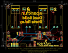
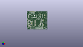
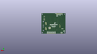
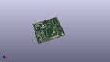

Contents
========

* [PROJ-SPAR-16810-STAN-01>Qwiic Dual Solid State Relay](#proj-spar-16810-stan-01qwiic-dual-solid-state-relay)
	* [Images](#images)
	* [Interactive BOM](#interactive-bom)
	* [OOMP Parts](#oomp-parts)
	* [Tags](#tags)
  
![][im]
# PROJ-SPAR-16810-STAN-01>Qwiic Dual Solid State Relay

- ID: PROJ-SPAR-16810-STAN-01
- Hex ID: PRS16810
- Name: Qwiic Dual Solid State Relay
- Description: 

## Images
  
  

|eagleImage|kicadPcb3dFront|kicadPcb3dBack|kicadPcb3d|
| :---: | :---: | :---: | :---: |
|||||

## Interactive BOM

- Interactive BOM page: [ibom.html](kicad/bom/ibom.html)

## OOMP Parts
  

|OOMP Parts|
| :---: |
|UNMATCHED-UNMATCHED-X-UNMATCHED-01, ADR, 48.005000001999996, 13.97, 180,ADR, JUMPER-SMT_2_NC_TRACE_SILK, SMT-JUMPER_2_NC_TRACE_SILK, SparkFun-Jumpers, (1.88996063, 0.55), R180|
|<table><tr><td></td><td> C5</td><td>[CAPC-0603-X-NF100-V50 SMD (0603) 100 nF Capacitor (Ceramic) 50v](https://github.com/oomlout/oomlout_OOMP_parts/tree/main/CAPC-0603-X-NF100-V50/)</td><td>[C6N100](https://github.com/oomlout/oomlout_OOMP_parts/tree/main/CAPC-0603-X-NF100-V50/)</td></tr></table>|
|UNMATCHED-0603-X-UNMATCHED-01, D1, 22.86, 22.86, 270,D1, BLUE, LED-0603, SparkFun-LED, (0.9, 0.9), R270|
|UNMATCHED-0603-X-UNMATCHED-01, D2, 67.30999999999999, 22.86, 270,D2, BLUE, LED-0603, SparkFun-LED, (2.65, 0.9), R270|
|UNMATCHED-UNMATCHED-X-UNMATCHED-01, D3, 27.94, 60.959999999999994, 180,D3, LED_5MM, SparkFun-LED, (1.1, 2.4), R180|
|UNMATCHED-UNMATCHED-X-UNMATCHED-01, D4, 72.39, 60.959999999999994, 180,D4, LED_5MM, SparkFun-LED, (2.85, 2.4), R180|
|UNMATCHED-0603-X-UNMATCHED-01, D11, 45.084999999999994, 1.27, 0,D11, RED, LED-0603, SparkFun-LED, (1.775, 0.05), R0|
|UNMATCHED-UNMATCHED-X-UNMATCHED-01, I2C, 12.7, 11.43, 0,I2C, JUMPER-SMT_3_2-NC_TRACE_SILK, SMT-JUMPER_3_2-NC_TRACE_SILK, SparkFun-Jumpers, (0.5, 0.45), R0|
|UNMATCHED-UNMATCHED-X-UNMATCHED-01, J1, 15.239999999999998, 1.27, 180,J1, 1X04_NO_SILK, SparkFun-Connectors, (0.6, 0.05), R180|
|ERROR, J2 Qwiic Right, 0, 0, 0,J2, Qwiic, Right, Angle, JST04_1MM_RA, SparkFun-Connectors, (3.35, 0.5), R90|
|ERROR, J3 Qwiic Right, 0, 0, 0,J3, Qwiic, Right, Angle, JST04_1MM_RA, SparkFun-Connectors, (0.2, 0.5), R270|
|UNMATCHED-UNMATCHED-X-UNMATCHED-01, J4, 13.97, 59.055, 180,J4, 1X02_6.35_SCREWTERM, SparkFun-Connectors, (0.55, 2.325), R180|
|UNMATCHED-UNMATCHED-X-UNMATCHED-01, J5, 58.419999999999995, 59.055, 180,J5, 1X02_6.35_SCREWTERM, SparkFun-Connectors, (2.3, 2.325), R180|
|UNMATCHED-UNMATCHED-X-UNMATCHED-01, J6, 17.779999999999998, 1.27, 0,J6, 1X01_NO_SILK, SparkFun-Connectors, (0.7, 0.05), R0|
|ERROR, K1 25A Solid, 0, 0, 0,K1, 25A, Solid, State, Relay, PTH_SOLIDSTATERELAY, SparkFun-DiscreteSemi, (0.35, 1.25), R0|
|ERROR, K2 25A Solid, 0, 0, 0,K2, 25A, Solid, State, Relay, PTH_SOLIDSTATERELAY, SparkFun-DiscreteSemi, (2.1, 1.25), R0|
|UNMATCHED-UNMATCHED-X-UNMATCHED-01, PWR, 45.084999999999994, 6.35, 270,PWR, JUMPER-SMT_2_NC_TRACE_SILK, SMT-JUMPER_2_NC_TRACE_SILK, SparkFun-Jumpers, (1.775, 0.25), R270|
|UNMATCHED-UNMATCHED-X-UNMATCHED-01, Q1, 24.13, 19.049999999999997, 0,Q1, 600mA/40V, SOT23-3, SparkFun-DiscreteSemi, (0.95, 0.75), R0|
|UNMATCHED-UNMATCHED-X-UNMATCHED-01, Q2, 68.58, 19.049999999999997, 0,Q2, 600mA/40V, SOT23-3, SparkFun-DiscreteSemi, (2.7, 0.75), R0|
|RESE-0603-X-UNMATCHED-01, R1, 20.32, 22.86, 270,R1, 1k, 0603, SparkFun-Resistors, (0.8, 0.9), R270|
|RESE-0603-X-UNMATCHED-01, R2, 25.4, 22.86, 90,R2, 47, 0603, SparkFun-Resistors, (1, 0.9), R90|
|RESE-0603-X-UNMATCHED-01, R3, 20.32, 19.049999999999997, 90,R3, 1k, 0603, SparkFun-Resistors, (0.8, 0.75), R90|
|RESE-0603-X-UNMATCHED-01, R4, 64.77, 22.86, 270,R4, 1k, 0603, SparkFun-Resistors, (2.55, 0.9), R270|
|RESE-0603-X-UNMATCHED-01, R5, 69.85, 22.86, 270,R5, 47, 0603, SparkFun-Resistors, (2.75, 0.9), R270|
|RESE-0603-X-UNMATCHED-01, R6, 64.77, 19.049999999999997, 90,R6, 1k, 0603, SparkFun-Resistors, (2.55, 0.75), R90|
|RESE-0603-X-UNMATCHED-01, R7, 27.94, 55.88, 0,R7, 1k, 0603, SparkFun-Resistors, (1.1, 2.2), R0|
|RESE-0603-X-UNMATCHED-01, R8, 74.93, 55.88, 0,R8, 1k, 0603, SparkFun-Resistors, (2.95, 2.2), R0|
|RESE-0603-X-UNMATCHED-01, R11, 45.084999999999994, 3.8099999999999996, 180,R11, 1k, 0603, SparkFun-Resistors, (1.775, 0.15), R180|
|RESE-0603-X-UNMATCHED-01, R14, 9.524999999999999, 11.43, 270,R14, 4.7k, 0603, SparkFun-Resistors, (0.375, 0.45), R270|
|RESE-0603-X-UNMATCHED-01, R15, 15.875, 11.43, 270,R15, 4.7k, 0603, SparkFun-Resistors, (0.625, 0.45), R270|
|RESE-0603-X-UNMATCHED-01, R17, 53.085000002, 24.13, 0,R17, 4.7k, 0603, SparkFun-Resistors, (2.08996063, 0.95), R0|
|UNMATCHED-UNMATCHED-X-UNMATCHED-01, U4, 53.085000002, 16.509999999999998, 270,U4, ATTINY84-ARDUINO, SO14, SparkFun-IC-Microcontroller, (2.08996063, 0.65), R270|

## Tags

- hexID: PRS16810
- oompType: PROJ
- oompSize: SPAR
- oompColor: 16810
- oompDesc: STAN
- oompIndex: 01
- oompName: Qwiic Dual Solid State Relay
- sources: All source files from https://github.com/sparkfun/Qwiic_Dual_Solid_State_Relay (source licence details in srcLicense.md)
- linkBuyPage: https://www.sparkfun.com/products/16810
- oompID: PROJ-SPAR-16810-STAN-01
- oompPart: UNMATCHED-UNMATCHED-X-UNMATCHED-01, ADR, 48.005000001999996, 13.97, 180
- oompPart: CAPC-0603-X-NF100-V50, C5, 53.085000002, 22.224999999999998, 0
- oompPart: UNMATCHED-0603-X-UNMATCHED-01, D1, 22.86, 22.86, 270
- oompPart: UNMATCHED-0603-X-UNMATCHED-01, D2, 67.30999999999999, 22.86, 270
- oompPart: UNMATCHED-UNMATCHED-X-UNMATCHED-01, D3, 27.94, 60.959999999999994, 180
- oompPart: UNMATCHED-UNMATCHED-X-UNMATCHED-01, D4, 72.39, 60.959999999999994, 180
- oompPart: UNMATCHED-0603-X-UNMATCHED-01, D11, 45.084999999999994, 1.27, 0
- oompPart: SKIP-UNMATCHED-X-UNMATCHED-01, FD1, 83.82, 24.13, 0
- oompPart: SKIP-UNMATCHED-X-UNMATCHED-01, FD2, 83.82, 24.13, M0
- oompPart: SKIP-UNMATCHED-X-UNMATCHED-01, FD3, 5.08, 5.08, M0
- oompPart: SKIP-UNMATCHED-X-UNMATCHED-01, FD4, 5.08, 5.08, 0
- oompPart: UNMATCHED-UNMATCHED-X-UNMATCHED-01, I2C, 12.7, 11.43, 0
- oompPart: UNMATCHED-UNMATCHED-X-UNMATCHED-01, J1, 15.239999999999998, 1.27, 180
- oompPart: ERROR, J2 Qwiic Right, 0, 0, 0
- oompPart: ERROR, J3 Qwiic Right, 0, 0, 0
- oompPart: UNMATCHED-UNMATCHED-X-UNMATCHED-01, J4, 13.97, 59.055, 180
- oompPart: UNMATCHED-UNMATCHED-X-UNMATCHED-01, J5, 58.419999999999995, 59.055, 180
- oompPart: UNMATCHED-UNMATCHED-X-UNMATCHED-01, J6, 17.779999999999998, 1.27, 0
- oompPart: SKIP-UNMATCHED-X-UNMATCHED-01, J9, 53.085000002, 16.509999999999998, M90
- oompPart: ERROR, K1 25A Solid, 0, 0, 0
- oompPart: ERROR, K2 25A Solid, 0, 0, 0
- oompPart: UNMATCHED-UNMATCHED-X-UNMATCHED-01, PWR, 45.084999999999994, 6.35, 270
- oompPart: UNMATCHED-UNMATCHED-X-UNMATCHED-01, Q1, 24.13, 19.049999999999997, 0
- oompPart: UNMATCHED-UNMATCHED-X-UNMATCHED-01, Q2, 68.58, 19.049999999999997, 0
- oompPart: RESE-0603-X-UNMATCHED-01, R1, 20.32, 22.86, 270
- oompPart: RESE-0603-X-UNMATCHED-01, R2, 25.4, 22.86, 90
- oompPart: RESE-0603-X-UNMATCHED-01, R3, 20.32, 19.049999999999997, 90
- oompPart: RESE-0603-X-UNMATCHED-01, R4, 64.77, 22.86, 270
- oompPart: RESE-0603-X-UNMATCHED-01, R5, 69.85, 22.86, 270
- oompPart: RESE-0603-X-UNMATCHED-01, R6, 64.77, 19.049999999999997, 90
- oompPart: RESE-0603-X-UNMATCHED-01, R7, 27.94, 55.88, 0
- oompPart: RESE-0603-X-UNMATCHED-01, R8, 74.93, 55.88, 0
- oompPart: RESE-0603-X-UNMATCHED-01, R11, 45.084999999999994, 3.8099999999999996, 180
- oompPart: RESE-0603-X-UNMATCHED-01, R14, 9.524999999999999, 11.43, 270
- oompPart: RESE-0603-X-UNMATCHED-01, R15, 15.875, 11.43, 270
- oompPart: RESE-0603-X-UNMATCHED-01, R17, 53.085000002, 24.13, 0
- oompPart: UNMATCHED-UNMATCHED-X-UNMATCHED-01, U4, 53.085000002, 16.509999999999998, 270
- rawPart: ADR, JUMPER-SMT_2_NC_TRACE_SILK, SMT-JUMPER_2_NC_TRACE_SILK, SparkFun-Jumpers, (1.88996063, 0.55), R180
- rawPart: C5, 0.1uF, 0603, SparkFun-Capacitors, (2.08996063, 0.875), R0
- rawPart: D1, BLUE, LED-0603, SparkFun-LED, (0.9, 0.9), R270
- rawPart: D2, BLUE, LED-0603, SparkFun-LED, (2.65, 0.9), R270
- rawPart: D3, LED_5MM, SparkFun-LED, (1.1, 2.4), R180
- rawPart: D4, LED_5MM, SparkFun-LED, (2.85, 2.4), R180
- rawPart: D11, RED, LED-0603, SparkFun-LED, (1.775, 0.05), R0
- rawPart: FD1, FIDUCIAL1X2, FIDUCIAL-1X2, SparkFun-Aesthetics, (3.3, 0.95), R0
- rawPart: FD2, FIDUCIAL1X2, FIDUCIAL-1X2, SparkFun-Aesthetics, (3.3, 0.95), MR0
- rawPart: FD3, FIDUCIAL1X2, FIDUCIAL-1X2, SparkFun-Aesthetics, (0.2, 0.2), MR0
- rawPart: FD4, FIDUCIAL1X2, FIDUCIAL-1X2, SparkFun-Aesthetics, (0.2, 0.2), R0
- rawPart: I2C, JUMPER-SMT_3_2-NC_TRACE_SILK, SMT-JUMPER_3_2-NC_TRACE_SILK, SparkFun-Jumpers, (0.5, 0.45), R0
- rawPart: J1, 1X04_NO_SILK, SparkFun-Connectors, (0.6, 0.05), R180
- rawPart: J2, Qwiic, Right, Angle, JST04_1MM_RA, SparkFun-Connectors, (3.35, 0.5), R90
- rawPart: J3, Qwiic, Right, Angle, JST04_1MM_RA, SparkFun-Connectors, (0.2, 0.5), R270
- rawPart: J4, 1X02_6.35_SCREWTERM, SparkFun-Connectors, (0.55, 2.325), R180
- rawPart: J5, 1X02_6.35_SCREWTERM, SparkFun-Connectors, (2.3, 2.325), R180
- rawPart: J6, 1X01_NO_SILK, SparkFun-Connectors, (0.7, 0.05), R0
- rawPart: J9, AVR_SPI_PROG_3X2TESTPOINTS, 2X3_TEST_POINTS, SparkFun-Connectors, (2.08996063, 0.65), MR90
- rawPart: K1, 25A, Solid, State, Relay, PTH_SOLIDSTATERELAY, SparkFun-DiscreteSemi, (0.35, 1.25), R0
- rawPart: K2, 25A, Solid, State, Relay, PTH_SOLIDSTATERELAY, SparkFun-DiscreteSemi, (2.1, 1.25), R0
- rawPart: PWR, JUMPER-SMT_2_NC_TRACE_SILK, SMT-JUMPER_2_NC_TRACE_SILK, SparkFun-Jumpers, (1.775, 0.25), R270
- rawPart: Q1, 600mA/40V, SOT23-3, SparkFun-DiscreteSemi, (0.95, 0.75), R0
- rawPart: Q2, 600mA/40V, SOT23-3, SparkFun-DiscreteSemi, (2.7, 0.75), R0
- rawPart: R1, 1k, 0603, SparkFun-Resistors, (0.8, 0.9), R270
- rawPart: R2, 47, 0603, SparkFun-Resistors, (1, 0.9), R90
- rawPart: R3, 1k, 0603, SparkFun-Resistors, (0.8, 0.75), R90
- rawPart: R4, 1k, 0603, SparkFun-Resistors, (2.55, 0.9), R270
- rawPart: R5, 47, 0603, SparkFun-Resistors, (2.75, 0.9), R270
- rawPart: R6, 1k, 0603, SparkFun-Resistors, (2.55, 0.75), R90
- rawPart: R7, 1k, 0603, SparkFun-Resistors, (1.1, 2.2), R0
- rawPart: R8, 1k, 0603, SparkFun-Resistors, (2.95, 2.2), R0
- rawPart: R11, 1k, 0603, SparkFun-Resistors, (1.775, 0.15), R180
- rawPart: R14, 4.7k, 0603, SparkFun-Resistors, (0.375, 0.45), R270
- rawPart: R15, 4.7k, 0603, SparkFun-Resistors, (0.625, 0.45), R270
- rawPart: R17, 4.7k, 0603, SparkFun-Resistors, (2.08996063, 0.95), R0
- rawPart: U4, ATTINY84-ARDUINO, SO14, SparkFun-IC-Microcontroller, (2.08996063, 0.65), R270

[im]: kicadPcb3d_450.png
