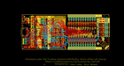
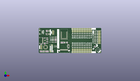
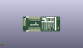
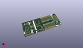

Contents
========

* [PROJ-SPAR-16828-STAN-01>ArtemisDevKit](#proj-spar-16828-stan-01artemisdevkit)
	* [Images](#images)
	* [Interactive BOM](#interactive-bom)
	* [OOMP Parts](#oomp-parts)
	* [Tags](#tags)
  
![][im]
# PROJ-SPAR-16828-STAN-01>ArtemisDevKit

- ID: PROJ-SPAR-16828-STAN-01
- Hex ID: PRS16828
- Name: ArtemisDevKit
- Description: 

## Images
  
  

|eagleImage|kicadPcb3dFront|kicadPcb3dBack|kicadPcb3d|
| :---: | :---: | :---: | :---: |
|||||

## Interactive BOM

- Interactive BOM page: [ibom.html](kicad/bom/ibom.html)

## OOMP Parts
  

|OOMP Parts|
| :---: |
|CAPE-0603-X-UNMATCHED-01, C1, 1425.0, 625.0, 270,C1, 10uF, 0603, SparkFun-Capacitors, (1425, 625), R270|
|CAPE-0603-X-UNMATCHED-01, C2, 1370.0, 625.0, 270,C2, 1.0uF, 0603, SparkFun-Capacitors, (1370, 625), R270|
|CAPE-0603-X-NF100-01, C3, 1315.0, 625.0, 270,C3, 0.1uF, 0603, SparkFun-Capacitors, (1315, 625), R270|
|CAPE-0603-X-NF100-01, C4, 3350.0, 350.0, 225,C4, 0.1uF, 0603, SparkFun-Capacitors, (3350, 350), R225|
|CAPE-0603-X-UF22D-01, C5, 150.0, 527.0, 0,C5, 2.2uF, 0603, SparkFun-Capacitors, (150, 527), R0|
|CAPE-0603-X-NF100-01, C6, 145.0, 100.0, 270,C6, 0.1uF, 0603, SparkFun-Capacitors, (145, 100), R270|
|CAPE-0603-X-NF100-01, C7, 350.0, 540.0, 180,C7, 0.1uF, 0603, SparkFun-Capacitors, (350, 540), R180|
|CAPE-0603-X-UNMATCHED-01, C8, 200.0, 100.0, 270,C8, 12pF, 0603, SparkFun-Capacitors, (200, 100), R270|
|CAPE-0603-X-UNMATCHED-01, C9, 400.0, 100.0, 270,C9, 12pF, 0603, SparkFun-Capacitors, (400, 100), R270|
|CAPE-0603-X-UNMATCHED-01, C10, 1700.0, 625.0, 90,C10, 15pF, 0603, SparkFun-Capacitors, (1700, 625), R90|
|CAPE-0603-X-UNMATCHED-01, C11, 1500.0, 625.0, 90,C11, 15pF, 0603, SparkFun-Capacitors, (1500, 625), R90|
|CAPE-0603-X-UNMATCHED-01, C12, 500.0, 900.0, 180,C12, 1.0uF, 0603, SparkFun-Capacitors, (500, 900), R180|
|CAPE-0603-X-NF100-01, C13, 500.0, 600.0, 180,C13, 0.1uF, 0603, SparkFun-Capacitors, (500, 600), R180|
|CAPE-0603-X-NF100-01, C14, 565.0, 100.0, 270,C14, 0.1uF, 0603, SparkFun-Capacitors, (565, 100), R270|
|CAPE-0603-X-UNMATCHED-01, C15, 445.0, 1135.0, 90,C15, 1.0uF, 0603, SparkFun-Capacitors, (445, 1135), R90|
|CAPE-0603-X-NF100-01, C16, 445.0, 1325.0, 270,C16, 0.1uF, 0603, SparkFun-Capacitors, (445, 1325), R270|
|CAPE-0603-X-UNMATCHED-01, C17, 500.0, 1325.0, 270,C17, 10uF, 0603, SparkFun-Capacitors, (500, 1325), R270|
|CAPE-0603-X-UNMATCHED-01, C18, 1750.0, 300.0, 0,C18, 1.0uF, 0603, SparkFun-Capacitors, (1750, 300), R0|
|CAPE-0603-X-UNMATCHED-01, C19, 1750.0, 500.0, 180,C19, 1.0uF, 0603, SparkFun-Capacitors, (1750, 500), R180|
|UNMATCHED-0603-X-UNMATCHED-01, D1, 850.0, 745.0, 180,D1, BLUE, LED-0603, SparkFun-LED, (850, 745), R180|
|UNMATCHED-0603-X-UNMATCHED-01, D2, 850.0, 800.0, 180,D2, GREEN, LED-0603, SparkFun-LED, (850, 800), R180|
|UNMATCHED-0603-X-UNMATCHED-01, D3, 850.0, 855.0, 180,D3, Yellow, LED-0603, SparkFun-LED, (850, 855), R180|
|UNMATCHED-0603-X-UNMATCHED-01, D4, 850.0, 950.0, 180,D4, RED, LED-0603, SparkFun-LED, (850, 950), R180|
|UNMATCHED-0603-X-UNMATCHED-01, D5, 850.0, 650.0, 180,D5, BLUE, LED-0603, SparkFun-LED, (850, 650), R180|
|UNMATCHED-UNMATCHED-X-UNMATCHED-01, D6, 365.0, 750.0, 0,D6, PRTR5V0U2F, SOT886, SparkFun-IC-Power, (365, 750), R0|
|UNMATCHED-UNMATCHED-X-UNMATCHED-01, E1, 570.0, 1135.0, 90,E1, SPH0641LM4H-1, SPH0641LM4H-1_MICROPHONE, SparkFun-Sensors, (570, 1135), R90|
|UNMATCHED-UNMATCHED-X-UNMATCHED-01, FD1, 50.0, 1450.0, 0,FD1, FIDUCIAL1X2, FIDUCIAL-1X2, SparkFun-Aesthetics, (50, 1450), R0|
|UNMATCHED-UNMATCHED-X-UNMATCHED-01, FD2, 50.0, 1450.0, M0,FD2, FIDUCIAL1X2, FIDUCIAL-1X2, SparkFun-Aesthetics, (50, 1450), MR0|
|UNMATCHED-UNMATCHED-X-UNMATCHED-01, FD3, 3650.0, 50.0, 0,FD3, FIDUCIAL1X2, FIDUCIAL-1X2, SparkFun-Aesthetics, (3650, 50), R0|
|UNMATCHED-UNMATCHED-X-UNMATCHED-01, FD4, 3650.0, 50.0, M0,FD4, FIDUCIAL1X2, FIDUCIAL-1X2, SparkFun-Aesthetics, (3650, 50), MR0|
|UNMATCHED-UNMATCHED-X-UNMATCHED-01, J1, 250.0, 750.0, 270,J1, USB, USB-C-16P, SparkFun-Connectors, (250, 750), R270|
|UNMATCHED-UNMATCHED-X-UNMATCHED-01, J2, 852.0, 1226.0, 270,J2, CORTEX_JTAG_DEBUG_MINIMUM_PTH, 2X5-PTH-1.27MM, SparkFun-Connectors, (852, 1226), R270|
|UNMATCHED-UNMATCHED-X-UNMATCHED-01, J3, 150.0, 350.0, 270,J3, CORTEX_JTAG_DEBUG_PTH, 2X5-PTH-1.27MM, SparkFun-Connectors, (150, 350), R270|
|UNMATCHED-UNMATCHED-X-UNMATCHED-01, J4, 3400.0, 1300.0, 270,J4, SMD, 1X08_SMD_COMBINED, SparkFun-Connectors, (3400, 1300), R270|
|UNMATCHED-UNMATCHED-X-UNMATCHED-01, J5, 2000.0, 1100.0, 0,J5, 1X12_SMD_COMBINED, SparkFun-Connectors, (2000, 1100), R0|
|UNMATCHED-UNMATCHED-X-UNMATCHED-01, J6, 200.0, 1250.0, 270,J6, QWIIC_RIGHT_ANGLE, JST04_1MM_RA, SparkFun-Connectors, (200, 1250), R270|
|UNMATCHED-UNMATCHED-X-UNMATCHED-01, J7, 1500.0, 95.0, 0,J7, CAMERA-HIMAXBOTTOM-CONTACT, FPC-24-AMPHENOL-SFV24R-1STE1HLF, SparkFun-Connectors, (1500, 95), R0|
|UNMATCHED-UNMATCHED-X-UNMATCHED-01, J8, 3625.0, 1300.0, 270,J8, PTH, 1X08_NO_SILK, SparkFun-Connectors, (3625, 1300), R270|
|UNMATCHED-UNMATCHED-X-UNMATCHED-01, J9, 3100.0, 400.0, 180,J9, 1X12_SMD_COMBINED, SparkFun-Connectors, (3100, 400), R180|
|UNMATCHED-UNMATCHED-X-UNMATCHED-01, J12, 3550.0, 1300.0, 270,J12, PTH, 1X08_NO_SILK, SparkFun-Connectors, (3550, 1300), R270|
|UNMATCHED-UNMATCHED-X-UNMATCHED-01, J14, 3100.0, 150.0, 180,J14, PTH, 1X12_NO_SILK, SparkFun-Connectors, (3100, 150), R180|
|UNMATCHED-UNMATCHED-X-UNMATCHED-01, J22, 2000.0, 1350.0, 0,J22, PTH, 1X12_NO_SILK, SparkFun-Connectors, (2000, 1350), R0|
|UNMATCHED-UNMATCHED-X-UNMATCHED-01, J23, 3100.0, 50.0, 180,J23, PTH, 1X12_NO_SILK, SparkFun-Connectors, (3100, 50), R180|
|UNMATCHED-UNMATCHED-X-UNMATCHED-01, J24, 2000.0, 1450.0, 0,J24, PTH, 1X12_NO_SILK, SparkFun-Connectors, (2000, 1450), R0|
|UNMATCHED-UNMATCHED-X-UNMATCHED-01, J25, 3100.0, 225.0, 180,J25, PTH, 1X12_NO_SILK, SparkFun-Connectors, (3100, 225), R180|
|UNMATCHED-UNMATCHED-X-UNMATCHED-01, J26, 2000.0, 1275.0, 0,J26, PTH, 1X12_NO_SILK, SparkFun-Connectors, (2000, 1275), R0|
|<table><tr><td></td><td> R1</td><td>[RESE-0603-X-O331-01 SMD (0603) 330 Ohm Resistor](https://github.com/oomlout/oomlout_OOMP_parts/tree/main/RESE-0603-X-O331-01/)</td><td>[R6331](https://github.com/oomlout/oomlout_OOMP_parts/tree/main/RESE-0603-X-O331-01/)</td></tr></table>|
|<table><tr><td></td><td> R2</td><td>[RESE-0603-X-O331-01 SMD (0603) 330 Ohm Resistor](https://github.com/oomlout/oomlout_OOMP_parts/tree/main/RESE-0603-X-O331-01/)</td><td>[R6331](https://github.com/oomlout/oomlout_OOMP_parts/tree/main/RESE-0603-X-O331-01/)</td></tr></table>|
|<table><tr><td></td><td> R3</td><td>[RESE-0603-X-O331-01 SMD (0603) 330 Ohm Resistor](https://github.com/oomlout/oomlout_OOMP_parts/tree/main/RESE-0603-X-O331-01/)</td><td>[R6331](https://github.com/oomlout/oomlout_OOMP_parts/tree/main/RESE-0603-X-O331-01/)</td></tr></table>|
|<table><tr><td></td><td> R4</td><td>[RESE-0603-X-O331-01 SMD (0603) 330 Ohm Resistor](https://github.com/oomlout/oomlout_OOMP_parts/tree/main/RESE-0603-X-O331-01/)</td><td>[R6331](https://github.com/oomlout/oomlout_OOMP_parts/tree/main/RESE-0603-X-O331-01/)</td></tr></table>|
|<table><tr><td></td><td> R5</td><td>[RESE-0603-X-O331-01 SMD (0603) 330 Ohm Resistor](https://github.com/oomlout/oomlout_OOMP_parts/tree/main/RESE-0603-X-O331-01/)</td><td>[R6331](https://github.com/oomlout/oomlout_OOMP_parts/tree/main/RESE-0603-X-O331-01/)</td></tr></table>|
|RESE-0603-X-UNMATCHED-01, R6, 350.0, 600.0, 0,R6, 5.1k, 0603, SparkFun-Resistors, (350, 600), R0|
|RESE-0603-X-UNMATCHED-01, R7, 350.0, 900.0, 180,R7, 5.1k, 0603, SparkFun-Resistors, (350, 900), R180|
|<table><tr><td></td><td> R11</td><td>[RESE-0603-X-O103-01 SMD (0603) 10k Ohm Resistor](https://github.com/oomlout/oomlout_OOMP_parts/tree/main/RESE-0603-X-O103-01/)</td><td>[R6103](https://github.com/oomlout/oomlout_OOMP_parts/tree/main/RESE-0603-X-O103-01/)</td></tr></table>|
|<table><tr><td></td><td> R12</td><td>[RESE-0603-X-O103-01 SMD (0603) 10k Ohm Resistor](https://github.com/oomlout/oomlout_OOMP_parts/tree/main/RESE-0603-X-O103-01/)</td><td>[R6103](https://github.com/oomlout/oomlout_OOMP_parts/tree/main/RESE-0603-X-O103-01/)</td></tr></table>|
|<table><tr><td></td><td> R13</td><td>[RESE-0603-X-O103-01 SMD (0603) 10k Ohm Resistor](https://github.com/oomlout/oomlout_OOMP_parts/tree/main/RESE-0603-X-O103-01/)</td><td>[R6103](https://github.com/oomlout/oomlout_OOMP_parts/tree/main/RESE-0603-X-O103-01/)</td></tr></table>|
|RESE-0603-X-UNMATCHED-01, R16, 500.0, 695.0, 0,R16, 33, 0603, SparkFun-Resistors, (500, 695), R0|
|RESE-0603-X-UNMATCHED-01, R18, 500.0, 805.0, 0,R18, 33, 0603, SparkFun-Resistors, (500, 805), R0|
|RESE-0603-X-UNMATCHED-01, R19, 455.0, 100.0, 270,R19, 5.62k, 0603, SparkFun-Resistors, (455, 100), R270|
|<table><tr><td></td><td> R20</td><td>[RESE-0603-X-O103-01 SMD (0603) 10k Ohm Resistor](https://github.com/oomlout/oomlout_OOMP_parts/tree/main/RESE-0603-X-O103-01/)</td><td>[R6103](https://github.com/oomlout/oomlout_OOMP_parts/tree/main/RESE-0603-X-O103-01/)</td></tr></table>|
|UNMATCHED-UNMATCHED-X-UNMATCHED-01, S2, 3500.0, 202.5, 225,S2, TGT_RST, TACTILE_SWITCH_SMD_5.2MM, SparkFun-Switches, (3500, 202.5), R225|
|UNMATCHED-UNMATCHED-X-UNMATCHED-01, TGT_BOOT, 690.0, 95.0, 90,TGT_BOOT, JUMPER-SMT_2_NC_TRACE_SILK, SMT-JUMPER_2_NC_TRACE_SILK, SparkFun-Jumpers, (690, 95), R90|
|UNMATCHED-UNMATCHED-X-UNMATCHED-01, TGT_SWD_CLK, 785.0, 472.5, 270,TGT_SWD_CLK, JUMPER-SMT_2_NC_TRACE_SILK, SMT-JUMPER_2_NC_TRACE_SILK, SparkFun-Jumpers, (785, 472.5), R270|
|UNMATCHED-UNMATCHED-X-UNMATCHED-01, TP1, 350.0, 300.0, M0,TP1, INTFC_SWDIO, PAD.03X.03, SparkFun-Connectors, (350, 300), MR0|
|UNMATCHED-UNMATCHED-X-UNMATCHED-01, TP2, 250.0, 400.0, M0,TP2, INTFC_SWDCLK, PAD.03X.03, SparkFun-Connectors, (250, 400), MR0|
|UNMATCHED-UNMATCHED-X-UNMATCHED-01, U1, 400.0, 350.0, 180,U1, DAPLINK_KL26Z128VFM4, QFN-32-NOPAD, SparkFun-IC-Microcontroller, (400, 350), R180|
|UNMATCHED-UNMATCHED-X-UNMATCHED-01, U2, 1500.0, 1100.0, 90,U2, ARTEMIS_MODULESMD, ARTEMIS_FP, SparkFun-IC-Microcontroller, (1500, 1100), R90|
|UNMATCHED-UNMATCHED-X-UNMATCHED-01, U3, 605.0, 1325.0, 90,U3, LIS2DH12, LGA-12-LISDH12, SparkFun-Sensors, (605, 1325), R90|
|UNMATCHED-UNMATCHED-X-UNMATCHED-01, U4, 1750.0, 400.0, 270,U4, AP2127K-1.8V, SOT23-5, SparkFun-IC-Power, (1750, 400), R270|
|UNMATCHED-UNMATCHED-X-UNMATCHED-01, U5, 975.0, 400.0, 90,U5, 3.3V, SOT23-5, SparkFun-IC-Power, (975, 400), R90|
|UNMATCHED-UNMATCHED-X-UNMATCHED-01, X1, 300.0, 100.0, 90,X1, 16MHz, CRYSTAL-SMD-2X2.5MM, SparkFun-Clocks, (300, 100), R90|
|UNMATCHED-UNMATCHED-X-UNMATCHED-01, Y1, 1600.0, 625.0, 0,Y1, 32.768kHz, CRYSTAL-SMD-3.2X1.5MM, SparkFun-Clocks, (1600, 625), R0|

## Tags

- hexID: PRS16828
- oompType: PROJ
- oompSize: SPAR
- oompColor: 16828
- oompDesc: STAN
- oompIndex: 01
- oompName: ArtemisDevKit
- sources: All source files from https://github.com/sparkfun/ArtemisDevKit (source licence details in srcLicense.md)
- linkBuyPage: https://www.sparkfun.com/products/16828
- oompPart: CAPE-0603-X-UNMATCHED-01, C1, 1425.0, 625.0, 270
- oompPart: CAPE-0603-X-UNMATCHED-01, C2, 1370.0, 625.0, 270
- oompPart: CAPE-0603-X-NF100-01, C3, 1315.0, 625.0, 270
- oompPart: CAPE-0603-X-NF100-01, C4, 3350.0, 350.0, 225
- oompPart: CAPE-0603-X-UF22D-01, C5, 150.0, 527.0, 0
- oompPart: CAPE-0603-X-NF100-01, C6, 145.0, 100.0, 270
- oompPart: CAPE-0603-X-NF100-01, C7, 350.0, 540.0, 180
- oompPart: CAPE-0603-X-UNMATCHED-01, C8, 200.0, 100.0, 270
- oompPart: CAPE-0603-X-UNMATCHED-01, C9, 400.0, 100.0, 270
- oompPart: CAPE-0603-X-UNMATCHED-01, C10, 1700.0, 625.0, 90
- oompPart: CAPE-0603-X-UNMATCHED-01, C11, 1500.0, 625.0, 90
- oompPart: CAPE-0603-X-UNMATCHED-01, C12, 500.0, 900.0, 180
- oompPart: CAPE-0603-X-NF100-01, C13, 500.0, 600.0, 180
- oompPart: CAPE-0603-X-NF100-01, C14, 565.0, 100.0, 270
- oompPart: CAPE-0603-X-UNMATCHED-01, C15, 445.0, 1135.0, 90
- oompPart: CAPE-0603-X-NF100-01, C16, 445.0, 1325.0, 270
- oompPart: CAPE-0603-X-UNMATCHED-01, C17, 500.0, 1325.0, 270
- oompPart: CAPE-0603-X-UNMATCHED-01, C18, 1750.0, 300.0, 0
- oompPart: CAPE-0603-X-UNMATCHED-01, C19, 1750.0, 500.0, 180
- oompPart: UNMATCHED-0603-X-UNMATCHED-01, D1, 850.0, 745.0, 180
- oompPart: UNMATCHED-0603-X-UNMATCHED-01, D2, 850.0, 800.0, 180
- oompPart: UNMATCHED-0603-X-UNMATCHED-01, D3, 850.0, 855.0, 180
- oompPart: UNMATCHED-0603-X-UNMATCHED-01, D4, 850.0, 950.0, 180
- oompPart: UNMATCHED-0603-X-UNMATCHED-01, D5, 850.0, 650.0, 180
- oompPart: UNMATCHED-UNMATCHED-X-UNMATCHED-01, D6, 365.0, 750.0, 0
- oompPart: UNMATCHED-UNMATCHED-X-UNMATCHED-01, E1, 570.0, 1135.0, 90
- oompPart: UNMATCHED-UNMATCHED-X-UNMATCHED-01, FD1, 50.0, 1450.0, 0
- oompPart: UNMATCHED-UNMATCHED-X-UNMATCHED-01, FD2, 50.0, 1450.0, M0
- oompPart: UNMATCHED-UNMATCHED-X-UNMATCHED-01, FD3, 3650.0, 50.0, 0
- oompPart: UNMATCHED-UNMATCHED-X-UNMATCHED-01, FD4, 3650.0, 50.0, M0
- oompPart: UNMATCHED-UNMATCHED-X-UNMATCHED-01, J1, 250.0, 750.0, 270
- oompPart: UNMATCHED-UNMATCHED-X-UNMATCHED-01, J2, 852.0, 1226.0, 270
- oompPart: UNMATCHED-UNMATCHED-X-UNMATCHED-01, J3, 150.0, 350.0, 270
- oompPart: UNMATCHED-UNMATCHED-X-UNMATCHED-01, J4, 3400.0, 1300.0, 270
- oompPart: UNMATCHED-UNMATCHED-X-UNMATCHED-01, J5, 2000.0, 1100.0, 0
- oompPart: UNMATCHED-UNMATCHED-X-UNMATCHED-01, J6, 200.0, 1250.0, 270
- oompPart: UNMATCHED-UNMATCHED-X-UNMATCHED-01, J7, 1500.0, 95.0, 0
- oompPart: UNMATCHED-UNMATCHED-X-UNMATCHED-01, J8, 3625.0, 1300.0, 270
- oompPart: UNMATCHED-UNMATCHED-X-UNMATCHED-01, J9, 3100.0, 400.0, 180
- oompPart: UNMATCHED-UNMATCHED-X-UNMATCHED-01, J12, 3550.0, 1300.0, 270
- oompPart: UNMATCHED-UNMATCHED-X-UNMATCHED-01, J14, 3100.0, 150.0, 180
- oompPart: UNMATCHED-UNMATCHED-X-UNMATCHED-01, J22, 2000.0, 1350.0, 0
- oompPart: UNMATCHED-UNMATCHED-X-UNMATCHED-01, J23, 3100.0, 50.0, 180
- oompPart: UNMATCHED-UNMATCHED-X-UNMATCHED-01, J24, 2000.0, 1450.0, 0
- oompPart: UNMATCHED-UNMATCHED-X-UNMATCHED-01, J25, 3100.0, 225.0, 180
- oompPart: UNMATCHED-UNMATCHED-X-UNMATCHED-01, J26, 2000.0, 1275.0, 0
- oompPart: RESE-0603-X-O331-01, R1, 1000.0, 745.0, 0
- oompPart: RESE-0603-X-O331-01, R2, 1000.0, 800.0, 0
- oompPart: RESE-0603-X-O331-01, R3, 1000.0, 855.0, 0
- oompPart: RESE-0603-X-O331-01, R4, 1000.0, 950.0, 0
- oompPart: RESE-0603-X-O331-01, R5, 1000.0, 650.0, 0
- oompPart: RESE-0603-X-UNMATCHED-01, R6, 350.0, 600.0, 0
- oompPart: RESE-0603-X-UNMATCHED-01, R7, 350.0, 900.0, 180
- oompPart: RESE-0603-X-O103-01, R11, 90.0, 100.0, 90
- oompPart: RESE-0603-X-O103-01, R12, 3295.0, 400.0, 225
- oompPart: RESE-0603-X-O103-01, R13, 855.0, 100.0, 90
- oompPart: RESE-0603-X-UNMATCHED-01, R16, 500.0, 695.0, 0
- oompPart: RESE-0603-X-UNMATCHED-01, R18, 500.0, 805.0, 0
- oompPart: RESE-0603-X-UNMATCHED-01, R19, 455.0, 100.0, 270
- oompPart: RESE-0603-X-O103-01, R20, 510.0, 100.0, 270
- oompPart: UNMATCHED-UNMATCHED-X-UNMATCHED-01, S2, 3500.0, 202.5, 225
- oompPart: UNMATCHED-UNMATCHED-X-UNMATCHED-01, TGT_BOOT, 690.0, 95.0, 90
- oompPart: UNMATCHED-UNMATCHED-X-UNMATCHED-01, TGT_SWD_CLK, 785.0, 472.5, 270
- oompPart: UNMATCHED-UNMATCHED-X-UNMATCHED-01, TP1, 350.0, 300.0, M0
- oompPart: UNMATCHED-UNMATCHED-X-UNMATCHED-01, TP2, 250.0, 400.0, M0
- oompPart: UNMATCHED-UNMATCHED-X-UNMATCHED-01, U1, 400.0, 350.0, 180
- oompPart: UNMATCHED-UNMATCHED-X-UNMATCHED-01, U2, 1500.0, 1100.0, 90
- oompPart: UNMATCHED-UNMATCHED-X-UNMATCHED-01, U3, 605.0, 1325.0, 90
- oompPart: UNMATCHED-UNMATCHED-X-UNMATCHED-01, U4, 1750.0, 400.0, 270
- oompPart: UNMATCHED-UNMATCHED-X-UNMATCHED-01, U5, 975.0, 400.0, 90
- oompPart: UNMATCHED-UNMATCHED-X-UNMATCHED-01, X1, 300.0, 100.0, 90
- oompPart: UNMATCHED-UNMATCHED-X-UNMATCHED-01, Y1, 1600.0, 625.0, 0
- rawPart: C1, 10uF, 0603, SparkFun-Capacitors, (1425, 625), R270
- rawPart: C2, 1.0uF, 0603, SparkFun-Capacitors, (1370, 625), R270
- rawPart: C3, 0.1uF, 0603, SparkFun-Capacitors, (1315, 625), R270
- rawPart: C4, 0.1uF, 0603, SparkFun-Capacitors, (3350, 350), R225
- rawPart: C5, 2.2uF, 0603, SparkFun-Capacitors, (150, 527), R0
- rawPart: C6, 0.1uF, 0603, SparkFun-Capacitors, (145, 100), R270
- rawPart: C7, 0.1uF, 0603, SparkFun-Capacitors, (350, 540), R180
- rawPart: C8, 12pF, 0603, SparkFun-Capacitors, (200, 100), R270
- rawPart: C9, 12pF, 0603, SparkFun-Capacitors, (400, 100), R270
- rawPart: C10, 15pF, 0603, SparkFun-Capacitors, (1700, 625), R90
- rawPart: C11, 15pF, 0603, SparkFun-Capacitors, (1500, 625), R90
- rawPart: C12, 1.0uF, 0603, SparkFun-Capacitors, (500, 900), R180
- rawPart: C13, 0.1uF, 0603, SparkFun-Capacitors, (500, 600), R180
- rawPart: C14, 0.1uF, 0603, SparkFun-Capacitors, (565, 100), R270
- rawPart: C15, 1.0uF, 0603, SparkFun-Capacitors, (445, 1135), R90
- rawPart: C16, 0.1uF, 0603, SparkFun-Capacitors, (445, 1325), R270
- rawPart: C17, 10uF, 0603, SparkFun-Capacitors, (500, 1325), R270
- rawPart: C18, 1.0uF, 0603, SparkFun-Capacitors, (1750, 300), R0
- rawPart: C19, 1.0uF, 0603, SparkFun-Capacitors, (1750, 500), R180
- rawPart: D1, BLUE, LED-0603, SparkFun-LED, (850, 745), R180
- rawPart: D2, GREEN, LED-0603, SparkFun-LED, (850, 800), R180
- rawPart: D3, Yellow, LED-0603, SparkFun-LED, (850, 855), R180
- rawPart: D4, RED, LED-0603, SparkFun-LED, (850, 950), R180
- rawPart: D5, BLUE, LED-0603, SparkFun-LED, (850, 650), R180
- rawPart: D6, PRTR5V0U2F, SOT886, SparkFun-IC-Power, (365, 750), R0
- rawPart: E1, SPH0641LM4H-1, SPH0641LM4H-1_MICROPHONE, SparkFun-Sensors, (570, 1135), R90
- rawPart: FD1, FIDUCIAL1X2, FIDUCIAL-1X2, SparkFun-Aesthetics, (50, 1450), R0
- rawPart: FD2, FIDUCIAL1X2, FIDUCIAL-1X2, SparkFun-Aesthetics, (50, 1450), MR0
- rawPart: FD3, FIDUCIAL1X2, FIDUCIAL-1X2, SparkFun-Aesthetics, (3650, 50), R0
- rawPart: FD4, FIDUCIAL1X2, FIDUCIAL-1X2, SparkFun-Aesthetics, (3650, 50), MR0
- rawPart: J1, USB, USB-C-16P, SparkFun-Connectors, (250, 750), R270
- rawPart: J2, CORTEX_JTAG_DEBUG_MINIMUM_PTH, 2X5-PTH-1.27MM, SparkFun-Connectors, (852, 1226), R270
- rawPart: J3, CORTEX_JTAG_DEBUG_PTH, 2X5-PTH-1.27MM, SparkFun-Connectors, (150, 350), R270
- rawPart: J4, SMD, 1X08_SMD_COMBINED, SparkFun-Connectors, (3400, 1300), R270
- rawPart: J5, 1X12_SMD_COMBINED, SparkFun-Connectors, (2000, 1100), R0
- rawPart: J6, QWIIC_RIGHT_ANGLE, JST04_1MM_RA, SparkFun-Connectors, (200, 1250), R270
- rawPart: J7, CAMERA-HIMAXBOTTOM-CONTACT, FPC-24-AMPHENOL-SFV24R-1STE1HLF, SparkFun-Connectors, (1500, 95), R0
- rawPart: J8, PTH, 1X08_NO_SILK, SparkFun-Connectors, (3625, 1300), R270
- rawPart: J9, 1X12_SMD_COMBINED, SparkFun-Connectors, (3100, 400), R180
- rawPart: J12, PTH, 1X08_NO_SILK, SparkFun-Connectors, (3550, 1300), R270
- rawPart: J14, PTH, 1X12_NO_SILK, SparkFun-Connectors, (3100, 150), R180
- rawPart: J22, PTH, 1X12_NO_SILK, SparkFun-Connectors, (2000, 1350), R0
- rawPart: J23, PTH, 1X12_NO_SILK, SparkFun-Connectors, (3100, 50), R180
- rawPart: J24, PTH, 1X12_NO_SILK, SparkFun-Connectors, (2000, 1450), R0
- rawPart: J25, PTH, 1X12_NO_SILK, SparkFun-Connectors, (3100, 225), R180
- rawPart: J26, PTH, 1X12_NO_SILK, SparkFun-Connectors, (2000, 1275), R0
- rawPart: R1, 330, 0603, SparkFun-Resistors, (1000, 745), R0
- rawPart: R2, 330, 0603, SparkFun-Resistors, (1000, 800), R0
- rawPart: R3, 330, 0603, SparkFun-Resistors, (1000, 855), R0
- rawPart: R4, 330, 0603, SparkFun-Resistors, (1000, 950), R0
- rawPart: R5, 330, 0603, SparkFun-Resistors, (1000, 650), R0
- rawPart: R6, 5.1k, 0603, SparkFun-Resistors, (350, 600), R0
- rawPart: R7, 5.1k, 0603, SparkFun-Resistors, (350, 900), R180
- rawPart: R11, 10k, 0603, SparkFun-Resistors, (90, 100), R90
- rawPart: R12, 10k, 0603, SparkFun-Resistors, (3295, 400), R225
- rawPart: R13, 10k, 0603, SparkFun-Resistors, (855, 100), R90
- rawPart: R16, 33, 0603, SparkFun-Resistors, (500, 695), R0
- rawPart: R18, 33, 0603, SparkFun-Resistors, (500, 805), R0
- rawPart: R19, 5.62k, 0603, SparkFun-Resistors, (455, 100), R270
- rawPart: R20, 10k, 0603, SparkFun-Resistors, (510, 100), R270
- rawPart: S2, TGT_RST, TACTILE_SWITCH_SMD_5.2MM, SparkFun-Switches, (3500, 202.5), R225
- rawPart: TGT_BOOT, JUMPER-SMT_2_NC_TRACE_SILK, SMT-JUMPER_2_NC_TRACE_SILK, SparkFun-Jumpers, (690, 95), R90
- rawPart: TGT_SWD_CLK, JUMPER-SMT_2_NC_TRACE_SILK, SMT-JUMPER_2_NC_TRACE_SILK, SparkFun-Jumpers, (785, 472.5), R270
- rawPart: TP1, INTFC_SWDIO, PAD.03X.03, SparkFun-Connectors, (350, 300), MR0
- rawPart: TP2, INTFC_SWDCLK, PAD.03X.03, SparkFun-Connectors, (250, 400), MR0
- rawPart: U1, DAPLINK_KL26Z128VFM4, QFN-32-NOPAD, SparkFun-IC-Microcontroller, (400, 350), R180
- rawPart: U2, ARTEMIS_MODULESMD, ARTEMIS_FP, SparkFun-IC-Microcontroller, (1500, 1100), R90
- rawPart: U3, LIS2DH12, LGA-12-LISDH12, SparkFun-Sensors, (605, 1325), R90
- rawPart: U4, AP2127K-1.8V, SOT23-5, SparkFun-IC-Power, (1750, 400), R270
- rawPart: U5, 3.3V, SOT23-5, SparkFun-IC-Power, (975, 400), R90
- rawPart: X1, 16MHz, CRYSTAL-SMD-2X2.5MM, SparkFun-Clocks, (300, 100), R90
- rawPart: Y1, 32.768kHz, CRYSTAL-SMD-3.2X1.5MM, SparkFun-Clocks, (1600, 625), R0

[im]: kicadPcb3d_450.png
