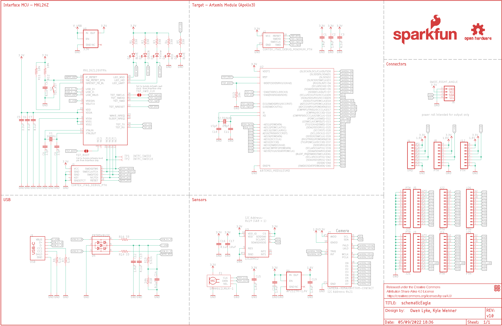
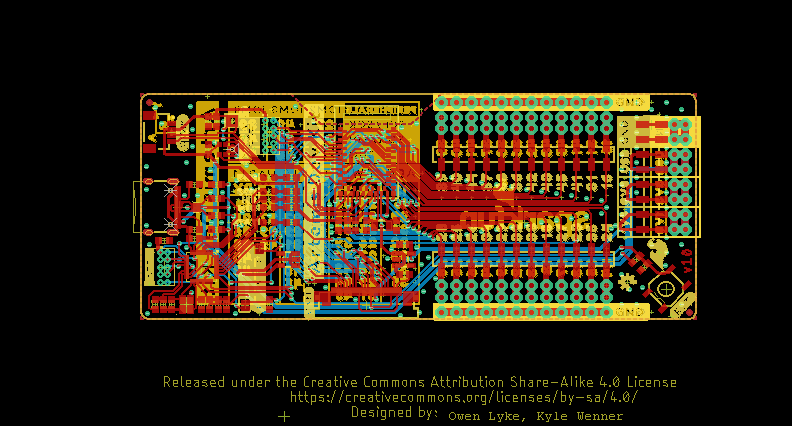
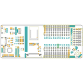
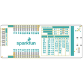
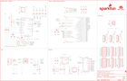
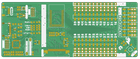
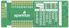

Contents
========

* [PRS16828 > ArtemisDevKit](#prs16828--artemisdevkit)
	* [Schematic](#schematic)
	* [PCB](#pcb)
	* [Interactive BOM](#interactive-bom)
	* [OOMP Parts](#oomp-parts)
	* [Images](#images)
	* [Tags](#tags)
  
![][im]
# PRS16828 > ArtemisDevKit

- ID: PROJ-SPAR-16828-STAN-01
- Hex ID: PRS16828
- Name: Sparkfun
- Description: Sparkfun
- Long Link: [http://oom.lt/PROJ-SPAR-16828-STAN-01](http://oom.lt/PROJ-SPAR-16828-STAN-01)
- Short Link: [http://oom.lt/PRS16828](http://oom.lt/PRS16828)

## Schematic
  

## PCB
  

## Interactive BOM

- Interactive BOM page: [ibom.html](https://htmlpreview.github.io/?https://github.com/oomlout/oomlout_OOMP_projects/blob/main/PROJ-SPAR-16828-STAN-01/kicad/bom/ibom.html)

## OOMP Parts
  

|OOMP ID|Name|Identifier|
| :---: | :---: | :---: |
|[CAPC-0603-X-UF10-V63D](https://github.com/oomlout/oomlout_OOMP_parts/tree/main/CAPC-0603-X-UF10-V63D/)|[SMD (0603) 10 uF Capacitor (Ceramic) 6.3v](https://github.com/oomlout/oomlout_OOMP_parts/tree/main/CAPC-0603-X-UF10-V63D/)|[C1, C17](https://github.com/oomlout/oomlout_OOMP_parts/tree/main/CAPC-0603-X-UF10-V63D/)|
|CAPC-0603-X-UNMATCHED-01||C2, C12, C15, C18, C19|
|[CAPC-0603-X-NF100-V50](https://github.com/oomlout/oomlout_OOMP_parts/tree/main/CAPC-0603-X-NF100-V50/)|[SMD (0603) 100 nF Capacitor (Ceramic) 50v](https://github.com/oomlout/oomlout_OOMP_parts/tree/main/CAPC-0603-X-NF100-V50/)|[C3, C4, C6, C7, C13, C14, C16](https://github.com/oomlout/oomlout_OOMP_parts/tree/main/CAPC-0603-X-NF100-V50/)|
|[CAPC-0603-X-UF22D-V10](https://github.com/oomlout/oomlout_OOMP_parts/tree/main/CAPC-0603-X-UF22D-V10/)|[SMD (0603) 2.2 uF Capacitor (Ceramic) 10v](https://github.com/oomlout/oomlout_OOMP_parts/tree/main/CAPC-0603-X-UF22D-V10/)|[C5](https://github.com/oomlout/oomlout_OOMP_parts/tree/main/CAPC-0603-X-UF22D-V10/)|
|[CAPC-0603-X-PF12-V50](https://github.com/oomlout/oomlout_OOMP_parts/tree/main/CAPC-0603-X-PF12-V50/)|[SMD (0603) 12 pF Capacitor (Ceramic) 50v](https://github.com/oomlout/oomlout_OOMP_parts/tree/main/CAPC-0603-X-PF12-V50/)|[C8, C9](https://github.com/oomlout/oomlout_OOMP_parts/tree/main/CAPC-0603-X-PF12-V50/)|
|[CAPC-0603-X-PF15-V50](https://github.com/oomlout/oomlout_OOMP_parts/tree/main/CAPC-0603-X-PF15-V50/)|[SMD (0603) 15 pF Capacitor (Ceramic) 50v](https://github.com/oomlout/oomlout_OOMP_parts/tree/main/CAPC-0603-X-PF15-V50/)|[C10, C11](https://github.com/oomlout/oomlout_OOMP_parts/tree/main/CAPC-0603-X-PF15-V50/)|
|[LEDS-0603-L-STAN-01](https://github.com/oomlout/oomlout_OOMP_parts/tree/main/LEDS-0603-L-STAN-01/)|[SMD (0603) Blue LED](https://github.com/oomlout/oomlout_OOMP_parts/tree/main/LEDS-0603-L-STAN-01/)|[D1, D5](https://github.com/oomlout/oomlout_OOMP_parts/tree/main/LEDS-0603-L-STAN-01/)|
|[LEDS-0603-G-STAN-01](https://github.com/oomlout/oomlout_OOMP_parts/tree/main/LEDS-0603-G-STAN-01/)|[SMD (0603) Green LED](https://github.com/oomlout/oomlout_OOMP_parts/tree/main/LEDS-0603-G-STAN-01/)|[D2](https://github.com/oomlout/oomlout_OOMP_parts/tree/main/LEDS-0603-G-STAN-01/)|
|[LEDS-0603-Y-STAN-01](https://github.com/oomlout/oomlout_OOMP_parts/tree/main/LEDS-0603-Y-STAN-01/)|[SMD (0603) Yellow LED](https://github.com/oomlout/oomlout_OOMP_parts/tree/main/LEDS-0603-Y-STAN-01/)|[D3](https://github.com/oomlout/oomlout_OOMP_parts/tree/main/LEDS-0603-Y-STAN-01/)|
|[LEDS-0603-R-STAN-01](https://github.com/oomlout/oomlout_OOMP_parts/tree/main/LEDS-0603-R-STAN-01/)|[SMD (0603) Red LED](https://github.com/oomlout/oomlout_OOMP_parts/tree/main/LEDS-0603-R-STAN-01/)|[D4](https://github.com/oomlout/oomlout_OOMP_parts/tree/main/LEDS-0603-R-STAN-01/)|
|DIOD-UNMATCHED-X-UNMATCHED-01||D6|
|UNMATCHED-UNMATCHED-X-UNMATCHED-01||E1, J1, J2, J3, J6, J7, S2, TP1, TP2, U1, U2, U3, X1, Y1|
|[HEAD-I01-X-PI08-01](https://github.com/oomlout/oomlout_OOMP_parts/tree/main/HEAD-I01-X-PI08-01/)|[2.54 mm 8 Pin Header](https://github.com/oomlout/oomlout_OOMP_parts/tree/main/HEAD-I01-X-PI08-01/)|[J4, J8, J12](https://github.com/oomlout/oomlout_OOMP_parts/tree/main/HEAD-I01-X-PI08-01/)|
|[HEAD-I01-X-PI12-01](https://github.com/oomlout/oomlout_OOMP_parts/tree/main/HEAD-I01-X-PI12-01/)|[2.54 mm 12 Pin Header](https://github.com/oomlout/oomlout_OOMP_parts/tree/main/HEAD-I01-X-PI12-01/)|[J5, J9, J14, J22, J23, J24, J25, J26](https://github.com/oomlout/oomlout_OOMP_parts/tree/main/HEAD-I01-X-PI12-01/)|
|[RESE-0603-X-O331-01](https://github.com/oomlout/oomlout_OOMP_parts/tree/main/RESE-0603-X-O331-01/)|[SMD (0603) 330 Ohm Resistor](https://github.com/oomlout/oomlout_OOMP_parts/tree/main/RESE-0603-X-O331-01/)|[R1, R2, R3, R4, R5](https://github.com/oomlout/oomlout_OOMP_parts/tree/main/RESE-0603-X-O331-01/)|
|[RESE-0603-X-O472-01](https://github.com/oomlout/oomlout_OOMP_parts/tree/main/RESE-0603-X-O472-01/)|[SMD (0603) 4.7k Ohm Resistor](https://github.com/oomlout/oomlout_OOMP_parts/tree/main/RESE-0603-X-O472-01/)|[R6, R7](https://github.com/oomlout/oomlout_OOMP_parts/tree/main/RESE-0603-X-O472-01/)|
|[RESE-0603-X-O103-01](https://github.com/oomlout/oomlout_OOMP_parts/tree/main/RESE-0603-X-O103-01/)|[SMD (0603) 10k Ohm Resistor](https://github.com/oomlout/oomlout_OOMP_parts/tree/main/RESE-0603-X-O103-01/)|[R11, R12, R13, R20](https://github.com/oomlout/oomlout_OOMP_parts/tree/main/RESE-0603-X-O103-01/)|
|[RESE-0603-X-O330-01](https://github.com/oomlout/oomlout_OOMP_parts/tree/main/RESE-0603-X-O330-01/)|[SMD (0603) 33 Ohm Resistor](https://github.com/oomlout/oomlout_OOMP_parts/tree/main/RESE-0603-X-O330-01/)|[R16, R18](https://github.com/oomlout/oomlout_OOMP_parts/tree/main/RESE-0603-X-O330-01/)|
|RESE-0603-X-UNMATCHED-01||R19|
|UNMATCHED-SO235-X-UNMATCHED-01||U4|
|[VREG-SO235-X-KAP2112K-V33D](https://github.com/oomlout/oomlout_OOMP_parts/tree/main/VREG-SO235-X-KAP2112K-V33D/)|[SMD (SOT-23-5) AP2112K Voltage Regulator 3.3v](https://github.com/oomlout/oomlout_OOMP_parts/tree/main/VREG-SO235-X-KAP2112K-V33D/)|[U5](https://github.com/oomlout/oomlout_OOMP_parts/tree/main/VREG-SO235-X-KAP2112K-V33D/)|

## Images
  
  

|bominteractivefront|bominteractiveback|kicadPcb3d|kicadPcb3dFront|kicadPcb3dBack|eagleImage|eagleSchemImage|pcbdraw|pcbdrawback|
| :---: | :---: | :---: | :---: | :---: | :---: | :---: | :---: | :---: |
||||||||||

## Tags

- hexID: PRS16828
- oompType: PROJ
- oompSize: SPAR
- oompColor: 16828
- oompDesc: STAN
- oompIndex: 01
- oompName: ArtemisDevKit
- sources: All source files from https://github.com/sparkfun/ArtemisDevKit (source licence details in srcLicense.md)
- linkBuyPage: https://www.sparkfun.com/products/16828
- oompID: PROJ-SPAR-16828-STAN-01
- oompParts: C1,CAPC-0603-X-UF10-V63D
- oompParts: C2,CAPC-0603-X-UNMATCHED-01
- oompParts: C3,CAPC-0603-X-NF100-V50
- oompParts: C4,CAPC-0603-X-NF100-V50
- oompParts: C5,CAPC-0603-X-UF22D-V10
- oompParts: C6,CAPC-0603-X-NF100-V50
- oompParts: C7,CAPC-0603-X-NF100-V50
- oompParts: C8,CAPC-0603-X-PF12-V50
- oompParts: C9,CAPC-0603-X-PF12-V50
- oompParts: C10,CAPC-0603-X-PF15-V50
- oompParts: C11,CAPC-0603-X-PF15-V50
- oompParts: C12,CAPC-0603-X-UNMATCHED-01
- oompParts: C13,CAPC-0603-X-NF100-V50
- oompParts: C14,CAPC-0603-X-NF100-V50
- oompParts: C15,CAPC-0603-X-UNMATCHED-01
- oompParts: C16,CAPC-0603-X-NF100-V50
- oompParts: C17,CAPC-0603-X-UF10-V63D
- oompParts: C18,CAPC-0603-X-UNMATCHED-01
- oompParts: C19,CAPC-0603-X-UNMATCHED-01
- oompParts: D1,LEDS-0603-L-STAN-01
- oompParts: D2,LEDS-0603-G-STAN-01
- oompParts: D3,LEDS-0603-Y-STAN-01
- oompParts: D4,LEDS-0603-R-STAN-01
- oompParts: D5,LEDS-0603-L-STAN-01
- oompParts: D6,DIOD-UNMATCHED-X-UNMATCHED-01
- oompParts: E1,UNMATCHED-UNMATCHED-X-UNMATCHED-01
- oompParts: J1,UNMATCHED-UNMATCHED-X-UNMATCHED-01
- oompParts: J2,UNMATCHED-UNMATCHED-X-UNMATCHED-01
- oompParts: J3,UNMATCHED-UNMATCHED-X-UNMATCHED-01
- oompParts: J4,HEAD-I01-X-PI08-01
- oompParts: J5,HEAD-I01-X-PI12-01
- oompParts: J6,UNMATCHED-UNMATCHED-X-UNMATCHED-01
- oompParts: J7,UNMATCHED-UNMATCHED-X-UNMATCHED-01
- oompParts: J8,HEAD-I01-X-PI08-01
- oompParts: J9,HEAD-I01-X-PI12-01
- oompParts: J12,HEAD-I01-X-PI08-01
- oompParts: J14,HEAD-I01-X-PI12-01
- oompParts: J22,HEAD-I01-X-PI12-01
- oompParts: J23,HEAD-I01-X-PI12-01
- oompParts: J24,HEAD-I01-X-PI12-01
- oompParts: J25,HEAD-I01-X-PI12-01
- oompParts: J26,HEAD-I01-X-PI12-01
- oompParts: R1,RESE-0603-X-O331-01
- oompParts: R2,RESE-0603-X-O331-01
- oompParts: R3,RESE-0603-X-O331-01
- oompParts: R4,RESE-0603-X-O331-01
- oompParts: R5,RESE-0603-X-O331-01
- oompParts: R6,RESE-0603-X-O472-01
- oompParts: R7,RESE-0603-X-O472-01
- oompParts: R11,RESE-0603-X-O103-01
- oompParts: R12,RESE-0603-X-O103-01
- oompParts: R13,RESE-0603-X-O103-01
- oompParts: R16,RESE-0603-X-O330-01
- oompParts: R18,RESE-0603-X-O330-01
- oompParts: R19,RESE-0603-X-UNMATCHED-01
- oompParts: R20,RESE-0603-X-O103-01
- oompParts: S2,UNMATCHED-UNMATCHED-X-UNMATCHED-01
- oompParts: TP1,UNMATCHED-UNMATCHED-X-UNMATCHED-01
- oompParts: TP2,UNMATCHED-UNMATCHED-X-UNMATCHED-01
- oompParts: U1,UNMATCHED-UNMATCHED-X-UNMATCHED-01
- oompParts: U2,UNMATCHED-UNMATCHED-X-UNMATCHED-01
- oompParts: U3,UNMATCHED-UNMATCHED-X-UNMATCHED-01
- oompParts: U4,UNMATCHED-SO235-X-UNMATCHED-01
- oompParts: U5,VREG-SO235-X-KAP2112K-V33D
- oompParts: X1,UNMATCHED-UNMATCHED-X-UNMATCHED-01
- oompParts: Y1,UNMATCHED-UNMATCHED-X-UNMATCHED-01
- rawParts: C1,10uF,10UF-0603-6.3V-20%,0603,10.0µF ceramic capacitors,,,CAP-11015,,,10uF,
- rawParts: C2,1.0uF,1.0UF-0603-16V-10%,0603,1µF ceramic capacitors,,,CAP-00868,,,1.0uF,
- rawParts: C3,0.1uF,0.1UF-0603-25V-5%,0603,0.1µF ceramic capacitors,,,CAP-08604,,,0.1uF,
- rawParts: C4,0.1uF,0.1UF-0603-25V-5%,0603,0.1µF ceramic capacitors,,,CAP-08604,,,0.1uF,
- rawParts: C5,2.2uF,2.2UF-0603-10V-20%,0603,2.2µF ceramic capacitors,,,CAP-07888,,,2.2uF,
- rawParts: C6,0.1uF,0.1UF-0603-25V-5%,0603,0.1µF ceramic capacitors,,,CAP-08604,,,0.1uF,
- rawParts: C7,0.1uF,0.1UF-0603-25V-5%,0603,0.1µF ceramic capacitors,,,CAP-08604,,,0.1uF,
- rawParts: C8,12pF,12PF-0603-50V-5%,0603,12pF ceramic capacitors,,,CAP-09137,,,12pF,
- rawParts: C9,12pF,12PF-0603-50V-5%,0603,12pF ceramic capacitors,,,CAP-09137,,,12pF,
- rawParts: C10,15pF,15PF-0603-50V-5%,0603,15pF ceramic capacitors,,,CAP-07881,,,15pF,
- rawParts: C11,15pF,15PF-0603-50V-5%,0603,15pF ceramic capacitors,,,CAP-07881,,,15pF,
- rawParts: C12,1.0uF,1.0UF-0603-16V-10%,0603,1µF ceramic capacitors,,,CAP-00868,,,1.0uF,
- rawParts: C13,0.1uF,0.1UF-0603-25V-5%,0603,0.1µF ceramic capacitors,,,CAP-08604,,,0.1uF,
- rawParts: C14,0.1uF,0.1UF-0603-25V-5%,0603,0.1µF ceramic capacitors,,,CAP-08604,,,0.1uF,
- rawParts: C15,1.0uF,1.0UF-0603-16V-10%,0603,1µF ceramic capacitors,,,CAP-00868,,,1.0uF,
- rawParts: C16,0.1uF,0.1UF-0603-25V-5%,0603,0.1µF ceramic capacitors,,,CAP-08604,,,0.1uF,
- rawParts: C17,10uF,10UF-0603-6.3V-20%,0603,10.0µF ceramic capacitors,,,CAP-11015,,,10uF,
- rawParts: C18,1.0uF,1.0UF-0603-16V-10%,0603,1µF ceramic capacitors,,,CAP-00868,,,1.0uF,
- rawParts: C19,1.0uF,1.0UF-0603-16V-10%,0603,1µF ceramic capacitors,,,CAP-00868,,,1.0uF,
- rawParts: D1,BLUE,LED-BLUE0603,LED-0603,Blue SMD LED,,,DIO-08575,,,BLUE,
- rawParts: D2,GREEN,LED-GREEN0603,LED-0603,Green SMD LED,,,DIO-00821,,,GREEN,
- rawParts: D3,Yellow,LED-YELLOW0603,LED-0603,Yellow SMD LED,,,DIO-09003,,,Yellow,
- rawParts: D4,RED,LED-RED0603,LED-0603,Red SMD LED,,,DIO-00819,,,RED,
- rawParts: D5,BLUE,LED-BLUE0603,LED-0603,Blue SMD LED,,,DIO-08575,,,BLUE,
- rawParts: D6,PRTR5V0U2F,PRTR5V0U2F,SOT886,A small ESD protection device. Most commonly used on USB D+/D- signals to protect large, expensive, or especially sensitive USB enabled devices.,,,DIO-14084,,,,
- rawParts: E1,SPH0641LM4H-1,SPH0641LM4H-1_MICROPHONE,SPH0641LM4H-1_MICROPHONE,SPH0641LM4H-1 Microphone,,,IC-14361,,,SPH0641LM4H-1,
- rawParts: FD1,FIDUCIAL1X2,FIDUCIAL1X2,FIDUCIAL-1X2,Fiducial Alignment Points,,,,,,,
- rawParts: FD2,FIDUCIAL1X2,FIDUCIAL1X2,FIDUCIAL-1X2,Fiducial Alignment Points,,,,,,,
- rawParts: FD3,FIDUCIAL1X2,FIDUCIAL1X2,FIDUCIAL-1X2,Fiducial Alignment Points,,,,,,,
- rawParts: FD4,FIDUCIAL1X2,FIDUCIAL1X2,FIDUCIAL-1X2,Fiducial Alignment Points,,,,,,,
- rawParts: FRAME1,FRAME-LEDGER,FRAME-LEDGER,CREATIVE_COMMONS,Schematic Frame - Ledger,Owen Lyke, Kyle Wenner,,,v10,,,
- rawParts: J1,USB,USB_C_2-LAYER,USB-C-16P,USB Type C 16Pin Connector,,,CONN-14122,,,,
- rawParts: J2,CORTEX_JTAG_DEBUG_MINIMUM_PTH,CORTEX_JTAG_DEBUG_MINIMUM_PTH,2X5-PTH-1.27MM,Cortex Debug Connector - 10 pin,,,,,,,
- rawParts: J3,CORTEX_JTAG_DEBUG_PTH,CORTEX_JTAG_DEBUG_PTH,2X5-PTH-1.27MM,Cortex Debug Connector - 10 pin,,,,,,,
- rawParts: J4,SMD,CONN_08SMD-COMBO-FEMALE,1X08_SMD_COMBINED,Multi connection point. Often used as Generic Header-pin footprint for 0.1 inch spaced/style header connections,,,CONN-10204,,PRT-11543,,
- rawParts: J5,,CONN_12SMD_COMBINED,1X12_SMD_COMBINED,Multi connection point. Often used as Generic Header-pin footprint for 0.1 inch spaced/style header connections,,,CONN-15197,,,,
- rawParts: J6,QWIIC_RIGHT_ANGLE,QWIIC_CONNECTORJS-1MM,JST04_1MM_RA,SparkFun I2C Standard Qwiic Connector,,,CONN-13694,,,QWIIC_RIGHT_ANGLE,
- rawParts: J7,CAMERA-HIMAXBOTTOM-CONTACT,CAMERA-HIMAXBOTTOM-CONTACT,FPC-24-AMPHENOL-SFV24R-1STE1HLF,,,609-4320-2-ND,CONN-14233,,,,
- rawParts: J8,PTH,CONN_08NO_SILK_DNP,1X08_NO_SILK,Multi connection point. Often used as Generic Header-pin footprint for 0.1 inch spaced/style header connections,,,,,,,
- rawParts: J9,,CONN_12SMD_COMBINED,1X12_SMD_COMBINED,Multi connection point. Often used as Generic Header-pin footprint for 0.1 inch spaced/style header connections,,,CONN-15197,,,,
- rawParts: J12,PTH,CONN_08NO_SILK_DNP,1X08_NO_SILK,Multi connection point. Often used as Generic Header-pin footprint for 0.1 inch spaced/style header connections,,,,,,,
- rawParts: J14,PTH,CONN_12NO_SILK,1X12_NO_SILK,Multi connection point. Often used as Generic Header-pin footprint for 0.1 inch spaced/style header connections,,,,,,,
- rawParts: J22,PTH,CONN_12NO_SILK,1X12_NO_SILK,Multi connection point. Often used as Generic Header-pin footprint for 0.1 inch spaced/style header connections,,,,,,,
- rawParts: J23,PTH,CONN_12NO_SILK,1X12_NO_SILK,Multi connection point. Often used as Generic Header-pin footprint for 0.1 inch spaced/style header connections,,,,,,,
- rawParts: J24,PTH,CONN_12NO_SILK,1X12_NO_SILK,Multi connection point. Often used as Generic Header-pin footprint for 0.1 inch spaced/style header connections,,,,,,,
- rawParts: J25,PTH,CONN_12NO_SILK,1X12_NO_SILK,Multi connection point. Often used as Generic Header-pin footprint for 0.1 inch spaced/style header connections,,,,,,,
- rawParts: J26,PTH,CONN_12NO_SILK,1X12_NO_SILK,Multi connection point. Often used as Generic Header-pin footprint for 0.1 inch spaced/style header connections,,,,,,,
- rawParts: LOGO1,OSHW-LOGOS,OSHW-LOGOS,OSHW-LOGO-S,Open-Source Hardware (OSHW) Logo,,,,,,,
- rawParts: LOGO2,SFE_LOGO_NAME_FLAME.2_INCH,SFE_LOGO_NAME_FLAME.2_INCH,SFE_LOGO_NAME_FLAME_.2,SparkFun Font Logo w/ Flame,,,,,,,
- rawParts: R1,330,330OHM-0603-1/10W-1%,0603,330Ω resistor,,,RES-00818,,,330,
- rawParts: R2,330,330OHM-0603-1/10W-1%,0603,330Ω resistor,,,RES-00818,,,330,
- rawParts: R3,330,330OHM-0603-1/10W-1%,0603,330Ω resistor,,,RES-00818,,,330,
- rawParts: R4,330,330OHM-0603-1/10W-1%,0603,330Ω resistor,,,RES-00818,,,330,
- rawParts: R5,330,330OHM-0603-1/10W-1%,0603,330Ω resistor,,,RES-00818,,,330,
- rawParts: R6,5.1k,5.1KOHM5.1KOHM-0603-1/10W-1%,0603,,,,RES-12083,,,5.1k,
- rawParts: R7,5.1k,5.1KOHM5.1KOHM-0603-1/10W-1%,0603,,,,RES-12083,,,5.1k,
- rawParts: R11,10k,10KOHM-0603-1/10W-1%,0603,10kΩ resistor,,,RES-00824,,,10k,
- rawParts: R12,10k,10KOHM-0603-1/10W-1%,0603,10kΩ resistor,,,RES-00824,,,10k,
- rawParts: R13,10k,10KOHM-0603-1/10W-1%,0603,10kΩ resistor,,,RES-00824,,,10k,
- rawParts: R16,33,33OHM-0603-1/10W-1%,0603,33Ω resistor,,,RES-08270,,,33,
- rawParts: R18,33,33OHM-0603-1/10W-1%,0603,33Ω resistor,,,RES-08270,,,33,
- rawParts: R19,5.62k,5.62KOHM-0603-1/10W-1%,0603,5.62kΩ resistor,,,RES-09823,,,5.62k,
- rawParts: R20,10k,10KOHM-0603-1/10W-1%,0603,10kΩ resistor,,,RES-00824,,,10k,
- rawParts: S2,TGT_RST,MOMENTARY-SWITCH-SPST-SMD-5.2MM-TALL,TACTILE_SWITCH_SMD_5.2MM,Momentary Switch (Pushbutton) - SPST,,,SWCH-14139,,,,
- rawParts: TGT_BOOT,JUMPER-SMT_2_NC_TRACE_SILK,JUMPER-SMT_2_NC_TRACE_SILK,SMT-JUMPER_2_NC_TRACE_SILK,Normally closed trace jumper,,,,,,,
- rawParts: TGT_SWD_CLK,JUMPER-SMT_2_NC_TRACE_SILK,JUMPER-SMT_2_NC_TRACE_SILK,SMT-JUMPER_2_NC_TRACE_SILK,Normally closed trace jumper,,,,,,,
- rawParts: TP1,INTFC_SWDIO,TEST-POINT3,PAD.03X.03,SparkFun Test Points,,,,,,,
- rawParts: TP2,INTFC_SWDCLK,TEST-POINT3,PAD.03X.03,SparkFun Test Points,,,,,,,
- rawParts: U1,DAPLINK_KL26Z128VFM4,DAPLINK_KL26Z128VFM4,QFN-32-NOPAD,Unfinished!,,,IC-15168,,,,
- rawParts: U2,ARTEMIS_MODULESMD,ARTEMIS_MODULESMD,ARTEMIS_FP,Description: The Artemis Module from SparkFun is a Cortex-M4F with BLE 5.0 running up to 96MHz and with as low power as 6uA per MHz (less than 5mW). This is the worlds first module to bridge the market between hobbyists and consumer products. Weve packaged all the power of a modern microcontroller into a module that is both extremely easy to use but is mass-market ready.,,,SUB-14479,,,,
- rawParts: U3,LIS2DH12,LIS2DH12,LGA-12-LISDH12,,,497-14851-2-ND,IC-14229,,,,
- rawParts: U4,AP2127K-1.8V,V_REG_AP2127K-1.8V,SOT23-5,AP2127 - 300mA CMOS LDO Regulator w/ Enable,,,VREG-14239,,,AP2127K-1.8V,
- rawParts: U5,3.3V,V_REG_AP2112K-3.3V,SOT23-5,AP2112 - 600mA CMOS LDO Regulator w/ Enable,,,VREG-12457,,,3.3V,
- rawParts: X1,16MHz,CRYSTAL-16MHZ_SMALL,CRYSTAL-SMD-2X2.5MM,16 MHz Crystal,,,XTAL-14664,,,16MHz,
- rawParts: Y1,32.768kHz,CRYSTAL-32.768KHZSMD-3.2X1.5,CRYSTAL-SMD-3.2X1.5MM,32.768kHz Crystal,,,XTAL-13062,,,32.768kHz,

[im]: kicadPcb3d_450.png
