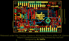
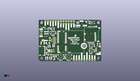
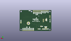
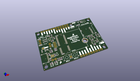

Contents
========

* [PROJ-SPAR-16829-STAN-01>MicroMod Data Logging Carrier](#proj-spar-16829-stan-01micromod-data-logging-carrier)
	* [Images](#images)
	* [Interactive BOM](#interactive-bom)
	* [OOMP Parts](#oomp-parts)
	* [Tags](#tags)
  
![][im]
# PROJ-SPAR-16829-STAN-01>MicroMod Data Logging Carrier

- ID: PROJ-SPAR-16829-STAN-01
- Hex ID: PRS16829
- Name: MicroMod Data Logging Carrier
- Description: 

## Images
  
  

|eagleImage|kicadPcb3dFront|kicadPcb3dBack|kicadPcb3d|
| :---: | :---: | :---: | :---: |
|||||

## Interactive BOM

- Interactive BOM page: [ibom.html](kicad/bom/ibom.html)

## OOMP Parts
  

|OOMP Parts|
| :---: |
|UNMATCHED-UNMATCHED-X-UNMATCHED-01, 3V3_LED, 10.16, 3.8099999999999996, M180,3V3_LED, SMT-JUMPER_2_NC_TRACE_SILK, SparkFun-Jumpers, (0.4, 0.15), MR180|
|UNMATCHED-UNMATCHED-X-UNMATCHED-01, BT1, 44.449999999999996, 36.83, 0,BT1, ML414H, ML414H_IV01E, SparkFun-Batteries, (1.75, 1.45), R0|
|UNMATCHED-UNMATCHED-X-UNMATCHED-01, BYP, 3.8099999999999996, 20.32, 0,BYP, JUMPER-SMT_2_NO_SILK, SMT-JUMPER_2_NO_SILK, SparkFun-Jumpers, (0.15, 0.8), R0|
|<table><tr><td></td><td> C1</td><td>[CAPC-0603-X-NF100-V50 SMD (0603) 100 nF Capacitor (Ceramic) 50v](https://github.com/oomlout/oomlout_OOMP_parts/tree/main/CAPC-0603-X-NF100-V50/)</td><td>[C6N100](https://github.com/oomlout/oomlout_OOMP_parts/tree/main/CAPC-0603-X-NF100-V50/)</td></tr></table>|
|CAPC-UNMATCHED-X-UNMATCHED-01, C2, 8.889999999999999, 17.779999999999998, 180,C2, 10uF, EIA3216, SparkFun-Capacitors, (0.35, 0.7), R180|
|CAPC-0603-X-UNMATCHED-01, C3, 13.97, 25.145999999999997, 0,C3, 4.7uF, 0603, SparkFun-Capacitors, (0.55, 0.99), R0|
|CAPC-0603-X-UNMATCHED-01, C4, 12.7, 31.75, 90,C4, 4.7uF, 0603, SparkFun-Capacitors, (0.5, 1.25), R90|
|CAPC-0603-X-UNMATCHED-01, C5, 13.97, 5.08, 270,C5, 1.0uF, 0603, SparkFun-Capacitors, (0.55, 0.2), R270|
|<table><tr><td></td><td> C6</td><td>[CAPC-0603-X-NF100-V50 SMD (0603) 100 nF Capacitor (Ceramic) 50v](https://github.com/oomlout/oomlout_OOMP_parts/tree/main/CAPC-0603-X-NF100-V50/)</td><td>[C6N100](https://github.com/oomlout/oomlout_OOMP_parts/tree/main/CAPC-0603-X-NF100-V50/)</td></tr></table>|
|CAPC-0603-X-NF220-V50, C7, 17.018, 5.08, 270,C7, 0.22uF, 0603, SparkFun-Capacitors, (0.67, 0.2), R270|
|CAPC-0603-X-UNMATCHED-01, C8, 52.45099999999999, 17.779999999999998, 0,C8, 1.0uF, 0603, SparkFun-Capacitors, (2.065, 0.7), R0|
|CAPC-0603-X-UNMATCHED-01, C9, 54.102, 10.16, 270,C9, 1.0uF, 0603, SparkFun-Capacitors, (2.13, 0.4), R270|
|CAPC-0603-X-NF220-V50, C13, 10.16, 13.97, 0,C13, 0.22uF, 0603, SparkFun-Capacitors, (0.4, 0.55), R0|
|<table><tr><td></td><td> C46</td><td>[CAPC-0603-X-NF100-V50 SMD (0603) 100 nF Capacitor (Ceramic) 50v](https://github.com/oomlout/oomlout_OOMP_parts/tree/main/CAPC-0603-X-NF100-V50/)</td><td>[C6N100](https://github.com/oomlout/oomlout_OOMP_parts/tree/main/CAPC-0603-X-NF100-V50/)</td></tr></table>|
|UNMATCHED-UNMATCHED-X-UNMATCHED-01, D1, 14.604999999999999, 10.16, 270,D1, 3.3V, SOD-323, SparkFun-DiscreteSemi, (0.575, 0.4), R270|
|UNMATCHED-0603-X-UNMATCHED-01, D2, 10.16, 31.75, 0,D2, Yellow, LED-0603, SparkFun-LED, (0.4, 1.25), R0|
|UNMATCHED-UNMATCHED-X-UNMATCHED-01, D3, 11.43, 27.94, 90,D3, 3A/10V/280mV, SOD-323, SparkFun-DiscreteSemi, (0.45, 1.1), R90|
|UNMATCHED-UNMATCHED-X-UNMATCHED-01, D4, 53.339999999999996, 38.099999999999994, 90,D4, BAS70-05, SOT23-3, SparkFun-DiscreteSemi, (2.1, 1.5), R90|
|UNMATCHED-0603-X-UNMATCHED-01, D5, 7.619999999999999, 2.54, 0,D5, RED, LED-0603, SparkFun-LED, (0.3, 0.1), R0|
|UNMATCHED-UNMATCHED-X-UNMATCHED-01, D6, 50.8, 38.099999999999994, 90,D6, 3A/10V/280mV, SOD-323, SparkFun-DiscreteSemi, (2, 1.5), R90|
|UNMATCHED-0603-X-UNMATCHED-01, D7, 11.43, 2.54, 0,D7, Yellow, LED-0603, SparkFun-LED, (0.45, 0.1), R0|
|UNMATCHED-1210-X-UNMATCHED-01, F2, 3.8099999999999996, 17.779999999999998, 0,F2, 6V/2A, 1210, SparkFun-Fuses, (0.15, 0.7), R0|
|UNMATCHED-UNMATCHED-X-UNMATCHED-01, H5, 44.069, 14.985999999999999, 0,H5, STAND-OFF-REFLOW2.5MM_TALL, STAND-OFF-REFLOW-M2.5, SparkFun-Hardware, (1.735, 0.59), R0|
|UNMATCHED-UNMATCHED-X-UNMATCHED-01, J1, 6.35, 10.16, 270,J1, USB-C-16P-2LAYER-PADS, SparkFun-Connectors, (0.25, 0.4), R270|
|UNMATCHED-UNMATCHED-X-UNMATCHED-01, J2, 15.239999999999998, 20.32, 270,J2, JTAG, 2X5-PTH-1.27MM, SparkFun-Connectors, (0.6, 0.8), R270|
|UNMATCHED-UNMATCHED-X-UNMATCHED-01, J3, 55.88, 11.43, 90,J3, QWIIC_RIGHT_ANGLE, JST04_1MM_RA, SparkFun-Connectors, (2.2, 0.45), R90|
|UNMATCHED-UNMATCHED-X-UNMATCHED-01, J4, 3.8099999999999996, 27.94, 90,J4, JST-2-SMD, SparkFun-Connectors, (0.15, 1.1), R90|
|UNMATCHED-UNMATCHED-X-UNMATCHED-01, J5, 34.29, 1.27, 0,J5, UART, 1X04_NO_SILK, SparkFun-Connectors, (1.35, 0.05), R0|
|UNMATCHED-UNMATCHED-X-UNMATCHED-01, J6, 24.13, 19.049999999999997, 270,J6, MICROMOD-2222-C, M.2-CONNECTOR-E, SparkFun-MicroMod, (0.95, 0.75), R270|
|UNMATCHED-UNMATCHED-X-UNMATCHED-01, J7, 2.54, 29.209999999999997, 270,J7, 1X02_NO_SILK, SparkFun-Connectors, (0.1, 1.15), R270|
|UNMATCHED-UNMATCHED-X-UNMATCHED-01, J8, 34.29, 36.83, 180,J8, Dedicated, 1X06_NO_SILK, SparkFun-Connectors, (1.35, 1.45), R180|
|UNMATCHED-UNMATCHED-X-UNMATCHED-01, J9, 54.60999999999999, 1.27, 0,J9, 1X01_NO_SILK, SparkFun-Connectors, (2.15, 0.05), R0|
|UNMATCHED-UNMATCHED-X-UNMATCHED-01, J10, 21.59, 39.37, 0,J10, 1X06_NO_SILK, SparkFun-Connectors, (0.85, 1.55), R0|
|UNMATCHED-UNMATCHED-X-UNMATCHED-01, J11, 44.449999999999996, 19.049999999999997, 270,J11, microSD, MICRO-SD-SOCKET, SparkFun-Connectors, (1.75, 0.75), R270|
|UNMATCHED-UNMATCHED-X-UNMATCHED-01, J12, 19.049999999999997, 39.37, 180,J12, SPI, 1X06_NO_SILK, SparkFun-Connectors, (0.75, 1.55), R180|
|UNMATCHED-UNMATCHED-X-UNMATCHED-01, J13, 25.4, 3.8099999999999996, 0,J13, 1X01_NO_SILK, SparkFun-Connectors, (1, 0.15), R0|
|UNMATCHED-UNMATCHED-X-UNMATCHED-01, J14, 44.449999999999996, 1.27, 0,J14, I2C, 1X04_NO_SILK, SparkFun-Connectors, (1.75, 0.05), R0|
|UNMATCHED-UNMATCHED-X-UNMATCHED-01, JP1, 58.419999999999995, 16.509999999999998, M90,JP1, SMT-JUMPER_3_2-NC_TRACE_SILK, SparkFun-Jumpers, (2.3, 0.65), MR90|
|UNMATCHED-UNMATCHED-X-UNMATCHED-01, MEAS, 10.668, 6.35, M180,MEAS, COMBO-JUMPER_2_NC_TRACE, SparkFun-Jumpers, (0.42, 0.25), MR180|
|UNMATCHED-UNMATCHED-X-UNMATCHED-01, MEAS_BATT, 10.795, 21.59, M270,MEAS_BATT, COMBO-JUMPER_2_NC_TRACE, SparkFun-Jumpers, (0.425, 0.85), MR270|
|RESE-0603-X-UNMATCHED-01, R1, 59.69, 16.509999999999998, 90,R1, 2.2k, 0603, SparkFun-Resistors, (2.35, 0.65), R90|
|RESE-0603-X-UNMATCHED-01, R2, 7.619999999999999, 12.7, 270,R2, 5.1k, 0603, SparkFun-Resistors, (0.3, 0.5), R270|
|RESE-0603-X-UNMATCHED-01, R3, 7.619999999999999, 7.619999999999999, 90,R3, 5.1k, 0603, SparkFun-Resistors, (0.3, 0.3), R90|
|RESE-0603-X-UNMATCHED-01, R4, 57.40399999999999, 16.509999999999998, 90,R4, 2.2k, 0603, SparkFun-Resistors, (2.26, 0.65), R90|
|<table><tr><td></td><td> R5</td><td>[RESE-0603-X-O104-01 SMD (0603) 100k Ohm Resistor](https://github.com/oomlout/oomlout_OOMP_parts/tree/main/RESE-0603-X-O104-01/)</td><td>[R6104](https://github.com/oomlout/oomlout_OOMP_parts/tree/main/RESE-0603-X-O104-01/)</td></tr></table>|
|RESE-0603-X-UNMATCHED-01, R6, 16.509999999999998, 27.94, 270,R6, 2.2k, 0603, SparkFun-Resistors, (0.65, 1.1), R270|
|RESE-0603-X-UNMATCHED-01, R7, 14.985999999999999, 31.75, 90,R7, 1k, 0603, SparkFun-Resistors, (0.59, 1.25), R90|
|RESE-0603-X-UNMATCHED-01, R8, 49.149, 38.099999999999994, 270,R8, 3.3k, 0603, SparkFun-Resistors, (1.935, 1.5), R270|
|<table><tr><td></td><td> R9</td><td>[RESE-0603-X-O103-01 SMD (0603) 10k Ohm Resistor](https://github.com/oomlout/oomlout_OOMP_parts/tree/main/RESE-0603-X-O103-01/)</td><td>[R6103](https://github.com/oomlout/oomlout_OOMP_parts/tree/main/RESE-0603-X-O103-01/)</td></tr></table>|
|<table><tr><td></td><td> R10</td><td>[RESE-0603-X-O203-01 SMD (0603) 20k Ohm Resistor](https://github.com/oomlout/oomlout_OOMP_parts/tree/main/RESE-0603-X-O203-01/)</td><td>[R6203](https://github.com/oomlout/oomlout_OOMP_parts/tree/main/RESE-0603-X-O203-01/)</td></tr></table>|
|RESE-0603-X-UNMATCHED-01, R11, 7.619999999999999, 3.8099999999999996, 0,R11, 1k, 0603, SparkFun-Resistors, (0.3, 0.15), R0|
|RESE-0603-X-UNMATCHED-01, R12, 11.43, 3.8099999999999996, 0,R12, 4.7k, 0603, SparkFun-Resistors, (0.45, 0.15), R0|
|<table><tr><td></td><td> R13</td><td>[RESE-0603-X-O104-01 SMD (0603) 100k Ohm Resistor](https://github.com/oomlout/oomlout_OOMP_parts/tree/main/RESE-0603-X-O104-01/)</td><td>[R6104](https://github.com/oomlout/oomlout_OOMP_parts/tree/main/RESE-0603-X-O104-01/)</td></tr></table>|
|<table><tr><td></td><td> R14</td><td>[RESE-0603-X-O104-01 SMD (0603) 100k Ohm Resistor](https://github.com/oomlout/oomlout_OOMP_parts/tree/main/RESE-0603-X-O104-01/)</td><td>[R6104](https://github.com/oomlout/oomlout_OOMP_parts/tree/main/RESE-0603-X-O104-01/)</td></tr></table>|
|<table><tr><td></td><td> R15</td><td>[RESE-0603-X-O104-01 SMD (0603) 100k Ohm Resistor](https://github.com/oomlout/oomlout_OOMP_parts/tree/main/RESE-0603-X-O104-01/)</td><td>[R6104](https://github.com/oomlout/oomlout_OOMP_parts/tree/main/RESE-0603-X-O104-01/)</td></tr></table>|
|UNMATCHED-UNMATCHED-X-UNMATCHED-01, S1, 29.209999999999997, 4.191, 180,S1, Reset, TACTILE_SWITCH_SMD_5.2MM, SparkFun-Switches, (1.15, 0.165), R180|
|UNMATCHED-UNMATCHED-X-UNMATCHED-01, S2, 21.59, 4.191, 180,S2, BOOT, TACTILE_SWITCH_SMD_5.2MM, SparkFun-Switches, (0.85, 0.165), R180|
|UNMATCHED-UNMATCHED-X-UNMATCHED-01, U1, 50.8, 10.16, 270,U1, 3.3V, SOT23-5, SparkFun-IC-Power, (2, 0.4), R270|
|UNMATCHED-UNMATCHED-X-UNMATCHED-01, U2, 13.97, 27.94, 180,U2, MCP73831, SOT23-5, SparkFun-IC-Power, (0.55, 1.1), R180|
|UNMATCHED-UNMATCHED-X-UNMATCHED-01, U3, 50.8, 15.239999999999998, 270,U3, 3.3V, SOT23-5, SparkFun-IC-Power, (2, 0.6), R270|
|UNMATCHED-UNMATCHED-X-UNMATCHED-01, U5, 10.16, 10.16, 0,U5, AP7361C-33, UDFN-8, SparkFun-IC-Power, (0.4, 0.4), R0|
|UNMATCHED-UNMATCHED-X-UNMATCHED-01, VE, 20.32, 8.889999999999999, M0,VE, SMT-JUMPER_2_NO_SILK, SparkFun-Jumpers, (0.8, 0.35), MR0|
|UNMATCHED-UNMATCHED-X-UNMATCHED-01, VIN_LED, 16.509999999999998, 3.8099999999999996, M180,VIN_LED, SMT-JUMPER_2_NC_TRACE_SILK, SparkFun-Jumpers, (0.65, 0.15), MR180|

## Tags

- hexID: PRS16829
- oompType: PROJ
- oompSize: SPAR
- oompColor: 16829
- oompDesc: STAN
- oompIndex: 01
- oompName: MicroMod Data Logging Carrier
- sources: All source files from https://github.com/sparkfun/MicroMod_Data_Logging_Carrier (source licence details in srcLicense.md)
- linkBuyPage: https://www.sparkfun.com/products/16829
- oompPart: UNMATCHED-UNMATCHED-X-UNMATCHED-01, 3V3_LED, 10.16, 3.8099999999999996, M180
- oompPart: UNMATCHED-UNMATCHED-X-UNMATCHED-01, BT1, 44.449999999999996, 36.83, 0
- oompPart: UNMATCHED-UNMATCHED-X-UNMATCHED-01, BYP, 3.8099999999999996, 20.32, 0
- oompPart: CAPC-0603-X-NF100-V50, C1, 10.16, 15.493999999999998, 0
- oompPart: CAPC-UNMATCHED-X-UNMATCHED-01, C2, 8.889999999999999, 17.779999999999998, 180
- oompPart: CAPC-0603-X-UNMATCHED-01, C3, 13.97, 25.145999999999997, 0
- oompPart: CAPC-0603-X-UNMATCHED-01, C4, 12.7, 31.75, 90
- oompPart: CAPC-0603-X-UNMATCHED-01, C5, 13.97, 5.08, 270
- oompPart: CAPC-0603-X-NF100-V50, C6, 15.493999999999998, 5.08, 270
- oompPart: CAPC-0603-X-NF220-V50, C7, 17.018, 5.08, 270
- oompPart: CAPC-0603-X-UNMATCHED-01, C8, 52.45099999999999, 17.779999999999998, 0
- oompPart: CAPC-0603-X-UNMATCHED-01, C9, 54.102, 10.16, 270
- oompPart: CAPC-0603-X-NF220-V50, C13, 10.16, 13.97, 0
- oompPart: CAPC-0603-X-NF100-V50, C46, 54.102, 15.239999999999998, 270
- oompPart: UNMATCHED-UNMATCHED-X-UNMATCHED-01, D1, 14.604999999999999, 10.16, 270
- oompPart: UNMATCHED-0603-X-UNMATCHED-01, D2, 10.16, 31.75, 0
- oompPart: UNMATCHED-UNMATCHED-X-UNMATCHED-01, D3, 11.43, 27.94, 90
- oompPart: UNMATCHED-UNMATCHED-X-UNMATCHED-01, D4, 53.339999999999996, 38.099999999999994, 90
- oompPart: UNMATCHED-0603-X-UNMATCHED-01, D5, 7.619999999999999, 2.54, 0
- oompPart: UNMATCHED-UNMATCHED-X-UNMATCHED-01, D6, 50.8, 38.099999999999994, 90
- oompPart: UNMATCHED-0603-X-UNMATCHED-01, D7, 11.43, 2.54, 0
- oompPart: UNMATCHED-1210-X-UNMATCHED-01, F2, 3.8099999999999996, 17.779999999999998, 0
- oompPart: SKIP-UNMATCHED-X-UNMATCHED-01, FD1, 0.7619999999999999, 0.7619999999999999, 0
- oompPart: SKIP-UNMATCHED-X-UNMATCHED-01, FD2, 60.198, 40.004999999999995, 0
- oompPart: SKIP-UNMATCHED-X-UNMATCHED-01, FD3, 0.7619999999999999, 0.7619999999999999, M0
- oompPart: SKIP-UNMATCHED-X-UNMATCHED-01, FD4, 60.198, 40.004999999999995, M0
- oompPart: UNMATCHED-UNMATCHED-X-UNMATCHED-01, H5, 44.069, 14.985999999999999, 0
- oompPart: UNMATCHED-UNMATCHED-X-UNMATCHED-01, J1, 6.35, 10.16, 270
- oompPart: UNMATCHED-UNMATCHED-X-UNMATCHED-01, J2, 15.239999999999998, 20.32, 270
- oompPart: UNMATCHED-UNMATCHED-X-UNMATCHED-01, J3, 55.88, 11.43, 90
- oompPart: UNMATCHED-UNMATCHED-X-UNMATCHED-01, J4, 3.8099999999999996, 27.94, 90
- oompPart: UNMATCHED-UNMATCHED-X-UNMATCHED-01, J5, 34.29, 1.27, 0
- oompPart: UNMATCHED-UNMATCHED-X-UNMATCHED-01, J6, 24.13, 19.049999999999997, 270
- oompPart: UNMATCHED-UNMATCHED-X-UNMATCHED-01, J7, 2.54, 29.209999999999997, 270
- oompPart: UNMATCHED-UNMATCHED-X-UNMATCHED-01, J8, 34.29, 36.83, 180
- oompPart: UNMATCHED-UNMATCHED-X-UNMATCHED-01, J9, 54.60999999999999, 1.27, 0
- oompPart: UNMATCHED-UNMATCHED-X-UNMATCHED-01, J10, 21.59, 39.37, 0
- oompPart: UNMATCHED-UNMATCHED-X-UNMATCHED-01, J11, 44.449999999999996, 19.049999999999997, 270
- oompPart: UNMATCHED-UNMATCHED-X-UNMATCHED-01, J12, 19.049999999999997, 39.37, 180
- oompPart: UNMATCHED-UNMATCHED-X-UNMATCHED-01, J13, 25.4, 3.8099999999999996, 0
- oompPart: UNMATCHED-UNMATCHED-X-UNMATCHED-01, J14, 44.449999999999996, 1.27, 0
- oompPart: UNMATCHED-UNMATCHED-X-UNMATCHED-01, JP1, 58.419999999999995, 16.509999999999998, M90
- oompPart: UNMATCHED-UNMATCHED-X-UNMATCHED-01, MEAS, 10.668, 6.35, M180
- oompPart: UNMATCHED-UNMATCHED-X-UNMATCHED-01, MEAS_BATT, 10.795, 21.59, M270
- oompPart: RESE-0603-X-UNMATCHED-01, R1, 59.69, 16.509999999999998, 90
- oompPart: RESE-0603-X-UNMATCHED-01, R2, 7.619999999999999, 12.7, 270
- oompPart: RESE-0603-X-UNMATCHED-01, R3, 7.619999999999999, 7.619999999999999, 90
- oompPart: RESE-0603-X-UNMATCHED-01, R4, 57.40399999999999, 16.509999999999998, 90
- oompPart: RESE-0603-X-O104-01, R5, 12.7, 10.16, 270
- oompPart: RESE-0603-X-UNMATCHED-01, R6, 16.509999999999998, 27.94, 270
- oompPart: RESE-0603-X-UNMATCHED-01, R7, 14.985999999999999, 31.75, 90
- oompPart: RESE-0603-X-UNMATCHED-01, R8, 49.149, 38.099999999999994, 270
- oompPart: RESE-0603-X-O103-01, R9, 15.239999999999998, 15.239999999999998, 90
- oompPart: RESE-0603-X-O203-01, R10, 13.716, 15.239999999999998, 270
- oompPart: RESE-0603-X-UNMATCHED-01, R11, 7.619999999999999, 3.8099999999999996, 0
- oompPart: RESE-0603-X-UNMATCHED-01, R12, 11.43, 3.8099999999999996, 0
- oompPart: RESE-0603-X-O104-01, R13, 50.8, 7.619999999999999, 0
- oompPart: RESE-0603-X-O104-01, R14, 50.8, 12.7, 0
- oompPart: RESE-0603-X-O104-01, R15, 49.149, 17.779999999999998, 0
- oompPart: UNMATCHED-UNMATCHED-X-UNMATCHED-01, S1, 29.209999999999997, 4.191, 180
- oompPart: UNMATCHED-UNMATCHED-X-UNMATCHED-01, S2, 21.59, 4.191, 180
- oompPart: UNMATCHED-UNMATCHED-X-UNMATCHED-01, U1, 50.8, 10.16, 270
- oompPart: UNMATCHED-UNMATCHED-X-UNMATCHED-01, U2, 13.97, 27.94, 180
- oompPart: UNMATCHED-UNMATCHED-X-UNMATCHED-01, U3, 50.8, 15.239999999999998, 270
- oompPart: UNMATCHED-UNMATCHED-X-UNMATCHED-01, U5, 10.16, 10.16, 0
- oompPart: UNMATCHED-UNMATCHED-X-UNMATCHED-01, VE, 20.32, 8.889999999999999, M0
- oompPart: UNMATCHED-UNMATCHED-X-UNMATCHED-01, VIN_LED, 16.509999999999998, 3.8099999999999996, M180
- rawPart: 3V3_LED, SMT-JUMPER_2_NC_TRACE_SILK, SparkFun-Jumpers, (0.4, 0.15), MR180
- rawPart: BT1, ML414H, ML414H_IV01E, SparkFun-Batteries, (1.75, 1.45), R0
- rawPart: BYP, JUMPER-SMT_2_NO_SILK, SMT-JUMPER_2_NO_SILK, SparkFun-Jumpers, (0.15, 0.8), R0
- rawPart: C1, 0.1uF, 0603, SparkFun-Capacitors, (0.4, 0.61), R0
- rawPart: C2, 10uF, EIA3216, SparkFun-Capacitors, (0.35, 0.7), R180
- rawPart: C3, 4.7uF, 0603, SparkFun-Capacitors, (0.55, 0.99), R0
- rawPart: C4, 4.7uF, 0603, SparkFun-Capacitors, (0.5, 1.25), R90
- rawPart: C5, 1.0uF, 0603, SparkFun-Capacitors, (0.55, 0.2), R270
- rawPart: C6, 0.1uF, 0603, SparkFun-Capacitors, (0.61, 0.2), R270
- rawPart: C7, 0.22uF, 0603, SparkFun-Capacitors, (0.67, 0.2), R270
- rawPart: C8, 1.0uF, 0603, SparkFun-Capacitors, (2.065, 0.7), R0
- rawPart: C9, 1.0uF, 0603, SparkFun-Capacitors, (2.13, 0.4), R270
- rawPart: C13, 0.22uF, 0603, SparkFun-Capacitors, (0.4, 0.55), R0
- rawPart: C46, 0.1uF, 0603, SparkFun-Capacitors, (2.13, 0.6), R270
- rawPart: D1, 3.3V, SOD-323, SparkFun-DiscreteSemi, (0.575, 0.4), R270
- rawPart: D2, Yellow, LED-0603, SparkFun-LED, (0.4, 1.25), R0
- rawPart: D3, 3A/10V/280mV, SOD-323, SparkFun-DiscreteSemi, (0.45, 1.1), R90
- rawPart: D4, BAS70-05, SOT23-3, SparkFun-DiscreteSemi, (2.1, 1.5), R90
- rawPart: D5, RED, LED-0603, SparkFun-LED, (0.3, 0.1), R0
- rawPart: D6, 3A/10V/280mV, SOD-323, SparkFun-DiscreteSemi, (2, 1.5), R90
- rawPart: D7, Yellow, LED-0603, SparkFun-LED, (0.45, 0.1), R0
- rawPart: F2, 6V/2A, 1210, SparkFun-Fuses, (0.15, 0.7), R0
- rawPart: FD1, FIDUCIALUFIDUCIAL, FIDUCIAL-MICRO, SparkFun-Aesthetics, (0.03, 0.03), R0
- rawPart: FD2, FIDUCIALUFIDUCIAL, FIDUCIAL-MICRO, SparkFun-Aesthetics, (2.37, 1.575), R0
- rawPart: FD3, FIDUCIALUFIDUCIAL, FIDUCIAL-MICRO, SparkFun-Aesthetics, (0.03, 0.03), MR0
- rawPart: FD4, FIDUCIALUFIDUCIAL, FIDUCIAL-MICRO, SparkFun-Aesthetics, (2.37, 1.575), MR0
- rawPart: H5, STAND-OFF-REFLOW2.5MM_TALL, STAND-OFF-REFLOW-M2.5, SparkFun-Hardware, (1.735, 0.59), R0
- rawPart: J1, USB-C-16P-2LAYER-PADS, SparkFun-Connectors, (0.25, 0.4), R270
- rawPart: J2, JTAG, 2X5-PTH-1.27MM, SparkFun-Connectors, (0.6, 0.8), R270
- rawPart: J3, QWIIC_RIGHT_ANGLE, JST04_1MM_RA, SparkFun-Connectors, (2.2, 0.45), R90
- rawPart: J4, JST-2-SMD, SparkFun-Connectors, (0.15, 1.1), R90
- rawPart: J5, UART, 1X04_NO_SILK, SparkFun-Connectors, (1.35, 0.05), R0
- rawPart: J6, MICROMOD-2222-C, M.2-CONNECTOR-E, SparkFun-MicroMod, (0.95, 0.75), R270
- rawPart: J7, 1X02_NO_SILK, SparkFun-Connectors, (0.1, 1.15), R270
- rawPart: J8, Dedicated, 1X06_NO_SILK, SparkFun-Connectors, (1.35, 1.45), R180
- rawPart: J9, 1X01_NO_SILK, SparkFun-Connectors, (2.15, 0.05), R0
- rawPart: J10, 1X06_NO_SILK, SparkFun-Connectors, (0.85, 1.55), R0
- rawPart: J11, microSD, MICRO-SD-SOCKET, SparkFun-Connectors, (1.75, 0.75), R270
- rawPart: J12, SPI, 1X06_NO_SILK, SparkFun-Connectors, (0.75, 1.55), R180
- rawPart: J13, 1X01_NO_SILK, SparkFun-Connectors, (1, 0.15), R0
- rawPart: J14, I2C, 1X04_NO_SILK, SparkFun-Connectors, (1.75, 0.05), R0
- rawPart: JP1, SMT-JUMPER_3_2-NC_TRACE_SILK, SparkFun-Jumpers, (2.3, 0.65), MR90
- rawPart: MEAS, COMBO-JUMPER_2_NC_TRACE, SparkFun-Jumpers, (0.42, 0.25), MR180
- rawPart: MEAS_BATT, COMBO-JUMPER_2_NC_TRACE, SparkFun-Jumpers, (0.425, 0.85), MR270
- rawPart: R1, 2.2k, 0603, SparkFun-Resistors, (2.35, 0.65), R90
- rawPart: R2, 5.1k, 0603, SparkFun-Resistors, (0.3, 0.5), R270
- rawPart: R3, 5.1k, 0603, SparkFun-Resistors, (0.3, 0.3), R90
- rawPart: R4, 2.2k, 0603, SparkFun-Resistors, (2.26, 0.65), R90
- rawPart: R5, 100k, 0603, SparkFun-Resistors, (0.5, 0.4), R270
- rawPart: R6, 2.2k, 0603, SparkFun-Resistors, (0.65, 1.1), R270
- rawPart: R7, 1k, 0603, SparkFun-Resistors, (0.59, 1.25), R90
- rawPart: R8, 3.3k, 0603, SparkFun-Resistors, (1.935, 1.5), R270
- rawPart: R9, 10k, 0603, SparkFun-Resistors, (0.6, 0.6), R90
- rawPart: R10, 20k, 0603, SparkFun-Resistors, (0.54, 0.6), R270
- rawPart: R11, 1k, 0603, SparkFun-Resistors, (0.3, 0.15), R0
- rawPart: R12, 4.7k, 0603, SparkFun-Resistors, (0.45, 0.15), R0
- rawPart: R13, 100k, 0603, SparkFun-Resistors, (2, 0.3), R0
- rawPart: R14, 100k, 0603, SparkFun-Resistors, (2, 0.5), R0
- rawPart: R15, 100k, 0603, SparkFun-Resistors, (1.935, 0.7), R0
- rawPart: S1, Reset, TACTILE_SWITCH_SMD_5.2MM, SparkFun-Switches, (1.15, 0.165), R180
- rawPart: S2, BOOT, TACTILE_SWITCH_SMD_5.2MM, SparkFun-Switches, (0.85, 0.165), R180
- rawPart: U1, 3.3V, SOT23-5, SparkFun-IC-Power, (2, 0.4), R270
- rawPart: U2, MCP73831, SOT23-5, SparkFun-IC-Power, (0.55, 1.1), R180
- rawPart: U3, 3.3V, SOT23-5, SparkFun-IC-Power, (2, 0.6), R270
- rawPart: U5, AP7361C-33, UDFN-8, SparkFun-IC-Power, (0.4, 0.4), R0
- rawPart: VE, SMT-JUMPER_2_NO_SILK, SparkFun-Jumpers, (0.8, 0.35), MR0
- rawPart: VIN_LED, SMT-JUMPER_2_NC_TRACE_SILK, SparkFun-Jumpers, (0.65, 0.15), MR180
- oompID: PROJ-SPAR-16829-STAN-01

[im]: kicadPcb3d_450.png
