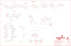

Contents
========

* [PRS16829 > MicroMod Data Logging Carrier](#prs16829--micromod-data-logging-carrier)
	* [Schematic](#schematic)
	* [PCB](#pcb)
	* [Interactive BOM](#interactive-bom)
	* [Images](#images)
	* [Tags](#tags)
  
![][im]
# PRS16829 > MicroMod Data Logging Carrier

- ID: PROJ-SPAR-16829-STAN-01
- Hex ID: PRS16829
- Name: Sparkfun
- Description: Sparkfun
- Long Link: [http://oom.lt/PROJ-SPAR-16829-STAN-01](http://oom.lt/PROJ-SPAR-16829-STAN-01)
- Short Link: [http://oom.lt/PRS16829](http://oom.lt/PRS16829)

## Schematic
  

## PCB
  

## Interactive BOM

- Interactive BOM page: [ibom.html](https://htmlpreview.github.io/?https://github.com/oomlout/oomlout_OOMP_projects/blob/main/PROJ-SPAR-16829-STAN-01/kicad/bom/ibom.html)

## Images
  
  

|bominteractivefront|bominteractiveback|kicadPcb3d|kicadPcb3dFront|kicadPcb3dBack|eagleImage|eagleSchemImage|pcbdraw|pcbdrawback|
| :---: | :---: | :---: | :---: | :---: | :---: | :---: | :---: | :---: |
||||||||||

## Tags

- hexID: PRS16829
- oompType: PROJ
- oompSize: SPAR
- oompColor: 16829
- oompDesc: STAN
- oompIndex: 01
- oompName: MicroMod Data Logging Carrier
- sources: All source files from https://github.com/sparkfun/MicroMod_Data_Logging_Carrier (source licence details in srcLicense.md)
- linkBuyPage: https://www.sparkfun.com/products/16829
- oompID: PROJ-SPAR-16829-STAN-01
- rawParts: 3V3_LED,,JUMPER-SMT_2_NC_TRACE_SILK,SMT-JUMPER_2_NC_TRACE_SILK,Normally closed trace jumper,,,,,,
- rawParts: BT1,ML414H,ML414H_IV01E_BATTERY,ML414H_IV01E,SEIKO ML414H-IV01E Reflowable Lithium Battery,,BATT-14267,,,,
- rawParts: BYP,JUMPER-SMT_2_NO_SILK,JUMPER-SMT_2_NO_SILK,SMT-JUMPER_2_NO_SILK,Normally open jumper,,,,,,
- rawParts: C1,0.1uF,0.1UF-0603-25V-(+80/-20%),0603,0.1µF ceramic capacitors,,CAP-00810,,,0.1uF,
- rawParts: C2,10uF,10UF-POLAR-EIA3216-16V-10%(TANT),EIA3216,10.0µF polarized capacitors,,CAP-00811,,,10uF,
- rawParts: C3,4.7uF,4.7UF-0603-35V-(20%),0603,4.7µF ceramic capacitors,,CAP-14106,,,4.7uF,
- rawParts: C4,4.7uF,4.7UF-0603-6.3V-(10%),0603,4.7µF ceramic capacitors,,CAP-08280,,,4.7uF,
- rawParts: C5,1.0uF,1.0UF-0603-16V-10%,0603,1µF ceramic capacitors,,CAP-00868,,,1.0uF,
- rawParts: C6,0.1uF,0.1UF-0603-25V-(+80/-20%),0603,0.1µF ceramic capacitors,,CAP-00810,,,0.1uF,
- rawParts: C7,0.22uF,0.22UF-0603-25V-10%,0603,0.22µF ceramic capacitors,,CAP-07822,,,0.22uF,
- rawParts: C8,1.0uF,1.0UF-0603-16V-10%,0603,1µF ceramic capacitors,,CAP-00868,,,1.0uF,
- rawParts: C9,1.0uF,1.0UF-0603-16V-10%,0603,1µF ceramic capacitors,,CAP-00868,,,1.0uF,
- rawParts: C13,0.22uF,0.22UF-0603-25V-10%,0603,0.22µF ceramic capacitors,,CAP-07822,,,0.22uF,
- rawParts: C46,0.1uF,0.1UF-0603-25V-(+80/-20%),0603,0.1µF ceramic capacitors,,CAP-00810,,,0.1uF,
- rawParts: D1,3.3V,DIODE-ZENER-MM3Z3V3T1G,SOD-323,Zener Diode,,DIO-11284,,,3.3V,
- rawParts: D2,Yellow,LED-YELLOW0603,LED-0603,Yellow SMD LED,,DIO-09003,,,Yellow,
- rawParts: D3,3A/10V/280mV,DIODE-SCHOTTKY-BAT60A,SOD-323,Schottky diode,,DIO-14072,,,3A/10V/280mV,
- rawParts: D4,BAS70-05,DIODE-SCHOTTKY-DUAL,SOT23-3,Diodes Incorporated - BAS70-05 Dual Schottky Diode,,DIO-14829,,,BAS70-05,
- rawParts: D5,RED,LED-RED0603,LED-0603,Red SMD LED,,DIO-00819,,,RED,
- rawParts: D6,3A/10V/280mV,DIODE-SCHOTTKY-BAT60A,SOD-323,Schottky diode,,DIO-14072,,,3A/10V/280mV,
- rawParts: D7,Yellow,LED-YELLOW0603,LED-0603,Yellow SMD LED,,DIO-09003,,,Yellow,
- rawParts: F2,6V/2A,PPTC_6V2A,1210,Resettable Fuse PPTC,,RES-14313,,,6V/2A,
- rawParts: FD1,FIDUCIALUFIDUCIAL,FIDUCIALUFIDUCIAL,FIDUCIAL-MICRO,Fiducial Alignment Points,,,,,,
- rawParts: FD2,FIDUCIALUFIDUCIAL,FIDUCIALUFIDUCIAL,FIDUCIAL-MICRO,Fiducial Alignment Points,,,,,,
- rawParts: FD3,FIDUCIALUFIDUCIAL,FIDUCIALUFIDUCIAL,FIDUCIAL-MICRO,Fiducial Alignment Points,,,,,,
- rawParts: FD4,FIDUCIALUFIDUCIAL,FIDUCIALUFIDUCIAL,FIDUCIAL-MICRO,Fiducial Alignment Points,,,,,,
- rawParts: FRAME1,FRAME-LEDGER,FRAME-LEDGER,CREATIVE_COMMONS,Schematic Frame - Ledger,,,,,,
- rawParts: H1,STAND-OFF,STAND-OFF,STAND-OFF,Stand Off,,,,,,
- rawParts: H2,STAND-OFF,STAND-OFF,STAND-OFF,Stand Off,,,,,,
- rawParts: H3,STAND-OFF,STAND-OFF,STAND-OFF,Stand Off,,,,,,
- rawParts: H4,STAND-OFF,STAND-OFF,STAND-OFF,Stand Off,,,,,,
- rawParts: H5,STAND-OFF-REFLOW2.5MM_TALL,STAND-OFF-REFLOW2.5MM_TALL,STAND-OFF-REFLOW-M2.5,Stand Off Reflow Compatible,,HW-14899,,,,
- rawParts: J1,,USB_C_2-LAYER_PADS,USB-C-16P-2LAYER-PADS,USB Type C 16Pin Connector,,CONN-14122,,,,
- rawParts: J2,JTAG,CORTEX_JTAG_DEBUG_MINIMUM_PTH,2X5-PTH-1.27MM,Cortex Debug Connector - 10 pin,,,,,,
- rawParts: J3,QWIIC_RIGHT_ANGLE,QWIIC_CONNECTORJS-1MM,JST04_1MM_RA,SparkFun I2C Standard Qwiic Connector,,CONN-13694,,,QWIIC_RIGHT_ANGLE,
- rawParts: J4,,JST_2MM_MALE,JST-2-SMD,JST 2MM MALE RA CONNECTOR,,CONN-11443,,PRT-08612,,
- rawParts: J5,UART,CONN_041X04_NO_SILK,1X04_NO_SILK,Multi connection point. Often used as Generic Header-pin footprint for 0.1 inch spaced/style header connections,,CONN-09696,,,,
- rawParts: J6,MICROMOD-2222-C,MICROMOD-2222-C,M.2-CONNECTOR-E,MicroMod Connector,,CONN-14877,,,,
- rawParts: J7,,CONN_021X02_NO_SILK,1X02_NO_SILK,Multi connection point. Often used as Generic Header-pin footprint for 0.1 inch spaced/style header connections,,,,,,
- rawParts: J8,Dedicated,CONN_06NO_SILK_NO_POP,1X06_NO_SILK,Multi connection point. Often used as Generic Header-pin footprint for 0.1 inch spaced/style header connections,,,,,,
- rawParts: J9,,CONN_01PTH_NO_SILK_YES_STOP,1X01_NO_SILK,Single connection point. Often used as Generic Header-pin footprint for 0.1 inch spaced/style header connections,,,,,,
- rawParts: J10,,CONN_06NO_SILK_NO_POP,1X06_NO_SILK,Multi connection point. Often used as Generic Header-pin footprint for 0.1 inch spaced/style header connections,,,,,,
- rawParts: J11,microSD,MICRO-SD-SDIOPUSH-PUSH,MICRO-SD-SOCKET,microSD Socket for Transflash,,CONN-07820,,,,
- rawParts: J12,SPI,CONN_06NO_SILK_NO_POP,1X06_NO_SILK,Multi connection point. Often used as Generic Header-pin footprint for 0.1 inch spaced/style header connections,,,,,,
- rawParts: J13,,CONN_01PTH_NO_SILK_YES_STOP,1X01_NO_SILK,Single connection point. Often used as Generic Header-pin footprint for 0.1 inch spaced/style header connections,,,,,,
- rawParts: J14,I2C,I2C_STANDARD_NO_SILK,1X04_NO_SILK,SparkFun I2C Standard Pinout Header,,,,,,
- rawParts: JP1,,JUMPER-SMT_3_2-NC_TRACE_SILK,SMT-JUMPER_3_2-NC_TRACE_SILK,Normally closed trace jumper (2 of 2 connections),,,,,,
- rawParts: LOGO1,SFE_LOGO_NAME_FLAME.1_INCH,SFE_LOGO_NAME_FLAME.1_INCH,SFE_LOGO_NAME_FLAME_.1,SparkFun Font Logo w/ Flame,,,,,,
- rawParts: LOGO2,QWIIC_LOGO_CONNECTOR,QWIIC_LOGO_CONNECTOR,QWIIC_5.5MM,Qwiic Logos for placement on schematic and PCB. The 5.5mm silk logo is best for placing next to Qwiic connector.,,,,,,
- rawParts: LOGO3,OSHW-LOGOMINI,OSHW-LOGOMINI,OSHW-LOGO-MINI,Open-Source Hardware (OSHW) Logo,,,,,,
- rawParts: MEAS,,JUMPER-COMBO_2_NC_TRACE,COMBO-JUMPER_2_NC_TRACE,,,,,,,
- rawParts: MEAS_BATT,,JUMPER-COMBO_2_NC_TRACE,COMBO-JUMPER_2_NC_TRACE,,,,,,,
- rawParts: R1,2.2k,2.2KOHM-0603-1/10W-1%,0603,2.2kΩ resistor,,RES-08272,,,2.2k,
- rawParts: R2,5.1k,5.1KOHM5.1KOHM-0603-1/10W-1%,0603,,,RES-12083,,,5.1k,
- rawParts: R3,5.1k,5.1KOHM5.1KOHM-0603-1/10W-1%,0603,,,RES-12083,,,5.1k,
- rawParts: R4,2.2k,2.2KOHM-0603-1/10W-1%,0603,2.2kΩ resistor,,RES-08272,,,2.2k,
- rawParts: R5,100k,100KOHM-0603-1/10W-1%,0603,100kΩ resistor,,RES-07828,,,100k,
- rawParts: R6,2.2k,2.2KOHM-0603-1/10W-1%,0603,2.2kΩ resistor,,RES-08272,,,2.2k,
- rawParts: R7,1k,1KOHM-0603-1/10W-1%,0603,1kΩ resistor,,RES-07856,,,1k,
- rawParts: R8,3.3k,3.3KOHM-0603-1/10W-1%,0603,3.3kΩ resistor,,RES-07851,,,3.3k,
- rawParts: R9,10k,10KOHM-0603-1/10W-1%,0603,10kΩ resistor,,RES-00824,,,10k,
- rawParts: R10,20k,20KOHM-0603-1/10W-1%,0603,20kΩ resistor,,RES-09383,,,20k,
- rawParts: R11,1k,1KOHM-0603-1/10W-1%,0603,1kΩ resistor,,RES-07856,,,1k,
- rawParts: R12,4.7k,4.7KOHM-0603-1/10W-1%,0603,4.7kΩ resistor,,RES-07857,,,4.7k,
- rawParts: R13,100k,100KOHM-0603-1/10W-1%,0603,100kΩ resistor,,RES-07828,,,100k,
- rawParts: R14,100k,100KOHM-0603-1/10W-1%,0603,100kΩ resistor,,RES-07828,,,100k,
- rawParts: R15,100k,100KOHM-0603-1/10W-1%,0603,100kΩ resistor,,RES-07828,,,100k,
- rawParts: S1,Reset,MOMENTARY-SWITCH-SPST-SMD-5.2-TALL-REDUNDANT,TACTILE_SWITCH_SMD_5.2MM,Momentary Switch (Pushbutton) - SPST,,SWCH-14139,,,,
- rawParts: S2,BOOT,MOMENTARY-SWITCH-SPST-SMD-5.2-TALL-REDUNDANT,TACTILE_SWITCH_SMD_5.2MM,Momentary Switch (Pushbutton) - SPST,,SWCH-14139,,,,
- rawParts: U1,3.3V,V_REG_AP2112K-3.3V,SOT23-5,AP2112 - 600mA CMOS LDO Regulator w/ Enable,,VREG-12457,,,3.3V,
- rawParts: U2,MCP73831,MCP73831,SOT23-5,MCP73831T Li-Ion, Li-Pol Controller,,IC-09995,,,,
- rawParts: U3,3.3V,V_REG_AP2112K-3.3V,SOT23-5,AP2112 - 600mA CMOS LDO Regulator w/ Enable,,VREG-12457,,,3.3V,
- rawParts: U5,AP7361C-33,AP7361C-33FGEUDFN-8,UDFN-8,AP7361C 3.3V LDO Regulator,,VREG-14094,,,,
- rawParts: VE,,JUMPER-SMT_2_NO_SILK,SMT-JUMPER_2_NO_SILK,Normally open jumper,,,,,,
- rawParts: VIN_LED,,JUMPER-SMT_2_NC_TRACE_SILK,SMT-JUMPER_2_NC_TRACE_SILK,Normally closed trace jumper,,,,,,

[im]: kicadPcb3d_450.png
