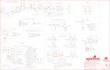

Contents
========

* [PRS16832 > OpenLog Artemis](#prs16832--openlog-artemis)
	* [Schematic](#schematic)
	* [PCB](#pcb)
	* [Interactive BOM](#interactive-bom)
	* [Images](#images)
	* [Tags](#tags)
  
![][im]
# PRS16832 > OpenLog Artemis

- ID: PROJ-SPAR-16832-STAN-01
- Hex ID: PRS16832
- Name: Sparkfun
- Description: Sparkfun
- Long Link: [http://oom.lt/PROJ-SPAR-16832-STAN-01](http://oom.lt/PROJ-SPAR-16832-STAN-01)
- Short Link: [http://oom.lt/PRS16832](http://oom.lt/PRS16832)

## Schematic
  

## PCB
  

## Interactive BOM

- Interactive BOM page: [ibom.html](https://htmlpreview.github.io/?https://github.com/oomlout/oomlout_OOMP_projects/blob/main/PROJ-SPAR-16832-STAN-01/kicad/bom/ibom.html)

## Images
  
  

|bominteractivefront|bominteractiveback|kicadPcb3d|kicadPcb3dFront|kicadPcb3dBack|eagleImage|eagleSchemImage|pcbdraw|pcbdrawback|
| :---: | :---: | :---: | :---: | :---: | :---: | :---: | :---: | :---: |
||||||||||

## Tags

- hexID: PRS16832
- oompType: PROJ
- oompSize: SPAR
- oompColor: 16832
- oompDesc: STAN
- oompIndex: 01
- oompName: OpenLog Artemis
- sources: All source files from https://github.com/sparkfun/OpenLog_Artemis (source licence details in srcLicense.md)
- linkBuyPage: https://www.sparkfun.com/products/16832
- oompID: PROJ-SPAR-16832-STAN-01
- rawParts: BT1,ML414H,ML414H_IV01E_BATTERY,ML414H_IV01E,SEIKO ML414H-IV01E Reflowable Lithium Battery,,BATT-14267,,,,
- rawParts: C1,1.0uF,1.0UF-0402T-16V-10%,0402-TIGHT,1µF ceramic capacitors,,CAP-12417,,,1.0uF,
- rawParts: C2,2.2uF,2.2UF-0402_TIGHT-10V-10%-X5R,0402-TIGHT,2.2µF ceramic capacitors,,CAP-14232,,,2.2uF,
- rawParts: C3,4.7uF,4.7UF-0402_TIGHT-6.3V-20%-X5R,0402-TIGHT,4.7µF ceramic capacitors,,CAP-14240,,,4.7uF,
- rawParts: C4,4.7uF,4.7UF-0402_TIGHT-6.3V-20%-X5R,0402-TIGHT,4.7µF ceramic capacitors,,CAP-14240,,,4.7uF,
- rawParts: C5,0.1uF,0.1UF-0402T-6.3V-10%-X7R,0402-TIGHT,0.1µF ceramic capacitors,,CAP-14993,,,0.1uF,
- rawParts: C7,2.2uF,2.2UF-0402_TIGHT-10V-10%-X5R,0402-TIGHT,2.2µF ceramic capacitors,,CAP-14232,,,2.2uF,
- rawParts: C29,15pF,15PF-0402T-50V-5%,0402-TIGHT,15pF ceramic capacitors,,CAP-13063,,,15pF,
- rawParts: C30,15pF,15PF-0402T-50V-5%,0402-TIGHT,15pF ceramic capacitors,,CAP-13063,,,15pF,
- rawParts: C31,0.1uF,0.1UF-0402T-16V-10%,0402-TIGHT,0.1µF ceramic capacitors,,CAP-12416,,,0.1uF,
- rawParts: C32,10uF,10UF-0402T-6.3V-20%,0402-TIGHT,10.0µF ceramic capacitors,,CAP-14848,,,10uF,
- rawParts: C33,1.0uF,1.0UF-0402T-16V-10%,0402-TIGHT,1µF ceramic capacitors,,CAP-12417,,,1.0uF,
- rawParts: C40,10nF,10NF-0402T-25V-10%,0402-TIGHT,0.01uF/10nF/10,000pF ceramic capacitors,,CAP-14847,,,10nF,
- rawParts: C41,0.1uF,0.1UF-0402T-16V-10%,0402-TIGHT,0.1µF ceramic capacitors,,CAP-12416,,,0.1uF,
- rawParts: C42,0.1uF,0.1UF-0402T-16V-10%,0402-TIGHT,0.1µF ceramic capacitors,,CAP-12416,,,0.1uF,
- rawParts: C43,0.1uF,0.1UF-0402T-16V-10%,0402-TIGHT,0.1µF ceramic capacitors,,CAP-12416,,,0.1uF,
- rawParts: C44,1.0nF,1.0NF/1000PF-0402_TIGHT-50V-10%,0402-TIGHT,1nF/1,000pF ceramic capacitors,,CAP-14280,,,1.0nF,
- rawParts: C46,0.1uF,0.1UF-0402T-16V-10%,0402-TIGHT,0.1µF ceramic capacitors,,CAP-12416,,,0.1uF,
- rawParts: C51,0.1uF,0.1UF-0402T-16V-10%,0402-TIGHT,0.1µF ceramic capacitors,,CAP-12416,,,0.1uF,
- rawParts: C52,0.1uF,0.1UF-0402T-16V-10%,0402-TIGHT,0.1µF ceramic capacitors,,CAP-12416,,,0.1uF,
- rawParts: C53,1.0uF,1.0UF-0402T-16V-10%,0402-TIGHT,1µF ceramic capacitors,,CAP-12417,,,1.0uF,
- rawParts: C54,1.0uF,1.0UF-0402T-16V-10%,0402-TIGHT,1µF ceramic capacitors,,CAP-12417,,,1.0uF,
- rawParts: D1,3A/10V/280mV,DIODE-SCHOTTKY-BAT60A,SOD-323,Schottky diode,,DIO-14072,,,3A/10V/280mV,
- rawParts: D2,Yellow,LED-YELLOW0603,LED-0603,Yellow SMD LED,,DIO-09003,,,Yellow,
- rawParts: D3,3A/10V/280mV,DIODE-SCHOTTKY-BAT60A,SOD-323,Schottky diode,,DIO-14072,,,3A/10V/280mV,
- rawParts: D6,1A/23V/620mV,DIODE-SCHOTTKY-BAT20J,SOD-323,Schottky diode,,DIO-11623,,,1A/23V/620mV,
- rawParts: D9,BLUE,LED-BLUE0603,LED-0603,Blue SMD LED,,DIO-08575,,,BLUE,
- rawParts: D11,Yellow,LED-YELLOW0603,LED-0603,Yellow SMD LED,,DIO-09003,,,Yellow,
- rawParts: D12,GREEN,LED-GREEN0603,LED-0603,Green SMD LED,,DIO-00821,,,GREEN,
- rawParts: FD1,FIDUCIAL1X2,FIDUCIAL1X2,FIDUCIAL-1X2,Fiducial Alignment Points,,,,,,
- rawParts: FD2,FIDUCIAL1X2,FIDUCIAL1X2,FIDUCIAL-1X2,Fiducial Alignment Points,,,,,,
- rawParts: FD3,FIDUCIAL1X2,FIDUCIAL1X2,FIDUCIAL-1X2,Fiducial Alignment Points,,,,,,
- rawParts: FD4,FIDUCIAL1X2,FIDUCIAL1X2,FIDUCIAL-1X2,Fiducial Alignment Points,,,,,,
- rawParts: FRAME1,FRAME-LEDGER,FRAME-LEDGER,CREATIVE_COMMONS,Schematic Frame - Ledger,,,,,,
- rawParts: GND,TEST-POINTTP_15TH_THRU,TEST-POINTTP_15TH_THRU,TP_15TH,SparkFun Test Points,,,,,,
- rawParts: H1,STAND-OFF,STAND-OFF,STAND-OFF,Stand Off,,,,,,
- rawParts: H2,STAND-OFF,STAND-OFF,STAND-OFF,Stand Off,,,,,,
- rawParts: H3,STAND-OFF,STAND-OFF,STAND-OFF,Stand Off,,,,,,
- rawParts: H4,STAND-OFF,STAND-OFF,STAND-OFF,Stand Off,,,,,,
- rawParts: J1,,CONN_021X02_NO_SILK,1X02_NO_SILK,Multi connection point. Often used as Generic Header-pin footprint for 0.1 inch spaced/style header connections,,,,,,
- rawParts: J2,,JST_2MM_MALE,JST-2-SMD,JST 2MM MALE RA CONNECTOR,,CONN-11443,,PRT-08612,,
- rawParts: J3,,CONN_021X02_NO_SILK,1X02_NO_SILK,Multi connection point. Often used as Generic Header-pin footprint for 0.1 inch spaced/style header connections,,,,,,
- rawParts: J4,,CONN_06NO_SILK_NO_POP,1X06_NO_SILK,Multi connection point. Often used as Generic Header-pin footprint for 0.1 inch spaced/style header connections,,,,,,
- rawParts: J5,,USB_C_4-LAYER_PADS,USB-C-16P_4LAYER-PADS,USB Type C 16Pin Connector,,CONN-14122,,,,
- rawParts: J6,MICRO-SD,MICRO-SD-SDIOPUSH-PUSH,MICRO-SD-SOCKET,microSD Socket for Transflash,,CONN-07820,,,,
- rawParts: J7,,CONN_01PTH_NO_SILK_YES_STOP,1X01_NO_SILK,Single connection point. Often used as Generic Header-pin footprint for 0.1 inch spaced/style header connections,,,,,,
- rawParts: J11,,QWIIC_CONNECTORJS-1MM,JST04_1MM_RA,SparkFun I2C Standard Qwiic Connector,,CONN-13694,,,QWIIC_RIGHT_ANGLE,
- rawParts: J14,CORTEX_JTAG,CORTEX_JTAG_DEBUG_MINIMUM_PTH,2X5-PTH-1.27MM,Cortex Debug Connector - 10 pin,,,,,,
- rawParts: JP2,MEAS,JUMPER-COMBO_2_NC_TRACE,COMBO-JUMPER_2_NC_TRACE,,,,,,,
- rawParts: LED1,RED,LED-RED0603,LED-0603,Red SMD LED,,DIO-00819,,,RED,
- rawParts: LOGO1,SFE_LOGO_NAME.1_INCH,SFE_LOGO_NAME.1_INCH,SFE_LOGO_NAME_.1,SparkFun Font Logo,,,,,,
- rawParts: LOGO2,OSHW-LOGOS,OSHW-LOGOS,OSHW-LOGO-S,Open-Source Hardware (OSHW) Logo,,,,,,
- rawParts: LOGO3,SPECIAL_INSTRUCTIONS-ORDERING,SPECIAL_INSTRUCTIONS-ORDERING,ORDERING_INSTRUCTIONS,Special Ordering/Production Instructions Alert,,,,,,
- rawParts: LOGO4,SFE_LOGO_FLAME.1_INCH,SFE_LOGO_FLAME.1_INCH,SFE_LOGO_FLAME_.1,SparkFun Flame Logo,,,,,,
- rawParts: LOGO5,SFE_LOGO_FLAME.1_INCH,SFE_LOGO_FLAME.1_INCH,SFE_LOGO_FLAME_.1,SparkFun Flame Logo,,,,,,
- rawParts: Q1,20V/0.2A/8MHz/1.2Ω/1Vth,MOSFET-NCH-RE1C00UNTL,SOT-416FL,N-channel MOSFETs,,TRANS-14399,,,20V/0.2A/8MHz/1.2Ω/1Vth,
- rawParts: Q2,20V/4.2A/52mΩ/1.4W,MOSFET_PCH-DMG2305UX-7,SOT23-3,P-channel MOSFETs,,TRAN-14388,,,20V/4.2A/52mΩ/1.4W,
- rawParts: Q3,20V/0.2A/8MHz/1.2Ω/1Vth,MOSFET-NCH-RE1C00UNTL,SOT-416FL,N-channel MOSFETs,,TRANS-14399,,,20V/0.2A/8MHz/1.2Ω/1Vth,
- rawParts: Q7,20V/0.2A/8MHz/1.2Ω/1Vth,MOSFET-NCH-RE1C00UNTL,SOT-416FL,N-channel MOSFETs,,TRANS-14399,,,20V/0.2A/8MHz/1.2Ω/1Vth,
- rawParts: Q9,20V/0.2A/8MHz/1.2Ω/1Vth,MOSFET-NCH-RE1C00UNTL,SOT-416FL,N-channel MOSFETs,,TRANS-14399,,,20V/0.2A/8MHz/1.2Ω/1Vth,
- rawParts: Q10,20V/0.2A/8MHz/1.2Ω/1Vth,MOSFET-NCH-RE1C00UNTL,SOT-416FL,N-channel MOSFETs,,TRANS-14399,,,20V/0.2A/8MHz/1.2Ω/1Vth,
- rawParts: QWIIC_3.3V,TEST-POINTTP_15TH_THRU,TEST-POINTTP_15TH_THRU,TP_15TH,SparkFun Test Points,,,,,,
- rawParts: R1,2.2k,2.2KOHM-0402T-1/16W-1%,0402-TIGHT,2.2kΩ resistor,,RES-14341,,,2.2k,
- rawParts: R2,330K,330KOHM-0402T-1/16W-1%,0402-TIGHT,330kΩ resistor,,RES-15187,,,330K,
- rawParts: R3,220k,220KOHM-0402T-1/16W-1%,0402-TIGHT,220kΩ resistor,,RES-15094,,,,
- rawParts: R4,2.2k,2.2KOHM-0402T-1/16W-1%,0402-TIGHT,2.2kΩ resistor,,RES-14341,,,2.2k,
- rawParts: R5,1k,1KOHM-0402T-1/16W-1%,0402-TIGHT,1kΩ resistor,,RES-14342,,,1k,
- rawParts: R6,1M,1MOHM-0402T-1/16W-1%,0402-TIGHT,1MΩ resistor,,RES-15185,,,1M,
- rawParts: R7,2M,2MOHM-0402T-1/16W-1%,0402-TIGHT,2MΩ resistor,,RES-15186,,,2M,
- rawParts: R8,0,0OHM-0402T-1/10W,0402-TIGHT,0Ω resistor,,RES-14244,,,0,
- rawParts: R22,1k,1KOHM-0402T-1/16W-1%,0402-TIGHT,1kΩ resistor,,RES-14342,,,1k,
- rawParts: R23,1k,1KOHM-0402T-1/16W-1%,0402-TIGHT,1kΩ resistor,,RES-14342,,,1k,
- rawParts: R24,1k,1KOHM-0402T-1/16W-1%,0402-TIGHT,1kΩ resistor,,RES-14342,,,1k,
- rawParts: R25,1k,1KOHM-0402T-1/16W-1%,0402-TIGHT,1kΩ resistor,,RES-14342,,,1k,
- rawParts: R26,5.1k,5.1KOHM-0402T-1/16W-1%,0402-TIGHT,,,RES-14340,,,5.1k,
- rawParts: R27,5.1k,5.1KOHM-0402T-1/16W-1%,0402-TIGHT,,,RES-14340,,,5.1k,
- rawParts: R28,100k,100KOHM-0402T-1/16W-1%,0402-TIGHT,100kΩ resistor,,RES-13495,,,100k,
- rawParts: R29,220KOHM-0402T-1/16W-1%,220KOHM-0402T-1/16W-1%,0402-TIGHT,220kΩ resistor,,RES-15094,,,,
- rawParts: R40,2.2k,2.2KOHM-0402T-1/16W-1%,0402-TIGHT,2.2kΩ resistor,,RES-14341,,,2.2k,
- rawParts: R41,2.2k,2.2KOHM-0402T-1/16W-1%,0402-TIGHT,2.2kΩ resistor,,RES-14341,,,2.2k,
- rawParts: R44,2.2k,2.2KOHM-0402T-1/16W-1%,0402-TIGHT,2.2kΩ resistor,,RES-14341,,,2.2k,
- rawParts: R45,2.2k,2.2KOHM-0402T-1/16W-1%,0402-TIGHT,2.2kΩ resistor,,RES-14341,,,2.2k,
- rawParts: R46,2.2k,2.2KOHM-0402T-1/16W-1%,0402-TIGHT,2.2kΩ resistor,,RES-14341,,,2.2k,
- rawParts: R47,2.2k,2.2KOHM-0402T-1/16W-1%,0402-TIGHT,2.2kΩ resistor,,RES-14341,,,2.2k,
- rawParts: R48,2.2k,2.2KOHM-0402T-1/16W-1%,0402-TIGHT,2.2kΩ resistor,,RES-14341,,,2.2k,
- rawParts: R49,DNP,RESISTOR0402T,0402-TIGHT,Generic Resistor Package,,,,,,
- rawParts: S3,RESET,MOMENTARY-SWITCH-SPST-SMD-4.6X2.8MM,TACTILE_SWITCH_SMD_4.6X2.8MM,Momentary Switch (Pushbutton) - SPST,,SWCH-13065,,,,
- rawParts: SCL,TEST-POINTTP_15TH_THRU,TEST-POINTTP_15TH_THRU,TP_15TH,SparkFun Test Points,,,,,,
- rawParts: SDA,TEST-POINTTP_15TH_THRU,TEST-POINTTP_15TH_THRU,TP_15TH,SparkFun Test Points,,,,,,
- rawParts: TP1,TEST-POINT3,TEST-POINT3,PAD.03X.03,SparkFun Test Points,,,,,,
- rawParts: U1,3.0V Supervisor,V_SUPERVISOR,SOT23-3,BD48xxx - Voltage Detector IC,,IC-14809,,,,
- rawParts: U2,MCP73831,MCP73831,SOT23-5,MCP73831T Li-Ion, Li-Pol Controller,,IC-09995,,,,
- rawParts: U3,3.3V,V_REG_AP2112K-3.3V,SOT23-5,AP2112 - 600mA CMOS LDO Regulator w/ Enable,,VREG-12457,,,3.3V,
- rawParts: U4,3.3V,V_REG_AP2112K-3.3V,SOT23-5,AP2112 - 600mA CMOS LDO Regulator w/ Enable,,VREG-12457,,,3.3V,
- rawParts: U8,ARTEMIS_MODULE,ARTEMIS_MODULESMD,ARTEMIS_FP,Description: The Artemis Module from SparkFun is a Cortex-M4F with BLE 5.0 running up to 96MHz and with as low power as 6uA per MHz (less than 5mW). This is the worlds first module to bridge the market between hobbyists and consumer products. Weve packaged all the power of a modern microcontroller into a module that is both extremely easy to use but is mass-market ready.,,SUB-14402,,,,
- rawParts: U10,CH340E,CH340E_MSOP10,MSOP10,,,IC-14135,,,,
- rawParts: U13,9DoF IMU,ICM-20948,QFN24-3X3-ICM-20948,ICM-20948 9 Degree of Freedom IMU,,IC-14247,,,9DoF IMU,
- rawParts: U14,1.8V/100mA,V_REG_SP6214-1.8V,SC70,Voltage Regulator - SP6214,,VREG-08428,,,1.8V/100mA,
- rawParts: VE,,JUMPER-SMT_2_NO_SILK,SMT-JUMPER_2_NO_SILK,Normally open jumper,,,,,,
- rawParts: Y3,32.768kHz,CRYSTAL-32.768KHZSMD-3.2X1.5,CRYSTAL-SMD-3.2X1.5MM,32.768kHz Crystal,,XTAL-13062,,,32.768kHz,

[im]: kicadPcb3d_450.png
