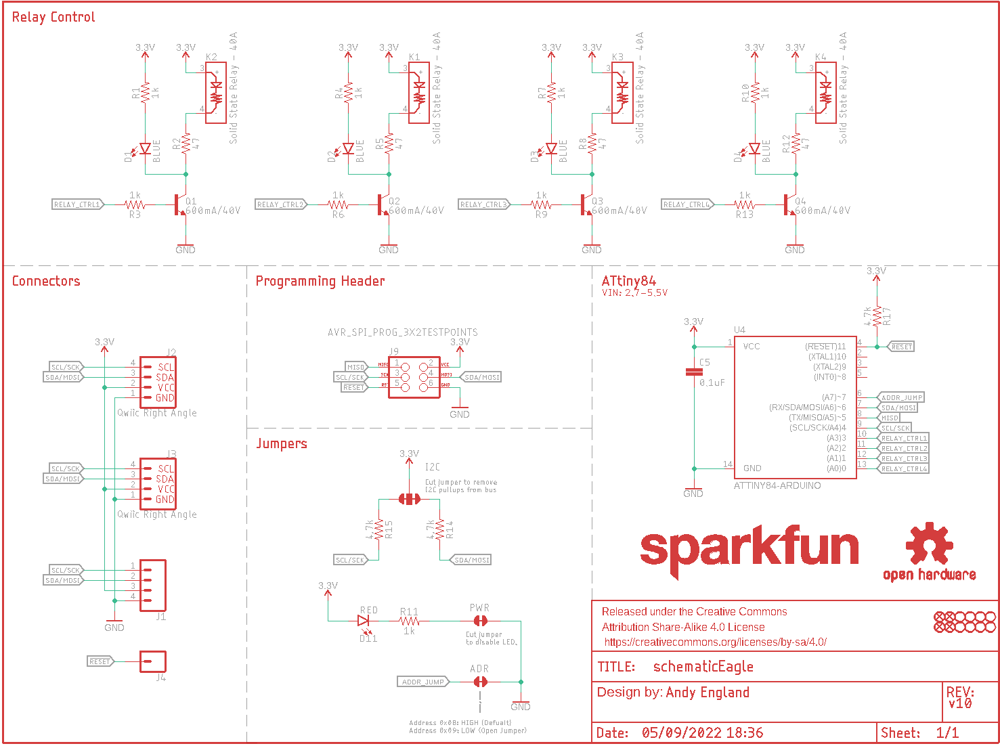
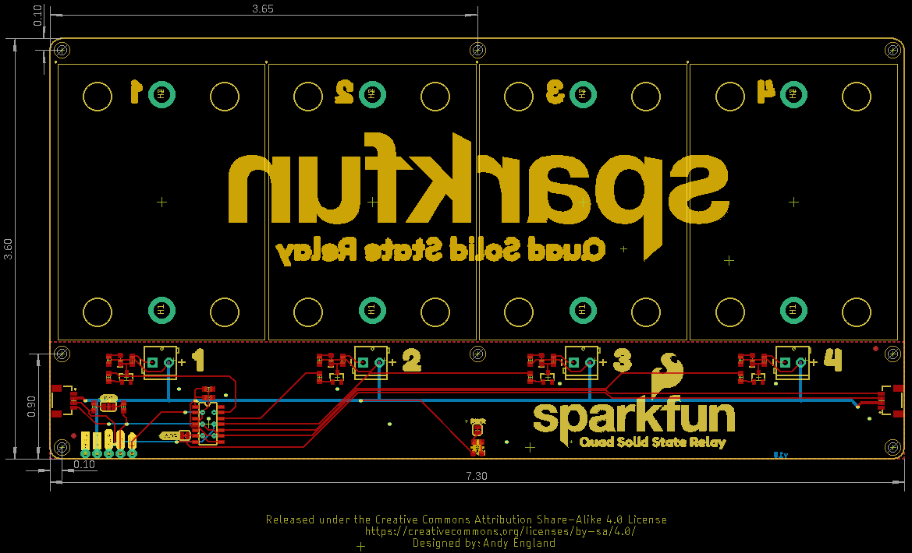
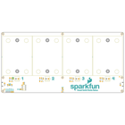
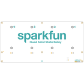
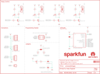
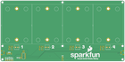

Contents
========

* [PRS16833 > Qwiic Quad Solid State Relay](#prs16833--qwiic-quad-solid-state-relay)
	* [Schematic](#schematic)
	* [PCB](#pcb)
	* [Interactive BOM](#interactive-bom)
	* [Images](#images)
	* [Tags](#tags)
  
![][im]
# PRS16833 > Qwiic Quad Solid State Relay

- ID: PROJ-SPAR-16833-STAN-01
- Hex ID: PRS16833
- Name: Sparkfun
- Description: Sparkfun
- Long Link: [http://oom.lt/PROJ-SPAR-16833-STAN-01](http://oom.lt/PROJ-SPAR-16833-STAN-01)
- Short Link: [http://oom.lt/PRS16833](http://oom.lt/PRS16833)

## Schematic
  

## PCB
  

## Interactive BOM

- Interactive BOM page: [ibom.html](https://htmlpreview.github.io/?https://github.com/oomlout/oomlout_OOMP_projects/blob/main/PROJ-SPAR-16833-STAN-01/kicad/bom/ibom.html)

## Images
  
  

|bominteractivefront|bominteractiveback|kicadPcb3d|kicadPcb3dFront|kicadPcb3dBack|eagleImage|eagleSchemImage|pcbdraw|pcbdrawback|
| :---: | :---: | :---: | :---: | :---: | :---: | :---: | :---: | :---: |
||||||||||

## Tags

- hexID: PRS16833
- oompType: PROJ
- oompSize: SPAR
- oompColor: 16833
- oompDesc: STAN
- oompIndex: 01
- oompName: Qwiic Quad Solid State Relay
- sources: All source files from https://github.com/sparkfun/Qwiic_Quad_Solid_State_Relay (source licence details in srcLicense.md)
- linkBuyPage: https://www.sparkfun.com/products/16833
- oompID: PROJ-SPAR-16833-STAN-01
- rawParts: ADR,JUMPER-SMT_2_NC_TRACE_SILK,JUMPER-SMT_2_NC_TRACE_SILK,SMT-JUMPER_2_NC_TRACE_SILK,Normally closed trace jumper,,,,,
- rawParts: C5,0.1uF,0.1UF-0603-25V-(+80/-20%),0603,0.1µF ceramic capacitors,,CAP-00810,,0.1uF,
- rawParts: D1,BLUE,LED-BLUE0603,LED-0603,Blue SMD LED,,DIO-08575,,BLUE,
- rawParts: D2,BLUE,LED-BLUE0603,LED-0603,Blue SMD LED,,DIO-08575,,BLUE,
- rawParts: D3,BLUE,LED-BLUE0603,LED-0603,Blue SMD LED,,DIO-08575,,BLUE,
- rawParts: D4,BLUE,LED-BLUE0603,LED-0603,Blue SMD LED,,DIO-08575,,BLUE,
- rawParts: D11,RED,LED-RED0603,LED-0603,Red SMD LED,,DIO-00819,,RED,
- rawParts: FD1,FIDUCIAL1X2,FIDUCIAL1X2,FIDUCIAL-1X2,Fiducial Alignment Points,,,,,
- rawParts: FD2,FIDUCIAL1X2,FIDUCIAL1X2,FIDUCIAL-1X2,Fiducial Alignment Points,,,,,
- rawParts: FD3,FIDUCIAL1X2,FIDUCIAL1X2,FIDUCIAL-1X2,Fiducial Alignment Points,,,,,
- rawParts: FD4,FIDUCIAL1X2,FIDUCIAL1X2,FIDUCIAL-1X2,Fiducial Alignment Points,,,,,
- rawParts: FRAME1,FRAME-LETTER,FRAME-LETTER,CREATIVE_COMMONS,Schematic Frame - Letter,,,,,
- rawParts: I2C,JUMPER-SMT_3_2-NC_TRACE_SILK,JUMPER-SMT_3_2-NC_TRACE_SILK,SMT-JUMPER_3_2-NC_TRACE_SILK,Normally closed trace jumper (2 of 2 connections),,,,,
- rawParts: J1,,CONN_041X04_NO_SILK,1X04_NO_SILK,Multi connection point. Often used as Generic Header-pin footprint for 0.1 inch spaced/style header connections,,CONN-09696,,,
- rawParts: J2,Qwiic Right Angle,I2C_STANDARDQWIIC,JST04_1MM_RA,SparkFun I2C Standard Pinout Header,,CONN-13694,,Qwiic Right Angle,
- rawParts: J3,Qwiic Right Angle,I2C_STANDARDQWIIC,JST04_1MM_RA,SparkFun I2C Standard Pinout Header,,CONN-13694,,Qwiic Right Angle,
- rawParts: J4,,CONN_01PTH_NO_SILK_YES_STOP,1X01_NO_SILK,Single connection point. Often used as Generic Header-pin footprint for 0.1 inch spaced/style header connections,,,,,
- rawParts: J9,AVR_SPI_PROG_3X2TESTPOINTS,AVR_SPI_PROG_3X2TESTPOINTS,2X3_TEST_POINTS,AVR ISP 6 Pin,,,,,
- rawParts: JP1,STAND-OFF,STAND-OFF,STAND-OFF,Stand Off,,,,,
- rawParts: JP2,STAND-OFF,STAND-OFF,STAND-OFF,Stand Off,,,,,
- rawParts: JP3,STAND-OFF,STAND-OFF,STAND-OFF,Stand Off,,,,,
- rawParts: JP4,STAND-OFF,STAND-OFF,STAND-OFF,Stand Off,,,,,
- rawParts: JP5,STAND-OFF,STAND-OFF,STAND-OFF,Stand Off,,,,,
- rawParts: JP6,STAND-OFF,STAND-OFF,STAND-OFF,Stand Off,,,,,
- rawParts: JP7,STAND-OFF,STAND-OFF,STAND-OFF,Stand Off,,,,,
- rawParts: JP8,STAND-OFF,STAND-OFF,STAND-OFF,Stand Off,,,,,
- rawParts: K1,Solid State Relay - 40A,SOLID_STATE_RELAY_SSR-40DA-H,SSR-40DA-H,Fotek SSR-40DA-H DC->AC Solid State Relay,,COMP-15116, CONN-08399, 2 x HW-15038,,Solid State Relay - 40A,
- rawParts: K2,Solid State Relay - 40A,SOLID_STATE_RELAY_SSR-40DA-H,SSR-40DA-H,Fotek SSR-40DA-H DC->AC Solid State Relay,,COMP-15116, CONN-08399, 2 x HW-15038,,Solid State Relay - 40A,
- rawParts: K3,Solid State Relay - 40A,SOLID_STATE_RELAY_SSR-40DA-H,SSR-40DA-H,Fotek SSR-40DA-H DC->AC Solid State Relay,,COMP-15116, CONN-08399, 2 x HW-15038,,Solid State Relay - 40A,
- rawParts: K4,Solid State Relay - 40A,SOLID_STATE_RELAY_SSR-40DA-H,SSR-40DA-H,Fotek SSR-40DA-H DC->AC Solid State Relay,,COMP-15116, CONN-08399, 2 x HW-15038,,Solid State Relay - 40A,
- rawParts: LOGO1,SFE_LOGO_NAME1_INCH,SFE_LOGO_NAME1_INCH,SFE_LOGO_NAME_1,SparkFun Font Logo,,,,,
- rawParts: LOGO2,OSHW-LOGOS,OSHW-LOGOS,OSHW-LOGO-S,Open-Source Hardware (OSHW) Logo,,,,,
- rawParts: PWR,JUMPER-SMT_2_NC_TRACE_SILK,JUMPER-SMT_2_NC_TRACE_SILK,SMT-JUMPER_2_NC_TRACE_SILK,Normally closed trace jumper,,,,,
- rawParts: Q1,600mA/40V,TRANS_NPN-MMBT2222AL,SOT23-3,NPN transistor,,TRANS-08049,,600mA/40V,
- rawParts: Q2,600mA/40V,TRANS_NPN-MMBT2222AL,SOT23-3,NPN transistor,,TRANS-08049,,600mA/40V,
- rawParts: Q3,600mA/40V,TRANS_NPN-MMBT2222AL,SOT23-3,NPN transistor,,TRANS-08049,,600mA/40V,
- rawParts: Q4,600mA/40V,TRANS_NPN-MMBT2222AL,SOT23-3,NPN transistor,,TRANS-08049,,600mA/40V,
- rawParts: R1,1k,1KOHM-0603-1/10W-1%,0603,1kΩ resistor,,RES-07856,,1k,
- rawParts: R2,47,47OHM-0603-1/10W-1%,0603,47Ω resistor,,RES-14282,,47,
- rawParts: R3,1k,1KOHM-0603-1/10W-1%,0603,1kΩ resistor,,RES-07856,,1k,
- rawParts: R4,1k,1KOHM-0603-1/10W-1%,0603,1kΩ resistor,,RES-07856,,1k,
- rawParts: R5,47,47OHM-0603-1/10W-1%,0603,47Ω resistor,,RES-14282,,47,
- rawParts: R6,1k,1KOHM-0603-1/10W-1%,0603,1kΩ resistor,,RES-07856,,1k,
- rawParts: R7,1k,1KOHM-0603-1/10W-1%,0603,1kΩ resistor,,RES-07856,,1k,
- rawParts: R8,47,47OHM-0603-1/10W-1%,0603,47Ω resistor,,RES-14282,,47,
- rawParts: R9,1k,1KOHM-0603-1/10W-1%,0603,1kΩ resistor,,RES-07856,,1k,
- rawParts: R10,1k,1KOHM-0603-1/10W-1%,0603,1kΩ resistor,,RES-07856,,1k,
- rawParts: R11,1k,1KOHM-0603-1/10W-1%,0603,1kΩ resistor,,RES-07856,,1k,
- rawParts: R12,47,47OHM-0603-1/10W-1%,0603,47Ω resistor,,RES-14282,,47,
- rawParts: R13,1k,1KOHM-0603-1/10W-1%,0603,1kΩ resistor,,RES-07856,,1k,
- rawParts: R14,4.7k,4.7KOHM-0603-1/10W-1%,0603,4.7kΩ resistor,,RES-07857,,4.7k,
- rawParts: R15,4.7k,4.7KOHM-0603-1/10W-1%,0603,4.7kΩ resistor,,RES-07857,,4.7k,
- rawParts: R17,4.7k,4.7KOHM-0603-1/10W-1%,0603,4.7kΩ resistor,,RES-07857,,4.7k,
- rawParts: U4,ATTINY84-ARDUINO,ATTINY84-ARDUINO,SO14,,,IC-14155,,,

[im]: kicadPcb3d_450.png
