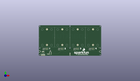
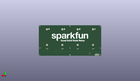
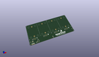

Contents
========

* [PROJ-SPAR-16833-STAN-01>Qwiic Quad Solid State Relay](#proj-spar-16833-stan-01qwiic-quad-solid-state-relay)
	* [Images](#images)
	* [Interactive BOM](#interactive-bom)
	* [OOMP Parts](#oomp-parts)
	* [Tags](#tags)
  
![][im]
# PROJ-SPAR-16833-STAN-01>Qwiic Quad Solid State Relay

- ID: PROJ-SPAR-16833-STAN-01
- Hex ID: PRS16833
- Name: Qwiic Quad Solid State Relay
- Description: 

## Images
  
  

|eagleImage|kicadPcb3dFront|kicadPcb3dBack|kicadPcb3d|
| :---: | :---: | :---: | :---: |
|||||

## Interactive BOM

- Interactive BOM page: [ibom.html](kicad/bom/ibom.html)

## OOMP Parts
  

|OOMP Parts|
| :---: |
|UNMATCHED-UNMATCHED-X-UNMATCHED-01, ADR, 29.209999999999997, 5.08, 180,ADR, JUMPER-SMT_2_NC_TRACE_SILK, SMT-JUMPER_2_NC_TRACE_SILK, SparkFun-Jumpers, (1.15, 0.2), R180|
|CAPE-0603-X-NF100-01, C5, 34.29, 13.334999999999999, 0,C5, 0.1uF, 0603, SparkFun-Capacitors, (1.35, 0.525), R0|
|UNMATCHED-0603-X-UNMATCHED-01, D1, 152.39999999999998, 21.59, 270,D1, BLUE, LED-0603, SparkFun-LED, (6, 0.85), R270|
|UNMATCHED-0603-X-UNMATCHED-01, D2, 106.67999999999999, 21.59, 270,D2, BLUE, LED-0603, SparkFun-LED, (4.2, 0.85), R270|
|UNMATCHED-0603-X-UNMATCHED-01, D3, 60.959999999999994, 21.59, 270,D3, BLUE, LED-0603, SparkFun-LED, (2.4, 0.85), R270|
|UNMATCHED-0603-X-UNMATCHED-01, D4, 15.239999999999998, 21.59, 270,D4, BLUE, LED-0603, SparkFun-LED, (0.6, 0.85), R270|
|UNMATCHED-0603-X-UNMATCHED-01, D11, 92.71, 1.27, 0,D11, RED, LED-0603, SparkFun-LED, (3.65, 0.05), R0|
|UNMATCHED-UNMATCHED-X-UNMATCHED-01, FD1, 179.07, 24.13, 0,FD1, FIDUCIAL1X2, FIDUCIAL-1X2, SparkFun-Aesthetics, (7.05, 0.95), R0|
|UNMATCHED-UNMATCHED-X-UNMATCHED-01, FD2, 179.07, 24.13, M0,FD2, FIDUCIAL1X2, FIDUCIAL-1X2, SparkFun-Aesthetics, (7.05, 0.95), MR0|
|UNMATCHED-UNMATCHED-X-UNMATCHED-01, FD3, 5.08, 5.08, M0,FD3, FIDUCIAL1X2, FIDUCIAL-1X2, SparkFun-Aesthetics, (0.2, 0.2), MR0|
|UNMATCHED-UNMATCHED-X-UNMATCHED-01, FD4, 5.08, 5.08, 0,FD4, FIDUCIAL1X2, FIDUCIAL-1X2, SparkFun-Aesthetics, (0.2, 0.2), R0|
|UNMATCHED-UNMATCHED-X-UNMATCHED-01, I2C, 12.7, 11.43, 0,I2C, JUMPER-SMT_3_2-NC_TRACE_SILK, SMT-JUMPER_3_2-NC_TRACE_SILK, SparkFun-Jumpers, (0.5, 0.45), R0|
|UNMATCHED-UNMATCHED-X-UNMATCHED-01, J1, 15.239999999999998, 1.27, 180,J1, 1X04_NO_SILK, SparkFun-Connectors, (0.6, 0.05), R180|
|ERROR, J2 Qwiic Right, 0, 0, 0,J2, Qwiic, Right, Angle, JST04_1MM_RA, SparkFun-Connectors, (7.1, 0.5), R90|
|ERROR, J3 Qwiic Right, 0, 0, 0,J3, Qwiic, Right, Angle, JST04_1MM_RA, SparkFun-Connectors, (0.2, 0.5), R270|
|UNMATCHED-UNMATCHED-X-UNMATCHED-01, J4, 17.779999999999998, 1.27, 0,J4, 1X01_NO_SILK, SparkFun-Connectors, (0.7, 0.05), R0|
|UNMATCHED-UNMATCHED-X-UNMATCHED-01, J9, 34.29, 7.619999999999999, M90,J9, AVR_SPI_PROG_3X2TESTPOINTS, 2X3_TEST_POINTS, SparkFun-Connectors, (1.35, 0.3), MR90|
|ERROR, K1 Solid State, 0, 0, 0,K1, Solid, State, Relay, -, 40A, SSR-40DA-H, SparkFun-DiscreteSemi, (4.55, 2.2), R90|
|ERROR, K2 Solid State, 0, 0, 0,K2, Solid, State, Relay, -, 40A, SSR-40DA-H, SparkFun-DiscreteSemi, (6.35, 2.2), R90|
|ERROR, K3 Solid State, 0, 0, 0,K3, Solid, State, Relay, -, 40A, SSR-40DA-H, SparkFun-DiscreteSemi, (2.75, 2.2), R90|
|ERROR, K4 Solid State, 0, 0, 0,K4, Solid, State, Relay, -, 40A, SSR-40DA-H, SparkFun-DiscreteSemi, (0.95, 2.2), R90|
|UNMATCHED-UNMATCHED-X-UNMATCHED-01, PWR, 92.71, 6.35, 270,PWR, JUMPER-SMT_2_NC_TRACE_SILK, SMT-JUMPER_2_NC_TRACE_SILK, SparkFun-Jumpers, (3.65, 0.25), R270|
|UNMATCHED-UNMATCHED-X-UNMATCHED-01, Q1, 153.67, 17.779999999999998, 0,Q1, 600mA/40V, SOT23-3, SparkFun-DiscreteSemi, (6.05, 0.7), R0|
|UNMATCHED-UNMATCHED-X-UNMATCHED-01, Q2, 107.94999999999999, 17.779999999999998, 0,Q2, 600mA/40V, SOT23-3, SparkFun-DiscreteSemi, (4.25, 0.7), R0|
|UNMATCHED-UNMATCHED-X-UNMATCHED-01, Q3, 62.230000000000004, 17.779999999999998, 0,Q3, 600mA/40V, SOT23-3, SparkFun-DiscreteSemi, (2.45, 0.7), R0|
|UNMATCHED-UNMATCHED-X-UNMATCHED-01, Q4, 16.509999999999998, 17.779999999999998, 0,Q4, 600mA/40V, SOT23-3, SparkFun-DiscreteSemi, (0.65, 0.7), R0|
|RESE-0603-X-UNMATCHED-01, R1, 149.86, 21.59, 270,R1, 1k, 0603, SparkFun-Resistors, (5.9, 0.85), R270|
|RESE-0603-X-UNMATCHED-01, R2, 154.93999999999997, 21.59, 90,R2, 47, 0603, SparkFun-Resistors, (6.1, 0.85), R90|
|RESE-0603-X-UNMATCHED-01, R3, 149.86, 17.779999999999998, 90,R3, 1k, 0603, SparkFun-Resistors, (5.9, 0.7), R90|
|RESE-0603-X-UNMATCHED-01, R4, 104.13999999999999, 21.59, 270,R4, 1k, 0603, SparkFun-Resistors, (4.1, 0.85), R270|
|RESE-0603-X-UNMATCHED-01, R5, 109.21999999999998, 21.59, 90,R5, 47, 0603, SparkFun-Resistors, (4.3, 0.85), R90|
|RESE-0603-X-UNMATCHED-01, R6, 104.13999999999999, 17.779999999999998, 90,R6, 1k, 0603, SparkFun-Resistors, (4.1, 0.7), R90|
|RESE-0603-X-UNMATCHED-01, R7, 58.419999999999995, 21.59, 270,R7, 1k, 0603, SparkFun-Resistors, (2.3, 0.85), R270|
|RESE-0603-X-UNMATCHED-01, R8, 63.5, 21.59, 90,R8, 47, 0603, SparkFun-Resistors, (2.5, 0.85), R90|
|RESE-0603-X-UNMATCHED-01, R9, 58.419999999999995, 17.779999999999998, 90,R9, 1k, 0603, SparkFun-Resistors, (2.3, 0.7), R90|
|RESE-0603-X-UNMATCHED-01, R10, 12.7, 21.59, 270,R10, 1k, 0603, SparkFun-Resistors, (0.5, 0.85), R270|
|RESE-0603-X-UNMATCHED-01, R11, 92.71, 3.8099999999999996, 180,R11, 1k, 0603, SparkFun-Resistors, (3.65, 0.15), R180|
|RESE-0603-X-UNMATCHED-01, R12, 17.779999999999998, 21.59, 90,R12, 47, 0603, SparkFun-Resistors, (0.7, 0.85), R90|
|RESE-0603-X-UNMATCHED-01, R13, 12.7, 17.779999999999998, 90,R13, 1k, 0603, SparkFun-Resistors, (0.5, 0.7), R90|
|RESE-0603-X-UNMATCHED-01, R14, 9.524999999999999, 11.43, 270,R14, 4.7k, 0603, SparkFun-Resistors, (0.375, 0.45), R270|
|RESE-0603-X-UNMATCHED-01, R15, 15.875, 11.43, 270,R15, 4.7k, 0603, SparkFun-Resistors, (0.625, 0.45), R270|
|RESE-0603-X-UNMATCHED-01, R17, 34.29, 15.239999999999998, 0,R17, 4.7k, 0603, SparkFun-Resistors, (1.35, 0.6), R0|
|UNMATCHED-UNMATCHED-X-UNMATCHED-01, U4, 34.29, 7.619999999999999, 270,U4, ATTINY84-ARDUINO, SO14, SparkFun-IC-Microcontroller, (1.35, 0.3), R270|

## Tags

- hexID: PRS16833
- oompType: PROJ
- oompSize: SPAR
- oompColor: 16833
- oompDesc: STAN
- oompIndex: 01
- oompName: Qwiic Quad Solid State Relay
- sources: All source files from https://github.com/sparkfun/Qwiic_Quad_Solid_State_Relay (source licence details in srcLicense.md)
- linkBuyPage: https://www.sparkfun.com/products/16833
- oompPart: UNMATCHED-UNMATCHED-X-UNMATCHED-01, ADR, 29.209999999999997, 5.08, 180
- oompPart: CAPE-0603-X-NF100-01, C5, 34.29, 13.334999999999999, 0
- oompPart: UNMATCHED-0603-X-UNMATCHED-01, D1, 152.39999999999998, 21.59, 270
- oompPart: UNMATCHED-0603-X-UNMATCHED-01, D2, 106.67999999999999, 21.59, 270
- oompPart: UNMATCHED-0603-X-UNMATCHED-01, D3, 60.959999999999994, 21.59, 270
- oompPart: UNMATCHED-0603-X-UNMATCHED-01, D4, 15.239999999999998, 21.59, 270
- oompPart: UNMATCHED-0603-X-UNMATCHED-01, D11, 92.71, 1.27, 0
- oompPart: UNMATCHED-UNMATCHED-X-UNMATCHED-01, FD1, 179.07, 24.13, 0
- oompPart: UNMATCHED-UNMATCHED-X-UNMATCHED-01, FD2, 179.07, 24.13, M0
- oompPart: UNMATCHED-UNMATCHED-X-UNMATCHED-01, FD3, 5.08, 5.08, M0
- oompPart: UNMATCHED-UNMATCHED-X-UNMATCHED-01, FD4, 5.08, 5.08, 0
- oompPart: UNMATCHED-UNMATCHED-X-UNMATCHED-01, I2C, 12.7, 11.43, 0
- oompPart: UNMATCHED-UNMATCHED-X-UNMATCHED-01, J1, 15.239999999999998, 1.27, 180
- oompPart: ERROR, J2 Qwiic Right, 0, 0, 0
- oompPart: ERROR, J3 Qwiic Right, 0, 0, 0
- oompPart: UNMATCHED-UNMATCHED-X-UNMATCHED-01, J4, 17.779999999999998, 1.27, 0
- oompPart: UNMATCHED-UNMATCHED-X-UNMATCHED-01, J9, 34.29, 7.619999999999999, M90
- oompPart: ERROR, K1 Solid State, 0, 0, 0
- oompPart: ERROR, K2 Solid State, 0, 0, 0
- oompPart: ERROR, K3 Solid State, 0, 0, 0
- oompPart: ERROR, K4 Solid State, 0, 0, 0
- oompPart: UNMATCHED-UNMATCHED-X-UNMATCHED-01, PWR, 92.71, 6.35, 270
- oompPart: UNMATCHED-UNMATCHED-X-UNMATCHED-01, Q1, 153.67, 17.779999999999998, 0
- oompPart: UNMATCHED-UNMATCHED-X-UNMATCHED-01, Q2, 107.94999999999999, 17.779999999999998, 0
- oompPart: UNMATCHED-UNMATCHED-X-UNMATCHED-01, Q3, 62.230000000000004, 17.779999999999998, 0
- oompPart: UNMATCHED-UNMATCHED-X-UNMATCHED-01, Q4, 16.509999999999998, 17.779999999999998, 0
- oompPart: RESE-0603-X-UNMATCHED-01, R1, 149.86, 21.59, 270
- oompPart: RESE-0603-X-UNMATCHED-01, R2, 154.93999999999997, 21.59, 90
- oompPart: RESE-0603-X-UNMATCHED-01, R3, 149.86, 17.779999999999998, 90
- oompPart: RESE-0603-X-UNMATCHED-01, R4, 104.13999999999999, 21.59, 270
- oompPart: RESE-0603-X-UNMATCHED-01, R5, 109.21999999999998, 21.59, 90
- oompPart: RESE-0603-X-UNMATCHED-01, R6, 104.13999999999999, 17.779999999999998, 90
- oompPart: RESE-0603-X-UNMATCHED-01, R7, 58.419999999999995, 21.59, 270
- oompPart: RESE-0603-X-UNMATCHED-01, R8, 63.5, 21.59, 90
- oompPart: RESE-0603-X-UNMATCHED-01, R9, 58.419999999999995, 17.779999999999998, 90
- oompPart: RESE-0603-X-UNMATCHED-01, R10, 12.7, 21.59, 270
- oompPart: RESE-0603-X-UNMATCHED-01, R11, 92.71, 3.8099999999999996, 180
- oompPart: RESE-0603-X-UNMATCHED-01, R12, 17.779999999999998, 21.59, 90
- oompPart: RESE-0603-X-UNMATCHED-01, R13, 12.7, 17.779999999999998, 90
- oompPart: RESE-0603-X-UNMATCHED-01, R14, 9.524999999999999, 11.43, 270
- oompPart: RESE-0603-X-UNMATCHED-01, R15, 15.875, 11.43, 270
- oompPart: RESE-0603-X-UNMATCHED-01, R17, 34.29, 15.239999999999998, 0
- oompPart: UNMATCHED-UNMATCHED-X-UNMATCHED-01, U4, 34.29, 7.619999999999999, 270
- rawPart: ADR, JUMPER-SMT_2_NC_TRACE_SILK, SMT-JUMPER_2_NC_TRACE_SILK, SparkFun-Jumpers, (1.15, 0.2), R180
- rawPart: C5, 0.1uF, 0603, SparkFun-Capacitors, (1.35, 0.525), R0
- rawPart: D1, BLUE, LED-0603, SparkFun-LED, (6, 0.85), R270
- rawPart: D2, BLUE, LED-0603, SparkFun-LED, (4.2, 0.85), R270
- rawPart: D3, BLUE, LED-0603, SparkFun-LED, (2.4, 0.85), R270
- rawPart: D4, BLUE, LED-0603, SparkFun-LED, (0.6, 0.85), R270
- rawPart: D11, RED, LED-0603, SparkFun-LED, (3.65, 0.05), R0
- rawPart: FD1, FIDUCIAL1X2, FIDUCIAL-1X2, SparkFun-Aesthetics, (7.05, 0.95), R0
- rawPart: FD2, FIDUCIAL1X2, FIDUCIAL-1X2, SparkFun-Aesthetics, (7.05, 0.95), MR0
- rawPart: FD3, FIDUCIAL1X2, FIDUCIAL-1X2, SparkFun-Aesthetics, (0.2, 0.2), MR0
- rawPart: FD4, FIDUCIAL1X2, FIDUCIAL-1X2, SparkFun-Aesthetics, (0.2, 0.2), R0
- rawPart: I2C, JUMPER-SMT_3_2-NC_TRACE_SILK, SMT-JUMPER_3_2-NC_TRACE_SILK, SparkFun-Jumpers, (0.5, 0.45), R0
- rawPart: J1, 1X04_NO_SILK, SparkFun-Connectors, (0.6, 0.05), R180
- rawPart: J2, Qwiic, Right, Angle, JST04_1MM_RA, SparkFun-Connectors, (7.1, 0.5), R90
- rawPart: J3, Qwiic, Right, Angle, JST04_1MM_RA, SparkFun-Connectors, (0.2, 0.5), R270
- rawPart: J4, 1X01_NO_SILK, SparkFun-Connectors, (0.7, 0.05), R0
- rawPart: J9, AVR_SPI_PROG_3X2TESTPOINTS, 2X3_TEST_POINTS, SparkFun-Connectors, (1.35, 0.3), MR90
- rawPart: K1, Solid, State, Relay, -, 40A, SSR-40DA-H, SparkFun-DiscreteSemi, (4.55, 2.2), R90
- rawPart: K2, Solid, State, Relay, -, 40A, SSR-40DA-H, SparkFun-DiscreteSemi, (6.35, 2.2), R90
- rawPart: K3, Solid, State, Relay, -, 40A, SSR-40DA-H, SparkFun-DiscreteSemi, (2.75, 2.2), R90
- rawPart: K4, Solid, State, Relay, -, 40A, SSR-40DA-H, SparkFun-DiscreteSemi, (0.95, 2.2), R90
- rawPart: PWR, JUMPER-SMT_2_NC_TRACE_SILK, SMT-JUMPER_2_NC_TRACE_SILK, SparkFun-Jumpers, (3.65, 0.25), R270
- rawPart: Q1, 600mA/40V, SOT23-3, SparkFun-DiscreteSemi, (6.05, 0.7), R0
- rawPart: Q2, 600mA/40V, SOT23-3, SparkFun-DiscreteSemi, (4.25, 0.7), R0
- rawPart: Q3, 600mA/40V, SOT23-3, SparkFun-DiscreteSemi, (2.45, 0.7), R0
- rawPart: Q4, 600mA/40V, SOT23-3, SparkFun-DiscreteSemi, (0.65, 0.7), R0
- rawPart: R1, 1k, 0603, SparkFun-Resistors, (5.9, 0.85), R270
- rawPart: R2, 47, 0603, SparkFun-Resistors, (6.1, 0.85), R90
- rawPart: R3, 1k, 0603, SparkFun-Resistors, (5.9, 0.7), R90
- rawPart: R4, 1k, 0603, SparkFun-Resistors, (4.1, 0.85), R270
- rawPart: R5, 47, 0603, SparkFun-Resistors, (4.3, 0.85), R90
- rawPart: R6, 1k, 0603, SparkFun-Resistors, (4.1, 0.7), R90
- rawPart: R7, 1k, 0603, SparkFun-Resistors, (2.3, 0.85), R270
- rawPart: R8, 47, 0603, SparkFun-Resistors, (2.5, 0.85), R90
- rawPart: R9, 1k, 0603, SparkFun-Resistors, (2.3, 0.7), R90
- rawPart: R10, 1k, 0603, SparkFun-Resistors, (0.5, 0.85), R270
- rawPart: R11, 1k, 0603, SparkFun-Resistors, (3.65, 0.15), R180
- rawPart: R12, 47, 0603, SparkFun-Resistors, (0.7, 0.85), R90
- rawPart: R13, 1k, 0603, SparkFun-Resistors, (0.5, 0.7), R90
- rawPart: R14, 4.7k, 0603, SparkFun-Resistors, (0.375, 0.45), R270
- rawPart: R15, 4.7k, 0603, SparkFun-Resistors, (0.625, 0.45), R270
- rawPart: R17, 4.7k, 0603, SparkFun-Resistors, (1.35, 0.6), R0
- rawPart: U4, ATTINY84-ARDUINO, SO14, SparkFun-IC-Microcontroller, (1.35, 0.3), R270

[im]: kicadPcb3d_450.png
