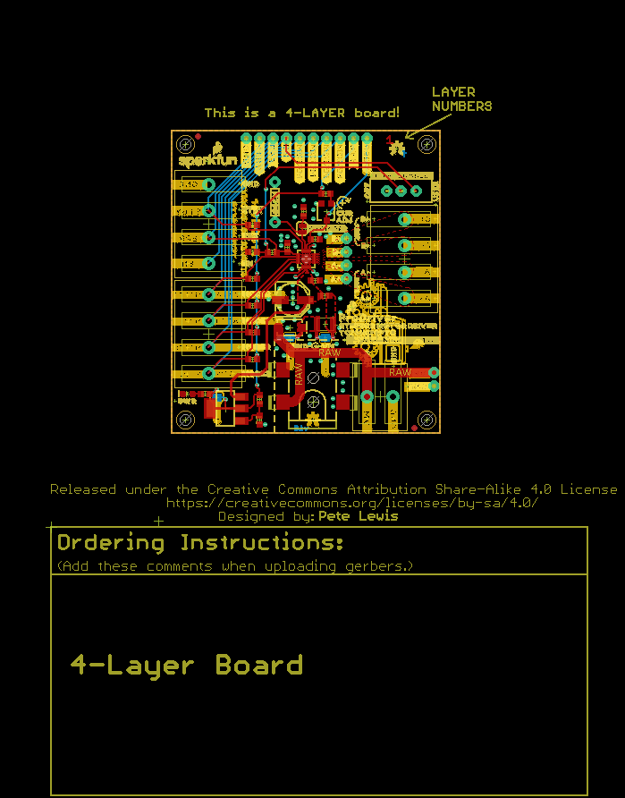
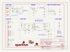

Contents
========

* [PRS16836 > SparkFun ProDriver TC78H670FTG](#prs16836--sparkfun-prodriver-tc78h670ftg)
	* [Schematic](#schematic)
	* [PCB](#pcb)
	* [OOMP Parts](#oomp-parts)
	* [Images](#images)
	* [Tags](#tags)
  
![][im]
# PRS16836 > SparkFun ProDriver TC78H670FTG

- ID: PROJ-SPAR-16836-STAN-01
- Hex ID: PRS16836
- Name: Sparkfun
- Description: Sparkfun
- Long Link: [http://oom.lt/PROJ-SPAR-16836-STAN-01](http://oom.lt/PROJ-SPAR-16836-STAN-01)
- Short Link: [http://oom.lt/PRS16836](http://oom.lt/PRS16836)

## Schematic
  

## PCB
  

## OOMP Parts
  

|OOMP ID|Name|Identifier|
| :---: | :---: | :---: |
|CAPC-UNMATCHED-X-NF22-01||C1|
|CAPE-PAND-X-UF47-01||C2|
|[CAPC-0603-X-NF100-V50](https://github.com/oomlout/oomlout_OOMP_parts/tree/main/CAPC-0603-X-NF100-V50/)|[SMD (0603) 100 nF Capacitor (Ceramic) 50v](https://github.com/oomlout/oomlout_OOMP_parts/tree/main/CAPC-0603-X-NF100-V50/)|[C3, C4](https://github.com/oomlout/oomlout_OOMP_parts/tree/main/CAPC-0603-X-NF100-V50/)|
|DIOD-UNMATCHED-X-UNMATCHED-01||D1|
|UNMATCHED-UNMATCHED-X-UNMATCHED-01||D1BP, F1, J1, JP4, LOGO3, OSCMBP, PTCBP, S1, U1, U2, VR1|
|[LEDS-0603-R-STAN-01](https://github.com/oomlout/oomlout_OOMP_parts/tree/main/LEDS-0603-R-STAN-01/)|[SMD (0603) Red LED](https://github.com/oomlout/oomlout_OOMP_parts/tree/main/LEDS-0603-R-STAN-01/)|[D2](https://github.com/oomlout/oomlout_OOMP_parts/tree/main/LEDS-0603-R-STAN-01/)|
|HEAD-UNMATCHED-X-UNMATCHED-01||J2, J4, J5, J7|
|[HEAD-I01-X-PI02-01](https://github.com/oomlout/oomlout_OOMP_parts/tree/main/HEAD-I01-X-PI02-01/)|[2.54 mm 2 Pin Header](https://github.com/oomlout/oomlout_OOMP_parts/tree/main/HEAD-I01-X-PI02-01/)|[J3](https://github.com/oomlout/oomlout_OOMP_parts/tree/main/HEAD-I01-X-PI02-01/)|
|[HEAD-I01-X-PI10-01](https://github.com/oomlout/oomlout_OOMP_parts/tree/main/HEAD-I01-X-PI10-01/)|[2.54 mm 10 Pin Header](https://github.com/oomlout/oomlout_OOMP_parts/tree/main/HEAD-I01-X-PI10-01/)|[J6](https://github.com/oomlout/oomlout_OOMP_parts/tree/main/HEAD-I01-X-PI10-01/)|
|[HEAD-I01-X-PI04-01](https://github.com/oomlout/oomlout_OOMP_parts/tree/main/HEAD-I01-X-PI04-01/)|[2.54 mm 4 Pin Header](https://github.com/oomlout/oomlout_OOMP_parts/tree/main/HEAD-I01-X-PI04-01/)|[J8](https://github.com/oomlout/oomlout_OOMP_parts/tree/main/HEAD-I01-X-PI04-01/)|
|[RESE-0603-X-O103-01](https://github.com/oomlout/oomlout_OOMP_parts/tree/main/RESE-0603-X-O103-01/)|[SMD (0603) 10k Ohm Resistor](https://github.com/oomlout/oomlout_OOMP_parts/tree/main/RESE-0603-X-O103-01/)|[R1](https://github.com/oomlout/oomlout_OOMP_parts/tree/main/RESE-0603-X-O103-01/)|
|[RESE-0603-X-O473-01](https://github.com/oomlout/oomlout_OOMP_parts/tree/main/RESE-0603-X-O473-01/)|[SMD (0603) 47k Ohm Resistor](https://github.com/oomlout/oomlout_OOMP_parts/tree/main/RESE-0603-X-O473-01/)|[R2](https://github.com/oomlout/oomlout_OOMP_parts/tree/main/RESE-0603-X-O473-01/)|
|RESE-UNMATCHED-X-UNMATCHED-01||R3|
|[RESE-0603-X-O241-01](https://github.com/oomlout/oomlout_OOMP_parts/tree/main/RESE-0603-X-O241-01/)|[SMD (0603) 240 Ohm Resistor](https://github.com/oomlout/oomlout_OOMP_parts/tree/main/RESE-0603-X-O241-01/)|[R4](https://github.com/oomlout/oomlout_OOMP_parts/tree/main/RESE-0603-X-O241-01/)|
|[RESE-0603-X-O391-01](https://github.com/oomlout/oomlout_OOMP_parts/tree/main/RESE-0603-X-O391-01/)|[SMD (0603) 390 Ohm Resistor](https://github.com/oomlout/oomlout_OOMP_parts/tree/main/RESE-0603-X-O391-01/)|[R5](https://github.com/oomlout/oomlout_OOMP_parts/tree/main/RESE-0603-X-O391-01/)|
|RESE-0603-X-UNMATCHED-01||R6, R13|
|[RESE-0603-X-O223-01](https://github.com/oomlout/oomlout_OOMP_parts/tree/main/RESE-0603-X-O223-01/)|[SMD (0603) 22k Ohm Resistor](https://github.com/oomlout/oomlout_OOMP_parts/tree/main/RESE-0603-X-O223-01/)|[R7, R8, R9, R10, R11, R12](https://github.com/oomlout/oomlout_OOMP_parts/tree/main/RESE-0603-X-O223-01/)|
|[RESE-0603-X-O102-01](https://github.com/oomlout/oomlout_OOMP_parts/tree/main/RESE-0603-X-O102-01/)|[SMD (0603) 1k Ohm Resistor](https://github.com/oomlout/oomlout_OOMP_parts/tree/main/RESE-0603-X-O102-01/)|[R14](https://github.com/oomlout/oomlout_OOMP_parts/tree/main/RESE-0603-X-O102-01/)|

## Images
  
  

|kicadPcb3d|kicadPcb3dFront|kicadPcb3dBack|kicadSchem|eagleImage|eagleSchemImage|
| :---: | :---: | :---: | :---: | :---: | :---: |
|||||||

## Tags

- hexID: PRS16836
- oompType: PROJ
- oompSize: SPAR
- oompColor: 16836
- oompDesc: STAN
- oompIndex: 01
- oompName: SparkFun ProDriver TC78H670FTG
- sources: All source files from https://github.com/sparkfun/SparkFun_ProDriver_TC78H670FTG (source licence details in srcLicense.md)
- linkBuyPage: https://www.sparkfun.com/products/16836
- oompID: PROJ-SPAR-16836-STAN-01
- oompParts: C1,CAPC-UNMATCHED-X-NF22-01
- oompParts: C2,CAPE-PAND-X-UF47-01
- oompParts: C3,CAPC-0603-X-NF100-V50
- oompParts: C4,CAPC-0603-X-NF100-V50
- oompParts: D1,DIOD-UNMATCHED-X-UNMATCHED-01
- oompParts: D1BP,UNMATCHED-UNMATCHED-X-UNMATCHED-01
- oompParts: D2,LEDS-0603-R-STAN-01
- oompParts: F1,UNMATCHED-UNMATCHED-X-UNMATCHED-01
- oompParts: J1,UNMATCHED-UNMATCHED-X-UNMATCHED-01
- oompParts: J2,HEAD-UNMATCHED-X-UNMATCHED-01
- oompParts: J3,HEAD-I01-X-PI02-01
- oompParts: J4,HEAD-UNMATCHED-X-UNMATCHED-01
- oompParts: J5,HEAD-UNMATCHED-X-UNMATCHED-01
- oompParts: J6,HEAD-I01-X-PI10-01
- oompParts: J7,HEAD-UNMATCHED-X-UNMATCHED-01
- oompParts: J8,HEAD-I01-X-PI04-01
- oompParts: JP4,UNMATCHED-UNMATCHED-X-UNMATCHED-01
- oompParts: LOGO3,UNMATCHED-UNMATCHED-X-UNMATCHED-01
- oompParts: OSCMBP,UNMATCHED-UNMATCHED-X-UNMATCHED-01
- oompParts: PTCBP,UNMATCHED-UNMATCHED-X-UNMATCHED-01
- oompParts: R1,RESE-0603-X-O103-01
- oompParts: R2,RESE-0603-X-O473-01
- oompParts: R3,RESE-UNMATCHED-X-UNMATCHED-01
- oompParts: R4,RESE-0603-X-O241-01
- oompParts: R5,RESE-0603-X-O391-01
- oompParts: R6,RESE-0603-X-UNMATCHED-01
- oompParts: R7,RESE-0603-X-O223-01
- oompParts: R8,RESE-0603-X-O223-01
- oompParts: R9,RESE-0603-X-O223-01
- oompParts: R10,RESE-0603-X-O223-01
- oompParts: R11,RESE-0603-X-O223-01
- oompParts: R12,RESE-0603-X-O223-01
- oompParts: R13,RESE-0603-X-UNMATCHED-01
- oompParts: R14,RESE-0603-X-O102-01
- oompParts: S1,UNMATCHED-UNMATCHED-X-UNMATCHED-01
- oompParts: U1,UNMATCHED-UNMATCHED-X-UNMATCHED-01
- oompParts: U2,UNMATCHED-UNMATCHED-X-UNMATCHED-01
- oompParts: VR1,UNMATCHED-UNMATCHED-X-UNMATCHED-01
- rawParts: C1,22nF,22NF/22,000PF-0603-50V-10%,0603,0.022uF/22nF/22,000pF ceramic capacitors,,CAP-07885,,,,,22nF,
- rawParts: C2,47uF,47UF-POLAR-PANASONIC_D-35V-20%,PANASONIC_D,47µF polarized capacitors,,CAP-08478,,,,,47uF,
- rawParts: C3,0.1uF,0.1UF-0603-25V-(+80/-20%),0603,0.1µF ceramic capacitors,,CAP-00810,,,,,0.1uF,
- rawParts: C4,0.1uF,0.1UF-0603-25V-(+80/-20%),0603,0.1µF ceramic capacitors,,CAP-00810,,,,,0.1uF,
- rawParts: D1,3A/40V/500mV,DIODE-SCHOTTKY-B340A,SMA-DIODE,Schottky diode,,DIO-09886,,,,,3A/40V/500mV,
- rawParts: D1BP,,JUMPER-SMT_2_NO_SILK,SMT-JUMPER_2_NO_SILK,Normally open jumper,,,,,,,,
- rawParts: D2,RED,LED-RED0603,LED-0603,Red SMD LED,,DIO-00819,,,,,RED,
- rawParts: F1,16V/1.1A(2.2A TRIP),PPTC_16V_1.1A_(2.2ATRIP),1210,Resettable Fuse PPTC,,RES-15179,,,,,16V/1.1A(2.2A TRIP),
- rawParts: FID1,FIDUCIAL1X2,FIDUCIAL1X2,FIDUCIAL-1X2,Fiducial Alignment Points,,,,,,,,
- rawParts: FID2,FIDUCIAL1X2,FIDUCIAL1X2,FIDUCIAL-1X2,Fiducial Alignment Points,,,,,,,,
- rawParts: FID3,FIDUCIAL1X2,FIDUCIAL1X2,FIDUCIAL-1X2,Fiducial Alignment Points,,,,,,,,
- rawParts: FID4,FIDUCIAL1X2,FIDUCIAL1X2,FIDUCIAL-1X2,Fiducial Alignment Points,,,,,,,,
- rawParts: FRAME1,FRAME-LETTER,FRAME-LETTER,CREATIVE_COMMONS,Schematic Frame - Letter,,,,,,,,
- rawParts: J1,,POWER_JACKTOE,POWER_JACK_SMD_OVERPASTE_TOE,Power Jack Connector,,CONN-08106,,PRT-12748,,,,
- rawParts: J2,LATCH,CONN_02LATCH_2,LATCHTERMINAL-5MM-2,Multi connection point. Often used as Generic Header-pin footprint for 0.1 inch spaced/style header connections,,CONN-14720,,,,PRT-15898,,
- rawParts: J3,PTH,CONN_021X02_NO_SILK,1X02_NO_SILK,Multi connection point. Often used as Generic Header-pin footprint for 0.1 inch spaced/style header connections,,,,,,,,
- rawParts: J4,LATCH,CONN_04LATCH,LATCHTERMINAL-5MM-4,Multi connection point. Often used as Generic Header-pin footprint for 0.1 inch spaced/style header connections,,CONN-14722,,,,PRT-15900,,
- rawParts: J5,LATCH,CONN_04LATCH,LATCHTERMINAL-5MM-4,Multi connection point. Often used as Generic Header-pin footprint for 0.1 inch spaced/style header connections,,CONN-14722,,,,PRT-15900,,
- rawParts: J6,PTH,CONN_10NO_SILK_PTH_FEMALE,1X10_NO_SILK,Multi connection point. Often used as Generic Header-pin footprint for 0.1 inch spaced/style header connections,,,,,,,,
- rawParts: J7,LATCH,CONN_04LATCH,LATCHTERMINAL-5MM-4,Multi connection point. Often used as Generic Header-pin footprint for 0.1 inch spaced/style header connections,,CONN-14722,,,,PRT-15900,,
- rawParts: J8,PTH,CONN_041X04_NO_SILK,1X04_NO_SILK,Multi connection point. Often used as Generic Header-pin footprint for 0.1 inch spaced/style header connections,,CONN-09696,,,,,,
- rawParts: JP4,LED,JUMPER-SMT_2_NC_TRACE_SILK,SMT-JUMPER_2_NC_TRACE_SILK,Normally closed trace jumper,,,,,,,,
- rawParts: LOGO1,SFE_LOGO_NAME_FLAME.1_INCH,SFE_LOGO_NAME_FLAME.1_INCH,SFE_LOGO_NAME_FLAME_.1,SparkFun Font Logo w/ Flame,,,,,,,,
- rawParts: LOGO2,OSHW-LOGOS,OSHW-LOGOS,OSHW-LOGO-S,Open-Source Hardware (OSHW) Logo,,,,,,,,
- rawParts: LOGO3,SPECIAL_INSTRUCTIONS-ORDERING,SPECIAL_INSTRUCTIONS-ORDERING,ORDERING_INSTRUCTIONS,Special Ordering/Production Instructions Alert,,,,,,,,
- rawParts: OSCMBP,,JUMPER-SMT_2_NC_TRACE_SILK,SMT-JUMPER_2_NC_TRACE_SILK,Normally closed trace jumper,,,,,,,,
- rawParts: PTCBP,,JUMPER-SMT_2_NO_SILK,SMT-JUMPER_2_NO_SILK,Normally open jumper,,,,,,,,
- rawParts: R1,10k,10KOHM-0603-1/10W-1%,0603,10kΩ resistor,,RES-00824,,,,,10k,
- rawParts: R2,47k,47KOHM-0603-1/10W-1%,0603,47kΩ resistor,,RES-07871,,,,,47k,
- rawParts: R3,DNP,RESISTORAXIAL-0.3,AXIAL-0.3,Generic Resistor Package,, ,,,,, ,
- rawParts: R4,240,240OHM-0603-1/10W-1%,0603,240Ω resistor,,RES-07849,,,,,240,
- rawParts: R5,390,390OHM-0603-1/10W-1%,0603,390Ω resistor,,RES-07864,,,,,390,
- rawParts: R6,8.2k,8.2KOHM-0603-1/10W-5%,0603,8.2kΩ resistor,,RES-10646,,,,,8.2k,
- rawParts: R7,22k,22KOHM-0603-1/10W-1%,0603,22kΩ resistor,,RES-07853,,,,,22k,
- rawParts: R8,22k,22KOHM-0603-1/10W-1%,0603,22kΩ resistor,,RES-07853,,,,,22k,
- rawParts: R9,22k,22KOHM-0603-1/10W-1%,0603,22kΩ resistor,,RES-07853,,,,,22k,
- rawParts: R10,22k,22KOHM-0603-1/10W-1%,0603,22kΩ resistor,,RES-07853,,,,,22k,
- rawParts: R11,22k,22KOHM-0603-1/10W-1%,0603,22kΩ resistor,,RES-07853,,,,,22k,
- rawParts: R12,22k,22KOHM-0603-1/10W-1%,0603,22kΩ resistor,,RES-07853,,,,,22k,
- rawParts: R13,0,0OHM-0603-1/10W-5%,0603,0Ω resistor,,RES-08609,,,,,0,
- rawParts: R14,1k,1KOHM-0603-1/10W-1%,0603,1kΩ resistor,,RES-07856,,,,,1k,
- rawParts: S1,,SWITCH-SPDT-PTH-11.6X4.0MM-LOCK,SWITCH_SPDT_PTH_11.6X4.0MM_LOCK,Single Pole, Double Throw (SPDT) Switch,,SWCH-08261,,,COM-00102 ,,,
- rawParts: STANDOFF1,STAND-OFF,STAND-OFF,STAND-OFF,#4 Stand Off,,,,,,,,
- rawParts: STANDOFF2,STAND-OFF,STAND-OFF,STAND-OFF,#4 Stand Off,,,,,,,,
- rawParts: STANDOFF3,STAND-OFF,STAND-OFF,STAND-OFF,#4 Stand Off,,,,,,,,
- rawParts: STANDOFF4,STAND-OFF,STAND-OFF,STAND-OFF,#4 Stand Off,,,,,,,,
- rawParts: U$41,PRODRIVER_LOGO,PRODRIVER_LOGO,PRODRIVER_LOGO,,,,,,,,,
- rawParts: U1,TC78H670FTG,TC78H670FTG,P-VQFN16-0303-0.50-001,Toshiba TC78H670FTG Stepper Motor Driver,,IC-15170,,,,,TC78H670FTG,
- rawParts: U2,LM1117,V_REG_LM1117SOT223,SOT223,Voltage Regulator LM1117,,VREG-08170,,,,,,
- rawParts: VR1,10k,TRIMPOT-SMD-3MM-CLOSED-1/8W-20%,TRIMPOT-SMD-3MM-CLOSED,Trimming Potentiometer (Trimpot),,RES-09285,,,,,10k,

[im]: kicadPcb3d_450.png
