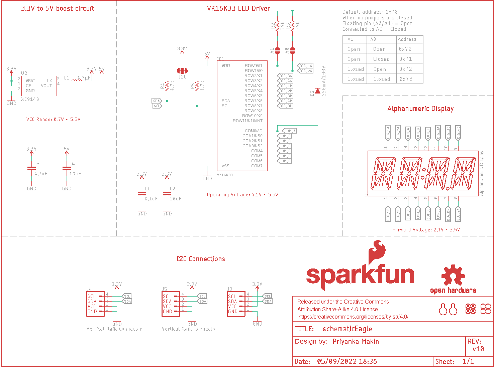
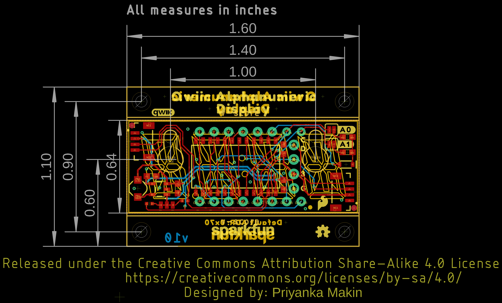
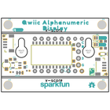
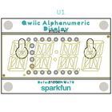
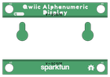
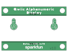

Contents
========

* [PRS16919 > Qwiic Alphanumeric Display Breakout](#prs16919--qwiic-alphanumeric-display-breakout)
	* [Schematic](#schematic)
	* [PCB](#pcb)
	* [Interactive BOM](#interactive-bom)
	* [OOMP Parts](#oomp-parts)
	* [Images](#images)
	* [Tags](#tags)
  
![][im]
# PRS16919 > Qwiic Alphanumeric Display Breakout

- ID: PROJ-SPAR-16919-STAN-01
- Hex ID: PRS16919
- Name: Sparkfun
- Description: Sparkfun
- Long Link: [http://oom.lt/PROJ-SPAR-16919-STAN-01](http://oom.lt/PROJ-SPAR-16919-STAN-01)
- Short Link: [http://oom.lt/PRS16919](http://oom.lt/PRS16919)

## Schematic
  

## PCB
  

## Interactive BOM

- Interactive BOM page: [ibom.html](https://htmlpreview.github.io/?https://github.com/oomlout/oomlout_OOMP_projects/blob/main/PROJ-SPAR-16919-STAN-01/kicad/bom/ibom.html)

## OOMP Parts
  

|OOMP ID|Name|Identifier|
| :---: | :---: | :---: |
|[CAPC-0603-X-NF100-V50](https://github.com/oomlout/oomlout_OOMP_parts/tree/main/CAPC-0603-X-NF100-V50/)|[SMD (0603) 100 nF Capacitor (Ceramic) 50v](https://github.com/oomlout/oomlout_OOMP_parts/tree/main/CAPC-0603-X-NF100-V50/)|[C1](https://github.com/oomlout/oomlout_OOMP_parts/tree/main/CAPC-0603-X-NF100-V50/)|
|[CAPC-0603-X-UF10-V63D](https://github.com/oomlout/oomlout_OOMP_parts/tree/main/CAPC-0603-X-UF10-V63D/)|[SMD (0603) 10 uF Capacitor (Ceramic) 6.3v](https://github.com/oomlout/oomlout_OOMP_parts/tree/main/CAPC-0603-X-UF10-V63D/)|[C2, C4](https://github.com/oomlout/oomlout_OOMP_parts/tree/main/CAPC-0603-X-UF10-V63D/)|
|[CAPC-0603-X-UF47D-V10](https://github.com/oomlout/oomlout_OOMP_parts/tree/main/CAPC-0603-X-UF47D-V10/)|[SMD (0603) 4.7 uF Capacitor (Ceramic) 10v](https://github.com/oomlout/oomlout_OOMP_parts/tree/main/CAPC-0603-X-UF47D-V10/)|[C3](https://github.com/oomlout/oomlout_OOMP_parts/tree/main/CAPC-0603-X-UF47D-V10/)|
|DIOD-S323-X-UNMATCHED-01||D2|
|UNMATCHED-UNMATCHED-X-UNMATCHED-01||IC1, J4, J5, L1, U$3, U$7, U1|
|[HEAD-I01-X-PI04-01](https://github.com/oomlout/oomlout_OOMP_parts/tree/main/HEAD-I01-X-PI04-01/)|[2.54 mm 4 Pin Header](https://github.com/oomlout/oomlout_OOMP_parts/tree/main/HEAD-I01-X-PI04-01/)|[J3](https://github.com/oomlout/oomlout_OOMP_parts/tree/main/HEAD-I01-X-PI04-01/)|
|[RESE-0603-X-O393-01](https://github.com/oomlout/oomlout_OOMP_parts/tree/main/RESE-0603-X-O393-01/)|[SMD (0603) 39k Ohm Resistor](https://github.com/oomlout/oomlout_OOMP_parts/tree/main/RESE-0603-X-O393-01/)|[R2, R3](https://github.com/oomlout/oomlout_OOMP_parts/tree/main/RESE-0603-X-O393-01/)|
|[RESE-0402-X-O472-01](https://github.com/oomlout/oomlout_OOMP_parts/tree/main/RESE-0402-X-O472-01/)|[SMD (0402) 4.7k Ohm Resistor](https://github.com/oomlout/oomlout_OOMP_parts/tree/main/RESE-0402-X-O472-01/)|[R4, R5](https://github.com/oomlout/oomlout_OOMP_parts/tree/main/RESE-0402-X-O472-01/)|
|UNMATCHED-SO235-X-UNMATCHED-01||U2|

## Images
  
  

|bominteractivefront|bominteractiveback|kicadPcb3d|kicadPcb3dFront|kicadPcb3dBack|eagleImage|eagleSchemImage|pcbdraw|pcbdrawback|
| :---: | :---: | :---: | :---: | :---: | :---: | :---: | :---: | :---: |
||||||||||

## Tags

- hexID: PRS16919
- oompType: PROJ
- oompSize: SPAR
- oompColor: 16919
- oompDesc: STAN
- oompIndex: 01
- oompName: Qwiic Alphanumeric Display Breakout
- sources: All source files from https://github.com/sparkfun/Qwiic_Alphanumeric_Display_Breakout (source licence details in srcLicense.md)
- linkBuyPage: https://www.sparkfun.com/products/16919
- oompID: PROJ-SPAR-16919-STAN-01
- oompParts: C1,CAPC-0603-X-NF100-V50
- oompParts: C2,CAPC-0603-X-UF10-V63D
- oompParts: C3,CAPC-0603-X-UF47D-V10
- oompParts: C4,CAPC-0603-X-UF10-V63D
- oompParts: D2,DIOD-S323-X-UNMATCHED-01
- oompParts: IC1,UNMATCHED-UNMATCHED-X-UNMATCHED-01
- oompParts: J3,HEAD-I01-X-PI04-01
- oompParts: J4,UNMATCHED-UNMATCHED-X-UNMATCHED-01
- oompParts: J5,UNMATCHED-UNMATCHED-X-UNMATCHED-01
- oompParts: L1,UNMATCHED-UNMATCHED-X-UNMATCHED-01
- oompParts: R2,RESE-0603-X-O393-01
- oompParts: R3,RESE-0603-X-O393-01
- oompParts: R4,RESE-0402-X-O472-01
- oompParts: R5,RESE-0402-X-O472-01
- oompParts: U$3,UNMATCHED-UNMATCHED-X-UNMATCHED-01
- oompParts: U$7,UNMATCHED-UNMATCHED-X-UNMATCHED-01
- oompParts: U1,UNMATCHED-UNMATCHED-X-UNMATCHED-01
- oompParts: U2,UNMATCHED-SO235-X-UNMATCHED-01
- rawParts: A0,JUMPER-SMT_2_NO_SILK,JUMPER-SMT_2_NO_SILK,SMT-JUMPER_2_NO_SILK,Normally open jumper,,,,,
- rawParts: A1,JUMPER-SMT_2_NO_SILK,JUMPER-SMT_2_NO_SILK,SMT-JUMPER_2_NO_SILK,Normally open jumper,,,,,
- rawParts: C1,0.1uF,0.1UF-0603-25V-5%,0603,0.1µF ceramic capacitors,,CAP-08604,,0.1uF,
- rawParts: C2,10uF,10UF-0603-6.3V-20%,0603,10.0µF ceramic capacitors,,CAP-11015,,10uF,
- rawParts: C3,4.7uF,4.7UF-0603-6.3V-(10%),0603,4.7µF ceramic capacitors,,CAP-08280,,4.7uF,
- rawParts: C4,10uF,10UF-0603-6.3V-20%,0603,10.0µF ceramic capacitors,,CAP-11015,,10uF,
- rawParts: D2,250mA/100V,DIODE-BAS16J,SOD-323,Diode,,DIO-09646,,250mA/100V,
- rawParts: FD1,FIDUCIAL1X2,FIDUCIAL1X2,FIDUCIAL-1X2,Fiducial Alignment Points,,,,,
- rawParts: FD2,FIDUCIAL1X2,FIDUCIAL1X2,FIDUCIAL-1X2,Fiducial Alignment Points,,,,,
- rawParts: FD3,FIDUCIAL1X2,FIDUCIAL1X2,FIDUCIAL-1X2,Fiducial Alignment Points,,,,,
- rawParts: FD4,FIDUCIAL1X2,FIDUCIAL1X2,FIDUCIAL-1X2,Fiducial Alignment Points,,,,,
- rawParts: FRAME1,FRAME-LETTER,FRAME-LETTER,CREATIVE_COMMONS,Schematic Frame - Letter,,,,,
- rawParts: H1,STAND-OFF,STAND-OFF,STAND-OFF,Stand Off,,,,,
- rawParts: H2,STAND-OFF,STAND-OFF,STAND-OFF,Stand Off,,,,,
- rawParts: H3,STAND-OFF,STAND-OFF,STAND-OFF,Stand Off,,,,,
- rawParts: H4,STAND-OFF,STAND-OFF,STAND-OFF,Stand Off,,,,,
- rawParts: I2C,JUMPER-SMT_3_2-NC_TRACE_NO-SILK,JUMPER-SMT_3_2-NC_TRACE_NO-SILK,SMT-JUMPER_3_2-NC_TRACE_NO-SILK,Normally closed trace jumper (2 of 2 connections),,,,,
- rawParts: IC1,,VK16K33VK16K33,VK16K33,HT16K33 24 SOP-A : RAM Mapping 16x8,,IC-16176,,,
- rawParts: J3,,I2C_STANDARD_NO_SILK,1X04_NO_SILK,SparkFun I2C Standard Pinout Header,,,,,
- rawParts: J4,Vertical Qwiic Connector,QWIIC_CONNECTOR,JST04_1MM_VERT,SparkFun I2C Standard Qwiic Connector,,CONN-14483,,Vertical Qwiic Connector,
- rawParts: J5,Vertical Qwiic Connector,QWIIC_CONNECTOR,JST04_1MM_VERT,SparkFun I2C Standard Qwiic Connector,,CONN-14483,,Vertical Qwiic Connector,
- rawParts: L1,4.7µH,INDUCTOR-CDRH-4.7UH,INDUCTOR_4.7UH,Inductors,,NDUC-10146,,4.7µH/±30%/1.2A,
- rawParts: LOGO1,OSHW-LOGOMINI,OSHW-LOGOMINI,OSHW-LOGO-MINI,Open-Source Hardware (OSHW) Logo,,,,,
- rawParts: LOGO2,SFE_LOGO_NAME.1_INCH,SFE_LOGO_NAME.1_INCH,SFE_LOGO_NAME_.1,SparkFun Font Logo,,,,,
- rawParts: LOGO3,SFE_LOGO_NAME.1_INCH,SFE_LOGO_NAME.1_INCH,SFE_LOGO_NAME_.1,SparkFun Font Logo,,,,,
- rawParts: LOGO4,SFE_LOGO_FLAME.1_INCH,SFE_LOGO_FLAME.1_INCH,SFE_LOGO_FLAME_.1,SparkFun Flame Logo,,,,,
- rawParts: R2,39k,39KOHM-0603-1/10W-1%,0603,39kΩ resistor,,RES-12377,,39k,
- rawParts: R3,39k,39KOHM-0603-1/10W-1%,0603,39kΩ resistor,,RES-12377,,39k,
- rawParts: R4,4.7k,4.7KOHM-0402T-1/16W-1%,0402-TIGHT,4.7kΩ resistor,,RES-15343,,4.7k,
- rawParts: R5,4.7k,4.7KOHM-0402T-1/16W-1%,0402-TIGHT,4.7kΩ resistor,,RES-15343,,4.7k,
- rawParts: U$3,MOUNTING_HOLE_M2-0.4X6,MOUNTING_HOLE_M2-0.4X6,MOUNTING_HOLE_M2-0.4X6,,,,,,
- rawParts: U$7,MOUNTING_HOLE_M2-0.4X6,MOUNTING_HOLE_M2-0.4X6,MOUNTING_HOLE_M2-0.4X6,,,,,,
- rawParts: U1,Alphanumeric Display,SILSMART_DISPLAY-PINK,SILSMART_DISPLAY,14-Segment Alphanumeric LED Display from Silsmart Optoelectronics,,COMP-14892,,Alphanumeric Display,
- rawParts: U2,XC9140,XC9140,SOT23-5,Simple 100mA max DC boost requiring only 3 external components. Useful for converting 3.3V or 4.2V up to 5V. 5.5V max output.,,VREG-14648,,,

[im]: kicadPcb3d_450.png
