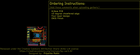
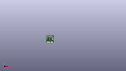
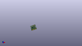

Contents
========

* [PROJ-SPAR-16984-STAN-01>MicroMod Processor Board-nRF52840](#proj-spar-16984-stan-01micromod-processor-board-nrf52840)
	* [Images](#images)
	* [Interactive BOM](#interactive-bom)
	* [OOMP Parts](#oomp-parts)
	* [Tags](#tags)
  
![][im]
# PROJ-SPAR-16984-STAN-01>MicroMod Processor Board-nRF52840

- ID: PROJ-SPAR-16984-STAN-01
- Hex ID: PRS16984
- Name: MicroMod Processor Board-nRF52840
- Description: 

## Images
  
  

|eagleImage|kicadPcb3dFront|kicadPcb3dBack|kicadPcb3d|
| :---: | :---: | :---: | :---: |
|||||

## Interactive BOM

- Interactive BOM page: [ibom.html](kicad/bom/ibom.html)

## OOMP Parts
  

|OOMP Parts|
| :---: |
|CAPE-0402-X-NF100-01, C1, 8.125000005999999, 13.492999937999997, M270,C1, 0.1uF, 0402-TIGHT, SparkFun-Capacitors, (0.31988189, 0.53122047), MR270|
|CAPE-0402-X-UNMATCHED-01, C2, 20.574, 11.937999999999999, 180,C2, 15pF, 0402-TIGHT, SparkFun-Capacitors, (0.81, 0.47), R180|
|CAPE-0402-X-UNMATCHED-01, C3, 20.574, 7.112, 180,C3, 15pF, 0402-TIGHT, SparkFun-Capacitors, (0.81, 0.28), R180|
|CAPE-0402-X-UNMATCHED-01, C4, 20.574, 13.843, 0,C4, 10uF, 0402-TIGHT, SparkFun-Capacitors, (0.81, 0.545), R0|
|CAPE-0402-X-UNMATCHED-01, C5, 20.574, 14.858999999999998, 0,C5, 10uF, 0402-TIGHT, SparkFun-Capacitors, (0.81, 0.585), R0|
|CAPE-0402-X-NF100-01, C6, 20.574, 15.875, 0,C6, 0.1uF, 0402-TIGHT, SparkFun-Capacitors, (0.81, 0.625), R0|
|UNMATCHED-0603-X-UNMATCHED-01, D1, 2.3650000959999997, 20.99999991, 180,D1, BLUE, LED-0603, SparkFun-LED, (0.09311024, 0.82677165), R180|
|UNMATCHED-UNMATCHED-X-UNMATCHED-01, D2, 1.27, 7.619999999999999, 270,D2, 1A/23V/620mV, SOD-323, SparkFun-DiscreteSemi, (0.05, 0.3), R270|
|UNMATCHED-UNMATCHED-X-UNMATCHED-01, FD1, 0.619000032, 4.618999906, 0,FD1, FIDUCIALUFIDUCIAL, FIDUCIAL-MICRO, SparkFun-Aesthetics, (0.02437008, 0.18185039), R0|
|UNMATCHED-UNMATCHED-X-UNMATCHED-01, FD2, 21.300000072, 21.300000072, 0,FD2, FIDUCIALUFIDUCIAL, FIDUCIAL-MICRO, SparkFun-Aesthetics, (0.83858268, 0.83858268), R0|
|UNMATCHED-UNMATCHED-X-UNMATCHED-01, FD3, 21.253999909999997, 21.253999909999997, M0,FD3, FIDUCIALUFIDUCIAL, FIDUCIAL-MICRO, SparkFun-Aesthetics, (0.83677165, 0.83677165), MR0|
|UNMATCHED-UNMATCHED-X-UNMATCHED-01, FD4, 0.619000032, 4.618999906, M0,FD4, FIDUCIALUFIDUCIAL, FIDUCIAL-MICRO, SparkFun-Aesthetics, (0.02437008, 0.18185039), MR0|
|UNMATCHED-UNMATCHED-X-UNMATCHED-01, J1, 11.000000098, 0.0, 0,J1, MICROMOD-2222, M.2-CARD-E-22, SparkFun-MicroMod, (0.43307087, 0), R0|
|RESE-0402-X-UNMATCHED-01, R1, 7.777999938, 20.99999991, 0,R1, 1k, 0402-TIGHT, SparkFun-Resistors, (0.30622047, 0.82677165), R0|
|RESE-0402-X-UNMATCHED-01, R2, 18.937999969999996, 19.510000096, 180,R2, 27OHM, 0402-TIGHT, SparkFun-Resistors, (0.74559055, 0.76811024), R180|
|RESE-0402-X-UNMATCHED-01, R3, 18.937999969999996, 18.494000096, 180,R3, 27OHM, 0402-TIGHT, SparkFun-Resistors, (0.74559055, 0.72811024), R180|
|<table><tr><td></td><td> R4</td><td>[RESE-0402-X-O103-01 SMD (0402) 10k Ohm Resistor](https://github.com/oomlout/oomlout_OOMP_parts/tree/main/RESE-0402-X-O103-01/)</td><td>[R42103](https://github.com/oomlout/oomlout_OOMP_parts/tree/main/RESE-0402-X-O103-01/)</td></tr></table>|
|<table><tr><td></td><td> R5</td><td>[RESE-0402-X-O103-01 SMD (0402) 10k Ohm Resistor](https://github.com/oomlout/oomlout_OOMP_parts/tree/main/RESE-0402-X-O103-01/)</td><td>[R42103](https://github.com/oomlout/oomlout_OOMP_parts/tree/main/RESE-0402-X-O103-01/)</td></tr></table>|
|UNMATCHED-UNMATCHED-X-UNMATCHED-01, U1, 11.999999875999999, 11.999999875999999, M0,U1, W25QXX128MBIT-6X5, WSON-8-6X5, SparkFun-MicroMod, (0.47244094, 0.47244094), MR0|
|UNMATCHED-UNMATCHED-X-UNMATCHED-01, U2, 11.000000098, 12.430000031999999, 90,U2, MDBT50Q, MDBT50Q, SparkFun-RF, (0.43307087, 0.48937008), R90|
|UNMATCHED-UNMATCHED-X-UNMATCHED-01, Y1, 20.574, 9.524999999999999, 90,Y1, 32.768kHz, CRYSTAL-SMD-3.2X1.5MM, SparkFun-Clocks, (0.81, 0.375), R90|

## Tags

- hexID: PRS16984
- oompType: PROJ
- oompSize: SPAR
- oompColor: 16984
- oompDesc: STAN
- oompIndex: 01
- oompName: MicroMod Processor Board-nRF52840
- sources: All source files from https://github.com/sparkfun/MicroMod_Processor_Board-nRF52840 (source licence details in srcLicense.md)
- linkBuyPage: https://www.sparkfun.com/products/16984
- oompPart: CAPE-0402-X-NF100-01, C1, 8.125000005999999, 13.492999937999997, M270
- oompPart: CAPE-0402-X-UNMATCHED-01, C2, 20.574, 11.937999999999999, 180
- oompPart: CAPE-0402-X-UNMATCHED-01, C3, 20.574, 7.112, 180
- oompPart: CAPE-0402-X-UNMATCHED-01, C4, 20.574, 13.843, 0
- oompPart: CAPE-0402-X-UNMATCHED-01, C5, 20.574, 14.858999999999998, 0
- oompPart: CAPE-0402-X-NF100-01, C6, 20.574, 15.875, 0
- oompPart: UNMATCHED-0603-X-UNMATCHED-01, D1, 2.3650000959999997, 20.99999991, 180
- oompPart: UNMATCHED-UNMATCHED-X-UNMATCHED-01, D2, 1.27, 7.619999999999999, 270
- oompPart: UNMATCHED-UNMATCHED-X-UNMATCHED-01, FD1, 0.619000032, 4.618999906, 0
- oompPart: UNMATCHED-UNMATCHED-X-UNMATCHED-01, FD2, 21.300000072, 21.300000072, 0
- oompPart: UNMATCHED-UNMATCHED-X-UNMATCHED-01, FD3, 21.253999909999997, 21.253999909999997, M0
- oompPart: UNMATCHED-UNMATCHED-X-UNMATCHED-01, FD4, 0.619000032, 4.618999906, M0
- oompPart: UNMATCHED-UNMATCHED-X-UNMATCHED-01, J1, 11.000000098, 0.0, 0
- oompPart: RESE-0402-X-UNMATCHED-01, R1, 7.777999938, 20.99999991, 0
- oompPart: RESE-0402-X-UNMATCHED-01, R2, 18.937999969999996, 19.510000096, 180
- oompPart: RESE-0402-X-UNMATCHED-01, R3, 18.937999969999996, 18.494000096, 180
- oompPart: RESE-0402-X-O103-01, R4, 11.43, 19.668000034, 180
- oompPart: RESE-0402-X-O103-01, R5, 11.43, 18.652000034, 180
- oompPart: UNMATCHED-UNMATCHED-X-UNMATCHED-01, U1, 11.999999875999999, 11.999999875999999, M0
- oompPart: UNMATCHED-UNMATCHED-X-UNMATCHED-01, U2, 11.000000098, 12.430000031999999, 90
- oompPart: UNMATCHED-UNMATCHED-X-UNMATCHED-01, Y1, 20.574, 9.524999999999999, 90
- rawPart: C1, 0.1uF, 0402-TIGHT, SparkFun-Capacitors, (0.31988189, 0.53122047), MR270
- rawPart: C2, 15pF, 0402-TIGHT, SparkFun-Capacitors, (0.81, 0.47), R180
- rawPart: C3, 15pF, 0402-TIGHT, SparkFun-Capacitors, (0.81, 0.28), R180
- rawPart: C4, 10uF, 0402-TIGHT, SparkFun-Capacitors, (0.81, 0.545), R0
- rawPart: C5, 10uF, 0402-TIGHT, SparkFun-Capacitors, (0.81, 0.585), R0
- rawPart: C6, 0.1uF, 0402-TIGHT, SparkFun-Capacitors, (0.81, 0.625), R0
- rawPart: D1, BLUE, LED-0603, SparkFun-LED, (0.09311024, 0.82677165), R180
- rawPart: D2, 1A/23V/620mV, SOD-323, SparkFun-DiscreteSemi, (0.05, 0.3), R270
- rawPart: FD1, FIDUCIALUFIDUCIAL, FIDUCIAL-MICRO, SparkFun-Aesthetics, (0.02437008, 0.18185039), R0
- rawPart: FD2, FIDUCIALUFIDUCIAL, FIDUCIAL-MICRO, SparkFun-Aesthetics, (0.83858268, 0.83858268), R0
- rawPart: FD3, FIDUCIALUFIDUCIAL, FIDUCIAL-MICRO, SparkFun-Aesthetics, (0.83677165, 0.83677165), MR0
- rawPart: FD4, FIDUCIALUFIDUCIAL, FIDUCIAL-MICRO, SparkFun-Aesthetics, (0.02437008, 0.18185039), MR0
- rawPart: J1, MICROMOD-2222, M.2-CARD-E-22, SparkFun-MicroMod, (0.43307087, 0), R0
- rawPart: R1, 1k, 0402-TIGHT, SparkFun-Resistors, (0.30622047, 0.82677165), R0
- rawPart: R2, 27OHM, 0402-TIGHT, SparkFun-Resistors, (0.74559055, 0.76811024), R180
- rawPart: R3, 27OHM, 0402-TIGHT, SparkFun-Resistors, (0.74559055, 0.72811024), R180
- rawPart: R4, 10k, 0402-TIGHT, SparkFun-Resistors, (0.45, 0.77433071), R180
- rawPart: R5, 10k, 0402-TIGHT, SparkFun-Resistors, (0.45, 0.73433071), R180
- rawPart: U1, W25QXX128MBIT-6X5, WSON-8-6X5, SparkFun-MicroMod, (0.47244094, 0.47244094), MR0
- rawPart: U2, MDBT50Q, MDBT50Q, SparkFun-RF, (0.43307087, 0.48937008), R90
- rawPart: Y1, 32.768kHz, CRYSTAL-SMD-3.2X1.5MM, SparkFun-Clocks, (0.81, 0.375), R90

[im]: kicadPcb3d_450.png
