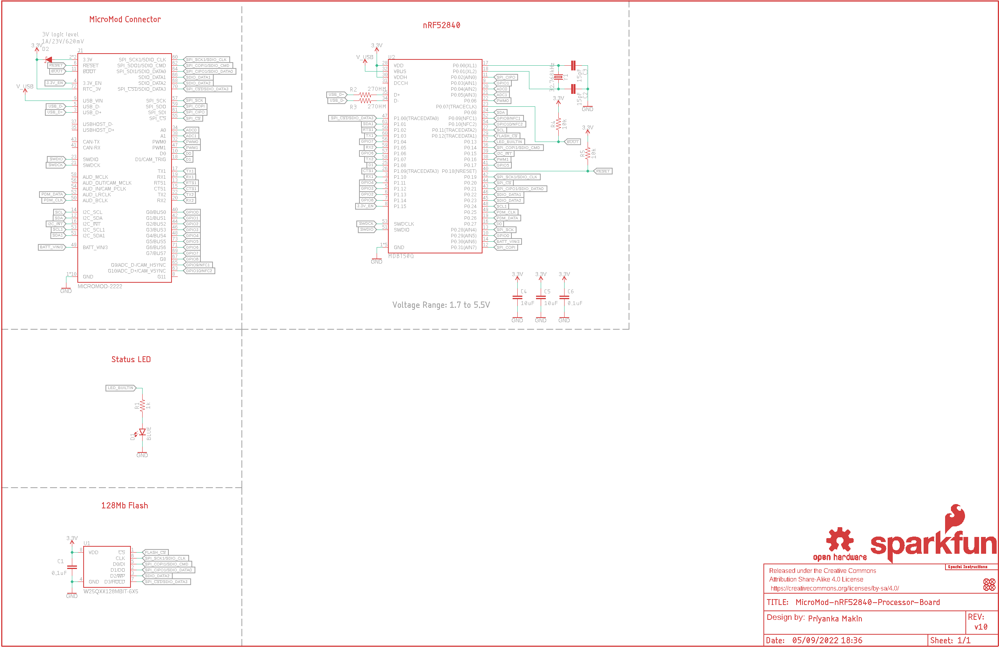
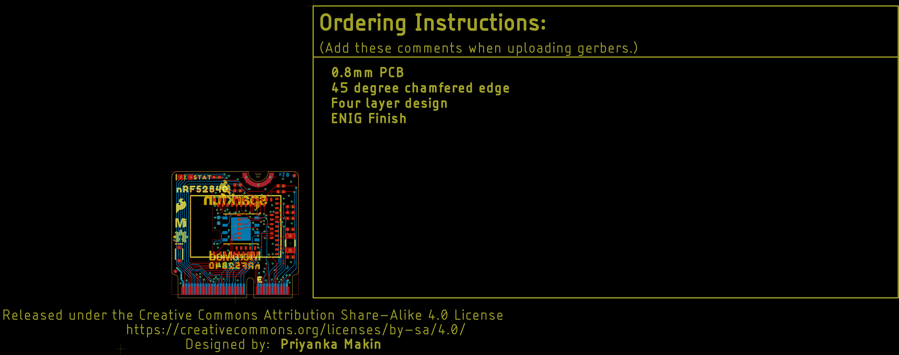
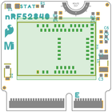
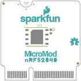
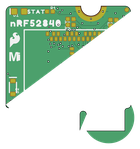

Contents
========

* [PRS16984 > MicroMod Processor Board-nRF52840](#prs16984--micromod-processor-board-nrf52840)
	* [Schematic](#schematic)
	* [PCB](#pcb)
	* [Interactive BOM](#interactive-bom)
	* [Images](#images)
	* [Tags](#tags)
  
![][im]
# PRS16984 > MicroMod Processor Board-nRF52840

- ID: PROJ-SPAR-16984-STAN-01
- Hex ID: PRS16984
- Name: Sparkfun
- Description: Sparkfun
- Long Link: [http://oom.lt/PROJ-SPAR-16984-STAN-01](http://oom.lt/PROJ-SPAR-16984-STAN-01)
- Short Link: [http://oom.lt/PRS16984](http://oom.lt/PRS16984)

## Schematic
  

## PCB
  

## Interactive BOM

- Interactive BOM page: [ibom.html](https://htmlpreview.github.io/?https://github.com/oomlout/oomlout_OOMP_projects/blob/main/PROJ-SPAR-16984-STAN-01/kicad/bom/ibom.html)

## Images
  
  

|bominteractivefront|bominteractiveback|kicadPcb3d|kicadPcb3dFront|kicadPcb3dBack|eagleImage|eagleSchemImage|pcbdraw|pcbdrawback|
| :---: | :---: | :---: | :---: | :---: | :---: | :---: | :---: | :---: |
||||||||||

## Tags

- hexID: PRS16984
- oompType: PROJ
- oompSize: SPAR
- oompColor: 16984
- oompDesc: STAN
- oompIndex: 01
- oompName: MicroMod Processor Board-nRF52840
- sources: All source files from https://github.com/sparkfun/MicroMod_Processor_Board-nRF52840 (source licence details in srcLicense.md)
- linkBuyPage: https://www.sparkfun.com/products/16984
- oompID: PROJ-SPAR-16984-STAN-01
- rawParts: C1,0.1uF,0.1UF-0402T-16V-10%,0402-TIGHT,0.1µF ceramic capacitors,,CAP-12416,,0.1uF,
- rawParts: C2,15pF,15PF-0402T-50V-5%,0402-TIGHT,15pF ceramic capacitors,,CAP-13063,,15pF,
- rawParts: C3,15pF,15PF-0402T-50V-5%,0402-TIGHT,15pF ceramic capacitors,,CAP-13063,,15pF,
- rawParts: C4,10uF,10UF-0402T-6.3V-20%,0402-TIGHT,10.0µF ceramic capacitors,,CAP-14848,,10uF,
- rawParts: C5,10uF,10UF-0402T-6.3V-20%,0402-TIGHT,10.0µF ceramic capacitors,,CAP-14848,,10uF,
- rawParts: C6,0.1uF,0.1UF-0402T-16V-10%,0402-TIGHT,0.1µF ceramic capacitors,,CAP-12416,,0.1uF,
- rawParts: D1,BLUE,LED-BLUE0603,LED-0603,Blue SMD LED,,DIO-08575,,BLUE,
- rawParts: D2,1A/23V/620mV,DIODE-SCHOTTKY-BAT20J,SOD-323,Schottky diode,,DIO-11623,,1A/23V/620mV,
- rawParts: FD1,FIDUCIALUFIDUCIAL,FIDUCIALUFIDUCIAL,FIDUCIAL-MICRO,Fiducial Alignment Points,,,,,
- rawParts: FD2,FIDUCIALUFIDUCIAL,FIDUCIALUFIDUCIAL,FIDUCIAL-MICRO,Fiducial Alignment Points,,,,,
- rawParts: FD3,FIDUCIALUFIDUCIAL,FIDUCIALUFIDUCIAL,FIDUCIAL-MICRO,Fiducial Alignment Points,,,,,
- rawParts: FD4,FIDUCIALUFIDUCIAL,FIDUCIALUFIDUCIAL,FIDUCIAL-MICRO,Fiducial Alignment Points,,,,,
- rawParts: FRAME1,FRAME-LEDGER,FRAME-LEDGER,CREATIVE_COMMONS,Schematic Frame - Ledger,,,,,
- rawParts: J1,MICROMOD-2222,MICROMOD-2222,M.2-CARD-E-22,MicroMod Connector,,,,,
- rawParts: LOGO1,SFE_LOGO_NAME_FLAME.1_INCH,SFE_LOGO_NAME_FLAME.1_INCH,SFE_LOGO_NAME_FLAME_.1,SparkFun Font Logo w/ Flame,,,,,
- rawParts: LOGO2,SFE_LOGO_FLAME.1_INCH,SFE_LOGO_FLAME.1_INCH,SFE_LOGO_FLAME_.1,SparkFun Flame Logo,,,,,
- rawParts: LOGO3,OSHW-LOGOMINI,OSHW-LOGOMINI,OSHW-LOGO-MINI,Open-Source Hardware (OSHW) Logo,,,,,
- rawParts: LOGO4,SPECIAL_INSTRUCTIONS-ORDERING,SPECIAL_INSTRUCTIONS-ORDERING,ORDERING_INSTRUCTIONS,Special Ordering/Production Instructions Alert,,,,,
- rawParts: R1,1k,1KOHM-0402T-1/16W-1%,0402-TIGHT,1kΩ resistor,,RES-14342,,1k,
- rawParts: R2,27OHM,27OHM,0402-TIGHT,27Ω resistor,,RES-15238,,,
- rawParts: R3,27OHM,27OHM,0402-TIGHT,27Ω resistor,,RES-15238,,,
- rawParts: R4,10k,10KOHM-0402T-1/16W-1%,0402-TIGHT,10kΩ resistor,,RES-14241,,10k,
- rawParts: R5,10k,10KOHM-0402T-1/16W-1%,0402-TIGHT,10kΩ resistor,,RES-14241,,10k,
- rawParts: U1,W25QXX128MBIT-6X5,W25QXX128MBIT-6X5,WSON-8-6X5,,,IC-15107,,,
- rawParts: U2,MDBT50Q,MDBT50Q,MDBT50Q,,,IC-14109,,,
- rawParts: Y1,32.768kHz,CRYSTAL-32.768KHZSMD-3.2X1.5,CRYSTAL-SMD-3.2X1.5MM,32.768kHz Crystal,,XTAL-13062,,32.768kHz,

[im]: kicadPcb3d_450.png
