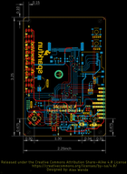
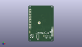
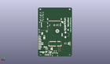
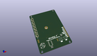

Contents
========

* [PROJ-SPAR-16985-STAN-01>MicroMod Input and Display Carrier](#proj-spar-16985-stan-01micromod-input-and-display-carrier)
	* [Images](#images)
	* [Interactive BOM](#interactive-bom)
	* [OOMP Parts](#oomp-parts)
	* [Tags](#tags)
  
![][im]
# PROJ-SPAR-16985-STAN-01>MicroMod Input and Display Carrier

- ID: PROJ-SPAR-16985-STAN-01
- Hex ID: PRS16985
- Name: MicroMod Input and Display Carrier
- Description: 

## Images
  
  

|eagleImage|kicadPcb3dFront|kicadPcb3dBack|kicadPcb3d|
| :---: | :---: | :---: | :---: |
|||||

## Interactive BOM

- Interactive BOM page: [ibom.html](kicad/bom/ibom.html)

## OOMP Parts
  

|OOMP Parts|
| :---: |
|UNMATCHED-UNMATCHED-X-UNMATCHED-01, 3V3_EN, 48.641, 5.715, M0,3V3_EN, SMT-JUMPER_2_NO_SILK, SparkFun-Jumpers, (1.915, 0.225), MR0|
|UNMATCHED-UNMATCHED-X-UNMATCHED-01, BYP, 36.195, 5.968999999999999, M180,BYP, JUMPER-SMT_2_NO_SILK, SMT-JUMPER_2_NO_SILK, SparkFun-Jumpers, (1.425, 0.235), MR180|
|<table><tr><td></td><td> C1</td><td>[CAPC-0603-X-NF100-V50 SMD (0603) 100 nF Capacitor (Ceramic) 50v](https://github.com/oomlout/oomlout_OOMP_parts/tree/main/CAPC-0603-X-NF100-V50/)</td><td>[C6N100](https://github.com/oomlout/oomlout_OOMP_parts/tree/main/CAPC-0603-X-NF100-V50/)</td></tr></table>|
|CAPC-UNMATCHED-X-UNMATCHED-01, C2, 38.73499999999999, 7.874, M270,C2, 10uF, EIA3216, SparkFun-Capacitors, (1.525, 0.31), MR270|
|CAPC-0603-X-UNMATCHED-01, C3, 44.196, 12.953999999999999, M270,C3, 1.0uF, 0603, SparkFun-Capacitors, (1.74, 0.51), MR270|
|<table><tr><td></td><td> C4</td><td>[CAPC-0603-X-NF100-V50 SMD (0603) 100 nF Capacitor (Ceramic) 50v](https://github.com/oomlout/oomlout_OOMP_parts/tree/main/CAPC-0603-X-NF100-V50/)</td><td>[C6N100](https://github.com/oomlout/oomlout_OOMP_parts/tree/main/CAPC-0603-X-NF100-V50/)</td></tr></table>|
|CAPC-0603-X-NF220-V50, C5, 41.148, 12.953999999999999, M270,C5, 0.22uF, 0603, SparkFun-Capacitors, (1.62, 0.51), MR270|
|<table><tr><td></td><td> C6</td><td>[CAPC-0603-X-NF100-V50 SMD (0603) 100 nF Capacitor (Ceramic) 50v](https://github.com/oomlout/oomlout_OOMP_parts/tree/main/CAPC-0603-X-NF100-V50/)</td><td>[C6N100](https://github.com/oomlout/oomlout_OOMP_parts/tree/main/CAPC-0603-X-NF100-V50/)</td></tr></table>|
|<table><tr><td></td><td> C7</td><td>[CAPC-0603-X-NF100-V50 SMD (0603) 100 nF Capacitor (Ceramic) 50v](https://github.com/oomlout/oomlout_OOMP_parts/tree/main/CAPC-0603-X-NF100-V50/)</td><td>[C6N100](https://github.com/oomlout/oomlout_OOMP_parts/tree/main/CAPC-0603-X-NF100-V50/)</td></tr></table>|
|<table><tr><td></td><td> C12</td><td>[CAPC-0603-X-NF100-V50 SMD (0603) 100 nF Capacitor (Ceramic) 50v](https://github.com/oomlout/oomlout_OOMP_parts/tree/main/CAPC-0603-X-NF100-V50/)</td><td>[C6N100](https://github.com/oomlout/oomlout_OOMP_parts/tree/main/CAPC-0603-X-NF100-V50/)</td></tr></table>|
|CAPC-0603-X-NF220-V50, C13, 40.386, 2.794, M270,C13, 0.22uF, 0603, SparkFun-Capacitors, (1.59, 0.11), MR270|
|UNMATCHED-UNMATCHED-X-UNMATCHED-01, D1, 45.339, 2.794, M270,D1, 3.3V, SOD-323, SparkFun-DiscreteSemi, (1.785, 0.11), MR270|
|UNMATCHED-0603-X-UNMATCHED-01, D2, 44.704, 19.304, 0,D2, RED, LED-0603, SparkFun-LED, (1.76, 0.76), R0|
|UNMATCHED-UNMATCHED-X-UNMATCHED-01, D3, 3.8099999999999996, 33.289999968, 0,D3, APA102-5050, APA102-5050, SparkFun-LED, (0.15, 1.31062992), R0|
|UNMATCHED-UNMATCHED-X-UNMATCHED-01, D4, 3.8099999999999996, 40.909999968, 0,D4, APA102-5050, APA102-5050, SparkFun-LED, (0.15, 1.61062992), R0|
|UNMATCHED-UNMATCHED-X-UNMATCHED-01, D5, 3.8099999999999996, 48.529999968, 0,D5, APA102-5050, APA102-5050, SparkFun-LED, (0.15, 1.91062992), R0|
|UNMATCHED-UNMATCHED-X-UNMATCHED-01, D6, 3.8099999999999996, 56.149999968, 0,D6, APA102-5050, APA102-5050, SparkFun-LED, (0.15, 2.21062992), R0|
|UNMATCHED-UNMATCHED-X-UNMATCHED-01, D7, 3.8099999999999996, 63.76999996799999, 0,D7, APA102-5050, APA102-5050, SparkFun-LED, (0.15, 2.51062992), R0|
|UNMATCHED-UNMATCHED-X-UNMATCHED-01, D8, 3.8099999999999996, 71.38999996799998, 0,D8, APA102-5050, APA102-5050, SparkFun-LED, (0.15, 2.81062992), R0|
|UNMATCHED-1210-X-UNMATCHED-01, F2, 37.211, 2.794, M180,F2, 6V/2A, 1210, SparkFun-Fuses, (1.465, 0.11), MR180|
|UNMATCHED-UNMATCHED-X-UNMATCHED-01, H5, 24.580000115999997, 42.865000122, M90,H5, STAND-OFF, STAND-OFF-REFLOW-M2.5, SparkFun-Hardware, (0.96771654, 1.68759843), MR90|
|UNMATCHED-UNMATCHED-X-UNMATCHED-01, I2C, 46.608999999999995, 30.099, M180,I2C, SMT-JUMPER_3_2-NC_TRACE_SILK, SparkFun-Jumpers, (1.835, 1.185), MR180|
|UNMATCHED-UNMATCHED-X-UNMATCHED-01, J1, 28.575, 22.86, M0,J1, MICROMOD-2222-C, M.2-CONNECTOR-E, SparkFun-MicroMod, (1.125, 0.9), MR0|
|UNMATCHED-UNMATCHED-X-UNMATCHED-01, J2, 40.64, 58.419999999999995, M90,J2, MICRO-SD, MICRO-SD-SOCKET, SparkFun-Connectors, (1.6, 2.3), MR90|
|UNMATCHED-UNMATCHED-X-UNMATCHED-01, J3, 28.575, 6.35, M0,J3, USB-C_Prog, USB-C-16P-2LAYER-PADS, SparkFun-Connectors, (1.125, 0.25), MR0|
|ERROR, J5 2.4 TFT, 0, 0, 0,J5, 2.4, TFT, FPC05040-17204, SparkFun-Displays, (1.16043307, 2.38188976), MR180|
|UNMATCHED-UNMATCHED-X-UNMATCHED-01, J6, 51.308, 38.480999999999995, M270,J6, QWIIC_RA, JST04_1MM_RA, SparkFun-Connectors, (2.02, 1.515), MR270|
|UNMATCHED-UNMATCHED-X-UNMATCHED-01, J7, 3.302, 21.843999999999998, M90,J7, CORTEX_JTAG_DEBUG, 2X5-PTH-1.27MM-NO_SILK, SparkFun-Connectors, (0.13, 0.86), MR90|
|UNMATCHED-UNMATCHED-X-UNMATCHED-01, J8, 55.88, 12.7, 90,J8, 1X09_NO_SILK, SparkFun-Connectors, (2.2, 0.5), R90|
|UNMATCHED-UNMATCHED-X-UNMATCHED-01, LS1, 11.049, 36.57599999999999, M90,LS1, Buzzer, BUZZER-CCV, SparkFun-Electromechanical, (0.435, 1.44), MR90|
|UNMATCHED-UNMATCHED-X-UNMATCHED-01, MEAS, 34.925, 12.953999999999999, M90,MEAS, COMBO-JUMPER_2_NC_TRACE, SparkFun-Jumpers, (1.375, 0.51), MR90|
|UNMATCHED-UNMATCHED-X-UNMATCHED-01, PWR, 46.736, 15.875, M270,PWR, SMT-JUMPER_2_NC_TRACE_SILK, SparkFun-Jumpers, (1.84, 0.625), MR270|
|UNMATCHED-UNMATCHED-X-UNMATCHED-01, Q1, 23.241, 53.213, M0,Q1, 1.1A/600m?, SOT23-3, SparkFun-DiscreteSemi, (0.915, 2.095), MR0|
|UNMATCHED-UNMATCHED-X-UNMATCHED-01, Q2, 9.509000032, 22.031999877999997, M270,Q2, 600mA/40V, SOT23-3, SparkFun-DiscreteSemi, (0.37437008, 0.86740157), MR270|
|RESE-0603-X-UNMATCHED-01, R1, 26.669999999999998, 8.889999999999999, M270,R1, 5.1k, 0603, SparkFun-Resistors, (1.05, 0.35), MR270|
|RESE-0603-X-UNMATCHED-01, R2, 29.845, 8.889999999999999, M270,R2, 5.1k, 0603, SparkFun-Resistors, (1.175, 0.35), MR270|
|<table><tr><td></td><td> R3</td><td>[RESE-0603-X-O104-01 SMD (0603) 100k Ohm Resistor](https://github.com/oomlout/oomlout_OOMP_parts/tree/main/RESE-0603-X-O104-01/)</td><td>[R6104](https://github.com/oomlout/oomlout_OOMP_parts/tree/main/RESE-0603-X-O104-01/)</td></tr></table>|
|<table><tr><td></td><td> R4</td><td>[RESE-0603-X-O104-01 SMD (0603) 100k Ohm Resistor](https://github.com/oomlout/oomlout_OOMP_parts/tree/main/RESE-0603-X-O104-01/)</td><td>[R6104](https://github.com/oomlout/oomlout_OOMP_parts/tree/main/RESE-0603-X-O104-01/)</td></tr></table>|
|<table><tr><td></td><td> R5</td><td>[RESE-0603-X-O104-01 SMD (0603) 100k Ohm Resistor](https://github.com/oomlout/oomlout_OOMP_parts/tree/main/RESE-0603-X-O104-01/)</td><td>[R6104](https://github.com/oomlout/oomlout_OOMP_parts/tree/main/RESE-0603-X-O104-01/)</td></tr></table>|
|<table><tr><td></td><td> R6</td><td>[RESE-0603-X-O104-01 SMD (0603) 100k Ohm Resistor](https://github.com/oomlout/oomlout_OOMP_parts/tree/main/RESE-0603-X-O104-01/)</td><td>[R6104](https://github.com/oomlout/oomlout_OOMP_parts/tree/main/RESE-0603-X-O104-01/)</td></tr></table>|
|RESE-0603-X-UNMATCHED-01, R7, 47.370999999999995, 34.163, M270,R7, 2.2k, 0603, SparkFun-Resistors, (1.865, 1.345), MR270|
|RESE-0603-X-UNMATCHED-01, R8, 45.846999999999994, 34.163, M270,R8, 2.2k, 0603, SparkFun-Resistors, (1.805, 1.345), MR270|
|<table><tr><td></td><td> R9</td><td>[RESE-0603-X-O104-01 SMD (0603) 100k Ohm Resistor](https://github.com/oomlout/oomlout_OOMP_parts/tree/main/RESE-0603-X-O104-01/)</td><td>[R6104](https://github.com/oomlout/oomlout_OOMP_parts/tree/main/RESE-0603-X-O104-01/)</td></tr></table>|
|<table><tr><td></td><td> R10</td><td>[RESE-0603-X-O104-01 SMD (0603) 100k Ohm Resistor](https://github.com/oomlout/oomlout_OOMP_parts/tree/main/RESE-0603-X-O104-01/)</td><td>[R6104](https://github.com/oomlout/oomlout_OOMP_parts/tree/main/RESE-0603-X-O104-01/)</td></tr></table>|
|RESE-0603-X-UNMATCHED-01, R11, 44.704, 17.779999999999998, 0,R11, 1k, 0603, SparkFun-Resistors, (1.76, 0.7), R0|
|RESE-UNMATCHED-X-UNMATCHED-01, R12, 19.431, 53.339999999999996, M270,R12, 10, 1206, SparkFun-Resistors, (0.765, 2.1), MR270|
|RESE-0603-X-UNMATCHED-01, R13, 12.191999999999998, 21.971, M90,R13, 1k, 0603, SparkFun-Resistors, (0.48, 0.865), MR90|
|UNMATCHED-UNMATCHED-X-UNMATCHED-01, S1, 50.8, 72.39, M0,S1, Reset, TACTILE_SWITCH_SMD_5.2MM, SparkFun-Switches, (2, 2.85), MR0|
|UNMATCHED-UNMATCHED-X-UNMATCHED-01, S2, 50.8, 64.26199999999999, M0,S2, BOOT, TACTILE_SWITCH_SMD_5.2MM, SparkFun-Switches, (2, 2.53), MR0|
|UNMATCHED-UNMATCHED-X-UNMATCHED-01, S3, 40.64, 12.065, 0,S3, MOMENTARY-SWITCH-SPST-SMD-5.2MM-TALL, TACTILE_SWITCH_SMD_5.2MM, SparkFun-Switches, (1.6, 0.475), R0|
|UNMATCHED-UNMATCHED-X-UNMATCHED-01, S4, 49.275999999999996, 12.065, 0,S4, MOMENTARY-SWITCH-SPST-SMD-5.2MM-TALL, TACTILE_SWITCH_SMD_5.2MM, SparkFun-Switches, (1.94, 0.475), R0|
|UNMATCHED-UNMATCHED-X-UNMATCHED-01, S6, 7.619999999999999, 12.065, 315,S6, Joystick, JOYSTICK_MINI, SparkFun-Switches, (0.3, 0.475), R315|
|UNMATCHED-UNMATCHED-X-UNMATCHED-01, U2, 21.209, 11.43, 90,U2, ATTINY84, SO14, SparkFun-IC-Microcontroller, (0.835, 0.45), R90|
|UNMATCHED-UNMATCHED-X-UNMATCHED-01, U5, 43.18, 7.874, M180,U5, AP7361C-33FGE, UDFN-8, SparkFun-IC-Power, (1.7, 0.31), MR180|

## Tags

- hexID: PRS16985
- oompType: PROJ
- oompSize: SPAR
- oompColor: 16985
- oompDesc: STAN
- oompIndex: 01
- oompName: MicroMod Input and Display Carrier
- sources: All source files from https://github.com/sparkfun/MicroMod_Input_and_Display_Carrier (source licence details in srcLicense.md)
- linkBuyPage: https://www.sparkfun.com/products/16985
- oompPart: UNMATCHED-UNMATCHED-X-UNMATCHED-01, 3V3_EN, 48.641, 5.715, M0
- oompPart: UNMATCHED-UNMATCHED-X-UNMATCHED-01, BYP, 36.195, 5.968999999999999, M180
- oompPart: CAPC-0603-X-NF100-V50, C1, 41.91, 2.794, M270
- oompPart: CAPC-UNMATCHED-X-UNMATCHED-01, C2, 38.73499999999999, 7.874, M270
- oompPart: CAPC-0603-X-UNMATCHED-01, C3, 44.196, 12.953999999999999, M270
- oompPart: CAPC-0603-X-NF100-V50, C4, 42.672, 12.953999999999999, M270
- oompPart: CAPC-0603-X-NF220-V50, C5, 41.148, 12.953999999999999, M270
- oompPart: CAPC-0603-X-NF100-V50, C6, 42.291, 43.18, M0
- oompPart: CAPC-0603-X-NF100-V50, C7, 29.717999999999996, 53.721000000000004, M180
- oompPart: CAPC-0603-X-NF100-V50, C12, 22.224999999999998, 4.699, 270
- oompPart: CAPC-0603-X-NF220-V50, C13, 40.386, 2.794, M270
- oompPart: UNMATCHED-UNMATCHED-X-UNMATCHED-01, D1, 45.339, 2.794, M270
- oompPart: UNMATCHED-0603-X-UNMATCHED-01, D2, 44.704, 19.304, 0
- oompPart: UNMATCHED-UNMATCHED-X-UNMATCHED-01, D3, 3.8099999999999996, 33.289999968, 0
- oompPart: UNMATCHED-UNMATCHED-X-UNMATCHED-01, D4, 3.8099999999999996, 40.909999968, 0
- oompPart: UNMATCHED-UNMATCHED-X-UNMATCHED-01, D5, 3.8099999999999996, 48.529999968, 0
- oompPart: UNMATCHED-UNMATCHED-X-UNMATCHED-01, D6, 3.8099999999999996, 56.149999968, 0
- oompPart: UNMATCHED-UNMATCHED-X-UNMATCHED-01, D7, 3.8099999999999996, 63.76999996799999, 0
- oompPart: UNMATCHED-UNMATCHED-X-UNMATCHED-01, D8, 3.8099999999999996, 71.38999996799998, 0
- oompPart: UNMATCHED-1210-X-UNMATCHED-01, F2, 37.211, 2.794, M180
- oompPart: SKIP-UNMATCHED-X-UNMATCHED-01, FD1, 1.27, 1.27, M0
- oompPart: SKIP-UNMATCHED-X-UNMATCHED-01, FD2, 1.27, 1.27, 0
- oompPart: SKIP-UNMATCHED-X-UNMATCHED-01, FD3, 55.88, 81.28, 0
- oompPart: SKIP-UNMATCHED-X-UNMATCHED-01, FD4, 55.88, 81.28, M0
- oompPart: UNMATCHED-UNMATCHED-X-UNMATCHED-01, H5, 24.580000115999997, 42.865000122, M90
- oompPart: UNMATCHED-UNMATCHED-X-UNMATCHED-01, I2C, 46.608999999999995, 30.099, M180
- oompPart: UNMATCHED-UNMATCHED-X-UNMATCHED-01, J1, 28.575, 22.86, M0
- oompPart: UNMATCHED-UNMATCHED-X-UNMATCHED-01, J2, 40.64, 58.419999999999995, M90
- oompPart: UNMATCHED-UNMATCHED-X-UNMATCHED-01, J3, 28.575, 6.35, M0
- oompPart: SKIP-UNMATCHED-X-UNMATCHED-01, J4, 21.209, 12.065, M90
- oompPart: ERROR, J5 2.4 TFT, 0, 0, 0
- oompPart: UNMATCHED-UNMATCHED-X-UNMATCHED-01, J6, 51.308, 38.480999999999995, M270
- oompPart: UNMATCHED-UNMATCHED-X-UNMATCHED-01, J7, 3.302, 21.843999999999998, M90
- oompPart: UNMATCHED-UNMATCHED-X-UNMATCHED-01, J8, 55.88, 12.7, 90
- oompPart: UNMATCHED-UNMATCHED-X-UNMATCHED-01, LS1, 11.049, 36.57599999999999, M90
- oompPart: UNMATCHED-UNMATCHED-X-UNMATCHED-01, MEAS, 34.925, 12.953999999999999, M90
- oompPart: UNMATCHED-UNMATCHED-X-UNMATCHED-01, PWR, 46.736, 15.875, M270
- oompPart: UNMATCHED-UNMATCHED-X-UNMATCHED-01, Q1, 23.241, 53.213, M0
- oompPart: UNMATCHED-UNMATCHED-X-UNMATCHED-01, Q2, 9.509000032, 22.031999877999997, M270
- oompPart: RESE-0603-X-UNMATCHED-01, R1, 26.669999999999998, 8.889999999999999, M270
- oompPart: RESE-0603-X-UNMATCHED-01, R2, 29.845, 8.889999999999999, M270
- oompPart: RESE-0603-X-O104-01, R3, 20.447, 4.699, 270
- oompPart: RESE-0603-X-O104-01, R4, 29.717999999999996, 51.943, M0
- oompPart: RESE-0603-X-O104-01, R5, 43.687999999999995, 2.794, M270
- oompPart: RESE-0603-X-O104-01, R6, 42.291, 41.65599999999999, M180
- oompPart: RESE-0603-X-UNMATCHED-01, R7, 47.370999999999995, 34.163, M270
- oompPart: RESE-0603-X-UNMATCHED-01, R8, 45.846999999999994, 34.163, M270
- oompPart: RESE-0603-X-O104-01, R9, 25.780999999999995, 52.958999999999996, M270
- oompPart: RESE-0603-X-O104-01, R10, 37.465, 52.832, M90
- oompPart: RESE-0603-X-UNMATCHED-01, R11, 44.704, 17.779999999999998, 0
- oompPart: RESE-UNMATCHED-X-UNMATCHED-01, R12, 19.431, 53.339999999999996, M270
- oompPart: RESE-0603-X-UNMATCHED-01, R13, 12.191999999999998, 21.971, M90
- oompPart: UNMATCHED-UNMATCHED-X-UNMATCHED-01, S1, 50.8, 72.39, M0
- oompPart: UNMATCHED-UNMATCHED-X-UNMATCHED-01, S2, 50.8, 64.26199999999999, M0
- oompPart: UNMATCHED-UNMATCHED-X-UNMATCHED-01, S3, 40.64, 12.065, 0
- oompPart: UNMATCHED-UNMATCHED-X-UNMATCHED-01, S4, 49.275999999999996, 12.065, 0
- oompPart: UNMATCHED-UNMATCHED-X-UNMATCHED-01, S6, 7.619999999999999, 12.065, 315
- oompPart: SKIP-UNMATCHED-X-UNMATCHED-01, TP1, 7.619999999999999, 20.32, M0
- oompPart: UNMATCHED-UNMATCHED-X-UNMATCHED-01, U2, 21.209, 11.43, 90
- oompPart: UNMATCHED-UNMATCHED-X-UNMATCHED-01, U5, 43.18, 7.874, M180
- rawPart: 3V3_EN, SMT-JUMPER_2_NO_SILK, SparkFun-Jumpers, (1.915, 0.225), MR0
- rawPart: BYP, JUMPER-SMT_2_NO_SILK, SMT-JUMPER_2_NO_SILK, SparkFun-Jumpers, (1.425, 0.235), MR180
- rawPart: C1, 0.1uF, 0603, SparkFun-Capacitors, (1.65, 0.11), MR270
- rawPart: C2, 10uF, EIA3216, SparkFun-Capacitors, (1.525, 0.31), MR270
- rawPart: C3, 1.0uF, 0603, SparkFun-Capacitors, (1.74, 0.51), MR270
- rawPart: C4, 0.1uF, 0603, SparkFun-Capacitors, (1.68, 0.51), MR270
- rawPart: C5, 0.22uF, 0603, SparkFun-Capacitors, (1.62, 0.51), MR270
- rawPart: C6, 0.1uF, 0603, SparkFun-Capacitors, (1.665, 1.7), MR0
- rawPart: C7, 0.1uF, 0603, SparkFun-Capacitors, (1.17, 2.115), MR180
- rawPart: C12, 0.1uF, 0603, SparkFun-Capacitors, (0.875, 0.185), R270
- rawPart: C13, 0.22uF, 0603, SparkFun-Capacitors, (1.59, 0.11), MR270
- rawPart: D1, 3.3V, SOD-323, SparkFun-DiscreteSemi, (1.785, 0.11), MR270
- rawPart: D2, RED, LED-0603, SparkFun-LED, (1.76, 0.76), R0
- rawPart: D3, APA102-5050, APA102-5050, SparkFun-LED, (0.15, 1.31062992), R0
- rawPart: D4, APA102-5050, APA102-5050, SparkFun-LED, (0.15, 1.61062992), R0
- rawPart: D5, APA102-5050, APA102-5050, SparkFun-LED, (0.15, 1.91062992), R0
- rawPart: D6, APA102-5050, APA102-5050, SparkFun-LED, (0.15, 2.21062992), R0
- rawPart: D7, APA102-5050, APA102-5050, SparkFun-LED, (0.15, 2.51062992), R0
- rawPart: D8, APA102-5050, APA102-5050, SparkFun-LED, (0.15, 2.81062992), R0
- rawPart: F2, 6V/2A, 1210, SparkFun-Fuses, (1.465, 0.11), MR180
- rawPart: FD1, FIDUCIALUFIDUCIAL, FIDUCIAL-MICRO, SparkFun-Aesthetics, (0.05, 0.05), MR0
- rawPart: FD2, FIDUCIALUFIDUCIAL, FIDUCIAL-MICRO, SparkFun-Aesthetics, (0.05, 0.05), R0
- rawPart: FD3, FIDUCIALUFIDUCIAL, FIDUCIAL-MICRO, SparkFun-Aesthetics, (2.2, 3.2), R0
- rawPart: FD4, FIDUCIALUFIDUCIAL, FIDUCIAL-MICRO, SparkFun-Aesthetics, (2.2, 3.2), MR0
- rawPart: H5, STAND-OFF, STAND-OFF-REFLOW-M2.5, SparkFun-Hardware, (0.96771654, 1.68759843), MR90
- rawPart: I2C, SMT-JUMPER_3_2-NC_TRACE_SILK, SparkFun-Jumpers, (1.835, 1.185), MR180
- rawPart: J1, MICROMOD-2222-C, M.2-CONNECTOR-E, SparkFun-MicroMod, (1.125, 0.9), MR0
- rawPart: J2, MICRO-SD, MICRO-SD-SOCKET, SparkFun-Connectors, (1.6, 2.3), MR90
- rawPart: J3, USB-C_Prog, USB-C-16P-2LAYER-PADS, SparkFun-Connectors, (1.125, 0.25), MR0
- rawPart: J4, AVR_SPI_PROG_3X2TESTPOINTS, 2X3_TEST_POINTS, SparkFun-Connectors, (0.835, 0.475), MR90
- rawPart: J5, 2.4, TFT, FPC05040-17204, SparkFun-Displays, (1.16043307, 2.38188976), MR180
- rawPart: J6, QWIIC_RA, JST04_1MM_RA, SparkFun-Connectors, (2.02, 1.515), MR270
- rawPart: J7, CORTEX_JTAG_DEBUG, 2X5-PTH-1.27MM-NO_SILK, SparkFun-Connectors, (0.13, 0.86), MR90
- rawPart: J8, 1X09_NO_SILK, SparkFun-Connectors, (2.2, 0.5), R90
- rawPart: LS1, Buzzer, BUZZER-CCV, SparkFun-Electromechanical, (0.435, 1.44), MR90
- rawPart: MEAS, COMBO-JUMPER_2_NC_TRACE, SparkFun-Jumpers, (1.375, 0.51), MR90
- rawPart: PWR, SMT-JUMPER_2_NC_TRACE_SILK, SparkFun-Jumpers, (1.84, 0.625), MR270
- rawPart: Q1, 1.1A/600m?, SOT23-3, SparkFun-DiscreteSemi, (0.915, 2.095), MR0
- rawPart: Q2, 600mA/40V, SOT23-3, SparkFun-DiscreteSemi, (0.37437008, 0.86740157), MR270
- rawPart: R1, 5.1k, 0603, SparkFun-Resistors, (1.05, 0.35), MR270
- rawPart: R2, 5.1k, 0603, SparkFun-Resistors, (1.175, 0.35), MR270
- rawPart: R3, 100k, 0603, SparkFun-Resistors, (0.805, 0.185), R270
- rawPart: R4, 100k, 0603, SparkFun-Resistors, (1.17, 2.045), MR0
- rawPart: R5, 100k, 0603, SparkFun-Resistors, (1.72, 0.11), MR270
- rawPart: R6, 100k, 0603, SparkFun-Resistors, (1.665, 1.64), MR180
- rawPart: R7, 2.2k, 0603, SparkFun-Resistors, (1.865, 1.345), MR270
- rawPart: R8, 2.2k, 0603, SparkFun-Resistors, (1.805, 1.345), MR270
- rawPart: R9, 100k, 0603, SparkFun-Resistors, (1.015, 2.085), MR270
- rawPart: R10, 100k, 0603, SparkFun-Resistors, (1.475, 2.08), MR90
- rawPart: R11, 1k, 0603, SparkFun-Resistors, (1.76, 0.7), R0
- rawPart: R12, 10, 1206, SparkFun-Resistors, (0.765, 2.1), MR270
- rawPart: R13, 1k, 0603, SparkFun-Resistors, (0.48, 0.865), MR90
- rawPart: S1, Reset, TACTILE_SWITCH_SMD_5.2MM, SparkFun-Switches, (2, 2.85), MR0
- rawPart: S2, BOOT, TACTILE_SWITCH_SMD_5.2MM, SparkFun-Switches, (2, 2.53), MR0
- rawPart: S3, MOMENTARY-SWITCH-SPST-SMD-5.2MM-TALL, TACTILE_SWITCH_SMD_5.2MM, SparkFun-Switches, (1.6, 0.475), R0
- rawPart: S4, MOMENTARY-SWITCH-SPST-SMD-5.2MM-TALL, TACTILE_SWITCH_SMD_5.2MM, SparkFun-Switches, (1.94, 0.475), R0
- rawPart: S6, Joystick, JOYSTICK_MINI, SparkFun-Switches, (0.3, 0.475), R315
- rawPart: TP1, PAD.03X.03, SparkFun-Connectors, (0.3, 0.8), MR0
- rawPart: U2, ATTINY84, SO14, SparkFun-IC-Microcontroller, (0.835, 0.45), R90
- rawPart: U5, AP7361C-33FGE, UDFN-8, SparkFun-IC-Power, (1.7, 0.31), MR180
- oompID: PROJ-SPAR-16985-STAN-01

[im]: kicadPcb3d_450.png
