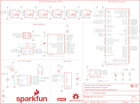

Contents
========

* [PRS16985 > MicroMod Input and Display Carrier](#prs16985--micromod-input-and-display-carrier)
	* [Schematic](#schematic)
	* [PCB](#pcb)
	* [Interactive BOM](#interactive-bom)
	* [OOMP Parts](#oomp-parts)
	* [Images](#images)
	* [Tags](#tags)
  
![][im]
# PRS16985 > MicroMod Input and Display Carrier

- ID: PROJ-SPAR-16985-STAN-01
- Hex ID: PRS16985
- Name: Sparkfun
- Description: Sparkfun
- Long Link: [http://oom.lt/PROJ-SPAR-16985-STAN-01](http://oom.lt/PROJ-SPAR-16985-STAN-01)
- Short Link: [http://oom.lt/PRS16985](http://oom.lt/PRS16985)

## Schematic
  

## PCB
  

## Interactive BOM

- Interactive BOM page: [ibom.html](https://htmlpreview.github.io/?https://github.com/oomlout/oomlout_OOMP_projects/blob/main/PROJ-SPAR-16985-STAN-01/kicad/bom/ibom.html)

## OOMP Parts
  

|OOMP ID|Name|Identifier|
| :---: | :---: | :---: |
|UNMATCHED-UNMATCHED-X-UNMATCHED-01||3V3_EN, F2, I2C, J1, J2, J3, J5, J7, LS1, MEAS, PWR, S1, S2, S3, S4, S6, TP1, U5|
|[CAPC-0603-X-NF100-V50](https://github.com/oomlout/oomlout_OOMP_parts/tree/main/CAPC-0603-X-NF100-V50/)|[SMD (0603) 100 nF Capacitor (Ceramic) 50v](https://github.com/oomlout/oomlout_OOMP_parts/tree/main/CAPC-0603-X-NF100-V50/)|[C1, C4, C6, C7, C12](https://github.com/oomlout/oomlout_OOMP_parts/tree/main/CAPC-0603-X-NF100-V50/)|
|[CAPT-3216-X-UF10-V10](https://github.com/oomlout/oomlout_OOMP_parts/tree/main/CAPT-3216-X-UF10-V10/)|[SMD (3216) 10 uF Capacitor (Tantalum) 10v](https://github.com/oomlout/oomlout_OOMP_parts/tree/main/CAPT-3216-X-UF10-V10/)|[C2](https://github.com/oomlout/oomlout_OOMP_parts/tree/main/CAPT-3216-X-UF10-V10/)|
|CAPC-0603-X-UNMATCHED-01||C3|
|[CAPC-0603-X-NF220-V25](https://github.com/oomlout/oomlout_OOMP_parts/tree/main/CAPC-0603-X-NF220-V25/)|[SMD (0603) 220 nF Capacitor (Ceramic) 25v](https://github.com/oomlout/oomlout_OOMP_parts/tree/main/CAPC-0603-X-NF220-V25/)|[C5, C13](https://github.com/oomlout/oomlout_OOMP_parts/tree/main/CAPC-0603-X-NF220-V25/)|
|DIOD-S323-X-UNMATCHED-01||D1|
|[LEDS-0603-R-STAN-01](https://github.com/oomlout/oomlout_OOMP_parts/tree/main/LEDS-0603-R-STAN-01/)|[SMD (0603) Red LED](https://github.com/oomlout/oomlout_OOMP_parts/tree/main/LEDS-0603-R-STAN-01/)|[D2](https://github.com/oomlout/oomlout_OOMP_parts/tree/main/LEDS-0603-R-STAN-01/)|
|LEDS-5050-RGB-K102-01||D3, D4, D5, D6, D7, D8|
|[HEAD-JSTSH-X-PI04-RS](https://github.com/oomlout/oomlout_OOMP_parts/tree/main/HEAD-JSTSH-X-PI04-RS/)|[JST XH (1 mm) 4 Pin Header Right Angle (SMD)](https://github.com/oomlout/oomlout_OOMP_parts/tree/main/HEAD-JSTSH-X-PI04-RS/)|[J6, LOGO2, U2](https://github.com/oomlout/oomlout_OOMP_parts/tree/main/HEAD-JSTSH-X-PI04-RS/)|
|[HEAD-I01-X-PI09-01](https://github.com/oomlout/oomlout_OOMP_parts/tree/main/HEAD-I01-X-PI09-01/)|[2.54 mm 9 Pin Header](https://github.com/oomlout/oomlout_OOMP_parts/tree/main/HEAD-I01-X-PI09-01/)|[J8](https://github.com/oomlout/oomlout_OOMP_parts/tree/main/HEAD-I01-X-PI09-01/)|
|MOSP-SO23-X-UNMATCHED-01||Q1|
|UNMATCHED-SO23-X-UNMATCHED-01||Q2|
|[RESE-0603-X-O472-01](https://github.com/oomlout/oomlout_OOMP_parts/tree/main/RESE-0603-X-O472-01/)|[SMD (0603) 4.7k Ohm Resistor](https://github.com/oomlout/oomlout_OOMP_parts/tree/main/RESE-0603-X-O472-01/)|[R1, R2](https://github.com/oomlout/oomlout_OOMP_parts/tree/main/RESE-0603-X-O472-01/)|
|RESE-0603-X-O1003-01||R3, R4, R5, R6, R9, R10|
|[RESE-0603-X-O222-01](https://github.com/oomlout/oomlout_OOMP_parts/tree/main/RESE-0603-X-O222-01/)|[SMD (0603) 2.2k Ohm Resistor](https://github.com/oomlout/oomlout_OOMP_parts/tree/main/RESE-0603-X-O222-01/)|[R7, R8](https://github.com/oomlout/oomlout_OOMP_parts/tree/main/RESE-0603-X-O222-01/)|
|[RESE-0603-X-O102-01](https://github.com/oomlout/oomlout_OOMP_parts/tree/main/RESE-0603-X-O102-01/)|[SMD (0603) 1k Ohm Resistor](https://github.com/oomlout/oomlout_OOMP_parts/tree/main/RESE-0603-X-O102-01/)|[R11, R13](https://github.com/oomlout/oomlout_OOMP_parts/tree/main/RESE-0603-X-O102-01/)|
|[RESE-1206-X-O100-01](https://github.com/oomlout/oomlout_OOMP_parts/tree/main/RESE-1206-X-O100-01/)|[SMD (1206) 10 Ohm Resistor](https://github.com/oomlout/oomlout_OOMP_parts/tree/main/RESE-1206-X-O100-01/)|[R12](https://github.com/oomlout/oomlout_OOMP_parts/tree/main/RESE-1206-X-O100-01/)|

## Images
  
  

|bominteractivefront|bominteractiveback|kicadPcb3d|kicadPcb3dFront|kicadPcb3dBack|kicadSchem|eagleImage|eagleSchemImage|pcbdraw|pcbdrawback|
| :---: | :---: | :---: | :---: | :---: | :---: | :---: | :---: | :---: | :---: |
|||||||||||

## Tags

- hexID: PRS16985
- oompType: PROJ
- oompSize: SPAR
- oompColor: 16985
- oompDesc: STAN
- oompIndex: 01
- oompName: MicroMod Input and Display Carrier
- sources: All source files from https://github.com/sparkfun/MicroMod_Input_and_Display_Carrier (source licence details in srcLicense.md)
- linkBuyPage: https://www.sparkfun.com/products/16985
- oompID: PROJ-SPAR-16985-STAN-01
- oompParts: 3V3_EN,UNMATCHED-UNMATCHED-X-UNMATCHED-01
- oompParts: C1,CAPC-0603-X-NF100-V50
- oompParts: C2,CAPT-3216-X-UF10-V10
- oompParts: C3,CAPC-0603-X-UNMATCHED-01
- oompParts: C4,CAPC-0603-X-NF100-V50
- oompParts: C5,CAPC-0603-X-NF220-V25
- oompParts: C6,CAPC-0603-X-NF100-V50
- oompParts: C7,CAPC-0603-X-NF100-V50
- oompParts: C12,CAPC-0603-X-NF100-V50
- oompParts: C13,CAPC-0603-X-NF220-V25
- oompParts: D1,DIOD-S323-X-UNMATCHED-01
- oompParts: D2,LEDS-0603-R-STAN-01
- oompParts: D3,LEDS-5050-RGB-K102-01
- oompParts: D4,LEDS-5050-RGB-K102-01
- oompParts: D5,LEDS-5050-RGB-K102-01
- oompParts: D6,LEDS-5050-RGB-K102-01
- oompParts: D7,LEDS-5050-RGB-K102-01
- oompParts: D8,LEDS-5050-RGB-K102-01
- oompParts: F2,UNMATCHED-UNMATCHED-X-UNMATCHED-01
- oompParts: I2C,UNMATCHED-UNMATCHED-X-UNMATCHED-01
- oompParts: J1,UNMATCHED-UNMATCHED-X-UNMATCHED-01
- oompParts: J2,UNMATCHED-UNMATCHED-X-UNMATCHED-01
- oompParts: J3,UNMATCHED-UNMATCHED-X-UNMATCHED-01
- oompParts: J5,UNMATCHED-UNMATCHED-X-UNMATCHED-01
- oompParts: J6,HEAD-JSTSH-X-PI04-RS
- oompParts: J7,UNMATCHED-UNMATCHED-X-UNMATCHED-01
- oompParts: J8,HEAD-I01-X-PI09-01
- oompParts: LOGO2,HEAD-JSTSH-X-PI04-RS
- oompParts: LS1,UNMATCHED-UNMATCHED-X-UNMATCHED-01
- oompParts: MEAS,UNMATCHED-UNMATCHED-X-UNMATCHED-01
- oompParts: PWR,UNMATCHED-UNMATCHED-X-UNMATCHED-01
- oompParts: Q1,MOSP-SO23-X-UNMATCHED-01
- oompParts: Q2,UNMATCHED-SO23-X-UNMATCHED-01
- oompParts: R1,RESE-0603-X-O472-01
- oompParts: R2,RESE-0603-X-O472-01
- oompParts: R3,RESE-0603-X-O1003-01
- oompParts: R4,RESE-0603-X-O1003-01
- oompParts: R5,RESE-0603-X-O1003-01
- oompParts: R6,RESE-0603-X-O1003-01
- oompParts: R7,RESE-0603-X-O222-01
- oompParts: R8,RESE-0603-X-O222-01
- oompParts: R9,RESE-0603-X-O1003-01
- oompParts: R10,RESE-0603-X-O1003-01
- oompParts: R11,RESE-0603-X-O102-01
- oompParts: R12,RESE-1206-X-O100-01
- oompParts: R13,RESE-0603-X-O102-01
- oompParts: S1,UNMATCHED-UNMATCHED-X-UNMATCHED-01
- oompParts: S2,UNMATCHED-UNMATCHED-X-UNMATCHED-01
- oompParts: S3,UNMATCHED-UNMATCHED-X-UNMATCHED-01
- oompParts: S4,UNMATCHED-UNMATCHED-X-UNMATCHED-01
- oompParts: S6,UNMATCHED-UNMATCHED-X-UNMATCHED-01
- oompParts: TP1,UNMATCHED-UNMATCHED-X-UNMATCHED-01
- oompParts: U2,HEAD-JSTSH-X-PI04-RS
- oompParts: U5,UNMATCHED-UNMATCHED-X-UNMATCHED-01
- rawParts: 3V3_EN,,JUMPER-SMT_2_NO_SILK,SMT-JUMPER_2_NO_SILK,Normally open jumper,,,,,,,,,
- rawParts: BYP,JUMPER-SMT_2_NO_SILK,JUMPER-SMT_2_NO_SILK,SMT-JUMPER_2_NO_SILK,Normally open jumper,,,,,,,,,
- rawParts: C1,0.1uF,0.1UF-0603-25V-(+80/-20%),0603,0.1µF ceramic capacitors,,CAP-00810,,,,,0.1uF,,
- rawParts: C2,10uF,10UF-POLAR-EIA3216-16V-10%(TANT),EIA3216,10.0µF polarized capacitors,,CAP-00811,,,,,10uF,,
- rawParts: C3,1.0uF,1.0UF-0603-16V-10%,0603,1µF ceramic capacitors,,CAP-00868,,,,,1.0uF,,
- rawParts: C4,0.1uF,0.1UF-0603-25V-(+80/-20%),0603,0.1µF ceramic capacitors,,CAP-00810,,,,,0.1uF,,
- rawParts: C5,0.22uF,0.22UF-0603-25V-10%,0603,0.22µF ceramic capacitors,,CAP-07822,,,,,0.22uF,,
- rawParts: C6,0.1uF,0.1UF-0603-25V-(+80/-20%),0603,0.1µF ceramic capacitors,,CAP-00810,,,,,0.1uF,,
- rawParts: C7,0.1uF,0.1UF-0603-25V-(+80/-20%),0603,0.1µF ceramic capacitors,,CAP-00810,,,,,0.1uF,,
- rawParts: C12,0.1uF,0.1UF-0603-25V-(+80/-20%),0603,0.1µF ceramic capacitors,,CAP-00810,,,,,0.1uF,,
- rawParts: C13,0.22uF,0.22UF-0603-25V-10%,0603,0.22µF ceramic capacitors,,CAP-07822,,,,,0.22uF,,
- rawParts: D1,3.3V,DIODE-ZENER-MM3Z3V3T1G,SOD-323,Zener Diode,,DIO-11284,,,,,3.3V,,
- rawParts: D2,RED,LED-RED0603,LED-0603,Red SMD LED,,DIO-00819,,,,,RED,,
- rawParts: D3,APA102-5050,APA102-5050,APA102-5050,APA102 Addressable RGB LED,,DIO-13739,,,,,,,
- rawParts: D4,APA102-5050,APA102-5050,APA102-5050,APA102 Addressable RGB LED,,DIO-13739,,,,,,,
- rawParts: D5,APA102-5050,APA102-5050,APA102-5050,APA102 Addressable RGB LED,,DIO-13739,,,,,,,
- rawParts: D6,APA102-5050,APA102-5050,APA102-5050,APA102 Addressable RGB LED,,DIO-13739,,,,,,,
- rawParts: D7,APA102-5050,APA102-5050,APA102-5050,APA102 Addressable RGB LED,,DIO-13739,,,,,,,
- rawParts: D8,APA102-5050,APA102-5050,APA102-5050,APA102 Addressable RGB LED,,DIO-13739,,,,,,,
- rawParts: F2,6V/2A,PPTC_6V2A,1210,Resettable Fuse PPTC,,RES-14313,,,,,6V/2A,,
- rawParts: FD1,FIDUCIALUFIDUCIAL,FIDUCIALUFIDUCIAL,FIDUCIAL-MICRO,Fiducial Alignment Points,,,,,,,,,
- rawParts: FD2,FIDUCIALUFIDUCIAL,FIDUCIALUFIDUCIAL,FIDUCIAL-MICRO,Fiducial Alignment Points,,,,,,,,,
- rawParts: FD3,FIDUCIALUFIDUCIAL,FIDUCIALUFIDUCIAL,FIDUCIAL-MICRO,Fiducial Alignment Points,,,,,,,,,
- rawParts: FD4,FIDUCIALUFIDUCIAL,FIDUCIALUFIDUCIAL,FIDUCIAL-MICRO,Fiducial Alignment Points,,,,,,,,,
- rawParts: FRAME1,FRAME-LETTER,FRAME-LETTER,CREATIVE_COMMONS,Schematic Frame - Letter,,,,,,,,,
- rawParts: FRAME2,FRAME-LETTERNO_PACKAGE,FRAME-LETTERNO_PACKAGE,DUMMY,Schematic Frame - Letter,Nobody,,,,,,,v01,
- rawParts: H1,STAND-OFF,STAND-OFF,STAND-OFF,Stand Off,,,,,,,,,
- rawParts: H2,STAND-OFF,STAND-OFF,STAND-OFF,Stand Off,,,,,,,,,
- rawParts: H3,STAND-OFF,STAND-OFF,STAND-OFF,Stand Off,,,,,,,,,
- rawParts: H4,STAND-OFF,STAND-OFF,STAND-OFF,Stand Off,,,,,,,,,
- rawParts: H5,STAND-OFF,STAND-OFF-REFLOW2.5MM_TALL,STAND-OFF-REFLOW-M2.5,Stand Off Reflow Compatible,,HW-14899,,,,,,,
- rawParts: I2C,,JUMPER-SMT_3_2-NC_TRACE_SILK,SMT-JUMPER_3_2-NC_TRACE_SILK,Normally closed trace jumper (2 of 2 connections),,,,,,,,,
- rawParts: J1,MICROMOD-2222-C,MICROMOD-2222-C,M.2-CONNECTOR-E,MicroMod Connector,,CONN-14877,,,,X,,,
- rawParts: J2,MICRO-SD,MICRO-SD-SPIPUSH-PUSH,MICRO-SD-SOCKET,microSD Socket for Transflash,,CONN-07820,,,,,,,
- rawParts: J3,USB-C_Prog,USB_C_2-LAYER_PADS,USB-C-16P-2LAYER-PADS,USB Type C 16Pin Connector,,CONN-14122,,,,,,,
- rawParts: J4,AVR_SPI_PROG_3X2TESTPOINTS,AVR_SPI_PROG_3X2TESTPOINTS,2X3_TEST_POINTS,AVR ISP 6 Pin,,,,,,,,,
- rawParts: J5,2.4 TFT,4DLCD-24-320X240,FPC05040-17204,4D LCD 4DLCD-24320240-IPS - 2.4 240x320 TFT LCD,,LCD-14913,CONN-14082,,,,2.4 TFT,,
- rawParts: J6,QWIIC_RA,QWIIC_CONNECTORJS-1MM,JST04_1MM_RA,SparkFun I2C Standard Qwiic Connector,,CONN-13694,,,,,QWIIC_RIGHT_ANGLE,,
- rawParts: J7,CORTEX_JTAG_DEBUG,CORTEX_JTAG_DEBUG_MINIMUM_PTH_NS,2X5-PTH-1.27MM-NO_SILK,Cortex Debug Connector - 10 pin,,,,,,,,,
- rawParts: J8,,CONN_09NO_SILK,1X09_NO_SILK,Multi connection point. Often used as Generic Header-pin footprint for 0.1 inch spaced/style header connections,,,,,,,,,
- rawParts: LOGO1,SFE_LOGO_NAME_FLAME.2_INCH,SFE_LOGO_NAME_FLAME.2_INCH,SFE_LOGO_NAME_FLAME_.2,SparkFun Font Logo w/ Flame,,,,,,,,,
- rawParts: LOGO2,QWIIC_LOGO_5MM,QWIIC_LOGO_5MM,QWIIC_5MM,Qwiic Logos for placement on schematic and PCB. The 5.5mm silk logo is best for placing next to Qwiic connector.,,,,,,,,,
- rawParts: LOGO3,OSHW-LOGOS,OSHW-LOGOS,OSHW-LOGO-S,Open-Source Hardware (OSHW) Logo,,,,,,,,,
- rawParts: LS1,Buzzer,BUZZER-SMD,BUZZER-CCV,Buzzer,,COMP-08568,,,,,,,
- rawParts: MEAS,,JUMPER-COMBO_2_NC_TRACE,COMBO-JUMPER_2_NC_TRACE,,,,,,,,,,
- rawParts: PWR,,JUMPER-SMT_2_NC_TRACE_SILK,SMT-JUMPER_2_NC_TRACE_SILK,Normally closed trace jumper,,,,,,,,,
- rawParts: Q1,1.1A/600mΩ,MOSFET_PCH-SI2309DS,SOT23-3,P-channel MOSFETs,,TRANS-08285,,,,,1.1A/60V/600mΩ,,
- rawParts: Q2,600mA/40V,TRANS_NPN-MMBT2222AL,SOT23-3,NPN transistor,,TRANS-08049,,,,,600mA/40V,,
- rawParts: R1,5.1k,5.1KOHM5.1KOHM-0603-1/10W-1%,0603,,,RES-12083,,,,,5.1k,,
- rawParts: R2,5.1k,5.1KOHM5.1KOHM-0603-1/10W-1%,0603,,,RES-12083,,,,,5.1k,,
- rawParts: R3,100k,100KOHM-0603-1/10W-1%,0603,100kΩ resistor,,RES-07828,,,,,100k,,
- rawParts: R4,100k,100KOHM-0603-1/10W-1%,0603,100kΩ resistor,,RES-07828,,,,,100k,,
- rawParts: R5,100k,100KOHM-0603-1/10W-1%,0603,100kΩ resistor,,RES-07828,,,,,100k,,
- rawParts: R6,100k,100KOHM-0603-1/10W-1%,0603,100kΩ resistor,,RES-07828,,,,,100k,,
- rawParts: R7,2.2k,2.2KOHM-0603-1/10W-1%,0603,2.2kΩ resistor,,RES-08272,,,,,2.2k,,
- rawParts: R8,2.2k,2.2KOHM-0603-1/10W-1%,0603,2.2kΩ resistor,,RES-08272,,,,,2.2k,,
- rawParts: R9,100k,100KOHM-0603-1/10W-1%,0603,100kΩ resistor,,RES-07828,,,,,100k,,
- rawParts: R10,100k,100KOHM-0603-1/10W-1%,0603,100kΩ resistor,,RES-07828,,,,,100k,,
- rawParts: R11,1k,1KOHM-0603-1/10W-1%,0603,1kΩ resistor,,RES-07856,,,,,1k,,
- rawParts: R12,10,10OHM-1206-1/4W-1%,1206,10Ω resistor,,RES-08705,,,,,10,,
- rawParts: R13,1k,1KOHM-0603-1/10W-1%,0603,1kΩ resistor,,RES-07856,,,,,1k,,
- rawParts: S1,Reset,MOMENTARY-SWITCH-SPST-SMD-5.2-TALL-REDUNDANT,TACTILE_SWITCH_SMD_5.2MM,Momentary Switch (Pushbutton) - SPST,,SWCH-14139,,,,,,,
- rawParts: S2,BOOT,MOMENTARY-SWITCH-SPST-SMD-5.2-TALL-REDUNDANT,TACTILE_SWITCH_SMD_5.2MM,Momentary Switch (Pushbutton) - SPST,,SWCH-14139,,,,,,,
- rawParts: S3,MOMENTARY-SWITCH-SPST-SMD-5.2MM-TALL,MOMENTARY-SWITCH-SPST-SMD-5.2MM-TALL,TACTILE_SWITCH_SMD_5.2MM,Momentary Switch (Pushbutton) - SPST,,SWCH-14139,,,,,,,
- rawParts: S4,MOMENTARY-SWITCH-SPST-SMD-5.2MM-TALL,MOMENTARY-SWITCH-SPST-SMD-5.2MM-TALL,TACTILE_SWITCH_SMD_5.2MM,Momentary Switch (Pushbutton) - SPST,,SWCH-14139,,,,,,,
- rawParts: S6,Joystick,JOYSTICK_MINI,JOYSTICK_MINI,Small Tactile Joystick w/ Select Switch,,SWCH-09905,,,COM-10063,,Joystick,,
- rawParts: TP1,,TEST-POINT3,PAD.03X.03,SparkFun Test Points,,,,,,,,,
- rawParts: U2,ATTINY84,ATTINY84,SO14,Atmel 14-pin 2/4/8kB flash uC,,IC-11285,,,,,ATTINY84,,
- rawParts: U5,AP7361C-33FGE,AP7361C-33FGEUDFN-8,UDFN-8,AP7361C 3.3V LDO Regulator,,VREG-14094,,,,,,,

[im]: kicadPcb3d_450.png
