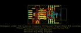
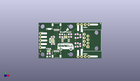
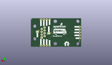
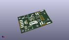

Contents
========

* [PROJ-SPAR-16988-STAN-01>QwiicBus EndPoint](#proj-spar-16988-stan-01qwiicbus-endpoint)
	* [Images](#images)
	* [Interactive BOM](#interactive-bom)
	* [OOMP Parts](#oomp-parts)
	* [Tags](#tags)
  
![][im]
# PROJ-SPAR-16988-STAN-01>QwiicBus EndPoint

- ID: PROJ-SPAR-16988-STAN-01
- Hex ID: PRS16988
- Name: QwiicBus EndPoint
- Description: 

## Images
  
  

|eagleImage|kicadPcb3dFront|kicadPcb3dBack|kicadPcb3d|
| :---: | :---: | :---: | :---: |
|||||

## Interactive BOM

- Interactive BOM page: [ibom.html](kicad/bom/ibom.html)

## OOMP Parts
  

|OOMP Parts|
| :---: |
|UNMATCHED-UNMATCHED-X-UNMATCHED-01, 0-1, 19.049999999999997, 15.239999999999998, 180,0-1, JUMPER-SMT_2_NC_TRACE_SILK, SMT-JUMPER_2_NC_TRACE_SILK, SparkFun-Jumpers, (0.75, 0.6), R180|
|<table><tr><td></td><td> C1</td><td>[CAPC-0603-X-NF100-V50 SMD (0603) 100 nF Capacitor (Ceramic) 50v](https://github.com/oomlout/oomlout_OOMP_parts/tree/main/CAPC-0603-X-NF100-V50/)</td><td>[C6N100](https://github.com/oomlout/oomlout_OOMP_parts/tree/main/CAPC-0603-X-NF100-V50/)</td></tr></table>|
|<table><tr><td></td><td> C2</td><td>[CAPC-0603-X-NF100-V50 SMD (0603) 100 nF Capacitor (Ceramic) 50v](https://github.com/oomlout/oomlout_OOMP_parts/tree/main/CAPC-0603-X-NF100-V50/)</td><td>[C6N100](https://github.com/oomlout/oomlout_OOMP_parts/tree/main/CAPC-0603-X-NF100-V50/)</td></tr></table>|
|CAPC-0603-X-UNMATCHED-01, C3, 15.875, 17.145, 180,C3, 1.0uF, 0603, SparkFun-Capacitors, (0.625, 0.675), R180|
|CAPC-0603-X-UNMATCHED-01, C4, 22.224999999999998, 15.239999999999998, 0,C4, 1.0uF, 0603, SparkFun-Capacitors, (0.875, 0.6), R0|
|UNMATCHED-0603-X-UNMATCHED-01, D11, 7.112, 1.27, 180,D11, RED, LED-0603, SparkFun-LED, (0.28, 0.05), R180|
|UNMATCHED-UNMATCHED-X-UNMATCHED-01, GND, 38.73499999999999, 13.334999999999999, M0,GND, JUMPER-SMT_2_NC_TRACE_SILK, SMT-JUMPER_2_NC_TRACE_SILK, SparkFun-Jumpers, (1.525, 0.525), MR0|
|UNMATCHED-UNMATCHED-X-UNMATCHED-01, I2C, 10.16, 12.7, 270,I2C, JUMPER-SMT_3_2-NC_TRACE_SILK, SMT-JUMPER_3_2-NC_TRACE_SILK, SparkFun-Jumpers, (0.4, 0.5), R270|
|UNMATCHED-UNMATCHED-X-UNMATCHED-01, J1, 12.7, 5.08, 0,J1, QWIIC, JST04_1MM_RA, SparkFun-Connectors, (0.5, 0.2), R0|
|UNMATCHED-UNMATCHED-X-UNMATCHED-01, J2, 12.7, 20.32, 180,J2, QWIIC, JST04_1MM_RA, SparkFun-Connectors, (0.5, 0.8), R180|
|UNMATCHED-UNMATCHED-X-UNMATCHED-01, J3, 41.275, 12.7, 90,J3, RJ45, RJ45-8, SparkFun-Connectors, (1.625, 0.5), R90|
|UNMATCHED-UNMATCHED-X-UNMATCHED-01, J4, 27.94, 1.27, 0,J4, 1X04_NO_SILK, SparkFun-Connectors, (1.1, 0.05), R0|
|UNMATCHED-UNMATCHED-X-UNMATCHED-01, J5, 1.27, 7.619999999999999, 0,J5, 1X01_NO_SILK, SparkFun-Connectors, (0.05, 0.3), R0|
|UNMATCHED-UNMATCHED-X-UNMATCHED-01, J6, 27.94, 24.13, 0,J6, 1X04_NO_SILK, SparkFun-Connectors, (1.1, 0.95), R0|
|UNMATCHED-UNMATCHED-X-UNMATCHED-01, J8, 1.27, 17.779999999999998, 270,J8, 1X04_NO_SILK, SparkFun-Connectors, (0.05, 0.7), R270|
|UNMATCHED-UNMATCHED-X-UNMATCHED-01, PWR, 7.112, 5.08, 0,PWR, JUMPER-SMT_2_NC_TRACE_SILK, SMT-JUMPER_2_NC_TRACE_SILK, SparkFun-Jumpers, (0.28, 0.2), R0|
|RESE-0603-X-UNMATCHED-01, R1, 26.939999968, 10.795, 180,R1, 390, 0603, SparkFun-Resistors, (1.06062992, 0.425), R180|
|RESE-0603-X-UNMATCHED-01, R2, 29.479999968, 9.524999999999999, 90,R2, 100, 0603, SparkFun-Resistors, (1.16062992, 0.375), R90|
|RESE-0603-X-UNMATCHED-01, R3, 26.939999968, 8.254999999999999, 0,R3, 390, 0603, SparkFun-Resistors, (1.06062992, 0.325), R0|
|RESE-0603-X-UNMATCHED-01, R4, 26.939999968, 14.604999999999999, 180,R4, 390, 0603, SparkFun-Resistors, (1.06062992, 0.575), R180|
|RESE-0603-X-UNMATCHED-01, R5, 29.479999968, 15.875, 270,R5, 100, 0603, SparkFun-Resistors, (1.16062992, 0.625), R270|
|RESE-0603-X-UNMATCHED-01, R6, 26.939999968, 17.145, 0,R6, 390, 0603, SparkFun-Resistors, (1.06062992, 0.675), R0|
|RESE-0603-X-UNMATCHED-01, R7, 10.16, 10.16, 0,R7, 4.7k, 0603, SparkFun-Resistors, (0.4, 0.4), R0|
|RESE-0603-X-UNMATCHED-01, R8, 10.16, 15.239999999999998, 0,R8, 4.7k, 0603, SparkFun-Resistors, (0.4, 0.6), R0|
|RESE-0603-X-UNMATCHED-01, R11, 7.112, 3.175, 0,R11, 1k, 0603, SparkFun-Resistors, (0.28, 0.125), R0|
|UNMATCHED-UNMATCHED-X-UNMATCHED-01, U1, 19.049999999999997, 12.7, 0,U1, PCA9615, TSSOP10, SparkFun-IC-Comms, (0.75, 0.5), R0|
|UNMATCHED-UNMATCHED-X-UNMATCHED-01, VCC1, 28.575, 12.065, M180,VCC1, JUMPER-SMT_2_NC_TRACE_SILK, SMT-JUMPER_2_NC_TRACE_SILK, SparkFun-Jumpers, (1.125, 0.475), MR180|

## Tags

- hexID: PRS16988
- oompType: PROJ
- oompSize: SPAR
- oompColor: 16988
- oompDesc: STAN
- oompIndex: 01
- oompName: QwiicBus EndPoint
- sources: All source files from https://github.com/sparkfun/QwiicBus_EndPoint (source licence details in srcLicense.md)
- linkBuyPage: https://www.sparkfun.com/products/16988
- oompPart: UNMATCHED-UNMATCHED-X-UNMATCHED-01, 0-1, 19.049999999999997, 15.239999999999998, 180
- oompPart: CAPC-0603-X-NF100-V50, C1, 15.875, 15.239999999999998, 180
- oompPart: CAPC-0603-X-NF100-V50, C2, 22.224999999999998, 17.145, 0
- oompPart: CAPC-0603-X-UNMATCHED-01, C3, 15.875, 17.145, 180
- oompPart: CAPC-0603-X-UNMATCHED-01, C4, 22.224999999999998, 15.239999999999998, 0
- oompPart: UNMATCHED-0603-X-UNMATCHED-01, D11, 7.112, 1.27, 180
- oompPart: SKIP-UNMATCHED-X-UNMATCHED-01, FD1, 1.27, 5.08, 0
- oompPart: SKIP-UNMATCHED-X-UNMATCHED-01, FD2, 43.815, 24.764999999999997, 0
- oompPart: SKIP-UNMATCHED-X-UNMATCHED-01, FD3, 1.27, 5.08, M0
- oompPart: SKIP-UNMATCHED-X-UNMATCHED-01, FD4, 43.815, 24.764999999999997, M0
- oompPart: UNMATCHED-UNMATCHED-X-UNMATCHED-01, GND, 38.73499999999999, 13.334999999999999, M0
- oompPart: UNMATCHED-UNMATCHED-X-UNMATCHED-01, I2C, 10.16, 12.7, 270
- oompPart: UNMATCHED-UNMATCHED-X-UNMATCHED-01, J1, 12.7, 5.08, 0
- oompPart: UNMATCHED-UNMATCHED-X-UNMATCHED-01, J2, 12.7, 20.32, 180
- oompPart: UNMATCHED-UNMATCHED-X-UNMATCHED-01, J3, 41.275, 12.7, 90
- oompPart: UNMATCHED-UNMATCHED-X-UNMATCHED-01, J4, 27.94, 1.27, 0
- oompPart: UNMATCHED-UNMATCHED-X-UNMATCHED-01, J5, 1.27, 7.619999999999999, 0
- oompPart: UNMATCHED-UNMATCHED-X-UNMATCHED-01, J6, 27.94, 24.13, 0
- oompPart: UNMATCHED-UNMATCHED-X-UNMATCHED-01, J8, 1.27, 17.779999999999998, 270
- oompPart: UNMATCHED-UNMATCHED-X-UNMATCHED-01, PWR, 7.112, 5.08, 0
- oompPart: RESE-0603-X-UNMATCHED-01, R1, 26.939999968, 10.795, 180
- oompPart: RESE-0603-X-UNMATCHED-01, R2, 29.479999968, 9.524999999999999, 90
- oompPart: RESE-0603-X-UNMATCHED-01, R3, 26.939999968, 8.254999999999999, 0
- oompPart: RESE-0603-X-UNMATCHED-01, R4, 26.939999968, 14.604999999999999, 180
- oompPart: RESE-0603-X-UNMATCHED-01, R5, 29.479999968, 15.875, 270
- oompPart: RESE-0603-X-UNMATCHED-01, R6, 26.939999968, 17.145, 0
- oompPart: RESE-0603-X-UNMATCHED-01, R7, 10.16, 10.16, 0
- oompPart: RESE-0603-X-UNMATCHED-01, R8, 10.16, 15.239999999999998, 0
- oompPart: RESE-0603-X-UNMATCHED-01, R11, 7.112, 3.175, 0
- oompPart: UNMATCHED-UNMATCHED-X-UNMATCHED-01, U1, 19.049999999999997, 12.7, 0
- oompPart: UNMATCHED-UNMATCHED-X-UNMATCHED-01, VCC1, 28.575, 12.065, M180
- rawPart: 0-1, JUMPER-SMT_2_NC_TRACE_SILK, SMT-JUMPER_2_NC_TRACE_SILK, SparkFun-Jumpers, (0.75, 0.6), R180
- rawPart: C1, 0.1uF, 0603, SparkFun-Capacitors, (0.625, 0.6), R180
- rawPart: C2, 0.1uF, 0603, SparkFun-Capacitors, (0.875, 0.675), R0
- rawPart: C3, 1.0uF, 0603, SparkFun-Capacitors, (0.625, 0.675), R180
- rawPart: C4, 1.0uF, 0603, SparkFun-Capacitors, (0.875, 0.6), R0
- rawPart: D11, RED, LED-0603, SparkFun-LED, (0.28, 0.05), R180
- rawPart: FD1, FIDUCIALUFIDUCIAL, FIDUCIAL-MICRO, SparkFun-Aesthetics, (0.05, 0.2), R0
- rawPart: FD2, FIDUCIALUFIDUCIAL, FIDUCIAL-MICRO, SparkFun-Aesthetics, (1.725, 0.975), R0
- rawPart: FD3, FIDUCIALUFIDUCIAL, FIDUCIAL-MICRO, SparkFun-Aesthetics, (0.05, 0.2), MR0
- rawPart: FD4, FIDUCIALUFIDUCIAL, FIDUCIAL-MICRO, SparkFun-Aesthetics, (1.725, 0.975), MR0
- rawPart: GND, JUMPER-SMT_2_NC_TRACE_SILK, SMT-JUMPER_2_NC_TRACE_SILK, SparkFun-Jumpers, (1.525, 0.525), MR0
- rawPart: I2C, JUMPER-SMT_3_2-NC_TRACE_SILK, SMT-JUMPER_3_2-NC_TRACE_SILK, SparkFun-Jumpers, (0.4, 0.5), R270
- rawPart: J1, QWIIC, JST04_1MM_RA, SparkFun-Connectors, (0.5, 0.2), R0
- rawPart: J2, QWIIC, JST04_1MM_RA, SparkFun-Connectors, (0.5, 0.8), R180
- rawPart: J3, RJ45, RJ45-8, SparkFun-Connectors, (1.625, 0.5), R90
- rawPart: J4, 1X04_NO_SILK, SparkFun-Connectors, (1.1, 0.05), R0
- rawPart: J5, 1X01_NO_SILK, SparkFun-Connectors, (0.05, 0.3), R0
- rawPart: J6, 1X04_NO_SILK, SparkFun-Connectors, (1.1, 0.95), R0
- rawPart: J8, 1X04_NO_SILK, SparkFun-Connectors, (0.05, 0.7), R270
- rawPart: PWR, JUMPER-SMT_2_NC_TRACE_SILK, SMT-JUMPER_2_NC_TRACE_SILK, SparkFun-Jumpers, (0.28, 0.2), R0
- rawPart: R1, 390, 0603, SparkFun-Resistors, (1.06062992, 0.425), R180
- rawPart: R2, 100, 0603, SparkFun-Resistors, (1.16062992, 0.375), R90
- rawPart: R3, 390, 0603, SparkFun-Resistors, (1.06062992, 0.325), R0
- rawPart: R4, 390, 0603, SparkFun-Resistors, (1.06062992, 0.575), R180
- rawPart: R5, 100, 0603, SparkFun-Resistors, (1.16062992, 0.625), R270
- rawPart: R6, 390, 0603, SparkFun-Resistors, (1.06062992, 0.675), R0
- rawPart: R7, 4.7k, 0603, SparkFun-Resistors, (0.4, 0.4), R0
- rawPart: R8, 4.7k, 0603, SparkFun-Resistors, (0.4, 0.6), R0
- rawPart: R11, 1k, 0603, SparkFun-Resistors, (0.28, 0.125), R0
- rawPart: U1, PCA9615, TSSOP10, SparkFun-IC-Comms, (0.75, 0.5), R0
- rawPart: VCC1, JUMPER-SMT_2_NC_TRACE_SILK, SMT-JUMPER_2_NC_TRACE_SILK, SparkFun-Jumpers, (1.125, 0.475), MR180
- oompID: PROJ-SPAR-16988-STAN-01

[im]: kicadPcb3d_450.png
