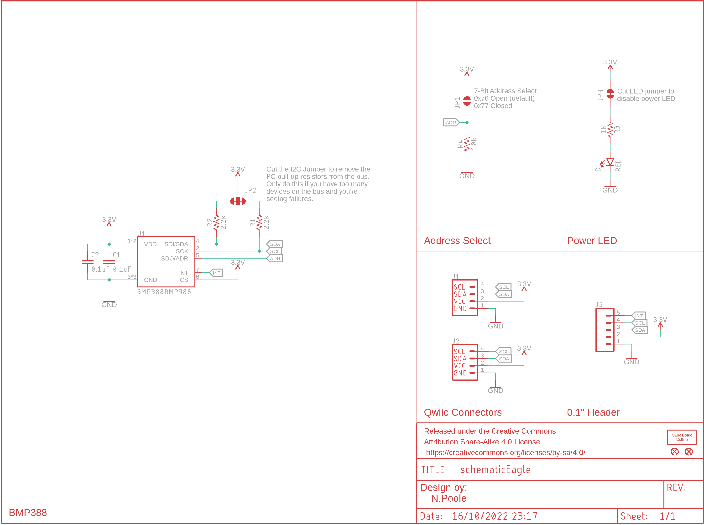

Contents
========

* [PRPR17001 > ](#prpr17001--)
	* [Schematic](#schematic)
	* [Tags](#tags)

# PRPR17001 > 

- ID: PROJ-SPAR-17001-STAN-01
- Hex ID: PRPR17001
- Name: Qwiic BMP388 Pressure Sensor
- Description: Qwiic BMP388 Pressure Sensor
- Long Link: [http://oom.lt/PROJ-SPAR-17001-STAN-01](http://oom.lt/PROJ-SPAR-17001-STAN-01)
- Short Link: [http://oom.lt/PRPR17001](http://oom.lt/PRPR17001)

## Schematic
  

## Tags

- oompType: PROJ
- oompSize: SPAR
- oompColor: 17001
- oompDesc: STAN
- oompIndex: 01
- name: Qwiic BMP388 Pressure Sensor
- gitRepo: https://github.com/sparkfunX/Qwiic_BMP388_Pressure_Sensor
- gitName: Qwiic_BMP388_Pressure_Sensor
- eagleBoard: Hardware/Qwiic_BMP388_Pressure_Sensor.brd
- eagleSchem: Hardware/Qwiic_BMP388_Pressure_Sensor.sch
- hexID: PRPR17001
- oompID: PROJ-SPAR-17001-STAN-01
