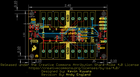
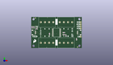
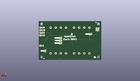
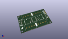

Contents
========

* [PROJ-SPAR-17047-STAN-01>Qwiic GPIO](#proj-spar-17047-stan-01qwiic-gpio)
	* [Images](#images)
	* [Interactive BOM](#interactive-bom)
	* [OOMP Parts](#oomp-parts)
	* [Tags](#tags)
  
![][im]
# PROJ-SPAR-17047-STAN-01>Qwiic GPIO

- ID: PROJ-SPAR-17047-STAN-01
- Hex ID: PRS17047
- Name: Qwiic GPIO
- Description: 

## Images
  
  

|eagleImage|kicadPcb3dFront|kicadPcb3dBack|kicadPcb3d|
| :---: | :---: | :---: | :---: |
|||||

## Interactive BOM

- Interactive BOM page: [ibom.html](kicad/bom/ibom.html)

## OOMP Parts
  

|OOMP Parts|
| :---: |
|UNMATCHED-UNMATCHED-X-UNMATCHED-01, ADR0, 39.37, 16.509999999999998, M180,ADR0, JUMPER-SMT_2_NC_TRACE_SILK, SMT-JUMPER_2_NC_TRACE_SILK, SparkFun-Jumpers, (1.55, 0.65), MR180|
|UNMATCHED-UNMATCHED-X-UNMATCHED-01, ADR1, 39.37, 19.049999999999997, M180,ADR1, JUMPER-SMT_2_NC_TRACE_SILK, SMT-JUMPER_2_NC_TRACE_SILK, SparkFun-Jumpers, (1.55, 0.75), MR180|
|UNMATCHED-UNMATCHED-X-UNMATCHED-01, ADR2, 39.37, 21.59, M180,ADR2, JUMPER-SMT_2_NC_TRACE_SILK, SMT-JUMPER_2_NC_TRACE_SILK, SparkFun-Jumpers, (1.55, 0.85), MR180|
|CAPE-0603-X-NF100-01, C4, 22.098, 17.145, 90,C4, 0.1uF, 0603, SparkFun-Capacitors, (0.87, 0.675), R90|
|UNMATCHED-0603-X-UNMATCHED-01, D1, 6.35, 25.4, 0,D1, RED, LED-0603, SparkFun-LED, (0.25, 1), R0|
|UNMATCHED-UNMATCHED-X-UNMATCHED-01, FD1, 5.08, 36.83, M0,FD1, FIDUCIAL1X2, FIDUCIAL-1X2, SparkFun-Aesthetics, (0.2, 1.45), MR0|
|UNMATCHED-UNMATCHED-X-UNMATCHED-01, FD2, 55.88, 1.27, M270,FD2, FIDUCIAL1X2, FIDUCIAL-1X2, SparkFun-Aesthetics, (2.2, 0.05), MR270|
|UNMATCHED-UNMATCHED-X-UNMATCHED-01, I2C, 3.8099999999999996, 29.209999999999997, M0,I2C, JUMPER-SMT_3_2-NC_TRACE_SILK, SMT-JUMPER_3_2-NC_TRACE_SILK, SparkFun-Jumpers, (0.15, 1.15), MR0|
|UNMATCHED-UNMATCHED-X-UNMATCHED-01, INT, 54.60999999999999, 8.889999999999999, M90,INT, JUMPER-SMT_2_NC_TRACE_SILK, SMT-JUMPER_2_NC_TRACE_SILK, SparkFun-Jumpers, (2.15, 0.35), MR90|
|UNMATCHED-UNMATCHED-X-UNMATCHED-01, J1, 19.049999999999997, 31.75, 0,J1, LATCHTERMINAL-5MM-4, SparkFun-Connectors, (0.75, 1.25), R0|
|UNMATCHED-UNMATCHED-X-UNMATCHED-01, J2, 5.08, 19.049999999999997, 270,J2, QWIIC, JST04_1MM_RA, SparkFun-Connectors, (0.2, 0.75), R270|
|UNMATCHED-UNMATCHED-X-UNMATCHED-01, J4, 55.88, 19.049999999999997, 90,J4, QWIIC, JST04_1MM_RA, SparkFun-Connectors, (2.2, 0.75), R90|
|UNMATCHED-UNMATCHED-X-UNMATCHED-01, J5, 41.91, 6.35, 180,J5, LATCHTERMINAL-5MM-4, SparkFun-Connectors, (1.65, 0.25), R180|
|UNMATCHED-UNMATCHED-X-UNMATCHED-01, J6, 41.91, 31.75, 0,J6, LATCHTERMINAL-5MM-4, SparkFun-Connectors, (1.65, 1.25), R0|
|UNMATCHED-UNMATCHED-X-UNMATCHED-01, J7, 59.69, 13.97, 0,J7, 1X01_NO_SILK, SparkFun-Connectors, (2.35, 0.55), R0|
|UNMATCHED-UNMATCHED-X-UNMATCHED-01, J8, 19.049999999999997, 6.35, 180,J8, LATCHTERMINAL-5MM-4, SparkFun-Connectors, (0.75, 0.25), R180|
|UNMATCHED-UNMATCHED-X-UNMATCHED-01, J9, 59.69, 24.13, 90,J9, 1X04_NO_SILK, SparkFun-Connectors, (2.35, 0.95), R90|
|UNMATCHED-UNMATCHED-X-UNMATCHED-01, JP2, 55.88, 1.27, 0,JP2, FIDUCIAL1X2, FIDUCIAL-1X2, SparkFun, (2.2, 0.05), R0|
|UNMATCHED-UNMATCHED-X-UNMATCHED-01, JP6, 5.08, 36.83, 0,JP6, FIDUCIAL1X2, FIDUCIAL-1X2, SparkFun, (0.2, 1.45), R0|
|UNMATCHED-UNMATCHED-X-UNMATCHED-01, PWR, 10.16, 25.4, M180,PWR, JUMPER-SMT_2_NC_TRACE_SILK, SMT-JUMPER_2_NC_TRACE_SILK, SparkFun-Jumpers, (0.4, 1), MR180|
|RESE-0603-X-UNMATCHED-01, R1, 39.37, 19.049999999999997, 180,R1, 2.2k, 0603, SparkFun-Resistors, (1.55, 0.75), R180|
|RESE-0603-X-UNMATCHED-01, R2, 3.302, 25.4, 90,R2, 2.2k, 0603, SparkFun-Resistors, (0.13, 1), R90|
|RESE-0603-X-UNMATCHED-01, R3, 39.37, 16.509999999999998, 180,R3, 2.2k, 0603, SparkFun-Resistors, (1.55, 0.65), R180|
|RESE-0603-X-UNMATCHED-01, R4, 1.27, 25.4, 90,R4, 2.2k, 0603, SparkFun-Resistors, (0.05, 1), R90|
|RESE-0603-X-UNMATCHED-01, R5, 41.91, 15.239999999999998, 270,R5, 2.2k, 0603, SparkFun-Resistors, (1.65, 0.6), R270|
|<table><tr><td></td><td> R6</td><td>[RESE-0603-X-O103-01 SMD (0603) 10k Ohm Resistor](https://github.com/oomlout/oomlout_OOMP_parts/tree/main/RESE-0603-X-O103-01/)</td><td>[R6103](https://github.com/oomlout/oomlout_OOMP_parts/tree/main/RESE-0603-X-O103-01/)</td></tr></table>|
|RESE-0603-X-UNMATCHED-01, R7, 6.35, 23.495, 0,R7, 1k, 0603, SparkFun-Resistors, (0.25, 0.925), R0|
|UNMATCHED-UNMATCHED-X-UNMATCHED-01, U3, 30.479999999999997, 19.049999999999997, 180,U3, TCA9534, 16SOIC, SparkFun-IC-Conversion, (1.2, 0.75), R180|

## Tags

- hexID: PRS17047
- oompType: PROJ
- oompSize: SPAR
- oompColor: 17047
- oompDesc: STAN
- oompIndex: 01
- oompName: Qwiic GPIO
- sources: All source files from https://github.com/sparkfun/Qwiic_GPIO (source licence details in srcLicense.md)
- linkBuyPage: https://www.sparkfun.com/products/17047
- oompPart: UNMATCHED-UNMATCHED-X-UNMATCHED-01, ADR0, 39.37, 16.509999999999998, M180
- oompPart: UNMATCHED-UNMATCHED-X-UNMATCHED-01, ADR1, 39.37, 19.049999999999997, M180
- oompPart: UNMATCHED-UNMATCHED-X-UNMATCHED-01, ADR2, 39.37, 21.59, M180
- oompPart: CAPE-0603-X-NF100-01, C4, 22.098, 17.145, 90
- oompPart: UNMATCHED-0603-X-UNMATCHED-01, D1, 6.35, 25.4, 0
- oompPart: UNMATCHED-UNMATCHED-X-UNMATCHED-01, FD1, 5.08, 36.83, M0
- oompPart: UNMATCHED-UNMATCHED-X-UNMATCHED-01, FD2, 55.88, 1.27, M270
- oompPart: UNMATCHED-UNMATCHED-X-UNMATCHED-01, I2C, 3.8099999999999996, 29.209999999999997, M0
- oompPart: UNMATCHED-UNMATCHED-X-UNMATCHED-01, INT, 54.60999999999999, 8.889999999999999, M90
- oompPart: UNMATCHED-UNMATCHED-X-UNMATCHED-01, J1, 19.049999999999997, 31.75, 0
- oompPart: UNMATCHED-UNMATCHED-X-UNMATCHED-01, J2, 5.08, 19.049999999999997, 270
- oompPart: UNMATCHED-UNMATCHED-X-UNMATCHED-01, J4, 55.88, 19.049999999999997, 90
- oompPart: UNMATCHED-UNMATCHED-X-UNMATCHED-01, J5, 41.91, 6.35, 180
- oompPart: UNMATCHED-UNMATCHED-X-UNMATCHED-01, J6, 41.91, 31.75, 0
- oompPart: UNMATCHED-UNMATCHED-X-UNMATCHED-01, J7, 59.69, 13.97, 0
- oompPart: UNMATCHED-UNMATCHED-X-UNMATCHED-01, J8, 19.049999999999997, 6.35, 180
- oompPart: UNMATCHED-UNMATCHED-X-UNMATCHED-01, J9, 59.69, 24.13, 90
- oompPart: UNMATCHED-UNMATCHED-X-UNMATCHED-01, JP2, 55.88, 1.27, 0
- oompPart: UNMATCHED-UNMATCHED-X-UNMATCHED-01, JP6, 5.08, 36.83, 0
- oompPart: UNMATCHED-UNMATCHED-X-UNMATCHED-01, PWR, 10.16, 25.4, M180
- oompPart: RESE-0603-X-UNMATCHED-01, R1, 39.37, 19.049999999999997, 180
- oompPart: RESE-0603-X-UNMATCHED-01, R2, 3.302, 25.4, 90
- oompPart: RESE-0603-X-UNMATCHED-01, R3, 39.37, 16.509999999999998, 180
- oompPart: RESE-0603-X-UNMATCHED-01, R4, 1.27, 25.4, 90
- oompPart: RESE-0603-X-UNMATCHED-01, R5, 41.91, 15.239999999999998, 270
- oompPart: RESE-0603-X-O103-01, R6, 54.60999999999999, 10.795, 270
- oompPart: RESE-0603-X-UNMATCHED-01, R7, 6.35, 23.495, 0
- oompPart: UNMATCHED-UNMATCHED-X-UNMATCHED-01, U3, 30.479999999999997, 19.049999999999997, 180
- rawPart: ADR0, JUMPER-SMT_2_NC_TRACE_SILK, SMT-JUMPER_2_NC_TRACE_SILK, SparkFun-Jumpers, (1.55, 0.65), MR180
- rawPart: ADR1, JUMPER-SMT_2_NC_TRACE_SILK, SMT-JUMPER_2_NC_TRACE_SILK, SparkFun-Jumpers, (1.55, 0.75), MR180
- rawPart: ADR2, JUMPER-SMT_2_NC_TRACE_SILK, SMT-JUMPER_2_NC_TRACE_SILK, SparkFun-Jumpers, (1.55, 0.85), MR180
- rawPart: C4, 0.1uF, 0603, SparkFun-Capacitors, (0.87, 0.675), R90
- rawPart: D1, RED, LED-0603, SparkFun-LED, (0.25, 1), R0
- rawPart: FD1, FIDUCIAL1X2, FIDUCIAL-1X2, SparkFun-Aesthetics, (0.2, 1.45), MR0
- rawPart: FD2, FIDUCIAL1X2, FIDUCIAL-1X2, SparkFun-Aesthetics, (2.2, 0.05), MR270
- rawPart: I2C, JUMPER-SMT_3_2-NC_TRACE_SILK, SMT-JUMPER_3_2-NC_TRACE_SILK, SparkFun-Jumpers, (0.15, 1.15), MR0
- rawPart: INT, JUMPER-SMT_2_NC_TRACE_SILK, SMT-JUMPER_2_NC_TRACE_SILK, SparkFun-Jumpers, (2.15, 0.35), MR90
- rawPart: J1, LATCHTERMINAL-5MM-4, SparkFun-Connectors, (0.75, 1.25), R0
- rawPart: J2, QWIIC, JST04_1MM_RA, SparkFun-Connectors, (0.2, 0.75), R270
- rawPart: J4, QWIIC, JST04_1MM_RA, SparkFun-Connectors, (2.2, 0.75), R90
- rawPart: J5, LATCHTERMINAL-5MM-4, SparkFun-Connectors, (1.65, 0.25), R180
- rawPart: J6, LATCHTERMINAL-5MM-4, SparkFun-Connectors, (1.65, 1.25), R0
- rawPart: J7, 1X01_NO_SILK, SparkFun-Connectors, (2.35, 0.55), R0
- rawPart: J8, LATCHTERMINAL-5MM-4, SparkFun-Connectors, (0.75, 0.25), R180
- rawPart: J9, 1X04_NO_SILK, SparkFun-Connectors, (2.35, 0.95), R90
- rawPart: JP2, FIDUCIAL1X2, FIDUCIAL-1X2, SparkFun, (2.2, 0.05), R0
- rawPart: JP6, FIDUCIAL1X2, FIDUCIAL-1X2, SparkFun, (0.2, 1.45), R0
- rawPart: PWR, JUMPER-SMT_2_NC_TRACE_SILK, SMT-JUMPER_2_NC_TRACE_SILK, SparkFun-Jumpers, (0.4, 1), MR180
- rawPart: R1, 2.2k, 0603, SparkFun-Resistors, (1.55, 0.75), R180
- rawPart: R2, 2.2k, 0603, SparkFun-Resistors, (0.13, 1), R90
- rawPart: R3, 2.2k, 0603, SparkFun-Resistors, (1.55, 0.65), R180
- rawPart: R4, 2.2k, 0603, SparkFun-Resistors, (0.05, 1), R90
- rawPart: R5, 2.2k, 0603, SparkFun-Resistors, (1.65, 0.6), R270
- rawPart: R6, 10k, 0603, SparkFun-Resistors, (2.15, 0.425), R270
- rawPart: R7, 1k, 0603, SparkFun-Resistors, (0.25, 0.925), R0
- rawPart: U3, TCA9534, 16SOIC, SparkFun-IC-Conversion, (1.2, 0.75), R180

[im]: kicadPcb3d_450.png
