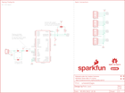

Contents
========

* [PRS17119 > Sparkfun](#prs17119--sparkfun)
	* [Schematic](#schematic)
	* [Interactive BOM](#interactive-bom)
	* [Images](#images)
	* [Tags](#tags)
  
![][im]
# PRS17119 > Sparkfun

- ID: PROJ-SPAR-17119-STAN-01
- Hex ID: PRS17119
- Name: Sparkfun
- Description: Sparkfun
- Long Link: [http://oom.lt/PROJ-SPAR-17119-STAN-01](http://oom.lt/PROJ-SPAR-17119-STAN-01)
- Long Link: [http://oom.lt/PRS17119](http://oom.lt/PRS17119)

## Schematic
  
![][schem]
## Interactive BOM

- Interactive BOM page: [ibom.html](https://htmlpreview.github.io/?https://github.com/oomlout/oomlout_OOMP_projects/blob/main/PROJ-SPAR-17119-STAN-01/kicad/bom/ibom.html)

## Images
  
  

|kicadPcb3d|kicadPcb3dFront|kicadPcb3dBack|eagleImage|eagleSchemImage|
| :---: | :---: | :---: | :---: | :---: |
||||||

## Tags

- hexID: PRS17119
- oompType: PROJ
- oompSize: SPAR
- oompColor: 17119
- oompDesc: STAN
- oompIndex: 01
- oompName: Qwiic Shield for Teensy
- sources: All source files from https://github.com/sparkfun/Qwiic_Shield_for_Teensy (source licence details in srcLicense.md)
- linkBuyPage: https://www.sparkfun.com/products/17119
- oompID: PROJ-SPAR-17119-STAN-01

[im]: kicadPcb3d_450.png
[schem]: eagleSchemImage.png
