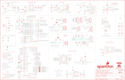

Contents
========

* [PRS17272 > MicroMod Asset Tracker](#prs17272--micromod-asset-tracker)
	* [Schematic](#schematic)
	* [PCB](#pcb)
	* [Interactive BOM](#interactive-bom)
	* [Images](#images)
	* [Tags](#tags)
  
![][im]
# PRS17272 > MicroMod Asset Tracker

- ID: PROJ-SPAR-17272-STAN-01
- Hex ID: PRS17272
- Name: Sparkfun
- Description: Sparkfun
- Long Link: [http://oom.lt/PROJ-SPAR-17272-STAN-01](http://oom.lt/PROJ-SPAR-17272-STAN-01)
- Short Link: [http://oom.lt/PRS17272](http://oom.lt/PRS17272)

## Schematic
  

## PCB
  

## Interactive BOM

- Interactive BOM page: [ibom.html](https://htmlpreview.github.io/?https://github.com/oomlout/oomlout_OOMP_projects/blob/main/PROJ-SPAR-17272-STAN-01/kicad/bom/ibom.html)

## Images
  
  

|bominteractivefront|bominteractiveback|kicadPcb3d|kicadPcb3dFront|kicadPcb3dBack|eagleImage|eagleSchemImage|pcbdraw|pcbdrawback|
| :---: | :---: | :---: | :---: | :---: | :---: | :---: | :---: | :---: |
||||||||||

## Tags

- hexID: PRS17272
- oompType: PROJ
- oompSize: SPAR
- oompColor: 17272
- oompDesc: STAN
- oompIndex: 01
- oompName: MicroMod Asset Tracker
- sources: All source files from https://github.com/sparkfun/MicroMod_Asset_Tracker (source licence details in srcLicense.md)
- linkBuyPage: https://www.sparkfun.com/products/17272
- oompID: PROJ-SPAR-17272-STAN-01
- rawParts: 3V3_LED,,JUMPER-SMT_2_NC_TRACE_SILK,SMT-JUMPER_2_NC_TRACE_SILK,Normally closed trace jumper,,,,,,,,,,,,,,,,,,
- rawParts: BT1,ML414H,ML414H_IV01E_BATTERY,ML414H_IV01E,SEIKO ML414H-IV01E Reflowable Lithium Battery,,,,,,,,,,,,,,BATT-14267,,,,
- rawParts: BYP,JUMPER-SMT_2_NO_SILK,JUMPER-SMT_2_NO_SILK,SMT-JUMPER_2_NO_SILK,Normally open jumper,,,,,,,,,,,,,,,,,,
- rawParts: C1,0.1uF,0.1UF-0603-25V-(+80/-20%),0603,0.1µF ceramic capacitors,,,,,,,,,,,,,,CAP-00810,,,0.1uF,
- rawParts: C2,10uF,10UF-POLAR-EIA3216-16V-10%(TANT),EIA3216,10.0µF polarized capacitors,,,,,,,,,,,,,,CAP-00811,,,10uF,
- rawParts: C3,4.7uF,4.7UF-0603-6.3V-(10%),0603,4.7µF ceramic capacitors,,,,,,,,,,,,,,CAP-08280,,,4.7uF,
- rawParts: C4,0.1uF,0.1UF-0603-25V-(+80/-20%),0603,0.1µF ceramic capacitors,,,,,,,,,,,,,,CAP-00810,,,0.1uF,
- rawParts: C5,0.22uF,0.22UF-0603-25V-10%,0603,0.22µF ceramic capacitors,,,,,,,,,,,,,,CAP-07822,,,0.22uF,
- rawParts: C6,4.7uF,4.7UF-0603-35V-(20%),0603,4.7µF ceramic capacitors,,,,,,,,,,,,,,CAP-14106,,,4.7uF,
- rawParts: C7,47pF,47PF-0603-50V-5%,0603,47pF ceramic capacitors,,,,,,,,,,,,,,CAP-08913,,,47pF,
- rawParts: C8,47pF,47PF-0603-50V-5%,0603,47pF ceramic capacitors,,,,,,,,,,,,,,CAP-08913,,,47pF,
- rawParts: C9,1nF,1.0NF/1000PF-0603-50V-10%,0603,1nF/1,000pF ceramic capacitors,,,,,,,,,,,,,,CAP-07886,,,1nF,
- rawParts: C10,47pF,47PF-0603-50V-5%,0603,47pF ceramic capacitors,,,,,,,,,,,,,,CAP-08913,,,47pF,
- rawParts: C11,47pF,47PF-0603-50V-5%,0603,47pF ceramic capacitors,,,,,,,,,,,,,,CAP-08913,,,47pF,
- rawParts: C12,0.1uF,0.1UF-0603-25V-5%,0603,0.1µF ceramic capacitors,,,,,,,,,,,,,,CAP-08604,,,0.1uF,
- rawParts: C13,0.22uF,0.22UF-0603-25V-10%,0603,0.22µF ceramic capacitors,,,,,,,,,,,,,,CAP-07822,,,0.22uF,
- rawParts: C14,0.1uF,0.1UF-0603-25V-5%,0603,0.1µF ceramic capacitors,,,,,,,,,,,,,,CAP-08604,,,0.1uF,
- rawParts: C15,68pF,68PF-0603-50V-5%,0603,68pF ceramic capacitors,,,,,,,,,,,,,,CAP-14092,,,68pF,
- rawParts: C16,10uF,10UF-0603-6.3V-20%,0603,10.0µF ceramic capacitors,,,,,,,,,,,,,,CAP-11015,,,10uF,
- rawParts: C17,1.0uF,1.0UF-0603-16V-10%,0603,1µF ceramic capacitors,,,,,,,,,,,,,,CAP-00868,,,1.0uF,
- rawParts: C18,33pF,33PF-0402-25V-5%-X7R,0402,33pF ceramic capacitors,,,,,490-5936-1-ND,Murata,,,GRM1555C1H330JA,,,,,CAP-15358,,,33pF,
- rawParts: C19,27pF,27PF-0402-25V-5%-X7R,0402,27pF ceramic capacitors,,,,,490-11384-1-ND,Murata,,,GRM1555C1H270JA,,,,,CAP-15357,,,27pF,
- rawParts: C20,0.1uF,0.1UF-0603-25V-(+80/-20%),0603,0.1µF ceramic capacitors,,,,,,,,,,,,,,CAP-00810,,,0.1uF,
- rawParts: C21,47pF,47PF-0603-50V-5%,0603,47pF ceramic capacitors,,,,,,,,,,,,,,CAP-08913,,,47pF,
- rawParts: C22,0.1uF,0.1UF-0603-25V-(+80/-20%),0603,0.1µF ceramic capacitors,,,,,,,,,,,,,,CAP-00810,,,0.1uF,
- rawParts: C23,0.1uF,0.1UF-0603-25V-(+80/-20%),0603,0.1µF ceramic capacitors,,,,,,,,,,,,,,CAP-00810,,,0.1uF,
- rawParts: C24,15pF,15PF-0603-50V-5%,0603,15pF ceramic capacitors,,,,,,,,,,,,,,CAP-07881,,,15pF,
- rawParts: C31,0.1uF,0.1UF-0603-25V-(+80/-20%),0603,0.1µF ceramic capacitors,,,,,,,,,,,,,,CAP-00810,,,0.1uF,
- rawParts: C46,0.1uF,0.1UF-0603-25V-(+80/-20%),0603,0.1µF ceramic capacitors,,,,,,,,,,,,,,CAP-00810,,,0.1uF,
- rawParts: C51,0.1uF,0.1UF-0603-25V-5%,0603,0.1µF ceramic capacitors,,,,,,,,,,,,,,CAP-08604,,,0.1uF,
- rawParts: C52,0.1uF,0.1UF-0603-25V-5%,0603,0.1µF ceramic capacitors,,,,,,,,,,,,,,CAP-08604,,,0.1uF,
- rawParts: C53,1.0uF,1.0UF-0603-16V-10%-X7R,0603,1µF ceramic capacitors,,,,,,,,,,,,,,CAP-13930,,,1.0uF,
- rawParts: C54,1.0uF,1.0UF-0603-16V-10%-X7R,0603,1µF ceramic capacitors,,,,,,,,,,,,,,CAP-13930,,,1.0uF,
- rawParts: D1,3.3V,DIODE-ZENER-MM3Z3V3T1G,SOD-323,Zener Diode,,,,,,,,,,,,,,DIO-11284,,,3.3V,
- rawParts: D2,RED,LED-RED0603,LED-0603,Red SMD LED,,,,,,,,,,,,,,DIO-00819,,,RED,
- rawParts: D3,BAS70-05,DIODE-SCHOTTKY-DUAL,SOT23-3,Diodes Incorporated - BAS70-05 Dual Schottky Diode,,,,,,,,,,,,,,DIO-14829,,,BAS70-05,
- rawParts: D4,Yellow,LED-YELLOW0603,LED-0603,Yellow SMD LED,,,,,,,,,,,,,,DIO-09003,,,Yellow,
- rawParts: D5,Yellow,LED-YELLOW0603,LED-0603,Yellow SMD LED,,,,,,,,,,,,,,DIO-09003,,,Yellow,
- rawParts: D6,3A/10V/280mV,DIODE-SCHOTTKY-BAT60A,SOD-323,Schottky diode,,,,,,,,,,,,,,DIO-14072,,,3A/10V/280mV,
- rawParts: D7,1A/15V/220mV,DIODE-SCHOTTKY-LSM115JE3,DO-214BA,Schottky diode,,,,,,,,,,,,,,DIO-15271,,,1A/15V/220mV,
- rawParts: D8,DT1042-04SO-7,TVS_DIODE_ARRAY_4DT1042-04SO-7,SOT23-6L,,,,,,,,,,,,,,,DIO-14095,,,,
- rawParts: D10,PESD0402,PESD0402,0402,ESD protection diode,,,,,PESD0402-140CT-ND,,,,,,,,650-PESD0402-140,DIO-15359,,,,
- rawParts: D11,PESD0402,PESD0402,0402,ESD protection diode,,,,,PESD0402-140CT-ND,,,,,,,,650-PESD0402-140,DIO-15359,,,,
- rawParts: D12,GREEN,LED-GREEN0603,LED-0603,Green SMD LED,,,,,,,,,,,,,,DIO-00821,,,GREEN,
- rawParts: D13,BLUE,LED-BLUE0603,LED-0603,Blue SMD LED,,,,,,,,,,,,,,DIO-08575,,,BLUE,
- rawParts: D14,WHITE,LED-WHITE0603,LED-0603,White SMD LED,,,,,,,,,,,,,,DIO-09004,,,WHITE,
- rawParts: DSR,JUMPER-SMT_3_1-NC_TRACE_SILK,JUMPER-SMT_3_1-NC_TRACE_SILK,SMT-JUMPER_3_1-NC_TRACE_SILK,Normally closed trace jumper (1 of 2 connections),,,,,,,,,,,,,,,,,,
- rawParts: E1,SPH0641LM4H-1,SPH0641LM4H-1_MICROPHONE,SPH0641LM4H-1_MICROPHONE,SPH0641LM4H-1 Microphone,,,,,,,,,,,,,,IC-14361,,,SPH0641LM4H-1,
- rawParts: E3,ANTENNA-SMA-GROUNDEDEDGE_SMA_SMD,ANTENNA-SMA-GROUNDEDEDGE_SMA_SMD,SMA-EDGE-SMD,SMA Antenna Connector w/ Ground,,,,,,,,,,,,,,CONN-15100,,,,
- rawParts: E4,ANTENNA-SMA-GROUNDEDEDGE_SMA_SMD,ANTENNA-SMA-GROUNDEDEDGE_SMA_SMD,SMA-EDGE-SMD,SMA Antenna Connector w/ Ground,,,,,,,,,,,,,,CONN-15100,,,,
- rawParts: EN,,JUMPER-SMT_2_NC_TRACE_SILK,SMT-JUMPER_2_NC_TRACE_SILK,Normally closed trace jumper,,,,,,,,,,,,,,,,,,
- rawParts: F2,6V/2A,PPTC_6V2A,1210,Resettable Fuse PPTC,,,,,,,,,,,,,,RES-14313,,,6V/2A,
- rawParts: FB1,30Ω/1.8A,FERRITE_BEAD-0603,0603,Ferrite Bead (blocks, cores, rings, chokes, etc.),,,,,,,,,,,,,,NDUC-13805,,,30Ω/1.8A,
- rawParts: FD1,FIDUCIALUFIDUCIAL,FIDUCIALUFIDUCIAL,FIDUCIAL-MICRO,Fiducial Alignment Points,,,,,,,,,,,,,,,,,,
- rawParts: FD2,FIDUCIALUFIDUCIAL,FIDUCIALUFIDUCIAL,FIDUCIAL-MICRO,Fiducial Alignment Points,,,,,,,,,,,,,,,,,,
- rawParts: FD3,FIDUCIALUFIDUCIAL,FIDUCIALUFIDUCIAL,FIDUCIAL-MICRO,Fiducial Alignment Points,,,,,,,,,,,,,,,,,,
- rawParts: FD4,FIDUCIALUFIDUCIAL,FIDUCIALUFIDUCIAL,FIDUCIAL-MICRO,Fiducial Alignment Points,,,,,,,,,,,,,,,,,,
- rawParts: FRAME1,FRAME-LEDGER,FRAME-LEDGER,CREATIVE_COMMONS,Schematic Frame - Ledger,,,,,,,,,,,,,,,,,,
- rawParts: FRAME2,FRAME-LEDGER,FRAME-LEDGER,CREATIVE_COMMONS,Schematic Frame - Ledger,,,,,,,,,,,,,,,,,,
- rawParts: H1,STAND-OFF,STAND-OFF,STAND-OFF,Stand Off,,,,,,,,,,,,,,,,,,
- rawParts: H2,STAND-OFF,STAND-OFF,STAND-OFF,Stand Off,,,,,,,,,,,,,,,,,,
- rawParts: H3,STAND-OFF,STAND-OFF,STAND-OFF,Stand Off,,,,,,,,,,,,,,,,,,
- rawParts: H4,STAND-OFF,STAND-OFF,STAND-OFF,Stand Off,,,,,,,,,,,,,,,,,,
- rawParts: H5,STAND-OFF-REFLOW2.5MM_TALL,STAND-OFF-REFLOW2.5MM_TALL,STAND-OFF-REFLOW-M2.5,Stand Off Reflow Compatible,,,,,,,,,,,,,,HW-14899,,,,
- rawParts: IC1,SN74AVC4T774PW,SN74AVC4T774PW,SOP65P640X120-16N,Texas Instruments,SN74AVC4T774PW,IC, Texas Instruments SN74AVC4T774PW, Dual, Bus Transceiver, 4-Bit Non-Inverting 3-State, 1.2  3.6 V, 16-Pin TSSOP,SN74AVC4T774PW,https://www.arrow.com/en/products/sn74avc4t774pw/texas-instruments,Texas Instruments,SN74AVC4T774PW,IC, Texas Instruments SN74AVC4T774PW, Dual, Bus Transceiver, 4-Bit Non-Inverting 3-State, 1.2  3.6 V, 16-Pin TSSOP,,,,Texas Instruments,SN74AVC4T774PW,,,595-SN74AVC4T774PW,https://www.mouser.co.uk/ProductDetail/Texas-Instruments/SN74AVC4T774PW?qs=WxL8HmPi5r44hV1AE7gRvg%3D%3D,,IC-15360,,,,
- rawParts: IC2,SN74AVC4T774PW,SN74AVC4T774PW,SOP65P640X120-16N,Texas Instruments,SN74AVC4T774PW,IC, Texas Instruments SN74AVC4T774PW, Dual, Bus Transceiver, 4-Bit Non-Inverting 3-State, 1.2  3.6 V, 16-Pin TSSOP,SN74AVC4T774PW,https://www.arrow.com/en/products/sn74avc4t774pw/texas-instruments,Texas Instruments,SN74AVC4T774PW,IC, Texas Instruments SN74AVC4T774PW, Dual, Bus Transceiver, 4-Bit Non-Inverting 3-State, 1.2  3.6 V, 16-Pin TSSOP,,,,Texas Instruments,SN74AVC4T774PW,,,595-SN74AVC4T774PW,https://www.mouser.co.uk/ProductDetail/Texas-Instruments/SN74AVC4T774PW?qs=WxL8HmPi5r44hV1AE7gRvg%3D%3D,,IC-15360,,,,
- rawParts: IC3,SN74AVC4T774PW,SN74AVC4T774PW,SOP65P640X120-16N,Texas Instruments,SN74AVC4T774PW,IC, Texas Instruments SN74AVC4T774PW, Dual, Bus Transceiver, 4-Bit Non-Inverting 3-State, 1.2  3.6 V, 16-Pin TSSOP,SN74AVC4T774PW,https://www.arrow.com/en/products/sn74avc4t774pw/texas-instruments,Texas Instruments,SN74AVC4T774PW,IC, Texas Instruments SN74AVC4T774PW, Dual, Bus Transceiver, 4-Bit Non-Inverting 3-State, 1.2  3.6 V, 16-Pin TSSOP,,,,Texas Instruments,SN74AVC4T774PW,,,595-SN74AVC4T774PW,https://www.mouser.co.uk/ProductDetail/Texas-Instruments/SN74AVC4T774PW?qs=WxL8HmPi5r44hV1AE7gRvg%3D%3D,,IC-15360,,,,
- rawParts: J1,,USB_C_4-LAYER_PADS,USB-C-16P_4LAYER-PADS,USB Type C 16Pin Connector,,,,,,,,,,,,,,CONN-14122,,,,
- rawParts: J2,JTAG,CORTEX_JTAG_DEBUG_MINIMUM_PTH,2X5-PTH-1.27MM,Cortex Debug Connector - 10 pin,,,,,,,,,,,,,,,,,,
- rawParts: J4,MICROMOD-2222-C,MICROMOD-2222-C,M.2-CONNECTOR-E,MicroMod Connector,,,,,,,,,,,,,,CONN-14877,,,,
- rawParts: J5,SPI,CONN_05NO_SILK,1X05_NO_SILK,Multi connection point. Often used as Generic Header-pin footprint for 0.1 inch spaced/style header connections,,,,,,,,,,,,,,,,,,
- rawParts: J6,DIAG,CONN_05NO_SILK,1X05_NO_SILK,Multi connection point. Often used as Generic Header-pin footprint for 0.1 inch spaced/style header connections,,,,,,,,,,,,,,,,,,
- rawParts: J7,QWIIC_RIGHT_ANGLE,QWIIC_CONNECTORJS-1MM,JST04_1MM_RA,SparkFun I2C Standard Qwiic Connector,,,,,,,,,,,,,,CONN-13694,,,QWIIC_RIGHT_ANGLE,
- rawParts: J8,,CONN_06NO_SILK_NO_POP,1X06_NO_SILK,Multi connection point. Often used as Generic Header-pin footprint for 0.1 inch spaced/style header connections,,,,,,,,,,,,,,,,,,
- rawParts: J9,!RST!,CONN_01PTH_NO_SILK_YES_STOP,1X01_NO_SILK,Single connection point. Often used as Generic Header-pin footprint for 0.1 inch spaced/style header connections,,,,,,,,,,,,,,,,,,
- rawParts: J10,,CONN_06NO_SILK_NO_POP,1X06_NO_SILK,Multi connection point. Often used as Generic Header-pin footprint for 0.1 inch spaced/style header connections,,,,,,,,,,,,,,,,,,
- rawParts: J11,microSD,MICRO-SD-SDIOPUSH-PUSH,MICRO-SD-SOCKET,microSD Socket for Transflash,,,,,,,,,,,,,,CONN-07820,,,,
- rawParts: J12,,I2C_STANDARD_NO_SILK,1X04_NO_SILK,SparkFun I2C Standard Pinout Header,,,,,,,,,,,,,,,,,,
- rawParts: J13,TP,CONN_01PTH_NO_SILK_YES_STOP,1X01_NO_SILK,Single connection point. Often used as Generic Header-pin footprint for 0.1 inch spaced/style header connections,,,,,,,,,,,,,,,,,,
- rawParts: J14,,I2C_STANDARD_NO_SILK,1X04_NO_SILK,SparkFun I2C Standard Pinout Header,,,,,,,,,,,,,,,,,,
- rawParts: J15,,JST_2MM_MALE,JST-2-SMD,JST 2MM MALE RA CONNECTOR,,,,,,,,,,,,,,CONN-11443,,PRT-08612,,
- rawParts: J16,,CONN_021X02_NO_SILK,1X02_NO_SILK,Multi connection point. Often used as Generic Header-pin footprint for 0.1 inch spaced/style header connections,,,,,,,,,,,,,,,,,,
- rawParts: J17,NANO_SIM,NANO_SIMWURTH,NANO_SIM_WURTH_693043020611,,,,,,,,,,,,,,,CONN-14097,,,,
- rawParts: J18,SARA_USB,CONN_041X04_NO_SILK,1X04_NO_SILK,Multi connection point. Often used as Generic Header-pin footprint for 0.1 inch spaced/style header connections,,,,,,,,,,,,,,CONN-09696,,,,
- rawParts: J19,NI,CONN_01PTH_NO_SILK_YES_STOP,1X01_NO_SILK,Single connection point. Often used as Generic Header-pin footprint for 0.1 inch spaced/style header connections,,,,,,,,,,,,,,,,,,
- rawParts: JP1,,JUMPER-SMT_3_2-NC_TRACE_SILK,SMT-JUMPER_3_2-NC_TRACE_SILK,Normally closed trace jumper (2 of 2 connections),,,,,,,,,,,,,,,,,,
- rawParts: JP2,,JUMPER-SMT_3_2-NC_TRACE_SILK,SMT-JUMPER_3_2-NC_TRACE_SILK,Normally closed trace jumper (2 of 2 connections),,,,,,,,,,,,,,,,,,
- rawParts: JP3,JUMPER-SMT_2_NO_SILK,JUMPER-SMT_2_NO_SILK,SMT-JUMPER_2_NO_SILK,Normally open jumper,,,,,,,,,,,,,,,,,,
- rawParts: JP4,JUMPER-SMT_2_NO_SILK,JUMPER-SMT_2_NO_SILK,SMT-JUMPER_2_NO_SILK,Normally open jumper,,,,,,,,,,,,,,,,,,
- rawParts: JP5,JUMPER-SMT_2_NO_SILK,JUMPER-SMT_2_NO_SILK,SMT-JUMPER_2_NO_SILK,Normally open jumper,,,,,,,,,,,,,,,,,,
- rawParts: JP6,JUMPER-SMT_2_NC_TRACE_SILK,JUMPER-SMT_2_NC_TRACE_SILK,SMT-JUMPER_2_NC_TRACE_SILK,Normally closed trace jumper,,,,,,,,,,,,,,,,,,
- rawParts: JP7,JUMPER-SMT_2_NO_SILK,JUMPER-SMT_2_NO_SILK,SMT-JUMPER_2_NO_SILK,Normally open jumper,,,,,,,,,,,,,,,,,,
- rawParts: JP8,JUMPER-SMT_2_NO_SILK,JUMPER-SMT_2_NO_SILK,SMT-JUMPER_2_NO_SILK,Normally open jumper,,,,,,,,,,,,,,,,,,
- rawParts: JP9,JUMPER-SMT_2_NC_TRACE_SILK,JUMPER-SMT_2_NC_TRACE_SILK,SMT-JUMPER_2_NC_TRACE_SILK,Normally closed trace jumper,,,,,,,,,,,,,,,,,,
- rawParts: JP10,JUMPER-SMT_2_NC_TRACE_SILK,JUMPER-SMT_2_NC_TRACE_SILK,SMT-JUMPER_2_NC_TRACE_SILK,Normally closed trace jumper,,,,,,,,,,,,,,,,,,
- rawParts: JP11,JUMPER-SMT_2_NC_TRACE_SILK,JUMPER-SMT_2_NC_TRACE_SILK,SMT-JUMPER_2_NC_TRACE_SILK,Normally closed trace jumper,,,,,,,,,,,,,,,,,,
- rawParts: JP12,JUMPER-SMT_2_NC_TRACE_SILK,JUMPER-SMT_2_NC_TRACE_SILK,SMT-JUMPER_2_NC_TRACE_SILK,Normally closed trace jumper,,,,,,,,,,,,,,,,,,
- rawParts: JP13,JUMPER-SMT_2_NO_SILK,JUMPER-SMT_2_NO_SILK,SMT-JUMPER_2_NO_SILK,Normally open jumper,,,,,,,,,,,,,,,,,,
- rawParts: JP14,JUMPER-SMT_2_NO_SILK,JUMPER-SMT_2_NO_SILK,SMT-JUMPER_2_NO_SILK,Normally open jumper,,,,,,,,,,,,,,,,,,
- rawParts: JP15,JUMPER-SMT_2_NO_SILK,JUMPER-SMT_2_NO_SILK,SMT-JUMPER_2_NO_SILK,Normally open jumper,,,,,,,,,,,,,,,,,,
- rawParts: JP16,JUMPER-SMT_2_NO_SILK,JUMPER-SMT_2_NO_SILK,SMT-JUMPER_2_NO_SILK,Normally open jumper,,,,,,,,,,,,,,,,,,
- rawParts: JP17,JUMPER-SMT_2_NO_SILK,JUMPER-SMT_2_NO_SILK,SMT-JUMPER_2_NO_SILK,Normally open jumper,,,,,,,,,,,,,,,,,,
- rawParts: JP18,JUMPER-SMT_2_NC_TRACE_SILK,JUMPER-SMT_2_NC_TRACE_SILK,SMT-JUMPER_2_NC_TRACE_SILK,Normally closed trace jumper,,,,,,,,,,,,,,,,,,
- rawParts: JP19,JUMPER-SMT_3_1-NC_TRACE_SILK,JUMPER-SMT_3_1-NC_TRACE_SILK,SMT-JUMPER_3_1-NC_TRACE_SILK,Normally closed trace jumper (1 of 2 connections),,,,,,,,,,,,,,,,,,
- rawParts: JP20,JUMPER-SMT_2_NC_TRACE_SILK,JUMPER-SMT_2_NC_TRACE_SILK,SMT-JUMPER_2_NC_TRACE_SILK,Normally closed trace jumper,,,,,,,,,,,,,,,,,,
- rawParts: L1,DNP,INDUCTOR_DNP-0402,0402_COILCRAFT,,,,,,,,,,,,,,,,,,,
- rawParts: L2,68nH,68NH-0402,0402_COILCRAFT,,,,,,490-2633-1-ND,,,,,81-LQG15HS68NJ02D,,,,NDUC-15356,,,68nH,
- rawParts: LOGO1,SFE_LOGO_NAME_FLAME.1_INCH,SFE_LOGO_NAME_FLAME.1_INCH,SFE_LOGO_NAME_FLAME_.1,SparkFun Font Logo w/ Flame,,,,,,,,,,,,,,,,,,
- rawParts: LOGO2,QWIIC_LOGO_CONNECTOR,QWIIC_LOGO_CONNECTOR,QWIIC_5.5MM,Qwiic Logos for placement on schematic and PCB. The 5.5mm silk logo is best for placing next to Qwiic connector.,,,,,,,,,,,,,,,,,,
- rawParts: LOGO3,OSHW-LOGOMINI,OSHW-LOGOMINI,OSHW-LOGO-MINI,Open-Source Hardware (OSHW) Logo,,,,,,,,,,,,,,,,,,
- rawParts: LOGO5,SPECIAL_INSTRUCTIONS-ORDERING,SPECIAL_INSTRUCTIONS-ORDERING,ORDERING_INSTRUCTIONS,Special Ordering/Production Instructions Alert,,,,,,,,,,,,,,,,,,
- rawParts: MEAS,,JUMPER-COMBO_2_NC_TRACE,COMBO-JUMPER_2_NC_TRACE,,,,,,,,,,,,,,,,,,,
- rawParts: Q1,310mA/60V/1.6Ω,MOSFET-NCH-2N7002PW,SOT323,N-channel MOSFETs,,,,,,,,,,,,,,TRANS-11151,,,310mA/60V/1.6Ω,
- rawParts: Q2,310mA/60V/1.6Ω,MOSFET-NCH-2N7002PW,SOT323,N-channel MOSFETs,,,,,,,,,,,,,,TRANS-11151,,,310mA/60V/1.6Ω,
- rawParts: Q3,310mA/60V/1.6Ω,MOSFET-NCH-2N7002PW,SOT323,N-channel MOSFETs,,,,,,,,,,,,,,TRANS-11151,,,310mA/60V/1.6Ω,
- rawParts: Q4,310mA/60V/1.6Ω,MOSFET-NCH-2N7002PW,SOT323,N-channel MOSFETs,,,,,,,,,,,,,,TRANS-11151,,,310mA/60V/1.6Ω,
- rawParts: Q5,20V/0.2A/8MHz/1.2Ω/1Vth,MOSFET-NCH-RE1C00UNTL,SOT-416FL,N-channel MOSFETs,,,,,,,,,,,,,,TRANS-14399,,,20V/0.2A/8MHz/1.2Ω/1Vth,
- rawParts: Q6,20V/4.2A/52mΩ/1.4W,MOSFET_PCH-DMG2305UX-7,SOT23-3,P-channel MOSFETs,,,,,,,,,,,,,,TRAN-14388,,,20V/4.2A/52mΩ/1.4W,
- rawParts: Q7,310mA/60V/1.6Ω,MOSFET-NCH-2N7002PW,SOT323,N-channel MOSFETs,,,,,,,,,,,,,,TRANS-11151,,,310mA/60V/1.6Ω,
- rawParts: Q8,310mA/60V/1.6Ω,MOSFET-NCH-2N7002PW,SOT323,N-channel MOSFETs,,,,,,,,,,,,,,TRANS-11151,,,310mA/60V/1.6Ω,
- rawParts: Q9,310mA/60V/1.6Ω,MOSFET-NCH-2N7002PW,SOT323,N-channel MOSFETs,,,,,,,,,,,,,,TRANS-11151,,,310mA/60V/1.6Ω,
- rawParts: Q10,20V/0.2A/8MHz/1.2Ω/1Vth,MOSFET-NCH-RE1C00UNTL,SOT-416FL,N-channel MOSFETs,,,,,,,,,,,,,,TRANS-14399,,,20V/0.2A/8MHz/1.2Ω/1Vth,
- rawParts: R1,2.2k,2.2KOHM-0603-1/10W-1%,0603,2.2kΩ resistor,,,,,,,,,,,,,,RES-08272,,,2.2k,
- rawParts: R2,5.1k,5.1KOHM5.1KOHM-0603-1/10W-1%,0603,,,,,,,,,,,,,,,RES-12083,,,5.1k,
- rawParts: R3,5.1k,5.1KOHM5.1KOHM-0603-1/10W-1%,0603,,,,,,,,,,,,,,,RES-12083,,,5.1k,
- rawParts: R4,2.2k,2.2KOHM-0603-1/10W-1%,0603,2.2kΩ resistor,,,,,,,,,,,,,,RES-08272,,,2.2k,
- rawParts: R5,100k,100KOHM-0603-1/10W-1%,0603,100kΩ resistor,,,,,,,,,,,,,,RES-07828,,,100k,
- rawParts: R6,4.7k,4.7KOHM-0603-1/10W-1%,0603,4.7kΩ resistor,,,,,,,,,,,,,,RES-07857,,,4.7k,
- rawParts: R7,2.2k,2.2KOHM-0603-1/10W-1%,0603,2.2kΩ resistor,,,,,,,,,,,,,,RES-08272,,,2.2k,
- rawParts: R8,3.3k,3.3KOHM-0603-1/10W-1%,0603,3.3kΩ resistor,,,,,,,,,,,,,,RES-07851,,,3.3k,
- rawParts: R9,10k,10KOHM-0603-1/10W-1%,0603,10kΩ resistor,,,,,,,,,,,,,,RES-00824,,,10k,
- rawParts: R10,20k,20KOHM-0603-1/10W-1%,0603,20kΩ resistor,,,,,,,,,,,,,,RES-09383,,,20k,
- rawParts: R11,1k,1KOHM-0603-1/10W-1%,0603,1kΩ resistor,,,,,,,,,,,,,,RES-07856,,,1k,
- rawParts: R12,2.2k,2.2KOHM-0603-1/10W-1%,0603,2.2kΩ resistor,,,,,,,,,,,,,,RES-08272,,,2.2k,
- rawParts: R13,1k,1KOHM-0603-1/10W-1%,0603,1kΩ resistor,,,,,,,,,,,,,,RES-07856,,,1k,
- rawParts: R14,2.2k,2.2KOHM-0603-1/10W-1%,0603,2.2kΩ resistor,,,,,,,,,,,,,,RES-08272,,,2.2k,
- rawParts: R15,100k,100KOHM-0603-1/10W-1%,0603,100kΩ resistor,,,,,,,,,,,,,,RES-07828,,,100k,
- rawParts: R16,100k,100KOHM-0603-1/10W-1%,0603,100kΩ resistor,,,,,,,,,,,,,,RES-07828,,,100k,
- rawParts: R17,100k,100KOHM-0603-1/10W-1%,0603,100kΩ resistor,,,,,,,,,,,,,,RES-07828,,,100k,
- rawParts: R18,100k,100KOHM-0603-1/10W-1%,0603,100kΩ resistor,,,,,,,,,,,,,,RES-07828,,,100k,
- rawParts: R19,100k,100KOHM-0603-1/10W-1%,0603,100kΩ resistor,,,,,,,,,,,,,,RES-07828,,,100k,
- rawParts: R20,100k,100KOHM-0603-1/10W-1%,0603,100kΩ resistor,,,,,,,,,,,,,,RES-07828,,,100k,
- rawParts: R21,1k,1KOHM-0603-1/10W-1%,0603,1kΩ resistor,,,,,,,,,,,,,,RES-07856,,,1k,
- rawParts: R22,2.2k,2.2KOHM-0603-1/10W-1%,0603,2.2kΩ resistor,,,,,,,,,,,,,,RES-08272,,,2.2k,
- rawParts: R23,10k,10KOHM-0603-1/10W-1%,0603,10kΩ resistor,,,,,,,,,,,,,,RES-00824,,,10k,
- rawParts: R24,10,10OHM-0603-1/10W-1%,0603,10Ω resistor,,,,,,,,,,,,,,RES-12581,,,10,
- rawParts: R25,100k,100KOHM-0603-1/10W-1%,0603,100kΩ resistor,,,,,,,,,,,,,,RES-07828,,,100k,
- rawParts: R26,200k,200KOHM-0603-1/10W-1%,0603,200kΩ resistor,,,,,,,,,,,,,,RES-09385,,,200k,
- rawParts: R27,1k,1KOHM-0603-1/10W-1%,0603,1kΩ resistor,,,,,,,,,,,,,,RES-07856,,,1k,
- rawParts: R28,1k,1KOHM-0603-1/10W-1%,0603,1kΩ resistor,,,,,,,,,,,,,,RES-07856,,,1k,
- rawParts: R29,2.2k,2.2KOHM-0603-1/10W-1%,0603,2.2kΩ resistor,,,,,,,,,,,,,,RES-08272,,,2.2k,
- rawParts: R30,2.2k,2.2KOHM-0603-1/10W-1%,0603,2.2kΩ resistor,,,,,,,,,,,,,,RES-08272,,,2.2k,
- rawParts: R31,0,0OHM-0603-1/10W,0603,0Ω resistor,,,,,,,,,,,,,,RES-08609,,,0,
- rawParts: R32,1k,1KOHM-0603-1/10W-1%,0603,1kΩ resistor,,,,,,,,,,,,,,RES-07856,,,1k,
- rawParts: R33,100,100OHM-0603-1/10W-1%,0603,100Ω resistor,,,,,,,,,,,,,,RES-07863,,,100,
- rawParts: R34,1k,1KOHM-0603-1/10W-1%,0603,1kΩ resistor,,,,,,,,,,,,,,RES-07856,,,1k,
- rawParts: R35,470,470OHM-0603-1/10W-1%,0603,470Ω resistor,,,,,,,,,,,,,,RES-07869,,,470,
- rawParts: R36,0,0OHM-0603-1/10W,0603,0Ω resistor,,,,,,,,,,,,,,RES-08609,,,0,
- rawParts: R37,0,0OHM-0603-1/10W,0603,0Ω resistor,,,,,,,,,,,,,,RES-08609,,,0,
- rawParts: R38,100k,100KOHM-0603-1/10W-1%,0603,100kΩ resistor,,,,,,,,,,,,,,RES-07828,,,100k,
- rawParts: R39,100k,100KOHM-0603-1/10W-1%,0603,100kΩ resistor,,,,,,,,,,,,,,RES-07828,,,100k,
- rawParts: R40,100k,100KOHM-0603-1/10W-1%,0603,100kΩ resistor,,,,,,,,,,,,,,RES-07828,,,100k,
- rawParts: R41,100k,100KOHM-0603-1/10W-1%,0603,100kΩ resistor,,,,,,,,,,,,,,RES-07828,,,100k,
- rawParts: R42,1k,1KOHM-0603-1/10W-1%,0603,1kΩ resistor,,,,,,,,,,,,,,RES-07856,,,1k,
- rawParts: R43,1k,1KOHM-0603-1/10W-1%,0603,1kΩ resistor,,,,,,,,,,,,,,RES-07856,,,1k,
- rawParts: R44,100k,100KOHM-0603-1/10W-1%,0603,100kΩ resistor,,,,,,,,,,,,,,RES-07828,,,100k,
- rawParts: R45,100k,100KOHM-0603-1/10W-1%,0603,100kΩ resistor,,,,,,,,,,,,,,RES-07828,,,100k,
- rawParts: R48,2.2k,2.2KOHM-0603-1/10W-1%,0603,2.2kΩ resistor,,,,,,,,,,,,,,RES-08272,,,2.2k,
- rawParts: S1,RESET,MOMENTARY-SWITCH-SPST-SMD-5.2-TALL-REDUNDANT,TACTILE_SWITCH_SMD_5.2MM,Momentary Switch (Pushbutton) - SPST,,,,,,,,,,,,,,SWCH-14139,,,,
- rawParts: S2,BOOT,MOMENTARY-SWITCH-SPST-SMD-5.2-TALL-REDUNDANT,TACTILE_SWITCH_SMD_5.2MM,Momentary Switch (Pushbutton) - SPST,,,,,,,,,,,,,,SWCH-14139,,,,
- rawParts: S3,SARA_PWR,MOMENTARY-SWITCH-SPST-SMD-5.2-TALL-REDUNDANT,TACTILE_SWITCH_SMD_5.2MM,Momentary Switch (Pushbutton) - SPST,,,,,,,,,,,,,,SWCH-14139,,,,
- rawParts: TP1,TEST-POINT3,TEST-POINT3,PAD.03X.03,SparkFun Test Points,,,,,,,,,,,,,,,,,,
- rawParts: TP2,TEST-POINT3,TEST-POINT3,PAD.03X.03,SparkFun Test Points,,,,,,,,,,,,,,,,,,
- rawParts: TP3,TEST-POINT3,TEST-POINT3,PAD.03X.03,SparkFun Test Points,,,,,,,,,,,,,,,,,,
- rawParts: TP4,TEST-POINT3,TEST-POINT3,PAD.03X.03,SparkFun Test Points,,,,,,,,,,,,,,,,,,
- rawParts: TP5,TEST-POINT3,TEST-POINT3,PAD.03X.03,SparkFun Test Points,,,,,,,,,,,,,,,,,,
- rawParts: TP6,TEST-POINT3,TEST-POINT3,PAD.03X.03,SparkFun Test Points,,,,,,,,,,,,,,,,,,
- rawParts: TP7,TEST-POINT3,TEST-POINT3,PAD.03X.03,SparkFun Test Points,,,,,,,,,,,,,,,,,,
- rawParts: TP8,TEST-POINT3,TEST-POINT3,PAD.03X.03,SparkFun Test Points,,,,,,,,,,,,,,,,,,
- rawParts: TP9,TEST-POINT3,TEST-POINT3,PAD.03X.03,SparkFun Test Points,,,,,,,,,,,,,,,,,,
- rawParts: TP10,TEST-POINT3,TEST-POINT3,PAD.03X.03,SparkFun Test Points,,,,,,,,,,,,,,,,,,
- rawParts: TP12,TEST-POINT3,TEST-POINT3,PAD.03X.03,SparkFun Test Points,,,,,,,,,,,,,,,,,,
- rawParts: TP13,TEST-POINT3,TEST-POINT3,PAD.03X.03,SparkFun Test Points,,,,,,,,,,,,,,,,,,
- rawParts: TP14,TEST-POINT3,TEST-POINT3,PAD.03X.03,SparkFun Test Points,,,,,,,,,,,,,,,,,,
- rawParts: TP15,TEST-POINT3,TEST-POINT3,PAD.03X.03,SparkFun Test Points,,,,,,,,,,,,,,,,,,
- rawParts: TP16,TEST-POINT3,TEST-POINT3,PAD.03X.03,SparkFun Test Points,,,,,,,,,,,,,,,,,,
- rawParts: TP17,TEST-POINT3,TEST-POINT3,PAD.03X.03,SparkFun Test Points,,,,,,,,,,,,,,,,,,
- rawParts: TP18,TEST-POINT3,TEST-POINT3,PAD.03X.03,SparkFun Test Points,,,,,,,,,,,,,,,,,,
- rawParts: TP19,TEST-POINT3,TEST-POINT3,PAD.03X.03,SparkFun Test Points,,,,,,,,,,,,,,,,,,
- rawParts: TP20,TEST-POINT3,TEST-POINT3,PAD.03X.03,SparkFun Test Points,,,,,,,,,,,,,,,,,,
- rawParts: TP21,TEST-POINT3,TEST-POINT3,PAD.03X.03,SparkFun Test Points,,,,,,,,,,,,,,,,,,
- rawParts: TP22,TEST-POINT3,TEST-POINT3,PAD.03X.03,SparkFun Test Points,,,,,,,,,,,,,,,,,,
- rawParts: TP23,TEST-POINT3,TEST-POINT3,PAD.03X.03,SparkFun Test Points,,,,,,,,,,,,,,,,,,
- rawParts: TP24,TEST-POINT3,TEST-POINT3,PAD.03X.03,SparkFun Test Points,,,,,,,,,,,,,,,,,,
- rawParts: U1,SARA-R510M8S,SARA-R510M8S,SARA-LGA,,,,,,,,,,,,,,,IC-15573,,,SARA-R510M8S,
- rawParts: U2,MCP73831,MCP73831,SOT23-5,MCP73831T Li-Ion, Li-Pol Controller,,,,,,,,,,,,,,IC-09995,,,,
- rawParts: U3,3.3V,V_REG_AP2112K-3.3V,SOT23-5,AP2112 - 600mA CMOS LDO Regulator w/ Enable,,,,,,,,,,,,,,VREG-12457,,,3.3V,
- rawParts: U4,MAX17048,MAX17048DFN8,DFN-8,Micropower 1-Cell Li+ ModelGauge,,,,,,,,,,,,,,IC-12551,,,MAX17048,
- rawParts: U5,AP7361C-33FGE,AP7361C-33FGEUDFN-8,UDFN-8,AP7361C 3.3V LDO Regulator,,,,,,,,,,,,,,VREG-14094,,,,
- rawParts: U7,PCA9306,PCA9306VSSOP_8PIN,VSSOP_8PIN,Bidirectional I2C level shifter,,,,,,,,,,,,,,IC-14450,,,,
- rawParts: U8,74HC1G04,74HC1G04,SOT353,Single Inverter,,,,,,,,,,,,,,COMP-08268,,,74HC1G04,
- rawParts: U13,9DoF IMU,ICM-20948,QFN24-3X3-ICM-20948,ICM-20948 9 Degree of Freedom IMU,,,,,,,,,,,,,,IC-14247,,,9DoF IMU,
- rawParts: U14,1.8V/100mA,V_REG_SP6214-1.8V,SC70,Voltage Regulator - SP6214,,,,,,,,,,,,,,VREG-08428,,,1.8V/100mA,
- rawParts: VE,,JUMPER-SMT_2_NO_SILK,SMT-JUMPER_2_NO_SILK,Normally open jumper,,,,,,,,,,,,,,,,,,
- rawParts: VIN/3,JUMPER-SMT_2_NC_TRACE_SILK,JUMPER-SMT_2_NC_TRACE_SILK,SMT-JUMPER_2_NC_TRACE_SILK,Normally closed trace jumper,,,,,,,,,,,,,,,,,,
- rawParts: VIN_LED,,JUMPER-SMT_2_NC_TRACE_SILK,SMT-JUMPER_2_NC_TRACE_SILK,Normally closed trace jumper,,,,,,,,,,,,,,,,,,

[im]: kicadPcb3d_450.png
