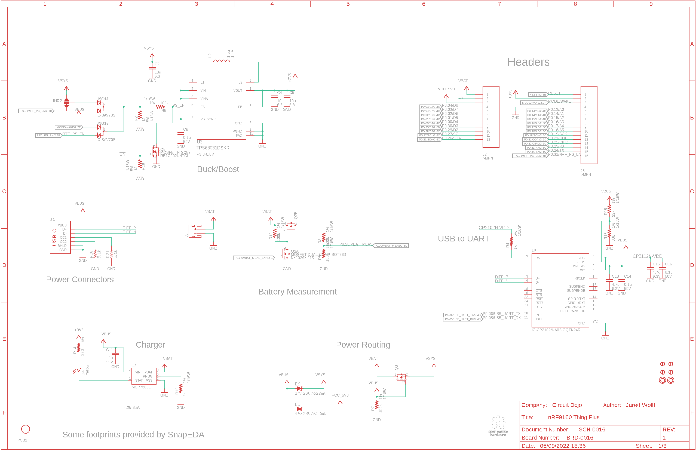
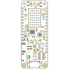
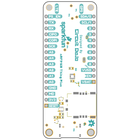
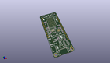
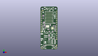
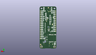
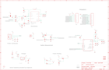
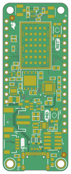
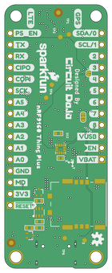

Contents
========

* [PRS17354 > nRF9160 Thing Plus](#prs17354--nrf9160-thing-plus)
	* [Schematic](#schematic)
	* [Interactive BOM](#interactive-bom)
	* [OOMP Parts](#oomp-parts)
	* [Images](#images)
	* [Tags](#tags)
  
![][im]
# PRS17354 > nRF9160 Thing Plus

- ID: PROJ-SPAR-17354-STAN-01
- Hex ID: PRS17354
- Name: Sparkfun
- Description: Sparkfun
- Long Link: [http://oom.lt/PROJ-SPAR-17354-STAN-01](http://oom.lt/PROJ-SPAR-17354-STAN-01)
- Short Link: [http://oom.lt/PRS17354](http://oom.lt/PRS17354)

## Schematic
  

## Interactive BOM

- Interactive BOM page: [ibom.html](https://htmlpreview.github.io/?https://github.com/oomlout/oomlout_OOMP_projects/blob/main/PROJ-SPAR-17354-STAN-01/kicad/bom/ibom.html)

## OOMP Parts
  

|OOMP ID|Name|Identifier|
| :---: | :---: | :---: |
|CAPX-UNMATCHED-X-PF15-01||C1, C2|
|[CAPC-0603-X-UF47D-V10](https://github.com/oomlout/oomlout_OOMP_parts/tree/main/CAPC-0603-X-UF47D-V10/)|[SMD (0603) 4.7 uF Capacitor (Ceramic) 10v](https://github.com/oomlout/oomlout_OOMP_parts/tree/main/CAPC-0603-X-UF47D-V10/)|[C3, C8, C9, C10, C13, C15](https://github.com/oomlout/oomlout_OOMP_parts/tree/main/CAPC-0603-X-UF47D-V10/)|
|[CAPC-0603-X-UF10-V63D](https://github.com/oomlout/oomlout_OOMP_parts/tree/main/CAPC-0603-X-UF10-V63D/)|[SMD (0603) 10 uF Capacitor (Ceramic) 6.3v](https://github.com/oomlout/oomlout_OOMP_parts/tree/main/CAPC-0603-X-UF10-V63D/)|[C4, C5, C7](https://github.com/oomlout/oomlout_OOMP_parts/tree/main/CAPC-0603-X-UF10-V63D/)|
|CAPX-UNMATCHED-X-NF100-01||C6, C14, C16, C17, C20|
|CAPX-UNMATCHED-X-UF1-01||C11|
|CAPX-UNMATCHED-X-PF56-01||C12, C19|
|[LEDS-0603-L-STAN-01](https://github.com/oomlout/oomlout_OOMP_parts/tree/main/LEDS-0603-L-STAN-01/)|[SMD (0603) Blue LED](https://github.com/oomlout/oomlout_OOMP_parts/tree/main/LEDS-0603-L-STAN-01/)|[D3](https://github.com/oomlout/oomlout_OOMP_parts/tree/main/LEDS-0603-L-STAN-01/)|
|[LEDS-0603-Y-STAN-01](https://github.com/oomlout/oomlout_OOMP_parts/tree/main/LEDS-0603-Y-STAN-01/)|[SMD (0603) Yellow LED](https://github.com/oomlout/oomlout_OOMP_parts/tree/main/LEDS-0603-Y-STAN-01/)|[D4](https://github.com/oomlout/oomlout_OOMP_parts/tree/main/LEDS-0603-Y-STAN-01/)|
|DIOD-S323-X-UNMATCHED-01||D5, D6|
|UNMATCHED-UNMATCHED-X-UNMATCHED-01||J1, J4, J5, J6, J7, JMP1, JMP2, L1, L2, L4, PCB1, Q1, Q2, Q4, Q5, TP1, TP2, TP3, TP4, TP5, TP6, U$31, U$32, U1, U3, U5, U6, U8, U12, Y1|
|[HEAD-I01-X-PI12-01](https://github.com/oomlout/oomlout_OOMP_parts/tree/main/HEAD-I01-X-PI12-01/)|[2.54 mm 12 Pin Header](https://github.com/oomlout/oomlout_OOMP_parts/tree/main/HEAD-I01-X-PI12-01/)|[J2](https://github.com/oomlout/oomlout_OOMP_parts/tree/main/HEAD-I01-X-PI12-01/)|
|[HEAD-I01-X-PI16-01](https://github.com/oomlout/oomlout_OOMP_parts/tree/main/HEAD-I01-X-PI16-01/)|[2.54 mm 16 Pin Header](https://github.com/oomlout/oomlout_OOMP_parts/tree/main/HEAD-I01-X-PI16-01/)|[J3](https://github.com/oomlout/oomlout_OOMP_parts/tree/main/HEAD-I01-X-PI16-01/)|
|HEAD-I01-X-UNMATCHED-01||J8|
|[HEAD-JSTSH-X-PI04-RS](https://github.com/oomlout/oomlout_OOMP_parts/tree/main/HEAD-JSTSH-X-PI04-RS/)|[JST XH (1 mm) 4 Pin Header Right Angle (SMD)](https://github.com/oomlout/oomlout_OOMP_parts/tree/main/HEAD-JSTSH-X-PI04-RS/)|[J10](https://github.com/oomlout/oomlout_OOMP_parts/tree/main/HEAD-JSTSH-X-PI04-RS/)|
|UNMATCHED-SO23-X-UNMATCHED-01||Q3|
|RESE-0402-X-O1003-01||R1, R3, R5, R6, R7, R8, R10, R13, R23|
|[RESE-0402-X-O105-01](https://github.com/oomlout/oomlout_OOMP_parts/tree/main/RESE-0402-X-O105-01/)|[SMD (0402) 1M Ohm Resistor](https://github.com/oomlout/oomlout_OOMP_parts/tree/main/RESE-0402-X-O105-01/)|[R2, R9, R19](https://github.com/oomlout/oomlout_OOMP_parts/tree/main/RESE-0402-X-O105-01/)|
|[RESE-0402-X-O102-01](https://github.com/oomlout/oomlout_OOMP_parts/tree/main/RESE-0402-X-O102-01/)|[SMD (0402) 1k Ohm Resistor](https://github.com/oomlout/oomlout_OOMP_parts/tree/main/RESE-0402-X-O102-01/)|[R4](https://github.com/oomlout/oomlout_OOMP_parts/tree/main/RESE-0402-X-O102-01/)|
|RESE-0402-X-O331-01||R11, R14|
|RESE-0402-X-O202-01||R12|
|RESE-0402-X-O223-01||R15|
|RESE-0402-X-O333-01||R16|
|[RESE-0402-X-O103-01](https://github.com/oomlout/oomlout_OOMP_parts/tree/main/RESE-0402-X-O103-01/)|[SMD (0402) 10k Ohm Resistor](https://github.com/oomlout/oomlout_OOMP_parts/tree/main/RESE-0402-X-O103-01/)|[R17, R18](https://github.com/oomlout/oomlout_OOMP_parts/tree/main/RESE-0402-X-O103-01/)|
|[RESE-0402-X-O472-01](https://github.com/oomlout/oomlout_OOMP_parts/tree/main/RESE-0402-X-O472-01/)|[SMD (0402) 4.7k Ohm Resistor](https://github.com/oomlout/oomlout_OOMP_parts/tree/main/RESE-0402-X-O472-01/)|[R20, R21](https://github.com/oomlout/oomlout_OOMP_parts/tree/main/RESE-0402-X-O472-01/)|
|UNMATCHED-4628-X-UNMATCHED-01||SW1, SW2|
|UNMATCHED-SO235-X-UNMATCHED-01||U2|
|UNMATCHED-SO363-X-UNMATCHED-01||U4, U9|

## Images
  
  

|bominteractivefront|bominteractiveback|kicadPcb3d|kicadPcb3dFront|kicadPcb3dBack|eagleSchemImage|pcbdraw|pcbdrawback|
| :---: | :---: | :---: | :---: | :---: | :---: | :---: | :---: |
|||||||||

## Tags

- hexID: PRS17354
- oompType: PROJ
- oompSize: SPAR
- oompColor: 17354
- oompDesc: STAN
- oompIndex: 01
- oompName: nRF9160 Thing Plus
- sources: All source files from https://github.com/sparkfun/nRF9160_Thing_Plus (source licence details in srcLicense.md)
- linkBuyPage: https://www.sparkfun.com/products/17354
- oompID: PROJ-SPAR-17354-STAN-01
- oompParts: C1,CAPX-UNMATCHED-X-PF15-01
- oompParts: C2,CAPX-UNMATCHED-X-PF15-01
- oompParts: C3,CAPC-0603-X-UF47D-V10
- oompParts: C4,CAPC-0603-X-UF10-V63D
- oompParts: C5,CAPC-0603-X-UF10-V63D
- oompParts: C6,CAPX-UNMATCHED-X-NF100-01
- oompParts: C7,CAPC-0603-X-UF10-V63D
- oompParts: C8,CAPC-0603-X-UF47D-V10
- oompParts: C9,CAPC-0603-X-UF47D-V10
- oompParts: C10,CAPC-0603-X-UF47D-V10
- oompParts: C11,CAPX-UNMATCHED-X-UF1-01
- oompParts: C12,CAPX-UNMATCHED-X-PF56-01
- oompParts: C13,CAPC-0603-X-UF47D-V10
- oompParts: C14,CAPX-UNMATCHED-X-NF100-01
- oompParts: C15,CAPC-0603-X-UF47D-V10
- oompParts: C16,CAPX-UNMATCHED-X-NF100-01
- oompParts: C17,CAPX-UNMATCHED-X-NF100-01
- oompParts: C19,CAPX-UNMATCHED-X-PF56-01
- oompParts: C20,CAPX-UNMATCHED-X-NF100-01
- oompParts: D3,LEDS-0603-L-STAN-01
- oompParts: D4,LEDS-0603-Y-STAN-01
- oompParts: D5,DIOD-S323-X-UNMATCHED-01
- oompParts: D6,DIOD-S323-X-UNMATCHED-01
- oompParts: J1,UNMATCHED-UNMATCHED-X-UNMATCHED-01
- oompParts: J2,HEAD-I01-X-PI12-01
- oompParts: J3,HEAD-I01-X-PI16-01
- oompParts: J4,UNMATCHED-UNMATCHED-X-UNMATCHED-01
- oompParts: J5,UNMATCHED-UNMATCHED-X-UNMATCHED-01
- oompParts: J6,UNMATCHED-UNMATCHED-X-UNMATCHED-01
- oompParts: J7,UNMATCHED-UNMATCHED-X-UNMATCHED-01
- oompParts: J8,HEAD-I01-X-UNMATCHED-01
- oompParts: J10,HEAD-JSTSH-X-PI04-RS
- oompParts: JMP1,UNMATCHED-UNMATCHED-X-UNMATCHED-01
- oompParts: JMP2,UNMATCHED-UNMATCHED-X-UNMATCHED-01
- oompParts: L1,UNMATCHED-UNMATCHED-X-UNMATCHED-01
- oompParts: L2,UNMATCHED-UNMATCHED-X-UNMATCHED-01
- oompParts: L4,UNMATCHED-UNMATCHED-X-UNMATCHED-01
- oompParts: PCB1,UNMATCHED-UNMATCHED-X-UNMATCHED-01
- oompParts: Q1,UNMATCHED-UNMATCHED-X-UNMATCHED-01
- oompParts: Q2,UNMATCHED-UNMATCHED-X-UNMATCHED-01
- oompParts: Q3,UNMATCHED-SO23-X-UNMATCHED-01
- oompParts: Q4,UNMATCHED-UNMATCHED-X-UNMATCHED-01
- oompParts: Q5,UNMATCHED-UNMATCHED-X-UNMATCHED-01
- oompParts: R1,RESE-0402-X-O1003-01
- oompParts: R2,RESE-0402-X-O105-01
- oompParts: R3,RESE-0402-X-O1003-01
- oompParts: R4,RESE-0402-X-O102-01
- oompParts: R5,RESE-0402-X-O1003-01
- oompParts: R6,RESE-0402-X-O1003-01
- oompParts: R7,RESE-0402-X-O1003-01
- oompParts: R8,RESE-0402-X-O1003-01
- oompParts: R9,RESE-0402-X-O105-01
- oompParts: R10,RESE-0402-X-O1003-01
- oompParts: R11,RESE-0402-X-O331-01
- oompParts: R12,RESE-0402-X-O202-01
- oompParts: R13,RESE-0402-X-O1003-01
- oompParts: R14,RESE-0402-X-O331-01
- oompParts: R15,RESE-0402-X-O223-01
- oompParts: R16,RESE-0402-X-O333-01
- oompParts: R17,RESE-0402-X-O103-01
- oompParts: R18,RESE-0402-X-O103-01
- oompParts: R19,RESE-0402-X-O105-01
- oompParts: R20,RESE-0402-X-O472-01
- oompParts: R21,RESE-0402-X-O472-01
- oompParts: R23,RESE-0402-X-O1003-01
- oompParts: SW1,UNMATCHED-4628-X-UNMATCHED-01
- oompParts: SW2,UNMATCHED-4628-X-UNMATCHED-01
- oompParts: TP1,UNMATCHED-UNMATCHED-X-UNMATCHED-01
- oompParts: TP2,UNMATCHED-UNMATCHED-X-UNMATCHED-01
- oompParts: TP3,UNMATCHED-UNMATCHED-X-UNMATCHED-01
- oompParts: TP4,UNMATCHED-UNMATCHED-X-UNMATCHED-01
- oompParts: TP5,UNMATCHED-UNMATCHED-X-UNMATCHED-01
- oompParts: TP6,UNMATCHED-UNMATCHED-X-UNMATCHED-01
- oompParts: U$31,UNMATCHED-UNMATCHED-X-UNMATCHED-01
- oompParts: U$32,UNMATCHED-UNMATCHED-X-UNMATCHED-01
- oompParts: U1,UNMATCHED-UNMATCHED-X-UNMATCHED-01
- oompParts: U2,UNMATCHED-SO235-X-UNMATCHED-01
- oompParts: U3,UNMATCHED-UNMATCHED-X-UNMATCHED-01
- oompParts: U4,UNMATCHED-SO363-X-UNMATCHED-01
- oompParts: U5,UNMATCHED-UNMATCHED-X-UNMATCHED-01
- oompParts: U6,UNMATCHED-UNMATCHED-X-UNMATCHED-01
- oompParts: U8,UNMATCHED-UNMATCHED-X-UNMATCHED-01
- oompParts: U9,UNMATCHED-SO363-X-UNMATCHED-01
- oompParts: U12,UNMATCHED-UNMATCHED-X-UNMATCHED-01
- oompParts: Y1,UNMATCHED-UNMATCHED-X-UNMATCHED-01
- rawParts: C1,15p,CAP-15P-50V-0402,CAPC1005X55N,CAPACITOR,,,,CAP CER 15PF 50V C0G/NPO 0402,,311-1017-1-ND,Yageo,CC0402JRNPO9BN150,,,,CAP-13063,,,,,,15p,50V,,
- rawParts: C2,15p,CAP-15P-50V-0402,CAPC1005X55N,CAPACITOR,,,,CAP CER 15PF 50V C0G/NPO 0402,,311-1017-1-ND,Yageo,CC0402JRNPO9BN150,,,,CAP-13063,,,,,,15p,50V,,
- rawParts: C3,4.7u,CAP-4.7U-6.3V-2-0603,C0603,CAPACITOR,,,,CAP CER 4.7UF 6.3V X7R 0603,,587-4906-1-ND,,JMK107BB7475MA-T,,,,CAP-08280,,,125,-55,,4.7u,6.3V,,
- rawParts: C4,10u,CAP-10U-6.3V-0603,C0603,CAPACITOR,,,,CAP CER 10UF 6.3V X5R 0603,,587-5869-1-ND,,JMK107ABJ106MA-T,,,,CAP-11015,,,,,,10u,6.3,,
- rawParts: C5,10u,CAP-10U-6.3V-0603,C0603,CAPACITOR,,,,CAP CER 10UF 6.3V X5R 0603,,587-5869-1-ND,,JMK107ABJ106MA-T,,,,CAP-11015,,,,,,10u,6.3,,
- rawParts: C6,0.1u,CAP-0.1U-50V-0402,CAPC1005X55N,CAPACITOR,,,,CAP CER 0.1UF 50V X5R 0402,,587-3499-1-ND,Taiyo Yuden,UMK105BJ104KV-F,,,,CAP-15083,,,,,,0.1u,50V,,
- rawParts: C7,10u,CAP-10U-6.3V-0603,C0603,CAPACITOR,,,,CAP CER 10UF 6.3V X5R 0603,,587-5869-1-ND,,JMK107ABJ106MA-T,,,,CAP-11015,,,,,,10u,6.3,,
- rawParts: C8,4.7u,CAP-4.7U-6.3V-2-0603,C0603,CAPACITOR,,,,CAP CER 4.7UF 6.3V X7R 0603,,587-4906-1-ND,,JMK107BB7475MA-T,,,,CAP-08280,,,125,-55,,4.7u,6.3V,,
- rawParts: C9,4.7u,CAP-4.7U-6.3V-2-0603,C0603,CAPACITOR,,,,CAP CER 4.7UF 6.3V X7R 0603,,587-4906-1-ND,,JMK107BB7475MA-T,,,,CAP-08280,,,125,-55,,4.7u,6.3V,,
- rawParts: C10,4.7u,CAP-4.7U-6.3V-2-0603,C0603,CAPACITOR,,,,CAP CER 4.7UF 6.3V X7R 0603,,587-4906-1-ND,,JMK107BB7475MA-T,,,,CAP-08280,,,125,-55,,4.7u,6.3V,,
- rawParts: C11,1u,CAP-1U-25V-1-0402,CAPC1005X55N,CAPACITOR,,,,CAP CER 1UF 25V X5R 0402,,445-9081-1-ND,TDK,C1005X5R1E105M050BC,,,,CAP-12417,,,,,,1u,25V,,
- rawParts: C12,56p,CAP-56PF-50V-0402,CAPC1005X55N,CAPACITOR,,,,CAP CER 56PF 50V C0G/NP0 0402,,399-1020-1-ND‎,Kemet,C0402C560J5GACTU‎,,,,CAP-15409,,,,,,56p,50V,,
- rawParts: C13,4.7u,CAP-4.7U-6.3V-2-0603,C0603,CAPACITOR,,,,CAP CER 4.7UF 6.3V X7R 0603,,587-4906-1-ND,,JMK107BB7475MA-T,,,,CAP-08280,,,125,-55,,4.7u,6.3V,,
- rawParts: C14,0.1u,CAP-0.1U-50V-0402,CAPC1005X55N,CAPACITOR,,,,CAP CER 0.1UF 50V X5R 0402,,587-3499-1-ND,Taiyo Yuden,UMK105BJ104KV-F,,,,CAP-15083,,,,,,0.1u,50V,,
- rawParts: C15,4.7u,CAP-4.7U-6.3V-2-0603,C0603,CAPACITOR,,,,CAP CER 4.7UF 6.3V X7R 0603,,587-4906-1-ND,,JMK107BB7475MA-T,,,,CAP-08280,,,125,-55,,4.7u,6.3V,,
- rawParts: C16,0.1u,CAP-0.1U-50V-0402,CAPC1005X55N,CAPACITOR,,,,CAP CER 0.1UF 50V X5R 0402,,587-3499-1-ND,Taiyo Yuden,UMK105BJ104KV-F,,,,CAP-15083,,,,,,0.1u,50V,,
- rawParts: C17,0.1u,CAP-0.1U-50V-0402,CAPC1005X55N,CAPACITOR,,,,CAP CER 0.1UF 50V X5R 0402,,587-3499-1-ND,Taiyo Yuden,UMK105BJ104KV-F,,,,CAP-15083,,,,,,0.1u,50V,,
- rawParts: C19,56p,CAP-56PF-50V-0402,CAPC1005X55N,CAPACITOR,,,,CAP CER 56PF 50V C0G/NP0 0402,,399-1020-1-ND‎,Kemet,C0402C560J5GACTU‎,,,,CAP-15409,,,,,,56p,50V,,
- rawParts: C20,0.1u,CAP-0.1U-50V-0402,CAPC1005X55N,CAPACITOR,,,,CAP CER 0.1UF 50V X5R 0402,,587-3499-1-ND,Taiyo Yuden,UMK105BJ104KV-F,,,,CAP-15083,,,,,,0.1u,50V,,
- rawParts: D3,BLUE,LED-BLUE0603,LED-0603,Blue SMD LED,,,,,,,,,,,,DIO-08575,,,,,,BLUE,,,
- rawParts: D4,Yellow,LED-YELLOW0603,LED-0603,Yellow SMD LED,,,,,,,,,,,,DIO-09003,,,,,,Yellow,,,
- rawParts: D5,1A/23V/620mV,DIODE-SCHOTTKY-BAT20J,SOD-323,Schottky diode,,,,,,,,,,,,DIO-11623,,,,,,1A/23V/620mV,,,
- rawParts: D6,1A/23V/620mV,DIODE-SCHOTTKY-BAT20J,SOD-323,Schottky diode,,,,,,,,,,,,DIO-11623,,,,,,1A/23V/620mV,,,
- rawParts: J1,USB Female C,USB_C_4-LAYER_PADS,USB-C-16P_4LAYER-PADS,USB Type C 16Pin Connector,,,,,,,,,,,,CONN-14122,,,,,,,,,
- rawParts: J2,CON-HEADER-1X12-MALE-PIN,CON-HEADER-1X12-MALE-PIN,CON-HEADER-1X12-MALE-PIN,,POGO-1.9MM-S19-501,,,,,,,,,,,,,,,,,,,,
- rawParts: J3,CON-HEADER-1X16-MALE-PIN,CON-HEADER-1X16-MALE-PIN,CON-HEADER-1X16-MALE-PIN,,,,,,,,,,,,,,,,,,,,,,
- rawParts: J4,CON-1909763-1,CON-1909763-1,TE_1909763-1,VAO ITEM, MINI RF HEADER,,,,CONN UMCC JACK STR 50OHM SMD,,A118077CT-ND,TE Connectivity,1909763-1,,,,CONN-15410 ,,,,,,,,,
- rawParts: J5,,JST_2MM_MALE,JST-2-SMD,JST 2MM MALE RA CONNECTOR,,,,,,,,,,,,CONN-11443,,PRT-08612,,,,,,,
- rawParts: J6,CON-SIM-104224-0820,CON-SIM-104224-0820,MOLEX_104224-0820,Conn SIM SKT 6 POS 2.54mm Solder RA SMD,,,,NANOSIM SOCKET 1.11H P/PULL TYPE, 6 Position Card Connector NANO SIM Surface Mount, Right Angle Gold ,,Molex,104224-0820,None,,None,CONN-15682,,,,,,,,,
- rawParts: J7,CON-1909763-1,CON-1909763-1,TE_1909763-1,VAO ITEM, MINI RF HEADER,,,,CONN UMCC JACK STR 50OHM SMD,,A118077CT-ND,TE Connectivity,1909763-1,,,,CONN-15410 ,,,,,,,,,
- rawParts: J8,CON-FTSH-105-XX-X-DV,CON-FTSH-105-XX-X-DV,SAMTEC_FTSH-105-XX-X-DV,Connector Header Surface Mount 10 position 0.050 (1.27mm)  Check prices,,,,, Connector Header Surface Mount 10 position 0.050 (1.27mm) ,SAM8796-ND,Samtec,FTSH-105-01-F-DV-K,,,None,CONN-15353,https://pricing.snapeda.com/search/part/FTSH-105-01-F-DV-K/?ref=eda,,,,,,,,
- rawParts: J10,QWIIC_RIGHT_ANGLE,QWIIC_CONNECTORJS-1MM,JST04_1MM_RA,SparkFun I2C Standard Qwiic Connector,,,,,,,,,,,,CONN-13694,,,,,,QWIIC_RIGHT_ANGLE,,,
- rawParts: JMP1,JUMPER-NC,JUMPER-NC,JUMPER-ROUND-NC,,,,,,,,,,,,,,,,,,,,,,
- rawParts: JMP2,JUMPER-3/1,JUMPER-3/1,JUMPER-ROUND-3-NO-R,,,,,,,,,,,,,,,,,,,,,,
- rawParts: L1,39n,IND-39NH-250MA-0402,IND0402_22N_TAI,INDUCTOR,,,250mA,FIXED IND 39NH 250MA 1.06 OHM,,490-1092-1-ND,,LQG15HN39NJ02D,,,,NDUC-15408,,,,,,39n,,,
- rawParts: L2,1.5u,IND-1.5U-1.4A-2X2,IND-2P0X2P0X1P2,FIXED IND 1.5UH 1.4A 120 MOHM,,,1.4A,FIXED IND 1.5UH 1.4A 120 MOHM,,587-4702-1-ND,,NRV2012T1R5NGF,,,,NDUC-15405,,,,,,1.5u,,,
- rawParts: L4,68n,IND-68NH-200MA-0402,IND0402_22N_TAI,INDUCTOR,,,200mA,FIXED IND 68NH 200MA 1.25 OHM,,‎490-15092-1-ND‎,,LQG15HN68NH02D‎,,,,NDUC-15356,,,,,,68n,,,
- rawParts: PCB1,PCB-NRF91-FEATHER,PCB-NRF91-FEATHER,PLACEHOLDER,,,,,,,,,BRD-0015,,,,,,,,,,,,,
- rawParts: Q1,MOSFET-P-SC89,MOSFET-P-SC89,DIO_RB558WMF-L,MOSFET P-CH,,,,MOSFET P-CH 20V 0.1A EMT3,,RE1C001ZPTLCT-ND,,RE1C001ZPTL,,,,TRANS-15421,,,,,,,,,
- rawParts: Q2,MOSFET-DUAL-COMP-SOT563,MOSFET-DUAL-COMP-SOT563,SOT50P160X60-6N,,,,,MOSFET N/P-CH 60V/50V SOT666,,1727-1277-1-ND,,NX1029X,115,,,,IC-15419,,,,,,,,,
- rawParts: Q3,MOSFET-P-20V-4.7A-SOT23,MOSFET-P-20V-4.7A-SOT23,SOT23,MOSFET P-CH,,,,MOSFET P-CHANNEL 20V 4.7A SOT23,,TSM500P02CXRFGCT-ND,,TSM500P02CX RFG,,,,TRANS-14388,,,,,,,,,
- rawParts: Q4,MOSFET-N-SC89,MOSFET-N-SC89,DIO_RB558WMF-L,,,,,MOSFET N-CH 20V 0.2A EMT3,,RE1C002UNTCLCT-ND,Rohm Semiconductor,RE1C002UNTCL,,,,TRANS-15420,,,,,,,,,
- rawParts: Q5,MOSFET-N-SC89,MOSFET-N-SC89,DIO_RB558WMF-L,,,,,MOSFET N-CH 20V 0.2A EMT3,,RE1C002UNTCLCT-ND,Rohm Semiconductor,RE1C002UNTCL,,,,TRANS-15420,,,,,,,,,
- rawParts: R1,100k,RES-100K-1%-0402,R0402-M,RESISTOR,,,,RES SMD 100K OHM 1% 1/16W 0402,,311-100KLRCT-ND,,RC0402FR07100KL,,1/16W,,RES-13495,,,,,1%,100k,,,
- rawParts: R2,1M,RES-1M-5%-0402,R0402-M,RESISTOR,,,,RES SMD 1M OHM 5% 1/16W 0402,,311-1.0MJRCT-ND,,RC0402JR-071ML,,1/16W,,RES-15185,,,,,5%,1M,,,
- rawParts: R3,100k,RES-100K-1%-0402,R0402-M,RESISTOR,,,,RES SMD 100K OHM 1% 1/16W 0402,,311-100KLRCT-ND,,RC0402FR07100KL,,1/16W,,RES-13495,,,,,1%,100k,,,
- rawParts: R4,1k,RES-1K-5%-0402,R0402-M,RESISTOR,,,,RES SMD 1K OHM 5% 1/16W 0402,,311-1.0KJRCT-ND,,RC0402JR-071KL,,1/16W,,RES-14342,,,,,5%,1k,,,
- rawParts: R5,100k,RES-100K-1%-0402,R0402-M,RESISTOR,,,,RES SMD 100K OHM 1% 1/16W 0402,,311-100KLRCT-ND,,RC0402FR07100KL,,1/16W,,RES-13495,,,,,1%,100k,,,
- rawParts: R6,100k,RES-100K-1%-0402,R0402-M,RESISTOR,,,,RES SMD 100K OHM 1% 1/16W 0402,,311-100KLRCT-ND,,RC0402FR07100KL,,1/16W,,RES-13495,,,,,1%,100k,,,
- rawParts: R7,100k,RES-100K-1%-0402,R0402-M,RESISTOR,,,,RES SMD 100K OHM 1% 1/16W 0402,,311-100KLRCT-ND,,RC0402FR07100KL,,1/16W,,RES-13495,,,,,1%,100k,,,
- rawParts: R8,100k,RES-100K-1%-0402,R0402-M,RESISTOR,,,,RES SMD 100K OHM 1% 1/16W 0402,,311-100KLRCT-ND,,RC0402FR07100KL,,1/16W,,RES-13495,,,,,1%,100k,,,
- rawParts: R9,1M,RES-1M-5%-0402,R0402-M,RESISTOR,,,,RES SMD 1M OHM 5% 1/16W 0402,,311-1.0MJRCT-ND,,RC0402JR-071ML,,1/16W,,RES-15185,,,,,5%,1M,,,
- rawParts: R10,100k,RES-100K-1%-0402,R0402-M,RESISTOR,,,,RES SMD 100K OHM 1% 1/16W 0402,,311-100KLRCT-ND,,RC0402FR07100KL,,1/16W,,RES-13495,,,,,1%,100k,,,
- rawParts: R11,330,RES-330-5%-0402,R0402-M,RESISTOR,,,,RES SMD 330 OHM 5% 1/16W 0402,,311-330JRCT-ND,Yageo,RC0402JR-07330RL,,,,RES-15407,,,,,5%,330,,,
- rawParts: R12,2k,RES-2K-1%-0402,R0402-M,RESISTOR,,,,RES SMD 2K OHM 1% 1/16W 0402,,311-2KLRCT-ND,,RC0402FR-072KL,,1/16W,,RES-15406,,,,,1%,2k,,,
- rawParts: R13,100k,RES-100K-1%-0402,R0402-M,RESISTOR,,,,RES SMD 100K OHM 1% 1/16W 0402,,311-100KLRCT-ND,,RC0402FR07100KL,,1/16W,,RES-13495,,,,,1%,100k,,,
- rawParts: R14,330,RES-330-5%-0402,R0402-M,RESISTOR,,,,RES SMD 330 OHM 5% 1/16W 0402,,311-330JRCT-ND,Yageo,RC0402JR-07330RL,,,,RES-15407,,,,,5%,330,,,
- rawParts: R15,22k,RES-22K-1%-0402,R0402-M,RESISTOR,,,,RES SMD 22K OHM 1% 1/16W 0402,,311-22.0KLRCT-ND,Yageo,RC0402FR-0722KL,,1/16W,,RES-14281,,,,,1%,22k,,,
- rawParts: R16,33k,RES-33K-1%-0402,R0402-M,RESISTOR,,,,RES SMD 33K OHM 1% 1/16W 0402,,311-33.0KLRCT-ND,Yageo,RC0402FR-0722KL,,1/16W,,RES-15128,,,,,1%,33k,,,
- rawParts: R17,10k,RES-10K-1%-0402,R0402-M,RESISTOR,,,,,,311-10.0KHRCT-ND,,RC0603FR-0710KL,,,,RES-14241,,,155,-55,1%,10k,,,
- rawParts: R18,10k,RES-10K-1%-0402,R0402-M,RESISTOR,,,,,,311-10.0KHRCT-ND,,RC0603FR-0710KL,,,,RES-14241,,,155,-55,1%,10k,,,
- rawParts: R19,1M,RES-1M-5%-0402,R0402-M,RESISTOR,,,,RES SMD 1M OHM 5% 1/16W 0402,,311-1.0MJRCT-ND,,RC0402JR-071ML,,1/16W,,RES-15185,,,,,5%,1M,,,
- rawParts: R20,5.1k,5.1KOHM-0402T-1/16W-1%,0402-TIGHT,,,,,,,,,,,,,RES-14340,,,,,,5.1k,,,
- rawParts: R21,5.1k,5.1KOHM-0402T-1/16W-1%,0402-TIGHT,,,,,,,,,,,,,RES-14340,,,,,,5.1k,,,
- rawParts: R23,100k,RES-100K-1%-0402,R0402-M,RESISTOR,,,,RES SMD 100K OHM 1% 1/16W 0402,,311-100KLRCT-ND,,RC0402FR07100KL,,1/16W,,RES-13495,,,,,1%,100k,,,
- rawParts: SW1,,MOMENTARY-SWITCH-SPST-SMD-4.6X2.8MM,TACTILE_SWITCH_SMD_4.6X2.8MM,Momentary Switch (Pushbutton) - SPST,,,,,,,,,,,,SWCH-15606,,,,,,,,,
- rawParts: SW2,,MOMENTARY-SWITCH-SPST-SMD-4.6X2.8MM,TACTILE_SWITCH_SMD_4.6X2.8MM,Momentary Switch (Pushbutton) - SPST,,,,,,,,,,,,SWCH-15606,,,,,,,,,
- rawParts: TP1,TP-1SIDE-1P0,TP-1SIDE-1P0,TP-1P0,TEST POINT,,,,,,,,,,,,,,,,,,,,,
- rawParts: TP2,TP-1SIDE-1P0,TP-1SIDE-1P0,TP-1P0,TEST POINT,,,,,,,,,,,,,,,,,,,,,
- rawParts: TP3,TP-1SIDE-1P0,TP-1SIDE-1P0,TP-1P0,TEST POINT,,,,,,,,,,,,,,,,,,,,,
- rawParts: TP4,TP-1SIDE-1P0,TP-1SIDE-1P0,TP-1P0,TEST POINT,,,,,,,,,,,,,,,,,,,,,
- rawParts: TP5,TP-1SIDE-1P0,TP-1SIDE-1P0,TP-1P0,TEST POINT,,,,,,,,,,,,,,,,,,,,,
- rawParts: TP6,TP-1SIDE-1P0,TP-1SIDE-1P0,TP-1P0,TEST POINT,,,,,,,,,,,,,,,,,,,,,
- rawParts: U$3,FIDUCIAL-1MM,FIDUCIAL-1MM,FIDUCIAL-1MM,,,,,,,,,,,,,,,,,,,,,,
- rawParts: U$4,FIDUCIAL-1MM,FIDUCIAL-1MM,FIDUCIAL-1MM,,,,,,,,,,,,,,,,,,,,,,
- rawParts: U$24,FIDUCIAL-1MM,FIDUCIAL-1MM,FIDUCIAL-1MM,,,,,,,,,,,,,,,,,,,,,,
- rawParts: U$31,MOUNTING-HOLE-2.5MM-PLATED,MOUNTING-HOLE-2.5MM-PLATED,MOUNTING-HOLE-2.5MM-PLATED,,,,,,,,,,,,,,,,,,,,,,
- rawParts: U$32,MOUNTING-HOLE-2.5MM-PLATED,MOUNTING-HOLE-2.5MM-PLATED,MOUNTING-HOLE-2.5MM-PLATED,,,,,,,,,,,,,,,,,,,,,,
- rawParts: U$35,FIDUCIAL-1MM,FIDUCIAL-1MM,FIDUCIAL-1MM,,,,,,,,,,,,,,,,,,,,,,
- rawParts: U1,MOD-NRF9160-SICA-R,MOD-NRF9160-SICA-R,NORDIC_NRF9160-SICA-R,NRF9160-SICA-R,,,,IC RF TXRX+MCU CELL LTE-M/NB-IOT,,1490-1076-1-ND,Nordic Semiconductor,NRF9160-SICA-R,,,,IC-15418,,,,,,,,,
- rawParts: U2,MCP73831,MCP73831,SOT23-5,MCP73831T Li-Ion, Li-Pol Controller,,,,,,,,,,,,IC-09995,,,,,,,,,
- rawParts: U3,IC-TPS63031DSKR,IC-TPS63031DSKR,DSK0010A,,,,,IC REG BCK BST 3.3V 900MA 10SON,,296-39461-1-ND,Texas Instruments,TPS63031DSKR,,,,IC-15417,,,,,,,,,
- rawParts: U4,POWER-SWITCH-MIC94092YC6,POWER-SWITCH-MIC94092YC6,SOT363,IC SWITCH,,,,IC LOAD SW HGH SIDE 1.2A SC70-6,,576-3488-1-ND,,MIC94092YC6-TR,,,,IC-15422,,,,,,,,,
- rawParts: U5,IC-CP2102N-A02-GQFN24R,IC-CP2102N-A02-GQFN24R,QFN50P400X400X80-25N,Check prices,,,, USB Bridge, USB to UART USB 2.0 UART Interface 24-QFN (4x4) ,,336-5888-1-ND,Silicon Labs,CP2102N-A02-GQFN24R,,,,IC-14020,,,,,,,,,
- rawParts: U6,FLASH-WSON,FLASH-W25Q32JVZPIQ-WSON,WIN_ZP-8-L,NOR FLASH,,,,IC FLASH 32M SPI 133MHZ 8WSON,,W25Q32JVZPIQ-ND,,W25Q32JVZPIQ,,,,IC-15681,,,,,,,,,
- rawParts: U8,IC-PCF85063ATL/1,IC-PCF85063ATL/1,DFN10_2P7X2P7-L,,,,,IC RTC CLK/CALENDAR I2C 10-SON,,568-10235-1-ND,NXP,PCF85063ATL/1,118,,,,IC-15415,,,,,,,,,
- rawParts: U9,IC-BAV70S,IC-BAV70S,SOT363,,,,,DIODE ARRAY GP 100V 250MA 6TSSOP,,1727-4310-1-ND,Nexperia USA Inc.,BAV70S,115,,,,DIO-15412,,,,,,,,,
- rawParts: U12,IC-LIS2DH12TR,IC-LIS2DH12TR,PQFN50P200X200100-12N,ACCEL 2-16G I2C/SPI 12LGA,,Good,,, MEMS digital output motion sensor: ultra low-power high performance 3-axes femto accelerometer ,497-14851-1-ND,STMicroelectronics,LIS2DH12TR,LGA-12 STMicroelectronics,,0.85 USD,IC-14229,,,,,,,3.6,1.71,
- rawParts: Y1,XTAL-ABS07AIG-32.768KHZ-7-T,XTAL-ABS07AIG-32.768KHZ-7-T,XTAL320X150X90,ABS07 Series 32.768 kHz ±20 ppm 12.5 pF -40 to +85 C SMT Low Profile Crystal,,,,CRYSTAL 32.768KHZ 7PF SMD,,535-13350-1-ND,Abracon,ABS07AIG-32.768KHZ-7-T,,,,XTAL-13062,,,,,,,,,

[im]: kicadPcb3d_450.png
