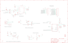

Contents
========

* [PRS17354 > Sparkfun](#prs17354--sparkfun)
	* [Images](#images)
	* [Tags](#tags)
  
![][im]
# PRS17354 > Sparkfun

- ID: PROJ-SPAR-17354-STAN-01
- Hex ID: PRS17354
- Name: Sparkfun
- Description: Sparkfun

## Images
  
  

|kicadPcb3d|kicadPcb3dFront|kicadPcb3dBack|eagleSchemImage|
| :---: | :---: | :---: | :---: |
|||||

## Tags

- hexID: PRS17354
- oompType: PROJ
- oompSize: SPAR
- oompColor: 17354
- oompDesc: STAN
- oompIndex: 01
- oompName: nRF9160 Thing Plus
- sources: All source files from https://github.com/sparkfun/nRF9160_Thing_Plus (source licence details in srcLicense.md)
- linkBuyPage: https://www.sparkfun.com/products/17354
- oompID: PROJ-SPAR-17354-STAN-01

[im]: kicadPcb3d_450.png
